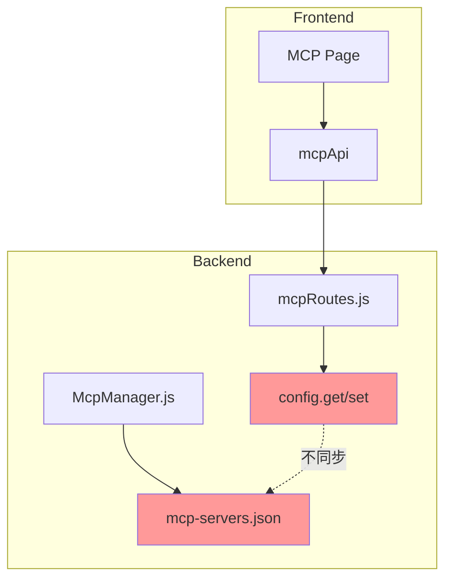
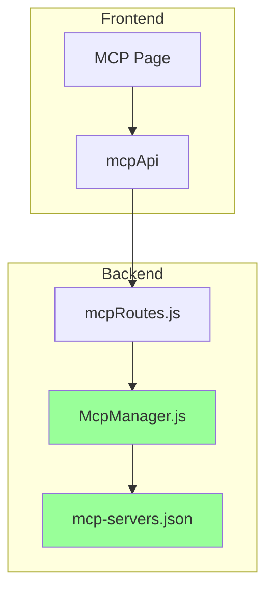

# Design Document: MCP Configuration Fix

## Overview

本设计文档描述了修复MCP配置管理功能的技术方案。主要解决配置文件自动创建、HTTP/SSE服务器连接支持、后端API完整性、配置存储统一以及工具上下文Bot对象获取等问题。

## Architecture

### 当前架构问题



### 修复后架构



## Components and Interfaces

### 1. McpManager 配置管理改进

```javascript
// 改进后的配置加载方法
loadServersConfig() {
    try {
        // 确保目录存在
        const dir = path.dirname(MCP_SERVERS_FILE)
        if (!fs.existsSync(dir)) {
            fs.mkdirSync(dir, { recursive: true })
        }
        
        // 如果文件不存在，创建默认配置
        if (!fs.existsSync(MCP_SERVERS_FILE)) {
            this.serversConfig = { servers: {} }
            this.saveServersConfig()
            return this.serversConfig
        }
        
        const content = fs.readFileSync(MCP_SERVERS_FILE, 'utf-8')
        this.serversConfig = JSON.parse(content)
        if (!this.serversConfig.servers) {
            this.serversConfig.servers = {}
        }
    } catch (error) {
        logger.error('[MCP] 加载服务器配置失败:', error.message)
        this.serversConfig = { servers: {} }
    }
    return this.serversConfig
}
```

### 2. mcpRoutes API 改进

```javascript
// 改进后的创建服务器API
router.post('/servers', async (req, res) => {
    try {
        const { name, config } = req.body
        if (!name) {
            return res.status(400).json(ChaiteResponse.fail(null, 'name is required'))
        }
        
        // 验证配置
        const serverConfig = config || {}
        const type = serverConfig.type || 'stdio'
        
        // 根据类型验证必需字段
        if (type === 'stdio' && !serverConfig.command) {
            return res.status(400).json(ChaiteResponse.fail(null, 'command is required for stdio type'))
        }
        if (type === 'npm' && !serverConfig.package) {
            return res.status(400).json(ChaiteResponse.fail(null, 'package is required for npm type'))
        }
        if ((type === 'sse' || type === 'http') && !serverConfig.url) {
            return res.status(400).json(ChaiteResponse.fail(null, 'url is required for sse/http type'))
        }
        
        // 使用 McpManager 添加服务器
        await mcpManager.init()
        const result = await mcpManager.addServer(name, serverConfig)
        
        res.status(201).json(ChaiteResponse.ok(result))
    } catch (error) {
        res.status(500).json(ChaiteResponse.fail(null, error.message))
    }
})
```

### 3. ToolContext Bot对象获取修复

```javascript
// 修复后的 getBot 方法
getBot(botId) {
    // 优先从 event.bot 获取
    if (this.event?.bot) return this.event.bot
    if (this.bot) return this.bot
    
    const framework = getBotFramework()
    if (framework === 'trss' && botId && Bot.bots?.get) {
        return Bot.bots.get(botId) || Bot
    }
    return Bot
}

// 修复后的 getAdapter 方法
getAdapter() {
    if (this._adapterInfo) return this._adapterInfo
    
    // 优先从 event.bot 获取 Bot 对象
    const bot = this.event?.bot || this.bot || this.getBot()
    const botId = bot?.uin || bot?.self_id || 'default'
    
    // 检查缓存
    if (adapterCache.has(botId)) {
        this._adapterInfo = adapterCache.get(botId)
        return this._adapterInfo
    }
    
    // 检测并缓存
    this._adapterInfo = detectAdapter(bot)
    adapterCache.set(botId, this._adapterInfo)
    return this._adapterInfo
}
```

## Data Models

### MCP服务器配置结构

```typescript
interface McpServerConfig {
    // 服务器类型
    type: 'stdio' | 'npm' | 'sse' | 'http'
    
    // stdio 类型配置
    command?: string
    args?: string[]
    
    // npm 类型配置
    package?: string
    
    // sse/http 类型配置
    url?: string
    headers?: Record<string, string>
    
    // 通用配置
    env?: Record<string, string>
}

interface McpServersFile {
    servers: Record<string, McpServerConfig>
}
```

### 配置文件示例

```json
{
    "servers": {
        "local-server": {
            "type": "stdio",
            "command": "node",
            "args": ["server.js"],
            "env": {}
        },
        "npm-server": {
            "type": "npm",
            "package": "@modelcontextprotocol/server-filesystem",
            "args": ["/"],
            "env": {}
        },
        "remote-sse": {
            "type": "sse",
            "url": "http://localhost:8080/mcp",
            "headers": {
                "Authorization": "Bearer token"
            }
        },
        "remote-http": {
            "type": "http",
            "url": "http://localhost:8080/api/mcp",
            "headers": {}
        }
    }
}
```


## Correctness Properties

*A property is a characteristic or behavior that should hold true across all valid executions of a system-essentially, a formal statement about what the system should do. Properties serve as the bridge between human-readable specifications and machine-verifiable correctness guarantees.*

### Property 1: 配置文件自动创建

*For any* initial state where the config file does not exist, when McpManager.loadServersConfig() is called, the config file SHALL be created with a valid JSON structure containing an empty servers object.

**Validates: Requirements 1.1, 1.2**

### Property 2: API配置字段完整性

*For any* MCP server configuration containing type, command, args, url, package, env, or headers fields, when the configuration is submitted via the API, all provided fields SHALL be stored and retrievable without data loss.

**Validates: Requirements 3.1, 3.2, 3.4**

### Property 3: 配置存储一致性

*For any* server configuration written by McpRoutes, when McpManager reads the configuration, it SHALL retrieve the exact same configuration data (round-trip consistency).

**Validates: Requirements 4.1, 4.2, 4.3, 4.4**

### Property 4: Bot对象获取优先级

*For any* ToolContext with an event containing a bot property, when getBot() or getAdapter() is called, the Bot object from event.bot SHALL be used instead of any other Bot object.

**Validates: Requirements 6.1, 6.2, 6.3, 6.4**

### Property 5: 服务器状态返回完整性

*For any* registered MCP server, when getServer() is called, the returned object SHALL contain name, status, type, and config fields.

**Validates: Requirements 5.3**

## Error Handling

### 配置文件错误处理

1. **文件不存在**: 自动创建默认配置文件
2. **JSON解析失败**: 记录错误日志，使用空配置继续运行
3. **目录不存在**: 自动创建目录结构
4. **写入失败**: 记录错误日志，不影响内存中的配置

### 连接错误处理

1. **SSE连接超时**: 10秒超时，记录错误状态
2. **HTTP请求失败**: 记录错误信息，允许重试
3. **服务器不可达**: 记录错误状态，保留配置以便后续重连

## Testing Strategy

### 单元测试

1. **配置文件管理测试**
   - 测试文件不存在时的自动创建
   - 测试目录不存在时的自动创建
   - 测试JSON解析错误处理

2. **API字段验证测试**
   - 测试各类型服务器的必需字段验证
   - 测试配置字段的完整存储和读取

3. **Bot对象获取测试**
   - 测试event.bot优先级
   - 测试fallback到全局Bot

### 属性测试

使用 fast-check 或类似的属性测试库：

1. **配置文件创建属性测试**: 验证任意初始状态下配置文件都能正确创建
2. **配置字段完整性属性测试**: 验证任意配置字段组合都能正确存储和读取
3. **配置一致性属性测试**: 验证写入和读取的配置数据一致
4. **Bot对象优先级属性测试**: 验证event.bot始终优先于其他Bot对象

### 测试框架

- 单元测试: Jest 或 Vitest
- 属性测试: fast-check
- 最小迭代次数: 100次
