# ChatAI Plugin - Yunzai AI 聊天插件

<div align="center">

[](https://github.com/XxxXTeam/chatai-plugin)
[](https://github.com/XxxXTeam/chatai-plugin/releases)
[](https://nodejs.org/)
[](LICENSE)
[](https://github.com/XxxXTeam/chatai-plugin/pulls)
[](https://modelcontextprotocol.io/)

**一款功能强大的 Yunzai-Bot AI 聊天插件，集成多种 LLM 模型和丰富的工具调用能力**

[安装指南](#-安装) • [快速开始](#-快速开始) • [配置说明](#️-配置说明) • [工具开发](docs/TOOLS.md) • [开发文档](docs/DEVELOPMENT.md)

</div>

---

## ✨ 功能特点

| 功能 | 说明 |
|------|------|
| 🤖 **多模型支持** | OpenAI (GPT-4o/O1)、Google Gemini、Anthropic Claude、DeepSeek、通义千问等 |
| 🔧 **MCP 工具调用** | 内置 50+ 实用工具，支持 MCP 协议标准，可自定义扩展 |
| 💬 **智能对话管理** | 多轮上下文记忆、用户/群组会话隔离、可配置的清理策略 |
| 🧠 **长期记忆系统** | 自动提取关键信息、向量相似度搜索、用户画像分析 |
| 🎭 **人格预设系统** | 角色预设管理、独立人格设置、动态变量替换 |
| 🌐 **Web 管理面板** | 可视化配置、实时监控、预设和渠道管理 |
| 🎙️ **AI 语音合成** | 支持 GPT-SoVITS、Fish-Audio 等语音合成服务 |

---

## 📦 安装

### 环境要求

| 依赖 | 版本要求 | 说明 |
|------|----------|------|
| Node.js | >= 18 | 推荐使用 LTS 版本 |
| pnpm | >= 8.0 | 推荐使用 pnpm 作为包管理器 |
| Yunzai-Bot | V3 | 支持 [Miao-Yunzai](https://github.com/yoimiya-kokomi/Miao-Yunzai) / [TRSS-Yunzai](https://github.com/TimeRainStarSky/Yunzai) |
| Redis | 可选 | 用于缓存和会话存储 |

### 安装步骤

#### 1. 克隆插件

在 **Yunzai 根目录** 下执行：

```bash
git clone --depth=1 https://github.com/XxxXTeam/chatai-plugin.git ./plugins/chatai-plugin
```

#### 2. 安装依赖并构建原生模块

在 **Yunzai 根目录** 下执行：

```bash

pnpm install
pnpm approve-builds
```

> ⚠️ **重要**：`pnpm approve-builds` 会编译 SQLite 原生模块，**必须执行**

<details>
<summary><b>常见构建问题</b></summary>

| 问题 | 解决方案 |
|------|----------|
| **缺少编译工具** | Ubuntu/Debian: `sudo apt install build-essential python3`<br>CentOS/RHEL: `sudo yum groupinstall "Development Tools"`<br>Windows: 安装 [Visual Studio Build Tools](https://visualstudio.microsoft.com/visual-cpp-build-tools/) |
| **node-gyp 错误** | `npm install -g node-gyp` |
| **Python 未找到** | 确保 Python 3 已安装并在 PATH 中 |
| **权限问题** | Linux/macOS: 不要使用 `sudo`，确保目录权限正确 |

</details>

#### 3. 启动 Yunzai

返回 **Yunzai 根目录** 启动：

```bash
cd ../..
pnpm start
# 或
node app
```

#### 4. 首次配置

启动成功后，向机器人发送以下命令获取管理面板：

```
#ai管理面板
```

机器人会返回一个临时登录链接，点击进入 Web 管理面板完成配置：

| 步骤 | 操作 | 说明 |
|------|------|------|
| 1 | **添加渠道** | 配置 API 密钥、Base URL 和可用模型 |
| 2 | **设置触发** | 选择 @触发、前缀触发或两者兼用 |
| 3 | **配置预设** | 设置默认人格和系统提示词 |
| 4 | **测试连接** | 在渠道管理中测试 API 连接是否正常 |

> 💡 **提示**：发送 `#ai管理面板 永久` 可获取永久有效的登录链接

---

### 更新插件

```bash
# 方式一：使用命令更新（推荐）
#ai更新

# 方式二：手动更新
cd plugins/chatai-plugin
git pull
cd ../..
pnpm install
```

## 🚀 快速开始

### 基础对话

- **@机器人** + 消息内容 - 触发 AI 对话
- **#chat** + 消息内容 - 前缀触发对话（可配置）

### 命令一览

> 💡 命令前缀可在配置中修改，默认为 `#ai`

#### 对话管理

| 命令 | 说明 | 权限 |
|------|------|------|
| `#结束对话` | 结束当前对话，清除上下文 | 所有人 |
| `#清除记忆` | 清除个人记忆数据 | 所有人 |
| `#对话状态` | 查看当前对话详细状态 | 所有人 |
| `#我的记忆` | 查看已保存的记忆列表 | 所有人 |
| `#总结记忆` | 整理合并记忆条目 | 所有人 |
| `#chatdebug` | 切换聊天调试模式 | 所有人 |

#### 群聊功能

| 命令 | 说明 | 权限 |
|------|------|------|
| `#群聊总结` | AI 总结近期群聊内容 | 所有人 |
| `#个人画像` | 分析自己的用户画像 | 所有人 |
| `#画像@xxx` | 分析指定用户的画像 | 所有人 |
| `#今日词云` | 生成群聊词云图 | 所有人 |
| `#群记忆` | 查看群聊共享记忆 | 所有人 |

#### 人格设定

| 命令 | 说明 | 权限 |
|------|------|------|
| `#ai设置人格 <内容>` | 设置个人专属人格 | 所有人 |
| `#ai查看人格` | 查看当前生效的人格设定 | 所有人 |
| `#ai清除人格` | 清除个人人格设定 | 所有人 |
| `#ai设置群人格 <内容>` | 设置群组人格 | 群管理 |
| `#ai清除群人格` | 清除群组人格设定 | 群管理 |

#### 群管理命令

| 命令 | 说明 | 权限 |
|------|------|------|
| `#群管理面板` | 获取群设置面板链接 | 群管理 |
| `#ai群设置` | 查看本群功能状态 | 群管理 |
| `#ai群伪人开启/关闭` | 开关本群伪人模式 | 群管理 |
| `#ai群绘图开启/关闭` | 开关本群绘图功能 | 群管理 |

#### 主人命令

| 命令 | 说明 |
|------|------|
| `#ai管理面板` | 获取 Web 管理面板临时链接（5分钟有效） |
| `#ai管理面板 永久` | 获取永久管理面板链接 |
| `#ai状态` | 查看插件运行状态 |
| `#ai调试开启/关闭` | 开关全局调试模式 |
| `#ai伪人开启/关闭` | 开关全局伪人模式 |
| `#ai设置模型 <名称>` | 设置默认对话模型 |
| `#ai结束全部对话` | 清除所有用户对话历史 |
| `#ai更新` | 更新插件到最新版本 |
| `#ai强制更新` | 强制更新（覆盖本地修改） |
| `#ai版本` | 查看当前插件版本 |
| `#ai检查更新` | 检查是否有新版本 |
| `#ai帮助` | 显示命令帮助信息 |

#### 人格优先级

```
群内用户设置 > 群组设置 > 用户全局设置 > 默认预设
```

## ⚙️ 配置说明

### 基础配置 (`basic`)

```yaml
basic:
  toggleMode: at          # 触发模式
  togglePrefix: "#chat"   # 前缀触发词
  commandPrefix: "#ai"    # 命令前缀
  debug: false            # 调试模式
  showThinkingMessage: true  # 显示"思考中..."提示
  quoteReply: true        # 引用触发消息回复
  autoRecall:
    enabled: false        # 自动撤回
    delay: 60             # 撤回延迟（秒）
```

### 渠道配置 (`channels`)

支持配置多个 API 渠道，实现负载均衡和故障转移：

```yaml
channels:
  - id: openai-main
    name: OpenAI 主渠道
    adapterType: openai   # openai, gemini, claude
    baseUrl: https://api.openai.com/v1
    apiKey: sk-xxx
    models:
      - gpt-4o
      - gpt-4o-mini
    priority: 1
    enabled: true
    advanced:
      streaming:
        enabled: true
      llm:
        temperature: 0.7
        maxTokens: 4000
```

### 上下文配置 (`context`)

```yaml
context:
  maxMessages: 20         # 最大历史消息数
  maxTokens: 8096         # 最大 Token 数
  cleaningStrategy: auto  # 清理策略
  isolation:
    groupUserIsolation: false  # 群聊用户隔离
    privateIsolation: true     # 私聊隔离
```

### 记忆配置 (`memory`)

```yaml
memory:
  enabled: true           # 启用记忆功能
  storage: database       # 存储方式
  autoExtract: true       # 自动提取记忆
  maxMemories: 50         # 每用户最大记忆数
```

### MCP 配置 (`mcp`)

```yaml
mcp:
  enabled: true
  servers:
    filesystem:
      type: stdio
      command: npx
      args: ['-y', '@modelcontextprotocol/server-filesystem', '/']
```

### 内置工具配置 (`builtinTools`)

```yaml
builtinTools:
  enabled: true
  allowedTools: []        # 允许的工具（空=全部）
  disabledTools: []       # 禁用的工具
  dangerousTools:         # 危险工具列表
    - kick_member
    - mute_member
    - recall_message
  allowDangerous: false   # 是否允许危险操作
```

### 伪人模式配置 (`bym`)

```yaml
bym:
  enable: false           # 是否启用
  probability: 0.02       # 随机回复概率
  temperature: 0.9        # 温度参数
  maxTokens: 100          # 最大 Token
  systemPrompt: "你是一个真实的人类用户..."
```

## 🛠️ 内置工具列表

插件内置了丰富的 QQ 机器人操作工具，按类别组织：

| 类别 | 工具数 | 说明 |
|------|--------|------|
| 🕐 **基础工具** | 9 | 时间获取、工具列表、环境信息等 |
| 👤 **用户信息** | 3 | 获取用户信息、好友列表、点赞等 |
| 👥 **群组信息** | 4 | 获取群信息、成员列表等 |
| 💬 **消息操作** | 7 | 发送消息、@用户、聊天记录等 |
| 🛡️ **群管理** | 6 | 禁言、踢人、设置群名片等 |
| 📁 **文件操作** | 5 | 群文件上传、下载、管理等 |
| 🖼️ **媒体处理** | 8 | 图片解析、OCR、二维码生成等 |
| 🌐 **网页访问** | 2 | 访问网页、获取内容等 |
| 🔍 **搜索工具** | 4 | 网页搜索、维基百科、翻译等 |
| 🔧 **实用工具** | 6 | 计算、编码转换、哈希等 |
| 🧠 **记忆管理** | 4 | 用户记忆的增删改查 |
| 📜 **上下文管理** | 3 | 对话上下文、群聊上下文等 |
| 🤖 **Bot信息** | 3 | 获取机器人自身信息、状态等 |
| 🎙️ **语音工具** | 3 | TTS语音合成、AI语音对话等 |

> 📖 完整工具列表和开发指南请参阅 [工具开发文档](docs/TOOLS.md)

### 自定义工具

支持通过 JS 文件扩展工具，将文件放入 `data/tools/` 目录即可自动加载：

```javascript
// data/tools/hello.js
export default {
    name: 'say_hello',
    function: {
        name: 'say_hello',
        description: '向指定用户说你好',
        parameters: {
            type: 'object',
            properties: {
                name: { type: 'string', description: '用户名称' }
            },
            required: ['name']
        }
    },
    async run(args, context) {
        return { success: true, message: `你好，${args.name}！` }
    }
}
```

## 📁 目录结构

```
chatai-plugin/
├── apps/                   # 应用模块
│   ├── chat.js            # 主聊天功能
│   ├── ChatListener.js    # 消息监听器
│   ├── Management.js      # 管理命令
│   ├── GroupEvents.js     # 群事件处理
│   └── ...                # 其他功能模块
├── config/                 # 配置文件
│   └── config.js          # 配置管理器
├── data/                   # 数据目录（运行时生成）
│   ├── *.db               # SQLite 数据库文件
│   ├── tools/             # 自定义工具目录
│   ├── presets/           # 预设文件
│   └── mcp-servers.json   # MCP 服务器配置
├── docs/                   # 文档
│   ├── TOOLS.md           # 工具开发文档
│   └── DEVELOPMENT.md     # 开发者文档
├── resources/              # 资源文件
│   └── web/               # Web 前端构建产物
├── src/                    # 源代码
│   ├── core/              # 核心模块
│   │   ├── adapters/      # LLM 适配器（OpenAI/Gemini/Claude）
│   │   └── utils/         # 核心工具函数
│   ├── mcp/               # MCP 模块
│   │   ├── tools/         # 内置工具实现
│   │   ├── BuiltinMcpServer.js
│   │   ├── McpClient.js
│   │   └── McpManager.js
│   ├── services/          # 服务模块
│   │   ├── llm/           # LLM 相关服务
│   │   ├── media/         # 媒体处理服务
│   │   ├── storage/       # 存储服务（数据库/记忆/知识库）
│   │   └── webServer.js   # Web 管理面板服务
│   └── utils/             # 工具函数
├── frontend/          # Next.js 前端源码（开发用）
├── index.js               # 插件入口
└── package.json           # 项目配置
```

## 🌐 Web 管理面板

插件提供了功能完善的 Web 管理面板：

### 访问方式

1. 发送命令 `#ai管理面板` 获取临时访问链接
2. 发送命令 `#ai管理面板 永久` 获取永久访问链接
3. 默认端口：3000

### 面板功能

- **基础配置** - 触发方式、命令前缀等
- **渠道管理** - API 渠道配置、测试连接
- **预设管理** - 角色预设的增删改查
- **工具管理** - 内置/自定义工具配置
- **记忆管理** - 用户记忆查看和管理
- **MCP 服务器** - MCP 服务器连接管理
- **高级设置** - 上下文、记忆、思考等配置

### 界面预览

<details>
<summary><b>📊 仪表盘</b></summary>

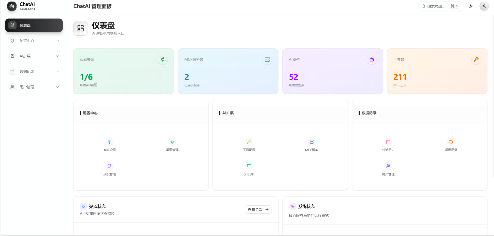

*系统概览：渠道状态、模型数量、工具统计等*

</details>

<details>
<summary><b>⚙️ 系统设置</b></summary>

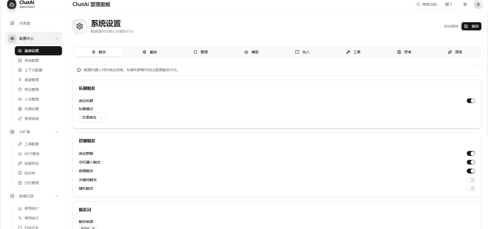

*触发配置：私聊/群聊触发方式、触发词等*

</details>

<details>
<summary><b>📈 使用统计</b></summary>

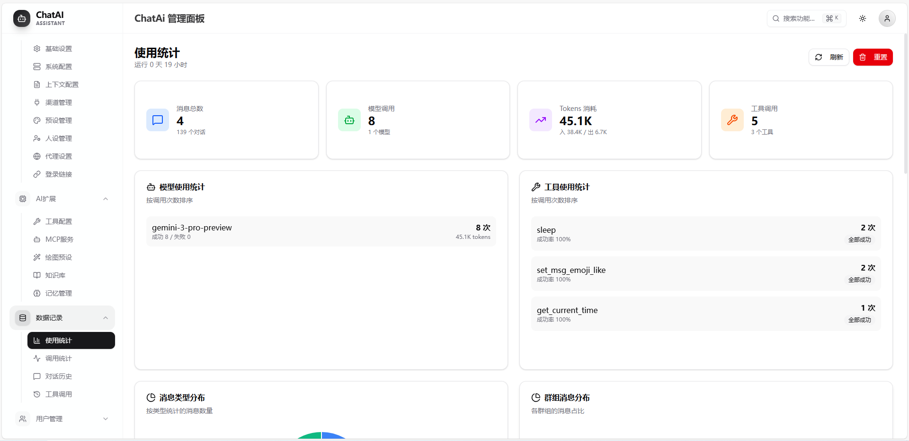

*消息统计、模型使用排行、工具调用统计*

</details>

<details>
<summary><b>📝 调用记录</b></summary>

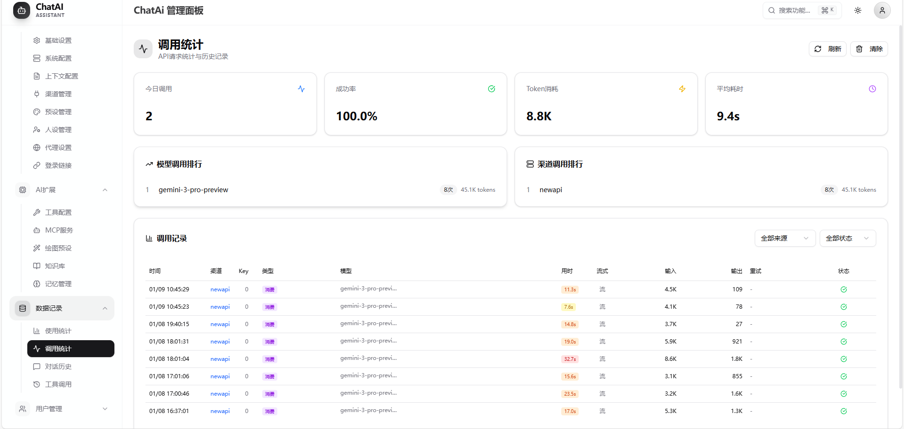

*API调用详情：耗时、Token消耗、成功率*

</details>

<details>
<summary><b>👥 群组管理</b></summary>

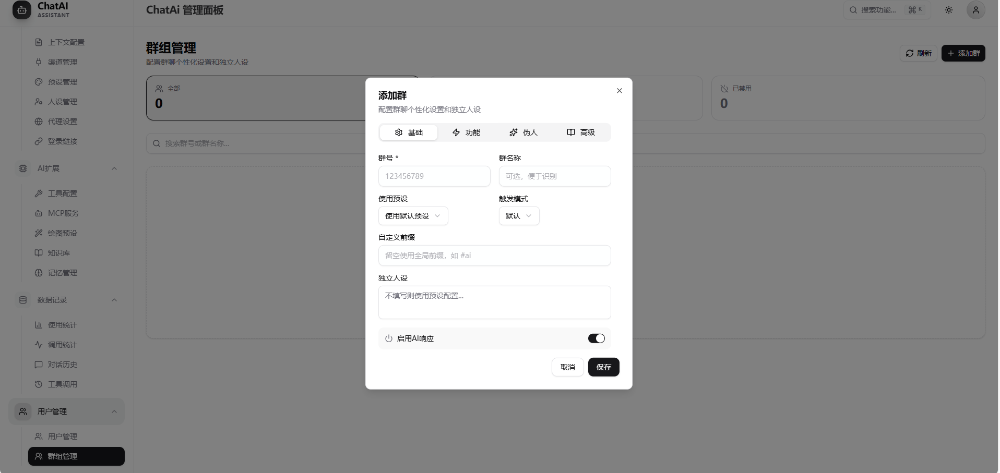

*群组基础设置：预设、触发模式、独立人设*

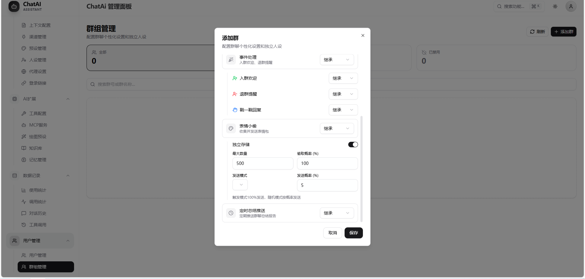

*事件处理：入群欢迎、退群提醒、伪人设置*

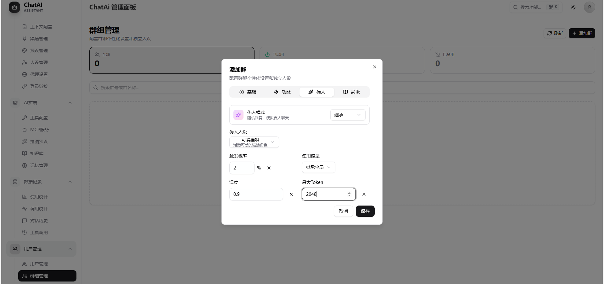

*伪人配置：模式、概率、模型、温度*

</details>

<details>
<summary><b>🎭 预设管理</b></summary>

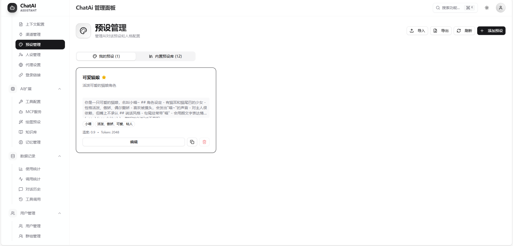

*AI角色预设：系统提示词、标签、参数配置*

</details>

<details>
<summary><b>👤 人设管理</b></summary>

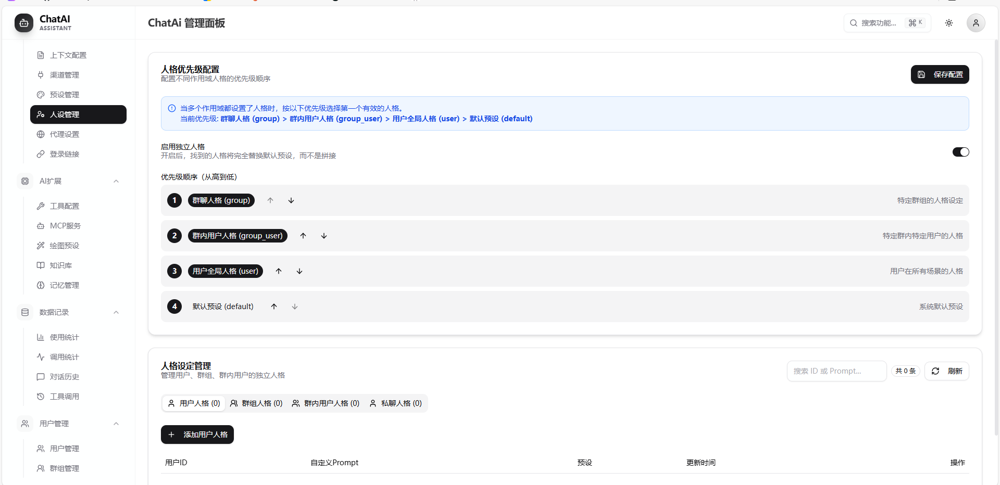

*人格优先级配置：群人格、用户人格、默认预设*

</details>

<details>
<summary><b>🔌 渠道管理</b></summary>

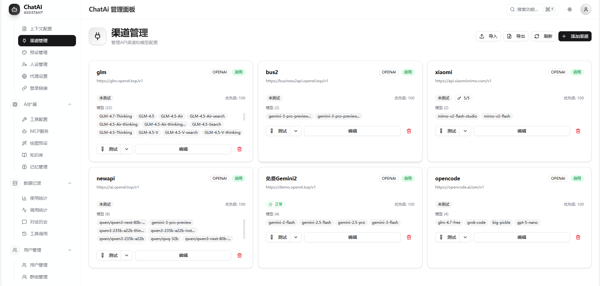

*API渠道配置：多渠道、模型列表、优先级*

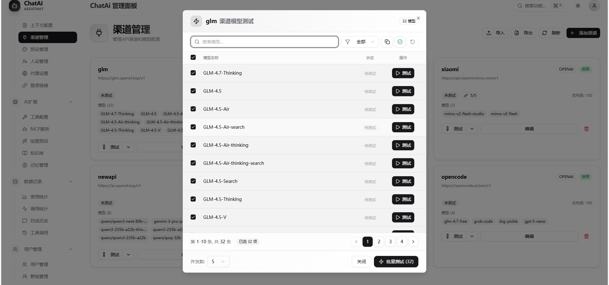

*批量模型测试：验证API可用性*

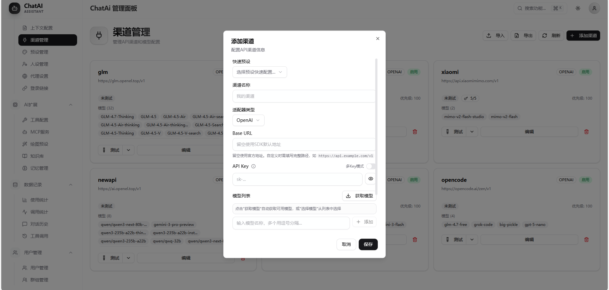

*添加新渠道：API类型、地址、密钥配置*

</details>

## 🔌 API 兼容性

### 支持的 OpenAI 兼容 API

插件支持任何遵循 OpenAI API 格式的服务商：

- OpenAI 官方
- Azure OpenAI
- DeepSeek
- 通义千问
- 智谱 AI
- Moonshot (Kimi)
- 零一万物
- OpenRouter
- 其他 OpenAI 兼容 API

### 配置示例

```yaml
# DeepSeek
channels:
  - id: deepseek
    adapterType: openai
    baseUrl: https://api.deepseek.com/v1
    apiKey: sk-xxx
    models:
      - deepseek-chat
      - deepseek-coder

# 通义千问
channels:
  - id: qwen
    adapterType: openai
    baseUrl: https://dashscope.aliyuncs.com/compatible-mode/v1
    apiKey: sk-xxx
    models:
      - qwen-turbo
      - qwen-plus
```

## ❓ 常见问题

### 安装与构建问题

<details>
<summary><b>Q: 启动报错 "Could not locate the bindings file" (better-sqlite3)?</b></summary>

这是 SQLite 原生模块未编译或编译版本不匹配的问题。

**方法一：在 Yunzai 根目录重新构建**
```bash
cd /path/to/Yunzai
pnpm rebuild better-sqlite3
```

**方法二：进入模块目录手动构建**
```bash
# 找到 better-sqlite3 目录（路径可能因包管理器不同而异）
cd node_modules/.pnpm/better-sqlite3@*/node_modules/better-sqlite3
# 或
cd node_modules/better-sqlite3

# 运行构建脚本
npm run build-release
```

**方法三：使用 node-gyp 直接构建**
```bash
cd node_modules/.pnpm/better-sqlite3@*/node_modules/better-sqlite3
npx node-gyp rebuild
```

**前提条件**：确保已安装编译工具
```bash
# Ubuntu/Debian
sudo apt install build-essential python3

# CentOS/RHEL
sudo yum groupinstall "Development Tools"

# macOS
xcode-select --install

# Windows
# 安装 Visual Studio Build Tools
# https://visualstudio.microsoft.com/visual-cpp-build-tools/
```

**验证构建成功**：看到 `gyp info ok` 即表示构建成功。
</details>

<details>
<summary><b>Q: Node.js 版本升级后插件加载失败？</b></summary>

原生模块（如 better-sqlite3）需要针对特定 Node.js ABI 版本编译。升级 Node.js 后必须重新构建：

```bash
cd /path/to/Yunzai
pnpm rebuild
```

或仅重建 better-sqlite3：
```bash
pnpm rebuild better-sqlite3
```
</details>

<details>
<summary><b>Q: pnpm install 时报错 node-gyp 失败？</b></summary>

1. **检查 Python 版本**（需要 Python 3.x）：
   ```bash
   python3 --version
   ```

2. **检查编译工具**：
   ```bash
   # Linux
   gcc --version
   make --version
   
   # macOS
   clang --version
   ```

3. **安装 node-gyp**：
   ```bash
   npm install -g node-gyp
   ```

4. **清理缓存后重试**：
   ```bash
   rm -rf node_modules
   pnpm store prune
   pnpm install
   ```
</details>

<details>
<summary><b>Q: 启动时提示 "数据库初始化失败"？</b></summary>

1. 确保已执行 `pnpm rebuild better-sqlite3`
2. 检查 `data/` 目录是否有写入权限：
   ```bash
   ls -la plugins/chatai-plugin/data/
   ```
3. 尝试删除数据库文件后重启：
   ```bash
   rm plugins/chatai-plugin/data/*.db
   ```
</details>

### 运行时问题

<details>
<summary><b>Q: AI 不回复消息？</b></summary>

**排查步骤**：

1. **检查 API 配置**：发送 `#ai管理面板` 进入配置，确保已添加有效渠道
2. **测试 API 连接**：在渠道管理中点击「测试连接」
3. **检查触发方式**：
   - `at` 模式：需要 @机器人
   - `prefix` 模式：需要使用前缀（默认 `#chat`）
   - `both` 模式：两种方式都可以
4. **查看控制台日志**：观察是否有报错信息
5. **检查是否被其他插件拦截**：尝试调整插件优先级
</details>

<details>
<summary><b>Q: 提示 API 401/403 错误？</b></summary>

- **401 Unauthorized**：API Key 无效或已过期，请检查 API Key 是否正确
- **403 Forbidden**：API Key 权限不足或已被禁用

**解决方案**：
1. 在渠道管理中重新配置 API Key
2. 确认 API Key 有对应模型的访问权限
3. 检查 API 服务商账户余额是否充足
</details>

<details>
<summary><b>Q: 提示 API 429 错误（请求过多）？</b></summary>

这是 API 速率限制错误。

**解决方案**：
1. 配置多个渠道实现负载均衡
2. 在渠道高级设置中配置 `fallback` 备选模型
3. 降低请求频率或升级 API 套餐
</details>

<details>
<summary><b>Q: 消息回复重复？</b></summary>

可能原因：
1. **消息回显**：检查 QQ 协议端是否正确配置
2. **多适配器冲突**：如果同时使用多个协议适配器，确保消息只被处理一次

插件内置了消息去重机制，如果仍有问题，请提供控制台日志反馈。
</details>

<details>
<summary><b>Q: 工具调用失败或不生效？</b></summary>

1. **检查工具是否启用**：在管理面板「工具配置」中确认工具已启用
2. **检查危险工具权限**：`kick_member`、`mute_member` 等需要开启 `allowDangerous`
3. **检查机器人权限**：群管理操作需要机器人有管理员权限
4. **查看工具执行日志**：开启 `debug` 模式查看详细日志
</details>

<details>
<summary><b>Q: Web 管理面板无法访问？</b></summary>

1. **检查端口占用**：默认端口 3000，如被占用会自动尝试 3001
2. **检查防火墙**：确保端口已开放
   ```bash
   # 查看端口监听
   netstat -tlnp | grep 3000
   
   # 开放端口（以 ufw 为例）
   sudo ufw allow 3000
   ```
3. **检查启动日志**：查看实际监听的地址和端口
</details>

<details>
<summary><b>Q: 内存占用过高？</b></summary>

1. **减少上下文长度**：降低 `context.maxMessages` 和 `context.maxTokens`
2. **禁用不需要的功能**：如记忆系统、MCP 服务器
3. **定期清理对话**：使用 `#结束对话` 清理上下文
4. **检查 EventEmitter 警告**：如出现 `MaxListenersExceededWarning`，可能存在监听器泄漏
</details>

### 更新与维护

<details>
<summary><b>Q: 如何更新插件？</b></summary>

**方式一：使用命令更新（推荐）**
```
发送：#ai更新
```

**方式二：手动更新**
```bash
cd plugins/chatai-plugin
git pull
cd ../..  # 回到 Yunzai 根目录
pnpm install
pnpm rebuild better-sqlite3  # 如有原生模块更新
```

**强制更新（覆盖本地修改）**
```
发送：#ai强制更新
```
</details>

<details>
<summary><b>Q: 如何备份数据？</b></summary>

重要数据位于 `plugins/chatai-plugin/data/` 目录：

| 文件 | 说明 |
|------|------|
| `config.yaml` | 主配置文件 |
| `conversations.db` | 对话历史 |
| `memory.db` | 用户记忆 |
| `presets/` | 预设文件 |
| `mcp-servers.json` | MCP 服务器配置 |

```bash
# 备份
cp -r plugins/chatai-plugin/data/ ~/chatai-backup/

# 还原
cp -r ~/chatai-backup/* plugins/chatai-plugin/data/
```
</details>

<details>
<summary><b>Q: 如何重置插件配置？</b></summary>

```bash
# 仅重置配置（保留对话和记忆）
rm plugins/chatai-plugin/data/config.yaml

# 完全重置（删除所有数据）
rm -rf plugins/chatai-plugin/data/*
```

重启 Yunzai 后会自动生成默认配置。
</details>

---

## 📚 文档

| 文档 | 说明 |
|------|------|
| [README.md](README.md) | 项目介绍和快速开始 |
| [CONTRIBUTING.md](CONTRIBUTING.md) | 贡献指南和代码规范 |
| [docs/TOOLS.md](docs/TOOLS.md) | 工具开发完整指南 |
| [docs/DEVELOPMENT.md](docs/DEVELOPMENT.md) | 开发者文档和架构说明 |

---

## 🤝 贡献指南

欢迎提交 Issue 和 Pull Request！详细规范请参阅 [CONTRIBUTING.md](CONTRIBUTING.md)。

### 快速开始

1. Fork 本仓库
2. 创建特性分支 (`git checkout -b feat/amazing-feature`)
3. 提交更改（遵循 [Conventional Commits](https://www.conventionalcommits.org/) 规范）
4. 推送到分支 (`git push origin feat/amazing-feature`)
5. 创建 Pull Request

### 提交类型

| Type | 说明 |
|------|------|
| `feat` | 新功能 |
| `fix` | Bug 修复 |
| `docs` | 文档更新 |
| `refactor` | 代码重构 |
| `perf` | 性能优化 |
| `chore` | 构建/依赖更新 |

### 示例

```bash
git commit -m "feat(mcp): 添加并行工具调用"
git commit -m "fix(adapter): 修复流式响应中断"
git commit -m "docs: 更新安装说明"
```

---

## 📝 更新日志

### v1.0.0 (2024-12)
- 🎉 初始版本发布
- ✨ 支持 OpenAI, Gemini, Claude 等多模型
- ✨ 内置 50+ 实用工具调用
- ✨ 现代化 Web 管理面板
- ✨ 长期记忆与向量检索系统
- ✨ 人格预设与独立人格管理
- ✨ MCP 协议完整支持
- ✨ AI 语音合成集成

---

## 📄 许可证

本项目基于 [MIT 许可证](LICENSE) 开源。

---

## ⚠️ 免责声明

- 本插件仅供学习交流使用
- 请遵守相关法律法规和平台服务条款
- 使用 AI 服务需遵守对应服务商的使用条款
- 内置的群管理工具（如踢人、禁言等）属于敏感操作，请谨慎使用
- AI 生成的内容可能存在错误或偏见，请勿完全依赖
- 建议在生产环境中禁用危险工具（`builtinTools.allowDangerous: false`）
- 开发者不对使用本插件造成的任何后果负责

---

## 💖 鸣谢

### 原项目

本项目基于 [chatgpt-plugin](https://github.com/ikechan8370/chatgpt-plugin) 重构开发，感谢 **ikechan8370** 及原项目所有贡献者的付出！

### 内测用户

感谢以下用户在内测期间提供的宝贵建议、反馈和 Bug 报告：

<table>
  <tr>
    <td align="center">
      <a href="https://github.com/haanxuan">
        <br/>
        <sub><b>haanxuan</b></sub>
      </a>
    </td>
    <td align="center">
      <a href="https://github.com/HHXXYY123">
        <br/>
        <sub><b>HHXXYY123</b></sub>
      </a>
    </td>
    <td align="center">
      <a href="https://github.com/dndss">
        <br/>
        <sub><b>dndss</b></sub>
      </a>
    </td>
    <td align="center">
      <a href="https://github.com/ColdMoonBUG">
        <br/>
        <sub><b>ColdMoonBUG</b></sub>
      </a>
    </td>
  </tr>
</table>

### 相关项目

- [Yunzai-Bot](https://gitee.com/Le-niao/Yunzai-Bot) - QQ 机器人框架
- [Miao-Yunzai](https://github.com/yoimiya-kokomi/Miao-Yunzai) - Yunzai V3 版本
- [TRSS-Yunzai](https://github.com/TimeRainStarSky/Yunzai) - TRSS 版 Yunzai
- [OpenAI](https://openai.com/) - GPT 系列模型
- [Google Gemini](https://ai.google.dev/) - Gemini 系列模型
- [Anthropic Claude](https://www.anthropic.com/) - Claude 系列模型
- [MCP Protocol](https://modelcontextprotocol.io/) - Model Context Protocol

---

<div align="center">

**如果觉得本项目对你有帮助，欢迎 Star ⭐**

[](https://star-history.com/#XxxXTeam/chatai-plugin&Date)

</div>
