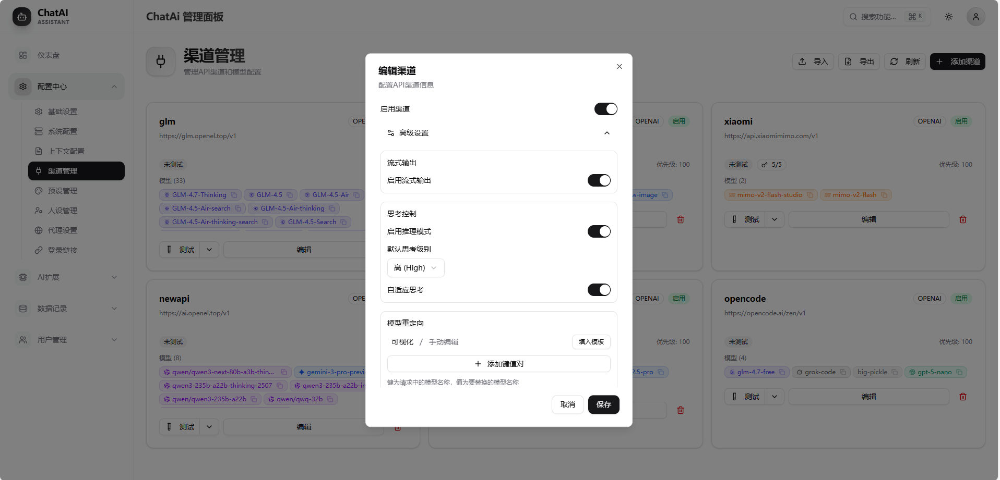
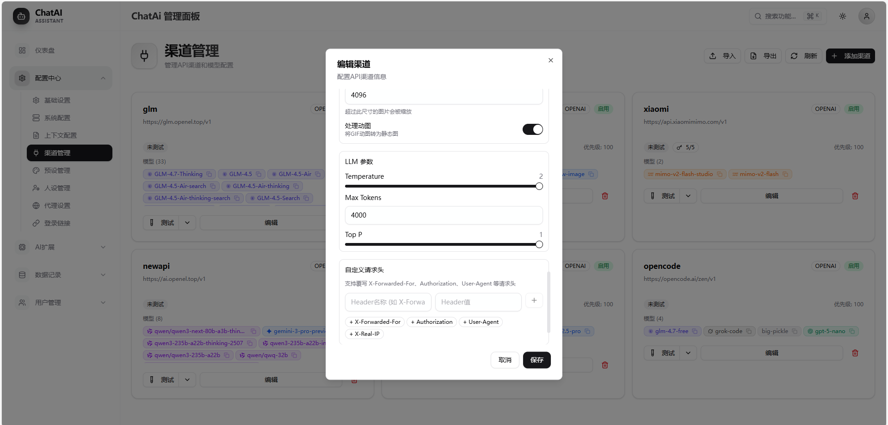

# ChatAI Plugin - Yunzai AI 聊天插件

<div align="center">

[](https://github.com/XxxXTeam/chatai-plugin)
[](https://github.com/XxxXTeam/chatai-plugin/releases)
[](https://nodejs.org/)
[](LICENSE)
[](https://github.com/XxxXTeam/chatai-plugin/pulls)
[](https://modelcontextprotocol.io/)

**一款功能强大的 Yunzai-Bot AI 聊天插件，集成多种 LLM 模型和丰富的工具调用能力**

> 统一管理聊天、预设、工具与长/短期记忆，给 Yunzai 带来“全栈 AI”体验。

[安装指南](#-安装) • [快速开始](#-快速开始) • [配置说明](#️-配置说明) • [在线文档](https://docs.openel.top/) • [工具开发](docs/TOOLS.md) • [架构文档](docs/ARCHITECTURE.md)

**快速导航**
| 用户指南 | 开发者指南 |
|----------|-----------|
| 🚀 [快速开始](#-快速开始)：命令与用法 | 📁 [目录结构](#-目录结构)：代码组织 |
| ⚙️ [配置说明](#️-配置说明)：YAML 详解 | 🛠️ [内置工具](#-内置工具列表)：工具总览 |
| 🌐 [Web 面板](#-web-管理面板)：界面预览 | 📚 [在线文档](https://docs.openel.top/)：完整文档 |
| ❓ [常见问题](#-常见问题)：故障排除 | 🤝 [贡献指南](#-贡献指南)：参与开发 |

</div>

---


## ✨ 功能特点

### 核心功能

| 功能 | 说明 |
|------|------|
| 🤖 **多模型支持** | OpenAI (GPT-4o/O1/O3)、Google Gemini、Anthropic Claude、DeepSeek、通义千问、智谱、Moonshot 等 |
| 🔧 **MCP 工具调用** | 内置 50+ 实用工具，支持 MCP 协议标准（stdio/npm/SSE/HTTP），可自定义扩展 |
| 💬 **智能对话管理** | 多轮上下文记忆、用户/群组会话隔离、Token 自动压缩、可配置的清理策略 |
| 🧠 **长期记忆系统** | 自动提取关键信息、向量相似度搜索、用户画像分析、群组共享记忆 |
| 🎭 **人格预设系统** | 角色预设管理、独立人格设置、动态变量替换、预设继承与覆盖 |
| 🌐 **Web 管理面板** | 可视化配置、实时统计、预设和渠道管理、群组独立设置 |
| 🎙️ **AI 语音合成** | 支持 GPT-SoVITS、Fish-Audio、Edge-TTS 等语音合成服务 |

### 高级功能

| 功能 | 说明 |
|------|------|
| 🎨 **AI 绘图** | 图像生成、图片编辑、视觉理解，支持多种图像模型 |
| 🤝 **伪人模式** | 模拟真人聊天风格，基于概率随机参与群聊，可配置触发条件 |
| 📢 **主动聊天** | 基于群活跃度智能触发，支持时段概率调整，静默时段控制 |
| 🎯 **Skills Agent** | 智能技能调度系统，工具组管理，并行工具执行，权限过滤 |
| 📊 **使用统计** | API 调用统计、模型使用排行、工具调用分析、Token 消耗追踪 |
| 🔔 **事件响应** | 戳一戳回复、表情回应、入群欢迎、退群提醒、消息撤回处理 |
| 📚 **知识库** | 预设知识库、群组知识库，支持 RAG 检索增强生成 |
| 🔄 **备选模型** | 自动故障转移、多模型轮询、智能重试机制 |

### 支持的模型

<details>
<summary><b>🤖 点击展开完整模型列表</b></summary>

| 提供商 | 支持的模型 | 适配器类型 |
|--------|-----------|-----------|
| **OpenAI** | GPT-4o, GPT-4o-mini, GPT-4-Turbo, O1, O1-mini, O3-mini | `openai` |
| **Anthropic** | Claude 3.5 Sonnet, Claude 3 Opus, Claude 3 Haiku | `claude` |
| **Google** | Gemini 2.0 Flash, Gemini 1.5 Pro, Gemini 1.5 Flash | `gemini` |
| **DeepSeek** | DeepSeek-V3, DeepSeek-R1, DeepSeek-Coder | `openai` |
| **阿里云** | Qwen-Turbo, Qwen-Plus, Qwen-Max, Qwen-Long | `openai` |
| **智谱 AI** | GLM-4, GLM-4-Plus, GLM-4-Flash | `openai` |
| **Moonshot** | Moonshot-v1-8k, Moonshot-v1-32k, Moonshot-v1-128k | `openai` |
| **零一万物** | Yi-Large, Yi-Medium, Yi-Vision | `openai` |
| **OpenRouter** | 100+ 模型聚合 | `openai` |
| **本地部署** | Ollama, LM Studio, vLLM 等 | `openai` |

> 💡 任何兼容 OpenAI API 格式的服务都可以通过 `openai` 适配器接入

</details>

---

## 📦 安装

### 环境要求

| 依赖 | 版本要求 | 说明 |
|------|----------|------|
| Node.js | >= 18 | 推荐使用 LTS 版本 |
| pnpm | >= 8.0 | 推荐使用 pnpm 作为包管理器 |
| Yunzai-Bot | V3 | 支持 [Miao-Yunzai](https://github.com/yoimiya-kokomi/Miao-Yunzai) / [TRSS-Yunzai](https://github.com/TimeRainStarSky/Yunzai) |
| Redis | 可选 | 用于缓存和会话存储 |

### 安装步骤

#### 1. 克隆插件

在 **Yunzai 根目录** 下执行：

```bash
git clone --depth=1 https://github.com/XxxXTeam/chatai-plugin.git ./plugins/chatai-plugin
```

#### 2. 安装依赖并构建原生模块

在 **Yunzai 根目录** 下执行：

```bash
pnpm install
pnpm approve-builds
```

> ⚠️ **重要**：`pnpm approve-builds` 会编译 SQLite 原生模块，**必须执行**

<details>
<summary><b>常见构建问题</b></summary>

| 问题 | 解决方案 |
|------|----------|
| **缺少编译工具** | Ubuntu/Debian: `sudo apt install build-essential python3`<br>CentOS/RHEL: `sudo yum groupinstall "Development Tools"`<br>Windows: 安装 [Visual Studio Build Tools](https://visualstudio.microsoft.com/visual-cpp-build-tools/) |
| **node-gyp 错误** | `npm install -g node-gyp` |
| **Python 未找到** | 确保 Python 3 已安装并在 PATH 中 |
| **权限问题** | Linux/macOS: 不要使用 `sudo`，确保目录权限正确 |

</details>

#### 3. 启动 Yunzai

返回 **Yunzai 根目录** 启动：

```bash
cd ../..
pnpm start
# 或
node app
```

#### 4. 首次配置

启动成功后，向机器人发送以下命令获取管理面板：

```
#ai管理面板
```

机器人会返回一个临时登录链接，点击进入 Web 管理面板。

##### 初始化引导向导

首次进入管理面板时，会自动弹出**初始化引导向导**，帮助您快速完成基础配置：

| 步骤 | 操作 | 说明 |
|------|------|------|
| 1️⃣ | **选择渠道** | 从预设渠道（OpenEL免费、DeepSeek、OpenAI等）中选择，或手动配置 |
| 2️⃣ | **填写API Key** | 输入您的 API 密钥（OpenEL免费渠道无需密钥） |
| 3️⃣ | **测试连接** | 点击「测试连接」确保配置正确 |
| 4️⃣ | **选择模型** | 点击「获取模型」拉取可用模型，或手动输入模型名称 |
| 5️⃣ | **选择AI人格** | 从内置预设中选择，或创建自定义人格 |
| 6️⃣ | **配置触发方式** | 设置触发前缀（默认 `#chat`） |

> 💡 **提示**：
> - 发送 `#ai管理面板 永久` 可获取永久有效的登录链接
> - 使用 **OpenEL 免费渠道**可快速体验，无需注册账号
> - 配置完成后，面板右上角的 `?` 图标可随时查看功能引导

---

### 更新插件

```bash
# 方式一：使用命令更新（推荐）
#ai更新

# 方式二：手动更新
cd plugins/chatai-plugin
git pull
cd ../..
pnpm install
```

## 🚀 快速开始

### 基础对话

| 触发方式 | 示例 | 说明 |
|----------|------|------|
| **@机器人** | `@Bot 你好` | 在群聊中 @机器人触发对话 |
| **前缀触发** | `#chat 你好` | 使用配置的前缀触发（默认 `#chat`） |
| **私聊** | 直接发送消息 | 私聊默认开启，可配置 |
| **关键词** | 自定义关键词 | 支持配置关键词触发 |

### 使用场景

<details>
<summary><b>💡 点击查看使用场景示例</b></summary>

#### 1. 智能问答助手
```
用户: @Bot 帮我解释一下什么是量子计算
Bot: 量子计算是一种利用量子力学原理进行信息处理的计算方式...
```

#### 2. 群聊总结
```
用户: #群聊总结
Bot: 📊 近期群聊总结
- 讨论热点：XX游戏更新、周末活动安排
- 活跃成员：张三(50条)、李四(35条)...
```

#### 3. 用户画像分析
```
用户: #个人画像
Bot: 🎭 用户画像分析
- 活跃时段：晚间 20:00-23:00
- 兴趣标签：游戏、编程、动漫
- 聊天风格：幽默、活跃...
```

#### 4. AI 工具调用
```
用户: @Bot 帮我查一下北京今天的天气
Bot: 🌤️ 北京天气
- 温度：15°C ~ 25°C
- 天气：晴转多云
- 空气质量：良
```

#### 5. 伪人模式
```
// 机器人会随机以自然的方式参与群聊
群友A: 今天晚上吃什么？
Bot: 火锅吧，最近天冷了想吃点热的
群友B: 好主意！
```

#### 6. AI 绘图
```
用户: #ai画图 一只可爱的猫咪在花园里玩耍
Bot: [生成的图片]
```

</details>

### 命令一览

> 💡 命令前缀可在配置中修改，默认为 `#ai`

#### 对话管理

| 命令 | 说明 | 权限 |
|------|------|------|
| `#结束对话` | 结束当前对话，清除上下文 | 所有人 |
| `#清除记忆` | 清除个人记忆数据 | 所有人 |
| `#对话状态` | 查看当前对话详细状态 | 所有人 |
| `#我的记忆` | 查看已保存的记忆列表 | 所有人 |
| `#总结记忆` | 整理合并记忆条目 | 所有人 |
| `#chatdebug` | 切换聊天调试模式 | 所有人 |

#### 群聊功能

| 命令 | 说明 | 权限 |
|------|------|------|
| `#群聊总结` | AI 总结近期群聊内容 | 所有人 |
| `#个人画像` | 分析自己的用户画像 | 所有人 |
| `#画像@xxx` | 分析指定用户的画像 | 所有人 |
| `#今日词云` | 生成群聊词云图 | 所有人 |
| `#群记忆` | 查看群聊共享记忆 | 所有人 |

#### 人格设定

| 命令 | 说明 | 权限 |
|------|------|------|
| `#ai设置人格 <内容>` | 设置个人专属人格 | 所有人 |
| `#ai查看人格` | 查看当前生效的人格设定 | 所有人 |
| `#ai清除人格` | 清除个人人格设定 | 所有人 |
| `#ai设置群人格 <内容>` | 设置群组人格 | 群管理 |
| `#ai清除群人格` | 清除群组人格设定 | 群管理 |

#### AI 绘图

| 命令 | 说明 | 权限 |
|------|------|------|
| `#ai画图 <描述>` | 根据描述生成图片 | 所有人 |
| `#ai绘图 <描述>` | 同上，别名命令 | 所有人 |
| `#ai编辑图片 <描述>` | 编辑/修改图片（需引用图片） | 所有人 |
| `#ai看图 <问题>` | 图片理解与问答（需引用图片） | 所有人 |

#### 语音功能

| 命令 | 说明 | 权限 |
|------|------|------|
| `#ai语音 <内容>` | 将文字转为语音 | 所有人 |
| `#ai说 <内容>` | 同上，别名命令 | 所有人 |

#### 群管理命令

| 命令 | 说明 | 权限 |
|------|------|------|
| `#群管理面板` | 获取群设置面板链接 | 群管理 |
| `#ai群设置` | 查看本群功能状态 | 群管理 |
| `#ai群伪人开启/关闭` | 开关本群伪人模式 | 群管理 |
| `#ai群绘图开启/关闭` | 开关本群绘图功能 | 群管理 |
| `#ai群主动聊天开启/关闭` | 开关本群主动聊天 | 群管理 |

#### 主人命令

| 命令 | 说明 |
|------|------|
| `#ai管理面板` | 获取 Web 管理面板临时链接（5分钟有效） |
| `#ai管理面板 永久` | 获取永久管理面板链接 |
| `#ai状态` | 查看插件运行状态 |
| `#ai调试开启/关闭` | 开关全局调试模式 |
| `#ai伪人开启/关闭` | 开关全局伪人模式 |
| `#ai设置模型 <名称>` | 设置默认对话模型 |
| `#ai结束全部对话` | 清除所有用户对话历史 |
| `#ai更新` | 更新插件到最新版本 |
| `#ai强制更新` | 强制更新（覆盖本地修改） |
| `#ai版本` | 查看当前插件版本 |
| `#ai检查更新` | 检查是否有新版本 |
| `#ai帮助` | 显示命令帮助信息 |

#### 人格优先级

```
群内用户设置 > 群组设置 > 用户全局设置 > 默认预设
```

## ⚙️ 配置说明

### 基础配置 (`basic`)

```yaml
basic:
  toggleMode: at          # 触发模式
  togglePrefix: "#chat"   # 前缀触发词
  commandPrefix: "#ai"    # 命令前缀
  debug: false            # 调试模式
  showThinkingMessage: true  # 显示"思考中..."提示
  quoteReply: true        # 引用触发消息回复
  autoRecall:
    enabled: false        # 自动撤回
    delay: 60             # 撤回延迟（秒）
```

### 渠道配置 (`channels`)

支持配置多个 API 渠道，实现负载均衡和故障转移：

```yaml
channels:
  - id: openai-main
    name: OpenAI 主渠道
    adapterType: openai   # openai, gemini, claude
    baseUrl: https://api.openai.com/v1
    apiKey: sk-xxx
    models:
      - gpt-4o
      - gpt-4o-mini
    priority: 1
    enabled: true
    advanced:
      streaming:
        enabled: true
      llm:
        temperature: 0.7
        maxTokens: 4000
```

### 上下文配置 (`context`)

```yaml
context:
  maxMessages: 20         # 最大历史消息数
  maxTokens: 8096         # 最大 Token 数
  cleaningStrategy: auto  # 清理策略
  isolation:
    groupUserIsolation: false  # 群聊用户隔离
    privateIsolation: true     # 私聊隔离
```

### 记忆配置 (`memory`)

```yaml
memory:
  enabled: true           # 启用记忆功能
  storage: database       # 存储方式
  autoExtract: true       # 自动提取记忆
  maxMemories: 50         # 每用户最大记忆数
```

### MCP 配置 (`mcp`)

```yaml
mcp:
  enabled: true
  servers:
    filesystem:
      type: stdio
      command: npx
      args: ['-y', '@modelcontextprotocol/server-filesystem', '/']
```

### 内置工具配置 (`builtinTools`)

```yaml
builtinTools:
  enabled: true
  allowedTools: []        # 允许的工具（空=全部）
  disabledTools: []       # 禁用的工具
  dangerousTools:         # 危险工具列表
    - kick_member
    - mute_member
    - recall_message
  allowDangerous: false   # 是否允许危险操作
```

### 伪人模式配置 (`bym`)

```yaml
bym:
  enable: false           # 是否启用
  probability: 0.02       # 随机回复概率（2%）
  temperature: 0.9        # 温度参数
  maxTokens: 100          # 最大 Token
  enableTools: false      # 是否允许工具调用
  inheritPersonality: true # 继承人格配置
  processImage: true      # 是否处理图片消息
  systemPrompt: "你是一个真实的人类用户..."
```

### 主动聊天配置 (`proactiveChat`)

```yaml
proactiveChat:
  enabled: false            # 全局开关
  pollInterval: 5           # 轮询间隔（分钟）
  baseProbability: 0.05     # 基础触发概率（5%）
  maxProbability: 0.5       # 最大触发概率（50%）
  minMessagesBeforeTrigger: 10  # 触发前最少消息数
  quietHoursStart: 0        # 静默开始时间（0-23）
  quietHoursEnd: 6          # 静默结束时间
```

### AI 绘图配置 (`imageGen`)

```yaml
imageGen:
  enabled: true             # 是否启用
  model: "dall-e-3"         # 图像生成模型
  size: "1024x1024"         # 图像尺寸
  quality: "standard"       # 图像质量
  style: "vivid"            # 图像风格
```

## 🛠️ 内置工具列表

插件内置了丰富的 QQ 机器人操作工具，按类别组织：

| 类别 | 工具数 | 说明 |
|------|--------|------|
| 🕐 **基础工具** | 9 | 时间获取、工具列表、环境信息等 |
| 👤 **用户信息** | 3 | 获取用户信息、好友列表、点赞等 |
| 👥 **群组信息** | 4 | 获取群信息、成员列表等 |
| 💬 **消息操作** | 7 | 发送消息、@用户、聊天记录等 |
| 🛡️ **群管理** | 6 | 禁言、踢人、设置群名片等 |
| 📁 **文件操作** | 5 | 群文件上传、下载、管理等 |
| 🖼️ **媒体处理** | 8 | 图片解析、OCR、二维码生成等 |
| 🌐 **网页访问** | 2 | 访问网页、获取内容等 |
| 🔍 **搜索工具** | 4 | 网页搜索、维基百科、翻译等 |
| 🔧 **实用工具** | 6 | 计算、编码转换、哈希等 |
| 🧠 **记忆管理** | 4 | 用户记忆的增删改查 |
| 📜 **上下文管理** | 3 | 对话上下文、群聊上下文等 |
| 🤖 **Bot信息** | 3 | 获取机器人自身信息、状态等 |
| 🎙️ **语音工具** | 3 | TTS语音合成、AI语音对话等 |

> 📖 完整工具列表和开发指南请参阅 [工具开发文档](docs/TOOLS.md)

### 自定义工具

支持通过 JS 文件扩展工具，将文件放入 `data/tools/` 目录即可自动加载：

```javascript
// data/tools/hello.js
export default {
    name: 'say_hello',
    function: {
        name: 'say_hello',
        description: '向指定用户说你好',
        parameters: {
            type: 'object',
            properties: {
                name: { type: 'string', description: '用户名称' }
            },
            required: ['name']
        }
    },
    async run(args, context) {
        return { success: true, message: `你好，${args.name}！` }
    }
}
```

## 🏗️ 系统架构

```
┌─────────────────────────────────────────────────────────────────┐
│                         Yunzai Bot                               │
├─────────────────────────────────────────────────────────────────┤
│                       ChatAI Plugin                              │
│  ┌────────────────────────────────────────────────────────────┐ │
│  │                     应用层 (Apps)                           │ │
│  │  Chat · Commands · GroupEvents · ImageGen · Poke · bym     │ │
│  └────────────────────────────────────────────────────────────┘ │
│                              ↓                                   │
│  ┌────────────────────────────────────────────────────────────┐ │
│  │                    服务层 (Services)                        │ │
│  │  LLM · Storage · Media · Preset · Agent · WebServer        │ │
│  └────────────────────────────────────────────────────────────┘ │
│                              ↓                                   │
│  ┌────────────────────────────────────────────────────────────┐ │
│  │                     核心层 (Core)                           │ │
│  │  Adapters (OpenAI/Gemini/Claude) · Cache · Utils · Types   │ │
│  └────────────────────────────────────────────────────────────┘ │
│                              ↓                                   │
│  ┌────────────────────────────────────────────────────────────┐ │
│  │                    MCP 系统                                 │ │
│  │  McpManager · McpClient · BuiltinMcpServer · 50+ Tools     │ │
│  └────────────────────────────────────────────────────────────┘ │
└─────────────────────────────────────────────────────────────────┘
```

> 📖 详细架构说明请参阅 [架构文档](docs/ARCHITECTURE.md)

## 📁 目录结构

<details>
<summary><b>📂 点击展开完整目录结构</b></summary>

```
chatai-plugin/
├── apps/                   # 应用层模块
│   ├── chat.js            # 主聊天功能
│   ├── ChatListener.js    # 消息监听器
│   ├── Commands.js        # 命令处理
│   ├── Management.js      # 管理命令
│   ├── GroupEvents.js     # 群事件处理
│   ├── ImageGen.js        # AI 绘图功能
│   ├── Poke.js            # 戳一戳响应
│   ├── Reaction.js        # 表情回应
│   ├── bym.js             # 伪人模式
│   └── Update.js          # 更新功能
│
├── config/                 # 配置管理
│   ├── config.js          # 配置管理器
│   └── aivoice.json       # 语音配置
│
├── data/                   # 运行时数据（自动生成）
│   ├── *.db               # SQLite 数据库
│   ├── tools/             # 自定义工具目录
│   ├── presets/           # 预设文件
│   ├── mcp-servers.json   # MCP 服务器配置
│   └── skills.yaml        # 技能配置
│
├── docs/                   # 文档目录
│   ├── README.md          # 文档索引
│   ├── ARCHITECTURE.md    # 架构文档
│   ├── DEVELOPMENT.md     # 开发者文档
│   ├── TOOLS.md           # 工具开发文档
│   └── content/           # Wiki 详细文档（109+ 篇）
│
├── src/                    # 源代码
│   ├── core/              # 核心层
│   │   ├── adapters/      # LLM 适配器
│   │   ├── cache/         # 缓存管理
│   │   ├── types/         # 类型定义
│   │   └── utils/         # 核心工具
│   │
│   ├── mcp/               # MCP 模块
│   │   ├── tools/         # 内置工具（14个类别）
│   │   ├── BuiltinMcpServer.js
│   │   ├── McpClient.js
│   │   └── McpManager.js
│   │
│   ├── services/          # 服务层
│   │   ├── agent/         # Skills Agent 系统
│   │   ├── llm/           # LLM 服务
│   │   ├── media/         # 媒体处理
│   │   ├── memory/        # 记忆服务
│   │   ├── preset/        # 预设管理
│   │   ├── storage/       # 存储服务
│   │   ├── routes/        # API 路由
│   │   └── webServer.js   # Web 服务
│   │
│   └── utils/             # 工具函数
│
├── frontend/              # Next.js 前端源码
├── resources/web/         # 前端构建产物
├── index.js               # 插件入口
└── package.json           # 项目配置
```

</details>

## 🌐 Web 管理面板

插件提供了功能完善的 Web 管理面板：

### 访问方式

1. 发送命令 `#ai管理面板` 获取临时访问链接
2. 发送命令 `#ai管理面板 永久` 获取永久访问链接
3. 默认端口：3000

### 面板功能

- **基础配置** - 触发方式、命令前缀等
- **渠道管理** - API 渠道配置、测试连接
- **预设管理** - 角色预设的增删改查
- **工具管理** - 内置/自定义工具配置
- **记忆管理** - 用户记忆查看和管理
- **MCP 服务器** - MCP 服务器连接管理
- **高级设置** - 上下文、记忆、思考等配置

### 界面预览

<details>
<summary><b>📊 仪表盘</b></summary>


*系统概览：渠道状态、模型数量、工具统计等*

</details>

<details>
<summary><b>⚙️ 系统设置</b></summary>


*触发配置：私聊/群聊触发方式、触发词等*

</details>

<details>
<summary><b>📈 使用统计</b></summary>


*消息统计、模型使用排行、工具调用统计*

</details>

<details>
<summary><b>📝 调用记录</b></summary>


*API调用详情：耗时、Token消耗、成功率*

</details>

<details>
<summary><b>👥 群组管理</b></summary>


*群组基础设置：预设、触发模式、独立人设*


*事件处理：入群欢迎、退群提醒、伪人设置*


*伪人配置：模式、概率、模型、温度*

</details>

<details>
<summary><b>🎭 预设管理</b></summary>


*AI角色预设：系统提示词、标签、参数配置*

</details>

<details>
<summary><b>👤 人设管理</b></summary>


*人格优先级配置：群人格、用户人格、默认预设*

</details>

<details>
<summary><b>🔌 渠道管理</b></summary>


*API渠道配置：多渠道、模型列表、优先级*


*批量模型测试：验证API可用性*


*渠道高级配置*




*添加新渠道：API类型、地址、密钥配置*

</details>

## 🔌 API 兼容性

### 支持的 OpenAI 兼容 API

插件支持任何遵循 OpenAI API 格式的服务商：

- OpenAI 官方
- Azure OpenAI
- DeepSeek
- 通义千问
- 智谱 AI
- Moonshot (Kimi)
- 零一万物
- OpenRouter
- 其他 OpenAI 兼容 API

### 配置示例

```yaml
# DeepSeek
channels:
  - id: deepseek
    adapterType: openai
    baseUrl: https://api.deepseek.com/v1
    apiKey: sk-xxx
    models:
      - deepseek-chat
      - deepseek-coder

# 通义千问
channels:
  - id: qwen
    adapterType: openai
    baseUrl: https://dashscope.aliyuncs.com/compatible-mode/v1
    apiKey: sk-xxx
    models:
      - qwen-turbo
      - qwen-plus
```

## ❓ 常见问题

### 安装与构建问题

<details>
<summary><b>Q: 启动报错 "Could not locate the bindings file" (better-sqlite3)?</b></summary>

这是 SQLite 原生模块未编译或编译版本不匹配的问题。

**方法一：运行 pnpm 周期脚本（推荐）**

在 **Yunzai 根目录** 执行：
```bash
pnpm approve-builds
```

运行周期脚本后，需要删除依赖和锁文件重新安装：
```bash
rm -rf node_modules pnpm-lock.yaml
pnpm install
```

**方法二：进入依赖目录手动构建**
```bash
# 找到 better-sqlite3 目录（路径可能因包管理器不同而异）
cd node_modules/.pnpm/better-sqlite3@*/node_modules/better-sqlite3
# 或
cd node_modules/better-sqlite3

# 运行构建脚本
npm run build-release
# 或使用 node-gyp 直接构建
npx node-gyp rebuild
```

**前提条件**：确保已安装编译工具
```bash
# Ubuntu/Debian
sudo apt install build-essential python3

# CentOS/RHEL
sudo yum groupinstall "Development Tools"

# macOS
xcode-select --install

# Windows
# 安装 Visual Studio Build Tools
# https://visualstudio.microsoft.com/visual-cpp-build-tools/
```

**验证构建成功**：看到 `gyp info ok` 即表示构建成功。
</details>

<details>
<summary><b>Q: Node.js 版本升级后插件加载失败？</b></summary>

原生模块（如 better-sqlite3）需要针对特定 Node.js ABI 版本编译。升级 Node.js 后必须重新构建：

```bash
cd /path/to/Yunzai
pnpm approve-builds
```

运行周期脚本后，删除依赖和锁文件重新安装：
```bash
rm -rf node_modules pnpm-lock.yaml
pnpm install
```
</details>

<details>
<summary><b>Q: pnpm install 时报错 node-gyp 失败？</b></summary>

1. **检查 Python 版本**（需要 Python 3.x）：
   ```bash
   python3 --version
   ```

2. **检查编译工具**：
   ```bash
   # Linux
   gcc --version
   make --version
   
   # macOS
   clang --version
   ```

3. **安装 node-gyp**：
   ```bash
   npm install -g node-gyp
   ```

4. **清理缓存后重试**：
   ```bash
   rm -rf node_modules
   pnpm store prune
   pnpm install
   ```
</details>

<details>
<summary><b>Q: 启动时提示 "数据库初始化失败"？</b></summary>

1. 确保已执行 `pnpm approve-builds` 并重新安装依赖
2. 检查 `data/` 目录是否有写入权限：
   ```bash
   ls -la plugins/chatai-plugin/data/
   ```
3. 尝试删除数据库文件后重启：
   ```bash
   rm plugins/chatai-plugin/data/*.db
   ```
</details>

### 运行时问题

<details>
<summary><b>Q: AI 不回复消息？</b></summary>

**排查步骤**：

1. **检查 API 配置**：发送 `#ai管理面板` 进入配置，确保已添加有效渠道
2. **测试 API 连接**：在渠道管理中点击「测试连接」
3. **检查触发方式**：
   - `at` 模式：需要 @机器人
   - `prefix` 模式：需要使用前缀（默认 `#chat`）
   - `both` 模式：两种方式都可以
4. **查看控制台日志**：观察是否有报错信息
5. **检查是否被其他插件拦截**：尝试调整插件优先级
</details>

<details>
<summary><b>Q: 提示 API 401/403 错误？</b></summary>

- **401 Unauthorized**：API Key 无效或已过期，请检查 API Key 是否正确
- **403 Forbidden**：API Key 权限不足或已被禁用

**解决方案**：
1. 在渠道管理中重新配置 API Key
2. 确认 API Key 有对应模型的访问权限
3. 检查 API 服务商账户余额是否充足
</details>

<details>
<summary><b>Q: 提示 API 429 错误（请求过多）？</b></summary>

这是 API 速率限制错误。

**解决方案**：
1. 配置多个渠道实现负载均衡
2. 在渠道高级设置中配置 `fallback` 备选模型
3. 降低请求频率或升级 API 套餐
</details>

<details>
<summary><b>Q: 消息回复重复？</b></summary>

可能原因：
1. **消息回显**：检查 QQ 协议端是否正确配置
2. **多适配器冲突**：如果同时使用多个协议适配器，确保消息只被处理一次

插件内置了消息去重机制，如果仍有问题，请提供控制台日志反馈。
</details>

<details>
<summary><b>Q: 工具调用失败或不生效？</b></summary>

1. **检查工具是否启用**：在管理面板「工具配置」中确认工具已启用
2. **检查危险工具权限**：`kick_member`、`mute_member` 等需要开启 `allowDangerous`
3. **检查机器人权限**：群管理操作需要机器人有管理员权限
4. **查看工具执行日志**：开启 `debug` 模式查看详细日志
</details>

<details>
<summary><b>Q: Web 管理面板无法访问？</b></summary>

1. **检查端口占用**：默认端口 3000，如被占用会自动尝试 3001
2. **检查防火墙**：确保端口已开放
   ```bash
   # 查看端口监听
   netstat -tlnp | grep 3000
   
   # 开放端口（以 ufw 为例）
   sudo ufw allow 3000
   ```
3. **检查启动日志**：查看实际监听的地址和端口
</details>

<details>
<summary><b>Q: 内存占用过高？</b></summary>

1. **减少上下文长度**：降低 `context.maxMessages` 和 `context.maxTokens`
2. **禁用不需要的功能**：如记忆系统、MCP 服务器
3. **定期清理对话**：使用 `#结束对话` 清理上下文
4. **检查 EventEmitter 警告**：如出现 `MaxListenersExceededWarning`，可能存在监听器泄漏
</details>

### 更新与维护

<details>
<summary><b>Q: 如何更新插件？</b></summary>

**方式一：使用命令更新（推荐）**
```
发送：#ai更新
```

**方式二：手动更新**
```bash
cd plugins/chatai-plugin
git pull
cd ../..  # 回到 Yunzai 根目录
pnpm install
pnpm rebuild better-sqlite3  # 如有原生模块更新
```

**强制更新（覆盖本地修改）**
```
发送：#ai强制更新
```
</details>

<details>
<summary><b>Q: 如何备份数据？</b></summary>

重要数据位于 `plugins/chatai-plugin/data/` 目录：

| 文件 | 说明 |
|------|------|
| `config.yaml` | 主配置文件 |
| `conversations.db` | 对话历史 |
| `memory.db` | 用户记忆 |
| `presets/` | 预设文件 |
| `mcp-servers.json` | MCP 服务器配置 |

```bash
# 备份
cp -r plugins/chatai-plugin/data/ ~/chatai-backup/

# 还原
cp -r ~/chatai-backup/* plugins/chatai-plugin/data/
```
</details>

<details>
<summary><b>Q: 如何重置插件配置？</b></summary>

```bash
# 仅重置配置（保留对话和记忆）
rm plugins/chatai-plugin/data/config.yaml

# 完全重置（删除所有数据）
rm -rf plugins/chatai-plugin/data/*
```

重启 Yunzai 后会自动生成默认配置。
</details>

---

## 📚 文档

> 📖 **在线文档**：[https://docs.openel.top/](https://docs.openel.top/)

### 核心文档

| 文档 | 说明 |
|------|------|
| [README.md](README.md) | 项目介绍和快速开始 |
| [CONTRIBUTING.md](CONTRIBUTING.md) | 贡献指南和代码规范 |
| [docs/ARCHITECTURE.md](docs/ARCHITECTURE.md) | MCP 与 Skills Agent 架构详解 |
| [docs/TOOLS.md](docs/TOOLS.md) | 工具开发完整指南 |
| [docs/DEVELOPMENT.md](docs/DEVELOPMENT.md) | 开发者文档和环境搭建 |

### 📖 Wiki 详细文档

项目包含完整的 Wiki 文档，位于 `docs/content/` 目录。可通过 [GitHub Wiki](https://github.com/XxxXTeam/chatai-plugin/wiki) 在线阅读。

<details>
<summary><b>📁 文档目录结构</b></summary>

```
docs/content/
├── 快速开始.md              # 安装部署完整流程
├── 开发者指南.md            # 开发环境与代码规范
├── 故障排除.md              # 常见问题与解决方案
│
├── 项目概述/                # 项目介绍与技术栈
│   ├── 项目介绍.md
│   ├── 核心功能特性.md
│   ├── 技术栈概览.md
│   └── 快速开始指南.md
│
├── 核心架构/                # 系统架构设计
│   ├── 系统概览.md
│   ├── 核心架构.md
│   ├── 组件交互机制.md
│   ├── 设计模式应用.md
│   ├── 服务层架构/          # 20个服务模块文档
│   └── 模块系统/            # 10个模块系统文档
│
├── 工具调用系统/            # MCP 与工具开发
│   ├── 工具调用系统.md
│   ├── MCP 协议实现.md
│   ├── 自定义工具开发.md
│   ├── 工具安全控制.md
│   ├── 工具监控与调试.md
│   └── 内置工具管理/        # 14个工具类别文档
│
├── 配置管理/                # 配置项详解
│   ├── 配置管理.md
│   ├── 基础配置.md
│   ├── 触发配置.md
│   ├── 渠道配置.md
│   ├── 模型配置.md
│   ├── 上下文配置.md
│   ├── 记忆配置.md
│   ├── MCP 配置.md
│   └── 代理配置.md
│
├── AI 模型适配器/           # LLM 适配器实现
├── API 接口参考/            # REST API 文档
├── Web 管理面板/            # 面板功能详解
├── 聊天服务系统/            # 对话处理流程
└── 数据存储系统/            # 存储层实现
```

</details>

<details>
<summary><b>🔗 常用文档链接</b></summary>

#### 入门指南
| 文档 | 说明 |
|------|------|
| [快速开始](docs/content/快速开始.md) | 从零开始的安装部署教程 |
| [故障排除](docs/content/故障排除.md) | 安装运行问题解决方案 |
| [项目介绍](docs/content/项目概述/项目介绍.md) | 项目背景与核心价值 |

#### 配置参考
| 文档 | 说明 |
|------|------|
| [渠道配置](docs/content/配置管理/渠道配置.md) | API 渠道与多模型配置 |
| [触发配置](docs/content/配置管理/触发配置.md) | 私聊/群聊触发方式 |
| [MCP 配置](docs/content/配置管理/MCP%20配置.md) | 外部 MCP 服务器接入 |

#### 开发指南
| 文档 | 说明 |
|------|------|
| [开发者指南](docs/content/开发者指南.md) | 开发环境与代码规范 |
| [自定义工具开发](docs/content/工具调用系统/自定义工具开发.md) | 工具编写完整教程 |
| [API 接口参考](docs/content/API%20接口参考/) | REST API 完整文档 |

#### 架构设计
| 文档 | 说明 |
|------|------|
| [系统概览](docs/content/核心架构/系统概览.md) | 整体架构设计 |
| [MCP 协议实现](docs/content/工具调用系统/MCP%20协议实现.md) | MCP 协议详解 |
| [服务层架构](docs/content/核心架构/服务层架构/) | 各服务模块详解 |

</details>

---

## 🤝 贡献指南

欢迎提交 Issue 和 Pull Request！详细规范请参阅 [CONTRIBUTING.md](CONTRIBUTING.md)。

### 快速开始

1. Fork 本仓库
2. 创建特性分支 (`git checkout -b feat/amazing-feature`)
3. 提交更改（遵循 [Conventional Commits](https://www.conventionalcommits.org/) 规范）
4. 推送到分支 (`git push origin feat/amazing-feature`)
5. 创建 Pull Request

### 提交类型

| Type | 说明 |
|------|------|
| `feat` | 新功能 |
| `fix` | Bug 修复 |
| `docs` | 文档更新 |
| `refactor` | 代码重构 |
| `perf` | 性能优化 |
| `chore` | 构建/依赖更新 |

### 示例

```bash
git commit -m "feat(mcp): 添加并行工具调用"
git commit -m "fix(adapter): 修复流式响应中断"
git commit -m "docs: 更新安装说明"
```

---

## 📝 更新日志

<details>
<summary><b>📋 查看完整更新日志</b></summary>

### v1.0.0 (初始版本)

**🎉 核心功能**
- ✨ 多模型支持（OpenAI, Gemini, Claude, DeepSeek, Qwen 等）
- ✨ 内置 50+ MCP 工具调用，支持自定义扩展
- ✨ 现代化 Web 管理面板，可视化配置
- ✨ 长期记忆系统与向量检索
- ✨ 人格预设系统，支持角色扮演
- ✨ AI 语音合成集成

**🤖 智能功能**
- ✨ 伪人模式 - 模拟真人聊天风格
- ✨ 主动聊天 - 基于活跃度智能参与
- ✨ AI 绘图 - 图像生成与编辑
- ✨ 用户画像 - 智能分析用户特征
- ✨ 群聊总结 - AI 总结群聊内容

**🔧 技术特性**
- ✨ Skills Agent 智能调度系统
- ✨ MCP 协议支持（stdio/npm/SSE/HTTP）
- ✨ 多渠道负载均衡与故障转移
- ✨ 群组独立配置与知识库

</details>

---

## 📄 许可证

本项目基于 [MIT 许可证](LICENSE) 开源。

---

## ⚠️ 免责声明

- 本插件仅供学习交流使用
- 请遵守相关法律法规和平台服务条款
- 使用 AI 服务需遵守对应服务商的使用条款
- 内置的群管理工具（如踢人、禁言等）属于敏感操作，请谨慎使用
- AI 生成的内容可能存在错误或偏见，请勿完全依赖
- 建议在生产环境中禁用危险工具（`builtinTools.allowDangerous: false`）
- 开发者不对使用本插件造成的任何后果负责

---

## 💖 鸣谢

### 原项目

本项目基于 [chatgpt-plugin](https://github.com/ikechan8370/chatgpt-plugin) 重构开发，感谢 **ikechan8370** 及原项目所有贡献者的付出！

### 内测用户

感谢以下用户在内测期间提供的宝贵建议与帮助，排名不分前后、反馈和 Bug 报告与功能提交：

<table>
  <tr>
    <td align="center">
      <a href="https://github.com/haanxuan">
        <br/>
        <sub><b>haanxuan</b></sub>
      </a>
    </td>
    <td align="center">
      <a href="https://github.com/Admilkk">
        <br/>
        <sub><b>Admilkk</b></sub>
      </a>
    </td>
    <td align="center">
      <a href="https://github.com/MapleLeaf2007">
        <br/>
        <sub><b>MapleLeaf2007</b></sub>
      </a>
    </td>
    <td align="center">
      <a href="https://github.com/HHXXYY123">
        <br/>
        <sub><b>HHXXYY123</b></sub>
      </a>
    </td>
    <td align="center">
      <a href="https://github.com/dndss">
        <br/>
        <sub><b>dndss</b></sub>
      </a>
    </td>
  </tr>
  <tr>
    <td align="center">
      <a href="https://github.com/DenFengLai">
        <br/>
        <sub><b>DenFengLai</b></sub>
      </a>
    </td>
    <td align="center">
      <a href="https://github.com/ColdMoonBUG">
        <br/>
        <sub><b>ColdMoonBUG</b></sub>
      </a>
    </td>
    <td align="center">
      <a href="https://github.com/chinoyui">
        <br/>
        <sub><b>chinoyui</b></sub>
      </a>
    </td>
    <td align="center">
      <a href="https://github.com/rufengOwO">
        <br/>
        <sub><b>rufengOwO</b></sub>
      </a>
    </td>
    <td align="center">
      <a href="https://github.com/3577641236">
        <br/>
        <sub><b>3577641236</b></sub>
      </a>
    </td>
  </tr>
</table>

### 相关项目

- [Yunzai-Bot](https://gitee.com/Le-niao/Yunzai-Bot) - QQ 机器人框架
- [Miao-Yunzai](https://github.com/yoimiya-kokomi/Miao-Yunzai) - Yunzai V3 版本
- [TRSS-Yunzai](https://github.com/TimeRainStarSky/Yunzai) - TRSS 版 Yunzai
- [OpenAI](https://openai.com/) - GPT 系列模型
- [Google Gemini](https://ai.google.dev/) - Gemini 系列模型
- [Anthropic Claude](https://www.anthropic.com/) - Claude 系列模型
- [MCP Protocol](https://modelcontextprotocol.io/) - Model Context Protocol

---

<div align="center">

**如果觉得本项目对你有帮助，欢迎 Star ⭐**

[](https://star-history.com/#XxxXTeam/chatai-plugin&Date)

</div>
