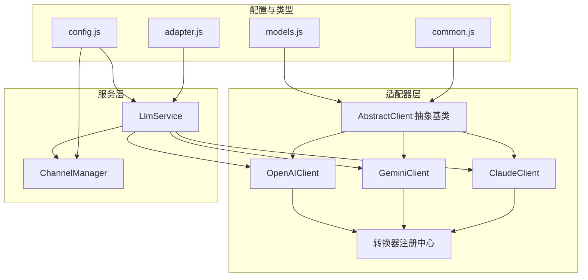
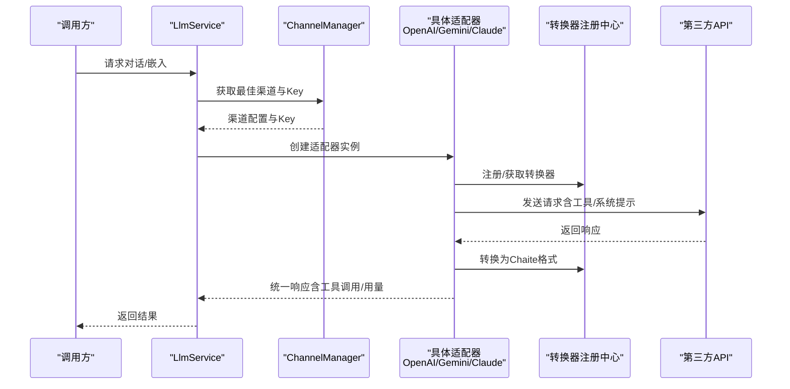
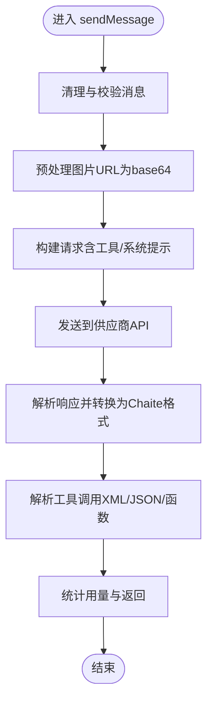
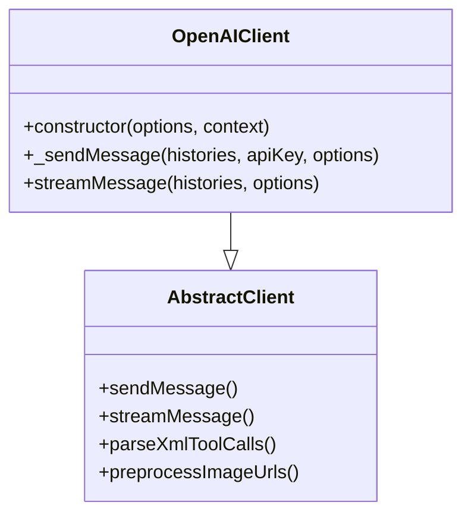
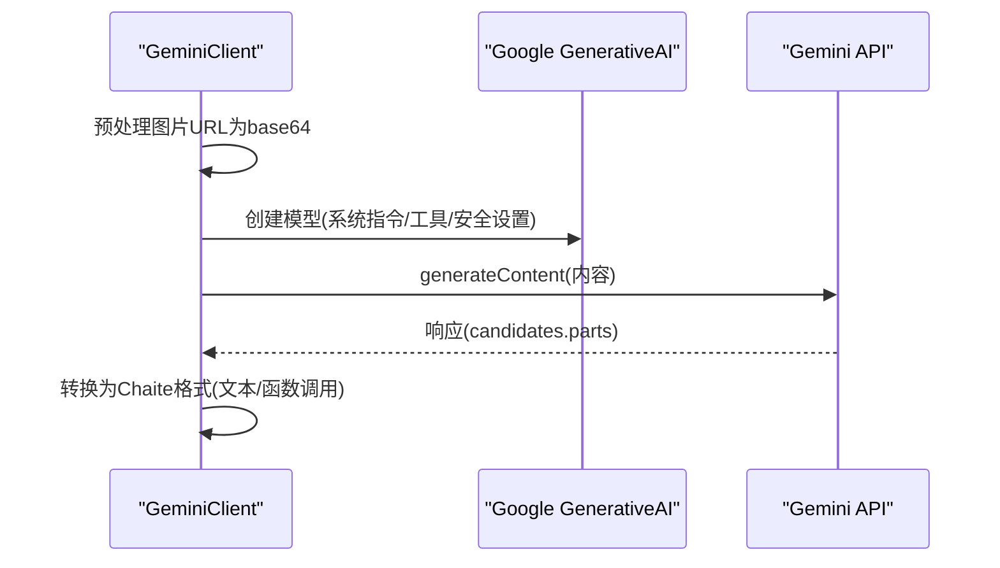
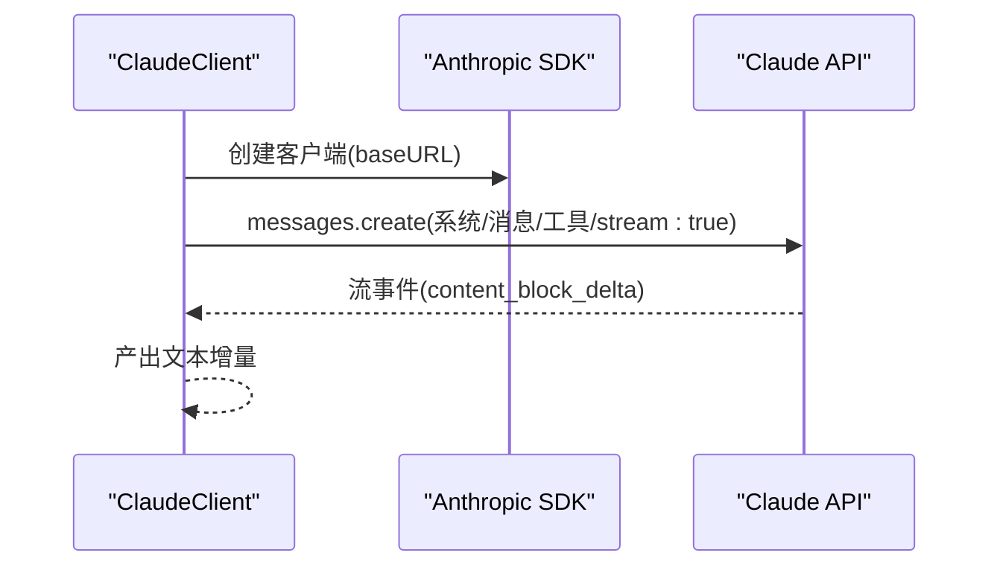
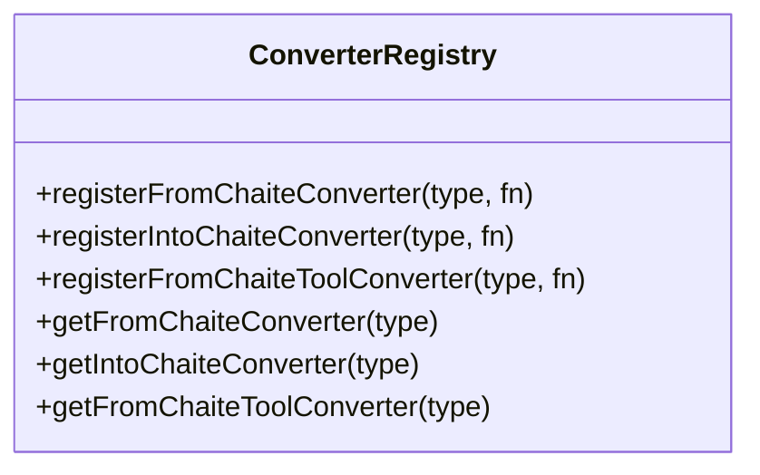
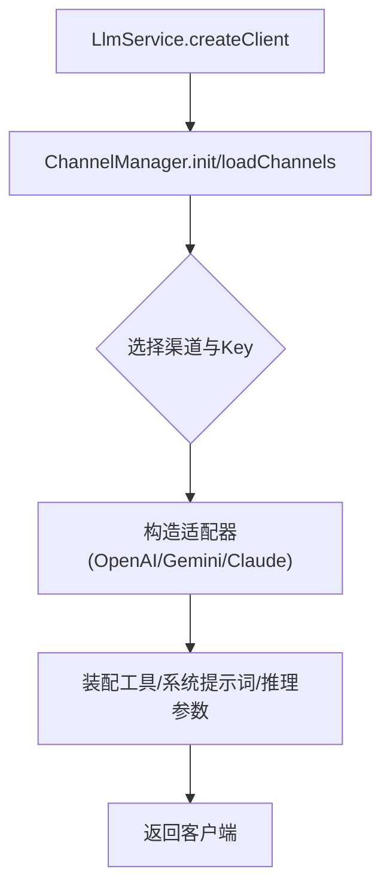
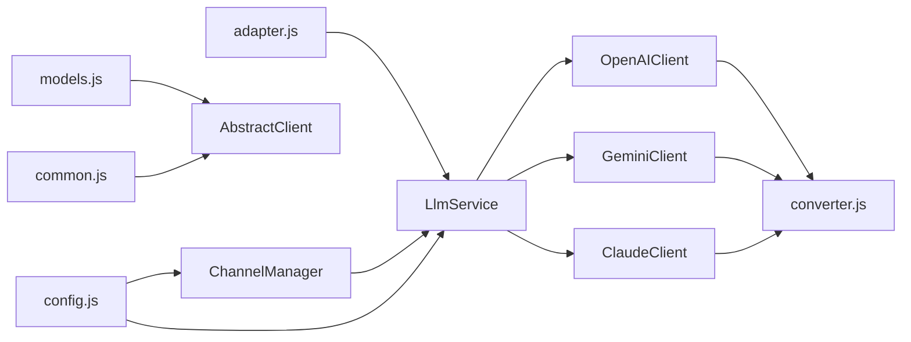

# AI 模型适配器

<cite>
**本文档引用的文件**
- [src/core/adapters/index.js](file://src/core/adapters/index.js)
- [src/core/adapters/AbstractClient.js](file://src/core/adapters/AbstractClient.js)
- [src/core/adapters/openai/OpenAIClient.js](file://src/core/adapters/openai/OpenAIClient.js)
- [src/core/adapters/openai/converter.js](file://src/core/adapters/openai/converter.js)
- [src/core/adapters/gemini/GeminiClient.js](file://src/core/adapters/gemini/GeminiClient.js)
- [src/core/adapters/gemini/converter.js](file://src/core/adapters/gemini/converter.js)
- [src/core/adapters/claude/ClaudeClient.js](file://src/core/adapters/claude/ClaudeClient.js)
- [src/core/adapters/claude/converter.js](file://src/core/adapters/claude/converter.js)
- [src/core/utils/converter.js](file://src/core/utils/converter.js)
- [src/services/llm/LlmService.js](file://src/services/llm/LlmService.js)
- [src/services/llm/ChannelManager.js](file://src/services/llm/ChannelManager.js)
- [src/core/types/adapter.js](file://src/core/types/adapter.js)
- [src/core/types/models.js](file://src/core/types/models.js)
- [src/core/types/common.js](file://src/core/types/common.js)
- [config/config.js](file://config/config.js)
</cite>

## 目录
1. [简介](#简介)
2. [项目结构](#项目结构)
3. [核心组件](#核心组件)
4. [架构总览](#架构总览)
5. [详细组件分析](#详细组件分析)
6. [依赖关系分析](#依赖关系分析)
7. [性能考量](#性能考量)
8. [故障排查指南](#故障排查指南)
9. [结论](#结论)
10. [附录](#附录)

## 简介
本项目采用适配器模式统一接入多家 AI 模型供应商（OpenAI、Claude、Gemini），通过抽象层屏蔽不同供应商的 API 差异，提供一致的请求/响应接口、工具调用解析、流式响应支持以及多渠道管理能力。系统支持多 API Key 轮询、故障转移、健康检查、模型映射与重定向、请求头与模板注入、图片预处理等高级特性。

## 项目结构
- 核心适配器位于 src/core/adapters，分别实现 OpenAI、Claude、Gemini 的客户端与转换器
- 通用抽象与工具位于 src/core/adapters 与 src/core/utils
- 业务服务位于 src/services，包括 LLM 服务与渠道管理
- 配置位于 config/config.js，包含默认模型、渠道、工具组等

图表来源
- [src/core/adapters/index.js](file://src/core/adapters/index.js#L1-L24)
- [src/core/adapters/AbstractClient.js](file://src/core/adapters/AbstractClient.js#L1-L800)
- [src/core/adapters/openai/OpenAIClient.js](file://src/core/adapters/openai/OpenAIClient.js#L1-L200)
- [src/core/adapters/gemini/GeminiClient.js](file://src/core/adapters/gemini/GeminiClient.js#L1-L200)
- [src/core/adapters/claude/ClaudeClient.js](file://src/core/adapters/claude/ClaudeClient.js#L1-L200)
- [src/core/utils/converter.js](file://src/core/utils/converter.js#L1-L150)
- [src/services/llm/LlmService.js](file://src/services/llm/LlmService.js#L1-L300)
- [src/services/llm/ChannelManager.js](file://src/services/llm/ChannelManager.js#L1-L800)
- [config/config.js](file://config/config.js#L1-L631)

章节来源
- [src/core/adapters/index.js](file://src/core/adapters/index.js#L1-L24)
- [src/services/llm/LlmService.js](file://src/services/llm/LlmService.js#L1-L300)
- [src/services/llm/ChannelManager.js](file://src/services/llm/ChannelManager.js#L1-L800)
- [config/config.js](file://config/config.js#L1-L631)

## 核心组件
- 抽象适配器 AbstractClient：定义统一的 sendMessage、streamMessage、工具调用解析、媒体预处理等通用逻辑
- OpenAI 适配器 OpenAIClient：基于官方 SDK，支持工具调用、消息校验、请求头模板、代理与统计上报
- Gemini 适配器 GeminiClient：基于 @google/generative-ai，支持系统指令、安全设置、工具声明与图片 base64 预处理
- Claude 适配器 ClaudeClient：基于 @anthropic-ai/sdk，支持系统提示、工具声明与流式响应
- 转换器注册中心：为各供应商注册 fromChaite/intoChaite 转换函数，实现消息与工具定义的跨模型互操作
- LlmService：统一客户端创建入口，负责工具装配、推理模式、预设与系统提示词
- ChannelManager：渠道管理与多 Key 轮询、故障转移、健康检查、模型列表缓存与统计

章节来源
- [src/core/adapters/AbstractClient.js](file://src/core/adapters/AbstractClient.js#L1-L800)
- [src/core/adapters/openai/OpenAIClient.js](file://src/core/adapters/openai/OpenAIClient.js#L1-L200)
- [src/core/adapters/gemini/GeminiClient.js](file://src/core/adapters/gemini/GeminiClient.js#L1-L200)
- [src/core/adapters/claude/ClaudeClient.js](file://src/core/adapters/claude/ClaudeClient.js#L1-L200)
- [src/core/utils/converter.js](file://src/core/utils/converter.js#L1-L150)
- [src/services/llm/LlmService.js](file://src/services/llm/LlmService.js#L1-L300)
- [src/services/llm/ChannelManager.js](file://src/services/llm/ChannelManager.js#L1-L800)

## 架构总览
系统通过 LlmService 选择合适的适配器与渠道，ChannelManager 提供多 Key 轮询与故障转移；适配器内部通过转换器将 Chaite 统一消息格式转换为各供应商期望的输入，并将响应转换回统一格式，支持工具调用解析与流式输出。

图表来源
- [src/services/llm/LlmService.js](file://src/services/llm/LlmService.js#L21-L135)
- [src/services/llm/ChannelManager.js](file://src/services/llm/ChannelManager.js#L477-L585)
- [src/core/adapters/openai/OpenAIClient.js](file://src/core/adapters/openai/OpenAIClient.js#L162-L200)
- [src/core/adapters/gemini/GeminiClient.js](file://src/core/adapters/gemini/GeminiClient.js#L39-L164)
- [src/core/adapters/claude/ClaudeClient.js](file://src/core/adapters/claude/ClaudeClient.js#L29-L133)
- [src/core/utils/converter.js](file://src/core/utils/converter.js#L1-L150)

## 详细组件分析

### 抽象适配器 AbstractClient
- 统一的工具调用解析：支持多种 XML/JSON/函数调用格式，自动清洗与修复参数
- 媒体预处理：图片 URL 转 base64、格式标准化
- 选项封装：SendMessageOption 提供温度、最大 Token、系统覆盖、工具选择、推理模式等
- 生命周期：支持预处理器/后处理器链路、历史管理、日志与统计

图表来源
- [src/core/adapters/AbstractClient.js](file://src/core/adapters/AbstractClient.js#L1-L800)
- [src/core/types/adapter.js](file://src/core/types/adapter.js#L6-L115)

章节来源
- [src/core/adapters/AbstractClient.js](file://src/core/adapters/AbstractClient.js#L1-L800)
- [src/core/types/adapter.js](file://src/core/types/adapter.js#L6-L115)

### OpenAI 适配器 OpenAIClient
- 消息格式：支持纯文本、多模态（文本/图片/音频）、工具调用
- 请求头与模板：支持 JSON 模板与自定义头复写，便于代理与伪装
- 工具与枚举：工具定义的 enum 值清理为字符串，兼容 Gemini 兼容模式
- 健壮性：消息完整性校验、工具调用 ID 匹配、丢弃孤立 tool 消息

图表来源
- [src/core/adapters/openai/OpenAIClient.js](file://src/core/adapters/openai/OpenAIClient.js#L145-L200)
- [src/core/adapters/AbstractClient.js](file://src/core/adapters/AbstractClient.js#L1-L800)

章节来源
- [src/core/adapters/openai/OpenAIClient.js](file://src/core/adapters/openai/OpenAIClient.js#L1-L200)
- [src/core/adapters/openai/converter.js](file://src/core/adapters/openai/converter.js#L1-L348)

### Gemini 适配器 GeminiClient
- 系统指令：将系统消息转换为 systemInstruction
- 安全设置：默认 BLOCK_NONE，可扩展
- 工具声明：functionDeclarations 形式
- 图片处理：强制预处理为 base64，支持 inlineData
- 响应转换：candidates 第一个候选，parts 文本与 functionCall

图表来源
- [src/core/adapters/gemini/GeminiClient.js](file://src/core/adapters/gemini/GeminiClient.js#L39-L164)
- [src/core/adapters/gemini/converter.js](file://src/core/adapters/gemini/converter.js#L11-L218)

章节来源
- [src/core/adapters/gemini/GeminiClient.js](file://src/core/adapters/gemini/GeminiClient.js#L1-L200)
- [src/core/adapters/gemini/converter.js](file://src/core/adapters/gemini/converter.js#L1-L218)

### Claude 适配器 ClaudeClient
- 系统提示：system 参数
- 工具声明：input_schema
- 图片限制：不支持 URL，需 base64
- 流式响应：content_block_delta 文本增量

图表来源
- [src/core/adapters/claude/ClaudeClient.js](file://src/core/adapters/claude/ClaudeClient.js#L141-L194)

章节来源
- [src/core/adapters/claude/ClaudeClient.js](file://src/core/adapters/claude/ClaudeClient.js#L1-L200)
- [src/core/adapters/claude/converter.js](file://src/core/adapters/claude/converter.js#L1-L158)

### 转换器注册中心
- 三类转换器：fromChaite（Chaite→供应商）、intoChaite（供应商→Chaite）、fromChaiteTool（工具定义）
- 适配器启动时注册，统一由注册表管理，便于扩展新供应商

图表来源
- [src/core/utils/converter.js](file://src/core/utils/converter.js#L1-L150)

章节来源
- [src/core/utils/converter.js](file://src/core/utils/converter.js#L1-L150)

### LlmService 与 ChannelManager
- LlmService：根据配置与预设创建客户端，装配工具，支持推理模式与预设系统提示词
- ChannelManager：渠道配置、多 Key 轮询（随机/权重/最少使用/故障转移/轮询）、健康检查、模型缓存、统计上报

图表来源
- [src/services/llm/LlmService.js](file://src/services/llm/LlmService.js#L21-L135)
- [src/services/llm/ChannelManager.js](file://src/services/llm/ChannelManager.js#L87-L137)

章节来源
- [src/services/llm/LlmService.js](file://src/services/llm/LlmService.js#L1-L300)
- [src/services/llm/ChannelManager.js](file://src/services/llm/ChannelManager.js#L1-L800)

## 依赖关系分析
- 适配器依赖抽象基类与转换器注册中心
- LlmService 依赖 ChannelManager 与适配器
- ChannelManager 依赖配置与 Redis 缓存
- 类型系统贯穿适配器、服务与工具

图表来源
- [src/core/types/adapter.js](file://src/core/types/adapter.js#L1-L118)
- [src/core/types/models.js](file://src/core/types/models.js#L1-L123)
- [src/core/types/common.js](file://src/core/types/common.js#L1-L200)
- [src/core/adapters/index.js](file://src/core/adapters/index.js#L1-L24)
- [src/services/llm/LlmService.js](file://src/services/llm/LlmService.js#L1-L300)
- [src/services/llm/ChannelManager.js](file://src/services/llm/ChannelManager.js#L1-L800)
- [config/config.js](file://config/config.js#L1-L631)

章节来源
- [src/core/types/adapter.js](file://src/core/types/adapter.js#L1-L118)
- [src/core/types/models.js](file://src/core/types/models.js#L1-L123)
- [src/core/types/common.js](file://src/core/types/common.js#L1-L200)
- [src/core/adapters/index.js](file://src/core/adapters/index.js#L1-L24)
- [src/services/llm/LlmService.js](file://src/services/llm/LlmService.js#L1-L300)
- [src/services/llm/ChannelManager.js](file://src/services/llm/ChannelManager.js#L1-L800)
- [config/config.js](file://config/config.js#L1-L631)

## 性能考量
- 多 Key 轮询与故障转移：减少单点故障，提升可用性
- 模型列表缓存：ChannelManager 使用 Redis 缓存模型列表，降低频繁查询开销
- 请求头模板与代理：减少每次请求的样板代码，便于统一代理与伪装
- 媒体预处理：提前将图片 URL 转换为 base64，避免运行时额外 IO
- 工具调用解析：对多种格式进行容错解析，减少因格式差异导致的失败重试

## 故障排查指南
- 渠道健康检查：ChannelManager.testConnection 支持模型列表与聊天测试，定位认证与模型可用性问题
- Key 错误统计与重置：reportKeyError/resetKeyErrors 用于追踪与重置错误计数
- 日志与统计：适配器与服务层均记录关键信息，便于定位问题
- 常见问题
  - 401/认证失败：检查 apiKey 与认证头模板
  - 模型不可用：确认模型映射与实际可用模型
  - 工具调用失败：检查工具定义与参数格式，关注枚举清理与 JSON 修复逻辑

章节来源
- [src/services/llm/ChannelManager.js](file://src/services/llm/ChannelManager.js#L659-L800)
- [src/services/llm/ChannelManager.js](file://src/services/llm/ChannelManager.js#L592-L623)
- [src/core/adapters/AbstractClient.js](file://src/core/adapters/AbstractClient.js#L25-L104)

## 结论
本系统通过适配器模式与统一转换器，实现了对 OpenAI、Claude、Gemini 的无缝接入，具备完善的工具调用解析、流式响应、多 Key 轮询与故障转移、健康检查与模型缓存等能力。结合 LlmService 与 ChannelManager，能够灵活配置与调度不同供应商与模型，满足生产环境的稳定性与可维护性需求。

## 附录

### 自定义适配器开发指南
- 实现步骤
  - 继承 AbstractClient，实现 _sendMessage 与 streamMessage
  - 在适配器目录注册转换器（fromChaite、intoChaite、fromChaiteTool）
  - 在 src/core/adapters/index.js 导出适配器与转换器
  - 在 LlmService 中支持新适配器类型
- 接口规范
  - 请求参数：SendMessageOption（温度、最大 Token、系统覆盖、工具选择、推理模式等）
  - 响应格式：统一的 IMessage/HistoryMessage，包含 content 与可选 toolCalls
  - 错误处理：抛出可识别的异常，便于上层统一处理
- 性能优化
  - 使用请求头模板与代理，减少样板代码
  - 预处理媒体与工具定义，降低运行时开销
  - 合理使用缓存与轮询策略

章节来源
- [src/core/adapters/AbstractClient.js](file://src/core/adapters/AbstractClient.js#L1-L800)
- [src/core/utils/converter.js](file://src/core/utils/converter.js#L1-L150)
- [src/core/adapters/index.js](file://src/core/adapters/index.js#L1-L24)
- [src/services/llm/LlmService.js](file://src/services/llm/LlmService.js#L21-L135)