# Claude 适配器

<cite>
**本文档引用的文件**
- [ClaudeClient.js](file://src/core/adapters/claude/ClaudeClient.js)
- [converter.js](file://src/core/adapters/claude/converter.js)
- [AbstractClient.js](file://src/core/adapters/AbstractClient.js)
- [converter.js](file://src/core/utils/converter.js)
- [index.js](file://src/core/adapters/claude/index.js)
- [index.js](file://src/core/adapters/index.js)
- [models.js](file://src/core/times/models.js)
- [adapter.js](file://src/core/times/adapter.js)
- [LlmService.js](file://src/services/llm/LlmService.js)
- [ChannelManager.js](file://src/services/llm/ChannelManager.js)
- [config.js](file://config/config.js)
</cite>

## 目录
1. [简介](#简介)
2. [项目结构](#项目结构)
3. [核心组件](#核心组件)
4. [架构概览](#架构概览)
5. [详细组件分析](#详细组件分析)
6. [依赖分析](#依赖分析)
7. [性能考虑](#性能考虑)
8. [故障排除指南](#故障排除指南)
9. [结论](#结论)
10. [附录](#附录)

## 简介
本文件为 Claude 适配器的详细技术文档，重点阐述 ClaudeClient 的实现细节，包括 Anthropic API 认证、请求格式处理、响应解析等核心功能。文档还详细说明 Claude 特有的功能支持，如系统提示词、消息角色区分、图像处理等；解释转换器的实现原理及如何处理 Claude API 的特殊数据格式；涵盖流式响应处理、错误处理机制和 API 限制应对策略；提供配置参数说明、性能调优建议和故障排除指南，并包含实际应用场景和使用示例。

## 项目结构
Claude 适配器位于核心适配器模块中，采用分层设计：
- 适配器层：ClaudeClient 负责与 Anthropic API 交互
- 转换器层：负责 Chaite 消息格式与 Claude API 格式之间的双向转换
- 抽象基类：AbstractClient 提供通用工具函数和错误处理
- 服务层：LlmService 和 ChannelManager 提供客户端创建和渠道管理


**图表来源**
- [ClaudeClient.js](file://src/core/adapters/claude/ClaudeClient.js#L1-L248)
- [AbstractClient.js](file://src/core/adapters/AbstractClient.js#L1-L200)
- [LlmService.js](file://src/services/llm/LlmService.js#L1-L135)

**章节来源**
- [ClaudeClient.js](file://src/core/adapters/claude/ClaudeClient.js#L1-L248)
- [index.js](file://src/core/adapters/claude/index.js#L1-L3)

## 核心组件
本节深入分析 Claude 适配器的核心组件及其职责：

### ClaudeClient 类
ClaudeClient 是 Claude 适配器的主要实现类，继承自 AbstractClient，提供以下核心功能：
- Anthropic SDK 初始化和配置
- 消息发送和流式响应处理
- 工具调用支持和解析
- 模型信息查询和验证
- 错误处理和异常管理

### 转换器系统
转换器系统负责在 Chaite 消息格式和 Claude API 格式之间进行双向转换：
- Chaite → Claude：消息内容转换、角色映射、工具调用序列化
- Claude → Chaite：响应内容解析、工具调用反序列化
- 工具定义转换：将通用工具格式转换为 Claude 工具规范

### 工具调用解析器
AbstractClient 提供强大的工具调用解析能力，支持多种格式：
- XML 格式：<tools>...</tools>
- JSON 格式：```json ... ```
- 函数调用格式：<function_call>...</function_call>
- 自定义格式：<tool_call>name<arg_key>key</arg_key><arg_value>value</arg_value></tool_call>

**章节来源**
- [ClaudeClient.js](file://src/core/adapters/claude/ClaudeClient.js#L19-L247)
- [AbstractClient.js](file://src/core/adapters/AbstractClient.js#L110-L831)
- [converter.js](file://src/core/adapters/claude/converter.js#L1-L158)

## 架构概览
Claude 适配器采用分层架构设计，确保高内聚、低耦合：


**图表来源**
- [ClaudeClient.js](file://src/core/adapters/claude/ClaudeClient.js#L19-L247)
- [AbstractClient.js](file://src/core/adapters/AbstractClient.js#L1-L200)
- [converter.js](file://src/core/utils/converter.js#L13-L149)

## 详细组件分析

### ClaudeClient 实现详解

#### 认证与初始化
ClaudeClient 通过 Anthropic SDK 进行认证，支持基础 URL 和 API Key 配置：
- 使用构造函数接收客户端配置
- 设置适配器名称为 'claude'
- 初始化 Anthropic 客户端实例

#### 请求格式处理
消息发送流程包含以下关键步骤：
1. **系统提示词处理**：从历史记录中提取系统消息，转换为 Claude 的 system 参数
2. **消息格式转换**：使用转换器将 Chaite 消息转换为 Claude 格式
3. **工具定义转换**：将通用工具格式转换为 Claude 工具规范
4. **API 调用**：调用 Anthropic messages.create 接口

```mermaid
sequenceDiagram
participant Client as ClaudeClient
participant Converter as 转换器
participant Anthropic as Anthropic SDK
participant API as Claude API
Client->>Converter : 转换历史消息
Converter-->>Client : Claude 格式消息
Client->>Anthropic : 创建客户端实例
Client->>API : messages.create(请求参数)
API-->>Client : 响应数据
Client->>Converter : 转换响应数据
Converter-->>Client : Chaite 格式消息
Client-->>Client : 解析工具调用
```



**图表来源**
- [ClaudeClient.js](file://src/core/adapters/claude/ClaudeClient.js#L36-L133)
- [converter.js](file://src/core/adapters/claude/converter.js#L11-L110)

#### 响应解析机制
响应解析包含多个层次：
1. **标准格式解析**：解析 Claude API 返回的标准格式
2. **工具调用解析**：从文本内容中提取工具调用指令
3. **内容过滤**：移除空文本内容
4. **使用量统计**：提取输入输出令牌使用量

#### 流式响应处理
ClaudeClient 支持流式响应处理：
- 启用 stream: true 参数
- 遍历事件流中的 content_block_delta 事件
- 提取 text_delta 内容
- 逐字输出响应内容

**章节来源**
- [ClaudeClient.js](file://src/core/adapters/claude/ClaudeClient.js#L36-L194)

### 转换器实现原理

#### Chaite → Claude 转换
转换器将 Chaite 消息格式转换为 Claude API 格式：
- **用户消息**：支持文本和图像内容
- **助手消息**：支持文本和工具调用
- **工具结果**：转换为用户消息格式


**图表来源**
- [converter.js](file://src/core/adapters/claude/converter.js#L11-L110)

#### Claude → Chaite 转换
转换器将 Claude API 响应转换为 Chaite 消息格式：
- **文本内容**：直接映射到 Chaite 文本格式
- **工具调用**：解析 tool_use 内容为 Chaite 工具调用格式

**章节来源**
- [converter.js](file://src/core/adapters/claude/converter.js#L115-L144)

### 工具调用解析器

#### 多格式支持
工具调用解析器支持多种格式：
- **XML 格式**：<tools>...</tools>
- **JSON 代码块**：```json ... ```
- **函数调用格式**：<function_call>...</function_call>
- **自定义格式**：<tool_call>name<arg_key>key</arg_key><arg_value>value</arg_value></tool_call>

#### 智能去重和限制
解析器包含智能去重和限制机制：
- 最大工具调用数量限制：15 个
- 连续重复调用检测和跳过
- 同一调用重复次数限制：最多 3 次
- 参数规范化处理

**章节来源**
- [AbstractClient.js](file://src/core/adapters/AbstractClient.js#L110-L831)

## 依赖分析

### 组件耦合关系
Claude 适配器的依赖关系清晰明确：


**图表来源**
- [ClaudeClient.js](file://src/core/adapters/claude/ClaudeClient.js#L1-L5)
- [AbstractClient.js](file://src/core/adapters/AbstractClient.js#L1-L12)

### 外部依赖管理
- **Anthropic SDK**：用于与 Claude API 通信
- **node:crypto**：用于生成唯一消息 ID
- **转换器注册表**：管理不同适配器的转换器

**章节来源**
- [ClaudeClient.js](file://src/core/adapters/claude/ClaudeClient.js#L1-L5)
- [converter.js](file://src/core/utils/converter.js#L1-L150)

## 性能考虑

### 流式响应优化
ClaudeClient 的流式响应处理具有以下性能优势：
- **实时响应**：逐字输出响应内容，提升用户体验
- **内存效率**：事件驱动的异步处理，避免大量内存占用
- **网络优化**：及时释放网络连接，减少资源占用

### 工具调用解析优化
工具调用解析器包含多项性能优化：
- **正则表达式缓存**：预编译常用正则表达式
- **早期退出**：在找到足够信息时提前结束解析
- **批量处理**：支持一次性处理多个工具调用

### 缓存和重用
- **转换器缓存**：转换器函数的注册和缓存机制
- **客户端重用**：同一会话中重用 Anthropic 客户端实例
- **配置缓存**：模型信息和渠道配置的缓存

## 故障排除指南

### 常见问题及解决方案

#### API 认证失败
**症状**：抛出认证相关错误
**原因**：API Key 配置错误或过期
**解决方案**：
1. 检查 API Key 配置
2. 验证渠道状态
3. 确认多 API Key 轮询策略

#### 图像处理问题
**症状**：图像无法正确显示或处理失败
**原因**：图像格式不支持或 URL 无法访问
**解决方案**：
1. 确认图像格式支持（JPEG、PNG、GIF 等）
2. 检查图像 URL 可访问性
3. 考虑将 URL 转换为 base64 格式

#### 工具调用解析失败
**症状**：工具调用无法正确识别
**原因**：工具调用格式不符合预期
**解决方案**：
1. 检查工具调用格式
2. 验证 JSON 格式的正确性
3. 确认工具名称和参数的有效性

#### 流式响应中断
**症状**：流式响应提前结束
**原因**：网络连接不稳定或 API 限制
**解决方案**：
1. 检查网络连接稳定性
2. 调整超时设置
3. 实现重试机制

**章节来源**
- [ClaudeClient.js](file://src/core/adapters/claude/ClaudeClient.js#L196-L202)
- [AbstractClient.js](file://src/core/adapters/AbstractClient.js#L839-L987)

## 结论
Claude 适配器通过精心设计的架构实现了对 Anthropic API 的完整支持。其核心特点包括：

1. **完整的格式转换**：支持 Chaite 和 Claude 两种消息格式之间的双向转换
2. **强大的工具调用支持**：解析多种格式的工具调用指令
3. **流式响应处理**：提供实时的流式响应体验
4. **健壮的错误处理**：完善的异常处理和故障恢复机制
5. **灵活的配置管理**：支持多 API Key 轮询和渠道管理

该适配器为开发者提供了稳定可靠的 Claude API 集成方案，适用于各种应用场景，从简单的聊天对话到复杂的工具调用集成。

## 附录

### 配置参数说明

#### ClaudeClient 配置
- **apiKey**：Anthropic API 密钥
- **baseUrl**：API 基础 URL
- **features**：支持的功能特性列表
- **tools**：可用工具列表
- **enableReasoning**：是否启用推理模式
- **reasoningEffort**：推理努力程度

#### 发送选项参数
- **model**：使用的模型名称
- **temperature**：采样温度
- **maxToken**：最大生成令牌数
- **systemOverride**：系统提示词覆盖
- **stream**：是否启用流式响应
- **toolChoice**：工具选择策略

### 实际应用场景

#### 聊天对话
支持基本的文本聊天功能，包括：
- 多轮对话上下文管理
- 系统提示词定制
- 温度参数调节

#### 工具调用集成
支持多种工具调用场景：
- 天气查询
- 新闻获取
- 文件操作
- 系统管理

#### 图像处理
支持图像相关的功能：
- 图像描述生成
- 图像内容分析
- 图像格式转换

### 性能调优建议

#### 连接池管理
- 合理设置连接超时时间
- 实现连接重用机制
- 监控连接池使用情况

#### 缓存策略
- 缓存常用的模型信息
- 实现工具调用结果缓存
- 优化转换器函数缓存

#### 错误重试
- 实现指数退避重试
- 设置最大重试次数
- 区分可重试和不可重试错误