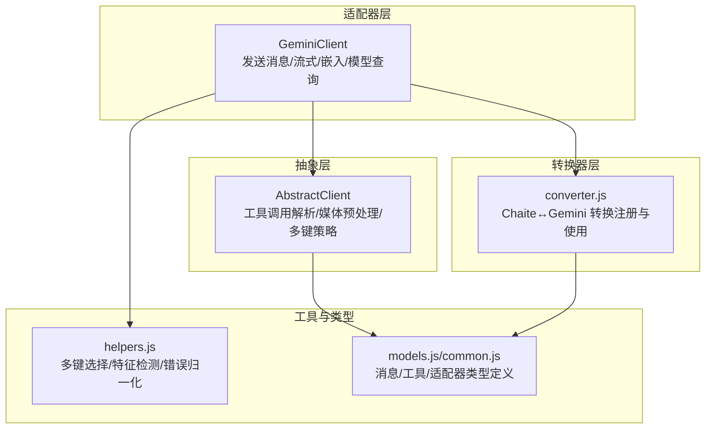
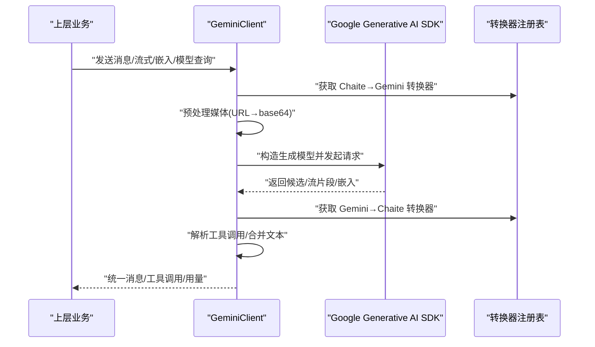
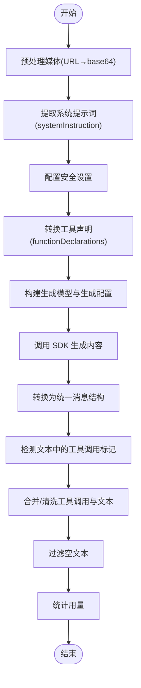
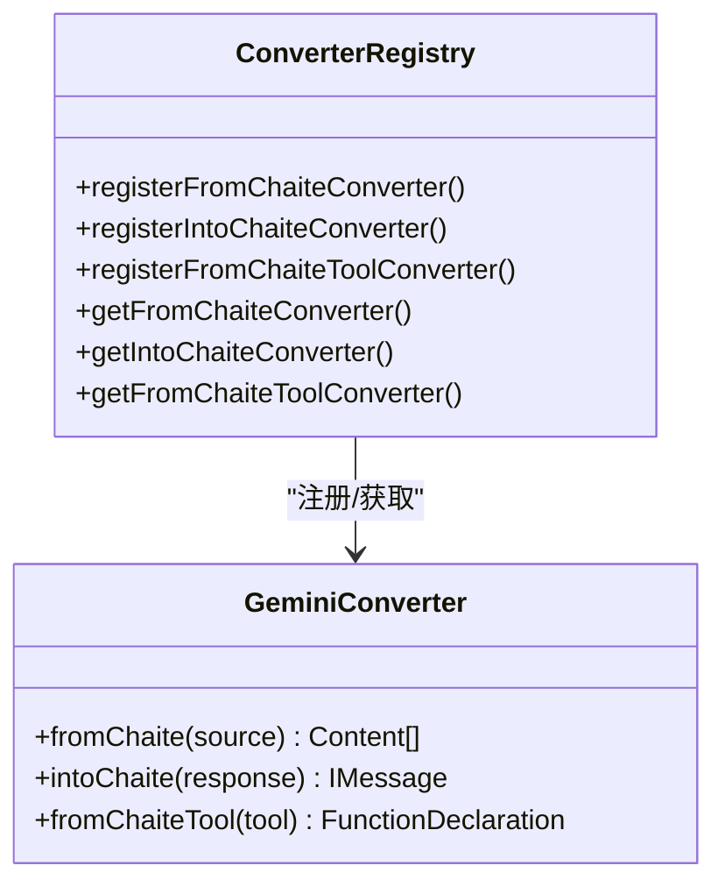
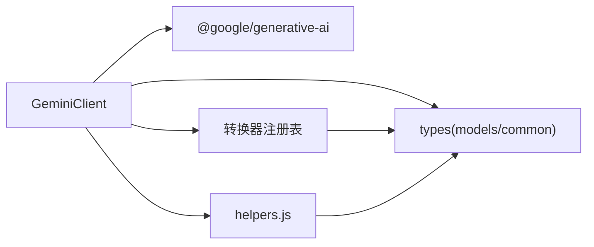

# Gemini 适配器

<cite>
**本文引用的文件**
- [GeminiClient.js](file://src/core/adapters/gemini/GeminiClient.js)
- [converter.js](file://src/core/adapters/gemini/converter.js)
- [index.js](file://src/core/adapters/gemini/index.js)
- [AbstractClient.js](file://src/core/adapters/AbstractClient.js)
- [converter.js](file://src/core/utils/converter.js)
- [helpers.js](file://src/core/utils/helpers.js)
- [models.js](file://src/core/types/models.js)
- [common.js](file://src/core/types/common.js)
- [channelRoutes.js](file://src/services/routes/channelRoutes.js)
</cite>

## 目录
1. [简介](#简介)
2. [项目结构](#项目结构)
3. [核心组件](#核心组件)
4. [架构总览](#架构总览)
5. [组件详解](#组件详解)
6. [依赖关系分析](#依赖关系分析)
7. [性能考量](#性能考量)
8. [故障排查指南](#故障排查指南)
9. [结论](#结论)
10. [附录](#附录)

## 简介
本文件面向开发者与运维人员，系统性阐述本仓库中 Gemini 适配器的设计与实现，重点覆盖以下方面：
- Google AI Studio API 认证与请求构建
- 历史消息到 Gemini 内容格式的转换机制
- 响应解析与工具调用提取
- 多模态输入（文本、图片、音视频）与内容安全过滤
- 生成配置（温度、最大输出令牌等）
- 模型选择策略、参数配置与错误恢复
- 性能优化建议、API 使用限制与最佳实践
- 实际使用场景与参考路径

## 项目结构
Gemini 适配器位于核心适配器目录下，采用“适配器 + 转换器”的分层设计：
- 适配器层：负责与 Google Generative AI SDK 交互，封装认证、请求、流式响应与嵌入生成
- 转换器层：负责将统一的消息结构与工具结构在不同适配器间进行双向转换
- 抽象层：提供通用的工具调用解析、媒体预处理、多键轮询等能力

图表来源
- [GeminiClient.js](file://src/core/adapters/gemini/GeminiClient.js#L1-L385)
- [converter.js](file://src/core/adapters/gemini/converter.js#L1-L218)
- [AbstractClient.js](file://src/core/adapters/AbstractClient.js#L1-L1200)
- [helpers.js](file://src/core/utils/helpers.js#L1-L591)
- [models.js](file://src/core/types/models.js#L1-L123)
- [common.js](file://src/core/types/common.js#L1-L275)

章节来源
- [GeminiClient.js](file://src/core/adapters/gemini/GeminiClient.js#L1-L385)
- [converter.js](file://src/core/adapters/gemini/converter.js#L1-L218)
- [AbstractClient.js](file://src/core/adapters/AbstractClient.js#L1-L1200)
- [helpers.js](file://src/core/utils/helpers.js#L1-L591)
- [models.js](file://src/core/types/models.js#L1-L123)
- [common.js](file://src/core/types/common.js#L1-L275)

## 核心组件
- GeminiClient：实现与 Google AI Studio 的交互，支持普通对话、流式对话、嵌入生成、模型列表与详情查询
- 转换器：注册 Chaite → Gemini 与 Gemini → Chaite 的转换逻辑，以及工具声明转换
- AbstractClient：提供工具调用解析、媒体预处理（URL→base64）、多键策略等通用能力
- 工具与类型：定义消息、工具、使用量等类型，以及多键选择、特征检测等辅助工具

章节来源
- [GeminiClient.js](file://src/core/adapters/gemini/GeminiClient.js#L22-L385)
- [converter.js](file://src/core/adapters/gemini/converter.js#L11-L218)
- [AbstractClient.js](file://src/core/adapters/AbstractClient.js#L1151-L1171)
- [helpers.js](file://src/core/utils/helpers.js#L14-L52)
- [models.js](file://src/core/types/models.js#L41-L123)
- [common.js](file://src/core/types/common.js#L23-L116)

## 架构总览
Gemini 适配器遵循“统一消息模型 + 适配器桥接 + 转换器映射”的架构。上层业务通过统一的 IMessage/Tool 结构与适配器交互，适配器内部将消息转换为 Gemini 的 Content 格式，调用 SDK 完成请求；响应再由转换器还原为统一结构，并解析可能的工具调用。

图表来源
- [GeminiClient.js](file://src/core/adapters/gemini/GeminiClient.js#L39-L164)
- [converter.js](file://src/core/adapters/gemini/converter.js#L11-L204)
- [AbstractClient.js](file://src/core/adapters/AbstractClient.js#L1151-L1171)

## 组件详解

### GeminiClient：认证、请求构建与响应处理
- 认证与基础配置
  - 通过 Google AI SDK 初始化客户端，支持自定义 baseUrl（便于代理）
  - 多 API Key 策略：随机、轮询、会话哈希
- 请求构建
  - 历史消息预处理：将图片/视频/音频 URL 转为 base64，满足 Gemini 对 inlineData 的要求
  - 系统提示词：从历史中提取 text 类型内容作为 systemInstruction
  - 安全设置：默认对骚扰、仇恨、性暴力、危险内容设置为 BLOCK_NONE
  - 工具声明：将工具转换为 functionDeclarations 并注入模型
  - 生成配置：temperature、maxOutputTokens
- 响应处理
  - 将 SDK 响应转换为统一消息结构，提取 toolCalls
  - 若文本中包含工具调用标记，进一步解析并合并
  - 过滤空文本，统计用量（prompt/completion/total tokens）

图表来源
- [GeminiClient.js](file://src/core/adapters/gemini/GeminiClient.js#L39-L164)
- [AbstractClient.js](file://src/core/adapters/AbstractClient.js#L1151-L1171)

章节来源
- [GeminiClient.js](file://src/core/adapters/gemini/GeminiClient.js#L39-L164)
- [helpers.js](file://src/core/utils/helpers.js#L14-L52)

### 流式对话：streamMessage
- 与普通对话类似，但使用 generateContentStream
- 逐片 yield 文本片段，适合前端实时渲染
- 保持相同的预处理与安全设置

章节来源
- [GeminiClient.js](file://src/core/adapters/gemini/GeminiClient.js#L172-L249)

### 嵌入生成：getEmbedding
- 选择嵌入模型（默认 text-embedding-004）
- 支持批量文本，逐条生成向量
- 记录嵌入调用统计（输入 token 估算、耗时、成功状态）

章节来源
- [GeminiClient.js](file://src/core/adapters/gemini/GeminiClient.js#L257-L296)
- [helpers.js](file://src/core/utils/helpers.js#L102-L108)

### 模型查询：listModels / getModelInfo
- listModels：调用 /v1beta/models 列表接口，筛选支持 generateContent 的模型
- getModelInfo：调用 /v1beta/models/{model} 获取模型详情（名称、描述、token 上限、采样参数等）
- 失败回退：当接口不可用时返回已知模型清单

章节来源
- [GeminiClient.js](file://src/core/adapters/gemini/GeminiClient.js#L303-L383)

### 转换器：Chaite ↔ Gemini
- Chaite → Gemini
  - assistant：parts 包含 text 与 functionCall
  - user：parts 包含 text、inlineData（图片/视频/音频），并处理 data URL 与 base64
  - tool：parts 为 functionResponse，支持 JSON 结构化结果
- Gemini → Chaite
  - 从候选中提取 parts，组装为统一 content 与 toolCalls
- 工具声明转换：将工具函数名、描述与参数结构映射为 Gemini 的 FunctionDeclaration

图表来源
- [converter.js](file://src/core/utils/converter.js#L25-L149)
- [converter.js](file://src/core/adapters/gemini/converter.js#L11-L218)

章节来源
- [converter.js](file://src/core/adapters/gemini/converter.js#L11-L218)
- [converter.js](file://src/core/utils/converter.js#L25-L149)

### 工具调用解析：parseXmlToolCalls 与智能去重
- 支持多种工具调用标记格式：<tools>、<tool_call>...、JSON 代码块、裸 JSON、函数调用式等
- 参数规范化：对 JSON 字符串进行修复与规范化，避免因格式问题导致解析失败
- 智能去重：限制连续重复与同一工具调用次数，控制总量上限，提升稳定性

章节来源
- [AbstractClient.js](file://src/core/adapters/AbstractClient.js#L110-L831)

### 媒体预处理：preprocessImageUrls / preprocessMediaToBase64
- 将用户消息中的图片/视频/音频 URL 转换为 base64 inlineData
- 支持本地文件、data URL、远程 URL，内置重试与超时控制
- 对视频大小进行限制，避免超出 Gemini 的限制

章节来源
- [AbstractClient.js](file://src/core/adapters/AbstractClient.js#L1036-L1171)

### 多键策略：getKey
- 支持随机、轮询、会话哈希三种策略
- 在渠道测试与运行时动态选择 API Key，提升可用性与负载均衡

章节来源
- [helpers.js](file://src/core/utils/helpers.js#L14-L52)

### 类型与配置：IMessage/Tool/ModelUsage 与 BaseClientOptions
- 统一消息结构：支持 text、image、audio、video、tool 等内容类型
- 工具结构：function name + arguments
- 使用量结构：prompt/completion/total tokens
- 客户端选项：features、tools、baseUrl、apiKey、multipleKeyStrategy、proxy、预/后处理器等

章节来源
- [models.js](file://src/core/types/models.js#L41-L123)
- [common.js](file://src/core/types/common.js#L23-L116)

## 依赖关系分析
- GeminiClient 依赖
  - Google AI SDK：初始化客户端、模型、生成内容、嵌入
  - 转换器注册表：Chaite ↔ Gemini 的双向转换
  - 工具与类型：统一消息/工具/用量结构
  - 辅助工具：多键策略、媒体预处理、特征检测、错误归一化
- 关键耦合点
  - 转换器注册与使用：通过注册表解耦具体适配器
  - 媒体预处理：在适配器层集中处理，避免各适配器重复实现
  - 工具调用解析：统一解析逻辑，兼容多种标记风格

图表来源
- [GeminiClient.js](file://src/core/adapters/gemini/GeminiClient.js#L1-L10)
- [converter.js](file://src/core/utils/converter.js#L1-L150)
- [helpers.js](file://src/core/utils/helpers.js#L1-L591)
- [models.js](file://src/core/types/models.js#L1-L123)
- [common.js](file://src/core/types/common.js#L1-L275)

章节来源
- [GeminiClient.js](file://src/core/adapters/gemini/GeminiClient.js#L1-L10)
- [converter.js](file://src/core/utils/converter.js#L1-L150)
- [helpers.js](file://src/core/utils/helpers.js#L1-L591)
- [models.js](file://src/core/types/models.js#L1-L123)
- [common.js](file://src/core/types/common.js#L1-L275)

## 性能考量
- 媒体预处理
  - 仅在需要时进行 base64 转换，避免不必要的网络请求与编码开销
  - 对视频设置大小上限，防止超大文件影响延迟与成本
- 工具调用解析
  - 限制工具调用数量与连续重复，降低下游执行压力
- 嵌入生成
  - 批量嵌入时逐条处理，便于统计与错误隔离
- 模型选择
  - 根据场景选择合适模型（如快速/轻量 vs 高质量/长上下文），平衡速度与效果

[本节为通用指导，无需特定文件引用]

## 故障排查指南
- 认证失败
  - 确认 API Key 正确，必要时切换多键策略
  - 检查 baseUrl 与代理配置
- 请求超时/网络错误
  - 检查网络连通性与代理设置
  - 对媒体 URL 增加重试与超时配置
- 工具调用未被识别
  - 确认输出中包含工具调用标记（如 <tools>、<tool_call>、JSON 代码块等）
  - 检查参数格式是否可被规范化
- 响应为空
  - 检查 safetySettings 与工具声明是否合理
  - 确认模型支持 generateContent

章节来源
- [helpers.js](file://src/core/utils/helpers.js#L528-L566)
- [AbstractClient.js](file://src/core/adapters/AbstractClient.js#L110-L831)
- [GeminiClient.js](file://src/core/adapters/gemini/GeminiClient.js#L303-L383)

## 结论
Gemini 适配器通过清晰的分层设计与强大的转换器机制，实现了与 Google AI Studio 的高效对接。其在多模态输入、工具调用解析、安全设置与模型查询等方面提供了完备的能力，同时通过媒体预处理与多键策略提升了稳定性与可用性。建议在生产环境中结合本文的性能优化与最佳实践，确保系统的可靠性与效率。

[本节为总结性内容，无需特定文件引用]

## 附录

### 实际使用场景与参考路径
- 渠道测试与模型查询
  - 参考：渠道测试路由中对适配器类型的判断与测试流程
  - 路径：[channelRoutes.js](file://src/services/routes/channelRoutes.js#L97-L200)
- API Key 管理与多键策略
  - 参考：多键选择与轮询/会话哈希策略
  - 路径：[helpers.js](file://src/core/utils/helpers.js#L14-L52)
- 媒体预处理与工具调用解析
  - 参考：URL→base64、视频大小限制、工具调用解析与去重
  - 路径：[AbstractClient.js](file://src/core/adapters/AbstractClient.js#L1036-L1171), [AbstractClient.js](file://src/core/adapters/AbstractClient.js#L110-L831)