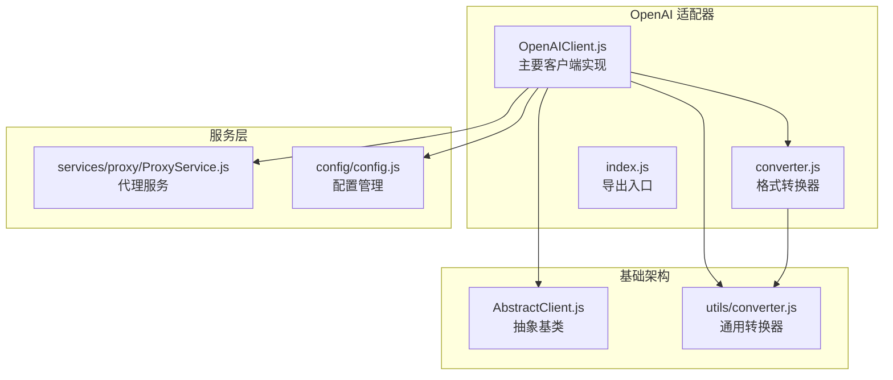
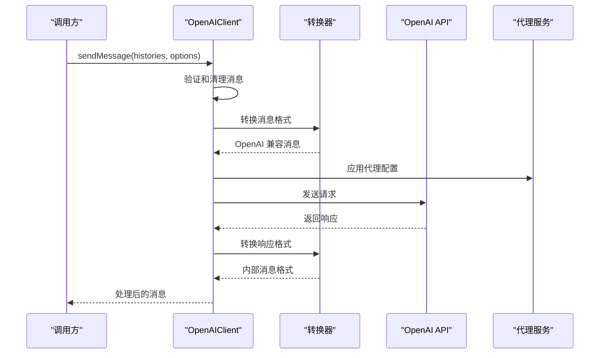
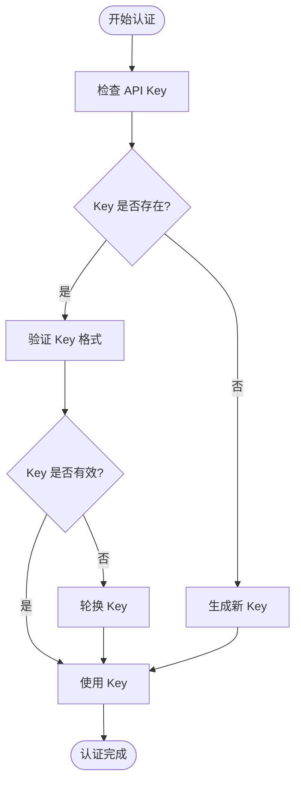
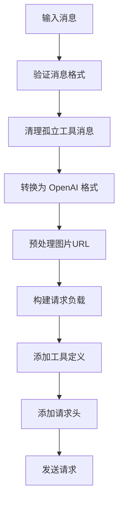
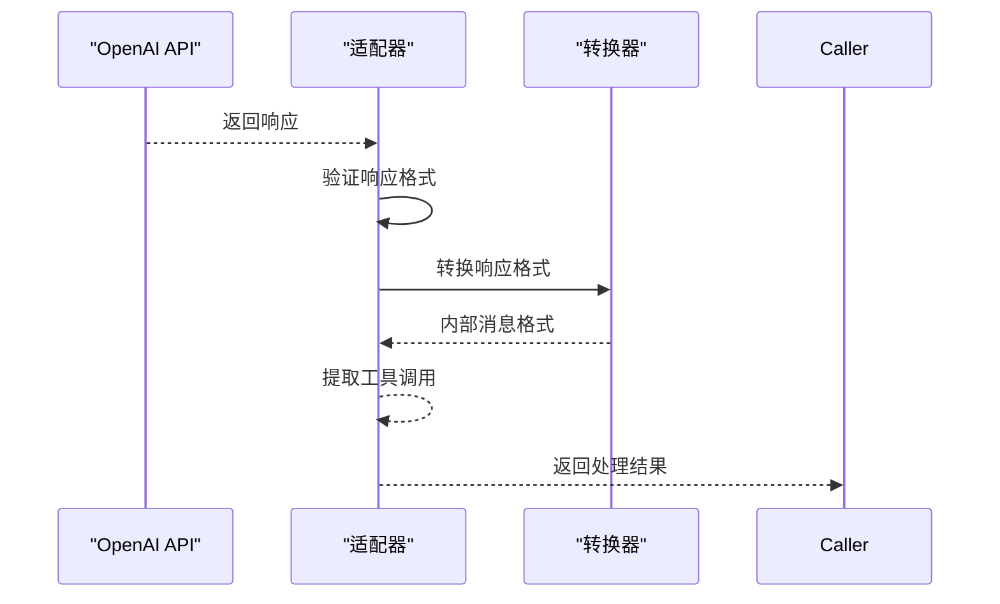
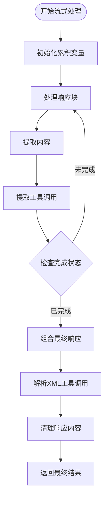
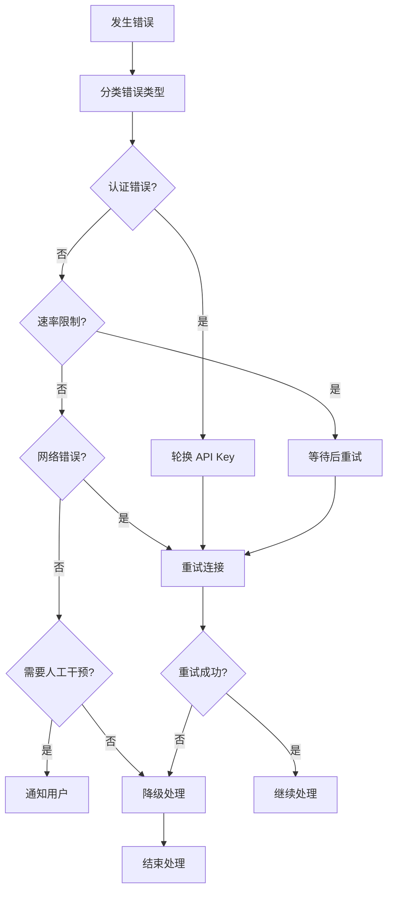
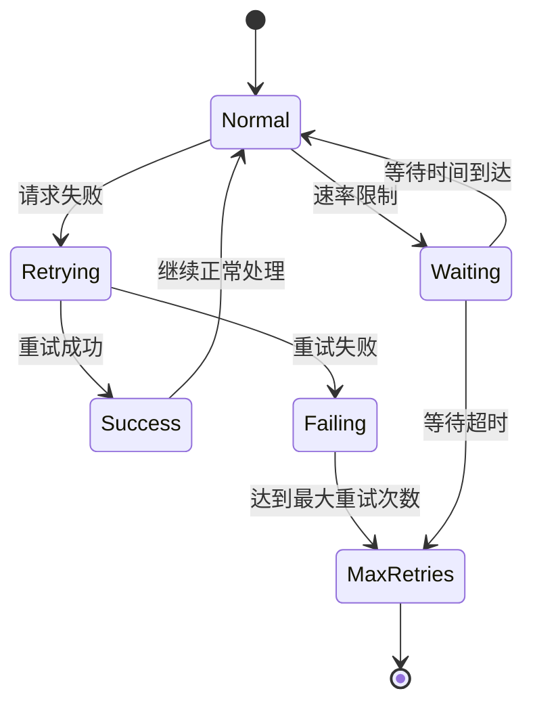
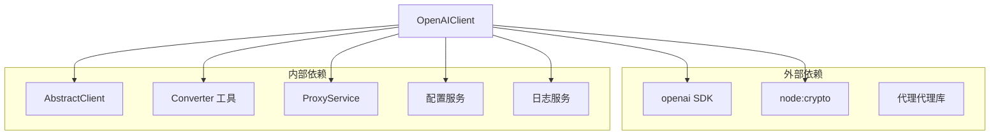

# OpenAI 适配器


## 目录
1. [简介](#简介)
2. [项目结构](#项目结构)
3. [核心组件](#核心组件)
4. [架构概览](#架构概览)
5. [详细组件分析](#详细组件分析)
6. [依赖关系分析](#依赖关系分析)
7. [性能考虑](#性能考虑)
8. [故障排除指南](#故障排除指南)
9. [结论](#结论)
10. [附录](#附录)

## 简介

OpenAI 适配器是 Yunzai 插件生态系统中的核心组件，负责将内部消息格式转换为 OpenAI API 兼容格式，并处理与 OpenAI 服务的交互。该适配器实现了完整的 API 认证机制、请求格式构建、响应解析处理等功能，支持函数调用、工具使用、流式响应等 OpenAI 特有功能。

## 项目结构

OpenAI 适配器位于插件的核心适配器目录中，采用模块化设计：



**图表来源**
- [OpenAIClient.js](file://src/core/adapters/openai/OpenAIClient.js#L1-L50)
- [converter.js](file://src/core/adapters/openai/converter.js#L1-L30)
- [AbstractClient.js](file://src/core/adapters/AbstractClient.js#L1-L50)

**章节来源**
- [OpenAIClient.js](file://src/core/adapters/openai/OpenAIClient.js#L1-L150)
- [index.js](file://src/core/adapters/openai/index.js#L1-L3)

## 核心组件

### OpenAIClient 类

OpenAIClient 是适配器的核心实现类，继承自 AbstractClient，提供了完整的 OpenAI API 集成：

#### 主要特性
- **API 认证管理**：支持多种认证方式和密钥轮换
- **请求格式构建**：将内部消息转换为 OpenAI 兼容格式
- **响应解析处理**：支持同步和流式响应处理
- **工具调用支持**：完整的函数调用和工具使用功能
- **错误处理机制**：完善的错误捕获和恢复策略

#### 关键方法
- `_sendMessage()`: 处理同步消息发送
- `streamMessage()`: 处理流式消息发送
- `getEmbedding()`: 处理嵌入向量生成
- `listModels()`: 获取可用模型列表

**章节来源**
- [OpenAIClient.js](file://src/core/adapters/openai/OpenAIClient.js#L145-L637)

### 转换器系统

转换器系统负责在内部消息格式和 OpenAI API 格式之间进行双向转换：

#### 转换器类型
- **FromChaiteConverter**: 内部消息 → OpenAI 格式
- **IntoChaiteConverter**: OpenAI 响应 → 内部消息格式  
- **FromChaiteToolConverter**: 工具定义 → OpenAI 工具格式

**章节来源**
- [converter.js](file://src/core/adapters/openai/converter.js#L10-L348)
- [converter.js](file://src/core/utils/converter.js#L25-L149)

## 架构概览

OpenAI 适配器采用分层架构设计，确保了良好的可扩展性和维护性：



**图表来源**
- [OpenAIClient.js](file://src/core/adapters/openai/OpenAIClient.js#L162-L357)
- [converter.js](file://src/core/adapters/openai/converter.js#L182-L331)

## 详细组件分析

### API 认证机制

OpenAI 适配器实现了灵活的认证机制，支持多种认证方式：

#### 认证流程


**图表来源**
- [OpenAIClient.js](file://src/core/adapters/openai/OpenAIClient.js#L646-L657)
- [helpers.js](file://src/core/utils/helpers.js#L528-L549)

#### 请求头构建
适配器支持动态请求头构建，包括：
- **模板化头部**: 支持占位符替换
- **自定义头部**: 允许用户自定义请求头
- **代理头部**: 自动处理代理相关头部

**章节来源**
- [OpenAIClient.js](file://src/core/adapters/openai/OpenAIClient.js#L166-L235)

### 请求格式构建

#### 消息转换流程


**图表来源**
- [OpenAIClient.js](file://src/core/adapters/openai/OpenAIClient.js#L237-L357)
- [converter.js](file://src/core/adapters/openai/converter.js#L10-L177)

#### 工具调用支持
适配器支持多种工具调用模式：
- **自动选择**: LLM 自主选择工具
- **强制执行**: 必须使用工具
- **禁止使用**: 禁止工具调用
- **指定工具**: 仅使用特定工具

**章节来源**
- [OpenAIClient.js](file://src/core/adapters/openai/OpenAIClient.js#L273-L298)
- [converter.js](file://src/core/adapters/openai/converter.js#L336-L345)

### 响应解析处理

#### 同步响应处理
同步响应处理流程相对简单，直接解析 OpenAI API 返回的数据：



**图表来源**
- [OpenAIClient.js](file://src/core/adapters/openai/OpenAIClient.js#L482-L576)
- [converter.js](file://src/core/adapters/openai/converter.js#L182-L331)

#### 流式响应处理
流式响应处理是 OpenAI 适配器的核心特性之一：



**图表来源**
- [OpenAIClient.js](file://src/core/adapters/openai/OpenAIClient.js#L359-L498)
- [OpenAIClient.js](file://src/core/adapters/openai/OpenAIClient.js#L770-L967)

**章节来源**
- [OpenAIClient.js](file://src/core/adapters/openai/OpenAIClient.js#L359-L967)

### 错误处理策略

#### 错误分类
适配器实现了详细的错误分类和处理机制：

| 错误类型 | 状态码 | 处理策略 |
|---------|--------|----------|
| 认证错误 | 401 | 自动轮换 API Key |
| 速率限制 | 429 | 指数退避重试 |
| 请求错误 | 400 | 参数修正后重试 |
| 网络错误 | ECONNREFUSED | 连接重试 |
| 超时错误 | ETIMEDOUT | 超时重试 |

#### 自动恢复机制


**图表来源**
- [OpenAIClient.js](file://src/core/adapters/openai/OpenAIClient.js#L499-L542)
- [helpers.js](file://src/core/utils/helpers.js#L528-L549)

**章节来源**
- [OpenAIClient.js](file://src/core/adapters/openai/OpenAIClient.js#L499-L542)
- [helpers.js](file://src/core/utils/helpers.js#L528-L549)

### 重试机制和速率限制

#### 重试策略
适配器实现了智能的重试机制：



#### 速率限制处理
- **指数退避**: 重试间隔按指数增长
- **最大重试次数**: 防止无限重试
- **超时处理**: 避免长时间阻塞

**章节来源**
- [OpenAIClient.js](file://src/core/adapters/openai/OpenAIClient.js#L1200-L1250)

## 依赖关系分析

### 组件依赖图



**图表来源**
- [OpenAIClient.js](file://src/core/adapters/openai/OpenAIClient.js#L1-L20)
- [AbstractClient.js](file://src/core/adapters/AbstractClient.js#L1-L20)

### 数据类型定义

适配器使用了完整的 TypeScript 类型定义来确保类型安全：

#### 消息类型
- **IMessage**: 内部消息格式
- **HistoryMessage**: 历史消息格式
- **MessageContent**: 消息内容类型

#### 工具类型
- **Tool**: 工具定义
- **ToolCall**: 工具调用
- **FunctionCall**: 函数调用

**章节来源**
- [models.js](file://src/core/types/models.js#L41-L90)
- [tools.js](file://src/core/types/tools.js#L27-L32)

## 性能考虑

### 优化策略

#### 内存管理
- **消息验证**: 自动清理无效消息，防止内存泄漏
- **工具调用去重**: 智能去重机制，避免重复调用
- **流式处理**: 支持流式响应，减少内存占用

#### 网络优化
- **代理缓存**: 代理 Agent 缓存，避免重复创建
- **连接复用**: 复用 HTTP 连接
- **超时控制**: 合理的超时设置

#### 处理效率
- **批量处理**: 支持批量工具调用
- **并发控制**: 限制并发工具调用数量
- **智能重试**: 智能重试机制，避免无效重试

## 故障排除指南

### 常见问题及解决方案

#### 认证问题
**问题**: API Key 无效或过期
**解决方案**: 
1. 检查 API Key 格式
2. 验证账户状态
3. 使用密钥轮换功能

#### 网络连接问题
**问题**: 连接被拒绝或超时
**解决方案**:
1. 检查代理配置
2. 验证网络连接
3. 调整超时设置

#### 速率限制问题
**问题**: 请求过于频繁被限制
**解决方案**:
1. 实现指数退避
2. 增加请求间隔
3. 使用备用 API Key

#### 工具调用问题
**问题**: 工具调用失败或参数错误
**解决方案**:
1. 检查工具定义
2. 验证参数格式
3. 查看工具调用日志

**章节来源**
- [OpenAIClient.js](file://src/core/adapters/openai/OpenAIClient.js#L544-L576)
- [helpers.js](file://src/core/utils/helpers.js#L528-L549)

## 结论

OpenAI 适配器是一个功能完整、设计合理的组件，它成功地将内部消息格式转换为 OpenAI API 兼容格式，并提供了丰富的功能特性。其模块化设计使得代码易于维护和扩展，完善的错误处理机制确保了系统的稳定性。

通过支持函数调用、工具使用、流式响应等高级功能，该适配器能够满足各种复杂的 AI 应用场景需求。同时，其智能的重试机制和性能优化策略保证了在高负载情况下的稳定运行。

## 附录

### 配置选项

#### 基本配置
- **API Key**: OpenAI 认证密钥
- **基础 URL**: API 服务地址
- **模型选择**: 默认使用的模型
- **温度参数**: 控制响应随机性

#### 高级配置
- **代理设置**: HTTP/HTTPS/SOCKS 代理
- **超时设置**: 请求超时时间
- **重试配置**: 重试次数和间隔
- **日志级别**: 日志详细程度

### 使用示例

#### 基本消息发送
```javascript
const client = new OpenAIClient({
  apiKey: 'your-api-key',
  baseUrl: 'https://api.openai.com'
});

const response = await client.sendMessage([
  {
    role: 'user',
    content: [{ type: 'text', text: 'Hello' }]
  }
], {
  model: 'gpt-4o-mini',
  temperature: 0.7
});
```

#### 流式响应处理
```javascript
const stream = await client.streamMessage([
  {
    role: 'user',
    content: [{ type: 'text', text: '计算 2+2' }]
  }
], {
  model: 'gpt-4o-mini',
  temperature: 0.7
});

for await (const chunk of stream) {
  if (chunk.type === 'text') {
    process.stdout.write(chunk.text);
  }
}
```

### 最佳实践

#### 性能优化
1. **合理设置温度**: 根据应用场景调整温度参数
2. **使用流式处理**: 对长响应使用流式处理
3. **实施缓存策略**: 缓存常用响应
4. **监控资源使用**: 定期检查内存和 CPU 使用情况

#### 安全考虑
1. **密钥管理**: 使用环境变量存储 API Key
2. **输入验证**: 验证所有用户输入
3. **日志脱敏**: 避免在日志中记录敏感信息
4. **速率限制**: 实施适当的速率限制

#### 可靠性
1. **错误处理**: 实现全面的错误处理机制
2. **重试策略**: 使用智能重试机制
3. **监控告警**: 设置必要的监控和告警
4. **备份方案**: 准备备用 API 服务
