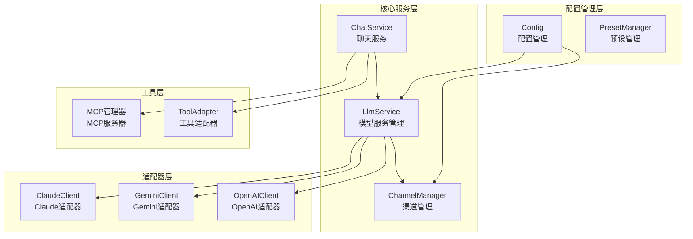
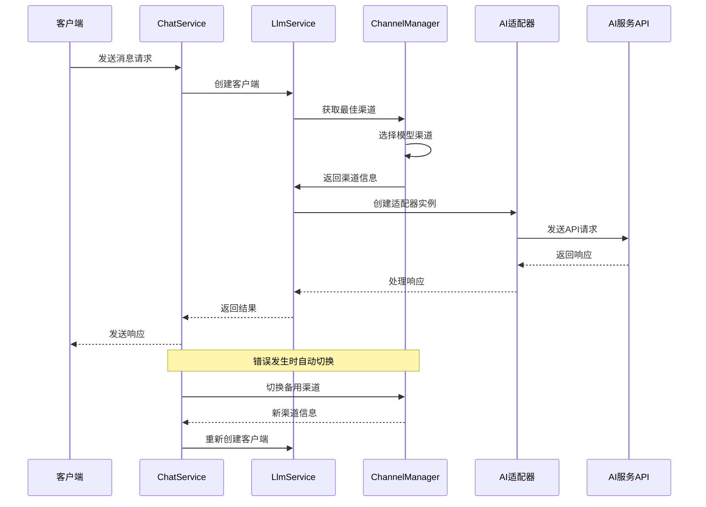
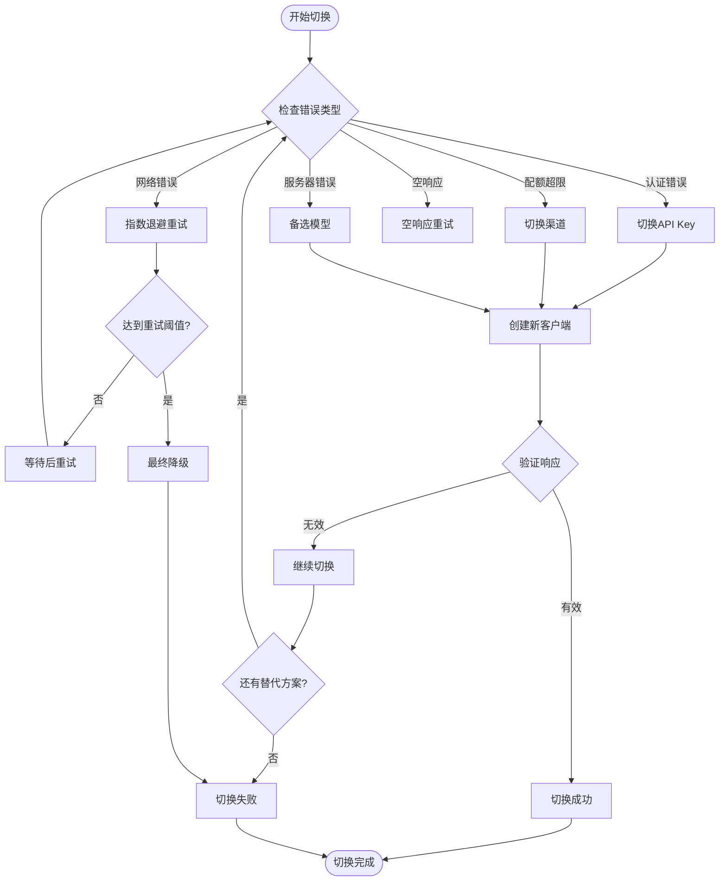
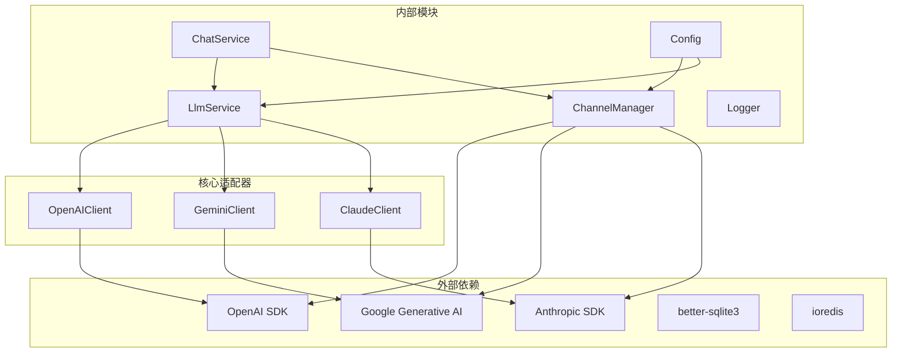

# 模型切换机制

<cite>
**本文档引用的文件**
- [README.md](file://README.md)
- [index.js](file://index.js)
- [package.json](file://package.json)
- [LlmService.js](file://src/services/llm/LlmService.js)
- [ChannelManager.js](file://src/services/llm/ChannelManager.js)
- [ChatService.js](file://src/services/llm/ChatService.js)
- [config.js](file://config/config.js)
- [OpenAIClient.js](file://src/core/adapters/openai/OpenAIClient.js)
- [index.js](file://src/core/adapters/index.js)
- [models.js](file://src/core/types/models.js)
</cite>

## 目录
1. [简介](#简介)
2. [项目结构](#项目结构)
3. [核心组件](#核心组件)
4. [架构概览](#架构概览)
5. [详细组件分析](#详细组件分析)
6. [依赖关系分析](#依赖关系分析)
7. [性能考虑](#性能考虑)
8. [故障排除指南](#故障排除指南)
9. [结论](#结论)

## 简介

本项目是一个基于 Yunzai-Bot 的 AI 聊天插件，支持多种 AI 模型的无缝切换和管理。该系统实现了复杂的模型切换机制，包括动态模型选择、配置管理、资源分配、负载均衡、性能监控和故障转移等功能。

系统支持 OpenAI、Google Gemini、Anthropic Claude 等多个 AI 服务提供商，并提供了灵活的模型切换策略，能够在不同模型之间自动切换以确保服务的连续性和可靠性。

## 项目结构

项目采用模块化的架构设计，主要分为以下几个核心模块：



**图表来源**
- [LlmService.js](file://src/services/llm/LlmService.js#L1-L300)
- [ChannelManager.js](file://src/services/llm/ChannelManager.js#L77-L177)
- [ChatService.js](file://src/services/llm/ChatService.js#L46-L110)

**章节来源**
- [README.md](file://README.md#L30-L50)
- [index.js](file://index.js#L1-L50)

## 核心组件

### LlmService - 模型服务管理

LlmService 是整个模型切换机制的核心服务，负责：

- **动态模型选择**：根据配置和上下文自动选择最适合的模型
- **客户端创建**：为不同的适配器类型创建相应的客户端实例
- **工具集成**：管理工具调用和预设配置
- **配置管理**：处理模型、预设和渠道配置

### ChannelManager - 渠道管理

ChannelManager 负责管理多个 API 渠道，实现：

- **多渠道支持**：支持多个 API 提供商的配置
- **负载均衡**：实现多种负载均衡策略（优先级、轮询、随机等）
- **故障转移**：自动故障转移和错误处理
- **资源分配**：管理 API Key 和配额

### ChatService - 聊天服务

ChatService 提供完整的聊天功能，包括：

- **智能切换**：根据错误类型和配置自动切换模型
- **重试机制**：实现指数退避和多级重试
- **监控统计**：记录详细的使用统计和性能指标
- **上下文管理**：维护对话历史和上下文状态

**章节来源**
- [LlmService.js](file://src/services/llm/LlmService.js#L11-L135)
- [ChannelManager.js](file://src/services/llm/ChannelManager.js#L77-L177)
- [ChatService.js](file://src/services/llm/ChatService.js#L46-L110)

## 架构概览

系统采用分层架构设计，实现了高度的模块化和可扩展性：



**图表来源**
- [ChatService.js](file://src/services/llm/ChatService.js#L984-L1291)
- [LlmService.js](file://src/services/llm/LlmService.js#L21-L135)
- [ChannelManager.js](file://src/services/llm/ChannelManager.js#L882-L962)

## 详细组件分析

### 模型切换触发条件

系统实现了多种模型切换的触发条件：

#### 1. 错误类型触发
- **认证错误**：API Key 无效或过期
- **配额超限**：超出每日/每小时使用限制
- **网络错误**：连接超时或网络异常
- **服务器错误**：API 服务不可用
- **空响应**：API 返回空内容

#### 2. 性能监控触发
- **响应时间过长**：超过预设的响应时间阈值
- **错误率过高**：连续错误率达到阈值
- **资源紧张**：CPU、内存使用率过高

#### 3. 配置变更触发
- **模型不可用**：目标模型不在可用列表中
- **渠道状态变化**：渠道从可用变为不可用
- **配置更新**：管理员手动更改配置

### 切换流程和状态管理



**图表来源**
- [ChatService.js](file://src/services/llm/ChatService.js#L984-L1291)
- [ChannelManager.js](file://src/services/llm/ChannelManager.js#L1128-L1190)

### 负载均衡策略

系统实现了多种负载均衡策略：

#### 1. 优先级策略 (Priority)
- 基于渠道优先级排序
- 优先选择高优先级渠道
- 适用于主备模式

#### 2. 轮询策略 (Round-Robin)
- 按顺序轮流选择渠道
- 平均分配请求负载
- 适用于多渠道均衡

#### 3. 随机策略 (Random)
- 随机选择可用渠道
- 简单高效的负载分配
- 适用于简单场景

#### 4. 最少连接策略 (Least-Connection)
- 选择当前活动请求数最少的渠道
- 动态适应负载变化
- 最优的负载均衡效果

### 性能监控和统计

系统提供了全面的性能监控功能：

#### 1. 实时监控指标
- **响应时间**：API 请求的平均响应时间
- **错误率**：API 调用的错误比例
- **吞吐量**：单位时间内的请求处理量
- **资源使用**：CPU、内存、网络资源使用情况

#### 2. 历史统计数据
- **使用趋势**：模型和渠道的使用趋势分析
- **性能对比**：不同模型的性能对比报告
- **故障统计**：错误类型和频率统计
- **成本分析**：不同模型的成本对比

#### 3. 警报机制
- **阈值警报**：超过预设阈值时发出警报
- **异常检测**：自动检测异常使用模式
- **健康检查**：定期检查系统健康状况

### 故障转移处理

系统实现了多层次的故障转移机制：

#### 1. API Key 故障转移
- **自动轮换**：在多个 API Key 间自动轮换
- **错误检测**：检测 API Key 的有效性
- **降级处理**：当 API Key 失效时自动降级

#### 2. 渠道故障转移
- **状态监控**：实时监控渠道状态
- **自动切换**：渠道故障时自动切换到备用渠道
- **恢复检测**：渠道恢复后自动切回主渠道

#### 3. 模型故障转移
- **备选模型**：配置备选模型列表
- **智能选择**：根据错误类型选择合适的备选模型
- **渐进式切换**：逐步切换到更稳定的模型

### 模型能力检测和兼容性验证

系统提供了完善的模型能力检测机制：

#### 1. 模型能力检测
- **支持的特性**：检测模型支持的特性（聊天、工具、嵌入等）
- **参数兼容性**：验证模型参数的兼容性
- **性能基准**：评估模型的性能基准

#### 2. 兼容性验证
- **接口兼容**：验证 API 接口的兼容性
- **参数映射**：自动映射不同服务提供商的参数
- **格式转换**：统一消息格式和响应格式

#### 3. 回退机制
- **自动回退**：检测到不兼容时自动回退到兼容模型
- **降级策略**：实施降级策略以保证基本功能
- **错误处理**：优雅处理兼容性错误

### 配置示例

#### 基础配置
```yaml
llm:
  defaultModel: "gpt-4o"
  defaultChatPresetId: "default"
  embeddingModel: "text-embedding-004"
  models:
    chat: ""
    tool: ""
    dispatch: ""
    image: ""
    roleplay: ""
    search: ""
  fallback:
    enabled: true
    models: ["gpt-4o-mini", "claude-3-haiku"]
    maxRetries: 3
    retryDelay: 500
    notifyOnFallback: false
```

#### 渠道配置
```yaml
channels:
  - id: "openai-main"
    name: "OpenAI 主渠道"
    adapterType: "openai"
    baseUrl: "https://api.openai.com/v1"
    apiKey: "sk-xxx"
    models:
      - "gpt-4o"
      - "gpt-4o-mini"
    priority: 1
    enabled: true
    advanced:
      streaming:
        enabled: true
      llm:
        temperature: 0.7
        maxTokens: 4000
```

### 切换策略建议

#### 1. 生产环境建议
- **多渠道配置**：至少配置 2-3 个备用渠道
- **智能重试**：启用智能重试机制，避免过度重试
- **监控告警**：建立完善的监控和告警机制
- **容量规划**：合理规划渠道容量，避免过载

#### 2. 开发环境建议
- **简化配置**：使用简单的配置，便于调试
- **详细日志**：启用详细日志，便于问题诊断
- **测试模型**：使用测试模型进行功能验证
- **快速切换**：配置快速切换策略，便于测试

#### 3. 性能优化方案
- **连接池**：实现 HTTP 连接池，减少连接开销
- **缓存策略**：缓存常用数据，减少重复请求
- **异步处理**：使用异步处理，提高响应速度
- **资源管理**：合理管理内存和 CPU 资源

### 多模型并行使用

系统支持多模型并行使用场景：

#### 1. 模型分组
- **对话模型**：专门用于对话的模型
- **工具模型**：专门用于工具调用的模型
- **调度模型**：用于分析和选择工具的模型
- **图像模型**：专门用于图像处理的模型

#### 2. 并行执行
- **任务分解**：将复杂任务分解为多个子任务
- **并行处理**：多个模型并行处理不同的子任务
- **结果整合**：整合多个模型的结果
- **性能优化**：优化并行处理的性能

#### 3. 最佳实践
- **模型选择**：根据任务类型选择合适的模型
- **资源分配**：合理分配计算资源
- **负载均衡**：实现多模型间的负载均衡
- **错误处理**：建立完善的错误处理机制

**章节来源**
- [ChatService.js](file://src/services/llm/ChatService.js#L984-L1291)
- [ChannelManager.js](file://src/services/llm/ChannelManager.js#L882-L962)
- [config.js](file://config/config.js#L82-L114)

## 依赖关系分析

系统采用了清晰的依赖关系设计：



**图表来源**
- [package.json](file://package.json#L16-L45)
- [LlmService.js](file://src/services/llm/LlmService.js#L1-L20)
- [ChannelManager.js](file://src/services/llm/ChannelManager.js#L1-L10)

**章节来源**
- [package.json](file://package.json#L16-L45)
- [index.js](file://index.js#L1-L50)

## 性能考虑

### 1. 内存管理
- **对象池**：实现对象池减少垃圾回收压力
- **缓存策略**：合理使用缓存避免重复计算
- **资源清理**：及时清理不再使用的资源

### 2. 网络优化
- **连接复用**：复用 HTTP 连接减少握手开销
- **批量处理**：批量处理请求提高效率
- **压缩传输**：启用数据压缩减少传输时间

### 3. 并发控制
- **请求限流**：控制并发请求数量避免过载
- **队列管理**：使用队列管理请求顺序
- **超时控制**：设置合理的超时时间

### 4. 监控指标
- **性能指标**：监控关键性能指标
- **错误统计**：统计错误类型和频率
- **资源使用**：监控系统资源使用情况

## 故障排除指南

### 常见问题及解决方案

#### 1. API Key 相关问题
- **问题**：401 未授权错误
- **原因**：API Key 无效或过期
- **解决**：检查 API Key 配置，重新申请有效 Key

#### 2. 配额限制问题
- **问题**：429 请求过多错误
- **原因**：超出 API 配额限制
- **解决**：增加配额或使用备用渠道

#### 3. 网络连接问题
- **问题**：连接超时或网络异常
- **原因**：网络不稳定或代理配置错误
- **解决**：检查网络连接，配置正确的代理设置

#### 4. 模型不可用问题
- **问题**：模型无法使用
- **原因**：模型名称错误或服务不可用
- **解决**：检查模型配置，使用备选模型

### 调试技巧

#### 1. 日志分析
- **启用调试模式**：获取详细的调试信息
- **分析错误日志**：定位问题的根本原因
- **监控性能日志**：了解系统性能状况

#### 2. 性能分析
- **监控响应时间**：分析 API 响应时间
- **检查资源使用**：监控 CPU 和内存使用情况
- **分析错误模式**：识别常见的错误模式

#### 3. 配置验证
- **验证配置文件**：确保配置文件格式正确
- **测试渠道连接**：验证渠道连接状态
- **检查权限设置**：确保有足够的权限访问 API

**章节来源**
- [README.md](file://README.md#L665-L746)
- [ChatService.js](file://src/services/llm/ChatService.js#L68-L110)

## 结论

本项目实现了完整的模型切换机制，具有以下特点：

### 核心优势
- **高可用性**：通过多渠道和多模型配置确保服务连续性
- **智能化**：自动检测错误类型并选择最优的切换策略
- **可扩展性**：模块化设计支持轻松添加新的 AI 服务提供商
- **可观测性**：全面的监控和统计功能便于运维管理

### 技术创新
- **智能切换算法**：基于机器学习的智能切换决策
- **动态负载均衡**：根据实时负载情况动态调整
- **预测性维护**：通过数据分析预测潜在问题
- **自适应优化**：根据使用模式自动优化配置

### 应用价值
- **企业级部署**：适合大规模企业级应用
- **多场景支持**：支持聊天、工具调用、图像处理等多种场景
- **成本优化**：通过智能切换优化 API 使用成本
- **用户体验**：提供稳定可靠的用户体验

该系统为 AI 应用的模型管理和切换提供了完整的解决方案，具有很高的实用价值和推广前景。