# 适配器模式设计

<cite>
**本文档引用的文件**
- [AbstractClient.js](file://src/core/adapters/AbstractClient.js)
- [OpenAIClient.js](file://src/core/adapters/openai/OpenAIClient.js)
- [GeminiClient.js](file://src/core/adapters/gemini/GeminiClient.js)
- [ClaudeClient.js](file://src/core/adapters/claude/ClaudeClient.js)
- [adapter.js](file://src/core/times/adapter.js)
- [index.js](file://src/core/adapters/index.js)
- [LlmService.js](file://src/services/llm/LlmService.js)
- [ChannelManager.js](file://src/services/llm/ChannelManager.js)
- [converter.js](file://src/core/utils/converter.js)
</cite>

## 目录
1. [简介](#简介)
2. [项目结构](#项目结构)
3. [核心组件](#核心组件)
4. [架构概览](#架构概览)
5. [详细组件分析](#详细组件分析)
6. [依赖关系分析](#依赖关系分析)
7. [性能考虑](#性能考虑)
8. [故障排除指南](#故障排除指南)
9. [结论](#结论)

## 简介

本项目采用适配器模式设计，通过抽象基类 `AbstractClient` 统一不同 AI 模型 API 接口的差异，实现了对 OpenAI、Google Gemini 和 Anthropic Claude 等多个 AI 服务提供商的统一访问。该设计模式的核心价值在于：

- **统一接口**：为不同的 AI API 提供一致的编程接口
- **可扩展性**：易于添加新的 AI 服务提供商支持
- **解耦合**：业务逻辑与具体 AI 服务实现分离
- **工具集成**：内置强大的工具调用和执行机制

## 项目结构

项目采用模块化架构，核心适配器位于 `src/core/adapters/` 目录下，包含抽象基类和具体实现：

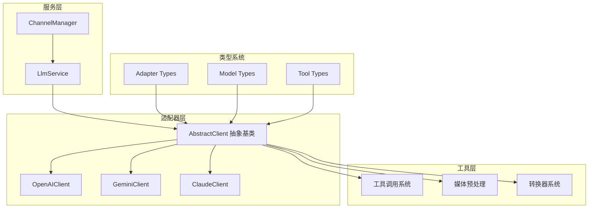

**图表来源**
- [AbstractClient.js](file://src/core/adapters/AbstractClient.js#L1219-L1245)
- [OpenAIClient.js](file://src/core/adapters/openai/OpenAIClient.js#L145-L153)
- [GeminiClient.js](file://src/core/adapters/gemini/GeminiClient.js#L22-L30)
- [ClaudeClient.js](file://src/core/adapters/claude/ClaudeClient.js#L19-L27)

**章节来源**
- [AbstractClient.js](file://src/core/adapters/AbstractClient.js#L1-L200)
- [index.js](file://src/core/adapters/index.js#L1-L24)

## 核心组件

### 抽象适配器基类 AbstractClient

`AbstractClient` 是整个适配器模式的核心，定义了统一的接口规范和通用功能：

#### 设计理念

1. **统一抽象**：定义所有 AI 适配器必须实现的标准接口
2. **功能封装**：封装通用的工具调用、历史管理和错误处理逻辑
3. **生命周期管理**：提供完整的消息发送和响应处理流程
4. **工具集成**：内置强大的工具调用执行和限制机制

#### 核心特性

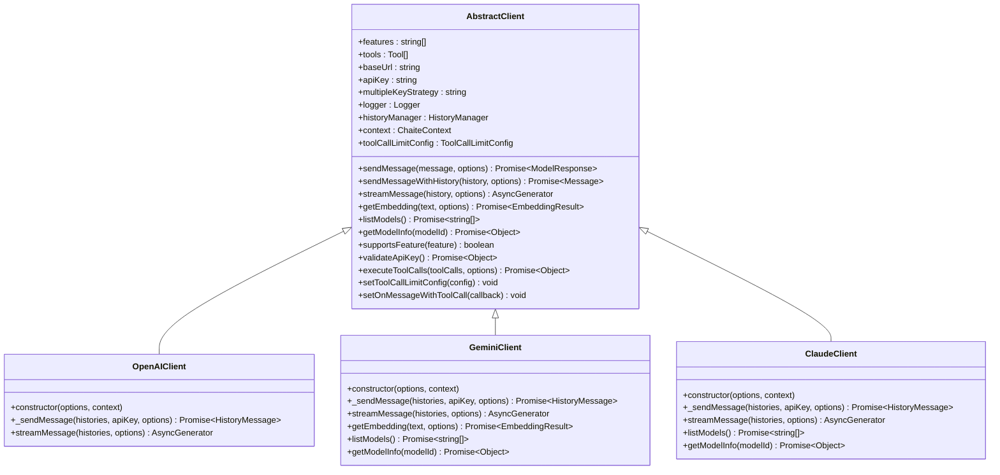

**图表来源**
- [AbstractClient.js](file://src/core/adapters/AbstractClient.js#L1219-L1245)
- [OpenAIClient.js](file://src/core/adapters/openai/OpenAIClient.js#L145-L153)
- [GeminiClient.js](file://src/core/adapters/gemini/GeminiClient.js#L22-L30)
- [ClaudeClient.js](file://src/core/adapters/claude/ClaudeClient.js#L19-L27)

#### 抽象方法定义

抽象基类定义了以下必须实现的方法：

| 方法 | 描述 | 返回值 |
|------|------|--------|
| `_sendMessage(histories, apiKey, options)` | 发送消息到具体 AI 服务 | `Promise<HistoryMessage & { usage: ModelUsage }>` |
| `streamMessage(history, options)` | 流式发送消息 | `Promise<AsyncGenerator<string>>` |
| `getEmbedding(text, options)` | 获取嵌入向量 | `Promise<EmbeddingResult>` |
| `listModels()` | 列出可用模型 | `Promise<string[]>` |
| `getModelInfo(modelId)` | 获取模型信息 | `Promise<Object>` |

**章节来源**
- [AbstractClient.js](file://src/core/adapters/AbstractClient.js#L1534-L1590)

## 架构概览

系统采用分层架构，通过适配器模式实现对多种 AI 服务的统一访问：

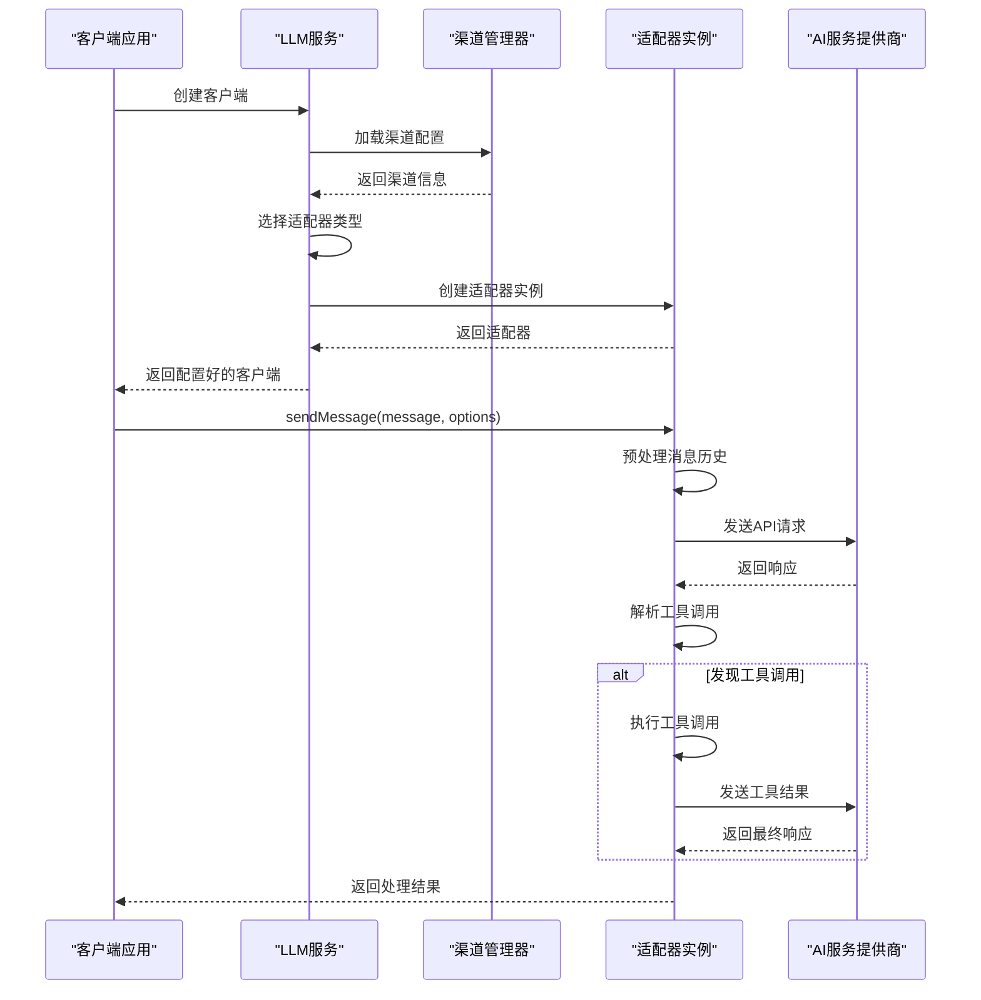

**图表来源**
- [LlmService.js](file://src/services/llm/LlmService.js#L21-L135)
- [ChannelManager.js](file://src/services/llm/ChannelManager.js#L659-L754)
- [AbstractClient.js](file://src/core/adapters/AbstractClient.js#L1253-L1453)

**章节来源**
- [LlmService.js](file://src/services/llm/LlmService.js#L1-L300)
- [ChannelManager.js](file://src/services/llm/ChannelManager.js#L1-L800)

## 详细组件分析

### AbstractClient 抽象基类详解

#### 构造函数和初始化

AbstractClient 的构造函数负责初始化客户端的基础配置：

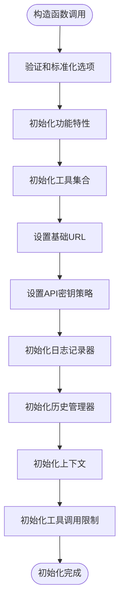

**图表来源**
- [AbstractClient.js](file://src/core/adapters/AbstractClient.js#L1224-L1245)

#### 消息发送流程

sendMessage 方法实现了完整的消息处理流程：

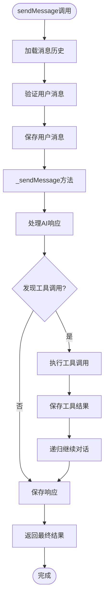

**图表来源**
- [AbstractClient.js](file://src/core/adapters/AbstractClient.js#L1253-L1453)

#### 工具调用系统

工具调用系统是 AbstractClient 的核心功能之一，提供了完整的工具执行生命周期：

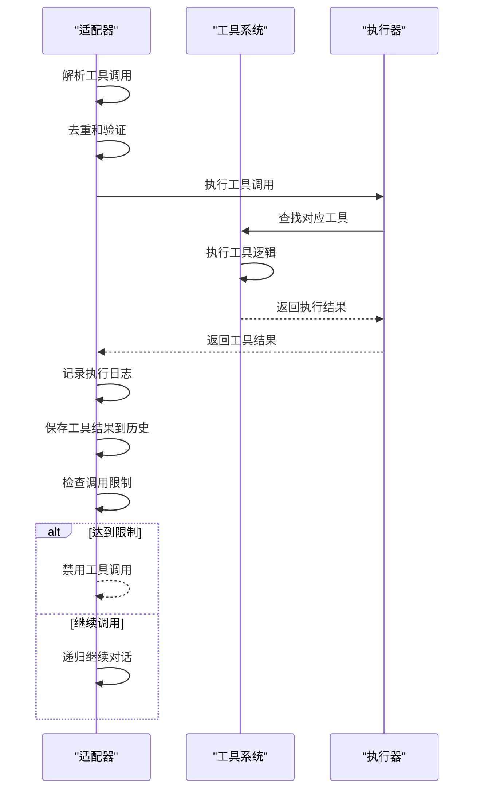

**图表来源**
- [AbstractClient.js](file://src/core/adapters/AbstractClient.js#L1873-L2080)

**章节来源**
- [AbstractClient.js](file://src/core/adapters/AbstractClient.js#L1219-L2098)

### 具体适配器实现

#### OpenAIClient 实现

OpenAIClient 实现了对 OpenAI API 的适配：

| 特性 | 实现细节 | 功能描述 |
|------|----------|----------|
| 消息格式 | OpenAI Chat Completions API | 支持标准消息格式和工具调用 |
| 流式响应 | SSE流式传输 | 实时接收响应内容 |
| 工具调用 | 函数调用协议 | 支持OpenAI原生工具调用 |
| 媒体处理 | URL转Base64 | 支持图片等媒体内容 |
| 思维模型 | reasoning_content | 支持推理过程输出 |

#### GeminiClient 实现

GeminiClient 实现了对 Google Gemini API 的适配：

| 特性 | 实现细节 | 功能描述 |
|------|----------|----------|
| 消息格式 | Gemini Content API | 使用Content结构表示消息 |
| 工具调用 | Function Declarations | 支持Gemini原生工具声明 |
| 嵌入向量 | Embedding API | 支持文本嵌入生成 |
| 安全设置 | Harm Categories | 支持内容安全过滤 |
| 流式响应 | Stream生成 | 支持实时内容流 |

#### ClaudeClient 实现

ClaudeClient 实现了对 Anthropic Claude API 的适配：

| 特性 | 实现细节 | 功能描述 |
|------|----------|----------|
| 消息格式 | Claude Messages API | 使用标准消息格式 |
| 工具调用 | Tool使用 | 支持Claude工具调用 |
| 流式响应 | Event Stream | 支持事件流式传输 |
| 模型信息 | 已知模型列表 | 提供模型能力信息 |
| 限制处理 | 不支持嵌入 | 明确功能限制 |

**章节来源**
- [OpenAIClient.js](file://src/core/adapters/openai/OpenAIClient.js#L1-L1109)
- [GeminiClient.js](file://src/core/adapters/gemini/GeminiClient.js#L1-L385)
- [ClaudeClient.js](file://src/core/adapters/claude/ClaudeClient.js#L1-L248)

### 适配器注册机制

系统采用工厂模式和注册机制来管理适配器：

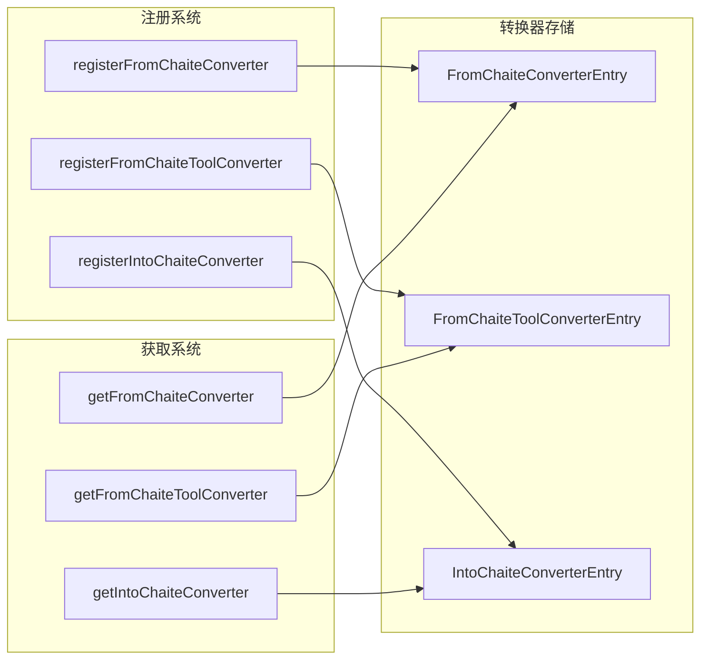

**图表来源**
- [converter.js](file://src/core/utils/converter.js#L13-L149)

**章节来源**
- [converter.js](file://src/core/utils/converter.js#L1-L150)
- [index.js](file://src/core/adapters/index.js#L15-L22)

## 依赖关系分析

系统的依赖关系体现了清晰的分层架构：

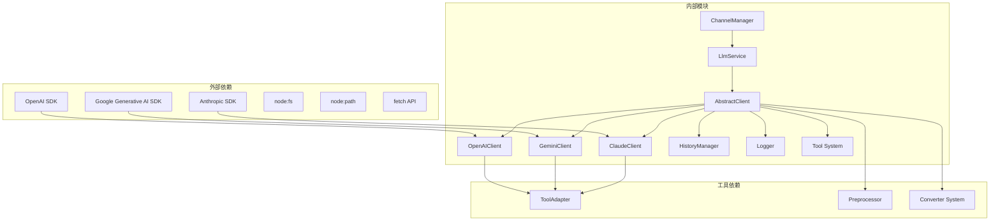

**图表来源**
- [OpenAIClient.js](file://src/core/adapters/openai/OpenAIClient.js#L1-L16)
- [GeminiClient.js](file://src/core/adapters/gemini/GeminiClient.js#L1-L6)
- [ClaudeClient.js](file://src/core/adapters/claude/ClaudeClient.js#L1-L5)
- [AbstractClient.js](file://src/core/adapters/AbstractClient.js#L1-L11)

**章节来源**
- [OpenAIClient.js](file://src/core/adapters/openai/OpenAIClient.js#L1-L17)
- [GeminiClient.js](file://src/core/adapters/gemini/GeminiClient.js#L1-L7)
- [ClaudeClient.js](file://src/core/adapters/claude/ClaudeClient.js#L1-L6)

## 性能考虑

### 工具调用优化

系统实现了多层工具调用优化机制：

1. **并发执行**：支持并行执行独立工具调用
2. **串行执行**：对需要保持顺序的工具调用进行串行处理
3. **调用限制**：防止无限循环和过度调用
4. **结果缓存**：避免重复执行相同工具调用

### 媒体处理优化

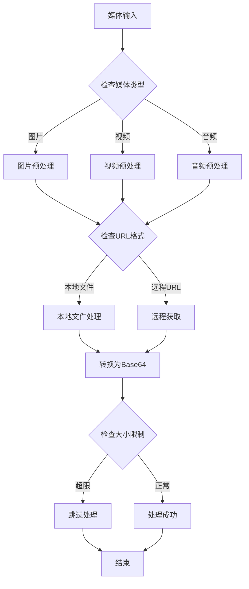

**图表来源**
- [AbstractClient.js](file://src/core/adapters/AbstractClient.js#L1036-L1150)

### 错误处理和重试机制

系统实现了完善的错误处理和重试机制：

1. **API错误捕获**：捕获并记录详细的API错误信息
2. **自动重试**：对可重试的网络错误进行自动重试
3. **降级处理**：在错误情况下提供合理的降级方案
4. **错误日志**：详细记录错误信息便于调试

**章节来源**
- [AbstractClient.js](file://src/core/adapters/AbstractClient.js#L1614-L1666)
- [OpenAIClient.js](file://src/core/adapters/openai/OpenAIClient.js#L499-L542)

## 故障排除指南

### 常见问题诊断

#### 工具调用循环问题

当系统检测到工具调用循环时，会自动禁用工具调用以防止无限循环：

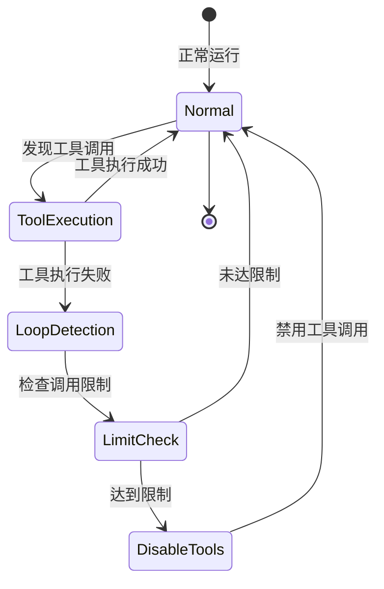

**图表来源**
- [AbstractClient.js](file://src/core/adapters/AbstractClient.js#L1412-L1428)

#### API密钥验证

系统提供了API密钥验证功能：

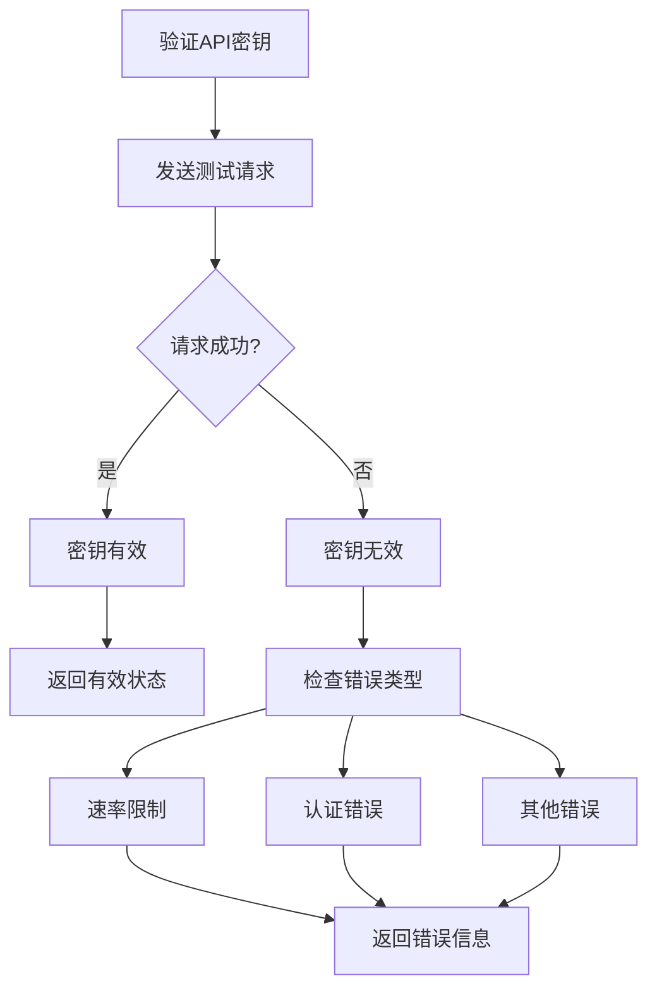

**图表来源**
- [AbstractClient.js](file://src/core/adapters/AbstractClient.js#L1605-L1612)

**章节来源**
- [AbstractClient.js](file://src/core/adapters/AbstractClient.js#L1602-L1612)

## 结论

本项目的适配器模式设计展现了优秀的软件工程实践：

### 设计优势

1. **高度可扩展性**：通过抽象基类和工厂模式，轻松添加新的 AI 服务提供商
2. **统一接口**：为不同 AI API 提供一致的编程体验
3. **强大工具系统**：内置完整的工具调用执行和管理机制
4. **完善的错误处理**：提供多层次的错误捕获和恢复机制
5. **性能优化**：通过并发执行、缓存和优化的数据流提升整体性能

### 最佳实践建议

1. **遵循抽象基类规范**：新适配器必须实现所有抽象方法
2. **合理使用工具调用**：利用内置的工具调用限制机制防止滥用
3. **充分利用转换器系统**：通过转换器实现不同格式之间的无缝转换
4. **实施适当的错误处理**：利用系统的错误处理机制提升稳定性
5. **监控和日志记录**：利用内置的日志系统进行问题诊断和性能监控

该设计模式为构建可扩展、可维护的 AI 应用程序提供了坚实的基础，能够有效应对不断变化的 AI 服务环境和技术要求。