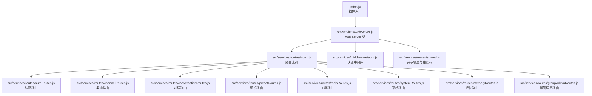
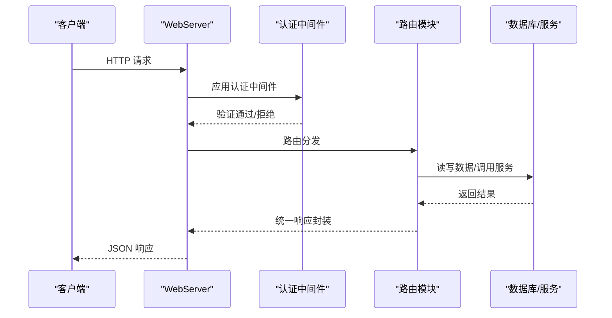
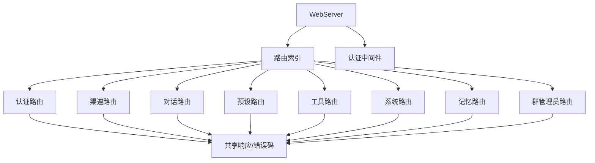

# API 接口参考

<cite>
**本文档引用的文件**
- [index.js](file://index.js)
- [package.json](file://package.json)
- [README.md](file://README.md)
- [src/services/webServer.js](file://src/services/webServer.js)
- [src/services/routes/index.js](file://src/services/routes/index.js)
- [src/services/routes/shared.js](file://src/services/routes/shared.js)
- [src/services/middleware/auth.js](file://src/services/middleware/auth.js)
- [src/services/routes/authRoutes.js](file://src/services/routes/authRoutes.js)
- [src/services/routes/channelRoutes.js](file://src/services/routes/channelRoutes.js)
- [src/services/routes/conversationRoutes.js](file://src/services/routes/conversationRoutes.js)
- [src/services/routes/presetRoutes.js](file://src/services/routes/presetRoutes.js)
- [src/services/routes/toolsRoutes.js](file://src/services/routes/toolsRoutes.js)
- [src/services/routes/systemRoutes.js](file://src/services/routes/systemRoutes.js)
- [src/services/routes/memoryRoutes.js](file://src/services/routes/memoryRoutes.js)
- [src/services/routes/groupAdminRoutes.js](file://src/services/routes/groupAdminRoutes.js)
</cite>

## 目录
1. [简介](#简介)
2. [项目结构](#项目结构)
3. [核心组件](#核心组件)
4. [架构总览](#架构总览)
5. [详细组件分析](#详细组件分析)
6. [依赖关系分析](#依赖关系分析)
7. [性能考虑](#性能考虑)
8. [故障排除指南](#故障排除指南)
9. [结论](#结论)
10. [附录](#附录)

## 简介
本文件为 ChatAI 插件的完整 API 接口参考文档，涵盖 RESTful API 的规范与使用方法。内容包括：
- HTTP 方法、URL 模式、请求/响应格式
- 认证与授权机制
- 路由分组功能说明：认证路由、渠道路由、对话路由、群组管理路由、工具路由、系统路由、记忆路由等
- 请求示例与响应格式（成功与错误）
- 中间件使用：身份验证、请求处理、错误处理
- API 版本管理、速率限制、安全考虑等最佳实践
- 面向开发者的集成与使用指导

## 项目结构
ChatAI 插件基于 Node.js + Express 提供 Web 管理面板与 REST API，核心入口负责启动 Web 服务器与加载各路由模块。

图表来源
- [index.js](file://index.js#L1-L258)
- [src/services/webServer.js](file://src/services/webServer.js#L1-L807)
- [src/services/routes/index.js](file://src/services/routes/index.js#L1-L52)

章节来源
- [index.js](file://index.js#L1-L258)
- [src/services/webServer.js](file://src/services/webServer.js#L1-L807)
- [src/services/routes/index.js](file://src/services/routes/index.js#L1-L52)

## 核心组件
- WebServer：负责 Express 应用初始化、中间件配置、路由挂载、静态资源托管、登录流程与健康检查。
- 路由模块：按功能分组提供 REST API，统一使用共享响应封装与错误码。
- 认证中间件：支持 JWT、临时 Token、API Key、群管理员会话等多种认证方式，并提供速率限制与安全头中间件。
- 共享工具：统一的响应封装 ChaiteResponse/ApiResponse、错误码定义、数据库服务获取。

章节来源
- [src/services/webServer.js](file://src/services/webServer.js#L1-L807)
- [src/services/routes/shared.js](file://src/services/routes/shared.js#L1-L150)
- [src/services/middleware/auth.js](file://src/services/middleware/auth.js#L1-L533)

## 架构总览
WebServer 作为统一入口，集中处理认证、CORS、静态资源与路由分发；各路由模块负责具体业务逻辑，共享响应与错误码保证一致性。

图表来源
- [src/services/webServer.js](file://src/services/webServer.js#L288-L537)
- [src/services/middleware/auth.js](file://src/services/middleware/auth.js#L179-L254)
- [src/services/routes/shared.js](file://src/services/routes/shared.js#L93-L125)

## 详细组件分析

### 认证与授权机制
- 支持多种认证方式：
  - Bearer JWT：用于常规 API 调用
  - Cookie Token：用于前端会话保持
  - 查询参数 Token：用于 SSE 连接
  - 临时 Token：通过公开接口生成，有效期 5 分钟
  - 永久 Token：通过受保护接口生成，可撤销
  - API Key：通过请求头 X-API-Key 传递
  - 群管理员会话：通过一次性登录码换取 24 小时会话 Token
- 速率限制：基于 IP 或用户 ID 的滑动窗口限流，返回 X-RateLimit-* 响应头
- 安全头：X-Frame-Options、X-Content-Type-Options、X-XSS-Protection、Referrer-Policy
- 请求日志：可选记录请求体与响应，对敏感字段脱敏

章节来源
- [src/services/webServer.js](file://src/services/webServer.js#L313-L492)
- [src/services/middleware/auth.js](file://src/services/middleware/auth.js#L179-L533)
- [src/services/routes/authRoutes.js](file://src/services/routes/authRoutes.js#L1-L309)

### 认证路由（/api/auth）
- GET /api/auth/login/token：通过临时 Token 生成 JWT 并设置 Cookie
- POST /api/auth/login：通过临时/永久 Token 生成 JWT
- GET /api/auth/verify-token：验证 Token 并刷新 JWT
- GET /api/auth/status：查询当前认证状态
- POST /api/auth/token/generate：生成 5 分钟临时 Token（控制台输出）
- POST /api/auth/token/permanent：生成/获取永久 Token
- DELETE /api/auth/token/permanent：撤销永久 Token
- GET /api/auth/token/status：查询永久 Token 状态

请求示例
- POST /api/auth/login
  - 请求头：Authorization: Bearer <临时/永久 Token>
  - 响应：包含 JWT 与过期时间
- GET /api/auth/token/generate
  - 响应：包含临时 Token 与有效期

响应格式
- 成功：{ code: 0, data: ..., message: "ok" }
- 失败：{ code: -1, data: null, message: "<错误信息>" }

章节来源
- [src/services/webServer.js](file://src/services/webServer.js#L377-L492)
- [src/services/routes/authRoutes.js](file://src/services/routes/authRoutes.js#L211-L296)

### 渠道路由（/api/channels）
- GET /api/channels/list：获取所有渠道（可带 withStats 参数）
- GET /api/channels/stats：获取渠道统计
- POST /api/channels：创建渠道
- PUT /api/channels/:id：更新渠道
- DELETE /api/channels/:id：删除渠道
- GET /api/channels/:id：获取单个渠道
- POST /api/channels/test：测试单个渠道连通性
- POST /api/channels/fetch-models：获取可用模型列表
- POST /api/channels/batch-test：批量测试模型
- POST /api/channels/test-model：测试指定模型

请求示例
- POST /api/channels/test
  - 请求体：{ id, adapterType, baseUrl, apiKey, apiKeys, models, advanced, strategy, chatPath }
  - 响应：包含测试结果、耗时、模型、Key 信息

响应格式
- 成功：{ code: 0, data: ..., message: "ok" }
- 失败：{ code: -1, data: null, message: "<错误信息>" }

章节来源
- [src/services/routes/channelRoutes.js](file://src/services/routes/channelRoutes.js#L1-L535)

### 对话路由（/api/conversations 与 /api/context）
- GET /api/conversations/list：列出所有对话
- DELETE /api/conversations/clear-all：清空所有对话并清理上下文锁
- GET /api/conversations/:id/messages：获取对话消息（支持 limit）
- DELETE /api/conversations/:id：删除指定对话
- GET /api/context/list：获取活动上下文
- POST /api/context/clear：清理指定用户或对话的上下文

请求示例
- DELETE /api/conversations/clear-all
  - 响应：包含删除计数

响应格式
- 成功：{ code: 0, data: ..., message: "ok" }
- 失败：{ code: -1, data: null, message: "<错误信息>" }

章节来源
- [src/services/routes/conversationRoutes.js](file://src/services/routes/conversationRoutes.js#L1-L118)

### 预设路由（/api/preset 与 /api/presets）
- GET /api/preset/list：获取所有预设
- GET /api/preset/:id：获取单个预设
- POST /api/preset/：创建预设
- PUT /api/preset/:id：更新预设（支持设置默认预设）
- DELETE /api/preset/:id：删除预设
- POST /api/preset/:id/default：设置默认预设
- GET /api/preset/:id/prompt：获取系统提示词
- POST /api/preset/from-builtin/:builtinId：从内置预设创建新预设
- GET /api/presets/config：获取预设配置
- PUT /api/presets/config：更新预设配置
- GET /api/presets/builtin：获取内置预设
- GET /api/presets/categories：获取预设分类

请求示例
- PUT /api/preset/:id/default
  - 响应：{ success: true }

响应格式
- 成功：{ code: 0, data: ..., message: "ok" }
- 失败：{ code: -1, data: null, message: "<错误信息>" }

章节来源
- [src/services/routes/presetRoutes.js](file://src/services/routes/presetRoutes.js#L1-L251)

### 工具路由（/api/tools）
- GET /api/tools/list：获取所有工具（含内置与自定义）
- GET /api/tools/builtin：获取内置工具
- GET /api/tools/builtin/config：获取内置工具配置
- PUT /api/tools/builtin/config：更新内置工具配置
- GET /api/tools/builtin/list：获取内置工具列表
- GET /api/tools/builtin/categories：获取内置工具类别
- POST /api/tools/builtin/category/toggle：切换类别启用状态
- POST /api/tools/builtin/tool/toggle：切换单个工具启用状态
- POST /api/tools/builtin/refresh：刷新内置工具
- GET /api/tools/enabled：获取启用的工具
- PUT /api/tools/enabled：更新启用的工具
- POST /api/tools/toggle/:name：切换工具启用状态
- GET /api/tools/custom：获取自定义工具
- POST /api/tools/custom：创建自定义工具
- PUT /api/tools/custom/:name：更新自定义工具
- DELETE /api/tools/custom/:name：删除自定义工具
- GET /api/tools/js：获取 JS 工具列表
- GET /api/tools/js/:name：获取 JS 工具源码
- PUT /api/tools/js/:name：更新 JS 工具源码
- POST /api/tools/js：创建 JS 工具
- DELETE /api/tools/js/:name：删除 JS 工具
- POST /api/tools/js/reload：重载 JS 工具
- POST /api/tools/refresh：刷新工具列表
- POST /api/tools/test：测试工具调用
- GET /api/tools/logs：获取工具调用日志
- DELETE /api/tools/logs：清除工具调用日志
- POST /api/tools/builtin/enable-all：一键启用所有工具
- POST /api/tools/builtin/disable-all：一键禁用所有工具
- POST /api/tools/reload-all：热重载所有工具
- GET /api/tools/stats：获取工具统计
- GET /api/tools/dangerous：获取危险工具列表与配置
- PUT /api/tools/dangerous：更新危险工具配置
- POST /api/tools/dangerous/toggle：切换危险工具状态
- GET /api/tools/event-probability：获取事件处理概率配置
- PUT /api/tools/event-probability：更新事件处理概率配置
- GET /api/tools/watcher/status：获取文件监听状态
- POST /api/tools/watcher/toggle：切换文件监听器

请求示例
- POST /api/tools/test
  - 请求体：{ toolName, arguments }
  - 响应：包含工具名、参数、结果、耗时与成功标志

响应格式
- 成功：{ code: 0, data: ..., message: "ok" }
- 失败：{ code: -1, data: null, message: "<错误信息>" }

章节来源
- [src/services/routes/toolsRoutes.js](file://src/services/routes/toolsRoutes.js#L1-L705)

### 系统路由（/api/system）
- GET /api/system/health：健康检查
- GET /api/system/version：获取版本信息
- GET /api/system/metrics：性能指标
- GET /api/system/system/info：系统信息
- GET /api/system/stats：基础统计
- GET /api/system/stats/full：完整统计
- POST /api/system/stats/reset：重置统计
- GET /api/system/stats/usage：API 使用统计
- GET /api/system/stats/usage/recent：最近使用记录
- GET /api/system/stats/usage/channel/:id：渠道使用统计
- POST /api/system/stats/usage/clear：清除使用统计
- GET /api/system/stats/tool-calls：工具调用统计
- GET /api/system/stats/tool-calls/records：工具调用记录
- GET /api/system/stats/tool-calls/record/:id：单条记录详情
- GET /api/system/stats/tool-calls/errors：工具调用错误
- GET /api/system/stats/unified：统一完整统计
- POST /api/system/stats/tool-calls/clear：清除工具调用统计
- GET /api/system/system/monitor：实时监控信息
- DELETE /api/system/system/release_port：释放端口（热重载）
- GET /api/system/system/version：获取版本信息
- GET /api/system/system/server-mode：获取服务器模式信息
- PUT /api/system/system/server-mode：设置共享端口模式
- POST /api/system/system/restart：重启服务

请求示例
- GET /api/system/system/monitor
  - 响应：包含内存、API、系统状态与时间戳

响应格式
- 成功：{ code: 0, data: ..., message: "ok" }
- 失败：{ code: -1, data: null, message: "<错误信息>" }

章节来源
- [src/services/routes/systemRoutes.js](file://src/services/routes/systemRoutes.js#L1-L590)

### 记忆路由（/api/memory）
- GET /api/memory/users：获取所有有记忆的用户
- DELETE /api/memory/clear-all：清空所有用户记忆
- POST /api/memory/search：搜索记忆
- POST /api/memory/group/:groupId/summarize：群记忆总结
- GET /api/memory/:userId：获取用户记忆
- POST /api/memory/：添加记忆
- POST /api/memory/:userId/summarize：用户记忆总结
- DELETE /api/memory/:userId/:memoryId：删除特定记忆
- DELETE /api/memory/:userId：清空用户所有记忆

请求示例
- POST /api/memory/
  - 请求体：{ userId, content, metadata }
  - 响应：新增记忆对象

响应格式
- 成功：{ code: 0, data: ..., message: "ok" }
- 失败：{ code: -1, data: null, message: "<错误信息>" }

章节来源
- [src/services/routes/memoryRoutes.js](file://src/services/routes/memoryRoutes.js#L1-L137)

### 群管理员路由（/api/group-admin）
- POST /api/group-admin/login：通过一次性登录码换取会话 Token
- GET /api/group-admin/verify：验证会话 Token
- GET /api/group-admin/config：获取群配置（含预设、渠道、知识库、表情统计、功能开关、模型配置、黑白名单、使用限制、总结配置、工具调用配置、事件处理配置、独立渠道等）
- PUT /api/group-admin/config：更新群配置
- GET /api/group-admin/blacklist：获取黑名单
- PUT /api/group-admin/blacklist：更新黑名单
- POST /api/group-admin/blacklist/add：添加到黑名单
- POST /api/group-admin/blacklist/remove：从黑名单移除

请求示例
- POST /api/group-admin/login
  - 请求体：{ code }
  - 响应：包含会话 Token、群 ID、用户 ID 与过期时间

响应格式
- 成功：{ code: 0, data: ..., message: "ok" }
- 失败：{ code: -1, data: null, message: "<错误信息>" }

章节来源
- [src/services/routes/groupAdminRoutes.js](file://src/services/routes/groupAdminRoutes.js#L1-L1170)

### 共享响应与错误码
- 统一响应封装：ChaiteResponse/ApiResponse
- 错误码定义：涵盖通用、参数验证、资源、渠道、限流、系统、外部服务、工具、MCP 等错误类型
- 数据库服务：提供数据库实例获取与原生数据库实例获取

章节来源
- [src/services/routes/shared.js](file://src/services/routes/shared.js#L1-L150)

## 依赖关系分析
- WebServer 依赖路由索引与各路由模块，统一应用认证中间件与 CORS、安全头等中间件
- 路由模块依赖共享响应与错误码，部分模块依赖数据库服务与统计服务
- 认证中间件提供多种认证方式与速率限制，系统路由依赖统计服务与进程信息

图表来源
- [src/services/webServer.js](file://src/services/webServer.js#L124-L144)
- [src/services/routes/index.js](file://src/services/routes/index.js#L6-L23)
- [src/services/routes/shared.js](file://src/services/routes/shared.js#L1-L150)

章节来源
- [src/services/webServer.js](file://src/services/webServer.js#L124-L144)
- [src/services/routes/index.js](file://src/services/routes/index.js#L1-L52)
- [src/services/routes/shared.js](file://src/services/routes/shared.js#L1-L150)

## 性能考虑
- 速率限制：默认按 IP 限流，可通过参数按用户限流；响应头包含限流信息
- 请求日志：可选记录请求体与响应，注意敏感字段脱敏
- 健康检查：提供 /api/system/health 与 /api/health，便于监控与负载均衡
- 统计与监控：系统路由提供实时监控信息，包含内存、RPM、成功率、平均延迟与 Token 使用情况
- 静态资源：WebServer 提供静态文件托管，建议生产环境由反向代理提供

章节来源
- [src/services/middleware/auth.js](file://src/services/middleware/auth.js#L375-L401)
- [src/services/routes/systemRoutes.js](file://src/services/routes/systemRoutes.js#L378-L452)
- [src/services/webServer.js](file://src/services/webServer.js#L288-L311)

## 故障排除指南
- 认证失败：检查 Token 是否有效、是否过期、是否绑定设备指纹
- 渠道测试失败：检查 API Key、Base URL、模型列表与网络连通性
- 工具调用失败：检查工具启用状态、危险工具配置、机器人权限与日志
- 群管理员登录失败：检查一次性登录码是否正确、是否过期
- 端口占用：WebServer 支持自动释放端口与端口递增尝试

章节来源
- [src/services/webServer.js](file://src/services/webServer.js#L450-L507)
- [src/services/routes/channelRoutes.js](file://src/services/routes/channelRoutes.js#L97-L287)
- [src/services/routes/groupAdminRoutes.js](file://src/services/routes/groupAdminRoutes.js#L196-L221)

## 结论
本 API 参考文档系统性地梳理了 ChatAI 插件的 RESTful 接口，覆盖认证、渠道、对话、预设、工具、系统、记忆与群管理员等核心功能。通过统一的响应封装与错误码、灵活的认证与速率限制机制，以及完善的监控与统计接口，开发者可以高效集成与扩展系统功能。

## 附录
- 默认端口：3000（可配置），支持共享端口模式（TRSS 环境）
- 依赖：Express、jsonwebtoken、better-sqlite3、ioredis 等
- 版本信息：通过 Git 获取提交号、分支与时间，支持内测版与公开版识别

章节来源
- [README.md](file://README.md#L44-L118)
- [package.json](file://package.json#L16-L46)
- [src/services/webServer.js](file://src/services/webServer.js#L582-L602)
- [src/services/routes/systemRoutes.js](file://src/services/routes/systemRoutes.js#L24-L159)