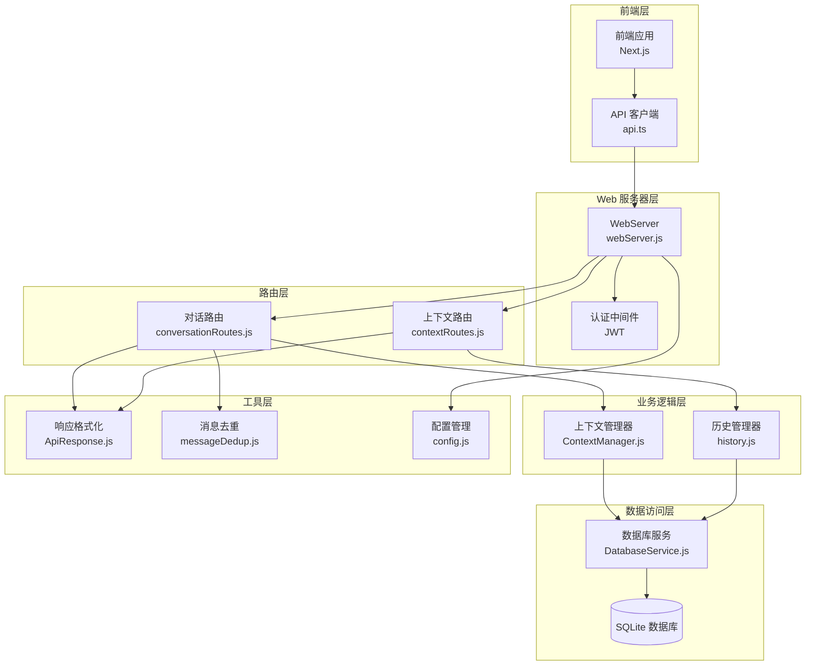
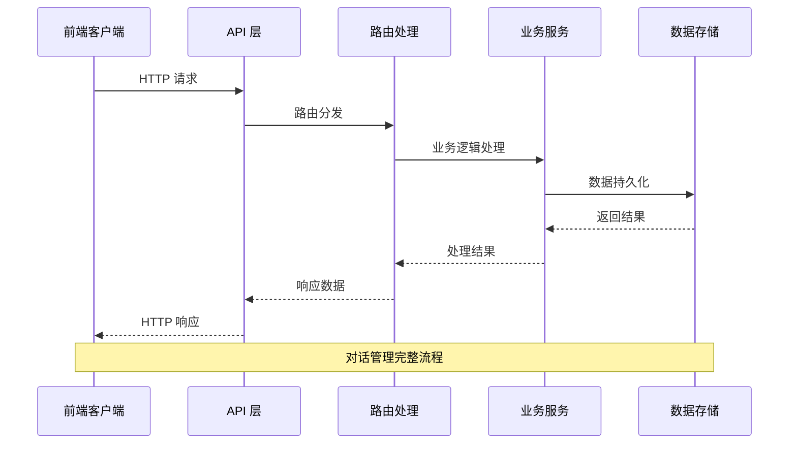
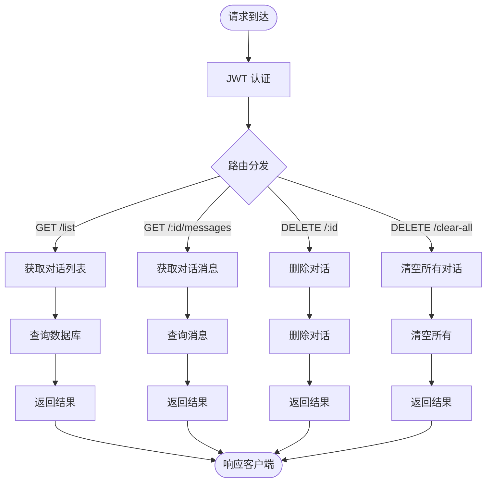
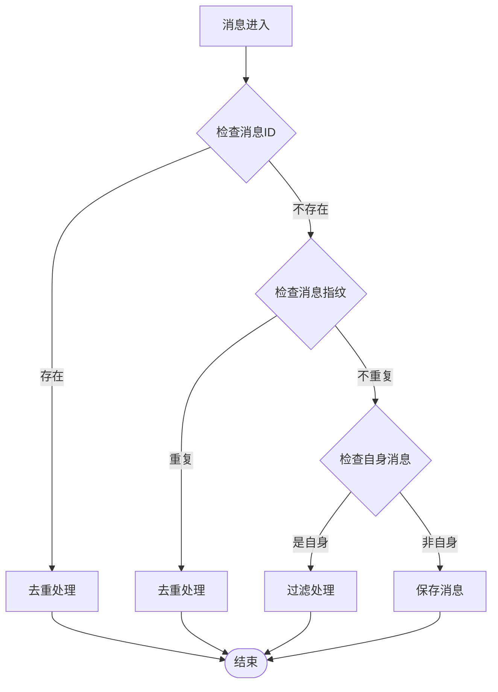
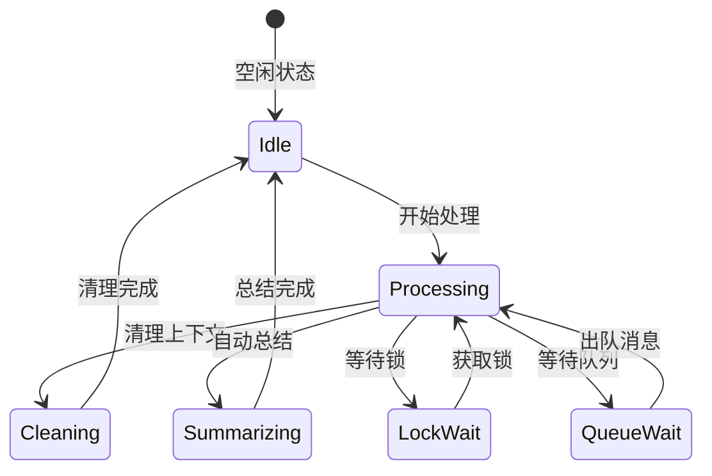
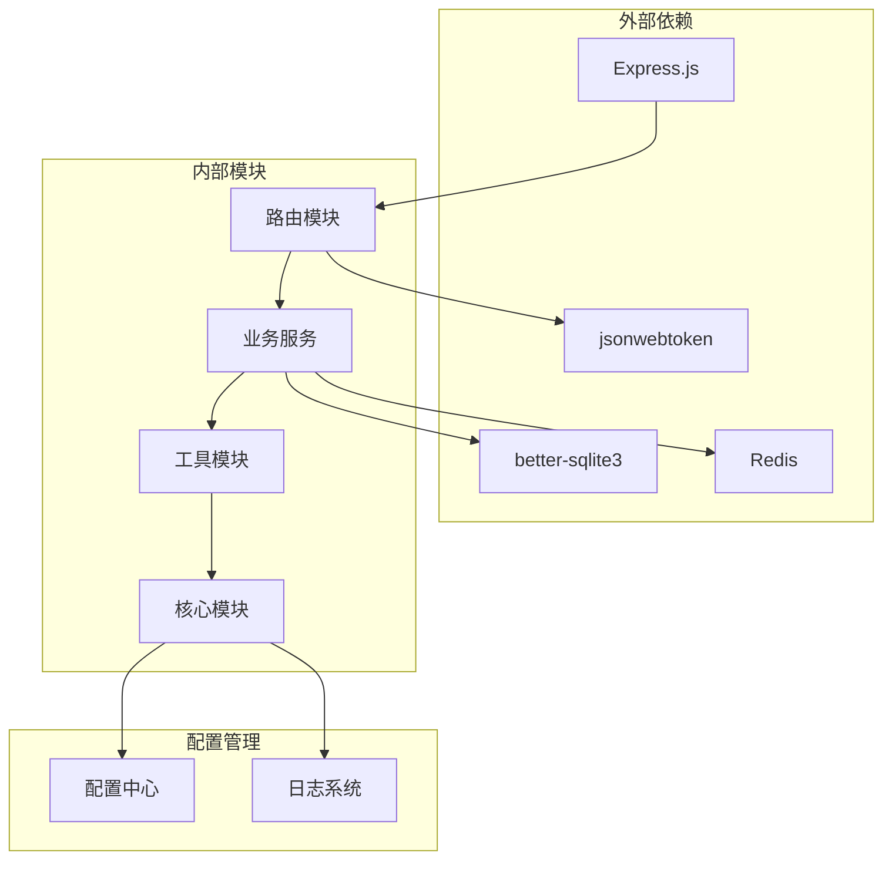
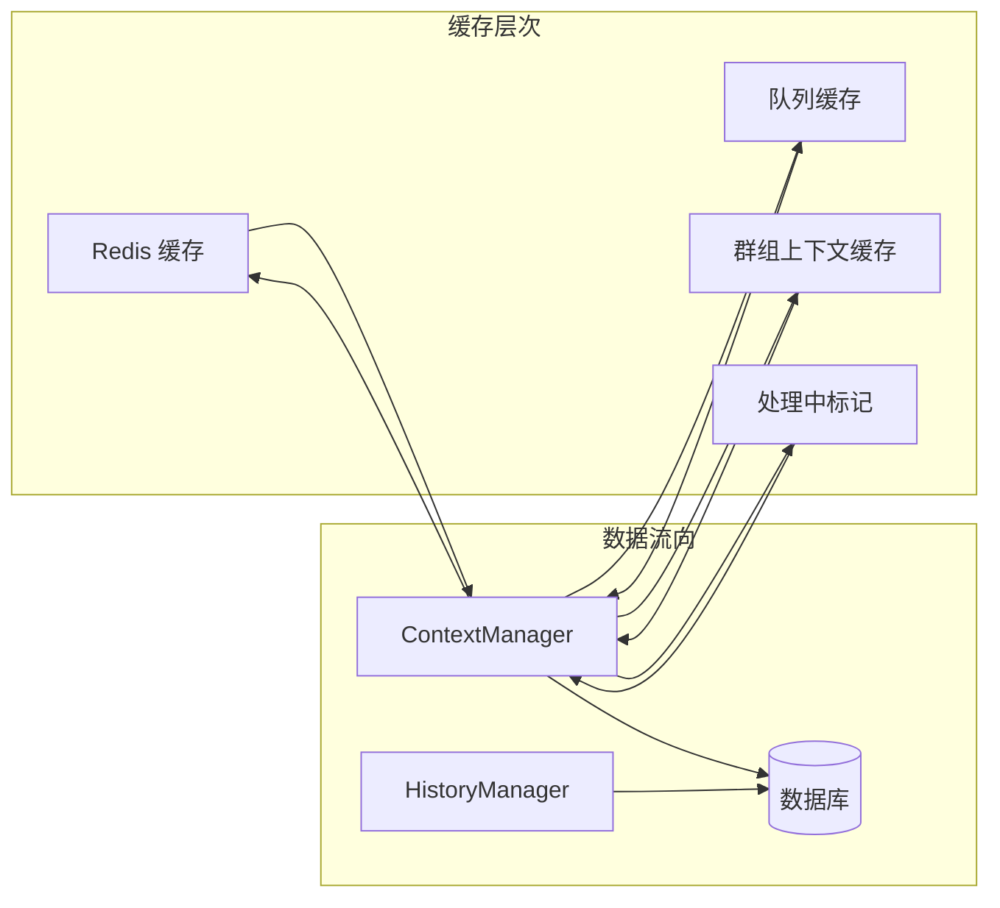
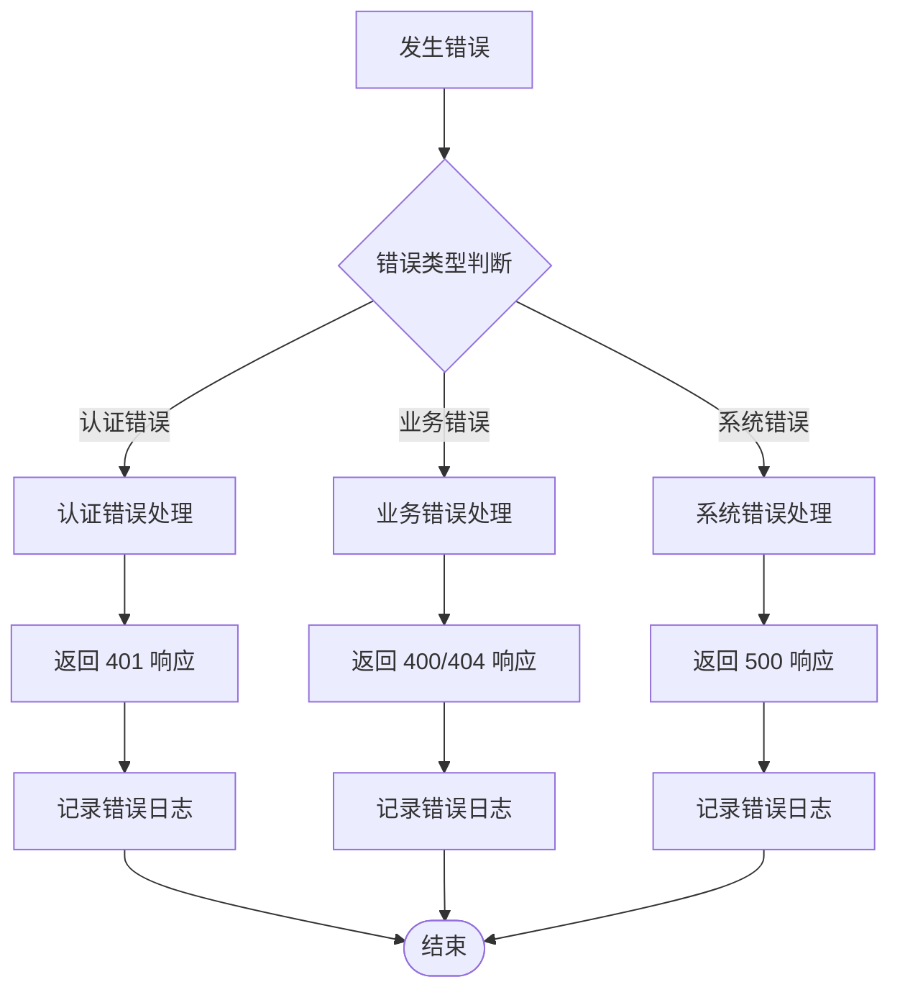

# 对话管理 API

<cite>
**本文档引用的文件**
- [conversationRoutes.js](file://src/services/routes/conversationRoutes.js)
- [DatabaseService.js](file://src/services/storage/DatabaseService.js)
- [history.js](file://src/core/utils/history.js)
- [ContextManager.js](file://src/services/llm/ContextManager.js)
- [ApiResponse.js](file://src/services/middleware/ApiResponse.js)
- [shared.js](file://src/services/routes/shared.js)
- [webServer.js](file://src/services/webServer.js)
- [config.js](file://config/config.js)
- [api.ts](file://frontend/lib/api.ts)
- [messageDedup.js](file://src/utils/messageDedup.js)
</cite>

## 目录
1. [简介](#简介)
2. [项目结构](#项目结构)
3. [核心组件](#核心组件)
4. [架构概览](#架构概览)
5. [详细组件分析](#详细组件分析)
6. [依赖关系分析](#依赖关系分析)
7. [性能考虑](#性能考虑)
8. [故障排除指南](#故障排除指南)
9. [结论](#结论)

## 简介

对话管理 API 是 ChatGPT 插件的核心功能模块，负责管理聊天对话的生命周期。该系统提供了完整的对话管理能力，包括对话创建、查询、删除和历史记录管理。系统采用分层架构设计，结合消息去重机制和智能上下文管理，确保对话体验的流畅性和可靠性。

## 项目结构

对话管理 API 的整体架构采用模块化设计，主要分为以下几个层次：

**图表来源**
- [webServer.js](file://src/services/webServer.js#L124-L144)
- [conversationRoutes.js](file://src/services/routes/conversationRoutes.js#L1-L118)
- [ContextManager.js](file://src/services/llm/ContextManager.js#L1-L800)

**章节来源**
- [webServer.js](file://src/services/webServer.js#L124-L144)
- [conversationRoutes.js](file://src/services/routes/conversationRoutes.js#L1-L118)

## 核心组件

### 对话路由模块

对话路由模块提供了完整的对话管理接口，包括对话列表查询、消息获取、对话删除和批量清理功能。

**主要路由接口：**
- `GET /api/conversations/list` - 获取所有对话列表
- `GET /api/conversations/:id/messages` - 获取指定对话的所有消息
- `DELETE /api/conversations/:id` - 删除指定对话
- `DELETE /api/conversations/clear-all` - 清空所有对话

### 上下文管理模块

上下文管理器负责维护对话的上下文状态，包括消息队列、并发控制、自动总结等功能。

**核心功能：**
- 消息去重和防抖处理
- 并发请求控制
- 自动上下文清理
- 智能对话总结

### 历史管理模块

历史管理器提供对话历史的持久化存储和查询功能，支持消息的增删改查操作。

**主要特性：**
- 消息持久化存储
- 历史记录查询
- 消息修剪功能
- 对话清理

**章节来源**
- [conversationRoutes.js](file://src/services/routes/conversationRoutes.js#L14-L118)
- [ContextManager.js](file://src/services/llm/ContextManager.js#L1-L800)
- [history.js](file://src/core/utils/history.js#L1-L86)

## 架构概览

对话管理系统采用分层架构设计，确保各层职责清晰分离：

**图表来源**
- [webServer.js](file://src/services/webServer.js#L313-L337)
- [conversationRoutes.js](file://src/services/routes/conversationRoutes.js#L17-L70)

系统架构的关键特点：

1. **认证授权**：基于 JWT 的认证机制，支持临时令牌和永久令牌
2. **消息去重**：多重去重机制防止重复消息和自身消息回显
3. **上下文管理**：智能的对话上下文维护和清理策略
4. **数据持久化**：基于 SQLite 的可靠数据存储
5. **并发控制**：完善的并发请求处理和队列管理

## 详细组件分析

### 对话路由处理流程

**图表来源**
- [conversationRoutes.js](file://src/services/routes/conversationRoutes.js#L17-L70)
- [shared.js](file://src/services/routes/shared.js#L131-L136)

### 消息去重机制

系统实现了多层次的消息去重保护机制：

**图表来源**
- [messageDedup.js](file://src/utils/messageDedup.js#L177-L212)
- [DatabaseService.js](file://src/services/storage/DatabaseService.js#L263-L327)

### 上下文管理策略

**图表来源**
- [ContextManager.js](file://src/services/llm/ContextManager.js#L38-L109)
- [ContextManager.js](file://src/services/llm/ContextManager.js#L298-L344)

**章节来源**
- [conversationRoutes.js](file://src/services/routes/conversationRoutes.js#L17-L70)
- [messageDedup.js](file://src/utils/messageDedup.js#L1-L368)
- [ContextManager.js](file://src/services/llm/ContextManager.js#L1-L800)

## 依赖关系分析

对话管理 API 的依赖关系呈现清晰的分层结构：

**图表来源**
- [webServer.js](file://src/services/webServer.js#L1-L50)
- [DatabaseService.js](file://src/services/storage/DatabaseService.js#L1-L25)

### 核心依赖关系

1. **认证依赖**：JWT 认证依赖于配置中心的密钥管理
2. **数据依赖**：数据库操作依赖于 SQLite 存储和 Redis 缓存
3. **路由依赖**：路由处理依赖于统一的响应格式化模块
4. **业务依赖**：上下文管理依赖于历史管理和消息去重模块

**章节来源**
- [webServer.js](file://src/services/webServer.js#L1-L50)
- [DatabaseService.js](file://src/services/storage/DatabaseService.js#L1-L25)

## 性能考虑

### 数据库优化

系统采用了多项数据库优化策略：

1. **WAL 模式**：启用 Write-Ahead Logging 提高并发性能
2. **索引优化**：为常用查询字段建立索引
3. **批量操作**：支持批量消息查询和清理
4. **连接池**：合理管理数据库连接

### 缓存策略

**图表来源**
- [ContextManager.js](file://src/services/llm/ContextManager.js#L10-L19)
- [DatabaseService.js](file://src/services/storage/DatabaseService.js#L39-L41)

### 并发控制

系统实现了完善的并发控制机制：

1. **异步锁**：防止同一会话的并发处理
2. **消息队列**：确保消息按序处理
3. **请求计数器**：监控并发请求数量
4. **超时控制**：防止长时间阻塞

## 故障排除指南

### 常见错误类型

| 错误类型 | HTTP 状态码 | 错误代码 | 说明 |
|---------|------------|---------|------|
| 认证失败 | 401 | AUTH_INVALID | JWT 令牌无效或过期 |
| 权限不足 | 403 | PERMISSION_DENIED | 用户权限不足 |
| 资源不存在 | 404 | RESOURCE_NOT_FOUND | 对话或消息不存在 |
| 参数错误 | 400 | VALIDATION_ERROR | 请求参数验证失败 |
| 服务器错误 | 500 | UNKNOWN_ERROR | 系统内部错误 |

### 错误处理流程

**图表来源**
- [ApiResponse.js](file://src/services/middleware/ApiResponse.js#L212-L241)

### 调试建议

1. **检查认证**：确认 JWT 令牌的有效性和过期时间
2. **验证参数**：检查请求参数的完整性和格式
3. **查看日志**：分析系统日志中的错误信息
4. **监控性能**：关注数据库连接和 Redis 缓存状态

**章节来源**
- [ApiResponse.js](file://src/services/middleware/ApiResponse.js#L1-L357)

## 结论

对话管理 API 提供了完整的对话生命周期管理功能，具有以下优势：

1. **功能完整性**：涵盖对话创建、查询、删除和历史管理的全流程
2. **架构清晰**：分层设计确保代码的可维护性和可扩展性
3. **性能优化**：多重缓存和并发控制机制保证系统的高性能
4. **安全保障**：完善的认证授权和错误处理机制确保系统安全稳定
5. **开发友好**：清晰的 API 设计和详细的文档便于二次开发

系统通过智能的上下文管理和消息去重机制，为用户提供了流畅的对话体验。同时，灵活的配置选项和丰富的扩展接口为不同场景的应用提供了良好的适应性。