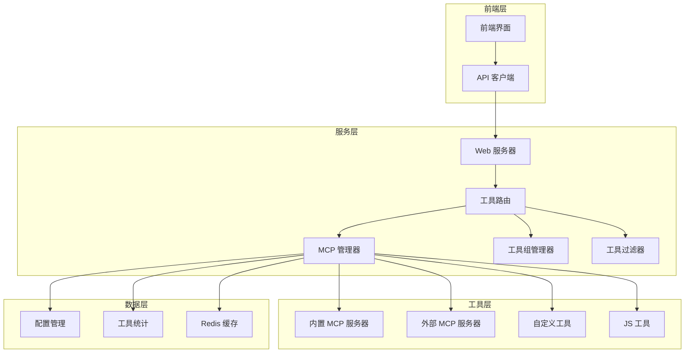
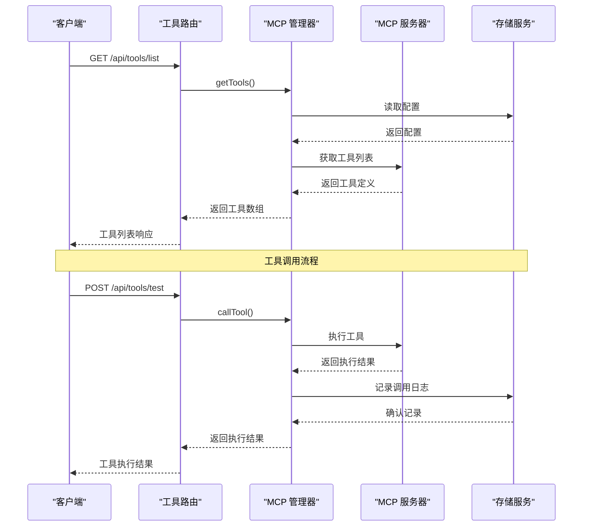
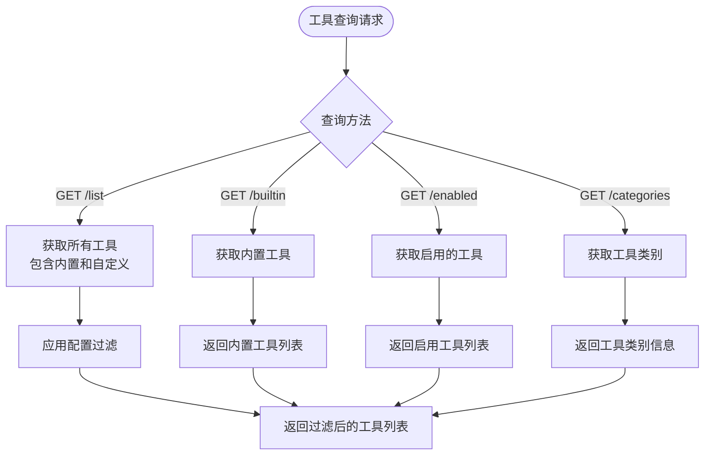
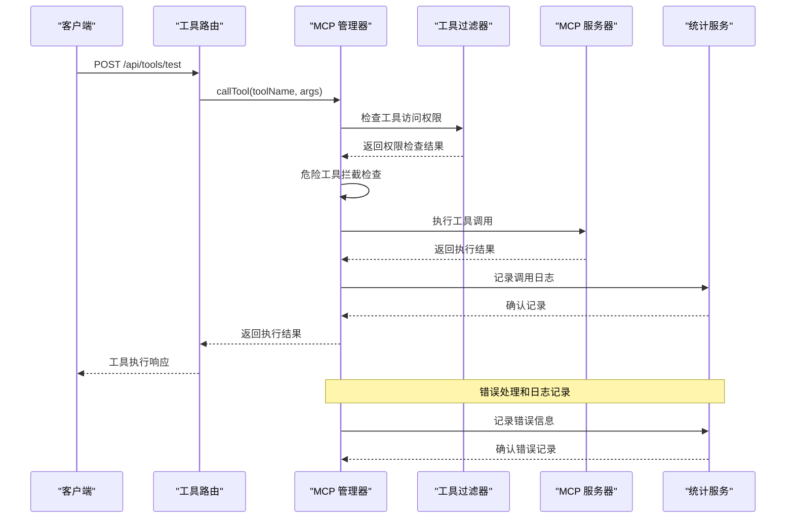
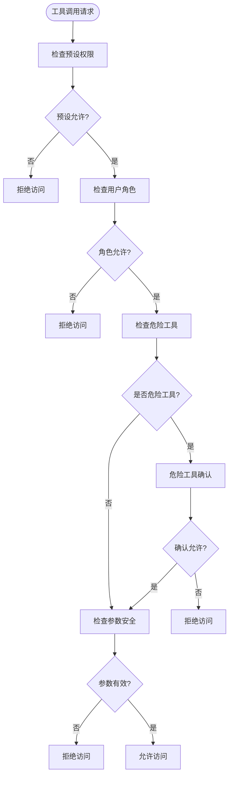
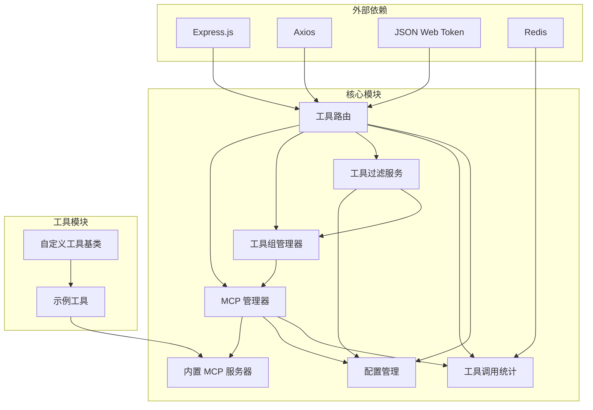

# 工具管理 API


## 目录
1. [简介](#简介)
2. [项目结构](#项目结构)
3. [核心组件](#核心组件)
4. [架构概览](#架构概览)
5. [详细组件分析](#详细组件分析)
6. [依赖关系分析](#依赖关系分析)
7. [性能考虑](#性能考虑)
8. [故障排除指南](#故障排除指南)
9. [结论](#结论)
10. [附录](#附录)

## 简介

工具管理 API 是 ChatAI 插件的核心功能模块，负责管理各种类型的工具，包括内置工具、自定义工具和外部 MCP 服务器工具。该系统提供了完整的工具生命周期管理，从注册、配置、启用和禁用，到工具发现、信息查询、执行和权限管理。

系统集成了 MCP（Model Context Protocol）协议，支持与外部工具服务器的通信，并提供了强大的工具分类、分组管理和批量操作接口。开发者可以通过简单的 API 调用来管理复杂的工具生态系统。

## 项目结构

工具管理系统的整体架构采用分层设计，主要包含以下层次：



**图表来源**
- [webServer.js](file://src/services/webServer.js#L124-L144)
- [toolsRoutes.js](file://src/services/routes/toolsRoutes.js#L1-L20)

**章节来源**
- [webServer.js](file://src/services/webServer.js#L124-L144)
- [toolsRoutes.js](file://src/services/routes/toolsRoutes.js#L1-L20)

## 核心组件

### MCP 管理器 (McpManager)

McpManager 是整个工具管理系统的核心协调器，负责管理所有类型的工具资源。它维护着工具、服务器、资源和提示词的完整映射关系。

**主要功能特性：**
- **统一工具管理**：集中管理内置工具、自定义工具和外部 MCP 工具
- **服务器连接管理**：支持多种传输协议的 MCP 服务器连接
- **工具缓存机制**：提供工具结果缓存和内存管理
- **安全拦截**：危险工具拦截和权限验证
- **统计监控**：完整的工具调用统计和性能监控

### 内置 MCP 服务器 (BuiltinMcpServer)

内置 MCP 服务器提供了丰富的内置工具集合，涵盖系统信息、用户管理、群组操作、消息处理等多个领域。

**工具分类体系：**
- **基础工具**：时间获取、随机数等基础功能
- **用户信息**：获取用户信息、好友列表等
- **群组信息**：获取群信息、成员列表等
- **消息操作**：发送消息、@用户、获取聊天记录等
- **群管理**：禁言、踢人、设置群名片等管理功能
- **媒体处理**：图片解析、语音处理、二维码生成等
- **网页访问**：访问网页、获取内容等
- **搜索工具**：网页搜索、Wiki查询、翻译等

### 工具组管理器 (ToolGroupManager)

ToolGroupManager 提供了强大的工具分组和调度功能，支持将相关的工具组织成逻辑分组。

**核心能力：**
- **自动分组**：基于工具类别自动创建工具组
- **MCP 服务器集成**：自动发现和管理外部 MCP 服务器工具
- **智能调度**：支持多任务调度和依赖关系管理
- **灵活配置**：支持自定义工具组定义和管理

### 工具过滤服务 (ToolFilterService)

ToolFilterService 提供了多层次的工具访问控制和安全防护机制。

**过滤策略：**
- **预设级别控制**：支持不同预设的工具配置
- **权限控制**：基于用户角色的工具访问权限
- **危险工具防护**：危险操作的二次确认机制
- **参数验证**：工具调用参数的安全验证

**章节来源**
- [McpManager.js](file://src/mcp/McpManager.js#L27-L49)
- [BuiltinMcpServer.js](file://src/mcp/BuiltinMcpServer.js#L218-L229)
- [ToolGroupManager.js](file://src/services/tools/ToolGroupManager.js#L22-L27)
- [ToolFilterService.js](file://src/services/tools/ToolFilterService.js#L28-L48)

## 架构概览

工具管理系统的架构采用了模块化设计，各个组件之间通过清晰的接口进行交互。



**图表来源**
- [toolsRoutes.js](file://src/services/routes/toolsRoutes.js#L19-L30)
- [McpManager.js](file://src/mcp/McpManager.js#L724-L800)

**章节来源**
- [toolsRoutes.js](file://src/services/routes/toolsRoutes.js#L19-L30)
- [McpManager.js](file://src/mcp/McpManager.js#L724-L800)

## 详细组件分析

### 工具路由系统

工具路由系统提供了完整的 RESTful API 接口，涵盖了工具管理的所有核心功能。

#### 工具发现和查询接口

系统提供了多种工具发现和查询接口：



**图表来源**
- [toolsRoutes.js](file://src/services/routes/toolsRoutes.js#L19-L111)

#### 工具配置管理接口

系统支持灵活的工具配置管理，包括内置工具配置、危险工具管理和事件概率配置。

**内置工具配置结构：**
- `enabled`: 是否启用内置工具
- `enabledCategories`: 启用的工具类别列表
- `allowedTools`: 允许使用的工具白名单
- `disabledTools`: 禁用的工具黑名单
- `allowDangerous`: 是否允许危险工具
- `dangerousTools`: 危险工具列表

**章节来源**
- [toolsRoutes.js](file://src/services/routes/toolsRoutes.js#L43-L87)
- [config.js](file://config/config.js#L256-L266)

### 工具执行流程

工具执行是系统的核心功能，涉及多个组件的协同工作。



**图表来源**
- [toolsRoutes.js](file://src/services/routes/toolsRoutes.js#L431-L456)
- [McpManager.js](file://src/mcp/McpManager.js#L752-L767)

#### 工具权限管理

系统实现了多层次的权限控制机制：

**权限层级：**
1. **预设级别权限**：基于预设配置的工具访问控制
2. **用户角色权限**：基于用户角色的工具使用权限
3. **危险工具防护**：危险操作的二次确认机制
4. **参数安全验证**：工具调用参数的安全检查

**权限检查流程：**


**图表来源**
- [ToolFilterService.js](file://src/services/tools/ToolFilterService.js#L182-L214)

**章节来源**
- [ToolFilterService.js](file://src/services/tools/ToolFilterService.js#L182-L214)
- [McpManager.js](file://src/mcp/McpManager.js#L752-L767)

### 自定义工具开发

系统提供了完整的自定义工具开发框架，支持多种开发方式。

#### 自定义工具基类

CustomTool 提供了标准的工具开发接口：

**核心属性：**
- `name`: 工具名称
- `function`: 工具函数定义
  - `name`: 函数名称
  - `description`: 函数描述
  - `parameters`: 参数定义（JSON Schema）
- `run`: 工具执行方法

#### JS 工具开发

系统支持通过 JavaScript 文件开发自定义工具，位于 `data/tools/` 目录。

**开发示例：**
```javascript
// 示例：Hello 工具
export default {
  name: 'example_hello',
  
  function: {
    name: 'example_hello',
    description: '示例工具，向指定用户打招呼',
    parameters: {
      type: 'object',
      properties: {
        name: { 
          type: 'string', 
          description: '要打招呼的人名' 
        },
        greeting: { 
          type: 'string', 
          description: '问候语，如"你好"、"早上好"' 
        }
      },
      required: ['name']
    }
  },

  async run(args, context) {
    const { name, greeting = '你好' } = args
    const e = context.getEvent()
    const bot = context.getBot()
    
    return {
      success: true,
      message: `${greeting}，${name}！`,
      sender: senderName,
      sender_id: senderId
    }
  }
}
```

**开发规范：**
1. **导出默认对象**：必须导出默认的工具对象
2. **实现 run 方法**：必须实现异步的 run 方法
3. **参数验证**：在 run 方法中进行参数验证
4. **上下文访问**：通过 context 参数访问系统功能

**章节来源**
- [CustomTool.js](file://data/tools/CustomTool.js#L5-L33)
- [example_tool.js](file://data/tools/example_tool.js#L1-L43)

### 工具分类和分组管理

系统提供了灵活的工具分类和分组管理功能。

#### 工具类别系统

内置工具按照功能领域进行分类，每个类别包含相关的工具集合。

**类别定义结构：**
- `name`: 类别名称
- `description`: 类别描述
- `icon`: 类别图标
- `tools`: 工具列表
- `dangerous`: 是否包含危险工具

#### 工具组管理

ToolGroupManager 支持将工具组织成逻辑分组，便于管理和调度。

**分组特性：**
- **自动分组**：基于工具类别自动创建分组
- **MCP 集成**：自动发现和管理外部 MCP 服务器工具
- **自定义分组**：支持用户自定义工具分组
- **智能调度**：支持多任务调度和依赖关系管理

**章节来源**
- [ToolGroupManager.js](file://src/services/tools/ToolGroupManager.js#L44-L101)
- [BuiltinMcpServer.js](file://src/mcp/BuiltinMcpServer.js#L284-L307)

### 批量操作接口

系统提供了多种批量操作接口，支持高效的工具管理。

#### 一键操作

**一键启用所有工具：**
- POST `/api/tools/builtin/enable-all`
- 作用：启用所有内置工具和 JS 工具

**一键禁用所有工具：**
- POST `/api/tools/builtin/disable-all`
- 作用：禁用所有内置工具和 JS 工具

#### 热重载功能

**完全重载：**
- POST `/api/tools/reload-all`
- 作用：完全重新初始化 MCP 模块

**JS 工具重载：**
- POST `/api/tools/js/reload`
- 作用：重新加载所有 JS 工具

**章节来源**
- [toolsRoutes.js](file://src/services/routes/toolsRoutes.js#L489-L526)
- [BuiltinMcpServer.js](file://src/mcp/BuiltinMcpServer.js#L386-L405)

## 依赖关系分析

工具管理系统的依赖关系体现了清晰的分层架构设计。



**图表来源**
- [toolsRoutes.js](file://src/services/routes/toolsRoutes.js#L4-L17)
- [McpManager.js](file://src/mcp/McpManager.js#L1-L9)

**章节来源**
- [toolsRoutes.js](file://src/services/routes/toolsRoutes.js#L4-L17)
- [McpManager.js](file://src/mcp/McpManager.js#L1-L9)

## 性能考虑

工具管理系统在设计时充分考虑了性能优化和资源管理。

### 缓存策略

系统实现了多层次的缓存机制：

**工具结果缓存：**
- **内存缓存**：工具执行结果的短期缓存
- **TTL 控制**：可配置的缓存过期时间
- **缓存清理**：自动清理过期缓存项

**配置缓存：**
- **模块缓存**：动态加载的工具模块缓存
- **防抖机制**：文件变化的防抖处理

### 并发处理

系统支持工具调用的并发执行：

**并发控制：**
- **并行执行**：可配置的并行工具执行
- **队列管理**：工具调用的队列管理
- **资源限制**：系统资源的使用限制

### 监控和日志

**性能监控：**
- **执行时间统计**：工具执行耗时的精确测量
- **内存使用监控**：系统内存使用的实时监控
- **错误率统计**：工具调用错误率的统计分析

**章节来源**
- [McpManager.js](file://src/mcp/McpManager.js#L448-L455)
- [ToolCallStats.js](file://src/services/stats/ToolCallStats.js#L1-L31)

## 故障排除指南

### 常见问题诊断

#### 工具无法加载

**症状：** 工具列表为空或工具不可用

**排查步骤：**
1. 检查工具目录是否存在
2. 验证工具文件格式是否正确
3. 检查工具依赖是否满足
4. 查看系统日志中的错误信息

#### 权限访问被拒绝

**症状：** 工具调用返回权限错误

**解决方法：**
1. 检查用户角色权限配置
2. 验证工具访问权限设置
3. 确认危险工具的使用权限
4. 检查预设级别的工具配置

#### 工具执行失败

**症状：** 工具调用返回错误结果

**诊断流程：**
1. 查看工具调用日志
2. 检查工具参数的有效性
3. 验证外部依赖服务的可用性
4. 确认系统资源是否充足

### 性能问题排查

#### 工具执行缓慢

**可能原因：**
- 外部服务响应慢
- 工具调用过于频繁
- 系统资源不足

**优化建议：**
- 实施工具结果缓存
- 调整并发执行限制
- 优化外部服务连接
- 监控系统资源使用情况

#### 内存泄漏问题

**症状：** 系统内存持续增长

**解决方案：**
- 检查工具执行结果的缓存清理
- 验证文件监听器的正确关闭
- 确认外部连接的正确断开
- 实施内存使用监控

**章节来源**
- [ToolCallStats.js](file://src/services/stats/ToolCallStats.js#L86-L143)
- [McpManager.js](file://src/mcp/McpManager.js#L146-L192)

## 结论

工具管理 API 提供了一个完整、灵活且高性能的工具生态系统管理平台。通过模块化的架构设计和多层次的安全控制，系统能够有效管理各种类型的工具，包括内置工具、自定义工具和外部 MCP 工具。

系统的主要优势包括：

1. **全面的工具管理**：支持工具的完整生命周期管理
2. **灵活的配置系统**：提供细粒度的工具配置和权限控制
3. **强大的扩展性**：支持自定义工具开发和第三方工具集成
4. **完善的监控机制**：提供详细的工具使用统计和性能监控
5. **安全可靠的执行**：实施多层次的安全防护和权限控制

通过本文档的详细说明，开发者可以充分利用工具管理 API 的各项功能，构建高效、安全的工具生态系统。

## 附录

### API 使用示例

#### 获取工具列表

```javascript
// 获取所有工具
const tools = await toolsApi.list();

// 获取内置工具配置
const builtinConfig = await toolsApi.getBuiltinConfig();

// 获取工具类别
const categories = await toolsApi.getCategories();
```

#### 工具配置管理

```javascript
// 更新内置工具配置
await toolsApi.updateBuiltinConfig({
  enabled: true,
  enabledCategories: ['basic', 'user'],
  dangerousTools: ['kick_member'],
  allowDangerous: false
});

// 切换工具类别启用状态
await toolsApi.toggleCategory('basic', true);

// 切换单个工具启用状态
await toolsApi.toggleTool('get_time', true);
```

#### 自定义工具管理

```javascript
// 创建自定义工具
await toolsApi.createCustom({
  name: 'my_custom_tool',
  description: '我的自定义工具',
  parameters: {
    type: 'object',
    properties: {
      message: { type: 'string' }
    }
  },
  handler: 'function'
});

// 获取 JS 工具列表
const jsTools = await toolsApi.getJs();

// 更新 JS 工具
await toolsApi.updateJs('hello_tool', {
  source: '// 新的工具代码'
});
```

#### 工具执行测试

```javascript
// 测试工具执行
const result = await toolsApi.test({
  toolName: 'get_time',
  arguments: {}
});

console.log(`工具执行耗时: ${result.duration}ms`);
console.log(`执行结果: ${JSON.stringify(result.result)}`);
```

#### 工具统计和监控

```javascript
// 获取工具统计信息
const stats = await toolsApi.getStats();

// 获取工具调用日志
const logs = await toolsApi.getLogs();

// 获取危险工具配置
const dangerous = await toolsApi.getDangerous();

// 更新危险工具配置
await toolsApi.updateDangerous({
  dangerousTools: ['kick_member', 'mute_member'],
  allowDangerous: true
});
```

**章节来源**
- [api.ts](file://frontend/lib/api.ts#L120-L170)
- [toolsRoutes.js](file://src/services/routes/toolsRoutes.js#L431-L456)
