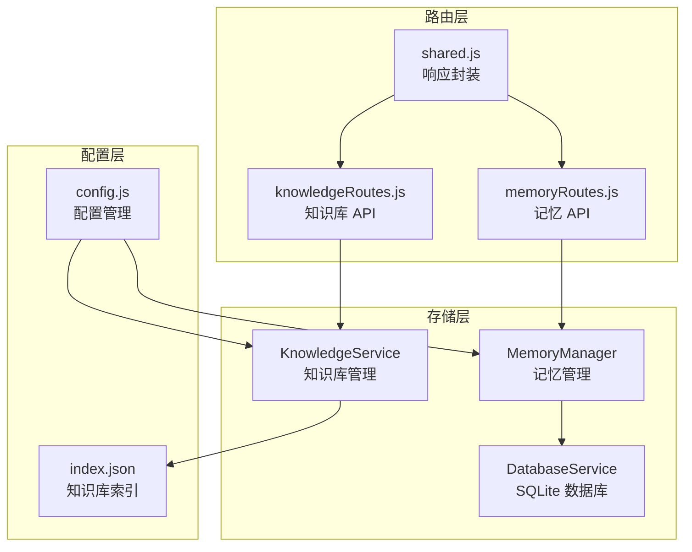
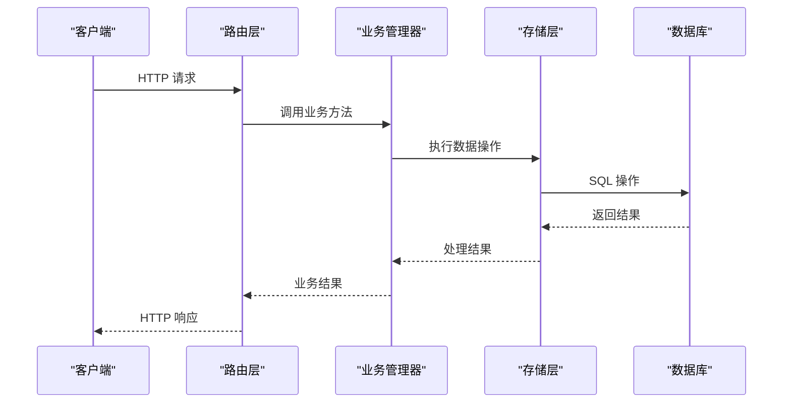
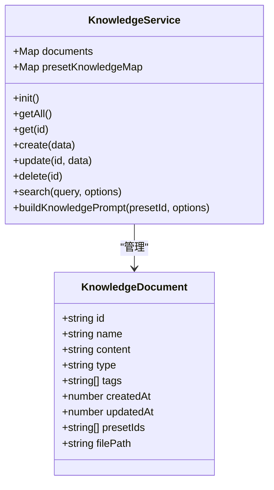
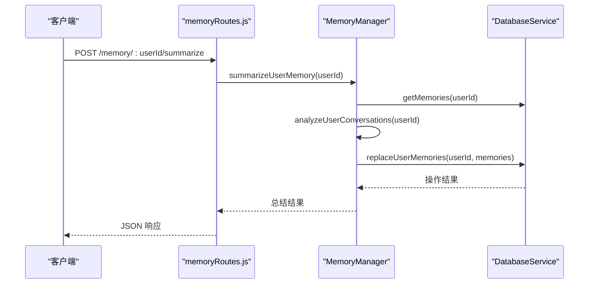
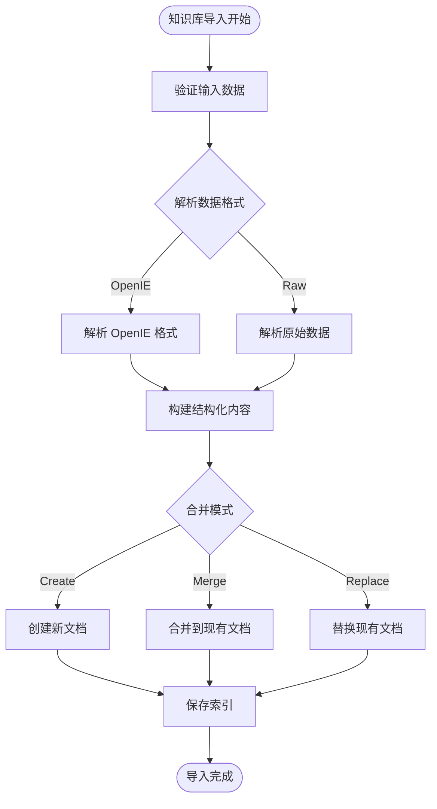
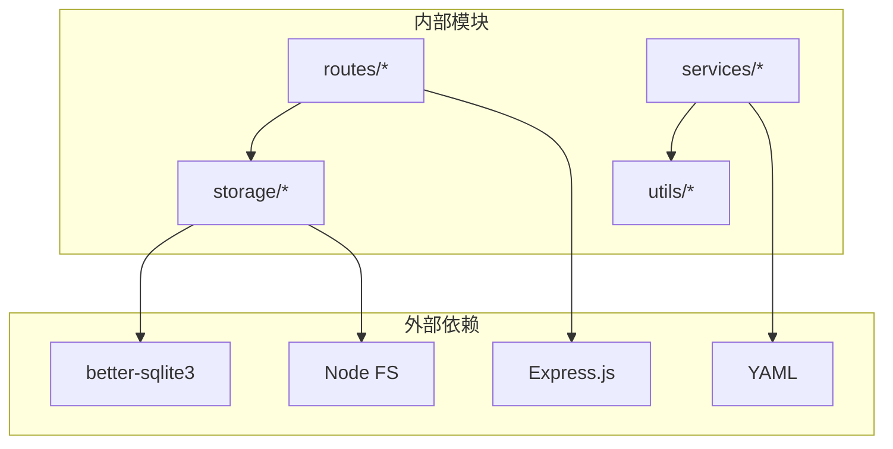

# 数据存储 API

## 目录
1. [简介](#简介)
2. [项目结构](#项目结构)
3. [核心组件](#核心组件)
4. [架构概览](#架构概览)
5. [详细组件分析](#详细组件分析)
6. [依赖关系分析](#依赖关系分析)
7. [性能考虑](#性能考虑)
8. [故障排除指南](#故障排除指南)
9. [结论](#结论)
10. [附录](#附录)

## 简介
本文件档详细说明了数据存储 API 的完整规范，涵盖用户记忆、知识库和配置数据的管理接口。文档基于实际代码实现，提供数据模型、字段定义、约束条件、备份恢复迁移接口、导入导出和批量操作的使用示例，以及数据安全、权限控制和访问审计的接口说明。

## 项目结构
数据存储相关的核心文件位于 `src/services/storage/` 目录，API 路由位于 `src/services/routes/` 目录，配置管理位于 `config/` 目录，知识库存储位于 `data/knowledge/` 目录。

**图表来源**
- [DatabaseService.js](file://src/services/storage/DatabaseService.js#L19-L809)
- [MemoryManager.js](file://src/services/storage/MemoryManager.js#L12-L1538)
- [KnowledgeService.js](file://src/services/storage/KnowledgeService.js#L31-L931)
- [memoryRoutes.js](file://src/services/routes/memoryRoutes.js#L1-L137)
- [knowledgeRoutes.js](file://src/services/routes/knowledgeRoutes.js#L1-L131)
- [shared.js](file://src/services/routes/shared.js#L93-L150)
- [config.js](file://config/config.js#L8-L631)

**章节来源**
- [DatabaseService.js](file://src/services/storage/DatabaseService.js#L1-L809)
- [MemoryManager.js](file://src/services/storage/MemoryManager.js#L1-L1538)
- [KnowledgeService.js](file://src/services/storage/KnowledgeService.js#L1-L931)
- [memoryRoutes.js](file://src/services/routes/memoryRoutes.js#L1-L137)
- [knowledgeRoutes.js](file://src/services/routes/knowledgeRoutes.js#L1-L131)
- [shared.js](file://src/services/routes/shared.js#L1-L150)
- [config.js](file://config/config.js#L1-L631)

## 核心组件
本项目的数据存储由三个核心组件构成：

### 数据库服务 (DatabaseService)
负责底层数据持久化，使用 SQLite 数据库存储对话消息、用户记忆和键值对配置。

### 记忆管理器 (MemoryManager)
提供用户记忆的生命周期管理，包括自动提取、周期性总结、群聊上下文分析等功能。

### 知识库服务 (KnowledgeService)
管理预设关联的知识库文档，支持文件导入导出、搜索和动态构建提示词。

**章节来源**
- [DatabaseService.js](file://src/services/storage/DatabaseService.js#L19-L809)
- [MemoryManager.js](file://src/services/storage/MemoryManager.js#L12-L1538)
- [KnowledgeService.js](file://src/services/storage/KnowledgeService.js#L31-L931)

## 架构概览
系统采用分层架构，路由层处理 HTTP 请求，业务逻辑层调用存储服务，存储层负责数据持久化。

**图表来源**
- [memoryRoutes.js](file://src/services/routes/memoryRoutes.js#L10-L134)
- [knowledgeRoutes.js](file://src/services/routes/knowledgeRoutes.js#L9-L128)
- [DatabaseService.js](file://src/services/storage/DatabaseService.js#L26-L809)

## 详细组件分析

### 数据模型与字段定义

#### 对话消息表 (messages)
| 字段名 | 类型 | 约束 | 描述 |
|--------|------|------|------|
| id | INTEGER | PRIMARY KEY, AUTOINCREMENT | 主键 |
| conversation_id | TEXT | NOT NULL | 会话标识符 |
| role | TEXT | NOT NULL | 消息角色 (user/assistant/system) |
| content | TEXT | NOT NULL | 消息内容 (JSON格式) |
| timestamp | INTEGER | NOT NULL | 时间戳 |
| metadata | TEXT | NULL | 元数据 (JSON格式) |

#### 用户记忆表 (memories)
| 字段名 | 类型 | 约束 | 描述 |
|--------|------|------|------|
| id | INTEGER | PRIMARY KEY, AUTOINCREMENT | 主键 |
| user_id | TEXT | NOT NULL | 用户标识符 |
| content | TEXT | NOT NULL | 记忆内容 |
| source | TEXT | DEFAULT 'manual' | 来源类型 |
| importance | INTEGER | DEFAULT 5 | 重要程度 (1-10) |
| timestamp | INTEGER | NOT NULL | 时间戳 |
| metadata | TEXT | NULL | 元数据 (JSON格式) |

#### 键值存储表 (kv_store)
| 字段名 | 类型 | 约束 | 描述 |
|--------|------|------|------|
| key | TEXT | PRIMARY KEY | 键名 |
| value | TEXT | NOT NULL | 值 (JSON格式) |
| updated_at | INTEGER | NOT NULL | 更新时间 |

**章节来源**
- [DatabaseService.js](file://src/services/storage/DatabaseService.js#L47-L77)

#### 知识库文档模型

**图表来源**
- [KnowledgeService.js](file://src/services/storage/KnowledgeService.js#L18-L36)
- [KnowledgeService.js](file://src/services/storage/KnowledgeService.js#L31-L931)

**章节来源**
- [KnowledgeService.js](file://src/services/storage/KnowledgeService.js#L18-L36)
- [KnowledgeService.js](file://src/services/storage/KnowledgeService.js#L31-L931)

### 记忆管理 API

#### 用户记忆管理
- **GET /memory/users** - 获取所有有记忆的用户列表
- **POST /memory/search** - 搜索用户记忆
- **POST /memory/:userId/summarize** - 手动触发用户记忆总结
- **GET /memory/:userId** - 获取用户所有记忆
- **POST /memory/** - 添加新记忆
- **DELETE /memory/:userId/:memoryId** - 删除特定记忆
- **DELETE /memory/:userId** - 清空用户所有记忆
- **DELETE /memory/clear-all** - 清空所有用户记忆

#### 群聊记忆管理
- **POST /memory/group/:groupId/summarize** - 群记忆总结
- **GET /memory/group/:groupId/context** - 获取群聊上下文
- **GET /memory/group/:groupId/members** - 获取群内用户记忆摘要
- **DELETE /memory/group/:groupId** - 清空群的所有记忆

**图表来源**
- [memoryRoutes.js](file://src/services/routes/memoryRoutes.js#L98-L111)
- [MemoryManager.js](file://src/services/storage/MemoryManager.js#L1045-L1073)

**章节来源**
- [memoryRoutes.js](file://src/services/routes/memoryRoutes.js#L1-L137)
- [MemoryManager.js](file://src/services/storage/MemoryManager.js#L1045-L1113)

### 知识库管理 API

#### 知识库文档管理
- **GET /knowledge/** - 获取所有知识库文档列表
- **GET /knowledge/:id** - 获取单个知识库文档
- **POST /knowledge/** - 创建新知识库文档
- **PUT /knowledge/:id** - 更新知识库文档
- **DELETE /knowledge/:id** - 删除知识库文档

#### 知识库搜索与关联
- **GET /knowledge/search** - 搜索知识库文档
- **POST /knowledge/:id/link/:presetId** - 将知识库关联到预设
- **DELETE /knowledge/:id/link/:presetId** - 取消知识库与预设的关联

#### 知识库导入导出
- **POST /knowledge/import** - 导入知识库数据
- **POST /knowledge/export** - 导出知识库数据

**图表来源**
- [knowledgeRoutes.js](file://src/services/routes/knowledgeRoutes.js#L68-L79)
- [KnowledgeService.js](file://src/services/storage/KnowledgeService.js#L551-L742)

**章节来源**
- [knowledgeRoutes.js](file://src/services/routes/knowledgeRoutes.js#L1-L131)
- [KnowledgeService.js](file://src/services/storage/KnowledgeService.js#L551-L742)

### 配置数据管理 API

#### 配置管理
- **GET /config/** - 获取所有配置
- **GET /config/:key** - 获取特定配置项
- **POST /config/** - 更新配置
- **DELETE /config/:key** - 删除配置项

#### 用户设置管理
- **GET /users/settings** - 获取所有用户设置
- **GET /users/:userId/settings** - 获取用户设置
- **POST /users/:userId/settings** - 更新用户设置
- **DELETE /users/:userId/settings** - 删除用户设置

**章节来源**
- [DatabaseService.js](file://src/services/storage/DatabaseService.js#L685-L729)

## 依赖关系分析

**图表来源**
- [DatabaseService.js](file://src/services/storage/DatabaseService.js#L1-L5)
- [memoryRoutes.js](file://src/services/routes/memoryRoutes.js#L4-L6)
- [KnowledgeService.js](file://src/services/storage/KnowledgeService.js#L7-L11)

### 组件耦合度分析
- **低耦合**: 路由层与业务逻辑层通过接口分离
- **中等耦合**: 业务逻辑层依赖存储服务
- **高内聚**: 存储服务封装了数据库操作细节

**章节来源**
- [shared.js](file://src/services/routes/shared.js#L5-L150)
- [DatabaseService.js](file://src/services/storage/DatabaseService.js#L1-L809)

## 性能考虑
- **数据库索引**: 对常用查询字段建立索引优化查询性能
- **WAL 模式**: 使用 Write-Ahead Logging 提高并发性能
- **内存缓存**: 知识库文档在内存中缓存，减少文件系统访问
- **批量操作**: 支持批量导入导出，提高大数据处理效率
- **查询限制**: 记忆搜索限制查询长度，防止正则表达式复杂度过高

## 故障排除指南

### 常见错误处理
系统使用统一的错误码体系，包括参数验证、资源访问、渠道错误、限流错误等分类。

### 数据库维护
- **定期清理**: 支持清理过期会话和大量数据
- **统计监控**: 提供数据库统计信息
- **备份恢复**: 基于文件系统的备份机制

### 日志记录
- **调试日志**: 详细的调试信息输出
- **错误日志**: 错误堆栈跟踪
- **性能日志**: API 调用耗时统计

**章节来源**
- [shared.js](file://src/services/routes/shared.js#L7-L69)
- [DatabaseService.js](file://src/services/storage/DatabaseService.js#L562-L575)

## 结论
本数据存储 API 提供了完整的用户记忆、知识库和配置数据管理能力，具有良好的扩展性和稳定性。通过分层架构设计和完善的错误处理机制，确保了系统的可靠运行。建议在生产环境中合理配置内存限制和数据库参数，以获得最佳性能表现。

## 附录

### API 错误码对照表
| 错误码 | 类别 | 描述 |
|--------|------|------|
| 0 | 成功 | 操作成功 |
| -1 | 未知错误 | 未知错误 |
| 1000-1999 | 参数验证错误 | 参数验证失败相关错误 |
| 2000-2999 | 资源错误 | 资源不存在、已存在等 |
| 3000-3999 | 渠道错误 | 外部渠道相关错误 |
| 4000-4999 | 限流错误 | 请求频率过高 |
| 5000-5999 | 系统错误 | 系统内部错误 |

### 数据备份与恢复
- **知识库备份**: 知识库文档存储在 `data/knowledge/` 目录，包含 `index.json` 索引文件
- **数据库备份**: SQLite 数据库文件位于 `data/chaite.db`
- **配置备份**: 配置文件位于 `config/config.yaml`

### 安全与权限控制
- **访问控制**: 路由层提供统一的响应封装
- **数据隔离**: 支持用户和群组级别的数据隔离
- **审计日志**: 记录重要的数据操作行为

**章节来源**
- [index.json](file://data/knowledge/index.json#L1-L5)
- [config.js](file://config/config.js#L18-L38)
