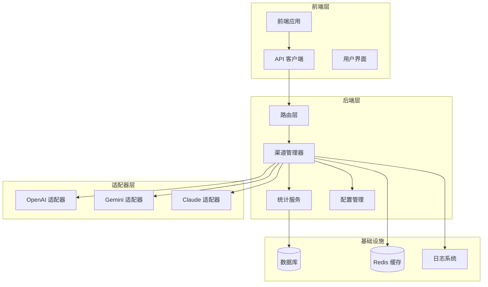
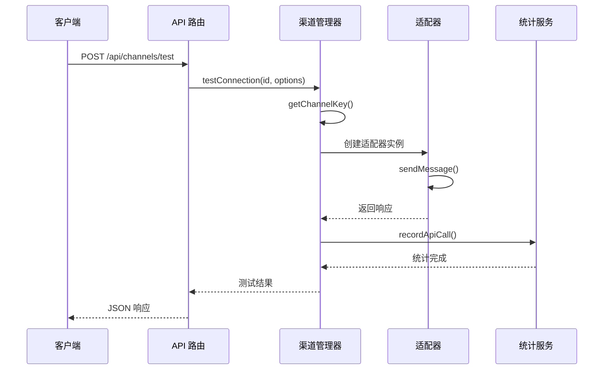
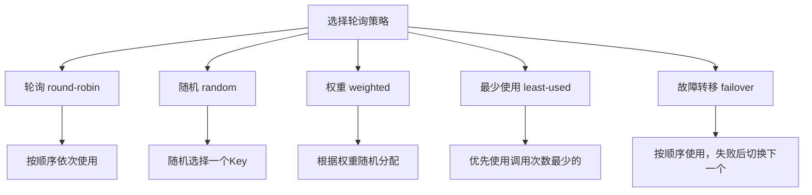
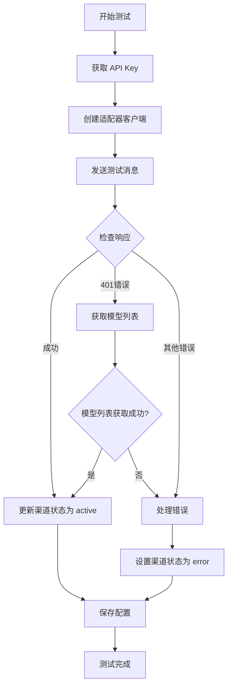
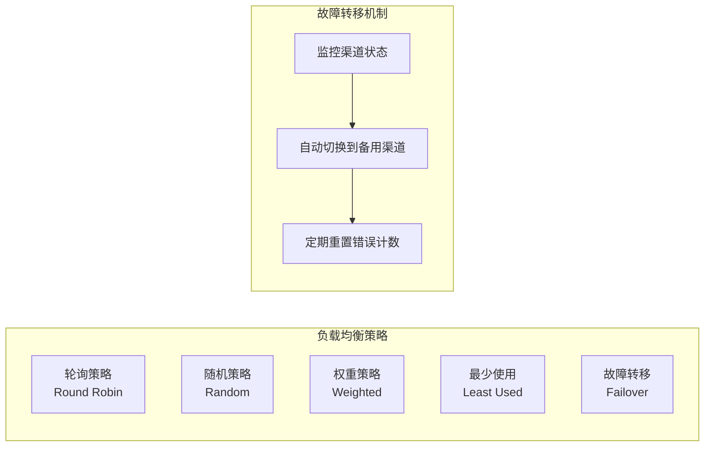
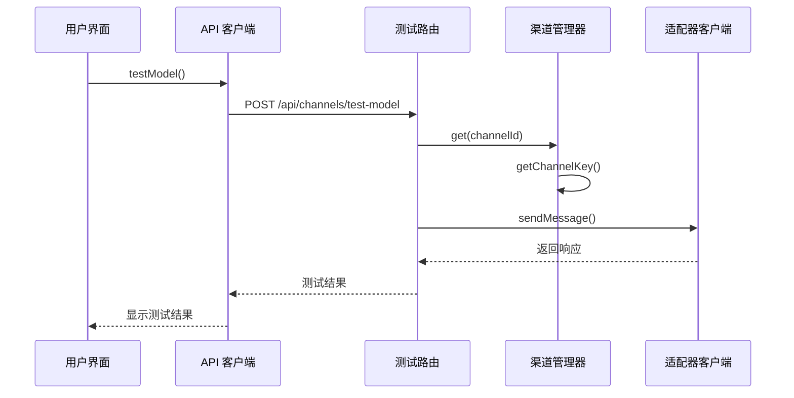
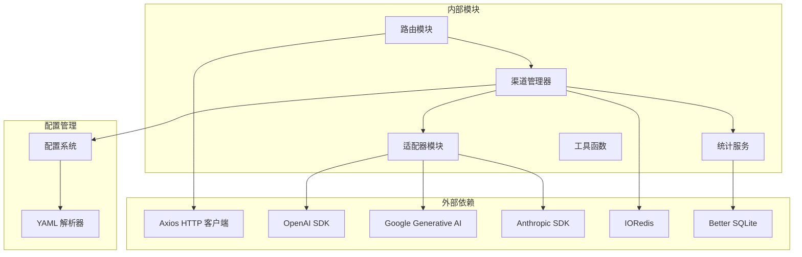
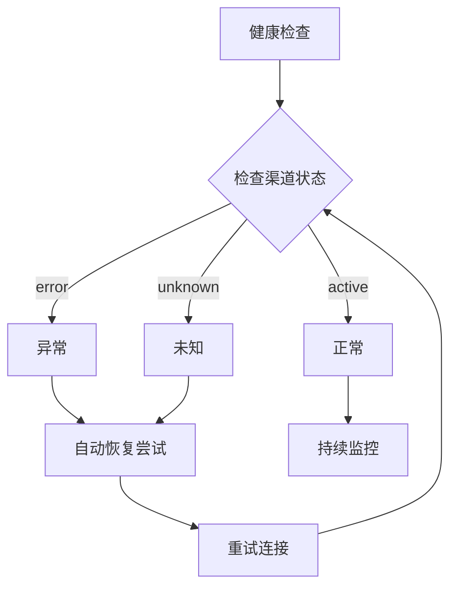

# 渠道管理 API


## 目录
1. [简介](#简介)
2. [项目结构](#项目结构)
3. [核心组件](#核心组件)
4. [架构概览](#架构概览)
5. [详细组件分析](#详细组件分析)
6. [依赖关系分析](#依赖关系分析)
7. [性能考虑](#性能考虑)
8. [故障排除指南](#故障排除指南)
9. [结论](#结论)

## 简介

渠道管理 API 是 ChatAI 插件的核心功能之一，负责管理不同 AI 模型渠道的配置、监控和测试。该系统支持多种 AI 服务提供商（OpenAI、Gemini、Claude 等），提供完整的渠道生命周期管理，包括创建、更新、删除、查询以及连接状态检查和性能监控。

## 项目结构



**图表来源**
- [index.js](file://index.js#L1-L258)
- [channelRoutes.js](file://src/services/routes/channelRoutes.js#L1-L535)
- [ChannelManager.js](file://src/services/llm/ChannelManager.js#L1-L800)

**章节来源**
- [index.js](file://index.js#L1-L258)
- [README.md](file://README.md#L356-L396)

## 核心组件

### 渠道管理器 (ChannelManager)

ChannelManager 是渠道管理的核心组件，负责：

- **渠道配置管理**：创建、更新、删除和查询渠道配置
- **连接状态监控**：实时监控渠道连接状态和健康状况
- **负载均衡**：支持多种轮询策略（轮询、随机、权重、最少使用）
- **故障转移**：自动故障转移和错误恢复机制
- **性能监控**：详细的 API 调用统计和性能指标

### 渠道路由 (channelRoutes)

提供 RESTful API 接口：

- **GET /api/channels/list** - 获取所有渠道列表
- **POST /api/channels** - 创建新渠道
- **PUT /api/channels/:id** - 更新现有渠道
- **DELETE /api/channels/:id** - 删除渠道
- **POST /api/channels/test** - 测试渠道连接
- **POST /api/channels/batch-test** - 批量测试模型

### 配置管理系统

基于 YAML 的配置管理，支持：

- **多渠道配置**：支持配置多个 API 渠道实现负载均衡
- **动态配置**：运行时配置热更新
- **默认配置**：完整的默认配置模板

**章节来源**
- [ChannelManager.js](file://src/services/llm/ChannelManager.js#L77-L865)
- [channelRoutes.js](file://src/services/routes/channelRoutes.js#L19-L80)
- [config.js](file://config/config.js#L62-L586)

## 架构概览



**图表来源**
- [channelRoutes.js](file://src/services/routes/channelRoutes.js#L97-L288)
- [ChannelManager.js](file://src/services/llm/ChannelManager.js#L659-L754)

## 详细组件分析

### 渠道配置参数

#### 基础配置参数

| 参数名 | 类型 | 必填 | 描述 | 默认值 |
|--------|------|------|------|--------|
| id | string | 是 | 渠道唯一标识符 | 自动生成 |
| name | string | 是 | 渠道显示名称 | - |
| adapterType | string | 是 | 适配器类型 | 'openai' |
| baseUrl | string | 是 | API 基础 URL | - |
| apiKey | string | 否 | API 密钥 | - |
| apiKeys | array | 否 | 多 API 密钥支持 | [] |
| strategy | string | 否 | 轮询策略 | 'round-robin' |
| models | array | 否 | 支持的模型列表 | [] |
| priority | number | 否 | 渠道优先级 | 100 |
| enabled | boolean | 否 | 是否启用 | true |

#### 高级配置参数

| 参数名 | 类型 | 描述 | 示例 |
|--------|------|------|------|
| customHeaders | object | 自定义请求头 | {'Authorization': 'Bearer token'} |
| headersTemplate | string | 请求头模板 | '{"Authorization": "{{apiKey}}"}' |
| requestBodyTemplate | string | 请求体模板 | '{"model": "{{model}}"}' |
| timeout | object | 超时配置 | {connect: 10000, read: 60000} |
| retry | object | 重试配置 | {maxAttempts: 3, delay: 1000} |
| quota | object | 配额限制 | {daily: 1000, hourly: 100} |
| weight | number | 权重值 | 100 |
| endpoints | object | 自定义端点 | {chat: '/chat', models: '/models'} |

#### 轮询策略



**图表来源**
- [ChannelManager.js](file://src/services/llm/ChannelManager.js#L498-L584)

### API 接口规范

#### 渠道管理接口

**获取所有渠道**
```
GET /api/channels/list?withStats=true
```

**创建渠道**
```
POST /api/channels
Content-Type: application/json

{
  "name": "OpenAI 主渠道",
  "adapterType": "openai",
  "baseUrl": "https://api.openai.com/v1",
  "apiKey": "sk-xxxxxxxx",
  "models": ["gpt-4o", "gpt-4o-mini"],
  "priority": 1,
  "enabled": true
}
```

**更新渠道**
```
PUT /api/channels/{id}
Content-Type: application/json

{
  "name": "更新后的名称",
  "priority": 2
}
```

**删除渠道**
```
DELETE /api/channels/{id}
```

**测试渠道连接**
```
POST /api/channels/test
Content-Type: application/json

{
  "id": "openai-main",
  "model": "gpt-4o",
  "skipModelCheck": false
}
```

**批量模型测试**
```
POST /api/channels/batch-test
Content-Type: application/json

{
  "channelId": "openai-main",
  "models": ["gpt-4o", "gpt-4o-mini", "gpt-3.5-turbo"],
  "concurrency": 3
}
```

#### 响应格式

**成功响应**
```json
{
  "code": 0,
  "data": {},
  "message": "ok"
}
```

**错误响应**
```json
{
  "code": -1,
  "data": null,
  "message": "错误信息"
}
```

### 连接状态检查机制

#### 健康检查流程



**图表来源**
- [ChannelManager.js](file://src/services/llm/ChannelManager.js#L659-L800)

#### 性能监控接口

**获取渠道统计**
```
GET /api/channels/stats?id={channelId}
```

**获取 API 调用统计**
```
GET /api/stats/channels
```

**统计指标**
- 请求成功率
- 平均响应时间
- 错误率
- 每分钟请求数 (RPM)
- Token 使用量

### 负载均衡和故障转移

#### 负载均衡策略



**图表来源**
- [ChannelManager.js](file://src/services/llm/ChannelManager.js#L592-L623)

#### 配置示例

```yaml
# 多渠道配置实现负载均衡
channels:
  - id: openai-primary
    name: OpenAI 主渠道
    adapterType: openai
    baseUrl: https://api.openai.com/v1
    apiKey: sk-xxx
    priority: 1
    enabled: true
    weight: 60
    
  - id: openai-secondary
    name: OpenAI 备用渠道
    adapterType: openai
    baseUrl: https://api.openai.com/v1
    apiKey: sk-yyy
    priority: 2
    enabled: true
    weight: 40
    
  - id: gemini-primary
    name: Gemini 主渠道
    adapterType: gemini
    baseUrl: https://generativelanguage.googleapis.com
    apiKey: AIza-xxx
    priority: 3
    enabled: true
    weight: 100
```

### 渠道测试和调试

#### 单模型测试



**图表来源**
- [channelRoutes.js](file://src/services/routes/channelRoutes.js#L460-L532)
- [BatchTestPanel.tsx](file://frontend/components/channels/BatchTestPanel.tsx#L182-L330)

#### 批量测试功能

前端提供了完整的批量测试界面：

- **模型筛选**：支持搜索和过滤模型
- **并发控制**：可配置测试并发数
- **实时进度**：显示测试进度和统计信息
- **结果可视化**：清晰的状态指示和错误信息

**章节来源**
- [channelRoutes.js](file://src/services/routes/channelRoutes.js#L97-L532)
- [ChannelManager.js](file://src/services/llm/ChannelManager.js#L659-L800)
- [page.tsx](file://frontend/app/(dashboard)/channels/page.tsx#L642-L664)
- [BatchTestPanel.tsx](file://frontend/components/channels/BatchTestPanel.tsx#L1-L795)

## 依赖关系分析



**图表来源**
- [package.json](file://package.json#L16-L46)
- [index.js](file://index.js#L1-L258)

**章节来源**
- [package.json](file://package.json#L1-L53)
- [index.js](file://index.js#L1-L258)

## 性能考虑

### 缓存策略

- **模型列表缓存**：使用 Redis 缓存模型列表，有效期 1 小时
- **渠道状态缓存**：缓存渠道连接状态和健康检查结果
- **配置缓存**：内存中缓存配置以减少磁盘 I/O

### 连接池管理

- **适配器连接池**：复用适配器连接减少建立连接的开销
- **超时配置**：合理的连接超时和读取超时设置
- **重试机制**：智能重试避免瞬时网络故障影响

### 监控和告警

- **实时 RPM 统计**：监控请求速率和成功率
- **错误率监控**：实时监控 API 错误率
- **性能指标**：记录响应时间和资源使用情况

## 故障排除指南

### 常见问题诊断

#### API Key 相关问题

**401 Unauthorized 错误**
- 检查 API Key 是否正确配置
- 验证 API Key 是否有相应模型的访问权限
- 确认 API Key 未过期

**403 Forbidden 错误**
- 检查 API Key 权限设置
- 确认账户余额充足
- 验证模型名称是否正确

#### 网络连接问题

**连接超时**
- 检查网络连接稳定性
- 验证 API 基础 URL 配置
- 考虑增加超时时间

**DNS 解析失败**
- 检查域名解析配置
- 验证代理设置
- 考虑使用 IP 直连

#### 配置问题

**渠道无法启用**
- 检查渠道配置语法
- 验证必需参数是否完整
- 确认文件权限正确

**模型列表获取失败**
- 检查自定义模型路径配置
- 验证认证头设置
- 确认 API 服务可用性

### 调试工具

#### 日志分析

系统提供详细的日志记录：

- **调试模式**：启用详细调试信息
- **错误追踪**：完整的错误堆栈信息
- **性能日志**：请求响应时间和资源使用

#### 健康检查



**图表来源**
- [ChannelManager.js](file://src/services/llm/ChannelManager.js#L659-L754)

**章节来源**
- [README.md](file://README.md#L665-L746)
- [ChannelManager.js](file://src/services/llm/ChannelManager.js#L659-L800)

## 结论

渠道管理 API 提供了完整的 AI 渠道生命周期管理解决方案，具有以下优势：

### 核心特性
- **多适配器支持**：统一管理 OpenAI、Gemini、Claude 等多种 AI 服务
- **智能负载均衡**：支持多种轮询策略和故障转移机制
- **全面监控**：实时性能监控和健康检查
- **灵活配置**：动态配置管理和热更新支持

### 最佳实践建议
1. **配置冗余**：至少配置两个备用渠道确保高可用性
2. **监控告警**：设置合理的监控阈值和告警机制
3. **定期测试**：定期进行渠道连接测试和性能评估
4. **安全配置**：合理设置 API Key 权限和访问控制
5. **性能优化**：根据使用情况调整轮询策略和超时设置

该系统为企业级应用提供了可靠的 AI 渠道管理基础设施，支持高并发场景下的稳定运行和灵活扩展。
