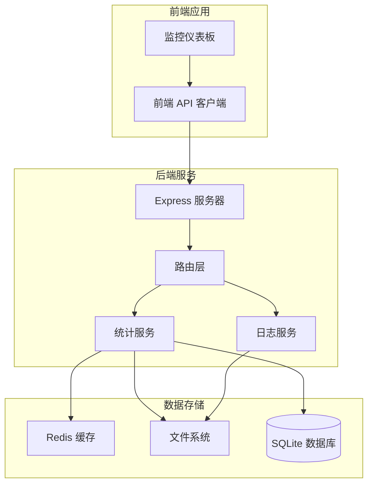
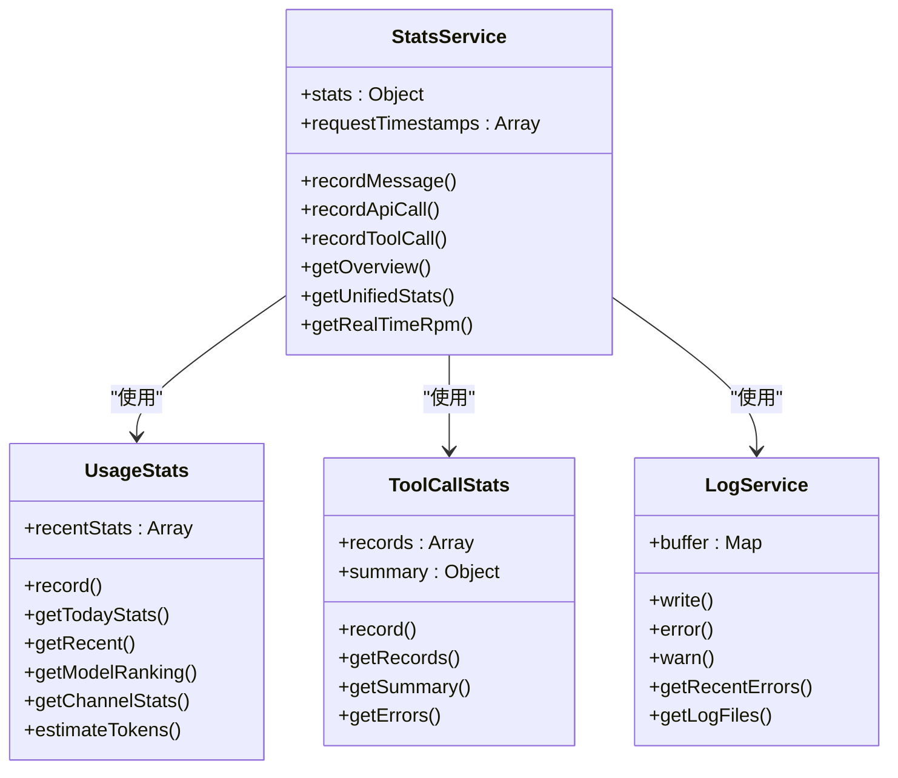
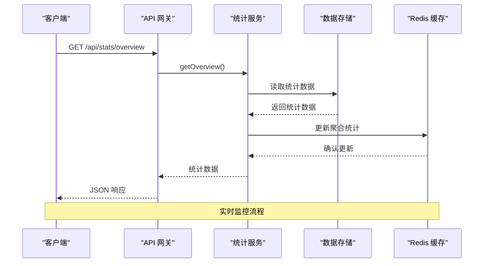
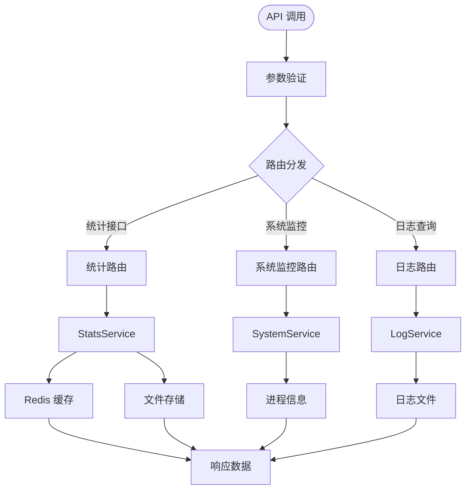
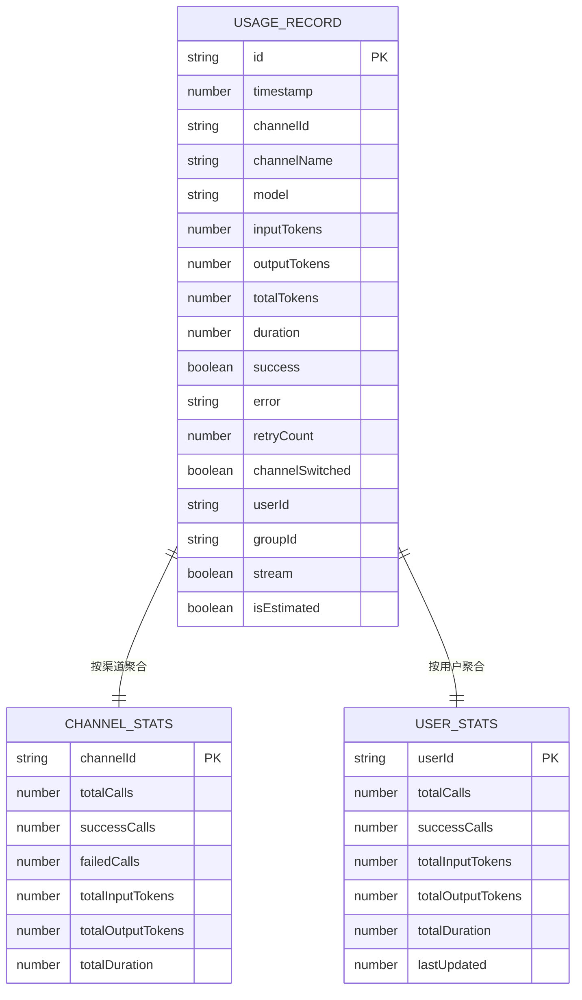
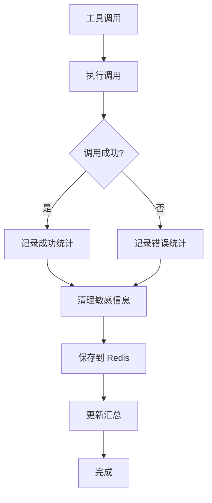
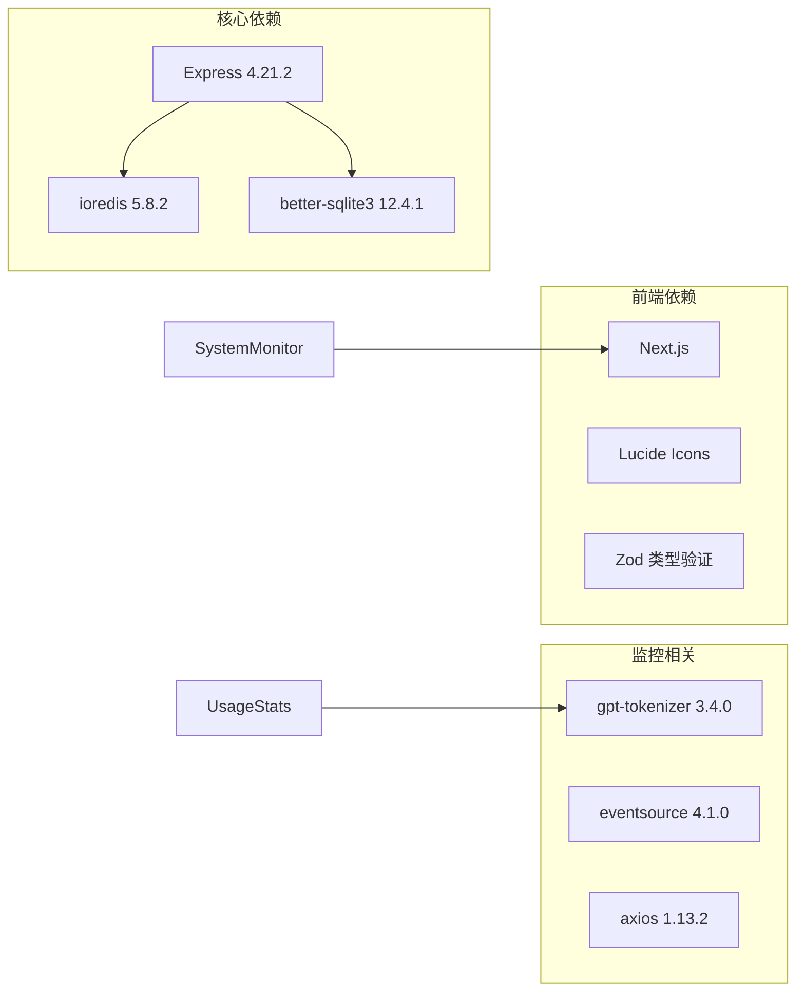
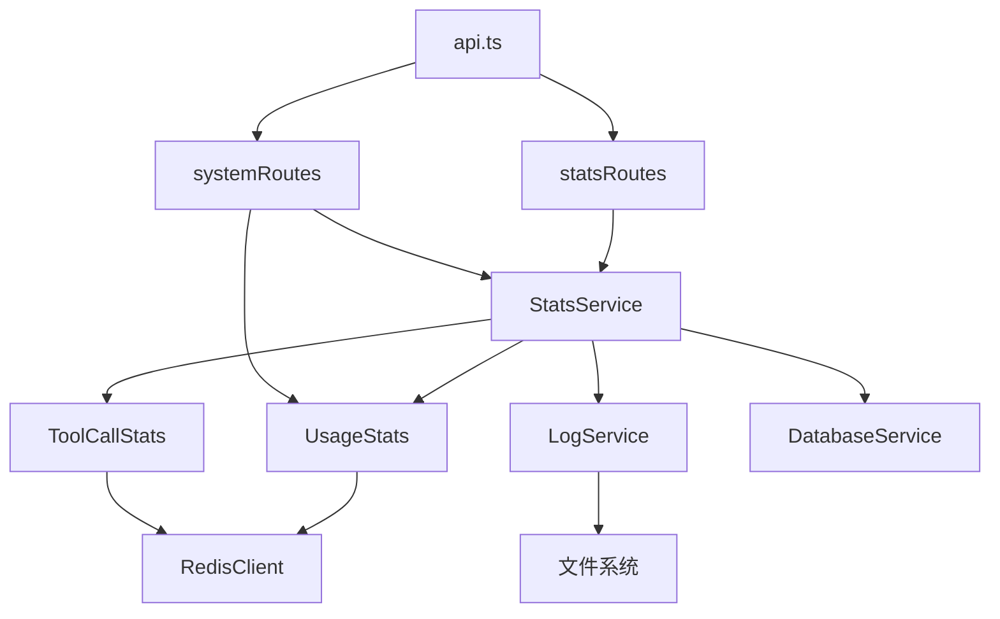
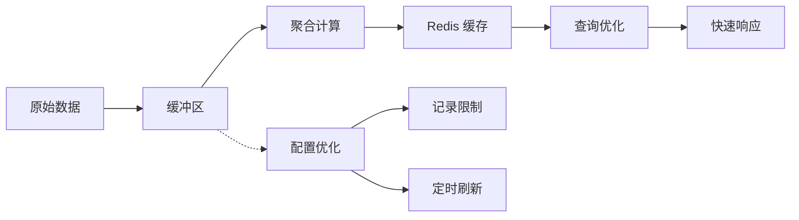

# 监控统计 API

<cite>
**本文档引用的文件**
- [StatsService.js](file://src/services/stats/StatsService.js)
- [UsageStats.js](file://src/services/stats/UsageStats.js)
- [ToolCallStats.js](file://src/services/stats/ToolCallStats.js)
- [LogService.js](file://src/services/stats/LogService.js)
- [statsRoutes.js](file://src/services/routes/statsRoutes.js)
- [systemRoutes.js](file://src/services/routes/systemRoutes.js)
- [api.ts](file://frontend/lib/api.ts)
- [SystemMonitor.tsx](file://frontend/components/dashboard/SystemMonitor.tsx)
- [index.js](file://index.js)
- [package.json](file://package.json)
</cite>

## 目录
1. [简介](#简介)
2. [项目结构](#项目结构)
3. [核心组件](#核心组件)
4. [架构概览](#架构概览)
5. [详细组件分析](#详细组件分析)
6. [依赖关系分析](#依赖关系分析)
7. [性能考虑](#性能考虑)
8. [故障排除指南](#故障排除指南)
9. [结论](#结论)

## 简介

监控统计 API 是 ChatAI 插件的核心功能模块，提供全面的系统性能监控、使用统计和日志查询能力。该系统集成了实时监控、历史数据分析、错误日志管理和告警通知等功能，为插件的稳定运行和性能优化提供强有力的支持。

系统采用分层架构设计，包括统计服务层、数据存储层和 API 接口层，支持多种统计维度和聚合方式，能够满足从基础使用统计到复杂性能分析的各种需求。

## 项目结构



**图表来源**
- [index.js](file://index.js#L1-L258)
- [statsRoutes.js](file://src/services/routes/statsRoutes.js#L1-L98)
- [systemRoutes.js](file://src/services/routes/systemRoutes.js#L378-L577)

**章节来源**
- [index.js](file://index.js#L1-L258)
- [package.json](file://package.json#L1-L53)

## 核心组件

### 统计服务核心架构

系统采用多层统计架构，每个组件负责不同的统计维度：



**图表来源**
- [StatsService.js](file://src/services/stats/StatsService.js#L19-L682)
- [UsageStats.js](file://src/services/stats/UsageStats.js#L44-L592)
- [ToolCallStats.js](file://src/services/stats/ToolCallStats.js#L32-L379)
- [LogService.js](file://src/services/stats/LogService.js#L12-L553)

### 数据存储策略

系统采用混合存储策略，结合内存缓存、Redis 缓存和文件系统存储：

| 存储类型 | 数据类型 | 存储位置 | 生命周期 | 用途 |
|---------|---------|---------|---------|------|
| 内存缓存 | 实时统计 | 进程内存 | 进程运行时 | RPM、最近记录 |
| Redis 缓存 | 详细统计 | Redis 服务器 | 可配置过期 | API 调用、工具调用 |
| 文件系统 | 历史统计 | data/stats.json | 持久化 | 长期历史数据 |
| 日志文件 | 错误日志 | logs/error-YYYY-MM-DD.log | 30天轮转 | 错误追踪 |

**章节来源**
- [StatsService.js](file://src/services/stats/StatsService.js#L19-L104)
- [UsageStats.js](file://src/services/stats/UsageStats.js#L11-L13)
- [LogService.js](file://src/services/stats/LogService.js#L13-L22)

## 架构概览

### API 接口架构



**图表来源**
- [statsRoutes.js](file://src/services/routes/statsRoutes.js#L18-L26)
- [StatsService.js](file://src/services/stats/StatsService.js#L431-L489)

### 监控数据流



**图表来源**
- [statsRoutes.js](file://src/services/routes/statsRoutes.js#L1-L98)
- [systemRoutes.js](file://src/services/routes/systemRoutes.js#L378-L452)

## 详细组件分析

### 统计服务 (StatsService)

StatsService 是整个监控系统的核心，负责协调各个统计模块的工作：

#### 核心功能特性

1. **实时 RPM 统计**
   - 滑动窗口算法（1分钟和5分钟）
   - 内存中维护请求时间戳
   - 自动清理过期数据

2. **多维度统计聚合**
   - 消息统计：按类型、群组、用户、小时分布
   - 模型使用统计：按模型、渠道聚合
   - Token 统计：输入输出 Token 分析
   - 工具调用统计：成功率、耗时分析

3. **数据持久化策略**
   - 内存中实时统计
   - 文件系统持久化（stats.json）
   - Redis 缓存加速查询

#### API 接口规范

| 接口 | 方法 | 参数 | 返回值 | 描述 |
|------|------|------|--------|------|
| `/api/stats/overview` | GET | 无 | 统计概览 | 获取系统总体统计信息 |
| `/api/stats/api-calls` | GET | page, limit, channelId, success, startTime, endTime | API 调用记录 | 分页查询 API 调用详情 |
| `/api/stats/channels` | GET | 无 | 渠道统计 | 获取各渠道使用情况 |
| `/api/stats/models` | GET | 无 | 模型统计 | 获取模型使用排行 |
| `/api/stats/usage` | GET | days | 使用统计 | 获取历史使用统计 |
| `/api/stats/usage/channel/:id` | GET | 渠道ID | 渠道统计 | 获取指定渠道统计 |
| `/api/stats/clear` | DELETE | 无 | 操作结果 | 清除统计数据 |

**章节来源**
- [StatsService.js](file://src/services/stats/StatsService.js#L19-L682)
- [statsRoutes.js](file://src/services/routes/statsRoutes.js#L18-L95)

### 使用统计 (UsageStats)

UsageStats 专门负责 API 调用的详细统计，提供精确的使用分析：

#### 数据结构设计



**图表来源**
- [UsageStats.js](file://src/services/stats/UsageStats.js#L16-L42)
- [UsageStats.js](file://src/services/stats/UsageStats.js#L11-L13)

#### Token 估算算法

系统实现了智能的 Token 估算机制：

1. **精确计算**：优先使用官方 tokenizer
2. **回退机制**：中文字符、英文单词、其他字符分别估算
3. **消息数组处理**：递归处理复杂的消息结构

**章节来源**
- [UsageStats.js](file://src/services/stats/UsageStats.js#L62-L192)

### 工具调用统计 (ToolCallStats)

ToolCallStats 专注于工具调用的详细监控：

#### 统计维度

| 维度 | 统计项 | 说明 |
|------|--------|------|
| 基础统计 | 总调用次数、成功次数、失败次数 | 整体使用情况 |
| 成功率分析 | 各工具成功率、平均耗时 | 性能评估 |
| 时间分布 | 按小时分布、最近错误 | 使用模式分析 |
| 用户行为 | 按用户、群组统计 | 个性化分析 |

#### 错误处理机制



**图表来源**
- [ToolCallStats.js](file://src/services/stats/ToolCallStats.js#L86-L143)

**章节来源**
- [ToolCallStats.js](file://src/services/stats/ToolCallStats.js#L32-L379)

### 日志服务 (LogService)

LogService 提供完整的日志管理功能：

#### 日志类型分类

| 日志类型 | 文件名 | 用途 | 保留策略 |
|----------|--------|------|----------|
| 错误日志 | error-YYYY-MM-DD.log | 错误追踪 | 30天轮转 |
| 警告日志 | warn-YYYY-MM-DD.log | 警告信息 | 30天轮转 |
| 工具日志 | tool-YYYY-MM-DD.log | 工具调用 | 30天轮转 |
| 渠道日志 | channel-YYYY-MM-DD.log | 渠道操作 | 30天轮转 |
| 调度日志 | dispatch-YYYY-MM-DD.log | 调度过程 | 30天轮转 |

#### 日志安全机制

1. **敏感信息过滤**：自动识别并隐藏 API Key、密码等
2. **数据截断**：超长日志自动截断，防止内存溢出
3. **缓冲写入**：5秒批量写入，提高性能

**章节来源**
- [LogService.js](file://src/services/stats/LogService.js#L12-L553)

### 系统监控 (SystemMonitor)

系统监控提供实时的系统健康状态：

#### 监控指标

| 指标类别 | 具体指标 | 计算方式 | 阈值建议 |
|----------|----------|----------|----------|
| 内存使用 | heapUsed, rss, external | process.memoryUsage() | < 80% |
| 系统负载 | systemUsedPercent | (total-free)/total | < 85% |
| API 性能 | rpm, rpm5, avgLatency | 滑动窗口统计 | rpm > 0 |
| 成功率 | successRate | 成功请求/总请求 | > 95% |
| Token 用量 | tokensLastMinute, tokensPerMinute | 60秒/300秒窗口 | 根据业务调整 |

**章节来源**
- [systemRoutes.js](file://src/services/routes/systemRoutes.js#L378-L452)
- [SystemMonitor.tsx](file://frontend/components/dashboard/SystemMonitor.tsx#L11-L38)

## 依赖关系分析

### 外部依赖



**图表来源**
- [package.json](file://package.json#L16-L45)

### 内部模块依赖



**图表来源**
- [StatsService.js](file://src/services/stats/StatsService.js#L5-L12)
- [statsRoutes.js](file://src/services/routes/statsRoutes.js#L1-L6)

**章节来源**
- [package.json](file://package.json#L16-L45)

## 性能考虑

### 查询优化策略

1. **Redis 缓存优化**
   - 使用哈希表存储聚合统计
   - 设置合理的过期时间
   - 内存限制（10000条记录）

2. **分页查询**
   - API 调用记录默认 20 条/页
   - 工具调用记录默认 100 条/页
   - 支持时间范围过滤

3. **内存管理**
   - 滑动窗口限制请求时间戳数量
   - 内存中记录数量限制
   - 定期清理过期数据

### 存储策略优化

| 组件 | 优化措施 | 性能收益 |
|------|----------|----------|
| StatsService | 文件持久化 + Redis 缓存 | 减少磁盘 I/O |
| UsageStats | 哈希聚合 + 列表存储 | 快速聚合统计 |
| ToolCallStats | 固定长度列表 + 汇总缓存 | 控制内存使用 |
| LogService | 批量写入 + 文件轮转 | 提高写入性能 |

### 监控指标优化



**章节来源**
- [StatsService.js](file://src/services/stats/StatsService.js#L32-L52)
- [UsageStats.js](file://src/services/stats/UsageStats.js#L13-L13)

## 故障排除指南

### 常见问题诊断

#### Redis 连接问题

**症状**：统计数据显示异常或查询超时
**诊断步骤**：
1. 检查 Redis 服务状态
2. 验证连接配置
3. 查看 Redis 键空间使用情况

**解决方法**：
```javascript
// 检查 Redis 连接
redisClient.ping((err, result) => {
  if (err) {
    console.error('Redis 连接失败:', err.message);
  }
});

// 清理过期键
redisClient.keys('chaite:*', (err, keys) => {
  keys.forEach(key => redisClient.expire(key, 86400));
});
```

#### 内存使用过高

**症状**：系统内存持续增长
**诊断步骤**：
1. 检查滑动窗口大小
2. 监控内存使用趋势
3. 分析统计数据增长速度

**解决方法**：
```javascript
// 调整内存限制
const statsService = new StatsService();
statsService.requestTimestamps = statsService.requestTimestamps.slice(-5000);
```

#### 日志文件过大

**症状**：磁盘空间不足
**诊断步骤**：
1. 检查日志文件数量
2. 分析日志类型分布
3. 监控磁盘使用情况

**解决方法**：
```javascript
// 清理过期日志
logService.cleanOldLogs(); // 自动清理30天前的日志
```

### API 错误处理

| 错误代码 | 错误类型 | 可能原因 | 解决方案 |
|----------|----------|----------|----------|
| 400 | 参数错误 | 查询参数格式不正确 | 检查 API 参数格式 |
| 401 | 未授权 | 缺少或无效的认证令牌 | 重新登录获取令牌 |
| 429 | 请求过多 | 超过 API 速率限制 | 降低请求频率或增加配额 |
| 500 | 服务器错误 | 内部服务异常 | 检查服务日志和依赖状态 |
| 503 | 服务不可用 | Redis 连接失败 | 检查 Redis 服务状态 |

**章节来源**
- [statsRoutes.js](file://src/services/routes/statsRoutes.js#L23-L25)
- [LogService.js](file://src/services/stats/LogService.js#L264-L284)

## 结论

监控统计 API 提供了全面的系统监控解决方案，具有以下优势：

### 核心价值

1. **多维度监控**：涵盖性能、使用、错误等多个维度
2. **实时性**：支持实时 RPM 统计和系统监控
3. **可扩展性**：模块化设计便于功能扩展
4. **可靠性**：多重数据存储保证数据安全

### 技术亮点

1. **智能缓存策略**：结合内存、Redis 和文件系统的混合存储
2. **高效查询优化**：滑动窗口和哈希聚合提升查询性能
3. **安全日志管理**：自动敏感信息过滤和日志轮转
4. **可视化监控**：前端仪表板提供直观的监控界面

### 应用场景

- **运维监控**：实时掌握系统运行状态
- **性能分析**：识别性能瓶颈和优化机会
- **成本控制**：监控 Token 使用和 API 调用成本
- **故障排查**：快速定位和解决系统问题

该监控统计 API 为 ChatAI 插件提供了坚实的数据基础，支持从日常运维到深度分析的各种需求，是系统稳定运行的重要保障。