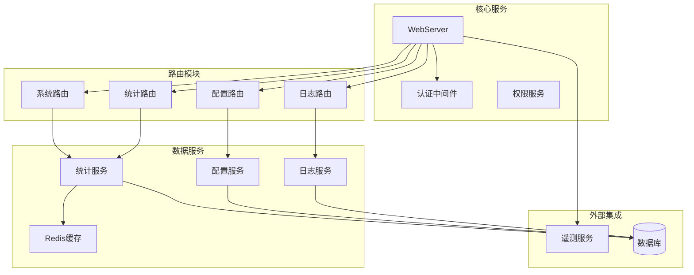
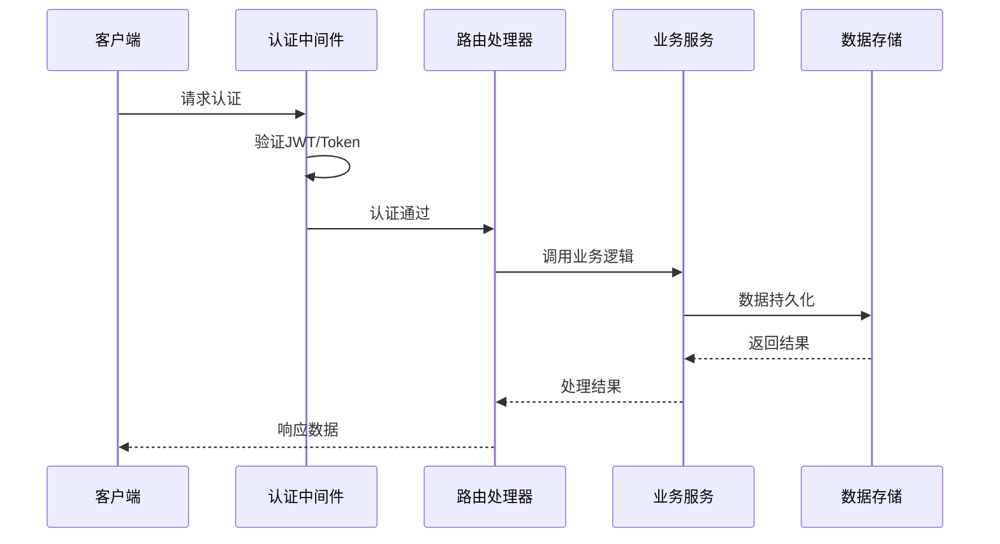
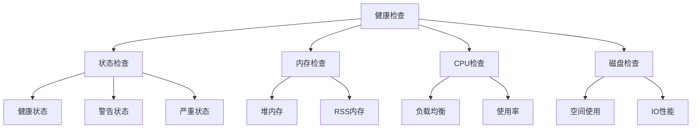
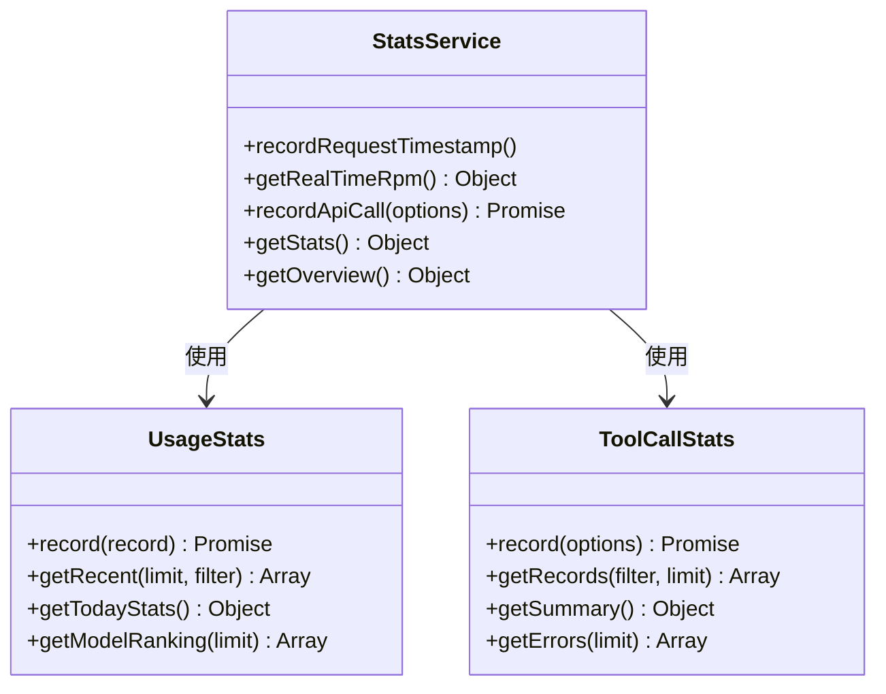
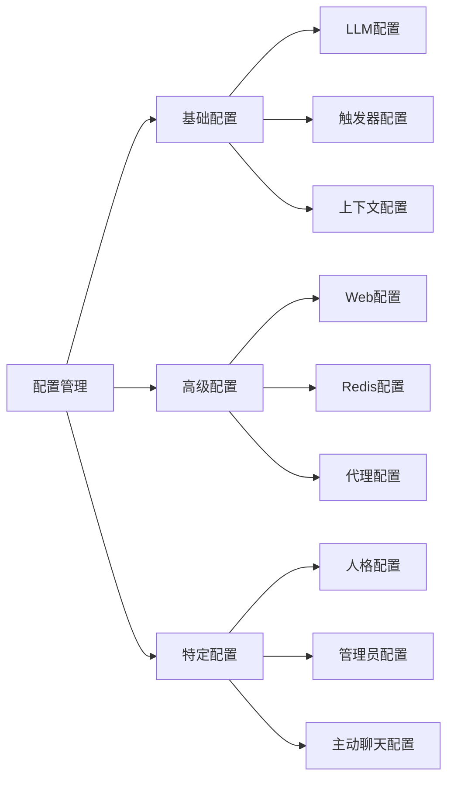
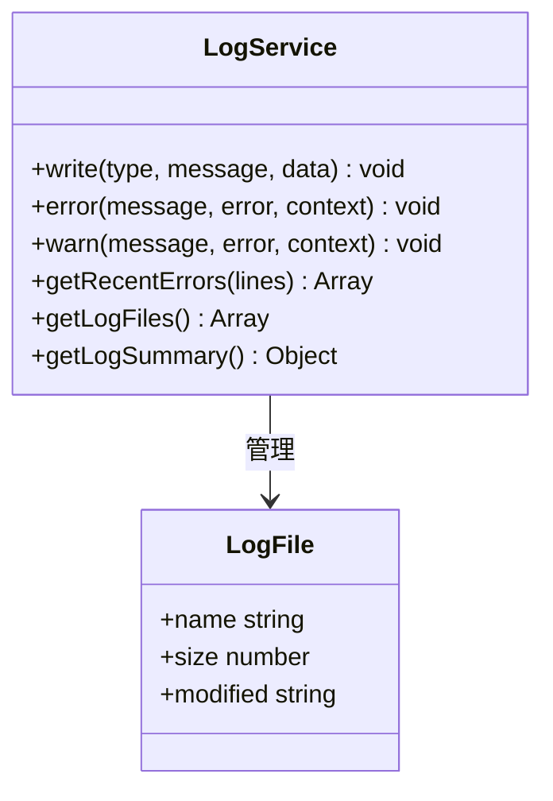
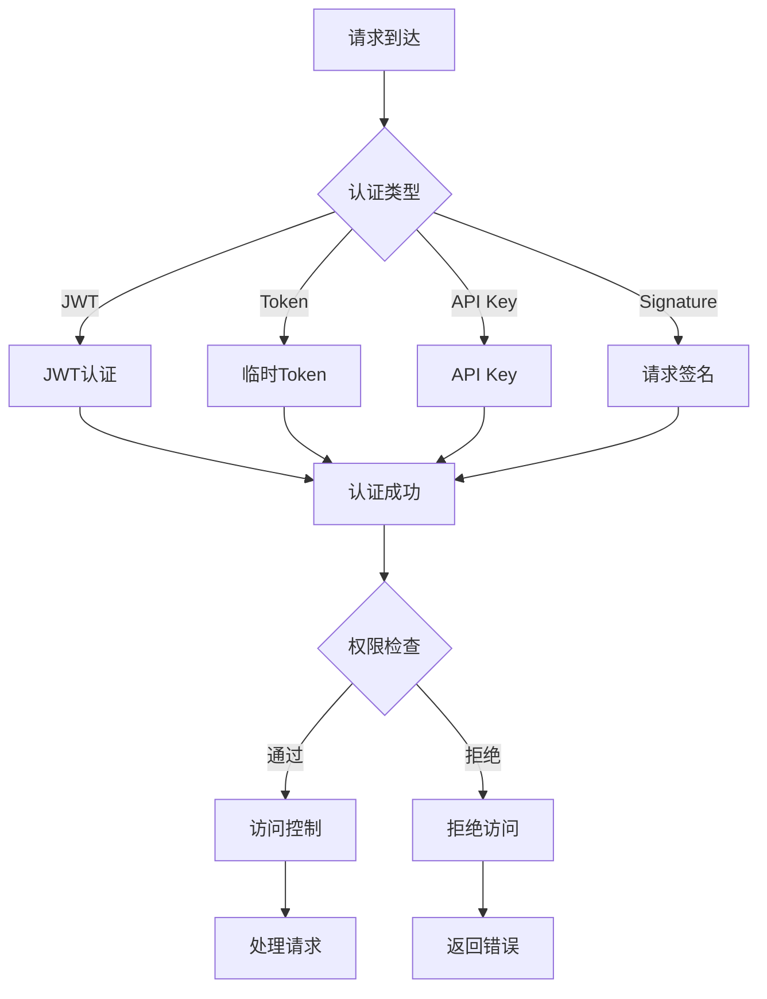
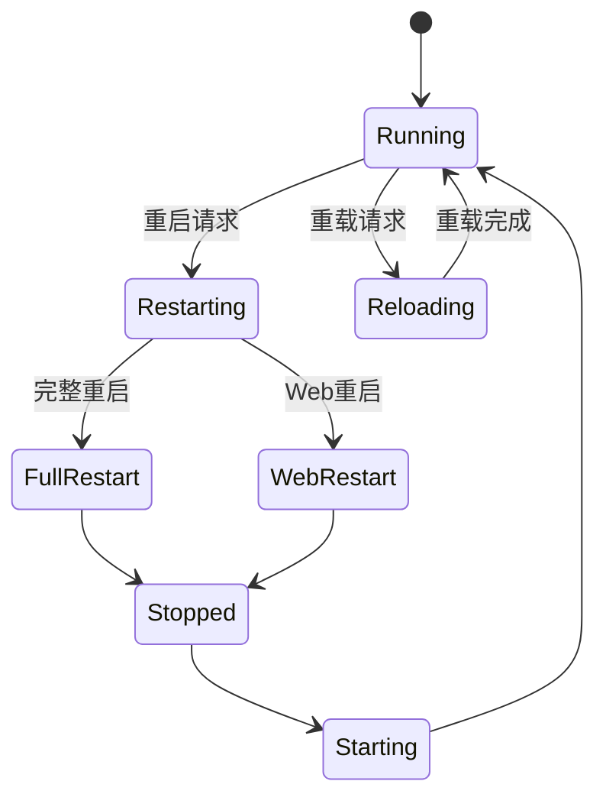
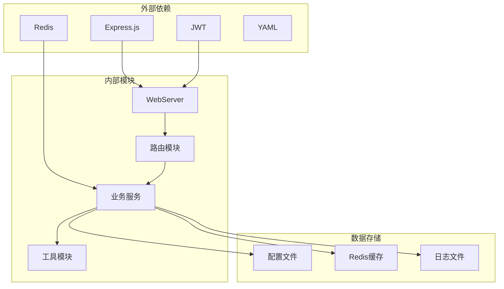

# 系统管理 API

<cite>
**本文档引用的文件**
- [index.js](file://index.js)
- [webServer.js](file://src/services/webServer.js)
- [systemRoutes.js](file://src/services/routes/systemRoutes.js)
- [configRoutes.js](file://src/services/routes/configRoutes.js)
- [logsRoutes.js](file://src/services/routes/logsRoutes.js)
- [StatsService.js](file://src/services/stats/StatsService.js)
- [UsageStats.js](file://src/services/stats/UsageStats.js)
- [ToolCallStats.js](file://src/services/stats/ToolCallStats.js)
- [LogService.js](file://src/services/stats/LogService.js)
- [config.js](file://config/config.js)
- [auth.js](file://src/services/middleware/auth.js)
- [PermissionService.js](file://src/services/permission/PermissionService.js)
- [TelemetryService.js](file://src/services/telemetry/TelemetryService.js)
</cite>

## 目录
1. [简介](#简介)
2. [项目结构](#项目结构)
3. [核心组件](#核心组件)
4. [架构概览](#架构概览)
5. [详细组件分析](#详细组件分析)
6. [依赖关系分析](#依赖关系分析)
7. [性能考虑](#性能考虑)
8. [故障排除指南](#故障排除指南)
9. [结论](#结论)

## 简介

系统管理 API 是一个基于 Express.js 构建的完整系统管理解决方案，提供系统配置、状态监控和维护操作的接口规范。该系统集成了健康检查、性能监控、日志管理和安全控制等功能，为 ChatAI 插件提供全面的管理能力。

系统采用模块化设计，通过路由分层管理不同功能模块，包括系统管理、配置管理、统计分析、日志管理等。所有接口均经过严格的认证和授权控制，确保系统的安全性。

## 项目结构

**图表来源**
- [webServer.js](file://src/services/webServer.js#L124-L144)
- [systemRoutes.js](file://src/services/routes/systemRoutes.js#L1-L590)
- [configRoutes.js](file://src/services/routes/configRoutes.js#L1-L257)

**章节来源**
- [index.js](file://index.js#L1-L258)
- [webServer.js](file://src/services/webServer.js#L1-L807)

## 核心组件

### WebServer 核心服务

WebServer 是整个系统的核心服务，负责：
- HTTP 服务器启动和管理
- 路由注册和中间件配置
- 认证和授权处理
- 系统监控和健康检查
- 热重载和重启机制

### 认证与授权系统

系统采用多层认证机制：
- JWT 令牌认证
- 临时登录令牌
- 永久访问令牌
- API Key 认证
- 请求签名验证

### 配置管理系统

配置系统支持：
- YAML 格式配置文件
- 动态配置更新
- 分层配置管理
- 配置验证和回滚

### 统计分析引擎

统计系统提供：
- 实时性能监控
- 使用量统计
- 工具调用分析
- 错误日志追踪
- Redis 缓存优化

**章节来源**
- [webServer.js](file://src/services/webServer.js#L279-L757)
- [auth.js](file://src/services/middleware/auth.js#L1-L533)
- [config.js](file://config/config.js#L1-L631)

## 架构概览

**图表来源**
- [webServer.js](file://src/services/webServer.js#L313-L337)
- [systemRoutes.js](file://src/services/routes/systemRoutes.js#L9-L22)

## 详细组件分析

### 系统管理 API

#### 健康检查接口

系统提供多维度的健康检查：

**图表来源**
- [systemRoutes.js](file://src/services/routes/systemRoutes.js#L9-L22)

**接口规范**：
- **GET /api/health** - 基础健康检查
- **GET /api/system/monitor** - 实时监控信息
- **GET /api/system/version** - 版本信息查询

#### 系统信息查询

系统信息接口提供详细的运行时信息：

**接口规范**：
- **GET /api/system/info** - 系统基本信息
- **GET /api/system/server-mode** - 服务器模式查询
- **GET /api/version** - 版本信息查询

#### 性能监控接口

**图表来源**
- [StatsService.js](file://src/services/stats/StatsService.js#L19-L682)
- [UsageStats.js](file://src/services/stats/UsageStats.js#L44-L592)
- [ToolCallStats.js](file://src/services/stats/ToolCallStats.js#L32-L379)

**监控接口**：
- **GET /api/stats** - 基础统计信息
- **GET /api/stats/full** - 完整统计信息
- **GET /api/stats/unified** - 统一统计视图
- **GET /api/stats/usage** - API使用统计
- **GET /api/stats/tool-calls** - 工具调用统计

### 配置管理 API

#### 配置查询接口

配置管理系统提供灵活的配置管理：

**图表来源**
- [configRoutes.js](file://src/services/routes/configRoutes.js#L11-L39)
- [config.js](file://config/config.js#L62-L586)

**配置接口**：
- **GET /api/config** - 获取所有配置
- **GET /api/config/advanced** - 获取高级配置
- **GET /api/config/triggers** - 获取触发器配置
- **GET /api/config/context** - 获取上下文配置
- **GET /api/config/personality** - 获取人格配置

#### 配置更新机制

配置更新采用深度合并策略，支持部分更新和完整替换：

**接口规范**：
- **POST /api/config** - 更新配置（深度合并）
- **PUT /api/config/advanced** - 更新高级配置
- **PUT /api/config/triggers** - 更新触发器配置
- **PATCH /api/config/personality** - 更新人格配置

### 日志管理 API

#### 日志查询接口

**图表来源**
- [LogService.js](file://src/services/stats/LogService.js#L12-L553)

**日志接口**：
- **GET /api/logs** - 获取日志文件列表
- **GET /api/logs/recent** - 获取最近错误日志
- **GET /api/placeholders** - 获取占位符列表
- **POST /api/placeholders/preview** - 预览占位符替换

### 安全认证与访问控制

#### 多层认证体系

系统采用多层次的安全认证机制：

**图表来源**
- [webServer.js](file://src/services/webServer.js#L313-L337)
- [auth.js](file://src/services/middleware/auth.js#L179-L254)

**认证接口**：
- **POST /api/auth/login** - 用户登录
- **GET /api/auth/verify-token** - 验证Token
- **GET /api/auth/status** - 检查认证状态
- **GET /api/auth/token/generate** - 生成临时Token
- **POST /api/auth/token/permanent** - 生成永久Token

#### 权限控制系统

权限系统支持细粒度的访问控制：

**权限级别**：
- **READONLY** - 只读权限
- **USER** - 普通用户
- **ADMIN** - 管理员
- **SUPER** - 超级管理员

**章节来源**
- [webServer.js](file://src/services/webServer.js#L377-L492)
- [auth.js](file://src/services/middleware/auth.js#L13-L18)
- [PermissionService.js](file://src/services/permission/PermissionService.js#L22-L484)

### 系统维护与故障恢复

#### 重启与重载机制

系统提供灵活的重启和重载选项：

**图表来源**
- [systemRoutes.js](file://src/services/routes/systemRoutes.js#L559-L587)

**维护接口**：
- **POST /api/system/restart** - 重启服务
- **DELETE /api/system/release_port** - 释放端口
- **PUT /api/system/server-mode** - 设置服务器模式

#### 遥测与监控

系统集成了遥测服务，提供使用量统计和性能监控：

**接口规范**：
- **GET /api/health** - 健康检查
- **GET /api/metrics** - 性能指标
- **GET /api/system/monitor** - 实时监控

**章节来源**
- [TelemetryService.js](file://src/services/telemetry/TelemetryService.js#L18-L382)
- [systemRoutes.js](file://src/services/routes/systemRoutes.js#L161-L182)

## 依赖关系分析

**图表来源**
- [webServer.js](file://src/services/webServer.js#L1-L14)
- [StatsService.js](file://src/services/stats/StatsService.js#L5-L12)

**章节来源**
- [index.js](file://index.js#L1-L10)
- [config.js](file://config/config.js#L1-L4)

## 性能考虑

### 缓存策略

系统采用多层缓存机制：
- **内存缓存** - 最近的统计数据
- **Redis缓存** - 持久化的统计信息
- **文件缓存** - 配置和日志数据

### 性能优化

- **异步处理** - 所有耗时操作采用异步处理
- **连接池** - 数据库和Redis连接池管理
- **请求限流** - 防止系统过载
- **内存管理** - 及时清理缓存和临时数据

### 监控指标

系统监控关键性能指标：
- **响应时间** - API请求处理时间
- **并发连接数** - 当前活跃连接数
- **内存使用** - 进程内存使用情况
- **CPU使用率** - 系统CPU负载
- **错误率** - API错误发生频率

## 故障排除指南

### 常见问题诊断

#### 认证相关问题

**问题症状**：
- 401 未认证错误
- 403 权限不足
- Token 过期

**解决步骤**：
1. 检查 Token 有效性
2. 验证用户权限级别
3. 重新生成认证 Token

#### 性能问题

**问题症状**：
- 响应时间过长
- 系统负载过高
- 内存泄漏

**解决步骤**：
1. 检查 Redis 连接状态
2. 监控内存使用情况
3. 分析慢查询日志

#### 配置问题

**问题症状**：
- 配置更新不生效
- 配置文件损坏
- 权限设置错误

**解决步骤**：
1. 验证配置文件格式
2. 检查文件权限
3. 回滚到备份配置

### 日志分析

系统提供详细的日志记录：
- **错误日志** - API 错误和异常
- **访问日志** - 请求和响应信息
- **调试日志** - 系统内部状态
- **性能日志** - 性能指标和监控

**章节来源**
- [LogService.js](file://src/services/stats/LogService.js#L127-L259)
- [StatsService.js](file://src/services/stats/StatsService.js#L504-L528)

## 结论

系统管理 API 提供了一个完整、安全、高性能的系统管理解决方案。通过模块化的架构设计和多层认证机制，系统能够满足各种复杂的管理需求。

主要特性包括：
- **全面的系统监控** - 实时性能指标和健康检查
- **灵活的配置管理** - 动态配置更新和版本控制
- **强大的统计分析** - 详细的使用量和性能统计
- **严格的安全控制** - 多层次的认证和授权机制
- **完善的日志管理** - 结构化的日志记录和分析

该系统为 ChatAI 插件提供了坚实的基础，支持高效的系统管理和维护操作。通过合理的配置和监控，可以确保系统的稳定运行和最佳性能表现。