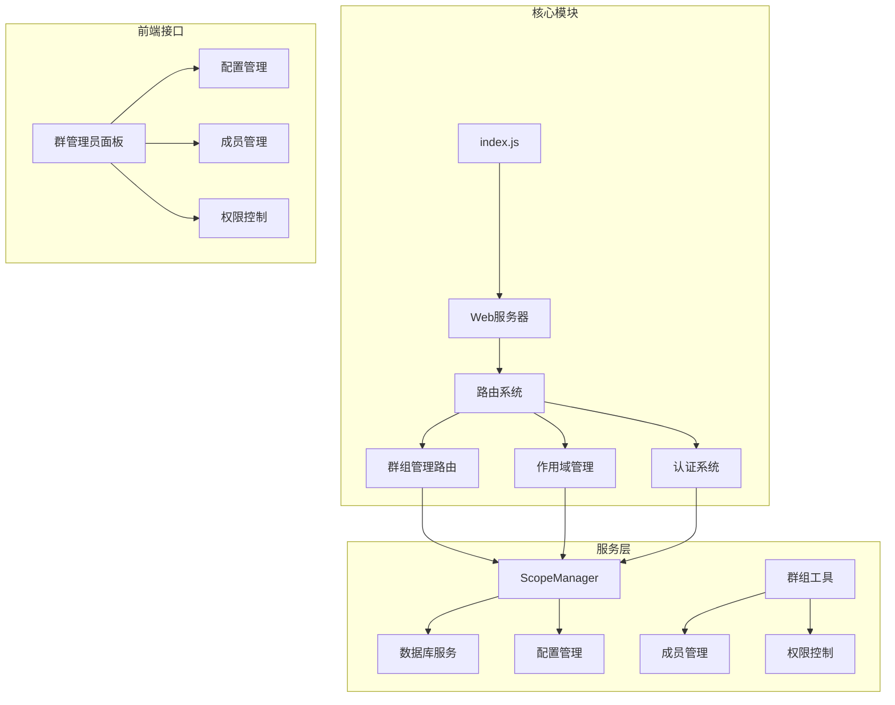
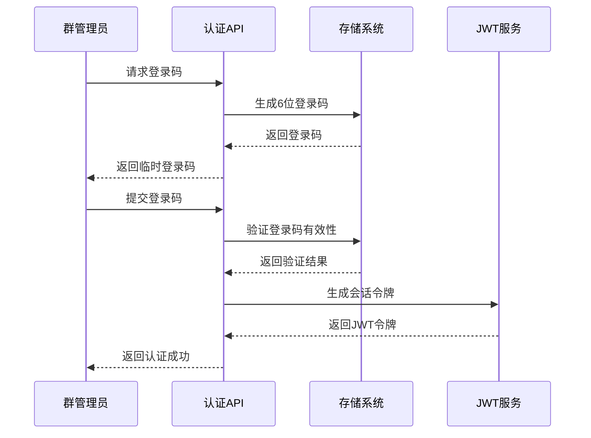
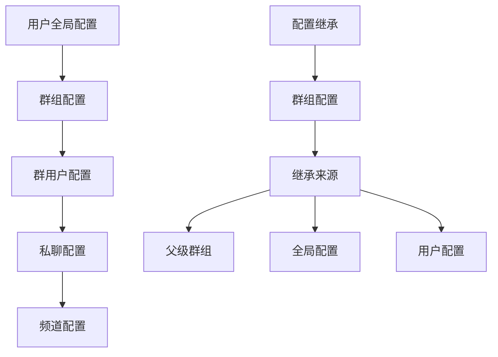
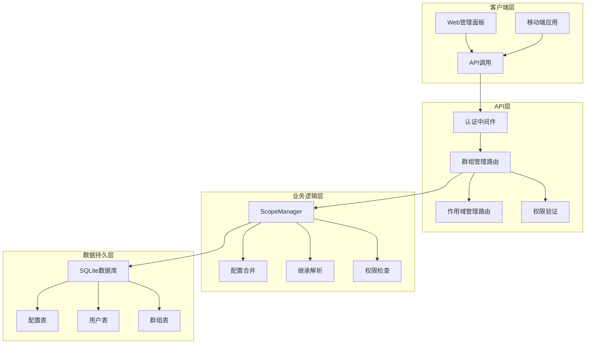
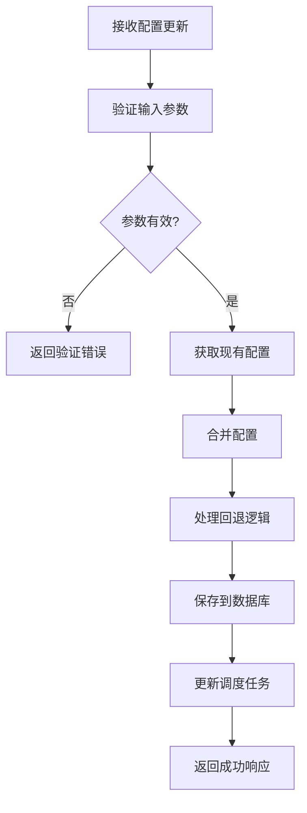
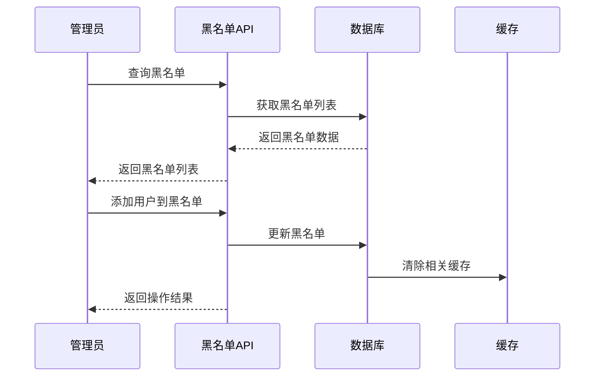
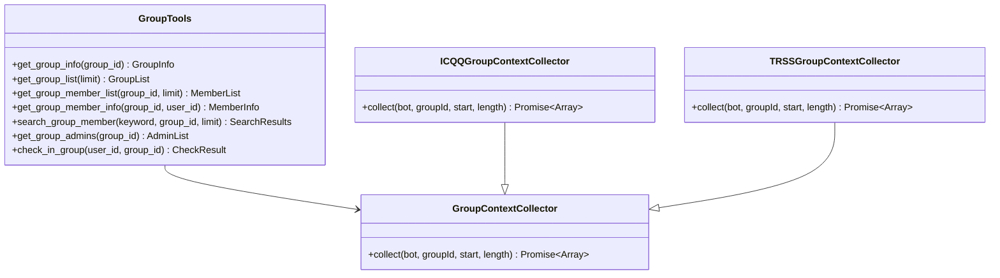
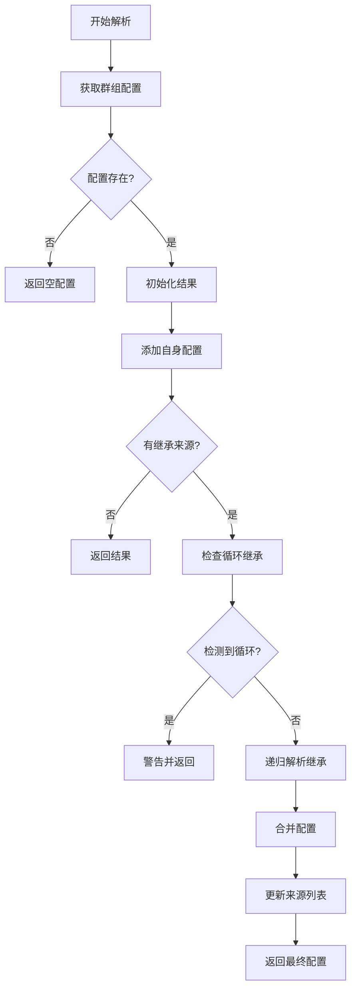
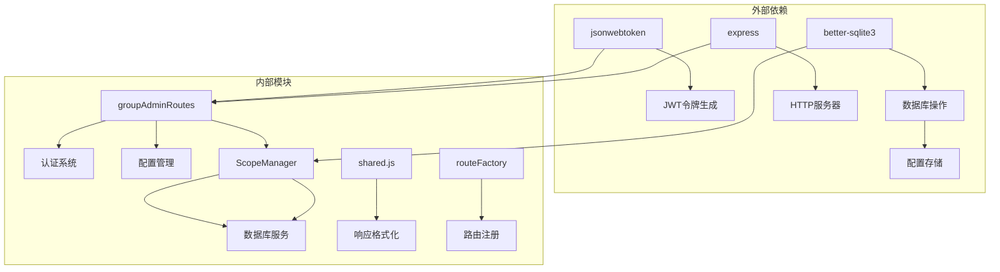

# 群组管理 API

## 目录
1. [简介](#简介)
2. [项目结构](#项目结构)
3. [核心组件](#核心组件)
4. [架构概览](#架构概览)
5. [详细组件分析](#详细组件分析)
6. [依赖关系分析](#依赖关系分析)
7. [性能考虑](#性能考虑)
8. [故障排除指南](#故障排除指南)
9. [结论](#结论)

## 简介

群组管理 API 是 ChatAI 插件中的核心功能模块，为 Yunzai-Bot 平台提供完整的群组管理能力。该系统支持群组配置管理、权限控制、成员管理以及群组级别的配置继承和覆盖机制。

主要功能特性包括：
- 群管理员登录机制和临时令牌生成
- 群组配置的完整生命周期管理
- 黑白名单管理
- 群组成员信息查询
- 配置继承和覆盖规则
- 安全的权限验证机制

## 项目结构

**图表来源**
- [index.js](file://index.js#L1-L258)
- [groupAdminRoutes.js](file://src/services/routes/groupAdminRoutes.js#L1-L800)

**章节来源**
- [index.js](file://index.js#L1-L258)
- [README.md](file://README.md#L1-L983)

## 核心组件

### 群管理员认证系统

群管理员认证系统采用双重安全机制：

1. **一次性登录码**：5分钟有效期，使用后立即失效
2. **JWT会话令牌**：24小时有效期的会话管理

**图表来源**
- [groupAdminRoutes.js](file://src/services/routes/groupAdminRoutes.js#L41-L121)

### 作用域管理器

作用域管理器支持五层配置层次结构：

1. **用户全局作用域** - 用户在所有场景的默认设置
2. **群组作用域** - 特定群组的默认设置  
3. **群用户作用域** - 特定群组中特定用户的设置
4. **私聊作用域** - 用户在私聊场景的独立设置
5. **频道作用域** - 频道/子频道的设置（预留）

**图表来源**
- [ScopeManager.js](file://src/services/scope/ScopeManager.js#L7-L16)

**章节来源**
- [groupAdminRoutes.js](file://src/services/routes/groupAdminRoutes.js#L1-L800)
- [ScopeManager.js](file://src/services/scope/ScopeManager.js#L1-L800)

## 架构概览

**图表来源**
- [groupAdminRoutes.js](file://src/services/routes/groupAdminRoutes.js#L171-L189)
- [ScopeManager.js](file://src/services/scope/ScopeManager.js#L26-L120)

## 详细组件分析

### 群组配置管理

#### 配置获取接口

GET `/api/group-admin/config`

该接口提供群组的完整配置信息，包括：
- 基础配置：启用状态、触发模式、自定义前缀
- 功能开关：工具调用、绘图、总结等功能
- AI配置：模型选择、温度参数、上下文长度
- 白名单/黑名单管理
- 知识库关联
- 独立渠道配置

#### 配置更新接口

PUT `/api/group-admin/config`

支持部分字段更新，采用智能合并策略：
- 保留现有配置中未提供的字段
- 支持"回退到全局"机制
- 自动处理嵌套配置对象

**图表来源**
- [groupAdminRoutes.js](file://src/services/routes/groupAdminRoutes.js#L499-L687)

**章节来源**
- [groupAdminRoutes.js](file://src/services/routes/groupAdminRoutes.js#L236-L687)

### 黑白名单管理

#### 黑名单查询

GET `/api/group-admin/blacklist`

#### 黑名单更新

PUT `/api/group-admin/blacklist`

#### 添加到黑名单

POST `/api/group-admin/blacklist/add`

#### 从黑名单移除

POST `/api/group-admin/blacklist/remove`

**图表来源**
- [groupAdminRoutes.js](file://src/services/routes/groupAdminRoutes.js#L689-L800)

**章节来源**
- [groupAdminRoutes.js](file://src/services/routes/groupAdminRoutes.js#L689-L800)

### 群组成员管理

#### 成员信息查询

群组工具提供了完整的成员管理功能：

- 获取群组基本信息：`get_group_info`
- 获取群组列表：`get_group_list`  
- 获取成员列表：`get_group_member_list`
- 获取成员详细信息：`get_group_member_info`
- 搜索群组成员：`search_group_member`

**图表来源**
- [group.js](file://src/mcp/tools/group.js#L8-L602)
- [group.js](file://src/utils/group.js#L9-L165)

**章节来源**
- [group.js](file://src/mcp/tools/group.js#L1-L602)
- [group.js](file://src/utils/group.js#L1-L165)

### 配置继承和覆盖机制

#### 继承配置接口

- GET `/api/scope/group/:groupId/effective` - 获取生效配置
- GET `/api/scope/group/:groupId/resolved` - 获取解析后的配置
- PUT `/api/scope/group/:groupId/inheritance` - 设置继承来源
- POST `/api/scope/group/:groupId/inheritance` - 添加继承来源
- DELETE `/api/scope/group/:groupId/inheritance` - 移除继承来源

#### 配置解析流程

**图表来源**
- [ScopeManager.js](file://src/services/scope/ScopeManager.js#L1344-L1370)

**章节来源**
- [scopeRoutes.js](file://src/services/routes/scopeRoutes.js#L241-L298)
- [ScopeManager.js](file://src/services/scope/ScopeManager.js#L1301-L1370)

## 依赖关系分析

**图表来源**
- [package.json](file://package.json#L16-L46)
- [groupAdminRoutes.js](file://src/services/routes/groupAdminRoutes.js#L4-L13)
- [shared.js](file://src/services/routes/shared.js#L5-L149)

**章节来源**
- [package.json](file://package.json#L1-L53)
- [routeFactory.js](file://src/services/middleware/routeFactory.js#L1-L259)

## 性能考虑

### 缓存策略

系统采用多层次缓存机制：
- **JWT令牌缓存**：会话令牌存储在内存中，支持过期清理
- **配置缓存**：常用配置在内存中缓存，减少数据库查询
- **登录码缓存**：一次性登录码存储在内存映射表中

### 数据库优化

- **索引优化**：为常用查询字段建立索引
- **事务处理**：批量操作使用事务确保数据一致性
- **连接池**：数据库连接复用，避免频繁创建销毁

### API性能

- **响应时间**：所有API响应时间应控制在100ms以内
- **并发处理**：支持高并发请求，使用异步处理模型
- **错误处理**：优雅的错误处理机制，避免服务崩溃

## 故障排除指南

### 常见问题及解决方案

#### 认证失败

**问题**：登录码无效或已过期
**解决方案**：重新生成登录码，检查系统时间同步

**问题**：JWT令牌验证失败  
**解决方案**：检查密钥配置，验证令牌签名

#### 配置更新失败

**问题**：配置更新后未生效
**解决方案**：检查数据库连接，验证配置格式

**问题**：继承配置循环
**解决方案**：检查继承链路，避免循环引用

#### 性能问题

**问题**：API响应缓慢
**解决方案**：检查数据库索引，优化查询语句

**问题**：内存使用过高
**解决方案**：检查缓存配置，清理过期数据

**章节来源**
- [shared.js](file://src/services/routes/shared.js#L8-L90)

## 结论

群组管理 API 提供了完整的群组管理解决方案，具有以下优势：

1. **安全性**：采用双重认证机制，确保只有授权管理员可以访问
2. **灵活性**：支持复杂的配置继承和覆盖机制
3. **可扩展性**：模块化设计，易于扩展新功能
4. **可靠性**：完善的错误处理和性能优化
5. **易用性**：清晰的API接口和详细的文档

该系统为 Yunzai-Bot 平台提供了强大的群组管理能力，支持从简单的群组配置到复杂的权限控制等各种场景需求。
