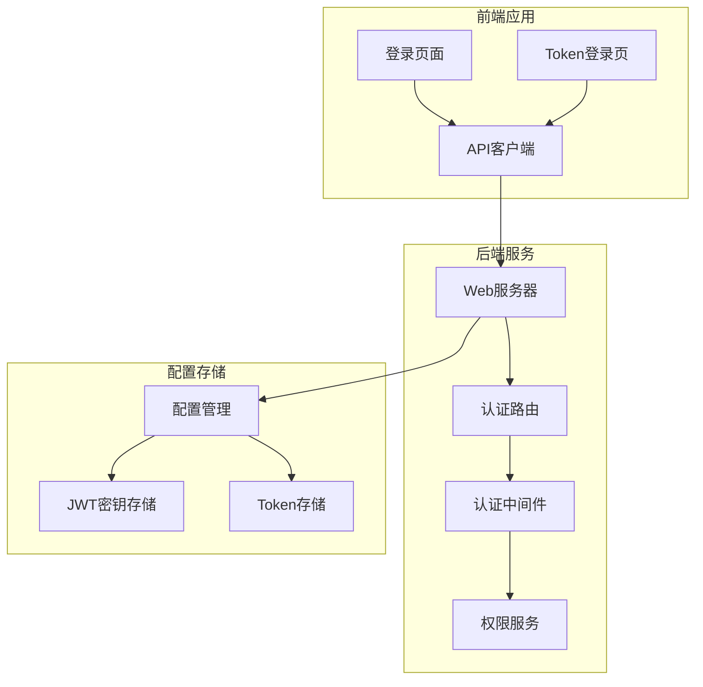
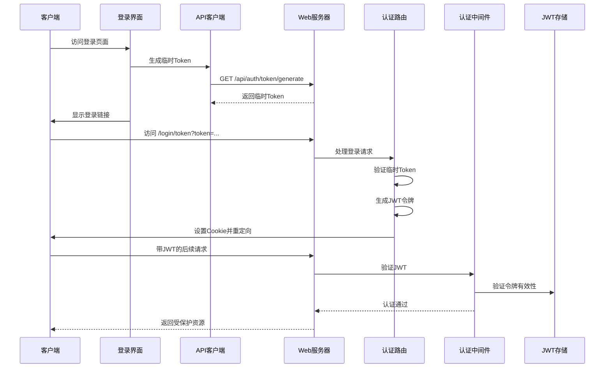
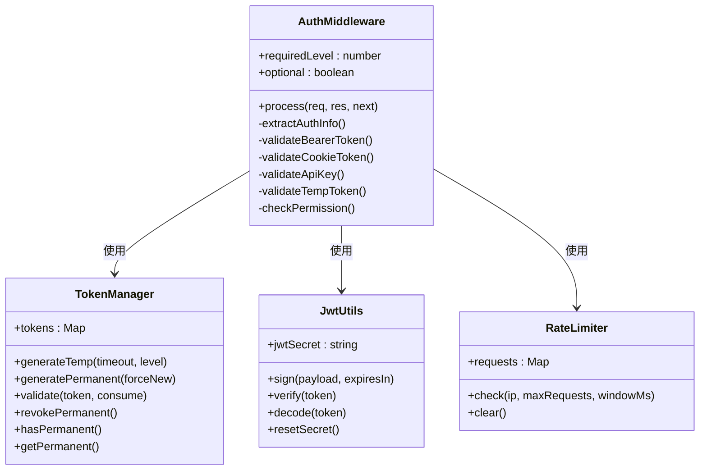
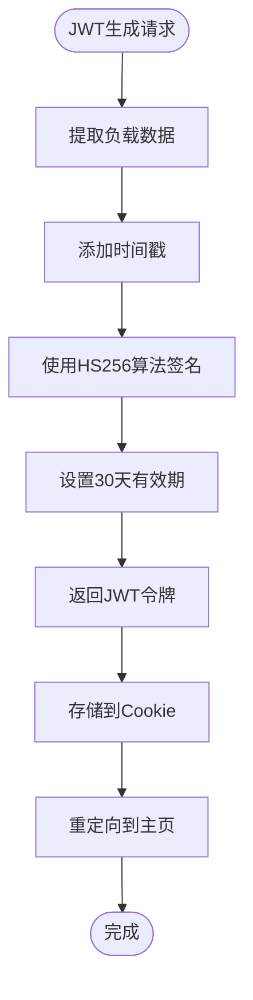
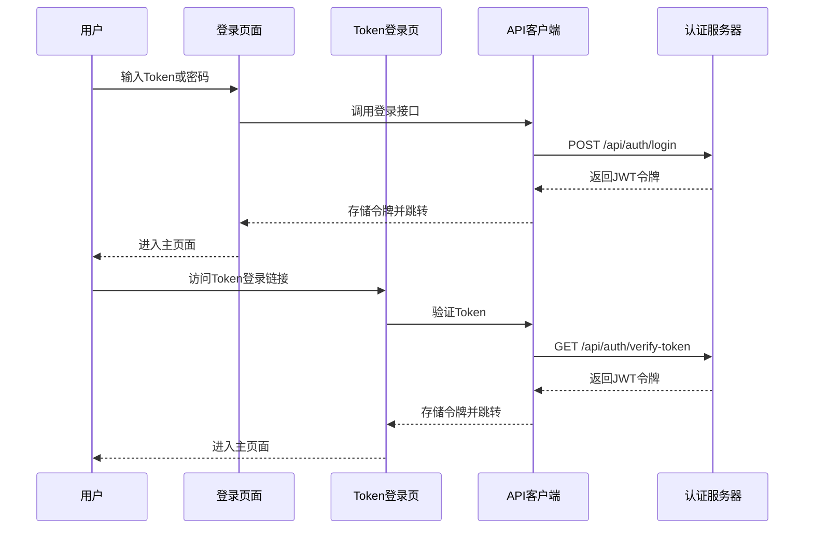
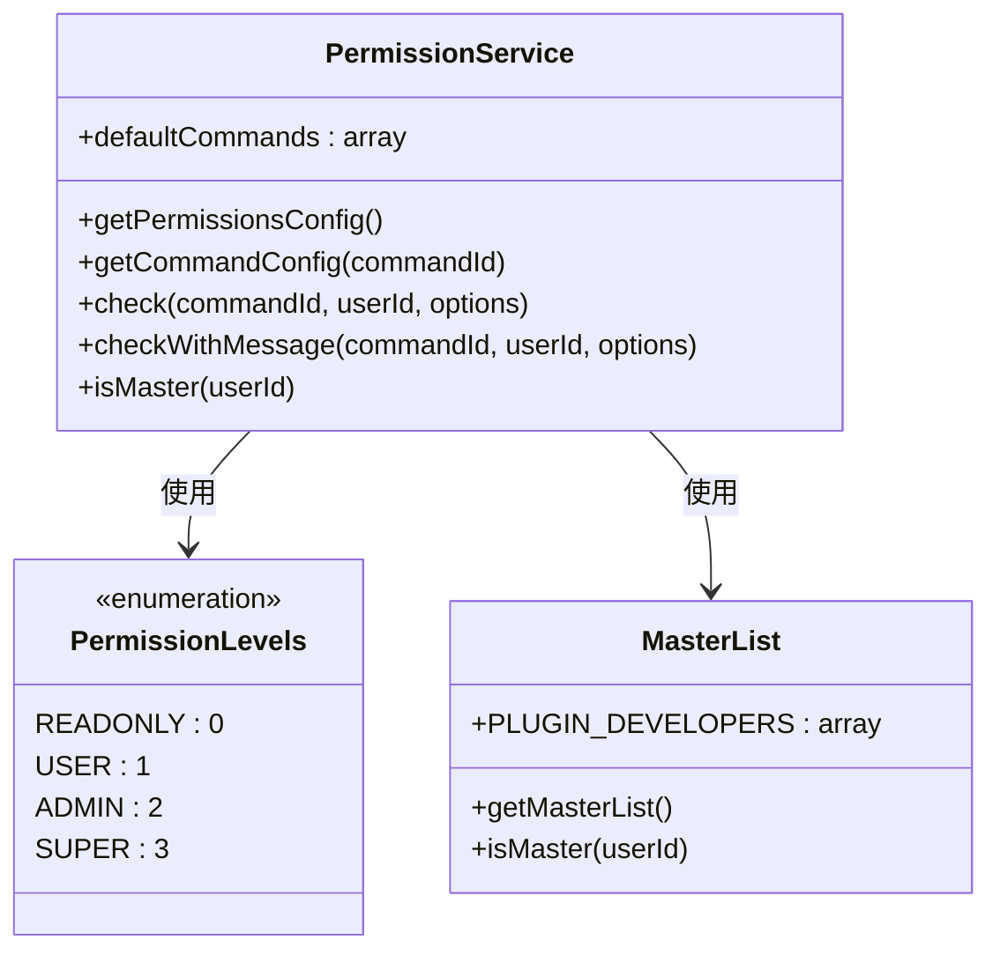
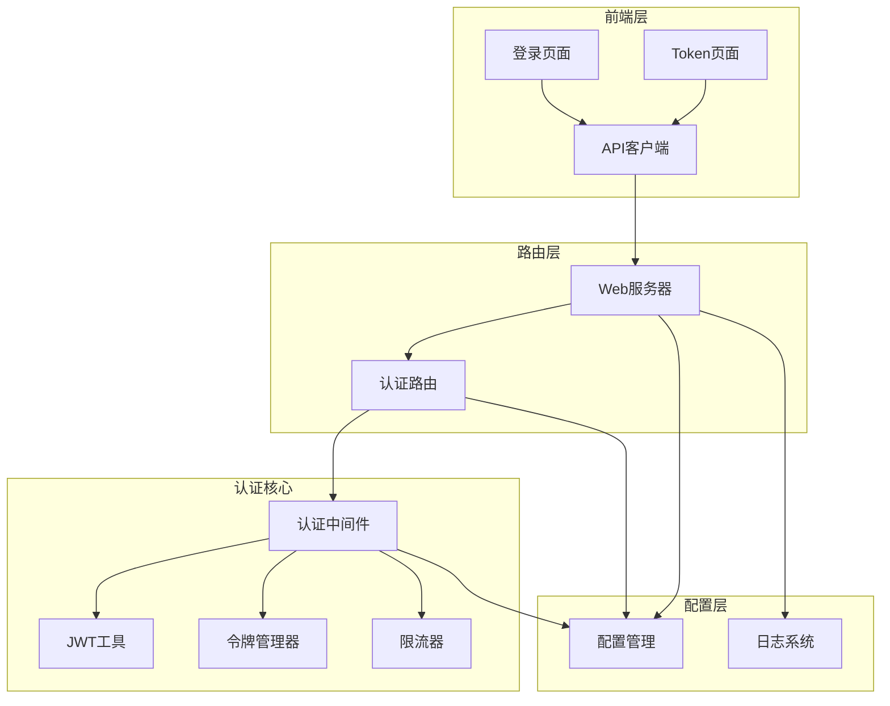

# 认证 API

## 目录
1. [简介](#简介)
2. [项目结构](#项目结构)
3. [核心组件](#核心组件)
4. [架构概览](#架构概览)
5. [详细组件分析](#详细组件分析)
6. [依赖分析](#依赖分析)
7. [性能考虑](#性能考虑)
8. [故障排除指南](#故障排除指南)
9. [结论](#结论)

## 简介
本文件详细说明了 ChatAI 管理面板的认证 API 设计与实现，涵盖用户登录、令牌验证和权限控制的完整接口规范。系统采用多层认证机制，包括临时 Token、永久 Token 和 JWT 令牌，支持多种认证来源（Bearer Token、Cookie、API Key），并提供完善的权限控制和安全中间件。

## 项目结构
认证相关的核心文件分布如下：
- 后端中间件与认证逻辑：src/services/middleware/auth.js
- 认证路由与 API 实现：src/services/routes/authRoutes.js、src/services/webServer.js
- 前端登录界面与 API 客户端：frontend/app/login/*.tsx、frontend/lib/api.ts
- 权限服务：src/services/permission/PermissionService.js
- 配置管理：config/config.js

**图表来源**
- [src/services/webServer.js](file://src/services/webServer.js#L279-L537)
- [src/services/routes/authRoutes.js](file://src/services/routes/authRoutes.js#L158-L306)
- [src/services/middleware/auth.js](file://src/services/middleware/auth.js#L179-L254)

**章节来源**
- [src/services/webServer.js](file://src/services/webServer.js#L1-L807)
- [src/services/routes/authRoutes.js](file://src/services/routes/authRoutes.js#L1-L309)
- [src/services/middleware/auth.js](file://src/services/middleware/auth.js#L1-L533)

## 核心组件
认证系统由以下核心组件构成：

### 1. 令牌管理系统
- **临时 Token**：5分钟有效期，一次性使用
- **永久 Token**：长期有效，可通过配置管理
- **JWT 令牌**：30天有效期，基于 HS256 算法

### 2. 认证中间件
- 支持多种认证来源：Authorization 头、Cookie、查询参数
- 权限级别检查：只读、用户、管理员、超级管理员
- 可选认证模式

### 3. 前端认证流程
- 登录页面：输入 Token 或密码
- Token 登录：通过 URL Token 自动登录
- 本地存储：JWT 令牌存储在 localStorage

**章节来源**
- [src/services/middleware/auth.js](file://src/services/middleware/auth.js#L23-L108)
- [src/services/middleware/auth.js](file://src/services/middleware/auth.js#L179-L254)
- [frontend/app/login/page.tsx](file://frontend/app/login/page.tsx#L1-L108)
- [frontend/app/login/token/page.tsx](file://frontend/app/login/token/page.tsx#L1-L126)

## 架构概览
认证系统的整体架构分为三层：

**图表来源**
- [src/services/webServer.js](file://src/services/webServer.js#L341-L445)
- [src/services/routes/authRoutes.js](file://src/services/routes/authRoutes.js#L158-L296)
- [frontend/lib/api.ts](file://frontend/lib/api.ts#L65-L70)

## 详细组件分析

### 认证中间件分析
认证中间件是整个认证系统的核心，负责处理多种认证方式和权限检查。

**图表来源**
- [src/services/middleware/auth.js](file://src/services/middleware/auth.js#L179-L254)
- [src/services/middleware/auth.js](file://src/services/middleware/auth.js#L23-L108)
- [src/services/middleware/auth.js](file://src/services/middleware/auth.js#L116-L171)

#### 认证流程详解
1. **Token 提取**：按优先级检查 Authorization 头、Cookie、查询参数
2. **JWT 验证**：使用 HS256 算法验证令牌有效性
3. **权限检查**：验证用户权限级别是否满足要求
4. **响应处理**：根据认证结果返回相应状态

**章节来源**
- [src/services/middleware/auth.js](file://src/services/middleware/auth.js#L179-L254)

### JWT 令牌管理
JWT 令牌采用 HS256 算法，具有以下特性：

**图表来源**
- [src/services/webServer.js](file://src/services/webServer.js#L388-L410)
- [src/services/routes/authRoutes.js](file://src/services/routes/authRoutes.js#L232-L256)

#### JWT 负载结构
- `authenticated`: 认证状态标识
- `loginTime`: 登录时间戳
- `jti`: JWT ID
- `iss`: 签发者 (chatai-panel)
- `aud`: 接收者 (chatai-client)

**章节来源**
- [src/services/webServer.js](file://src/services/webServer.js#L388-L410)
- [src/services/routes/authRoutes.js](file://src/services/routes/authRoutes.js#L232-L256)

### 前端认证流程
前端提供了两种主要的认证方式：

**图表来源**
- [frontend/app/login/page.tsx](file://frontend/app/login/page.tsx#L33-L54)
- [frontend/app/login/token/page.tsx](file://frontend/app/login/token/page.tsx#L48-L81)
- [frontend/lib/api.ts](file://frontend/lib/api.ts#L65-L70)

**章节来源**
- [frontend/app/login/page.tsx](file://frontend/app/login/page.tsx#L1-L108)
- [frontend/app/login/token/page.tsx](file://frontend/app/login/token/page.tsx#L1-L126)
- [frontend/lib/api.ts](file://frontend/lib/api.ts#L65-L70)

### 权限控制系统
系统实现了多级别的权限控制机制：

**图表来源**
- [src/services/permission/PermissionService.js](file://src/services/permission/PermissionService.js#L22-L484)
- [src/services/middleware/auth.js](file://src/services/middleware/auth.js#L13-L18)

#### 权限检查流程
1. **主人权限优先**：插件开发者和配置的主人拥有最高权限
2. **指令级别检查**：根据指令配置的权限级别判断
3. **群组权限验证**：群聊中的管理员权限检查
4. **黑白名单过滤**：全局和指令级别的黑白名单

**章节来源**
- [src/services/permission/PermissionService.js](file://src/services/permission/PermissionService.js#L337-L421)

## 依赖分析
认证系统的依赖关系如下：

**图表来源**
- [src/services/middleware/auth.js](file://src/services/middleware/auth.js#L517-L533)
- [src/services/routes/authRoutes.js](file://src/services/routes/authRoutes.js#L158-L306)
- [src/services/webServer.js](file://src/services/webServer.js#L279-L537)

**章节来源**
- [src/services/middleware/index.js](file://src/services/middleware/index.js#L1-L31)
- [src/services/routes/index.js](file://src/services/routes/index.js#L1-L52)

## 性能考虑
认证系统在设计时充分考虑了性能优化：

### 1. 缓存策略
- **内存缓存**：临时 Token 存储在内存 Map 中，避免数据库访问
- **JWT 密钥缓存**：JWT 密钥在进程内存中缓存，减少配置读取开销
- **限流缓存**：请求限流状态存储在内存中，支持快速检查

### 2. 异步处理
- **并行地址检测**：本地和公网地址检测并行执行，总超时控制在2秒内
- **异步配置加载**：配置文件异步读取和写入，不影响主线程

### 3. 内存管理
- **自动清理**：临时 Token 在过期后自动清理
- **限流器清理**：超过容量限制时自动清理旧记录

## 故障排除指南

### 常见认证问题及解决方案

#### 1. 登录失败
**症状**：用户无法登录，返回 "Token 无效或已过期"
**可能原因**：
- 临时 Token 已过期（5分钟有效期）
- 永久 Token 配置错误
- 服务器时间不同步

**解决步骤**：
1. 重新生成临时 Token：`GET /api/auth/token/generate`
2. 检查服务器时间设置
3. 验证 Token 格式是否正确

#### 2. 401 未授权错误
**症状**：API 请求返回 401 状态码
**可能原因**：
- JWT 令牌缺失或格式错误
- 令牌已过期
- 权限不足

**解决步骤**：
1. 检查 Authorization 头是否正确设置
2. 验证 JWT 令牌的有效性
3. 确认用户权限级别

#### 3. 403 权限不足
**症状**：API 请求返回 403 状态码
**可能原因**：
- 用户权限级别不够
- 指令级别的权限限制
- 群组权限配置

**解决步骤**：
1. 检查用户权限级别
2. 验证指令权限配置
3. 确认群组权限设置

#### 4. 429 请求过于频繁
**症状**：API 请求返回 429 状态码
**可能原因**：
- 请求频率超过限制
- 限流配置过严

**解决步骤**：
1. 检查 X-RateLimit-* 响应头
2. 降低请求频率
3. 调整限流配置

**章节来源**
- [src/services/webServer.js](file://src/services/webServer.js#L313-L337)
- [src/services/middleware/auth.js](file://src/services/middleware/auth.js#L375-L401)

## 结论
ChatAI 管理面板的认证系统设计合理，实现了多层次的安全保障。系统支持灵活的认证方式，包括临时 Token、永久 Token 和 JWT 令牌，并提供了完善的权限控制和安全中间件。前端界面友好，用户体验良好。建议在生产环境中：

1. **定期轮换 JWT 密钥**：通过 `JwtUtils.resetSecret()` 定期重置密钥
2. **监控认证日志**：利用请求日志中间件监控异常访问
3. **配置适当的限流规则**：根据实际使用情况调整限流参数
4. **定期清理过期 Token**：确保系统性能和安全性

该认证系统为 ChatAI 管理面板提供了可靠的安全基础，能够满足大多数应用场景的需求。
