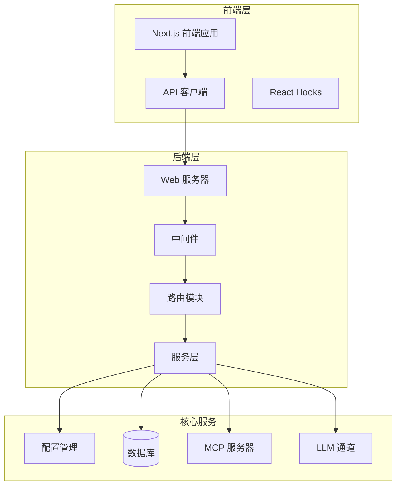
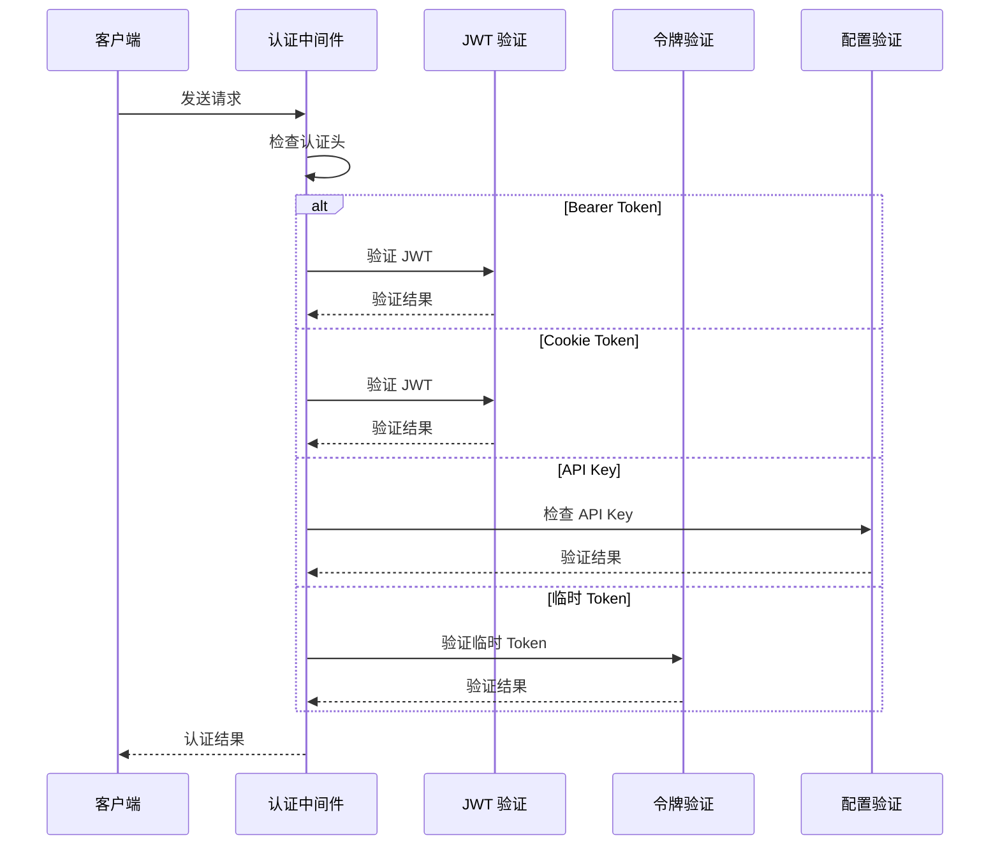
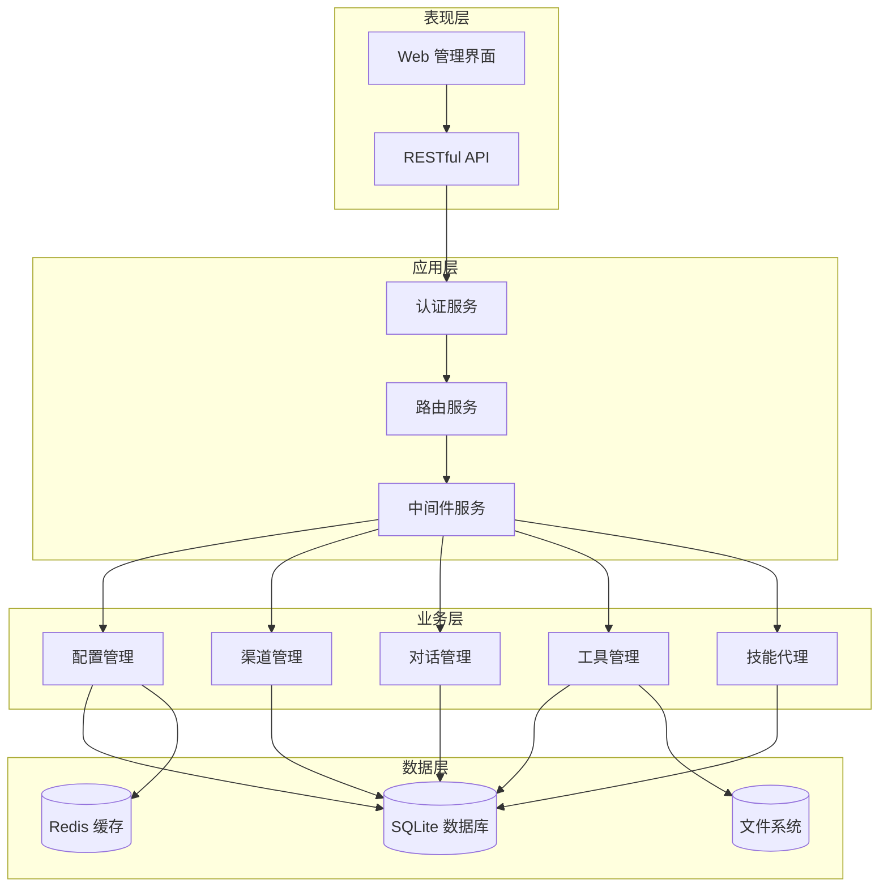
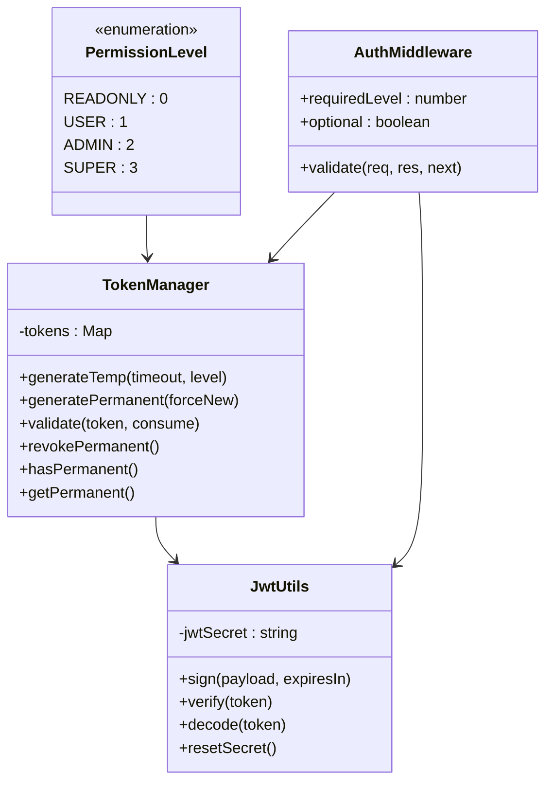
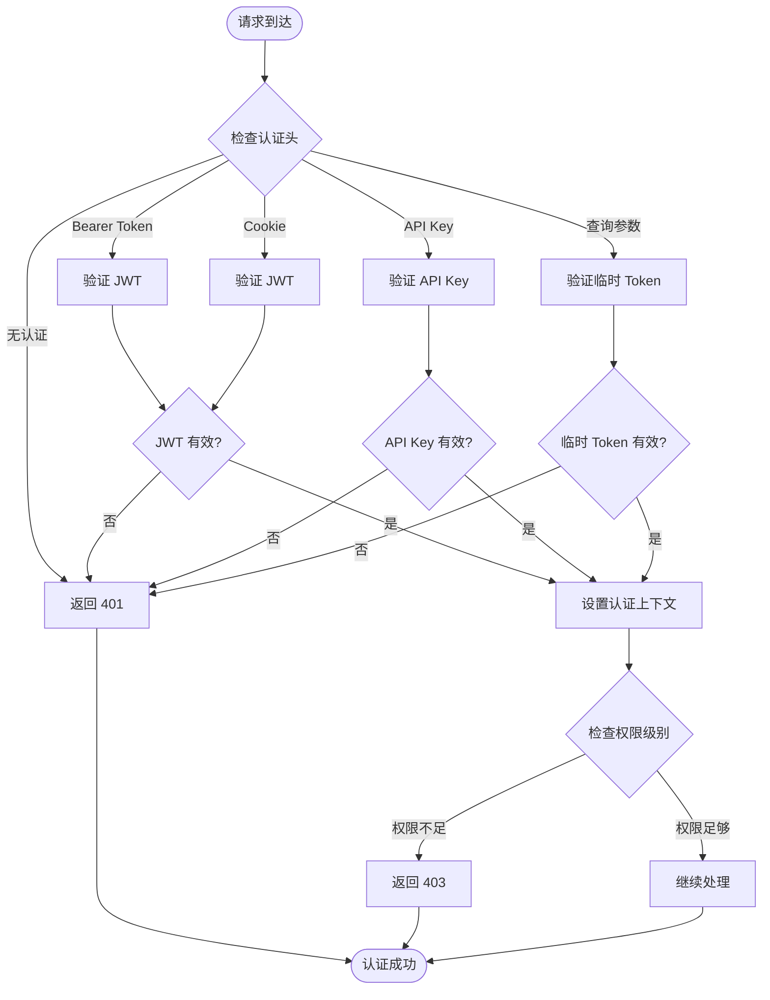
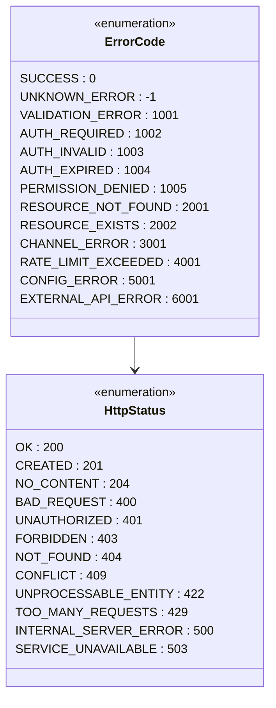
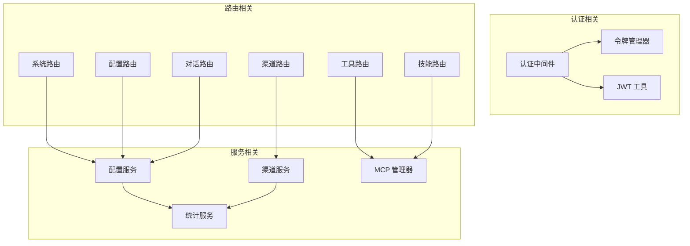
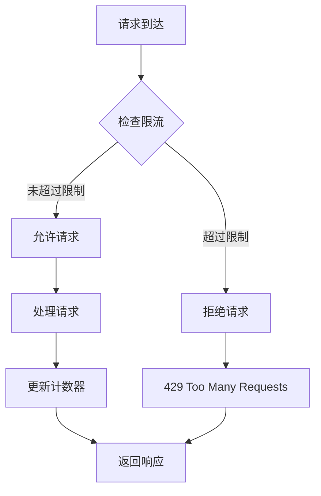

# API 接口文档

<cite>
**本文档引用的文件**
- [index.js](file://index.js)
- [webServer.js](file://src/services/webServer.js)
- [routes/index.js](file://src/services/routes/index.js)
- [auth.js](file://src/services/middleware/auth.js)
- [ApiResponse.js](file://src/services/middleware/ApiResponse.js)
- [shared.js](file://src/services/route/shared.js)
- [systemRoutes.js](file://src/services/routes/systemRoutes.js)
- [channelRoutes.js](file://src/services/routes/channelRoutes.js)
- [configRoutes.js](file://src/services/routes/configRoutes.js)
- [conversationRoutes.js](file://src/services/routes/conversationRoutes.js)
- [presetRoutes.js](file://src/services/routes/presetRoutes.js)
- [toolsRoutes.js](file://src/services/routes/toolsRoutes.js)
- [skillsRoutes.js](file://src/services/routes/skillsRoutes.js)
- [api.ts](file://frontend/lib/api.ts)
- [useApi.ts](file://frontend/lib/hooks/useApi.ts)
- [config.js](file://config/config.js)
</cite>

## 目录
1. [简介](#简介)
2. [项目结构](#项目结构)
3. [核心组件](#核心组件)
4. [架构概览](#架构概览)
5. [详细组件分析](#详细组件分析)
6. [依赖关系分析](#依赖关系分析)
7. [性能考虑](#性能考虑)
8. [故障排除指南](#故障排除指南)
9. [结论](#结论)

## 简介

ChatGPT 插件是一个基于 Yunzai 生态系统的智能对话管理平台，提供了完整的 Web 管理面板与后端服务通信接口。该系统支持多渠道对话管理、工具集成、预设配置、实时监控等功能，为用户提供了一个功能丰富的 AI 对话管理解决方案。

## 项目结构

该项目采用模块化架构设计，主要分为以下几个核心部分：



**图表来源**
- [webServer.js](file://src/services/webServer.js#L1-L807)
- [routes/index.js](file://src/services/routes/index.js#L1-L52)

**章节来源**
- [index.js](file://index.js#L1-L258)
- [webServer.js](file://src/services/webServer.js#L1-L807)

## 核心组件

### Web 服务器组件

Web 服务器是整个系统的核心入口点，负责处理所有 HTTP 请求和响应。它实现了以下关键功能：

- **认证系统**：支持多种认证方式，包括 JWT、临时令牌和永久令牌
- **路由管理**：统一管理所有 API 路由，支持模块化路由组织
- **中间件系统**：提供请求验证、限流、日志记录等中间件
- **静态资源服务**：提供前端构建产物的静态文件服务

### 认证与授权组件

系统实现了多层次的认证和授权机制：



**图表来源**
- [auth.js](file://src/services/middleware/auth.js#L179-L254)

### 路由系统组件

路由系统采用模块化设计，每个功能模块都有独立的路由文件：

- **系统路由**：健康检查、版本信息、性能监控
- **配置路由**：系统配置管理
- **渠道路由**：多 LLM 渠道管理
- **对话路由**：对话历史管理
- **工具路由**：MCP 工具管理
- **技能路由**：技能代理管理

**章节来源**
- [webServer.js](file://src/services/webServer.js#L339-L537)
- [routes/index.js](file://src/services/routes/index.js#L1-L52)

## 架构概览

系统采用分层架构设计，确保了良好的可维护性和扩展性：



**图表来源**
- [webServer.js](file://src/services/webServer.js#L279-L537)
- [config.js](file://config/config.js#L1-L631)

## 详细组件分析

### 认证与授权机制

#### 多层次认证体系

系统支持四种认证方式，按优先级顺序验证：

1. **JWT Bearer Token**：最高等级的认证方式
2. **Cookie Token**：浏览器会话认证
3. **API Key**：服务间调用认证
4. **临时 Token**：一次性登录认证

#### 权限级别管理



**图表来源**
- [auth.js](file://src/services/middleware/auth.js#L13-L171)

#### 认证流程



**图表来源**
- [auth.js](file://src/services/middleware/auth.js#L179-L254)

**章节来源**
- [auth.js](file://src/services/middleware/auth.js#L1-L533)

### 统一响应格式

系统实现了统一的 API 响应格式，确保前后端交互的一致性：

#### 响应结构定义

| 字段 | 类型 | 必填 | 描述 |
|------|------|------|------|
| code | number | 是 | 业务状态码 |
| data | any | 否 | 响应数据 |
| message | string | 是 | 响应消息 |
| meta | object | 否 | 元数据信息 |

#### 错误码定义



**图表来源**
- [ApiResponse.js](file://src/services/middleware/ApiResponse.js#L5-L36)

**章节来源**
- [ApiResponse.js](file://src/services/middleware/ApiResponse.js#L1-L357)

### 系统管理 API

#### 健康检查接口

系统提供了多个健康检查接口，用于监控服务状态：

**接口定义**
- **URL**: `/api/health`
- **方法**: GET
- **认证**: 无需认证
- **用途**: 健康状态检查

**响应示例**
```json
{
  "status": "healthy",
  "timestamp": 1699123456789,
  "uptime": 3600.5,
  "memoryUsage": {
    "heapUsed": 128,
    "heapTotal": 256,
    "rss": 512
  }
}
```

#### 版本信息接口

**接口定义**
- **URL**: `/api/system/version`
- **方法**: GET
- **认证**: 无需认证
- **用途**: 获取系统版本信息

**响应示例**
```json
{
  "version": "1.0.0",
  "commitId": "abc123def",
  "branch": "main",
  "nodejs": "18.17.0",
  "platform": "linux"
}
```

**章节来源**
- [systemRoutes.js](file://src/services/routes/systemRoutes.js#L1-L590)

### 配置管理 API

#### 配置获取接口

**接口定义**
- **URL**: `/api/config`
- **方法**: GET
- **认证**: 需要认证
- **用途**: 获取系统配置

**响应示例**
```json
{
  "basic": {
    "commandPrefix": "#ai",
    "debug": false
  },
  "llm": {
    "defaultModel": "qwen/qwen3-next-80b-a3b-instruct"
  },
  "web": {
    "enabled": true,
    "port": 3000
  }
}
```

#### 配置更新接口

**接口定义**
- **URL**: `/api/config`
- **方法**: POST
- **认证**: 需要认证
- **用途**: 更新系统配置

**请求示例**
```json
{
  "llm": {
    "defaultModel": "new-model-name"
  },
  "basic": {
    "debug": true
  }
}
```

**章节来源**
- [configRoutes.js](file://src/services/routes/configRoutes.js#L1-L257)

### 渠道管理 API

#### 渠道列表接口

**接口定义**
- **URL**: `/api/channels/list`
- **方法**: GET
- **认证**: 需要认证
- **参数**: `withStats` (可选) - 是否包含统计信息

**响应示例**
```json
[
  {
    "id": "openai-1",
    "name": "OpenAI GPT-4",
    "adapterType": "openai",
    "status": "active",
    "models": ["gpt-4", "gpt-3.5-turbo"],
    "apiKey": "sk-...",
    "baseUrl": "https://api.openai.com"
  }
]
```

#### 渠道测试接口

**接口定义**
- **URL**: `/api/channels/test`
- **方法**: POST
- **认证**: 需要认证
- **用途**: 测试渠道连接

**请求示例**
```json
{
  "id": "openai-1",
  "adapterType": "openai",
  "baseUrl": "https://api.openai.com",
  "apiKey": "sk-...",
  "models": ["gpt-4"]
}
```

**响应示例**
```json
{
  "success": true,
  "message": "连接成功！耗时 150ms",
  "testResponse": "你好！有什么可以帮助你的吗？",
  "elapsed": 150,
  "model": "gpt-4"
}
```

**章节来源**
- [channelRoutes.js](file://src/services/routes/channelRoutes.js#L1-L535)

### 对话管理 API

#### 对话列表接口

**接口定义**
- **URL**: `/api/conversations/list`
- **方法**: GET
- **认证**: 需要认证
- **用途**: 获取所有对话列表

**响应示例**
```json
[
  {
    "id": "conv_123",
    "title": "关于 AI 的讨论",
    "createdAt": "2023-10-01T10:30:00Z",
    "updatedAt": "2023-10-01T11:45:00Z",
    "messageCount": 25
  }
]
```

#### 对话消息接口

**接口定义**
- **URL**: `/api/conversations/{id}/messages`
- **方法**: GET
- **认证**: 需要认证
- **参数**: `limit` (可选) - 限制返回消息数量，默认 100

**响应示例**
```json
[
  {
    "id": "msg_1",
    "conversationId": "conv_123",
    "role": "user",
    "content": "你好",
    "createdAt": "2023-10-01T10:30:00Z"
  },
  {
    "id": "msg_2",
    "conversationId": "conv_123",
    "role": "assistant",
    "content": "你好！有什么可以帮助你的吗？",
    "createdAt": "2023-10-01T10:30:05Z"
  }
]
```

**章节来源**
- [conversationRoutes.js](file://src/services/routes/conversationRoutes.js#L1-L118)

### 工具管理 API

#### 工具列表接口

**接口定义**
- **URL**: `/api/tools/list`
- **方法**: GET
- **认证**: 需要认证
- **用途**: 获取所有工具列表

**响应示例**
```json
[
  {
    "name": "web_search",
    "description": "网页搜索工具",
    "serverName": "builtin",
    "parameters": {
      "type": "object",
      "properties": {
        "query": {
          "type": "string",
          "description": "搜索关键词"
        }
      }
    }
  }
]
```

#### 工具测试接口

**接口定义**
- **URL**: `/api/tools/test`
- **方法**: POST
- **认证**: 需要认证
- **用途**: 测试工具执行

**请求示例**
```json
{
  "toolName": "web_search",
  "arguments": {
    "query": "人工智能发展史"
  }
}
```

**响应示例**
```json
{
  "toolName": "web_search",
  "arguments": {
    "query": "人工智能发展史"
  },
  "result": {
    "content": [
      {
        "type": "text",
        "text": "人工智能的发展经历了多个重要阶段..."
      }
    ]
  },
  "duration": 1200,
  "success": true
}
```

**章节来源**
- [toolsRoutes.js](file://src/services/routes/toolsRoutes.js#L1-L705)

### 技能代理 API

#### 技能状态接口

**接口定义**
- **URL**: `/api/skills/status`
- **方法**: GET
- **认证**: 需要认证
- **用途**: 获取技能代理整体状态

**响应示例**
```json
{
  "servers": [
    {
      "name": "builtin-server",
      "status": "connected",
      "type": "builtin",
      "toolsCount": 45,
      "connectedAt": "2023-10-01T10:00:00Z"
    }
  ],
  "stats": {
    "totalTools": 45,
    "enabledTools": 42,
    "executionCount": 128,
    "successRate": 0.95
  },
  "categories": [
    {
      "key": "system",
      "name": "系统工具",
      "toolCount": 12,
      "enabled": true
    }
  ]
}
```

#### 技能执行接口

**接口定义**
- **URL**: `/api/skills/execute`
- **方法**: POST
- **认证**: 需要认证
- **用途**: 执行指定技能

**请求示例**
```json
{
  "toolName": "web_search",
  "args": {
    "query": "机器学习教程"
  },
  "presetId": "default"
}
```

**响应示例**
```json
{
  "toolName": "web_search",
  "result": {
    "content": [
      {
        "type": "text",
        "text": "机器学习是人工智能的一个重要分支..."
      }
    ]
  },
  "executionTime": 1500,
  "success": true
}
```

**章节来源**
- [skillsRoutes.js](file://src/services/routes/skillsRoutes.js#L1-L391)

## 依赖关系分析

### 组件耦合度分析



**图表来源**
- [webServer.js](file://src/services/webServer.js#L124-L144)
- [routes/index.js](file://src/services/routes/index.js#L25-L51)

### 外部依赖

系统主要依赖以下外部组件：

- **Express.js**: Web 框架
- **JWT**: JSON Web Token 认证
- **Better SQLite3**: 数据库访问
- **Redis**: 缓存存储
- **Axios**: HTTP 客户端

**章节来源**
- [webServer.js](file://src/services/webServer.js#L1-L15)
- [config.js](file://config/config.js#L1-L631)

## 性能考虑

### 缓存策略

系统实现了多层次的缓存策略：

1. **Redis 缓存**: 用于热点数据缓存
2. **内存缓存**: 用于短期数据缓存
3. **数据库查询缓存**: 用于重复查询结果

### 限流机制



**图表来源**
- [auth.js](file://src/services/middleware/auth.js#L375-L401)

### 性能监控

系统提供了完善的性能监控功能：

- **内存使用监控**: 实时监控内存使用情况
- **请求响应时间**: 统计 API 响应时间
- **并发请求监控**: 监控同时处理的请求数量
- **错误率统计**: 统计 API 错误率

## 故障排除指南

### 常见问题诊断

#### 认证失败问题

**症状**: 401 未授权错误

**可能原因**:
1. JWT 令牌过期
2. 临时令牌无效
3. API Key 配置错误
4. 认证头格式不正确

**解决方法**:
1. 重新生成 JWT 令牌
2. 检查临时令牌的有效期
3. 验证 API Key 配置
4. 确认认证头格式

#### 数据库连接问题

**症状**: 数据库操作失败

**可能原因**:
1. 数据库文件损坏
2. 权限不足
3. 磁盘空间不足

**解决方法**:
1. 检查数据库文件完整性
2. 验证文件权限
3. 清理磁盘空间

#### 网络连接问题

**症状**: 外部 API 调用失败

**可能原因**:
1. 网络连接不稳定
2. 代理配置错误
3. API 限流

**解决方法**:
1. 检查网络连接
2. 验证代理配置
3. 实现重试机制

**章节来源**
- [ApiResponse.js](file://src/services/middleware/ApiResponse.js#L212-L241)

## 结论

ChatGPT 插件提供了一个功能完整、架构清晰的 Web 管理面板系统。通过模块化的组件设计和统一的 API 规范，系统实现了良好的可维护性和扩展性。

### 主要优势

1. **完整的认证体系**: 支持多种认证方式，满足不同场景需求
2. **统一的响应格式**: 确保前后端交互的一致性
3. **模块化架构**: 便于功能扩展和维护
4. **完善的监控**: 提供全面的性能和错误监控
5. **灵活的配置**: 支持动态配置管理

### 未来改进方向

1. **API 版本管理**: 实现向后兼容的 API 版本控制
2. **增强的安全性**: 实施更严格的安全措施
3. **性能优化**: 进一步优化系统性能
4. **文档完善**: 提供更详细的开发文档
5. **测试覆盖**: 增加自动化测试覆盖率

该系统为 AI 对话管理提供了一个坚实的技术基础，为后续的功能扩展和性能优化奠定了良好的基础。