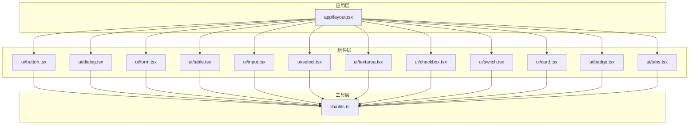
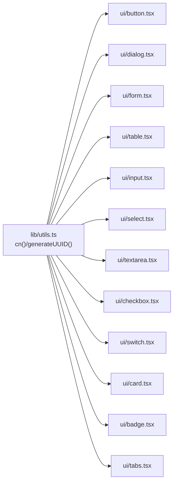
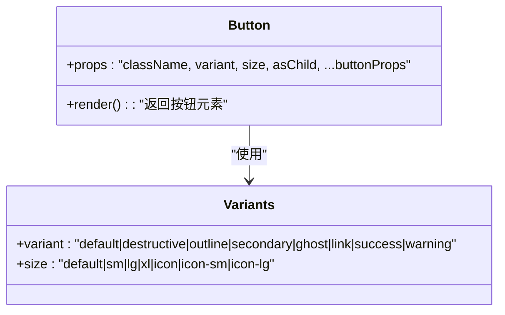
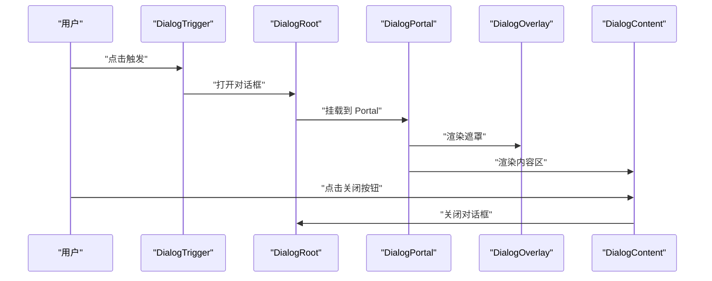
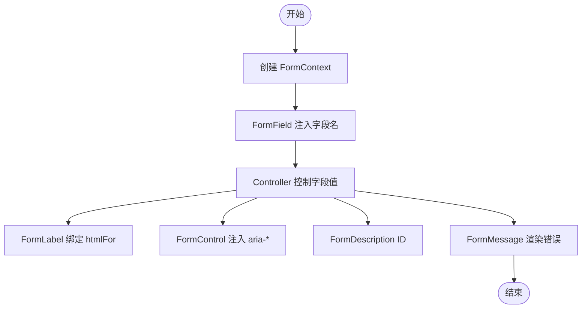
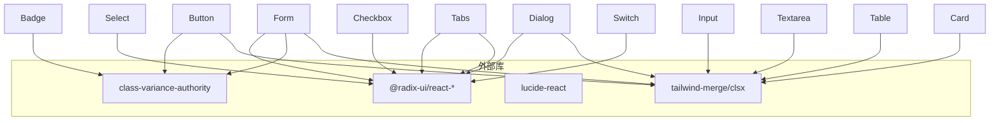

# UI 组件系统

## 目录
1. [简介](#简介)
2. [项目结构](#项目结构)
3. [核心组件](#核心组件)
4. [架构总览](#架构总览)
5. [组件详解](#组件详解)
6. [依赖关系分析](#依赖关系分析)
7. [性能与可访问性](#性能与可访问性)
8. [故障排查指南](#故障排查指南)
9. [结论](#结论)
10. [附录：开发规范与最佳实践](#附录开发规范与最佳实践)

## 简介
本文件系统性梳理了基于 Tailwind CSS 与 Radix UI 的前端组件库设计与实现，覆盖基础组件（按钮、输入、选择器、复选框、开关）、表单体系、表格、卡片、标签、对话框、标签页等。文档重点阐述：
- 组件属性接口与事件处理
- 样式定制与变体系统
- 组合模式与上下文协作
- 状态管理与无障碍支持
- 响应式设计与性能优化
- 使用示例与最佳实践

## 项目结构
前端采用按功能域分层的组织方式，UI 组件集中于 frontend/components/ui，通用工具位于 frontend/lib，页面布局在 frontend/app。

图表来源
- [frontend/app/layout.tsx](file://frontend/app/layout.tsx#L1-L27)
- [frontend/components/ui/button.tsx](file://frontend/components/ui/button.tsx#L1-L56)
- [frontend/components/ui/dialog.tsx](file://frontend/components/ui/dialog.tsx#L1-L124)
- [frontend/components/ui/form.tsx](file://frontend/components/ui/form.tsx#L1-L139)
- [frontend/components/ui/table.tsx](file://frontend/components/ui/table.tsx#L1-L76)
- [frontend/components/ui/input.tsx](file://frontend/components/ui/input.tsx#L1-L28)
- [frontend/components/ui/select.tsx](file://frontend/components/ui/select.tsx#L1-L163)
- [frontend/components/ui/textarea.tsx](file://frontend/components/ui/textarea.tsx#L1-L19)
- [frontend/components/ui/checkbox.tsx](file://frontend/components/ui/checkbox.tsx#L1-L30)
- [frontend/components/ui/switch.tsx](file://frontend/components/ui/switch.tsx#L1-L17)
- [frontend/components/ui/card.tsx](file://frontend/components/ui/card.tsx#L1-L61)
- [frontend/components/ui/badge.tsx](file://frontend/components/ui/badge.tsx#L1-L37)
- [frontend/components/ui/tabs.tsx](file://frontend/components/ui/tabs.tsx#L1-L45)
- [frontend/lib/utils.ts](file://frontend/lib/utils.ts#L1-L21)

章节来源
- [frontend/app/layout.tsx](file://frontend/app/layout.tsx#L1-L27)

## 核心组件
本节概览关键组件的职责与典型用法，便于快速定位与集成。

- 按钮 Button：提供多种变体与尺寸，支持 asChild 组合渲染，统一过渡与焦点环样式。
- 对话框 Dialog：基于 Radix UI，提供触发器、遮罩、内容区、标题、描述与关闭按钮。
- 表单 Form：封装 react-hook-form 与 Radix Label，提供字段上下文、错误传播与无障碍属性。
- 表格 Table：容器 + 头/体/脚/行/单元格/表头/标题，支持横向滚动与悬停态。
- 输入 Input/Textarea：统一边框、悬停、聚焦、禁用与无效态，适配深色模式。
- 选择 Select：下拉列表、分组、标签、滚动按钮、指示器与图标。
- 复选框 Checkbox：原生交互语义，支持选中态与指示器。
- 开关 Switch：轻量切换控件，支持禁用与无效态。
- 卡片 Card：卡片容器与头部/标题/描述/内容/底部/操作区域。
- 标签 Badge：带变体的轻量标记，支持 asChild 渲染。
- 标签页 Tabs：列表、触发器与内容区，支持禁用与激活态。

章节来源
- [frontend/components/ui/button.tsx](file://frontend/components/ui/button.tsx#L1-L56)
- [frontend/components/ui/dialog.tsx](file://frontend/components/ui/dialog.tsx#L1-L124)
- [frontend/components/ui/form.tsx](file://frontend/components/ui/form.tsx#L1-L139)
- [frontend/components/ui/table.tsx](file://frontend/components/ui/table.tsx#L1-L76)
- [frontend/components/ui/input.tsx](file://frontend/components/ui/input.tsx#L1-L28)
- [frontend/components/ui/select.tsx](file://frontend/components/ui/select.tsx#L1-L163)
- [frontend/components/ui/textarea.tsx](file://frontend/components/ui/textarea.tsx#L1-L19)
- [frontend/components/ui/checkbox.tsx](file://frontend/components/ui/checkbox.tsx#L1-L30)
- [frontend/components/ui/switch.tsx](file://frontend/components/ui/switch.tsx#L1-L17)
- [frontend/components/ui/card.tsx](file://frontend/components/ui/card.tsx#L1-L61)
- [frontend/components/ui/badge.tsx](file://frontend/components/ui/badge.tsx#L1-L37)
- [frontend/components/ui/tabs.tsx](file://frontend/components/ui/tabs.tsx#L1-L45)

## 架构总览
组件系统以“原子组件 + 变体系统 + 上下文 + 工具函数”为核心：
- 原子组件：Button、Input、Checkbox、Switch、Badge 等
- 变体系统：通过 class-variance-authority 定义 variant/size 等变体
- 上下文：FormField/useFormField、Tabs 上下文等
- 工具：cn 合并类名、生成 UUID
- 无障碍：aria-* 属性、数据槽 data-slot、焦点环与键盘可达性

图表来源
- [frontend/lib/utils.ts](file://frontend/lib/utils.ts#L1-L21)
- [frontend/components/ui/button.tsx](file://frontend/components/ui/button.tsx#L1-L56)
- [frontend/components/ui/dialog.tsx](file://frontend/components/ui/dialog.tsx#L1-L124)
- [frontend/components/ui/form.tsx](file://frontend/components/ui/form.tsx#L1-L139)
- [frontend/components/ui/table.tsx](file://frontend/components/ui/table.tsx#L1-L76)
- [frontend/components/ui/input.tsx](file://frontend/components/ui/input.tsx#L1-L28)
- [frontend/components/ui/select.tsx](file://frontend/components/ui/select.tsx#L1-L163)
- [frontend/components/ui/textarea.tsx](file://frontend/components/ui/textarea.tsx#L1-L19)
- [frontend/components/ui/checkbox.tsx](file://frontend/components/ui/checkbox.tsx#L1-L30)
- [frontend/components/ui/switch.tsx](file://frontend/components/ui/switch.tsx#L1-L17)
- [frontend/components/ui/card.tsx](file://frontend/components/ui/card.tsx#L1-L61)
- [frontend/components/ui/badge.tsx](file://frontend/components/ui/badge.tsx#L1-L37)
- [frontend/components/ui/tabs.tsx](file://frontend/components/ui/tabs.tsx#L1-L45)

## 组件详解

### 按钮 Button
- 设计要点
  - 变体：default、destructive、outline、secondary、ghost、link、success、warning
  - 尺寸：default、sm、lg、xl、icon、icon-sm、icon-lg
  - 支持 asChild 组合渲染，保持语义正确
  - 统一过渡时长与焦点环、无效态样式
- 关键接口
  - 属性：className、variant、size、asChild、...buttonProps
  - 变体类型：VariantProps<typeof buttonVariants>
- 使用建议
  - 图标按钮优先使用 icon/icon-sm/icon-lg
  - 需要链接风格使用 variant="link"

图表来源
- [frontend/components/ui/button.tsx](file://frontend/components/ui/button.tsx#L7-L38)

章节来源
- [frontend/components/ui/button.tsx](file://frontend/components/ui/button.tsx#L1-L56)

### 对话框 Dialog
- 设计要点
  - 基于 @radix-ui/react-dialog，提供 Root、Trigger、Portal、Overlay、Content、Header/Footer、Title/Description、Close
  - 内容区默认居中、最大宽度、动画进入/退出
  - 可选关闭按钮，含 sr-only 文本提升可访问性
- 关键接口
  - DialogContent: showCloseButton?: boolean
- 使用建议
  - 通过 Trigger 触发，Portal 确保浮层层级正确
  - 在内容区包裹 Header/Title/Description/Footer 组织结构

图表来源
- [frontend/components/ui/dialog.tsx](file://frontend/components/ui/dialog.tsx#L9-L70)

章节来源
- [frontend/components/ui/dialog.tsx](file://frontend/components/ui/dialog.tsx#L1-L124)

### 表单 Form（react-hook-form + Radix）
- 设计要点
  - FormProvider 包裹表单上下文
  - FormField 封装 Controller 并注入字段名称上下文
  - useFormField 提供 id、aria-*、错误信息 ID 等
  - FormControl 自动注入 aria-describedby/aria-invalid
  - FormLabel、FormDescription、FormMessage 与无障碍属性联动
- 关键接口
  - Form、FormField、useFormField、FormControl、FormLabel、FormDescription、FormMessage
- 使用建议
  - 字段必须包裹在 FormField 中
  - Label 与 Input/Select 等控件通过 htmlFor/id 关联
  - 错误信息通过 FormMessage 渲染

图表来源
- [frontend/components/ui/form.tsx](file://frontend/components/ui/form.tsx#L19-L64)

章节来源
- [frontend/components/ui/form.tsx](file://frontend/components/ui/form.tsx#L1-L139)

### 表格 Table
- 设计要点
  - Table 容器提供横向滚动与数据槽标识
  - TableHeader/TableBody/TableFooter 组织结构
  - TableRow/TableCell/TableCell 支持 hover 与选中态
  - TableHead/TableCell 适配复选框列与对齐
- 关键接口
  - Table、TableHeader、TableBody、TableFooter、TableRow、TableHead、TableCell、TableCaption
- 使用建议
  - 数据列较多时依赖横向滚动容器
  - 为可排序列提供视觉提示与交互

章节来源
- [frontend/components/ui/table.tsx](file://frontend/components/ui/table.tsx#L1-L76)

### 输入 Input/Textarea
- 设计要点
  - 统一圆角、边框、悬停、聚焦、禁用、无效态
  - 深色模式下背景与边框透明度调整
  - 聚焦时 ring 边框与背景过渡
- 关键接口
  - Input: className、type、...inputProps
  - Textarea: className、...textareaProps
- 使用建议
  - 与 Form 组件配合，自动继承 aria-* 与错误态

章节来源
- [frontend/components/ui/input.tsx](file://frontend/components/ui/input.tsx#L1-L28)
- [frontend/components/ui/textarea.tsx](file://frontend/components/ui/textarea.tsx#L1-L19)

### 选择 Select
- 设计要点
  - SelectTrigger 支持 size（sm/default），内置下拉图标
  - SelectContent 支持 popper 位置与滚动条按钮
  - SelectItem/SelectLabel/SelectSeparator/SelectValue 组合使用
- 关键接口
  - SelectTrigger: size?: 'sm'|'default'
  - SelectContent: position?: 'popper', align?: 'center'
- 使用建议
  - 长列表配合滚动按钮与 viewport 尺寸绑定

章节来源
- [frontend/components/ui/select.tsx](file://frontend/components/ui/select.tsx#L1-L163)

### 复选框 Checkbox
- 设计要点
  - peer 与 data-[state=checked] 实现选中态样式
  - 指示器内嵌勾选图标，尺寸与主题一致
- 关键接口
  - Checkbox: className、...checkboxProps
- 使用建议
  - 与 Label 或 FormControl 组合，确保可访问性

章节来源
- [frontend/components/ui/checkbox.tsx](file://frontend/components/ui/checkbox.tsx#L1-L30)

### 开关 Switch
- 设计要点
  - 基于 Radix UI Switch，提供根元素与拇指
  - 通过 data-slot 标识便于主题与样式覆盖
- 关键接口
  - Switch: className、...switchProps
- 使用建议
  - 与表单结合时，确保 aria-pressed 与状态同步

章节来源
- [frontend/components/ui/switch.tsx](file://frontend/components/ui/switch.tsx#L1-L17)

### 卡片 Card
- 设计要点
  - CardHeader 支持动作区栅格布局
  - 支持 hover/shadow 变化与暗色模式边框
- 关键接口
  - Card、CardHeader、CardTitle、CardDescription、CardContent、CardFooter、CardAction
- 使用建议
  - 动作区放置在右侧上角，使用 CardAction

章节来源
- [frontend/components/ui/card.tsx](file://frontend/components/ui/card.tsx#L1-L61)

### 标签 Badge
- 设计要点
  - 变体：default、secondary、destructive、outline
  - 支持 asChild 渲染，适合内联场景
- 关键接口
  - Badge: variant、asChild、...spanProps
- 使用建议
  - 与按钮或标签组合，突出状态或权重

章节来源
- [frontend/components/ui/badge.tsx](file://frontend/components/ui/badge.tsx#L1-L37)

### 标签页 Tabs
- 设计要点
  - TabsList 提供容器背景与圆角
  - TabsTrigger 支持激活态阴影与禁用态
  - TabsContent 作为内容占位
- 关键接口
  - Tabs、TabsList、TabsTrigger、TabsContent
- 使用建议
  - 触发器数量较多时，使用 flex-wrap 或横向滚动

章节来源
- [frontend/components/ui/tabs.tsx](file://frontend/components/ui/tabs.tsx#L1-L45)

## 依赖关系分析
- 组件间耦合
  - 所有 UI 组件均依赖工具函数 cn 进行类名合并
  - 表单组件依赖 react-hook-form 与 Radix Label
  - 对话框、选择器、标签页等依赖 @radix-ui/react-* 原子组件
- 外部依赖
  - class-variance-authority：变体系统
  - lucide-react：图标
  - tailwind-merge/clsx：类名合并与冲突修复
- 潜在风险
  - 未显式声明的 props 可能导致样式不生效
  - 缺少 data-slot 会影响主题覆盖策略

图表来源
- [frontend/components/ui/button.tsx](file://frontend/components/ui/button.tsx#L1-L56)
- [frontend/components/ui/dialog.tsx](file://frontend/components/ui/dialog.tsx#L1-L124)
- [frontend/components/ui/form.tsx](file://frontend/components/ui/form.tsx#L1-L139)
- [frontend/components/ui/select.tsx](file://frontend/components/ui/select.tsx#L1-L163)
- [frontend/components/ui/tabs.tsx](file://frontend/components/ui/tabs.tsx#L1-L45)
- [frontend/components/ui/input.tsx](file://frontend/components/ui/input.tsx#L1-L28)
- [frontend/components/ui/textarea.tsx](file://frontend/components/ui/textarea.tsx#L1-L19)
- [frontend/components/ui/checkbox.tsx](file://frontend/components/ui/checkbox.tsx#L1-L30)
- [frontend/components/ui/switch.tsx](file://frontend/components/ui/switch.tsx#L1-L17)
- [frontend/components/ui/card.tsx](file://frontend/components/ui/card.tsx#L1-L61)
- [frontend/components/ui/badge.tsx](file://frontend/components/ui/badge.tsx#L1-L37)
- [frontend/lib/utils.ts](file://frontend/lib/utils.ts#L1-L21)

章节来源
- [frontend/lib/utils.ts](file://frontend/lib/utils.ts#L1-L21)

## 性能与可访问性
- 性能
  - 使用 asChild 组合渲染减少多余 DOM 层级
  - 变体系统通过 cva 预编译，避免运行时计算开销
  - cn 合并类名，减少重复与冲突
- 可访问性
  - 所有表单控件自动注入 aria-invalid、aria-describedby
  - data-slot 标识用于主题覆盖与样式一致性
  - 对话框与选择器使用 Portal，避免层级与焦点问题
  - 关闭按钮包含 sr-only 文本，屏幕阅读器友好

章节来源
- [frontend/components/ui/button.tsx](file://frontend/components/ui/button.tsx#L1-L56)
- [frontend/components/ui/form.tsx](file://frontend/components/ui/form.tsx#L1-L139)
- [frontend/components/ui/dialog.tsx](file://frontend/components/ui/dialog.tsx#L1-L124)
- [frontend/components/ui/select.tsx](file://frontend/components/ui/select.tsx#L1-L163)

## 故障排查指南
- 类名冲突或样式不生效
  - 检查是否使用 cn 合并类名
  - 确认 data-slot 是否存在，以便主题覆盖
- 表单错误未显示
  - 确认字段包裹在 FormField 中
  - 检查 useFormField 返回的 formMessageId 是否正确拼接
- 对话框无法关闭或焦点异常
  - 确保使用 DialogTrigger 打开，DialogClose 触发关闭
  - 检查 Portal 是否正确挂载
- 选择器内容溢出或滚动异常
  - 确认 SelectContent 的 position/align 设置
  - 检查 viewport 尺寸与滚动按钮是否启用

章节来源
- [frontend/components/ui/form.tsx](file://frontend/components/ui/form.tsx#L1-L139)
- [frontend/components/ui/dialog.tsx](file://frontend/components/ui/dialog.tsx#L1-L124)
- [frontend/components/ui/select.tsx](file://frontend/components/ui/select.tsx#L1-L163)

## 结论
该 UI 组件系统以 Tailwind CSS 与 Radix UI 为基础，结合 class-variance-authority 的变体系统与 react-hook-form 的表单上下文，实现了高内聚、低耦合且具备良好可访问性的组件库。通过 data-slot 与 cn 工具，主题与样式定制变得简单可控；通过 asChild 与 Portal，组件组合与层级管理更加灵活。

## 附录：开发规范与最佳实践
- 组件命名与导出
  - 统一使用小驼峰命名，导出默认组件与变体函数（如 Button/buttonVariants）
- 样式系统
  - 优先使用变体系统定义外观差异，避免在组件内部硬编码样式
  - 使用 data-slot 标识关键节点，便于主题覆盖
- 组合模式
  - 使用 asChild 组合渲染，保持语义正确（如 Button 与 Link）
  - 表单组件通过上下文传递 ID 与 aria-*，确保可访问性
- 响应式设计
  - 使用 Tailwind 断点与相对单位，保证在不同设备上的可读性
- 性能优化
  - 避免在渲染路径中进行昂贵计算，变体预编译与类名合并
  - 合理使用 Portal，减少不必要的重排与重绘
- 可访问性
  - 为所有交互控件提供 aria-* 属性与键盘可达性
  - 为不可见文本（如关闭按钮）提供 sr-only 文本
