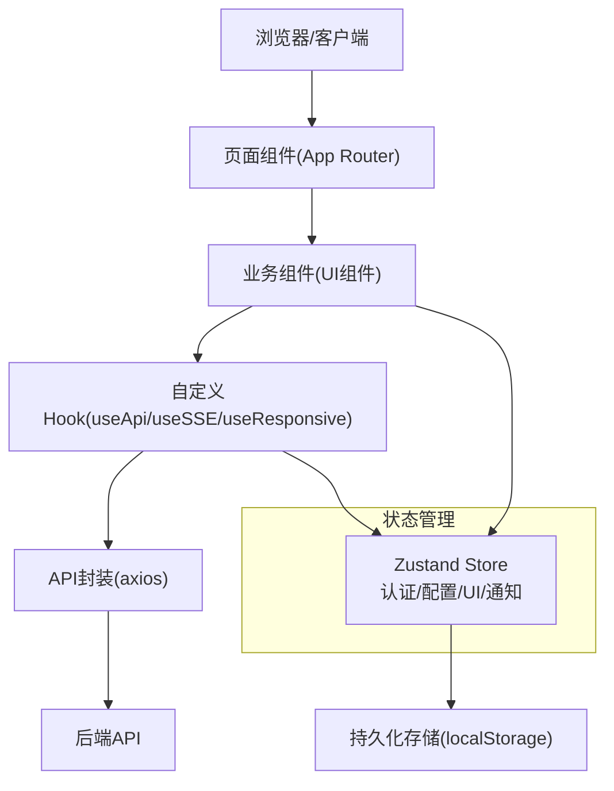
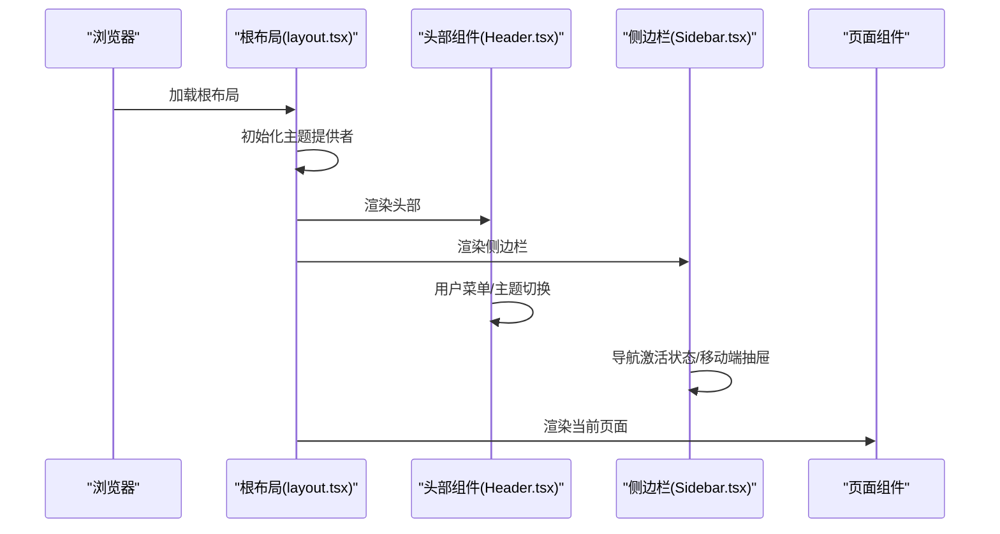
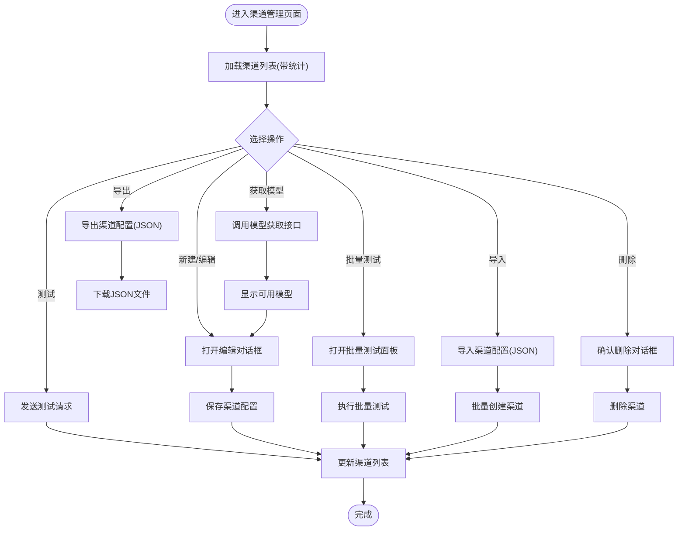
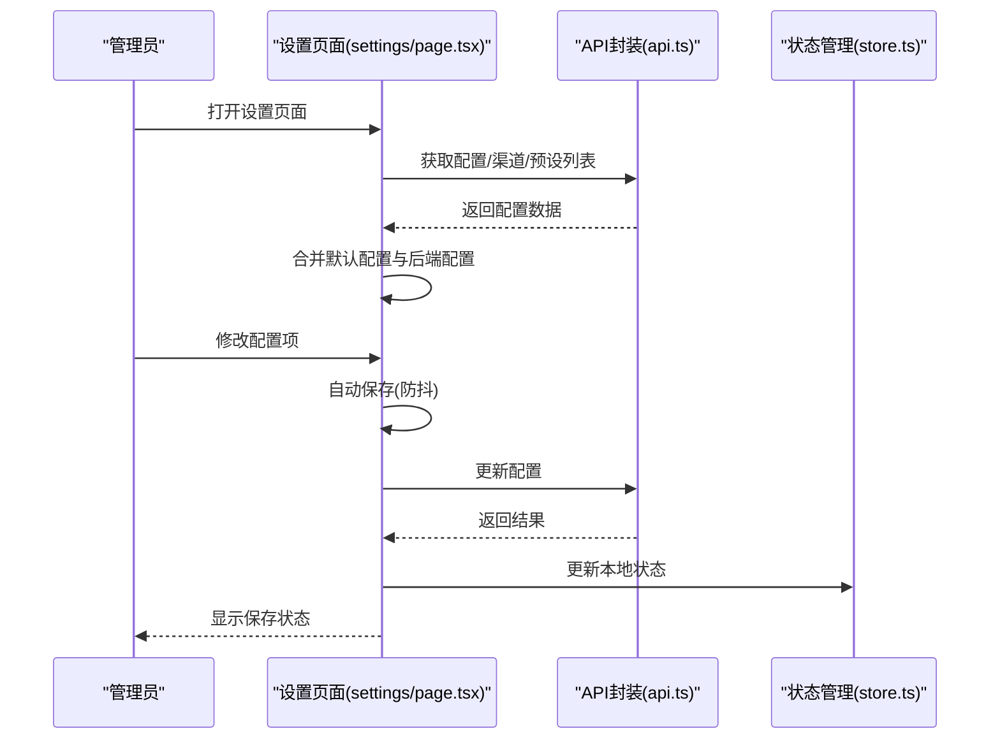
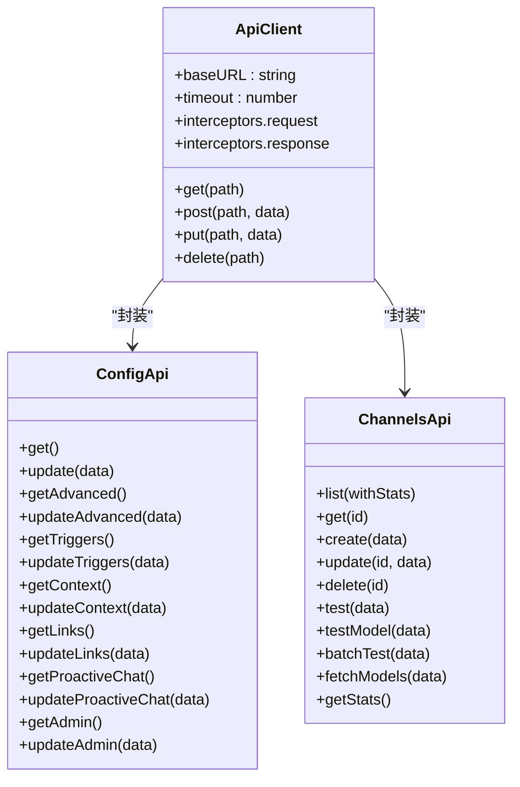
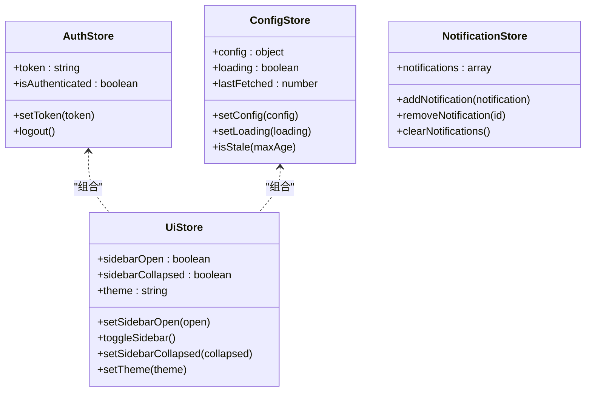
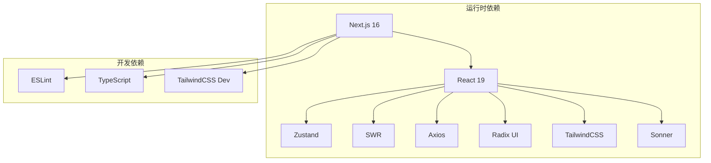

# Web 管理面板

<cite>
**本文档引用的文件**
- [package.json](file://frontend/package.json)
- [next.config.ts](file://frontend/next.config.ts)
- [layout.tsx](file://frontend/app/layout.tsx)
- [api.ts](file://frontend/lib/api.ts)
- [store.ts](file://frontend/lib/store.ts)
- [types.ts](file://frontend/lib/types.ts)
- [useApi.ts](file://frontend/lib/hooks/useApi.ts)
- [useSSE.ts](file://frontend/lib/hooks/useSSE.ts)
- [useResponsive.ts](file://frontend/lib/hooks/useResponsive.ts)
- [Header.tsx](file://frontend/components/layout/Header.tsx)
- [Sidebar.tsx](file://frontend/components/layout/Sidebar.tsx)
- [ApiKeyManager.tsx](file://frontend/components/channels/ApiKeyManager.tsx)
- [form.tsx](file://frontend/components/ui/form.tsx)
- [dialog.tsx](file://frontend/components/ui/dialog.tsx)
- [channels/page.tsx](file://frontend/app/(dashboard)/channels/page.tsx)
- [settings/page.tsx](file://frontend/app/(dashboard)/settings/page.tsx)
- [groups/[id]/page.tsx](file://frontend/app/(dashboard)/groups/[id]/page.tsx)
</cite>

## 目录
1. [简介](#简介)
2. [项目结构](#项目结构)
3. [核心组件](#核心组件)
4. [架构总览](#架构总览)
5. [详细组件分析](#详细组件分析)
6. [依赖关系分析](#依赖关系分析)
7. [性能考虑](#性能考虑)
8. [故障排除指南](#故障排除指南)
9. [结论](#结论)
10. [附录](#附录)

## 简介
本项目是一个基于 Next.js 16 和 React 19 的 Web 管理面板，用于管理 AI 插件的各项配置与功能。系统采用 TypeScript 开发，结合 Zustand 状态管理、SWR 数据缓存、Radix UI 组件库以及 TailwindCSS 样式框架，提供完整的前端架构与丰富的管理页面，涵盖基础配置、渠道管理、预设管理、工具管理、记忆管理、MCP 服务器管理、知识库管理、对话历史与统计数据等多个模块。

## 项目结构
前端项目位于 `frontend` 目录，采用 Next.js App Router 结构，核心目录组织如下：
- app：页面与路由层，包含仪表盘、设置、渠道、工具、MCP、知识库、记忆、统计、用户与群组管理等页面
- components：UI 组件与业务组件，包含布局、通用 UI、渠道相关组件等
- lib：核心逻辑封装，包括 API 封装、状态管理、Hook、类型定义等
- types：TypeScript 类型定义
- out：构建产物输出目录（静态导出）
- resources/web：构建后静态资源部署目录

```mermaid
graph TB
subgraph "应用层(App)"
Dashboard["仪表盘页面"]
Settings["设置页面"]
Channels["渠道管理页面"]
Tools["工具管理页面"]
MCP["MCP 服务器页面"]
Knowledge["知识库页面"]
Memory["记忆管理页面"]
Stats["统计数据页面"]
Users["用户管理页面"]
Groups["群组管理页面"]
end
subgraph "组件层(Components)"
Layout["布局组件<br/>Header/Sidebar"]
UI["通用UI组件<br/>Dialog/Form/Button等"]
ChannelsComp["渠道相关组件<br/>ApiKeyManager等"]
end
subgraph "逻辑层(Lib)"
API["API封装<br/>axios拦截器/接口定义"]
Store["状态管理<br/>Zustand Store"]
Hooks["自定义Hook<br/>useApi/useSSE/useResponsive"]
Types["类型定义<br/>TS类型"]
end
Dashboard --> Layout
Settings --> Layout
Channels --> Layout
Tools --> Layout
MCP --> Layout
Knowledge --> Layout
Memory --> Layout
Stats --> Layout
Users --> Layout
Groups --> Layout
Dashboard --> UI
Settings --> UI
Channels --> UI
Tools --> UI
MCP --> UI
Knowledge --> UI
Memory --> UI
Stats --> UI
Users --> UI
Groups --> UI
Dashboard --> ChannelsComp
Channels --> ChannelsComp
Dashboard --> API
Settings --> API
Channels --> API
Tools --> API
MCP --> API
Knowledge --> API
Memory --> API
Stats --> API
Users --> API
Groups --> API
Dashboard --> Store
Settings --> Store
Channels --> Store
Tools --> Store
MCP --> Store
Knowledge --> Store
Memory --> Store
Stats --> Store
Users --> Store
Groups --> Store
Dashboard --> Hooks
Settings --> Hooks
Channels --> Hooks
Tools --> Hooks
MCP --> Hooks
Knowledge --> Hooks
Memory --> Hooks
Stats --> Hooks
Users --> Hooks
Groups --> Hooks
```

**图表来源**
- [layout.tsx](file://frontend/app/layout.tsx#L1-L27)
- [Header.tsx](file://frontend/components/layout/Header.tsx#L1-L131)
- [Sidebar.tsx](file://frontend/components/layout/Sidebar.tsx#L1-L321)
- [api.ts](file://frontend/lib/api.ts#L1-L473)
- [store.ts](file://frontend/lib/store.ts#L1-L116)
- [useApi.ts](file://frontend/lib/hooks/useApi.ts#L1-L448)
- [useSSE.ts](file://frontend/lib/hooks/useSSE.ts#L1-L200)
- [useResponsive.ts](file://frontend/lib/hooks/useResponsive.ts#L1-L295)

**章节来源**
- [package.json](file://frontend/package.json#L1-L66)
- [next.config.ts](file://frontend/next.config.ts#L1-L26)
- [layout.tsx](file://frontend/app/layout.tsx#L1-L27)

## 核心组件
本项目的核心组件围绕以下方面构建：

- 页面路由与布局
  - 根布局负责主题提供者、全局样式与通知组件
  - 仪表盘与各功能页面通过 App Router 组织，支持嵌套路由与动态参数
  - 响应式布局在移动端与桌面端提供不同交互体验

- 状态管理
  - 使用 Zustand 管理认证状态、配置缓存、UI 状态与通知
  - 支持持久化存储，提升用户体验

- API 封装
  - 基于 axios 构建统一 API 客户端，包含请求拦截器与响应拦截器
  - 统一封装认证令牌注入、错误处理与业务错误码解析
  - 提供频道、配置、工具、MCP、知识库、记忆、统计等模块化的 API 接口

- 自定义 Hook
  - useApi：通用请求 Hook，支持加载状态、错误处理、重试、防抖、分页等
  - useSSE：服务端事件连接，支持自动重连与事件监听
  - useResponsive：响应式断点检测，解决 SSR 水合问题

- UI 组件
  - 基于 Radix UI 与 TailwindCSS 构建，提供表单、对话框、标签、按钮、表格等通用组件
  - 支持无障碍访问与主题切换

**章节来源**
- [store.ts](file://frontend/lib/store.ts#L1-L116)
- [api.ts](file://frontend/lib/api.ts#L1-L473)
- [useApi.ts](file://frontend/lib/hooks/useApi.ts#L1-L448)
- [useSSE.ts](file://frontend/lib/hooks/useSSE.ts#L1-L200)
- [useResponsive.ts](file://frontend/lib/hooks/useResponsive.ts#L1-L295)
- [form.tsx](file://frontend/components/ui/form.tsx#L1-L139)
- [dialog.tsx](file://frontend/components/ui/dialog.tsx#L1-L124)

## 架构总览
系统采用分层架构，清晰分离关注点：

- 表现层（Pages/Components）
  - 页面组件负责数据展示与用户交互
  - 业务组件封装复杂交互逻辑（如渠道管理、表单校验）

- 逻辑层（Lib）
  - API 封装：统一请求与响应处理
  - 状态管理：集中管理认证、配置与 UI 状态
  - Hook：复用业务逻辑与副作用处理

- 基础设施层（Next.js/React）
  - App Router：路由与页面组织
  - SSR/CSR：服务端渲染与客户端水合
  - 构建优化：静态导出、压缩与生产优化

**图表来源**
- [channels/page.tsx](file://frontend/app/(dashboard)/channels/page.tsx#L1-L800)
- [settings/page.tsx](file://frontend/app/(dashboard)/settings/page.tsx#L1-L800)
- [ApiKeyManager.tsx](file://frontend/components/channels/ApiKeyManager.tsx#L1-L456)
- [api.ts](file://frontend/lib/api.ts#L1-L473)
- [store.ts](file://frontend/lib/store.ts#L1-L116)

## 详细组件分析

### 页面路由与布局
- 根布局负责主题提供者、全局样式与通知组件，确保一致的视觉与交互体验
- 侧边栏与头部组件提供导航与用户操作入口，支持移动端抽屉式导航
- 响应式 Hook 解决 SSR 水合差异，提供断点检测与设备类型判断

**图表来源**
- [layout.tsx](file://frontend/app/layout.tsx#L1-L27)
- [Header.tsx](file://frontend/components/layout/Header.tsx#L1-L131)
- [Sidebar.tsx](file://frontend/components/layout/Sidebar.tsx#L1-L321)

**章节来源**
- [layout.tsx](file://frontend/app/layout.tsx#L1-L27)
- [Header.tsx](file://frontend/components/layout/Header.tsx#L1-L131)
- [Sidebar.tsx](file://frontend/components/layout/Sidebar.tsx#L1-L321)
- [useResponsive.ts](file://frontend/lib/hooks/useResponsive.ts#L1-L295)

### 渠道管理页面
- 支持渠道的增删改查、批量测试、模型获取与导出导入
- 多 API Key 管理与轮询策略配置
- 高级配置（流式传输、思考模式、LLM 参数、图片处理等）

**图表来源**
- [channels/page.tsx](file://frontend/app/(dashboard)/channels/page.tsx#L1-L800)
- [ApiKeyManager.tsx](file://frontend/components/channels/ApiKeyManager.tsx#L1-L456)
- [api.ts](file://frontend/lib/api.ts#L52-L64)

**章节来源**
- [channels/page.tsx](file://frontend/app/(dashboard)/channels/page.tsx#L1-L800)
- [ApiKeyManager.tsx](file://frontend/components/channels/ApiKeyManager.tsx#L1-L456)

### 设置页面
- 分类配置：触发、基础、管理、模型、伪人、工具、思考、高级等
- 自动保存与手动保存机制
- 模型选择器与可用模型获取
- 前缀人格与触发词配置

**图表来源**
- [settings/page.tsx](file://frontend/app/(dashboard)/settings/page.tsx#L1-L800)
- [api.ts](file://frontend/lib/api.ts#L30-L51)
- [store.ts](file://frontend/lib/store.ts#L1-L116)

**章节来源**
- [settings/page.tsx](file://frontend/app/(dashboard)/settings/page.tsx#L1-L800)
- [api.ts](file://frontend/lib/api.ts#L30-L51)

### 群组管理页面
- 支持群组的新增、编辑与删除
- 静态参数生成，支持动态路由参数

**章节来源**
- [groups/[id]/page.tsx](file://frontend/app/(dashboard)/groups/[id]/page.tsx#L1-L12)

### API 封装与错误处理
- 统一的 axios 实例，包含请求头注入与响应数据提取
- 401 未授权自动跳转登录
- 业务错误码解析与用户提示
- 模块化 API 定义：配置、渠道、对话、预设、知识库、工具、MCP、内存、作用域、系统、代理、日志、占位符、统计、图片生成、技能代理等

**图表来源**
- [api.ts](file://frontend/lib/api.ts#L1-L473)

**章节来源**
- [api.ts](file://frontend/lib/api.ts#L1-L473)

### 状态管理与 Hook
- Zustand Store：认证状态、配置缓存、UI 状态、通知管理
- useApi Hook：统一请求处理、错误码映射、重试与防抖
- useSSE Hook：服务端事件连接与自动重连
- useResponsive Hook：响应式断点检测与 SSR 水合

**图表来源**
- [store.ts](file://frontend/lib/store.ts#L1-L116)

**章节来源**
- [store.ts](file://frontend/lib/store.ts#L1-L116)
- [useApi.ts](file://frontend/lib/hooks/useApi.ts#L1-L448)
- [useSSE.ts](file://frontend/lib/hooks/useSSE.ts#L1-L200)
- [useResponsive.ts](file://frontend/lib/hooks/useResponsive.ts#L1-L295)

## 依赖关系分析
- 构建与运行时依赖
  - Next.js 16、React 19、TypeScript
  - Radix UI 组件库、Lucide React 图标
  - Zustand 状态管理、SWR 数据缓存、Axios HTTP 客户端
  - TailwindCSS 样式框架、Sonner 通知组件

- 构建配置
  - 静态导出输出、去除 console 控制台、CSS 优化、压缩等
  - 生产环境移除部分控制台日志，提升安全性

**图表来源**
- [package.json](file://frontend/package.json#L1-L66)
- [next.config.ts](file://frontend/next.config.ts#L1-L26)

**章节来源**
- [package.json](file://frontend/package.json#L1-L66)
- [next.config.ts](file://frontend/next.config.ts#L1-L26)

## 性能考虑
- 构建优化
  - 静态导出输出，减少运行时开销
  - CSS 优化与压缩，提升首屏渲染速度
  - 生产环境移除控制台日志，降低包体积
- 状态管理
  - Zustand 持久化存储，减少重复请求
  - SWR 缓存策略，提升数据访问效率
- 响应式设计
  - 使用断点检测与条件渲染，优化移动端性能
  - 滚动区域与虚拟化组件，减少 DOM 节点数量
- 网络请求
  - 请求拦截器统一处理认证与错误
  - 防抖与重试机制，平衡用户体验与服务器压力

## 故障排除指南
- 认证与登录
  - 401 未授权：自动清除本地令牌并跳转登录页
  - 令牌过期：提示重新登录
- 网络与超时
  - 网络错误：检查网络连接与代理设置
  - 请求超时：适当增加超时时间或重试
- 渠道配置
  - API Key 无效：检查 Key 格式与权限
  - 模型不可用：确认模型名称与渠道支持情况
- SSE 连接
  - 连接失败：检查令牌与后端服务状态
  - 自动重连：指数退避策略，避免频繁重试

**章节来源**
- [api.ts](file://frontend/lib/api.ts#L11-L29)
- [useApi.ts](file://frontend/lib/hooks/useApi.ts#L28-L154)
- [useSSE.ts](file://frontend/lib/hooks/useSSE.ts#L1-L200)

## 结论
本 Web 管理面板通过清晰的分层架构与模块化设计，提供了完整的 AI 插件管理能力。基于 Next.js 16 与 React 19 的现代前端技术栈，结合 Zustand、SWR、Radix UI 等优秀生态，实现了高性能、可维护、易扩展的管理界面。通过统一的 API 封装与完善的错误处理机制，确保了系统的稳定性与用户体验。

## 附录

### 开发环境搭建
- 安装依赖：使用包管理器安装项目依赖
- 启动开发服务器：运行开发脚本启动本地服务
- 代码检查：使用 ESLint 进行代码质量检查
- 构建与导出：支持静态导出，便于部署到静态托管平台

**章节来源**
- [package.json](file://frontend/package.json#L5-L11)

### 组件开发指南
- 使用 Radix UI 组件与 TailwindCSS 样式
- 通过自定义 Hook 复用业务逻辑
- 遵循响应式设计原则，适配移动端与桌面端
- 使用表单组件与校验库确保数据一致性

**章节来源**
- [form.tsx](file://frontend/components/ui/form.tsx#L1-L139)
- [dialog.tsx](file://frontend/components/ui/dialog.tsx#L1-L124)
- [useResponsive.ts](file://frontend/lib/hooks/useResponsive.ts#L1-L295)

### 部署注意事项
- 构建配置：确保静态导出与输出目录正确
- 环境变量：配置 API 基础地址与令牌相关设置
- 静态资源：将构建产物部署到静态托管平台
- 安全性：生产环境移除控制台日志，保护敏感信息

**章节来源**
- [next.config.ts](file://frontend/next.config.ts#L1-L26)
- [layout.tsx](file://frontend/app/layout.tsx#L1-L27)