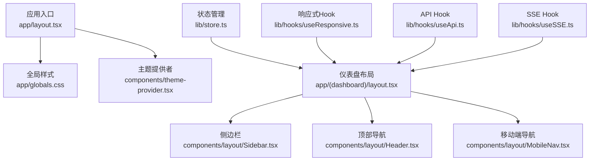
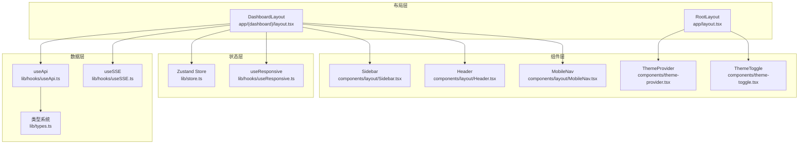
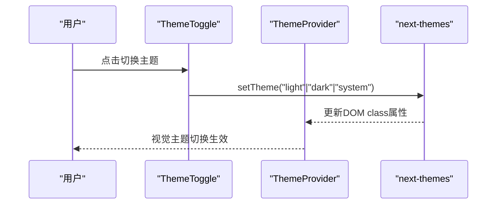
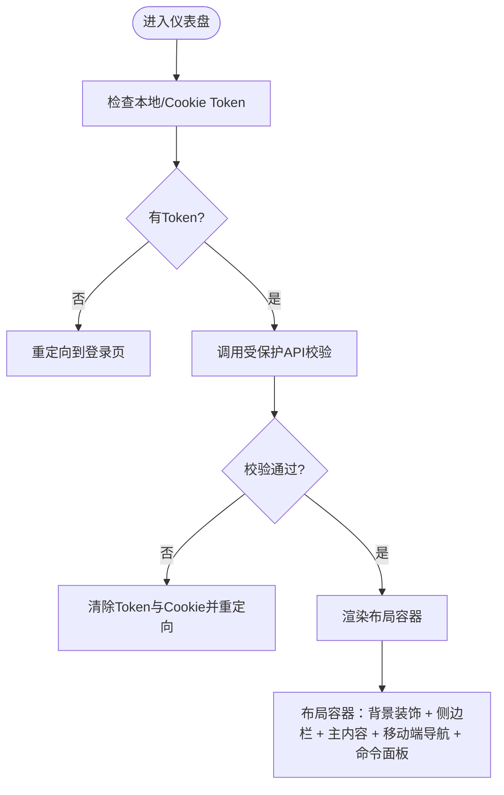
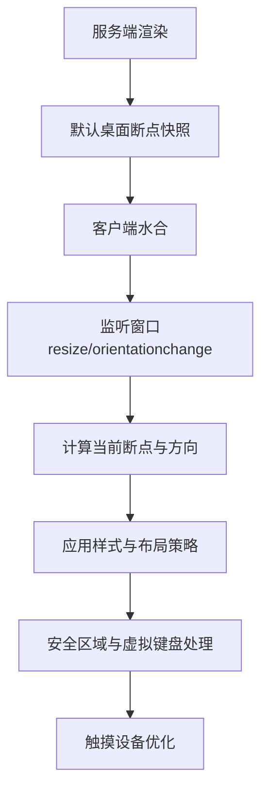
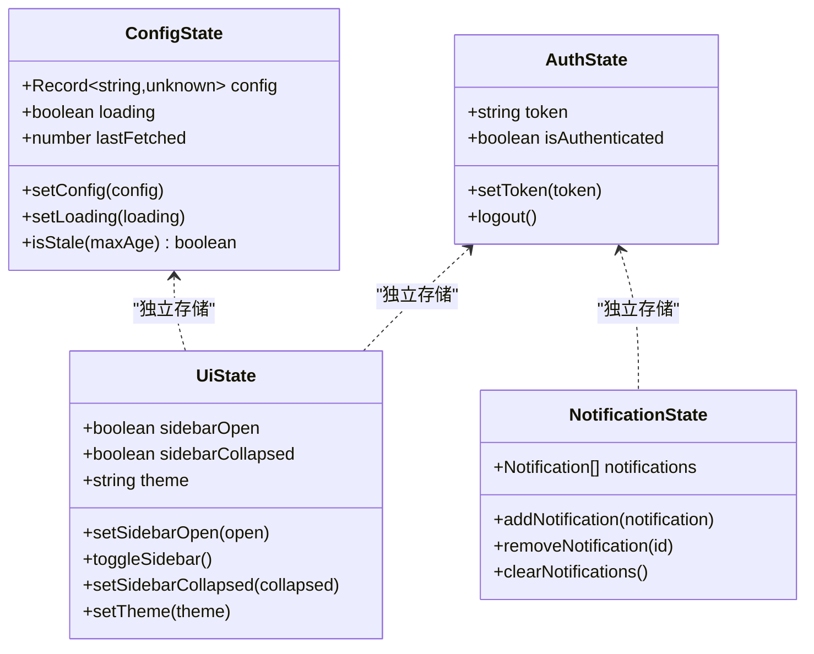
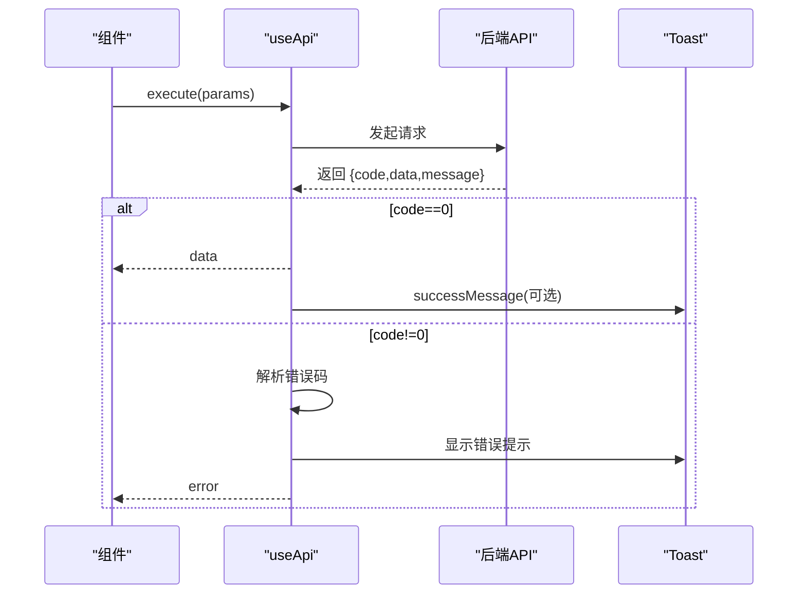
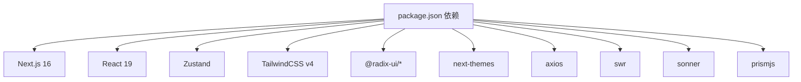

# 前端架构设计

## 目录
1. [引言](#引言)
2. [项目结构](#项目结构)
3. [核心组件](#核心组件)
4. [架构总览](#架构总览)
5. [详细组件分析](#详细组件分析)
6. [依赖关系分析](#依赖关系分析)
7. [性能考虑](#性能考虑)
8. [故障排除指南](#故障排除指南)
9. [结论](#结论)
10. [附录](#附录)

## 引言
本文件面向基于 Next.js 16 与 React 19 的前端架构设计，系统梳理应用布局结构、主题系统、导航组件设计与响应式布局策略；解释页面路由组织、组件层次结构与状态管理模式；文档化主题切换机制、移动端适配方案与用户体验优化策略；并提供组件设计原则、样式系统与性能优化措施，以及前端开发环境配置、构建流程与部署策略的技术细节。

## 项目结构
前端采用 Next.js App Router 的目录结构，核心位于 frontend/app 与 frontend/components 两个根目录：
- 应用入口与全局样式：app/layout.tsx、app/globals.css
- 页面与路由：app/(dashboard)/... 下的页面与嵌套路由
- 布局组件：components/layout/*
- UI 组件库：components/ui/*
- 状态与工具：lib/store.ts、lib/hooks/*、lib/utils.ts、lib/types.ts
- 构建与运行：next.config.ts、package.json

**图表来源**
- [app/layout.tsx](file://frontend/app/layout.tsx#L1-L27)
- [components/theme-provider.tsx](file://frontend/components/theme-provider.tsx#L1-L9)
- [app/(dashboard)/layout.tsx](file://frontend/app/(dashboard)/layout.tsx#L1-L111)
- [components/layout/Sidebar.tsx](file://frontend/components/layout/Sidebar.tsx#L1-L321)
- [components/layout/Header.tsx](file://frontend/components/layout/Header.tsx#L1-L131)
- [components/layout/MobileNav.tsx](file://frontend/components/layout/MobileNav.tsx#L1-L111)
- [lib/store.ts](file://frontend/lib/store.ts#L1-L116)
- [lib/hooks/useResponsive.ts](file://frontend/lib/hooks/useResponsive.ts#L1-L295)
- [lib/hooks/useApi.ts](file://frontend/lib/hooks/useApi.ts#L1-L448)
- [lib/hooks/useSSE.ts](file://frontend/lib/hooks/useSSE.ts#L1-L200)

**章节来源**
- [package.json](file://frontend/package.json#L1-L66)
- [next.config.ts](file://frontend/next.config.ts#L1-L26)

## 核心组件
- 主题系统：通过 next-themes 提供主题切换与系统跟随，支持浅色/深色/系统三种模式。
- 布局系统：仪表盘布局负责认证校验、侧边栏与移动端导航、命令面板集成。
- 导航组件：侧边栏支持分组折叠、高亮与前缀匹配；移动端底部导航提供快速跳转。
- 响应式系统：统一断点与媒体查询 Hook，解决 SSR 水合问题，提供安全区域、虚拟键盘检测等。
- 状态管理：Zustand Store 管理认证、UI 状态与通知，持久化存储 UI 偏好。
- 数据访问：统一 API Hook 封装加载、错误、重试、防抖与分页；SSE Hook 管理服务端事件流。
- 类型系统：集中定义渠道、群组配置、表单状态等类型，确保前后端契约一致。
- 工具函数：类名合并、UUID 生成等通用工具。

**章节来源**
- [components/theme-provider.tsx](file://frontend/components/theme-provider.tsx#L1-L9)
- [components/theme-toggle.tsx](file://frontend/components/theme-toggle.tsx#L1-L28)
- [app/(dashboard)/layout.tsx](file://frontend/app/(dashboard)/layout.tsx#L1-L111)
- [components/layout/Sidebar.tsx](file://frontend/components/layout/Sidebar.tsx#L1-L321)
- [components/layout/Header.tsx](file://frontend/components/layout/Header.tsx#L1-L131)
- [components/layout/MobileNav.tsx](file://frontend/components/layout/MobileNav.tsx#L1-L111)
- [lib/hooks/useResponsive.ts](file://frontend/lib/hooks/useResponsive.ts#L1-L295)
- [lib/store.ts](file://frontend/lib/store.ts#L1-L116)
- [lib/hooks/useApi.ts](file://frontend/lib/hooks/useApi.ts#L1-L448)
- [lib/hooks/useSSE.ts](file://frontend/lib/hooks/useSSE.ts#L1-L200)
- [lib/types.ts](file://frontend/lib/types.ts#L1-L275)
- [lib/utils.ts](file://frontend/lib/utils.ts#L1-L21)

## 架构总览
整体采用“布局-组件-状态-数据”分层：
- 布局层：RootLayout 提供主题与全局通知；DashboardLayout 负责认证与容器布局。
- 组件层：UI 组件库与业务组件分离，布局组件复用性强。
- 状态层：Zustand Store 分离认证、UI、通知三类状态，持久化 UI 偏好。
- 数据层：useApi 统一封装请求流程；useSSE 管理实时事件；类型系统保障契约。

**图表来源**
- [app/layout.tsx](file://frontend/app/layout.tsx#L1-L27)
- [app/(dashboard)/layout.tsx](file://frontend/app/(dashboard)/layout.tsx#L1-L111)
- [components/layout/Sidebar.tsx](file://frontend/components/layout/Sidebar.tsx#L1-L321)
- [components/layout/Header.tsx](file://frontend/components/layout/Header.tsx#L1-L131)
- [components/layout/MobileNav.tsx](file://frontend/components/layout/MobileNav.tsx#L1-L111)
- [components/theme-provider.tsx](file://frontend/components/theme-provider.tsx#L1-L9)
- [components/theme-toggle.tsx](file://frontend/components/theme-toggle.tsx#L1-L28)
- [lib/store.ts](file://frontend/lib/store.ts#L1-L116)
- [lib/hooks/useResponsive.ts](file://frontend/lib/hooks/useResponsive.ts#L1-L295)
- [lib/hooks/useApi.ts](file://frontend/lib/hooks/useApi.ts#L1-L448)
- [lib/hooks/useSSE.ts](file://frontend/lib/hooks/useSSE.ts#L1-L200)
- [lib/types.ts](file://frontend/lib/types.ts#L1-L275)

## 详细组件分析

### 主题系统与切换机制
- 主题提供：RootLayout 包裹 ThemeProvider，attribute="class"，defaultTheme="system"，enableSystem，禁用过渡水合。
- 主题切换：ThemeToggle 提供下拉菜单切换 light/dark/system。
- 主题持久化：next-themes 内部处理系统偏好与本地存储同步。

**图表来源**
- [app/layout.tsx](file://frontend/app/layout.tsx#L17-L22)
- [components/theme-provider.tsx](file://frontend/components/theme-provider.tsx#L1-L9)
- [components/theme-toggle.tsx](file://frontend/components/theme-toggle.tsx#L1-L28)

**章节来源**
- [app/layout.tsx](file://frontend/app/layout.tsx#L1-L27)
- [components/theme-provider.tsx](file://frontend/components/theme-provider.tsx#L1-L9)
- [components/theme-toggle.tsx](file://frontend/components/theme-toggle.tsx#L1-L28)

### 布局与导航组件设计
- DashboardLayout：负责认证校验（URL auth_token 同步、localStorage/cookie 读取、受保护 API 校验）、加载态、主容器与背景装饰、移动端导航与命令面板集成。
- Header：移动端显示菜单按钮与搜索图标，桌面端显示搜索按钮与快捷键提示；右侧集成主题切换与用户下拉菜单。
- Sidebar：分组导航（Overview、Config、AI、Data、Users），支持分组展开/折叠、激活态高亮、精确/前缀匹配；桌面端固定侧栏，移动端使用 Sheet。
- MobileNav：底部导航，移动端常驻，提供首页、渠道、工具、统计四类入口，支持“更多”打开侧边栏。

**图表来源**
- [app/(dashboard)/layout.tsx](file://frontend/app/(dashboard)/layout.tsx#L20-L61)
- [components/layout/Header.tsx](file://frontend/components/layout/Header.tsx#L23-L131)
- [components/layout/Sidebar.tsx](file://frontend/components/layout/Sidebar.tsx#L52-L126)
- [components/layout/MobileNav.tsx](file://frontend/components/layout/MobileNav.tsx#L51-L111)

**章节来源**
- [app/(dashboard)/layout.tsx](file://frontend/app/(dashboard)/layout.tsx#L1-L111)
- [components/layout/Header.tsx](file://frontend/components/layout/Header.tsx#L1-L131)
- [components/layout/Sidebar.tsx](file://frontend/components/layout/Sidebar.tsx#L1-L321)
- [components/layout/MobileNav.tsx](file://frontend/components/layout/MobileNav.tsx#L1-L111)

### 响应式布局策略与移动端适配
- 断点与媒体查询：useResponsive 提供 xs/sm/md/lg/xl/2xl 断点，useMediaQuery/useIsMobile/useIsDesktop/useIsTablet 等便捷 Hook；使用 useSyncExternalStore 解决 SSR 水合闪烁。
- 安全区域与虚拟键盘：useSafeArea/useVirtualKeyboard 检测安全边距与虚拟键盘高度，移动端底部导航与内容区动态留白。
- 触摸设备优化：针对 hover/pointer 为 coarse 的设备，禁用悬停动画，增大触摸目标，启用 active 缩放反馈。
- 移动端导航：MobileNav 固定底部，配合 Sheet 侧栏，提供“更多”入口。

**图表来源**
- [lib/hooks/useResponsive.ts](file://frontend/lib/hooks/useResponsive.ts#L51-L101)
- [lib/hooks/useResponsive.ts](file://frontend/lib/hooks/useResponsive.ts#L106-L147)
- [lib/hooks/useResponsive.ts](file://frontend/lib/hooks/useResponsive.ts#L170-L197)
- [lib/hooks/useResponsive.ts](file://frontend/lib/hooks/useResponsive.ts#L249-L271)

**章节来源**
- [lib/hooks/useResponsive.ts](file://frontend/lib/hooks/useResponsive.ts#L1-L295)
- [app/globals.css](file://frontend/app/globals.css#L687-L734)

### 状态管理模式
- 认证状态：token、isAuthenticated，支持 setToken/logout，持久化存储 chatai-auth。
- UI 状态：sidebarOpen/sidebarCollapsed/theme，持久化存储 chatai-ui（仅部分字段）。
- 通知状态：notifications 数组，支持添加、移除、清空与自动过期。
- 配置状态：config/loading/lastFetched/isStale(maxAge)，用于缓存控制。

**图表来源**
- [lib/store.ts](file://frontend/lib/store.ts#L4-L26)
- [lib/store.ts](file://frontend/lib/store.ts#L50-L79)
- [lib/store.ts](file://frontend/lib/store.ts#L82-L116)

**章节来源**
- [lib/store.ts](file://frontend/lib/store.ts#L1-L116)

### 页面路由组织与组件层次结构
- App Router 结构：app/(dashboard)/... 作为受保护区域，app/(dashboard)/layout.tsx 作为共享布局；各页面按功能模块组织（channels、conversations、groups、history、imagegen、knowledge、mcp、memory、presets、scope、settings、stats、tools、users）。
- 嵌套路由：如 groups/[id]/editor.tsx、knowledge/[id]/editor.tsx，支持动态参数与编辑器组件。
- 登录流程：/login/token/page.tsx 处理后端重定向携带的 auth_token，写入 localStorage 并清理 URL 参数。

**章节来源**
- [app/(dashboard)/layout.tsx](file://frontend/app/(dashboard)/layout.tsx#L1-L111)

### 数据访问与实时通信
- useApi：封装加载、错误、重试、防抖、分页、成功提示与回调；统一错误码 ErrorCode 与中文映射 errorMessages。
- useSSE：管理 EventSource 连接、自动重连（指数退避）、事件监听（connected/heartbeat/tool-* 等）、状态机与事件队列；自动注入 token 与 withCredentials。
- 类型系统：IndependentChannel、Channel、Preset、GroupConfig、GroupFormState 等，确保前后端契约一致。

**图表来源**
- [lib/hooks/useApi.ts](file://frontend/lib/hooks/useApi.ts#L184-L350)

**章节来源**
- [lib/hooks/useApi.ts](file://frontend/lib/hooks/useApi.ts#L1-L448)
- [lib/hooks/useSSE.ts](file://frontend/lib/hooks/useSSE.ts#L1-L200)
- [lib/types.ts](file://frontend/lib/types.ts#L1-L275)

### 样式系统与组件设计原则
- Tailwind CSS v4：使用 @theme inline 定义 CSS 变量，支持 oklch 色彩空间与暗色主题变量覆盖。
- Glass 效果：glass-card、glass-panel、glass-sidebar 提供毛玻璃背景与模糊效果。
- 动画与过渡：fade-in、slide-in、shimmer、pulse-soft 等动画类，统一过渡节奏。
- 移动端优化：安全区域变量、移动端导航高度、触摸目标增大、滚动优化、表单字体大小调整。
- 组件设计原则：语义化标签、无障碍支持（aria-*）、响应式断点、触摸友好、GPU 加速与回流优化。

**章节来源**
- [app/globals.css](file://frontend/app/globals.css#L1-L800)
- [lib/utils.ts](file://frontend/lib/utils.ts#L1-L21)

## 依赖关系分析
- Next.js 16 与 React 19：使用 App Router 与客户端组件特性。
- UI 与设计系统：Radix UI 组件库与自研 UI 组件集合，统一风格与交互。
- 状态管理：Zustand 简化状态逻辑，结合持久化中间件。
- 样式：Tailwind CSS + 自定义动画与变量，支持暗色主题。
- 实时通信：原生 EventSource 与 useSSE Hook。
- 开发工具：ESLint、TypeScript、PostCSS/TailwindCSS v4。

**图表来源**
- [package.json](file://frontend/package.json#L13-L52)

**章节来源**
- [package.json](file://frontend/package.json#L1-L66)

## 性能考虑
- 构建优化：next.config.ts 启用 optimizeCss、removeConsole、compress、reactStrictMode、poweredByHeader 关闭、trailingSlash、images.unoptimized、distDir='out'、output='export'。
- 打包与体积：生产环境移除 console.warn/error，压缩输出，CSS 优化。
- 运行时优化：useSyncExternalStore 解决 SSR 水合闪烁；useResponsive 预设桌面断点；useScrollLock 在弹窗时锁定滚动；GPU 加速类与回流优化。
- 网络与缓存：useApi 支持防抖、重试、缓存失效控制；useSSE 自动重连与事件队列；SWR 可选集成（package.json 存在）。
- 移动端体验：触摸目标增大、滚动优化、安全区域处理、虚拟键盘检测。

**章节来源**
- [next.config.ts](file://frontend/next.config.ts#L1-L26)
- [lib/hooks/useResponsive.ts](file://frontend/lib/hooks/useResponsive.ts#L39-L45)
- [lib/hooks/useApi.ts](file://frontend/lib/hooks/useApi.ts#L184-L350)
- [lib/hooks/useSSE.ts](file://frontend/lib/hooks/useSSE.ts#L49-L87)

## 故障排除指南
- 主题切换无效：确认 ThemeProvider attribute="class" 且未被覆盖；检查系统主题与本地存储一致性。
- 认证失败重定向：DashboardLayout 校验失败会清除 token 与 cookie 并重定向登录；检查受保护 API 返回与网络状态。
- 响应式异常：useSyncExternalStore 需要在客户端运行；SSR 期间使用默认桌面断点快照，确保水合后断点正确。
- SSE 连接失败：检查 token 注入、withCredentials、自动重连参数与事件类型监听；查看 reconnectCount 与 status。
- 移动端滚动穿透：使用 useScrollLock 锁定 body；注意水印恢复 scrollY。
- 构建产物路径：output='export' 生成静态站点，distDir='out'；导出脚本会复制到 ../resources/web。

**章节来源**
- [app/(dashboard)/layout.tsx](file://frontend/app/(dashboard)/layout.tsx#L48-L61)
- [lib/hooks/useSSE.ts](file://frontend/lib/hooks/useSSE.ts#L72-L87)
- [lib/hooks/useResponsive.ts](file://frontend/lib/hooks/useResponsive.ts#L224-L244)
- [next.config.ts](file://frontend/next.config.ts#L5-L10)

## 结论
该前端架构以 Next.js 16 与 React 19 为基础，采用 App Router 与客户端组件，结合 Zustand 状态管理、统一 API 与 SSE Hook、完善的响应式与移动端适配，形成清晰的布局-组件-状态-数据分层。通过 Tailwind CSS v4 与 oklch 色彩系统，提供高质量的主题体验与视觉一致性。构建配置优化与运行时性能策略共同保障了良好的用户体验与可维护性。

## 附录

### 开发环境配置
- 依赖安装：npm install 或 yarn install
- 开发启动：npm run dev
- 生产构建：npm run build
- 启动服务：npm run start
- 代码检查：npm run lint
- 导出静态站点：npm run export（生成 ../resources/web）

**章节来源**
- [package.json](file://frontend/package.json#L5-L11)

### 构建流程与部署策略
- 构建配置：next.config.ts 设置 output='export'、distDir='out'、images.unoptimized、optimizeCss、removeConsole、compress、reactStrictMode。
- 部署策略：静态导出至 out 目录，复制到 ../resources/web；适用于静态托管或嵌入后端资源目录。

**章节来源**
- [next.config.ts](file://frontend/next.config.ts#L1-L26)
- [package.json](file://frontend/package.json#L10-L11)
