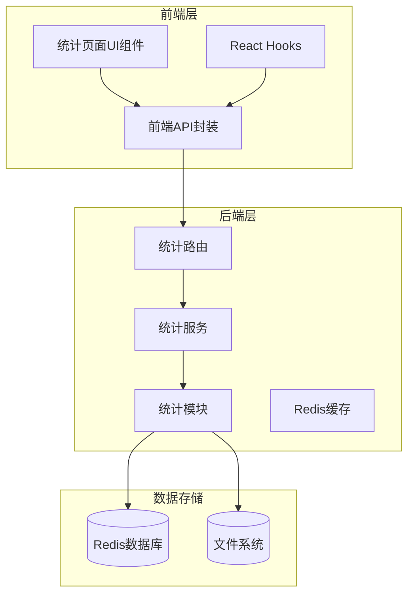
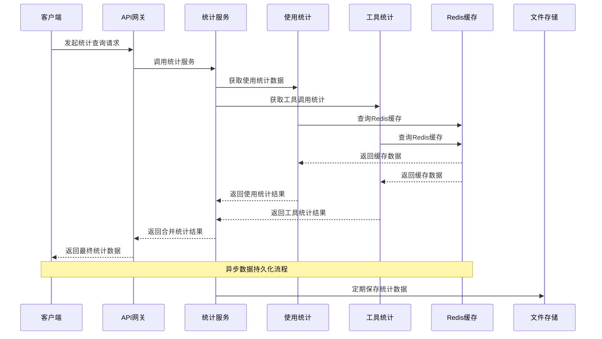
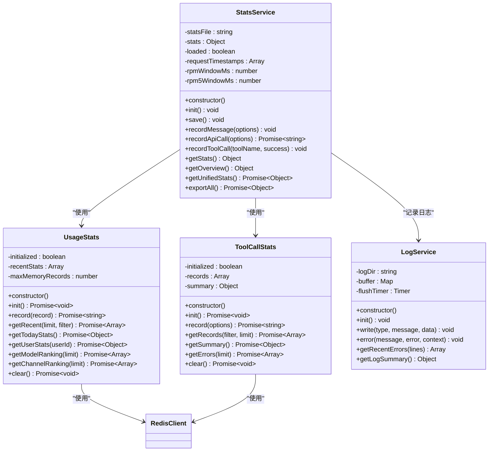
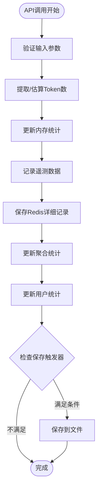
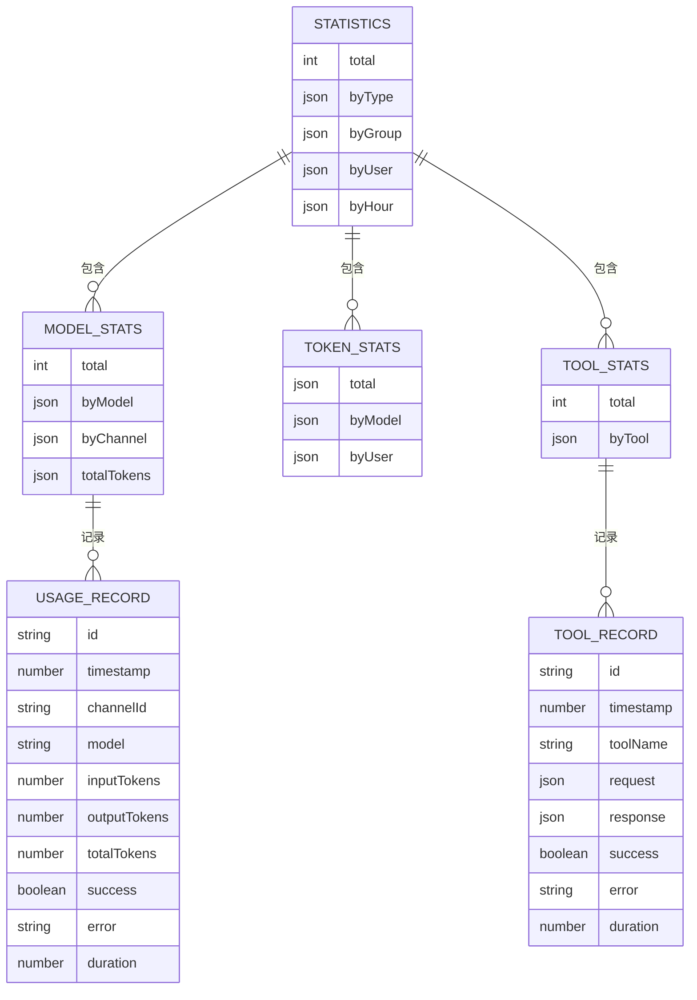
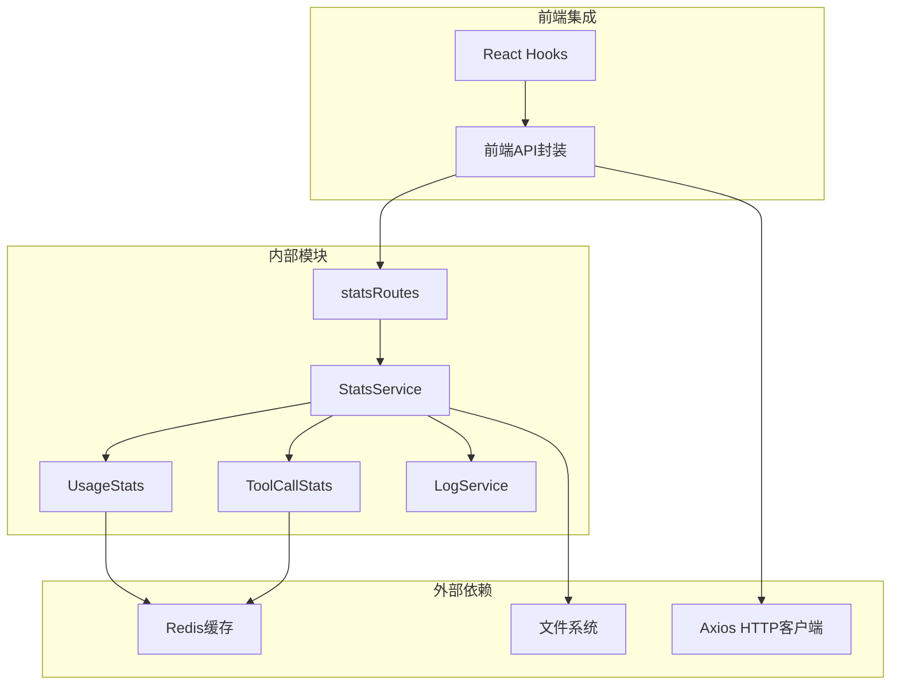

# 历史统计页面

<cite>
**本文档引用的文件**
- [StatsService.js](file://src/services/stats/StatsService.js)
- [UsageStats.js](file://src/services/stats/UsageStats.js)
- [ToolCallStats.js](file://src/services/stats/ToolCallStats.js)
- [LogService.js](file://src/services/stats/LogService.js)
- [statsRoutes.js](file://src/services/routes/statsRoutes.js)
- [api.ts](file://frontend/lib/api.ts)
- [statsApi](file://frontend/lib/api.ts)
- [usageStatsApi](file://frontend/lib/api.ts)
</cite>

## 目录
1. [简介](#简介)
2. [项目结构](#项目结构)
3. [核心组件](#核心组件)
4. [架构概览](#架构概览)
5. [详细组件分析](#详细组件分析)
6. [依赖关系分析](#依赖关系分析)
7. [性能考虑](#性能考虑)
8. [故障排除指南](#故障排除指南)
9. [结论](#结论)

## 简介

历史统计页面是ChatGPT插件管理系统中的核心功能模块，负责提供全面的历史使用数据查询、分析和可视化展示。该系统通过多维度的数据收集和统计分析，帮助管理员和用户深入了解AI工具的使用情况、性能表现和资源消耗。

系统主要涵盖以下核心功能：
- 使用量统计的时间维度分析
- 用户行为模式识别
- 工具调用频率监控
- 性能指标实时监控
- 数据生成机制和图表展示
- 报表导出功能
- 趋势分析和异常检测
- 性能优化建议

## 项目结构

历史统计页面采用前后端分离的架构设计，后端使用Node.js + Express提供RESTful API接口，前端使用Next.js构建现代化的Web界面。

**图表来源**
- [StatsService.js](file://src/services/stats/StatsService.js#L1-L682)
- [UsageStats.js](file://src/services/stats/UsageStats.js#L1-L592)
- [ToolCallStats.js](file://src/services/stats/ToolCallStats.js#L1-L379)

**章节来源**
- [StatsService.js](file://src/services/stats/StatsService.js#L1-L682)
- [UsageStats.js](file://src/services/stats/UsageStats.js#L1-L592)
- [ToolCallStats.js](file://src/services/stats/ToolCallStats.js#L1-L379)

## 核心组件

历史统计系统由四个核心统计模块组成，每个模块负责特定类型的统计数据收集和分析：

### 1. 统计服务核心 (StatsService)
作为整个统计系统的核心协调器，负责统一管理所有统计数据来源，提供统一的API接口。

### 2. 使用统计模块 (UsageStats)
专门记录API调用的详细信息，包括请求响应、令牌消耗、成功率等关键指标。

### 3. 工具调用统计 (ToolCallStats)
追踪所有工具调用的执行情况，包括成功/失败状态、执行时间、错误信息等。

### 4. 日志服务 (LogService)
提供完整的日志记录功能，支持多种日志类型和敏感信息保护。

**章节来源**
- [StatsService.js](file://src/services/stats/StatsService.js#L19-L682)
- [UsageStats.js](file://src/services/stats/UsageStats.js#L44-L592)
- [ToolCallStats.js](file://src/services/stats/ToolCallStats.js#L32-L379)
- [LogService.js](file://src/services/stats/LogService.js#L12-L553)

## 架构概览

系统采用分层架构设计，确保数据的一致性和可扩展性：

**图表来源**
- [StatsService.js](file://src/services/stats/StatsService.js#L230-L360)
- [UsageStats.js](file://src/services/stats/UsageStats.js#L199-L263)
- [ToolCallStats.js](file://src/services/stats/ToolCallStats.js#L86-L143)

## 详细组件分析

### 统计服务架构分析

**图表来源**
- [StatsService.js](file://src/services/stats/StatsService.js#L19-L682)
- [UsageStats.js](file://src/services/stats/UsageStats.js#L44-L592)
- [ToolCallStats.js](file://src/services/stats/ToolCallStats.js#L32-L379)
- [LogService.js](file://src/services/stats/LogService.js#L12-L553)

### 数据流处理机制

系统采用异步数据流处理机制，确保高并发场景下的数据一致性和性能：

**图表来源**
- [StatsService.js](file://src/services/stats/StatsService.js#L230-L360)
- [UsageStats.js](file://src/services/stats/UsageStats.js#L268-L295)

### 统计数据结构设计

系统采用层次化的数据结构设计，支持多维度的统计分析：

**图表来源**
- [StatsService.js](file://src/services/stats/StatsService.js#L22-L29)
- [UsageStats.js](file://src/services/stats/UsageStats.js#L16-L42)
- [ToolCallStats.js](file://src/services/stats/ToolCallStats.js#L16-L30)

**章节来源**
- [StatsService.js](file://src/services/stats/StatsService.js#L19-L682)
- [UsageStats.js](file://src/services/stats/UsageStats.js#L44-L592)
- [ToolCallStats.js](file://src/services/stats/ToolCallStats.js#L32-L379)

## 依赖关系分析

历史统计系统的依赖关系呈现清晰的分层结构：

**图表来源**
- [StatsService.js](file://src/services/stats/StatsService.js#L5-L12)
- [UsageStats.js](file://src/services/stats/UsageStats.js#L8-L9)
- [ToolCallStats.js](file://src/services/stats/ToolCallStats.js#L6-L7)
- [statsRoutes.js](file://src/services/routes/statsRoutes.js#L1-L6)

**章节来源**
- [StatsService.js](file://src/services/stats/StatsService.js#L5-L12)
- [UsageStats.js](file://src/services/stats/UsageStats.js#L8-L9)
- [ToolCallStats.js](file://src/services/stats/ToolCallStats.js#L6-L7)
- [statsRoutes.js](file://src/services/routes/statsRoutes.js#L1-L6)

## 性能考虑

历史统计系统在设计时充分考虑了性能优化和可扩展性：

### 缓存策略
- **内存缓存**: 最近使用的统计数据缓存在内存中，减少Redis访问频率
- **Redis缓存**: 使用Redis存储大量历史数据，支持快速查询和聚合计算
- **文件持久化**: 定期将统计数据保存到文件系统，确保数据持久性

### 数据结构优化
- **滑动窗口**: 实时RPM统计使用滑动时间窗口，控制内存使用量
- **固定大小队列**: 工具调用记录限制为1000条，避免无限增长
- **分页查询**: API调用记录支持分页，提高大数据量查询性能

### 异步处理
- **异步记录**: 使用异步方式记录详细统计数据，不影响主业务流程
- **批量操作**: 支持批量数据查询和处理，减少网络往返次数

## 故障排除指南

### 常见问题及解决方案

#### 1. Redis连接问题
**症状**: 统计数据无法保存到Redis
**解决方案**: 
- 检查Redis服务器连接状态
- 验证Redis配置参数
- 查看应用日志中的Redis连接错误

#### 2. 数据丢失问题
**症状**: 重启后统计数据丢失
**解决方案**:
- 检查文件系统权限
- 验证数据保存路径配置
- 确认定期保存机制正常工作

#### 3. 性能下降问题
**症状**: 统计查询响应缓慢
**解决方案**:
- 检查Redis内存使用情况
- 优化查询条件和过滤器
- 考虑增加Redis实例或优化数据结构

#### 4. 前端数据显示异常
**症状**: 历史统计页面数据不显示或显示错误
**解决方案**:
- 检查API接口调用状态
- 验证前端认证状态
- 查看浏览器开发者工具中的网络请求

**章节来源**
- [LogService.js](file://src/services/stats/LogService.js#L264-L284)
- [StatsService.js](file://src/services/stats/StatsService.js#L93-L104)

## 结论

历史统计页面作为ChatGPT插件管理系统的重要组成部分，通过精心设计的架构和完善的统计机制，为用户提供全面的使用数据分析和监控能力。系统具备以下优势：

1. **多维度统计**: 支持消息、模型、令牌、工具等多维度的统计分析
2. **实时监控**: 提供实时的RPM统计和性能指标监控
3. **灵活查询**: 支持多种过滤条件和时间范围的统计查询
4. **高性能设计**: 采用缓存和异步处理机制，确保系统性能
5. **可扩展性**: 模块化设计便于功能扩展和维护

通过持续的监控和优化，历史统计页面能够为AI工具的使用管理和性能优化提供有力的数据支撑，帮助用户做出更明智的决策。