# 渠道管理页面

## 目录
1. [简介](#简介)
2. [项目结构](#项目结构)
3. [核心组件](#核心组件)
4. [架构概览](#架构概览)
5. [详细组件分析](#详细组件分析)
6. [依赖关系分析](#依赖关系分析)
7. [性能考虑](#性能考虑)
8. [故障排除指南](#故障排除指南)
9. [结论](#结论)

## 简介

渠道管理页面是AI服务渠道配置和管理的核心界面，提供了完整的渠道生命周期管理功能。该系统支持多厂商AI服务集成，包括OpenAI、Google Gemini、Anthropic Claude等主流平台，以及国内多家AI服务提供商。

系统的核心功能包括：
- **渠道配置管理**：支持多种AI服务提供商的API配置
- **多API Key管理**：支持轮询、随机、权重等多种Key使用策略
- **批量测试面板**：验证渠道连接性和模型可用性
- **状态监控**：实时监控渠道健康状态和性能指标
- **负载均衡**：智能路由和故障转移机制
- **安全配置**：API Key加密存储和访问控制

## 项目结构

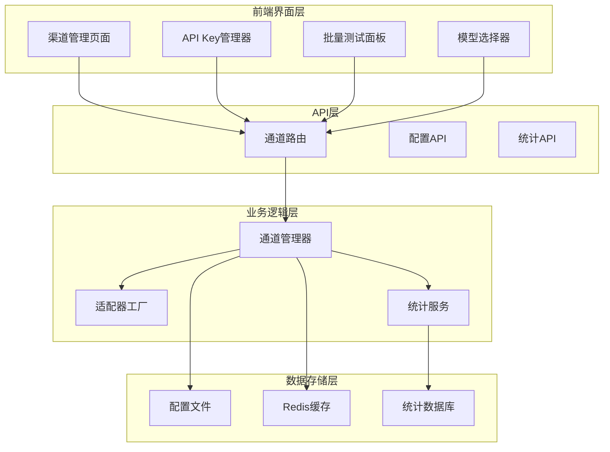

**图表来源**
- [frontend/app/(dashboard)/channels/page.tsx](file://frontend/app/(dashboard)/channels/page.tsx#L1-L800)
- [src/services/routes/channelRoutes.js](file://src/services/routes/channelRoutes.js#L1-L535)
- [src/services/llm/ChannelManager.js](file://src/services/llm/ChannelManager.js#L77-L1776)

**章节来源**
- [frontend/app/(dashboard)/channels/page.tsx](file://frontend/app/(dashboard)/channels/page.tsx#L1-L800)
- [src/services/routes/channelRoutes.js](file://src/services/routes/channelRoutes.js#L1-L535)

## 核心组件

### 渠道管理页面组件

渠道管理页面是整个系统的入口界面，提供了完整的渠道管理功能：

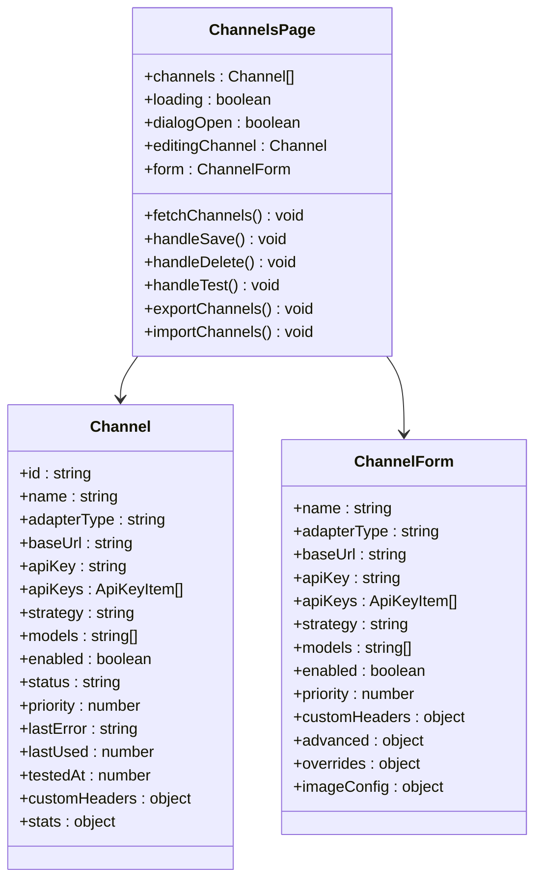

**图表来源**
- [frontend/app/(dashboard)/channels/page.tsx](file://frontend/app/(dashboard)/channels/page.tsx#L57-L77)
- [frontend/app/(dashboard)/channels/page.tsx](file://frontend/app/(dashboard)/channels/page.tsx#L399-L437)

### API Key管理组件

API Key管理器提供了多API Key的完整管理功能：

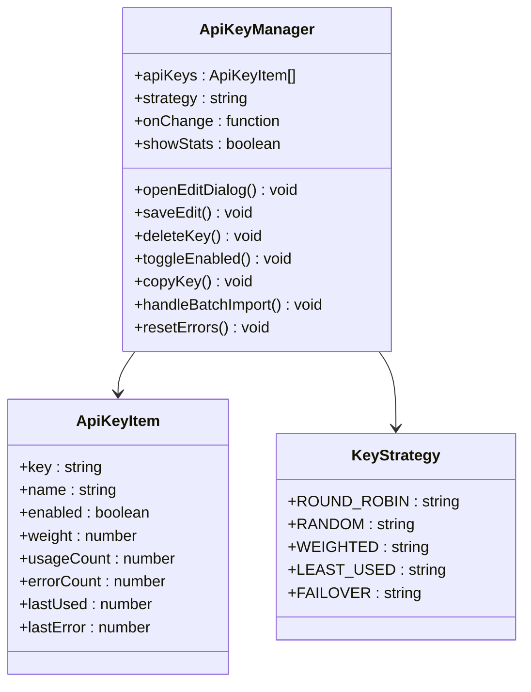

**图表来源**
- [frontend/components/channels/ApiKeyManager.tsx](file://frontend/components/channels/ApiKeyManager.tsx#L25-L52)
- [frontend/components/channels/ApiKeyManager.tsx](file://frontend/components/channels/ApiKeyManager.tsx#L37-L44)

### 批量测试面板

批量测试面板提供了全面的渠道性能验证功能：

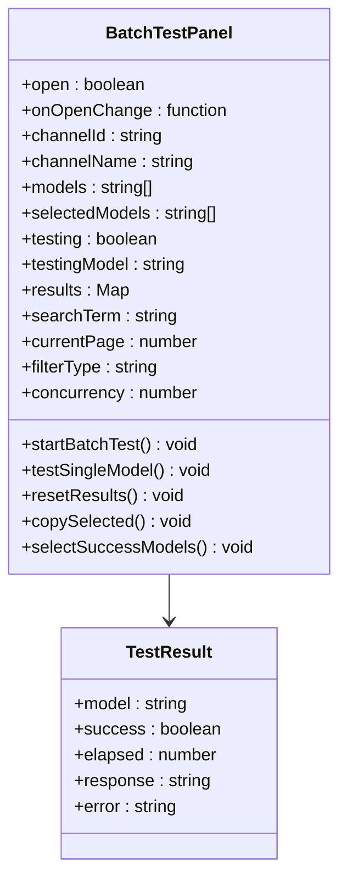

**图表来源**
- [frontend/components/channels/BatchTestPanel.tsx](file://frontend/components/channels/BatchTestPanel.tsx#L33-L50)
- [frontend/components/channels/BatchTestPanel.tsx](file://frontend/components/channels/BatchTestPanel.tsx#L52-L795)

**章节来源**
- [frontend/app/(dashboard)/channels/page.tsx](file://frontend/app/(dashboard)/channels/page.tsx#L57-L795)
- [frontend/components/channels/ApiKeyManager.tsx](file://frontend/components/channels/ApiKeyManager.tsx#L1-L456)
- [frontend/components/channels/BatchTestPanel.tsx](file://frontend/components/channels/BatchTestPanel.tsx#L1-L795)

## 架构概览

系统采用前后端分离架构，前端使用Next.js构建，后端使用Node.js和Express框架：

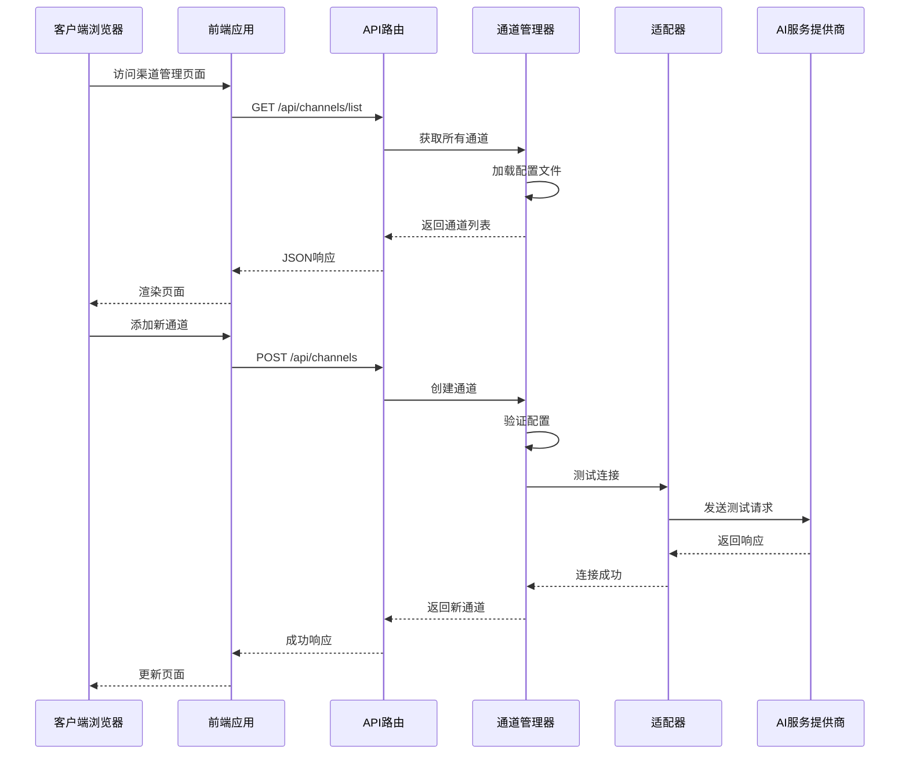

**图表来源**
- [frontend/lib/api.ts](file://frontend/lib/api.ts#L52-L64)
- [src/services/routes/channelRoutes.js](file://src/services/routes/channelRoutes.js#L19-L95)
- [src/services/llm/ChannelManager.js](file://src/services/llm/ChannelManager.js#L99-L137)

**章节来源**
- [src/services/routes/channelRoutes.js](file://src/services/routes/channelRoutes.js#L1-L535)
- [src/services/llm/ChannelManager.js](file://src/services/llm/ChannelManager.js#L77-L1776)

## 详细组件分析

### 渠道配置管理

渠道配置管理提供了完整的AI服务集成能力：

#### 支持的AI服务提供商

系统预配置了多个主流AI服务提供商：

| 服务提供商 | 适配器类型 | 基础URL | 模型支持 |
|-----------|-----------|---------|----------|
| OpenAI | openai | https://api.openai.com/v1 | GPT系列模型 |
| Google Gemini | gemini | https://generativelanguage.googleapis.com | Gemini系列模型 |
| Anthropic Claude | claude | https://api.anthropic.com | Claude系列模型 |
| 智谱AI | openai | https://open.bigmodel.cn/api/paas/v4 | GLM系列模型 |
| 通义千问 | openai | https://dashscope.aliyuncs.com/compatible-mode/v1 | Qwen系列模型 |

#### 渠道配置参数

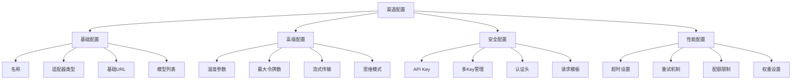

**图表来源**
- [frontend/app/(dashboard)/channels/page.tsx](file://frontend/app/(dashboard)/channels/page.tsx#L399-L437)
- [config/config.js](file://config/config.js#L267-L268)

#### 渠道状态管理

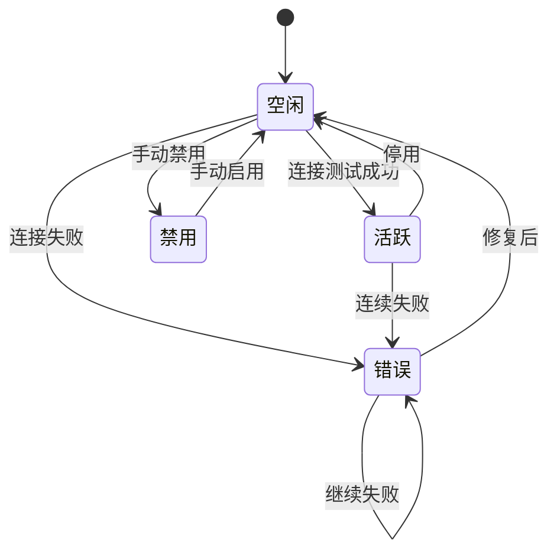

**图表来源**
- [src/services/llm/ChannelManager.js](file://src/services/llm/ChannelManager.js#L68-L75)
- [src/services/llm/ChannelManager.js](file://src/services/llm/ChannelManager.js#L864-L874)

**章节来源**
- [frontend/app/(dashboard)/channels/page.tsx](file://frontend/app/(dashboard)/channels/page.tsx#L124-L379)
- [src/services/llm/ChannelManager.js](file://src/services/llm/ChannelManager.js#L68-L137)

### 多API Key管理策略

系统支持多种API Key使用策略，确保高可用性和负载分担：

#### 轮询策略 (Round Robin)
按顺序循环使用API Key，确保每个Key的使用频率相等。

#### 随机策略 (Random)
随机选择可用的API Key，适用于负载分布需求。

#### 权重策略 (Weighted)
根据Key的权重比例进行选择，权重越高被选中的概率越大。

#### 最少使用策略 (Least Used)
优先选择使用次数最少的Key，实现负载均衡。

#### 故障转移策略 (Failover)
按顺序使用Key，当当前Key失败时自动切换到下一个可用Key。

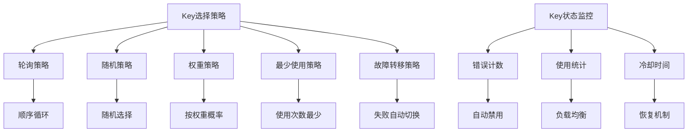

**图表来源**
- [frontend/components/channels/ApiKeyManager.tsx](file://frontend/components/channels/ApiKeyManager.tsx#L37-L44)
- [src/services/llm/ChannelManager.js](file://src/services/llm/ChannelManager.js#L498-L584)

**章节来源**
- [frontend/components/channels/ApiKeyManager.tsx](file://frontend/components/channels/ApiKeyManager.tsx#L37-L584)
- [src/services/llm/ChannelManager.js](file://src/services/llm/ChannelManager.js#L477-L584)

### 批量测试面板

批量测试面板提供了全面的渠道性能验证功能：

#### 测试流程

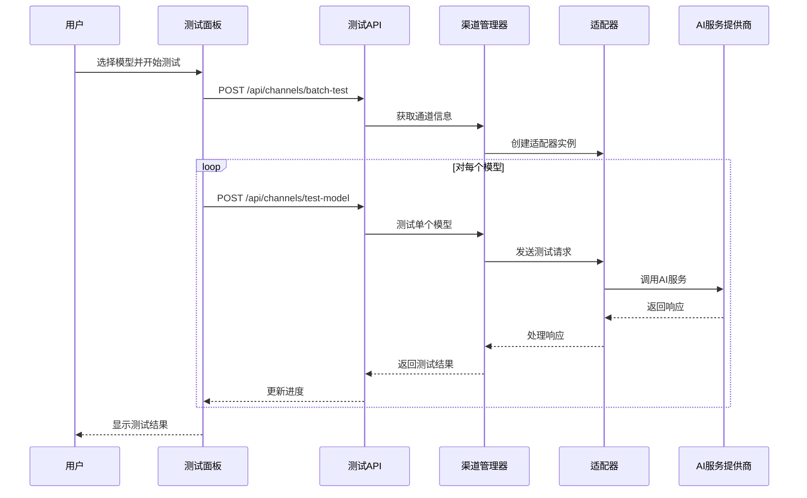

**图表来源**
- [src/services/routes/channelRoutes.js](file://src/services/routes/channelRoutes.js#L369-L458)
- [src/services/routes/channelRoutes.js](file://src/services/routes/channelRoutes.js#L460-L532)

#### 测试结果统计

测试面板提供了详细的性能统计信息：

| 统计指标 | 描述 | 计算方式 |
|---------|------|---------|
| 成功数量 | 测试成功的模型数量 | 统计success为true的数量 |
| 失败数量 | 测试失败的模型数量 | 统计success为false的数量 |
| 平均耗时 | 所有测试的平均响应时间 | 所有模型耗时的平均值 |
| 通过率 | 成功数量占总数的比例 | (成功数量/总数) × 100% |
| 最快模型 | 响应时间最短的模型 | 按elapsed排序取最小值 |
| 最慢模型 | 响应时间最长的模型 | 按elapsed排序取最大值 |

**章节来源**
- [frontend/components/channels/BatchTestPanel.tsx](file://frontend/components/channels/BatchTestPanel.tsx#L76-L86)
- [src/services/routes/channelRoutes.js](file://src/services/routes/channelRoutes.js#L369-L532)

### 负载均衡和故障转移

系统实现了智能的负载均衡和故障转移机制：

#### 负载均衡策略

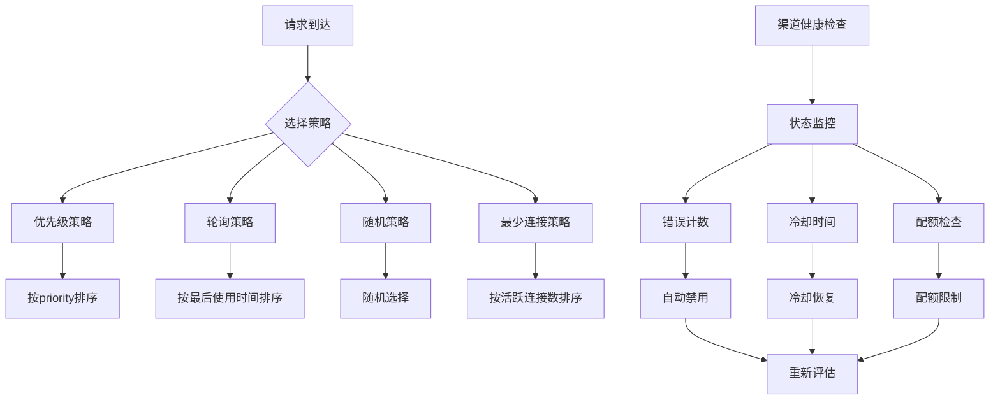

**图表来源**
- [src/services/llm/ChannelManager.js](file://src/services/llm/ChannelManager.js#L882-L962)
- [src/services/llm/ChannelManager.js](file://src/services/llm/ChannelManager.js#L1284-L1396)

#### 故障转移机制

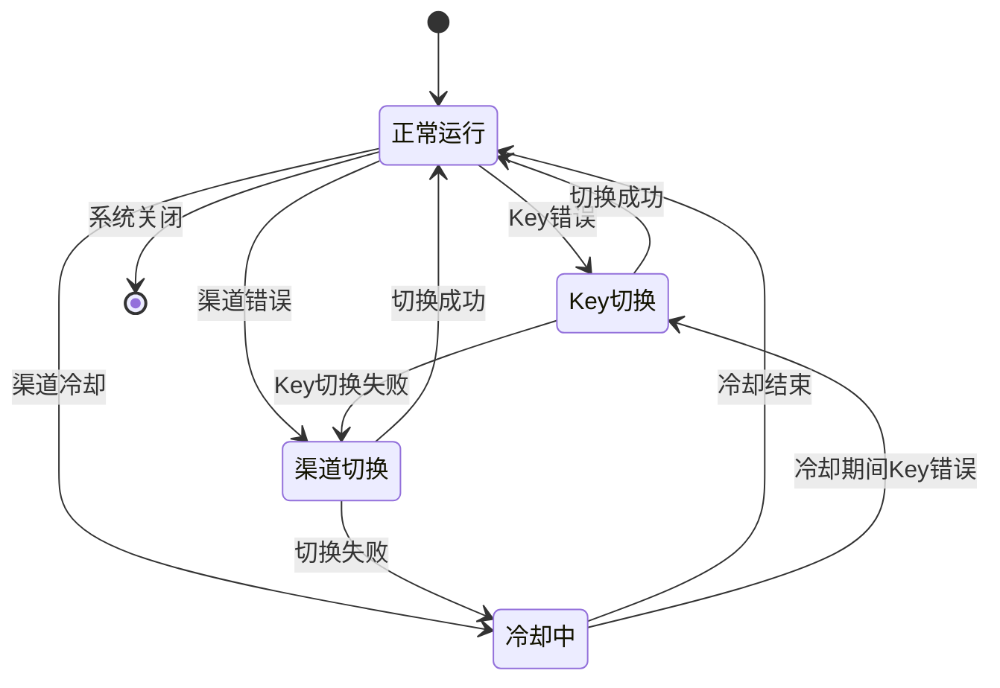

**图表来源**
- [src/services/llm/ChannelManager.js](file://src/services/llm/ChannelManager.js#L1352-L1396)
- [src/services/llm/ChannelManager.js](file://src/services/llm/ChannelManager.js#L1445-L1478)

**章节来源**
- [src/services/llm/ChannelManager.js](file://src/services/llm/ChannelManager.js#L882-L1478)

## 依赖关系分析

系统采用了模块化的依赖设计，确保各组件之间的松耦合：

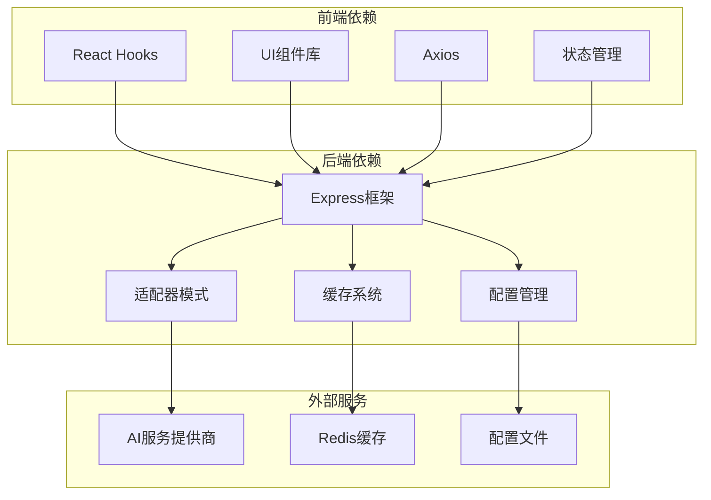

**图表来源**
- [frontend/lib/api.ts](file://frontend/lib/api.ts#L1-L473)
- [src/services/llm/ChannelManager.js](file://src/services/llm/ChannelManager.js#L1-L800)

**章节来源**
- [frontend/lib/api.ts](file://frontend/lib/api.ts#L1-L473)
- [src/services/llm/ChannelManager.js](file://src/services/llm/ChannelManager.js#L1-L800)

## 性能考虑

### 缓存策略

系统实现了多层次的缓存机制来提升性能：

1. **模型列表缓存**：使用Redis缓存API模型列表，减少对外部API的频繁调用
2. **配置缓存**：内存中缓存通道配置，避免频繁读取文件系统
3. **统计缓存**：缓存渠道使用统计信息，支持实时监控

### 并发控制

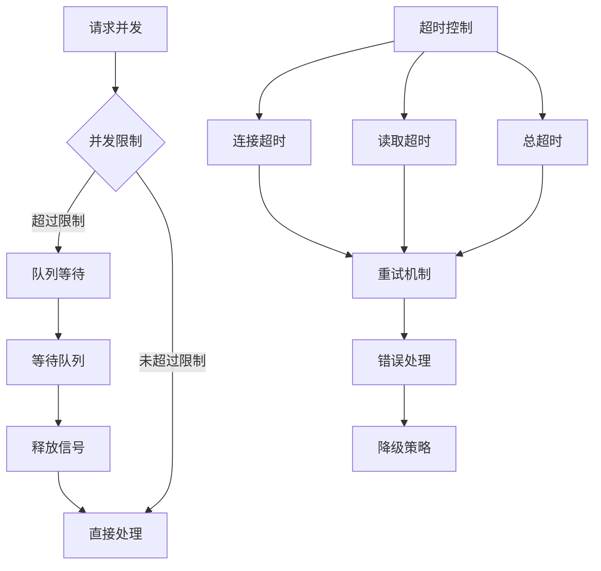

**图表来源**
- [src/services/llm/ChannelManager.js](file://src/services/llm/ChannelManager.js#L262-L265)
- [src/services/routes/channelRoutes.js](file://src/services/routes/channelRoutes.js#L370-L458)

### 错误处理和重试

系统实现了智能的错误处理和重试机制：

| 错误类型 | 处理策略 | 重试次数 | 重试间隔 |
|---------|---------|---------|---------|
| 认证错误 | 立即停止 | 0次 | - |
| 配额超限 | 暂停使用 | 0次 | - |
| 网络错误 | 指数退避 | 3次 | 1s, 2s, 4s |
| 服务器错误 | 指数退避 | 3次 | 1s, 2s, 4s |
| 空响应 | 立即重试 | 2次 | 500ms, 1s |

**章节来源**
- [src/services/llm/ChannelManager.js](file://src/services/llm/ChannelManager.js#L1399-L1437)
- [src/services/llm/ChannelManager.js](file://src/services/llm/ChannelManager.js#L1284-L1396)

## 故障排除指南

### 常见问题及解决方案

#### 渠道连接失败

**症状**：测试连接时出现认证错误或超时

**排查步骤**：
1. 检查API Key是否正确配置
2. 验证基础URL是否可达
3. 确认网络连接状态
4. 查看防火墙设置

**解决方案**：
- 更新正确的API Key
- 修改基础URL为可用地址
- 配置代理服务器
- 检查服务提供商状态

#### 模型不可用

**症状**：测试模型时返回"模型不存在"错误

**排查步骤**：
1. 确认模型名称是否正确
2. 检查API Key是否有相应权限
3. 验证模型是否在服务提供商处启用

**解决方案**：
- 使用正确的模型名称
- 申请相应权限
- 联系服务提供商支持

#### 性能问题

**症状**：响应时间过长或频繁超时

**排查步骤**：
1. 检查网络延迟
2. 分析服务器负载
3. 监控API使用情况

**解决方案**：
- 优化网络配置
- 增加服务器资源
- 实施负载均衡

#### 多Key管理问题

**症状**：Key切换异常或使用不均衡

**排查步骤**：
1. 检查Key状态和错误计数
2. 验证权重设置
3. 分析使用统计

**解决方案**：
- 重置错误计数
- 调整权重分配
- 检查Key有效性

**章节来源**
- [src/services/llm/ChannelManager.js](file://src/services/llm/ChannelManager.js#L1128-L1190)
- [frontend/components/channels/ApiKeyManager.tsx](file://frontend/components/channels/ApiKeyManager.tsx#L170-L180)

## 结论

渠道管理页面提供了完整的AI服务渠道配置和管理功能，具有以下特点：

### 核心优势

1. **多服务集成**：支持国内外主要AI服务提供商
2. **灵活配置**：丰富的配置选项满足不同需求
3. **高可用性**：智能的负载均衡和故障转移机制
4. **可视化管理**：直观的界面和实时状态监控
5. **安全可靠**：完善的API Key管理和访问控制

### 最佳实践建议

1. **配置优化**
   - 合理设置超时和重试参数
   - 配置适当的并发限制
   - 定期清理无效的API Key

2. **监控维护**
   - 建立定期健康检查机制
   - 监控渠道使用统计
   - 及时处理错误告警

3. **性能调优**
   - 根据实际负载调整策略
   - 优化网络配置
   - 实施合理的缓存策略

4. **安全管理**
   - 定期轮换API Key
   - 限制Key使用范围
   - 启用必要的安全措施

该系统为企业级AI服务集成提供了可靠的基础设施，能够满足各种复杂的业务场景需求。
