# 管理页面功能

<cite>
**本文档引用的文件**
- [frontend/app/(dashboard)/channels/page.tsx](file://frontend/app/(dashboard)/channels/page.tsx)
- [frontend/app/(dashboard)/settings/page.tsx](file://frontend/app/(dashboard)/settings/page.tsx)
- [frontend/app/(dashboard)/presets/page.tsx](file://frontend/app/(dashboard)/presets/page.tsx)
- [frontend/app/(dashboard)/tools/page.tsx](file://frontend/app/(dashboard)/tools/page.tsx)
- [frontend/app/(dashboard)/memory/page.tsx](file://frontend/app/(dashboard)/memory/page.tsx)
- [frontend/app/(dashboard)/history/page.tsx](file://frontend/app/(dashboard)/history/page.tsx)
- [frontend/app/(dashboard)/stats/page.tsx](file://frontend/app/(dashboard)/stats/page.tsx)
- [frontend/app/(dashboard)/conversations/page.tsx](file://frontend/app/(dashboard)/conversations/page.tsx)
</cite>

## 目录
1. [简介](#简介)
2. [项目结构](#项目结构)
3. [核心组件](#核心组件)
4. [架构概览](#架构概览)
5. [详细组件分析](#详细组件分析)
6. [依赖关系分析](#依赖关系分析)
7. [性能考虑](#性能考虑)
8. [故障排除指南](#故障排除指南)
9. [结论](#结论)

## 简介

本项目是一个基于 Next.js 的 ChatGPT 插件管理面板，提供了完整的 AI 助手管理系统。该系统包含多个管理页面，涵盖渠道配置、系统设置、预设管理、工具管理、记忆管理和统计分析等功能模块。

系统采用现代化的前端技术栈，包括 TypeScript、React、Next.js 和 Tailwind CSS，提供了直观的用户界面和强大的功能特性。每个管理页面都经过精心设计，确保用户能够高效地管理和配置 AI 助手的各项功能。

## 项目结构

项目采用模块化的前端架构，主要分为以下几个核心部分：

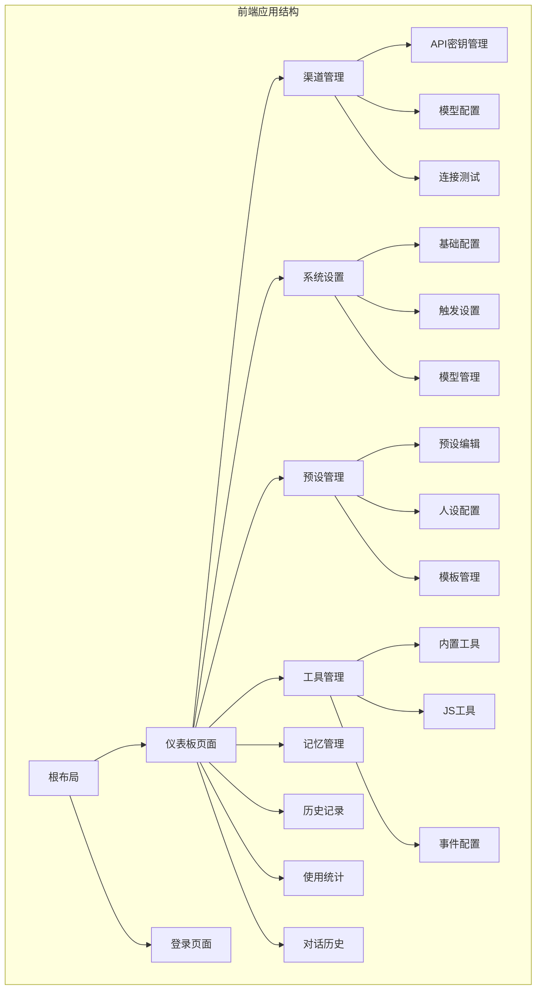

**图表来源**
- [frontend/app/layout.tsx](file://frontend/app/layout.tsx#L1-L27)
- [frontend/app/(dashboard)/channels/page.tsx](file://frontend/app/(dashboard)/channels/page.tsx#L1-L800)

**章节来源**
- [frontend/app/layout.tsx](file://frontend/app/layout.tsx#L1-L27)

## 核心组件

### 管理页面架构

系统采用统一的页面架构设计，所有管理页面都遵循相同的设计模式：

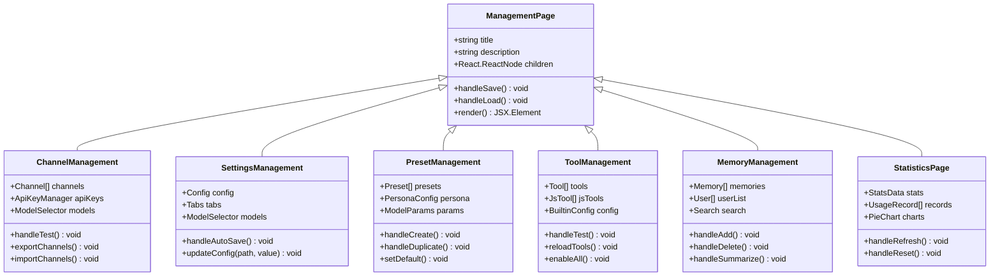

**图表来源**
- [frontend/app/(dashboard)/channels/page.tsx](file://frontend/app/(dashboard)/channels/page.tsx#L381-L800)
- [frontend/app/(dashboard)/settings/page.tsx](file://frontend/app/(dashboard)/settings/page.tsx#L278-L560)
- [frontend/app/(dashboard)/presets/page.tsx](file://frontend/app/(dashboard)/presets/page.tsx#L92-L456)
- [frontend/app/(dashboard)/tools/page.tsx](file://frontend/app/(dashboard)/tools/page.tsx#L108-L590)
- [frontend/app/(dashboard)/memory/page.tsx](file://frontend/app/(dashboard)/memory/page.tsx#L52-L525)
- [frontend/app/(dashboard)/stats/page.tsx](file://frontend/app/(dashboard)/stats/page.tsx#L222-L732)

### 数据流架构

系统采用统一的数据流管理模式，确保各页面间的数据一致性和实时性：

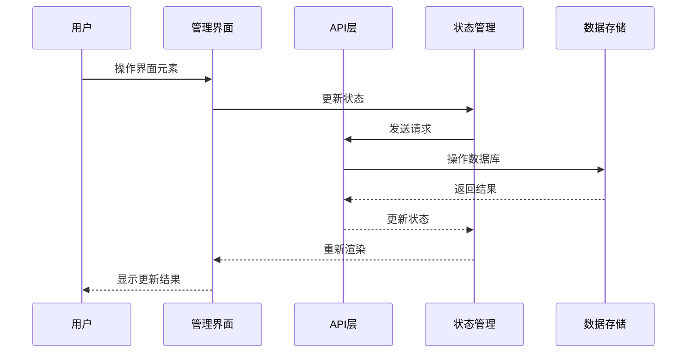

**图表来源**
- [frontend/app/(dashboard)/channels/page.tsx](file://frontend/app/(dashboard)/channels/page.tsx#L567-L623)
- [frontend/app/(dashboard)/settings/page.tsx](file://frontend/app/(dashboard)/settings/page.tsx#L301-L323)

**章节来源**
- [frontend/app/(dashboard)/channels/page.tsx](file://frontend/app/(dashboard)/channels/page.tsx#L381-L800)
- [frontend/app/(dashboard)/settings/page.tsx](file://frontend/app/(dashboard)/settings/page.tsx#L278-L560)

## 架构概览

### 页面导航关系

系统采用层级化的页面导航结构，用户可以通过侧边栏或面包屑导航在不同管理页面间切换：

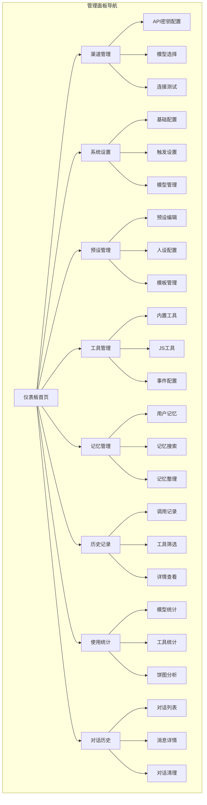

**图表来源**
- [frontend/app/(dashboard)/channels/page.tsx](file://frontend/app/(dashboard)/channels/page.tsx#L594-L652)
- [frontend/app/(dashboard)/settings/page.tsx](file://frontend/app/(dashboard)/settings/page.tsx#L594-L652)

### 权限控制机制

系统实现了多层次的权限控制机制，确保只有授权用户才能访问敏感功能：

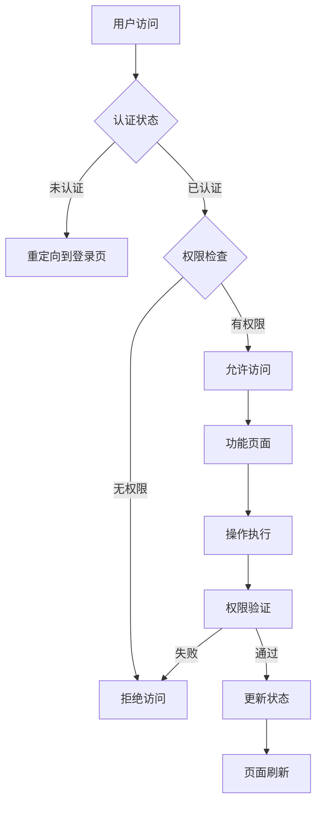

**图表来源**
- [frontend/app/(dashboard)/channels/page.tsx](file://frontend/app/(dashboard)/channels/page.tsx#L567-L623)

**章节来源**
- [frontend/app/(dashboard)/channels/page.tsx](file://frontend/app/(dashboard)/channels/page.tsx#L594-L652)
- [frontend/app/(dashboard)/settings/page.tsx](file://frontend/app/(dashboard)/settings/page.tsx#L594-L652)

## 详细组件分析

### 渠道管理页面

渠道管理页面是系统的核心配置模块，负责管理各种 AI 服务提供商的连接配置。

#### 主要功能特性

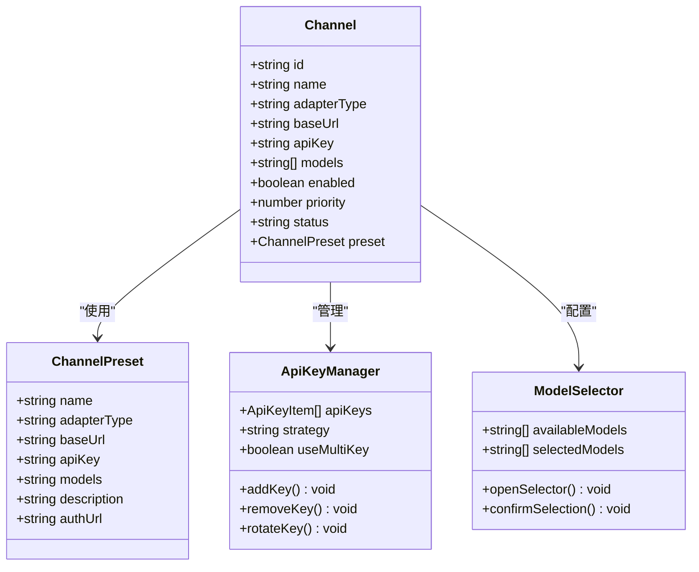

**图表来源**
- [frontend/app/(dashboard)/channels/page.tsx](file://frontend/app/(dashboard)/channels/page.tsx#L57-L88)
- [frontend/app/(dashboard)/channels/page.tsx](file://frontend/app/(dashboard)/channels/page.tsx#L381-L437)

#### 操作流程

1. **渠道创建流程**
   - 用户点击"添加渠道"按钮
   - 系统显示表单界面
   - 用户填写基本信息（名称、适配器类型、基础URL）
   - 用户配置API密钥和模型列表
   - 点击保存按钮提交配置

2. **连接测试流程**
   - 用户点击"测试连接"按钮
   - 系统向指定API发送测试请求
   - 显示测试结果和错误信息
   - 成功时更新渠道状态为"活动"

3. **配置导入导出**
   - 支持批量导出渠道配置
   - 支持从JSON文件导入配置
   - 自动处理API密钥的安全处理

**章节来源**
- [frontend/app/(dashboard)/channels/page.tsx](file://frontend/app/(dashboard)/channels/page.tsx#L381-L800)

### 系统设置页面

系统设置页面提供了全面的配置管理功能，涵盖基础设置、触发配置、模型管理等多个方面。

#### 配置分类管理

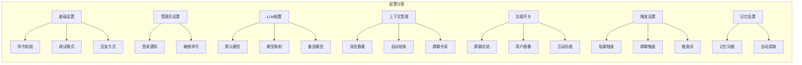

**图表来源**
- [frontend/app/(dashboard)/settings/page.tsx](file://frontend/app/(dashboard)/settings/page.tsx#L55-L171)

#### 自动保存机制

系统实现了智能的自动保存功能：

1. **防抖保存**：配置变更后延迟800毫秒自动保存
2. **状态反馈**：显示保存状态（保存中/已保存/空闲）
3. **错误处理**：保存失败时显示错误提示
4. **数据合并**：支持与默认配置的深度合并

**章节来源**
- [frontend/app/(dashboard)/settings/page.tsx](file://frontend/app/(dashboard)/settings/page.tsx#L278-L560)

### 预设管理页面

预设管理页面允许用户创建和管理AI对话的预设配置，包括系统提示词、人设配置和模型参数。

#### 预设配置结构

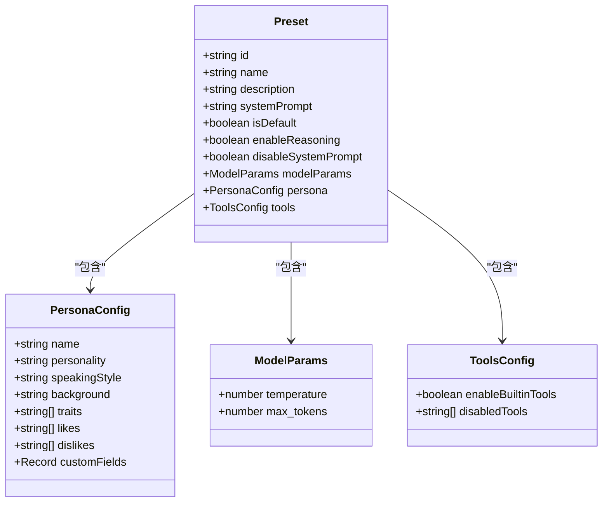

**图表来源**
- [frontend/app/(dashboard)/presets/page.tsx](file://frontend/app/(dashboard)/presets/page.tsx#L50-L84)

#### 预设管理功能

1. **预设创建**：支持从内置预设创建副本
2. **人设配置**：详细的个性特征设置
3. **模型参数**：温度、最大Token数等参数调整
4. **工具集成**：预设级别的工具启用/禁用
5. **搜索过滤**：支持模糊搜索和分类过滤

**章节来源**
- [frontend/app/(dashboard)/presets/page.tsx](file://frontend/app/(dashboard)/presets/page.tsx#L92-L456)

### 工具管理页面

工具管理页面提供了对系统内置工具和自定义JS工具的全面管理功能。

#### 工具类型分类

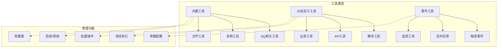

**图表来源**
- [frontend/app/(dashboard)/tools/page.tsx](file://frontend/app/(dashboard)/tools/page.tsx#L52-L106)

#### 工具管理特性

1. **批量操作**：一键启用/禁用所有工具
2. **热重载功能**：支持动态重载工具配置
3. **测试环境**：提供工具执行测试功能
4. **参数验证**：自动验证工具参数格式
5. **安全控制**：危险操作的权限控制

**章节来源**
- [frontend/app/(dashboard)/tools/page.tsx](file://frontend/app/(dashboard)/tools/page.tsx#L108-L590)

### 记忆管理页面

记忆管理页面专门用于管理用户的长期记忆数据，提供完整的记忆生命周期管理。

#### 记忆数据结构

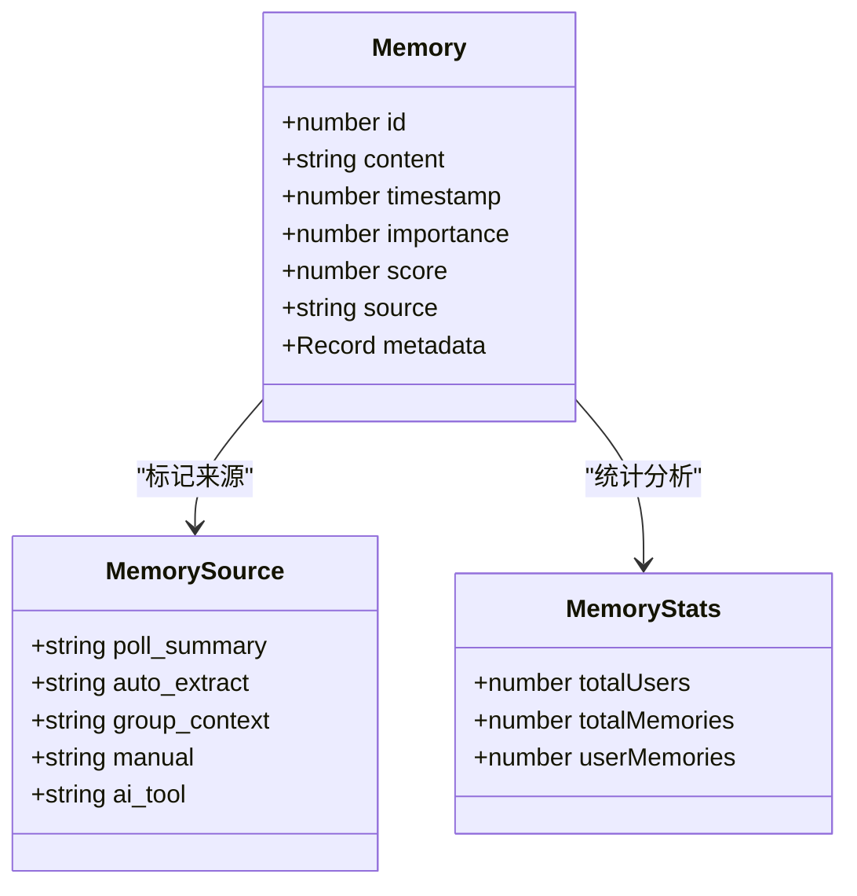

**图表来源**
- [frontend/app/(dashboard)/memory/page.tsx](file://frontend/app/(dashboard)/memory/page.tsx#L25-L50)

#### 记忆管理功能

1. **用户维度管理**：按用户ID组织和管理记忆
2. **搜索功能**：支持关键词搜索和模糊匹配
3. **批量操作**：支持用户级别和全站级别的清理
4. **智能整理**：自动合并重复记忆，优化存储效率
5. **元数据支持**：丰富的元数据字段支持

**章节来源**
- [frontend/app/(dashboard)/memory/page.tsx](file://frontend/app/(dashboard)/memory/page.tsx#L52-L525)

### 历史记录页面

历史记录页面提供了详细的工具调用记录和执行统计信息。

#### 日志数据结构

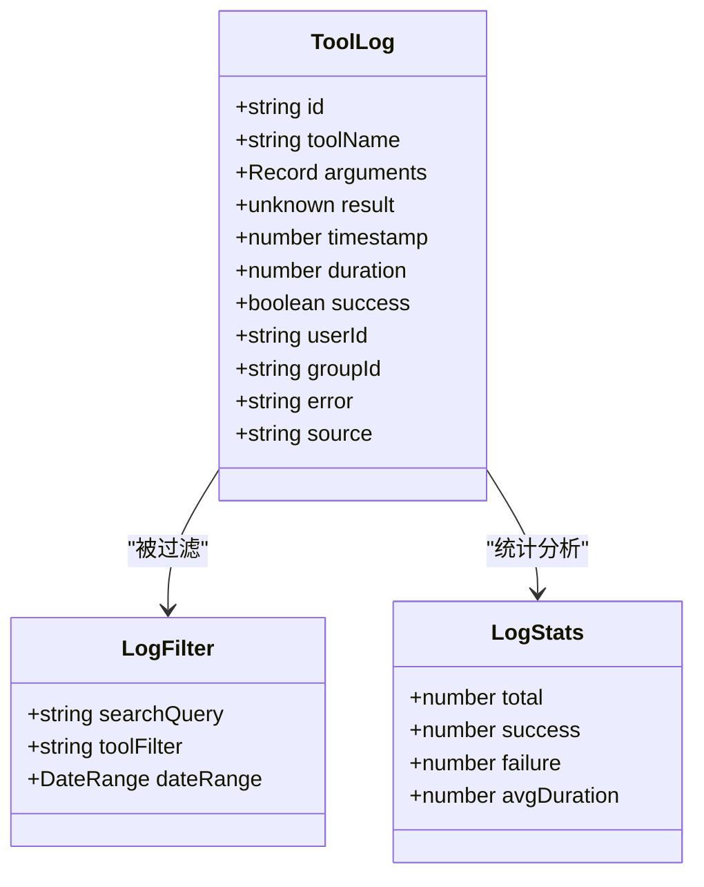

**图表来源**
- [frontend/app/(dashboard)/history/page.tsx](file://frontend/app/(dashboard)/history/page.tsx#L17-L31)

#### 日志管理特性

1. **实时统计**：显示成功率、失败率和平均耗时
2. **详细筛选**：支持按工具名、用户ID等条件筛选
3. **JSON格式化**：自动格式化和解析复杂的数据结构
4. **错误追踪**：详细记录和展示错误信息
5. **批量清理**：支持一键清空所有日志记录

**章节来源**
- [frontend/app/(dashboard)/history/page.tsx](file://frontend/app/(dashboard)/history/page.tsx#L33-L344)

### 使用统计页面

使用统计页面提供了全面的系统使用情况分析和可视化展示。

#### 统计数据结构

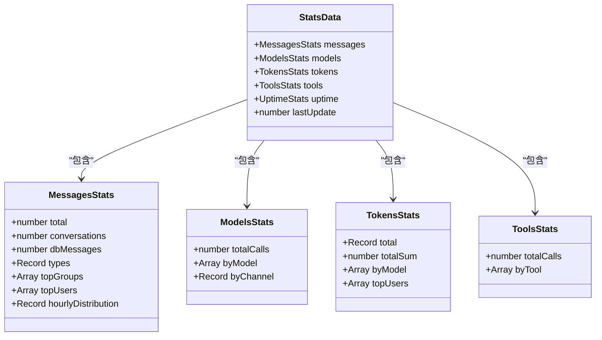

**图表来源**
- [frontend/app/(dashboard)/stats/page.tsx](file://frontend/app/(dashboard)/stats/page.tsx#L67-L101)

#### 统计分析功能

1. **多维度统计**：消息、模型、Tokens、工具的全方位统计
2. **可视化展示**：饼图、柱状图等多种图表形式
3. **实时更新**：支持手动刷新和自动更新
4. **趋势分析**：小时分布和活跃度分析
5. **性能监控**：请求成功率和响应时间统计

**章节来源**
- [frontend/app/(dashboard)/stats/page.tsx](file://frontend/app/(dashboard)/stats/page.tsx#L222-L732)

### 对话历史页面

对话历史页面提供了对AI对话记录的集中管理功能。

#### 对话数据结构

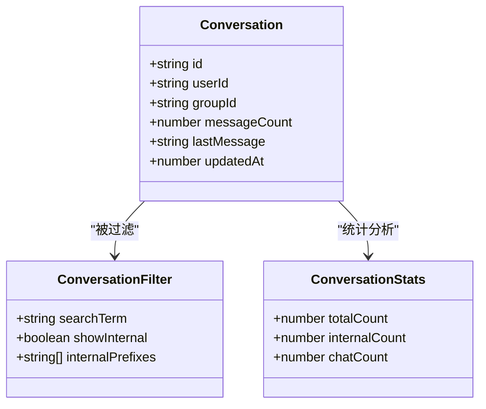

**图表来源**
- [frontend/app/(dashboard)/conversations/page.tsx](file://frontend/app/(dashboard)/conversations/page.tsx#L25-L33)

#### 对话管理功能

1. **列表展示**：清晰展示所有对话的基本信息
2. **搜索过滤**：支持按ID、用户、群组等条件搜索
3. **内部记录**：可选择显示或隐藏内部系统记录
4. **批量操作**：支持一键清空所有对话
5. **详情查看**：支持查看对话的详细消息内容

**章节来源**
- [frontend/app/(dashboard)/conversations/page.tsx](file://frontend/app/(dashboard)/conversations/page.tsx#L35-L241)

## 依赖关系分析

### 组件间依赖关系

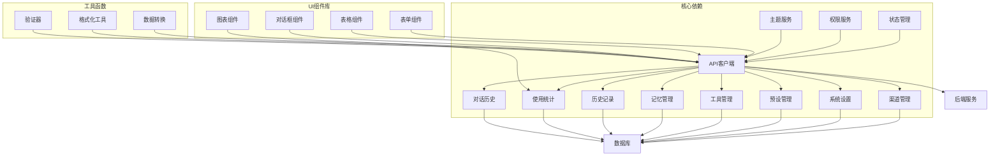

**图表来源**
- [frontend/app/(dashboard)/channels/page.tsx](file://frontend/app/(dashboard)/channels/page.tsx#L24-L54)
- [frontend/app/(dashboard)/settings/page.tsx](file://frontend/app/(dashboard)/settings/page.tsx#L30-L31)

### 数据流依赖

系统采用单向数据流架构，确保数据的一致性和可预测性：

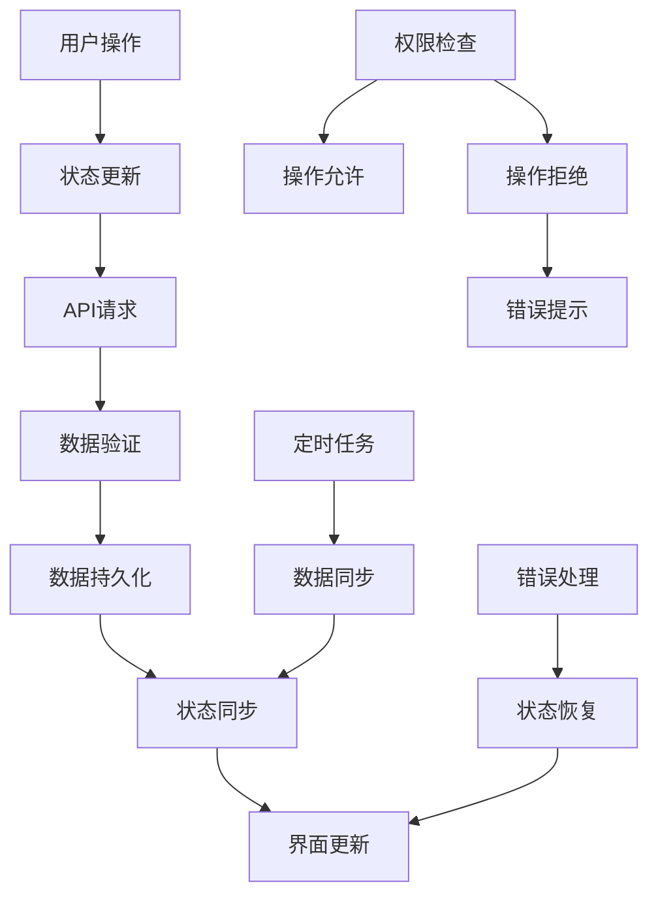

**图表来源**
- [frontend/app/(dashboard)/channels/page.tsx](file://frontend/app/(dashboard)/channels/page.tsx#L567-L623)
- [frontend/app/(dashboard)/settings/page.tsx](file://frontend/app/(dashboard)/settings/page.tsx#L301-L323)

**章节来源**
- [frontend/app/(dashboard)/channels/page.tsx](file://frontend/app/(dashboard)/channels/page.tsx#L24-L54)
- [frontend/app/(dashboard)/settings/page.tsx](file://frontend/app/(dashboard)/settings/page.tsx#L30-L31)

## 性能考虑

### 前端性能优化

1. **懒加载实现**：使用React.lazy和Suspense实现组件懒加载
2. **虚拟滚动**：大数据量列表使用虚拟滚动提升渲染性能
3. **防抖优化**：自动保存功能使用防抖减少API调用频率
4. **缓存策略**：合理使用浏览器缓存和内存缓存
5. **代码分割**：按需加载路由组件，减少初始包体积

### 数据处理优化

1. **分页加载**：大量数据采用分页加载策略
2. **增量更新**：支持局部状态更新，避免全量重渲染
3. **数据压缩**：传输过程中对数据进行必要的压缩
4. **并发控制**：限制同时进行的API请求数量
5. **错误边界**：实现错误边界捕获组件渲染异常

### 缓存策略

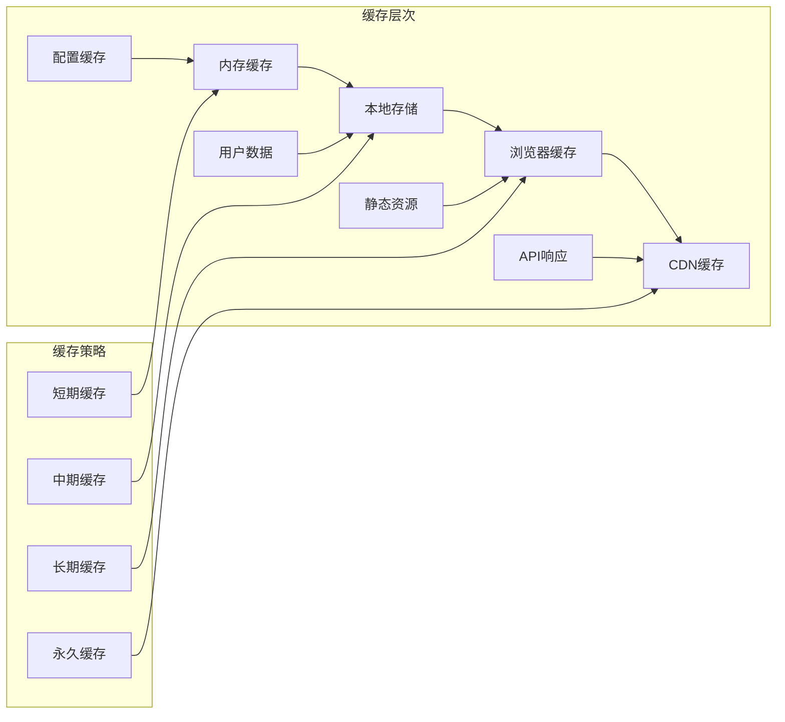

## 故障排除指南

### 常见问题及解决方案

#### 渠道连接问题

**问题现象**：渠道测试失败，连接状态显示错误

**可能原因**：
1. API密钥无效或过期
2. 网络连接不稳定
3. 服务器地址配置错误
4. 防火墙或代理阻拦

**解决步骤**：
1. 验证API密钥格式和有效性
2. 检查网络连接和DNS解析
3. 确认服务器地址和端口配置
4. 排查防火墙和代理设置

#### 配置保存失败

**问题现象**：修改配置后无法保存，显示保存失败

**可能原因**：
1. 网络连接中断
2. 权限不足
3. 数据格式错误
4. 服务器异常

**解决步骤**：
1. 检查网络连接状态
2. 验证用户权限
3. 检查配置数据格式
4. 查看服务器日志

#### 页面加载缓慢

**问题现象**：管理页面加载时间过长

**可能原因**：
1. 数据量过大
2. 网络带宽限制
3. 浏览器性能问题
4. 缓存未命中

**解决步骤**：
1. 实施分页加载
2. 优化数据查询
3. 启用缓存机制
4. 升级浏览器版本

### 调试工具使用

1. **浏览器开发者工具**：检查网络请求和JavaScript错误
2. **控制台日志**：查看应用运行时的日志输出
3. **性能分析**：使用浏览器性能面板分析性能瓶颈
4. **状态检查**：验证Redux或状态管理的状态一致性

**章节来源**
- [frontend/app/(dashboard)/channels/page.tsx](file://frontend/app/(dashboard)/channels/page.tsx#L642-L664)
- [frontend/app/(dashboard)/settings/page.tsx](file://frontend/app/(dashboard)/settings/page.tsx#L311-L315)

## 结论

本管理页面功能模块提供了完整的AI助手管理系统，具有以下特点：

### 核心优势

1. **功能完整性**：涵盖了AI助手管理的所有关键功能
2. **用户体验优秀**：直观的界面设计和流畅的操作体验
3. **扩展性强**：模块化架构支持功能扩展和定制
4. **性能优化**：采用多种性能优化策略确保系统稳定运行
5. **安全性保障**：完善的权限控制和数据安全保障

### 技术亮点

1. **现代化技术栈**：基于React和TypeScript构建的现代前端应用
2. **响应式设计**：支持多种设备和屏幕尺寸
3. **实时更新**：支持数据的实时同步和状态更新
4. **可视化分析**：丰富的图表和统计功能
5. **自动化运维**：智能的自动保存和错误处理机制

### 应用场景

该管理页面适用于以下场景：
- 企业级AI助手部署和管理
- 开发团队的AI工具配置和监控
- 教育机构的AI教学辅助系统
- 个人用户的AI助手个性化配置

通过本系统的实施，用户可以高效地管理和配置AI助手的各项功能，提升AI助手的服务质量和用户体验。