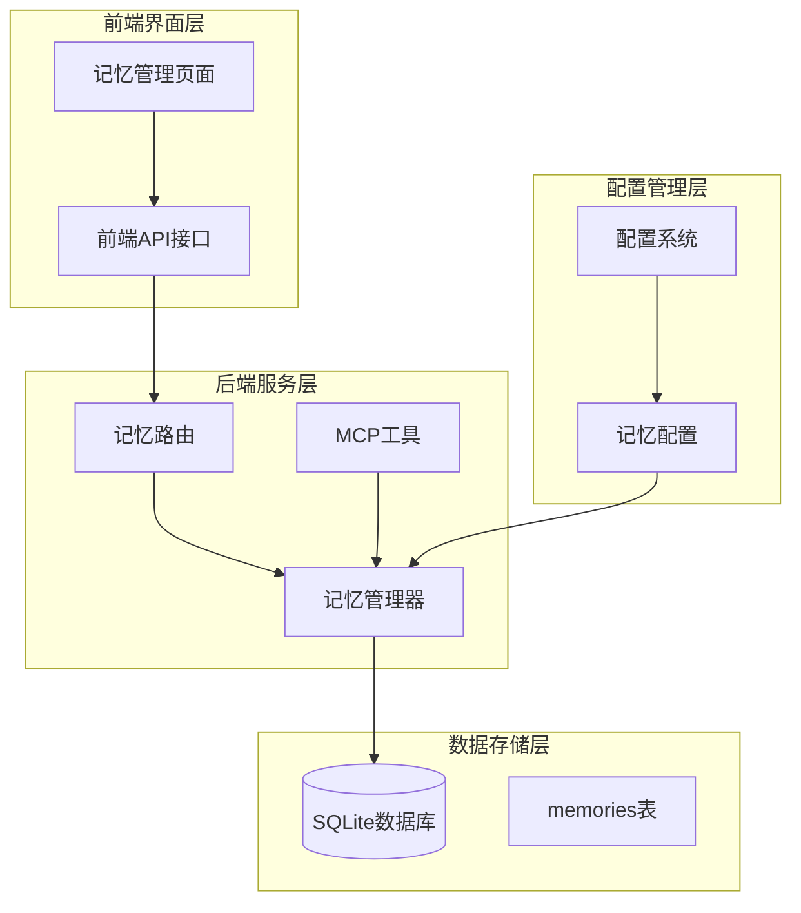
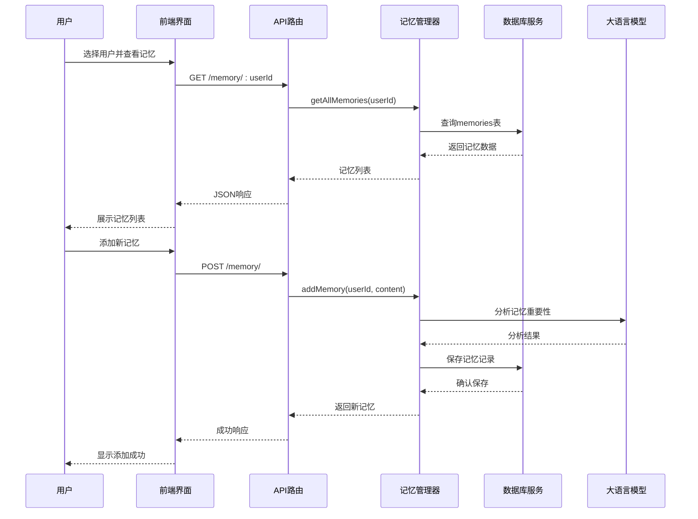
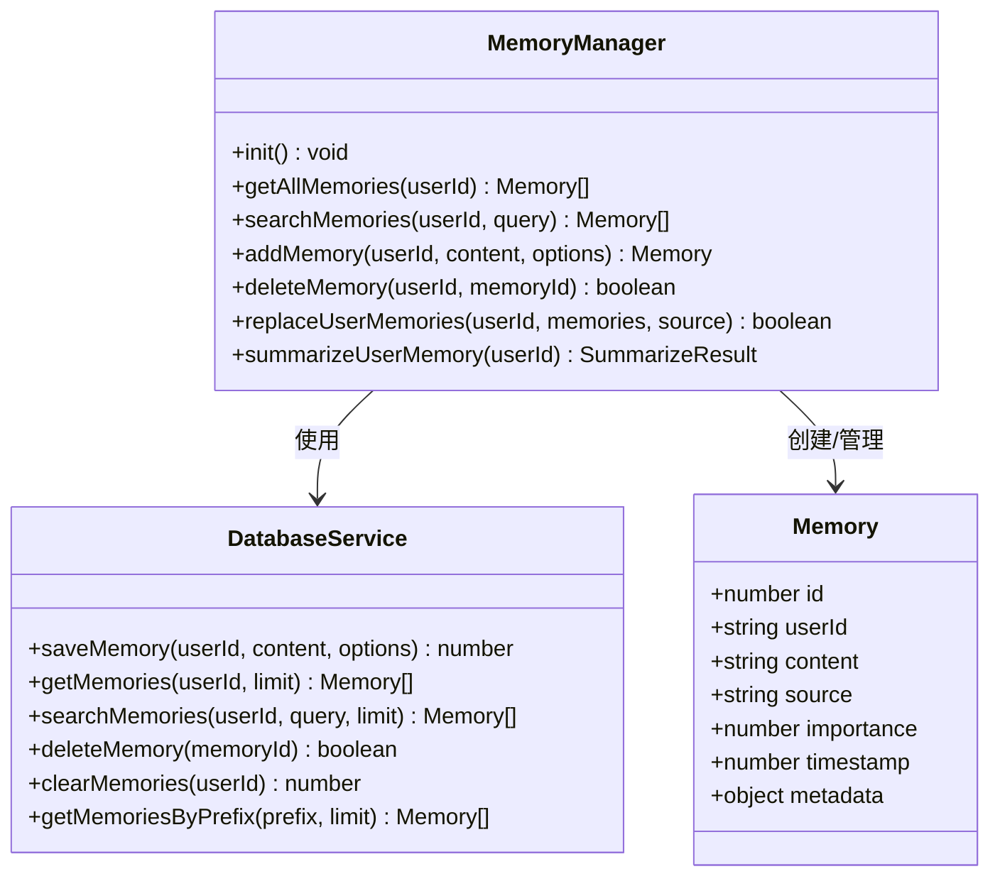
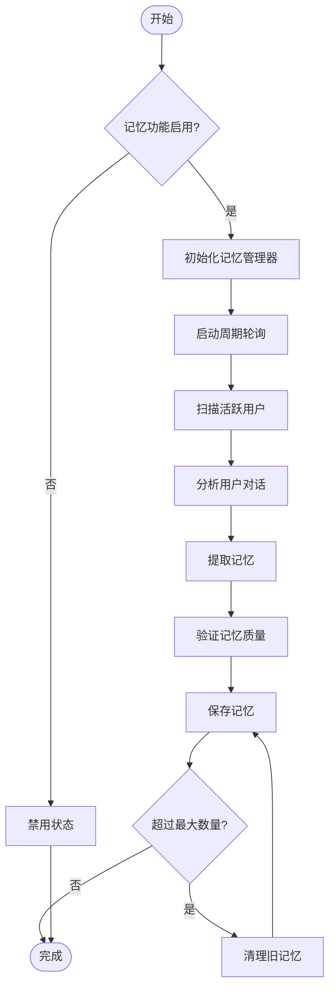
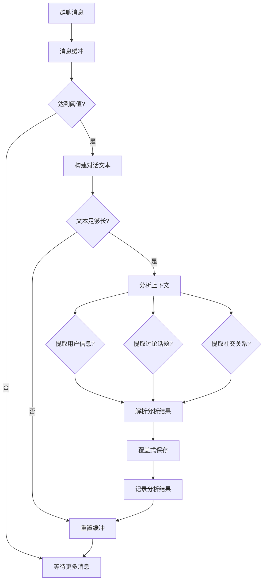
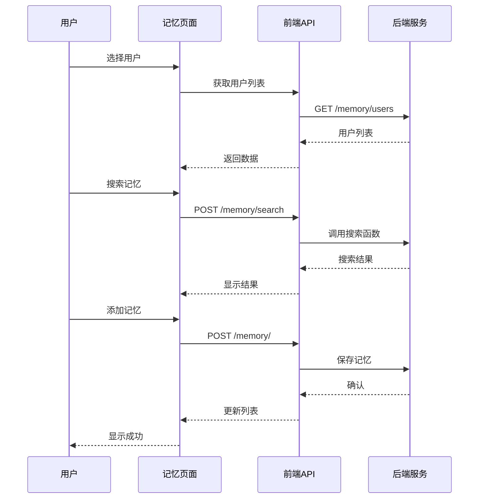
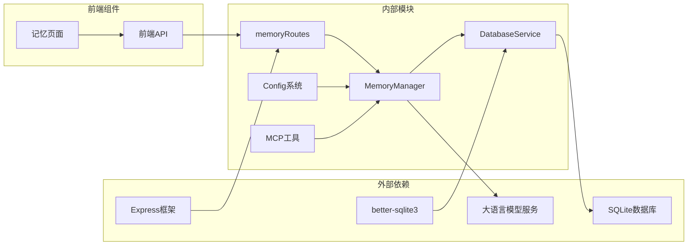
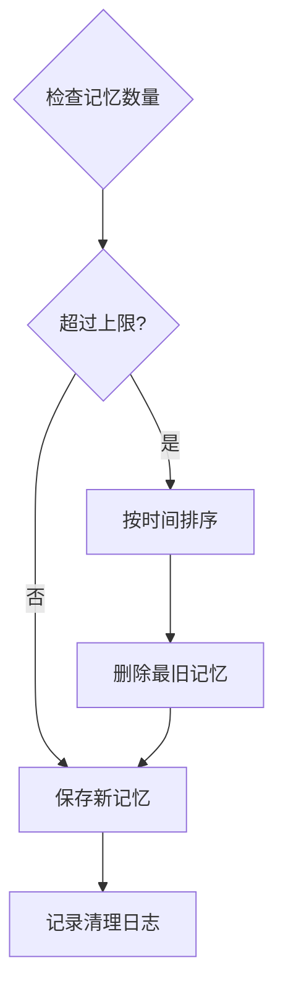

# 记忆管理页面

## 目录
1. [简介](#简介)
2. [项目结构](#项目结构)
3. [核心组件](#核心组件)
4. [架构概览](#架构概览)
5. [详细组件分析](#详细组件分析)
6. [依赖关系分析](#依赖关系分析)
7. [性能考虑](#性能考虑)
8. [故障排除指南](#故障排除指南)
9. [结论](#结论)

## 简介

记忆管理页面是ChatGPT插件中的核心功能模块，负责管理用户的长期记忆数据。该模块实现了完整的记忆生命周期管理，包括记忆的自动提取、存储、检索、编辑和清理功能。

系统采用"短期记忆 + 长期记忆"的双层架构设计，通过智能算法将对话中的关键信息转化为持久化的记忆数据，为后续的AI交互提供个性化上下文支持。

## 项目结构

记忆管理功能分布在多个层次中：

**图表来源**
- [page.tsx](file://frontend/app/(dashboard)/memory/page.tsx#L1-L525)
- [memoryRoutes.js](file://src/services/routes/memoryRoutes.js#L1-L137)
- [MemoryManager.js](file://src/services/storage/MemoryManager.js#L1-L800)

**章节来源**
- [page.tsx](file://frontend/app/(dashboard)/memory/page.tsx#L1-L525)
- [memoryRoutes.js](file://src/services/routes/memoryRoutes.js#L1-L137)

## 核心组件

### 记忆管理器 (MemoryManager)

MemoryManager是整个记忆系统的核心控制器，负责：

- **周期性轮询分析**：定期扫描用户对话历史，提取有价值的记忆信息
- **群聊上下文分析**：收集群聊消息，识别用户特征、话题和关系
- **记忆覆盖式总结**：合并现有记忆和新信息，删除重复或过时的数据
- **自动记忆提取**：基于对话内容自动识别值得记住的信息

### 数据库服务 (DatabaseService)

提供完整的数据持久化能力：

- **结构化存储**：使用SQLite数据库存储记忆数据
- **索引优化**：为user_id和timestamp建立索引提升查询性能
- **安全查询**：防止SQL注入攻击，支持LIKE查询的安全处理
- **批量操作**：支持批量删除和清理功能

### 前端界面组件

提供直观的用户界面：

- **用户选择**：支持用户ID选择和直接输入
- **记忆列表**：展示用户的长期记忆数据
- **搜索功能**：支持关键词搜索和高级筛选
- **批量操作**：支持批量删除和清理功能
- **状态可视化**：实时显示统计数据和操作状态

**章节来源**
- [MemoryManager.js](file://src/services/storage/MemoryManager.js#L12-L800)
- [DatabaseService.js](file://src/services/storage/DatabaseService.js#L19-L242)
- [page.tsx](file://frontend/app/(dashboard)/memory/page.tsx#L25-L525)

## 架构概览

记忆管理系统采用分层架构设计，确保功能模块的清晰分离和良好的可维护性：

**图表来源**
- [memoryRoutes.js](file://src/services/routes/memoryRoutes.js#L70-L96)
- [MemoryManager.js](file://src/services/storage/MemoryManager.js#L904-L932)
- [DatabaseService.js](file://src/services/storage/DatabaseService.js#L83-L98)

## 详细组件分析

### 记忆数据结构

系统使用统一的记忆数据结构来存储不同类型的信息：

**图表来源**
- [MemoryManager.js](file://src/services/storage/MemoryManager.js#L904-L932)
- [DatabaseService.js](file://src/services/storage/DatabaseService.js#L83-L242)

### 记忆生命周期管理

系统实现了完整的记忆生命周期管理：

**图表来源**
- [MemoryManager.js](file://src/services/storage/MemoryManager.js#L489-L529)
- [MemoryManager.js](file://src/services/storage/MemoryManager.js#L904-L932)

### 群聊记忆分析

群聊场景下的特殊处理逻辑：

**图表来源**
- [MemoryManager.js](file://src/services/storage/MemoryManager.js#L86-L346)

### 前端交互流程

用户通过界面进行记忆管理的操作流程：

**图表来源**
- [page.tsx](file://frontend/app/(dashboard)/memory/page.tsx#L78-L226)
- [memoryRoutes.js](file://src/services/routes/memoryRoutes.js#L42-L53)

**章节来源**
- [MemoryManager.js](file://src/services/storage/MemoryManager.js#L1-L800)
- [DatabaseService.js](file://src/services/storage/DatabaseService.js#L1-L242)
- [page.tsx](file://frontend/app/(dashboard)/memory/page.tsx#L1-L525)

## 依赖关系分析

记忆管理系统的依赖关系清晰明确：

**图表来源**
- [memoryRoutes.js](file://src/services/routes/memoryRoutes.js#L4-L7)
- [MemoryManager.js](file://src/services/storage/MemoryManager.js#L1-L8)
- [DatabaseService.js](file://src/services/storage/DatabaseService.js#L1-L5)

### 核心依赖特性

- **模块化设计**：各组件职责明确，便于维护和扩展
- **异步处理**：大量使用Promise和async/await确保非阻塞操作
- **错误处理**：完善的异常捕获和错误恢复机制
- **配置驱动**：通过配置文件控制功能开关和行为参数

**章节来源**
- [config.js](file://config/config.js#L343-L360)
- [memory.js](file://src/mcp/tools/memory.js#L6-L179)

## 性能考虑

### 存储优化策略

系统采用了多项性能优化措施：

- **索引优化**：为user_id和timestamp字段建立索引，提升查询性能
- **内存限制**：群聊消息缓冲区限制为100条，防止内存溢出
- **批量操作**：支持批量删除和清理，减少数据库操作次数
- **查询限制**：搜索查询长度限制为200字符，防止复杂模式匹配

### 记忆数量管理

**图表来源**
- [MemoryManager.js](file://src/services/storage/MemoryManager.js#L910-L923)

### 缓存和性能监控

- **WAL模式**：使用SQLite的WAL模式提升并发性能
- **连接池**：数据库连接复用，减少连接开销
- **查询优化**：使用参数化查询防止SQL注入
- **错误降级**：数据库操作失败时提供降级处理

**章节来源**
- [DatabaseService.js](file://src/services/storage/DatabaseService.js#L39-L44)
- [MemoryManager.js](file://src/services/storage/MemoryManager.js#L910-L923)

## 故障排除指南

### 常见问题及解决方案

| 问题类型 | 症状 | 可能原因 | 解决方案 |
|---------|------|----------|----------|
| 记忆无法保存 | 添加记忆后无响应 | 数据库连接失败 | 检查数据库权限和磁盘空间 |
| 查询超时 | 搜索功能响应缓慢 | 查询条件过于复杂 | 优化搜索关键词，使用更精确的查询 |
| 记忆丢失 | 重启后记忆消失 | 数据库文件损坏 | 检查数据库文件完整性，必要时重建 |
| 性能下降 | 系统响应变慢 | 记忆数量过多 | 清理历史记忆，调整配置参数 |

### 调试和监控

- **日志记录**：详细的调试日志帮助定位问题
- **性能指标**：监控查询响应时间和数据库负载
- **错误报告**：自动收集和上报异常信息
- **健康检查**：定期检查数据库连接和系统状态

**章节来源**
- [MemoryManager.js](file://src/services/storage/MemoryManager.js#L489-L529)
- [DatabaseService.js](file://src/services/storage/DatabaseService.js#L160-L163)

## 结论

记忆管理页面提供了完整的长期记忆管理解决方案，具有以下优势：

- **功能完整**：涵盖记忆的创建、查询、编辑、删除和清理全流程
- **智能分析**：通过AI技术自动提取有价值的用户信息
- **性能优化**：采用多种优化策略确保系统高效运行
- **用户体验**：提供直观易用的界面和丰富的交互功能
- **可扩展性**：模块化设计便于功能扩展和定制

该系统为AI助手提供了强大的个性化能力，能够根据用户的历史交互数据提供更加贴合的回复和服务。
