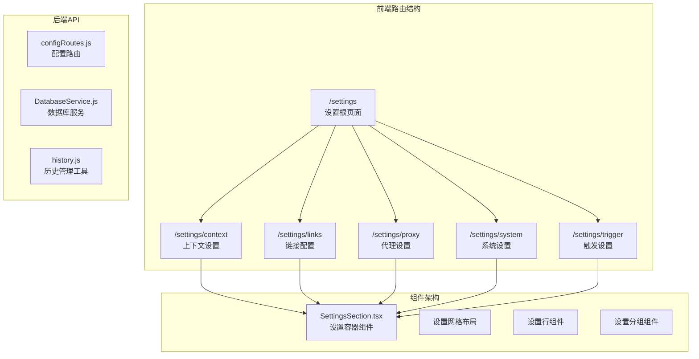
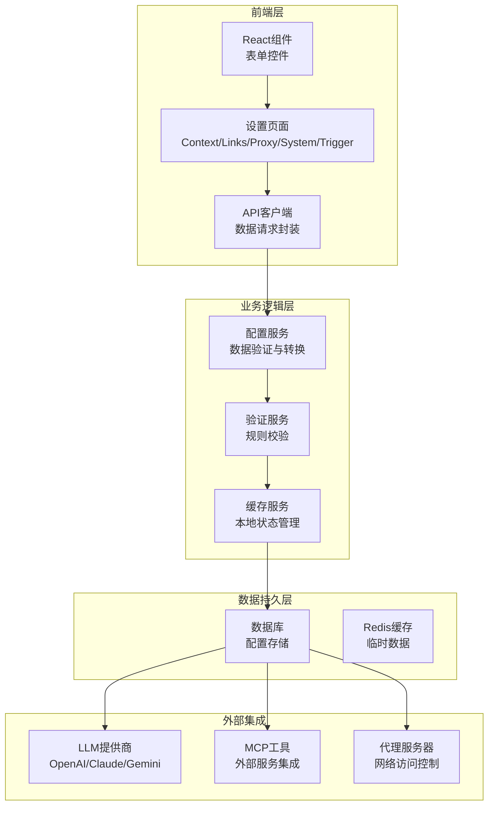
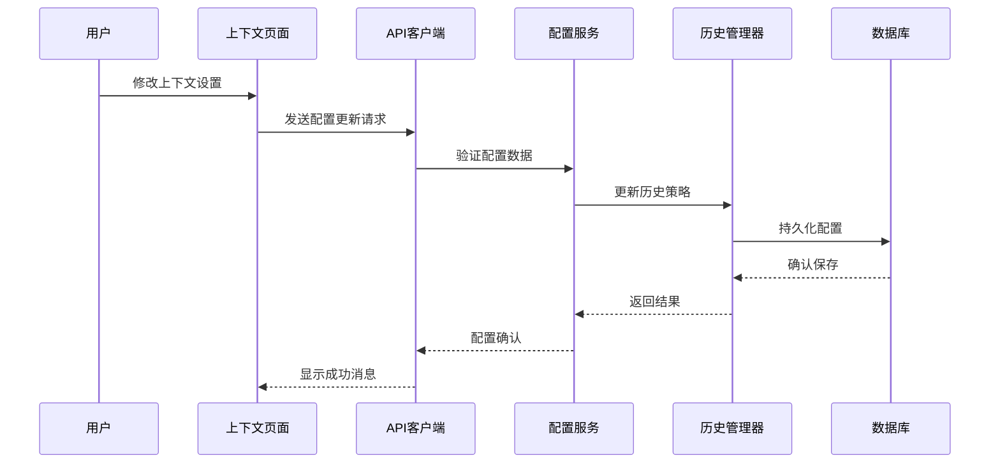
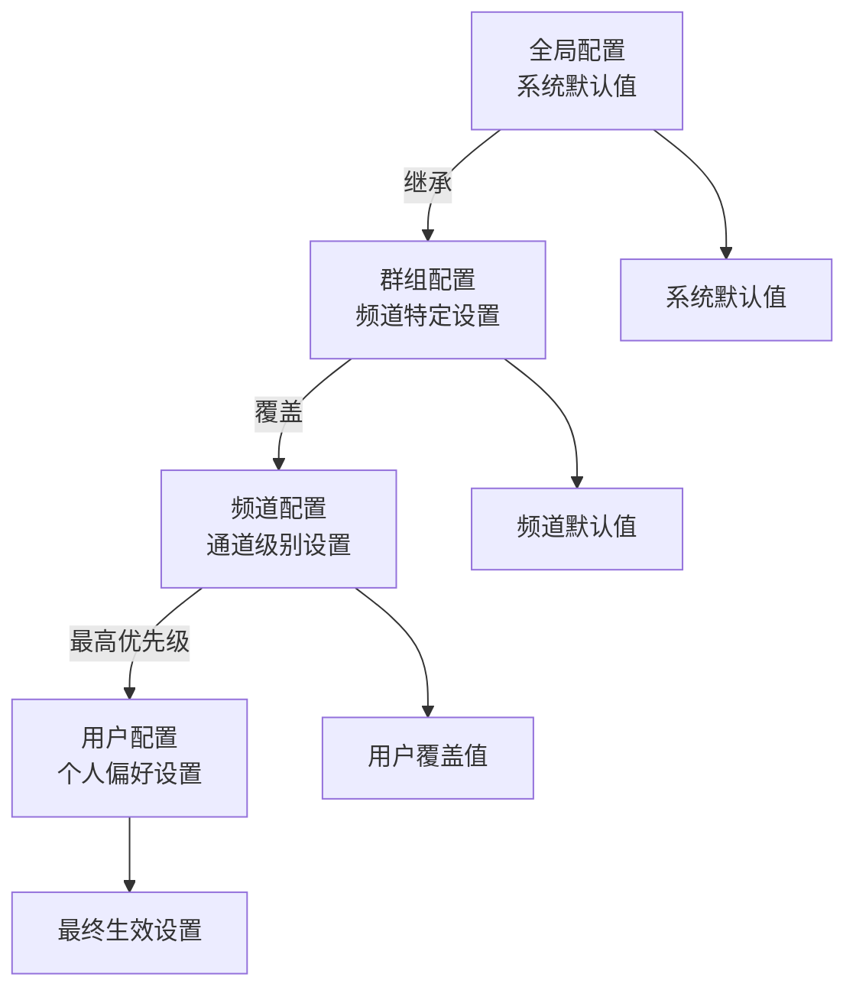
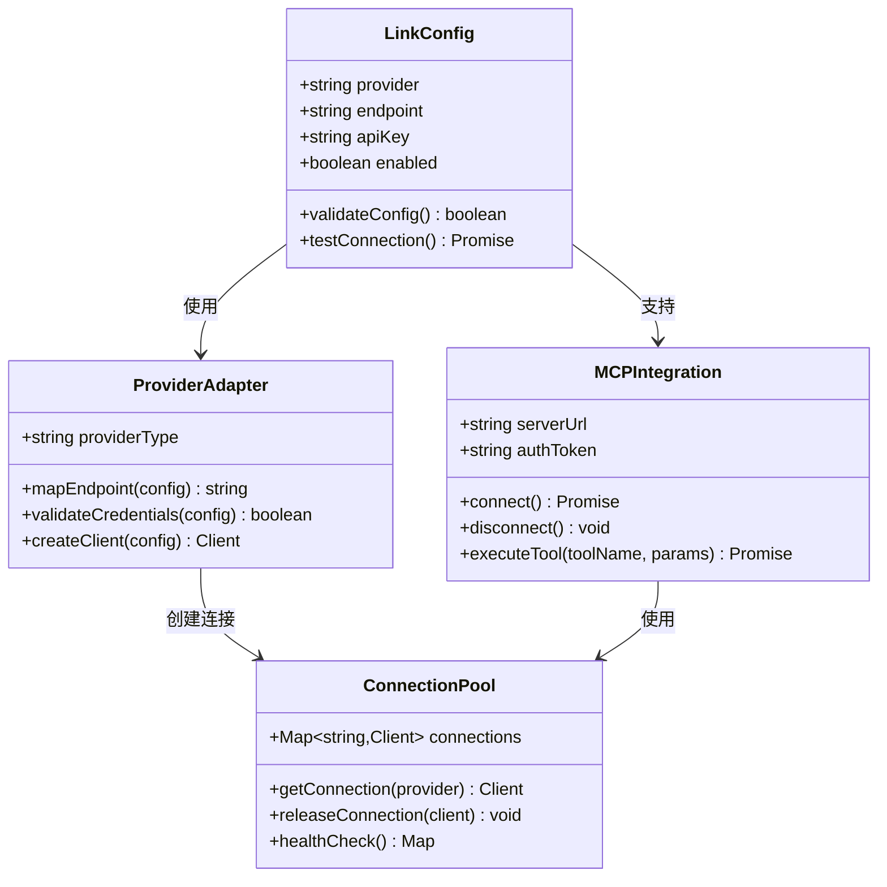
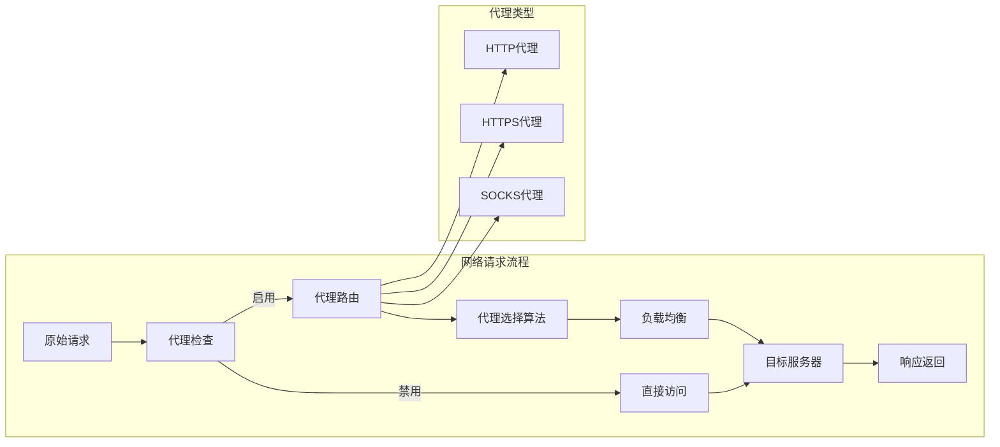
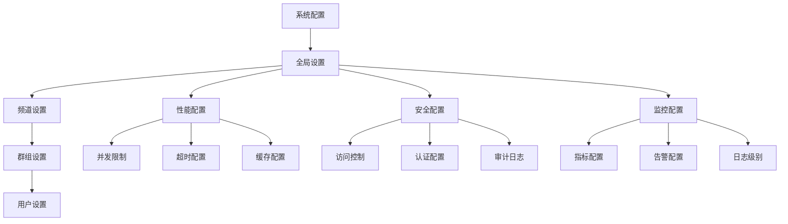
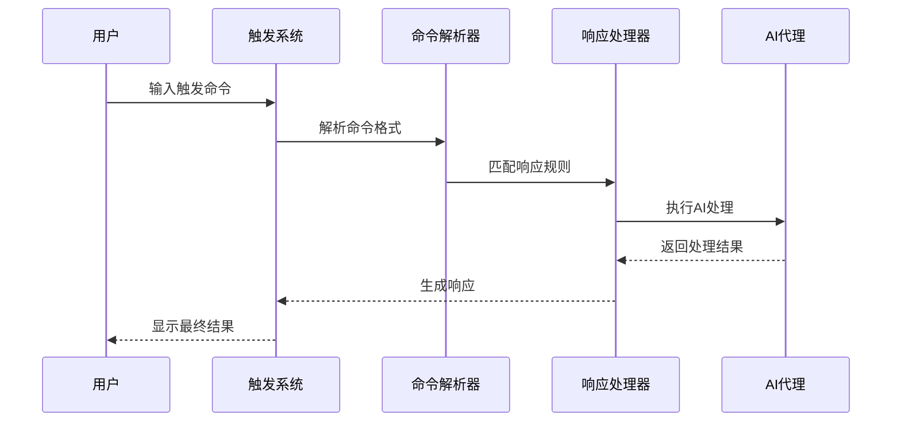
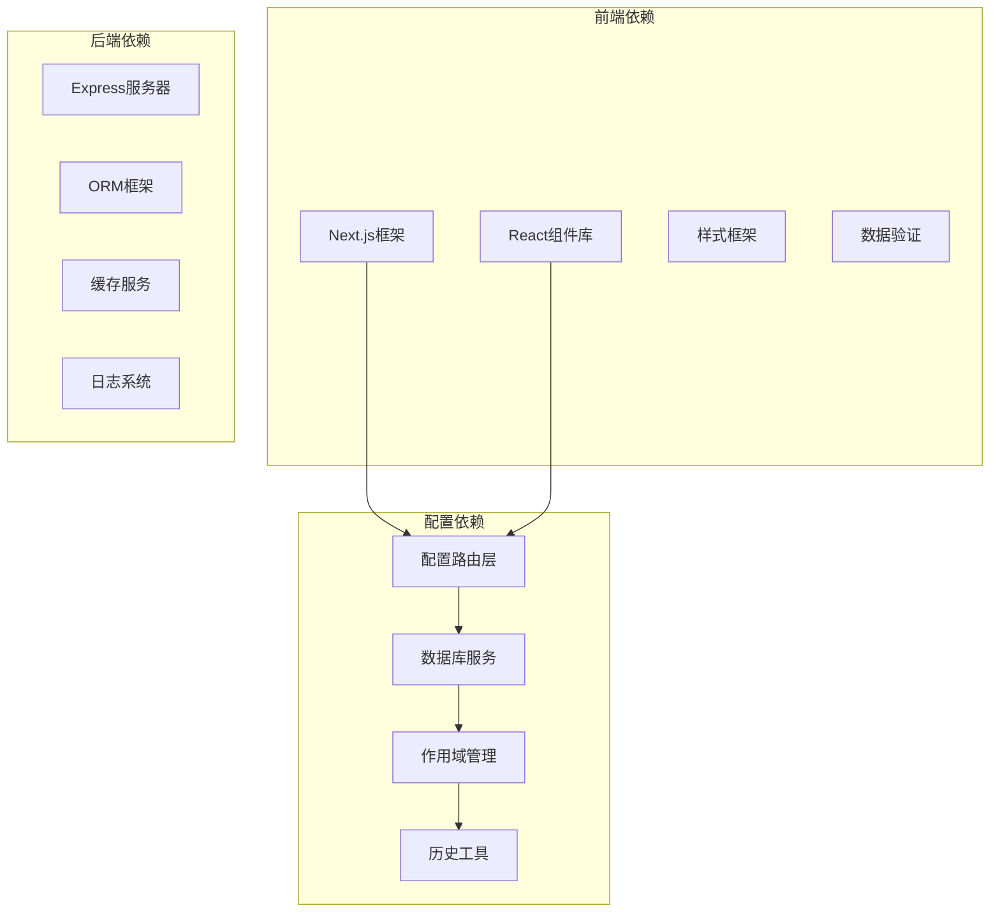

# 设置管理页面

<cite>
**本文档引用的文件**
- [frontend/app/settings/page.tsx](file://frontend/app/settings/page.tsx)
- [frontend/components/settings/SettingsSection.tsx](file://frontend/components/settings/SettingsSection.tsx)
- [frontend/lib/api.ts](file://frontend/lib/api.ts)
- [src/services/routes/configRoutes.js](file://src/services/routes/configRoutes.js)
- [src/services/storage/DatabaseService.js](file://src/services/storage/DatabaseService.js)
- [src/core/utils/history.js](file://src/core/utils/history.js)
- [src/services/proxy/ProxyService.js](file://src/services/proxy/ProxyService.js)
- [src/services/scope/ScopeManager.js](file://src/services/scope/ScopeManager.js)
- [src/services/preset/PresetManager.js](file://src/services/preset/PresetManager.js)
- [src/middleware/routeFactory.js](file://src/middleware/routeFactory.js)
</cite>

## 目录
1. [简介](#简介)
2. [项目结构](#项目结构)
3. [核心组件](#核心组件)
4. [架构概览](#架构概览)
5. [详细组件分析](#详细组件分析)
6. [依赖关系分析](#依赖关系分析)
7. [性能考虑](#性能考虑)
8. [故障排除指南](#故障排除指南)
9. [结论](#结论)

## 简介

设置管理页面是ChatGPT插件系统的核心配置中心，为用户提供统一的系统配置界面。该页面实现了多层次的配置管理功能，包括上下文设置、链接配置、代理设置、系统设置和触发设置等核心模块。

系统采用前后端分离架构，前端使用Next.js框架构建响应式用户界面，后端提供RESTful API接口支持配置数据的持久化存储和实时更新。配置管理遵循优先级继承原则，确保不同层级的配置能够正确合并和覆盖。

## 项目结构

设置管理页面位于前端应用的路由结构中，采用模块化的组织方式：

**图表来源**
- [frontend/app/settings/page.tsx](file://frontend/app/settings/page.tsx#L1-L50)
- [frontend/components/settings/SettingsSection.tsx](file://frontend/components/settings/SettingsSection.tsx#L1-L100)

**章节来源**
- [frontend/app/settings/page.tsx](file://frontend/app/settings/page.tsx#L1-L50)
- [frontend/components/settings/SettingsSection.tsx](file://frontend/components/settings/SettingsSection.tsx#L1-L100)

## 核心组件

设置管理页面由多个可复用的组件构成，提供一致的用户体验和灵活的配置能力：

### SettingsSection 组件
提供设置模块的基础容器，支持标题、描述、图标和操作按钮的自定义显示。

### SettingsRow 组件  
实现设置项的标准行布局，包含标签、描述文本和可编辑控件区域。

### SettingsGroup 组件
用于组织相关的设置项，支持分组标题和垂直间距控制。

### SettingsGrid 组件
提供响应式的网格布局，支持1-3列的自适应排列。

这些组件通过组合模式实现高度的可复用性和一致性，确保所有设置页面具有一致的视觉和交互体验。

**章节来源**
- [frontend/components/settings/SettingsSection.tsx](file://frontend/components/settings/SettingsSection.tsx#L8-L100)

## 架构概览

设置管理页面采用分层架构设计，从前端UI到后端服务形成完整的配置管理链路：

**图表来源**
- [frontend/lib/api.ts](file://frontend/lib/api.ts#L1-L100)
- [src/services/routes/configRoutes.js](file://src/services/routes/configRoutes.js#L1-L100)
- [src/services/storage/DatabaseService.js](file://src/services/storage/DatabaseService.js#L1-L100)

## 详细组件分析

### 上下文设置模块

上下文设置负责管理对话历史和上下文信息的配置，确保AI助手能够理解对话背景和历史交互。

#### 对话历史管理机制

**图表来源**
- [src/core/utils/history.js](file://src/core/utils/history.js#L1-L100)
- [src/services/storage/DatabaseService.js](file://src/services/storage/DatabaseService.js#L1-L100)

上下文设置的关键特性包括：
- 历史记录保留策略配置
- 上下文窗口大小限制
- 对话标记和分类管理
- 历史数据清理和归档机制

#### 配置优先级体系

上下文设置遵循严格的优先级继承机制：

**图表来源**
- [src/services/scope/ScopeManager.js](file://src/services/scope/ScopeManager.js#L1-L100)
- [src/services/preset/PresetManager.js](file://src/services/preset/PresetManager.js#L1-L100)

### 链接配置模块

链接配置模块管理外部服务的集成和连接，包括LLM提供商、MCP工具和其他第三方服务。

#### 外部服务集成架构

**图表来源**
- [src/services/routes/configRoutes.js](file://src/services/routes/configRoutes.js#L1-L100)
- [src/middleware/routeFactory.js](file://src/middleware/routeFactory.js#L1-L100)

#### 连接测试与健康检查

链接配置提供自动化的连接测试功能，确保外部服务的可用性：

- 实时连接状态监控
- 自动重连机制
- 超时和错误处理
- 性能指标收集

**章节来源**
- [src/services/routes/configRoutes.js](file://src/services/routes/configRoutes.js#L1-L200)
- [src/middleware/routeFactory.js](file://src/middleware/routeFactory.js#L1-L100)

### 代理设置模块

代理设置模块控制网络访问和流量转发，提供安全的网络通信环境。

#### 网络访问控制机制

**图表来源**
- [src/services/proxy/ProxyService.js](file://src/services/proxy/ProxyService.js#L1-L100)

代理设置的关键功能：
- 多协议代理支持（HTTP/HTTPS/SOCKS）
- 动态代理选择和负载均衡
- 认证和凭据管理
- 流量监控和日志记录

**章节来源**
- [src/services/proxy/ProxyService.js](file://src/services/proxy/ProxyService.js#L1-L150)

### 系统设置模块

系统设置模块管理全局参数配置，影响整个系统的运行行为。

#### 全局参数配置

系统设置涵盖以下核心配置类别：

- **性能参数**：并发限制、超时设置、缓存策略
- **安全参数**：访问控制、权限管理、审计日志
- **监控参数**：指标收集、告警阈值、日志级别
- **扩展参数**：插件配置、自定义脚本、第三方集成

#### 配置继承关系

**图表来源**
- [src/services/scope/ScopeManager.js](file://src/services/scope/ScopeManager.js#L1-L100)
- [src/services/preset/PresetManager.js](file://src/services/preset/PresetManager.js#L1-L100)

**章节来源**
- [src/services/scope/ScopeManager.js](file://src/services/scope/ScopeManager.js#L1-L100)
- [src/services/preset/PresetManager.js](file://src/services/preset/PresetManager.js#L1-L100)

### 触发设置模块

触发设置模块管理命令响应机制，定义AI助手的触发条件和响应行为。

#### 命令响应机制

**图表来源**
- [src/services/routes/configRoutes.js](file://src/services/routes/configRoutes.js#L1-L100)

触发设置的核心功能：
- 命令前缀和触发词配置
- 响应延迟和超时设置
- 条件触发和上下文感知
- 错误处理和降级机制

**章节来源**
- [src/services/routes/configRoutes.js](file://src/services/routes/configRoutes.js#L1-L150)

## 依赖关系分析

设置管理页面的依赖关系体现了清晰的分层架构和模块化设计：

**图表来源**
- [frontend/lib/api.ts](file://frontend/lib/api.ts#L1-L100)
- [src/services/routes/configRoutes.js](file://src/services/routes/configRoutes.js#L1-L100)
- [src/services/storage/DatabaseService.js](file://src/services/storage/DatabaseService.js#L1-L100)

**章节来源**
- [frontend/lib/api.ts](file://frontend/lib/api.ts#L1-L100)
- [src/services/routes/configRoutes.js](file://src/services/routes/configRoutes.js#L1-L100)

## 性能考虑

设置管理页面在设计时充分考虑了性能优化和用户体验：

### 前端性能优化
- **懒加载组件**：按需加载设置页面组件，减少初始包体积
- **虚拟滚动**：大量配置项的列表渲染优化
- **防抖输入**：配置变更的实时保存避免频繁请求
- **缓存策略**：本地缓存常用配置数据

### 后端性能优化
- **连接池管理**：数据库和外部服务连接的复用
- **批量操作**：多配置项的原子性更新
- **异步处理**：耗时配置操作的后台执行
- **资源清理**：定时清理过期配置和临时数据

## 故障排除指南

### 常见问题及解决方案

#### 配置保存失败
**症状**：设置更新后无法保存或显示错误
**排查步骤**：
1. 检查网络连接状态
2. 验证配置格式和必填字段
3. 查看浏览器开发者工具的网络请求
4. 检查后端服务日志

#### 外部服务连接异常
**症状**：LLM提供商或MCP工具连接失败
**排查步骤**：
1. 验证API密钥和认证信息
2. 检查网络代理设置
3. 测试服务端点可达性
4. 查看连接池状态和健康检查结果

#### 配置冲突问题
**症状**：设置项显示不一致或优先级异常
**排查步骤**：
1. 检查配置继承链路
2. 验证作用域层级设置
3. 清理缓存数据
4. 重置到默认配置

#### 性能问题
**症状**：设置页面加载缓慢或响应迟滞
**排查步骤**：
1. 分析前端Bundle大小
2. 检查数据库查询性能
3. 监控内存使用情况
4. 优化缓存策略

**章节来源**
- [src/services/storage/DatabaseService.js](file://src/services/storage/DatabaseService.js#L1-L100)
- [src/services/proxy/ProxyService.js](file://src/services/proxy/ProxyService.js#L1-L100)

## 结论

设置管理页面作为ChatGPT插件系统的核心配置中心，通过模块化的设计和清晰的架构实现了全面的系统管理功能。系统采用分层架构和优先级继承机制，确保配置的一致性和可维护性。

关键优势包括：
- **模块化设计**：独立的功能模块便于维护和扩展
- **优先级继承**：灵活的配置层次满足不同场景需求
- **前后端分离**：清晰的职责划分提升开发效率
- **性能优化**：多层面的性能考虑确保良好的用户体验

未来可以进一步增强的方向包括：配置导入导出功能、配置模板系统、更精细的权限控制、以及更丰富的配置可视化工具。