# 预设管理页面

<cite>
**本文档引用的文件**
- [PresetManager.js](file://src/services/preset/PresetManager.js)
- [BuiltinPresets.js](file://src/services/preset/BuiltinPresets.js)
- [presetRoutes.js](file://src/services/routes/presetRoutes.js)
- [api.ts](file://frontend/lib/api.ts)
- [types.ts](file://frontend/lib/types.ts)
- [button.tsx](file://frontend/components/ui/button.tsx)
- [dialog.tsx](file://frontend/components/ui/dialog.tsx)
- [table.tsx](file://frontend/components/ui/table.tsx)
- [form.tsx](file://frontend/components/ui/form.tsx)
- [input.tsx](file://frontend/components/ui/input.tsx)
</cite>

## 目录
1. [简介](#简介)
2. [项目结构](#项目结构)
3. [核心组件](#核心组件)
4. [架构概览](#架构概览)
5. [详细组件分析](#详细组件分析)
6. [依赖关系分析](#依赖关系分析)
7. [性能考虑](#性能考虑)
8. [故障排除指南](#故障排除指南)
9. [结论](#结论)

## 简介

预设管理页面是 ChatGPT 插件系统中的核心功能模块，负责管理 AI 助手的各种预设模板。该系统提供了完整的预设生命周期管理，包括创建、编辑、删除、复制和版本控制等功能。预设系统采用分类管理体系，支持通用助手、角色扮演、专项功能、群聊管理和学习教育等多个分类。

系统的核心特性包括：
- **分类体系**：将预设按照功能和用途进行分类管理
- **模板配置**：支持系统提示词、模型参数、人设配置、上下文配置和工具配置
- **批量操作**：支持从内置预设快速创建用户自定义预设
- **版本管理**：通过 ID 标识和时间戳实现预设版本控制
- **知识库集成**：支持将知识库内容动态注入到预设中

## 项目结构

预设管理系统采用前后端分离的架构设计，主要分为以下层次：

```mermaid
graph TB
subgraph "前端层"
UI[预设管理界面]
API[API 接口封装]
Types[类型定义]
end
subgraph "后端层"
Routes[路由层]
Manager[预设管理器]
Storage[(数据存储)]
end
subgraph "配置层"
Builtin[内置预设库]
Config[系统配置]
end
UI --> API
API --> Routes
Routes --> Manager
Manager --> Storage
Manager --> Builtin
Manager --> Config
```

**图表来源**
- [PresetManager.js](file://src/services/preset/PresetManager.js#L79-L115)
- [presetRoutes.js](file://src/services/routes/presetRoutes.js#L33-L40)

**章节来源**
- [PresetManager.js](file://src/services/preset/PresetManager.js#L1-L843)
- [BuiltinPresets.js](file://src/services/preset/BuiltinPresets.js#L1-L576)
- [presetRoutes.js](file://src/services/routes/presetRoutes.js#L1-L251)

## 核心组件

### 预设管理器 (PresetManager)

预设管理器是整个系统的核心组件，负责预设的完整生命周期管理：

**图表来源**
- [PresetManager.js](file://src/services/preset/PresetManager.js#L79-L86)
- [BuiltinPresets.js](file://src/services/preset/BuiltinPresets.js#L1-L576)
- [presetRoutes.js](file://src/services/routes/presetRoutes.js#L33-L36)

### 预设数据结构

系统定义了完整的预设数据结构，支持多维度的配置管理：

| 配置类别 | 字段名称 | 数据类型 | 描述 |
|---------|----------|----------|------|
| 基本信息 | id | string | 预设唯一标识符 |
| 基本信息 | name | string | 预设显示名称 |
| 基本信息 | description | string | 预设描述信息 |
| 核心配置 | systemPrompt | string | 系统提示词模板 |
| 模型配置 | modelParams | ModelParams | 模型参数设置 |
| 人设配置 | persona | PersonaConfig | 角色设定信息 |
| 上下文配置 | context | ContextConfig | 会话上下文管理 |
| 工具配置 | tools | ToolsConfig | 工具使用权限 |

**章节来源**
- [PresetManager.js](file://src/services/preset/PresetManager.js#L15-L78)

## 架构概览

预设管理系统的整体架构采用分层设计，确保了良好的可维护性和扩展性：

```mermaid
sequenceDiagram
participant Client as 客户端
participant API as API 层
participant Route as 路由层
participant Manager as 预设管理器
participant Storage as 存储层
Client->>API : 请求预设列表
API->>Route : 转发请求
Route->>Manager : 初始化管理器
Manager->>Storage : 读取预设数据
Storage-->>Manager : 返回预设列表
Manager-->>Route : 返回处理结果
Route-->>API : 返回响应
API-->>Client : 预设数据
Note over Client,Storage : 预设 CRUD 操作流程
```

**图表来源**
- [presetRoutes.js](file://src/services/routes/presetRoutes.js#L42-L50)
- [PresetManager.js](file://src/services/preset/PresetManager.js#L132-L150)

系统支持的预设分类体系：

| 分类标识 | 分类名称 | 图标 | 描述 | 预设数量 |
|---------|----------|------|------|----------|
| assistant | 通用助手 | 🤖 | 日常帮助和问答 | 1 |
| roleplay | 角色扮演 | 🎭 | 有趣的角色互动 | 5 |
| function | 专项功能 | 🔧 | 特定任务处理 | 3 |
| admin | 群聊管理 | 👮 | 群聊管理相关 | 1 |
| education | 学习教育 | 📚 | 学习辅导和知识 | 2 |

**章节来源**
- [BuiltinPresets.js](file://src/services/preset/BuiltinPresets.js#L536-L544)

## 详细组件分析

### 预设创建流程

预设创建过程包含了完整的验证和初始化逻辑：

```mermaid
flowchart TD
Start([开始创建预设]) --> Validate["验证输入数据"]
Validate --> Valid{"数据有效?"}
Valid --> |否| Error["返回错误信息"]
Valid --> |是| GenerateID["生成唯一ID"]
GenerateID --> CreateDefault["创建默认预设结构"]
CreateDefault --> MergeData["合并用户配置"]
MergeData --> Save["保存到存储"]
Save --> Success["返回创建结果"]
Error --> End([结束])
Success --> End
```

**图表来源**
- [PresetManager.js](file://src/services/preset/PresetManager.js#L287-L306)

### 系统提示词构建机制

系统实现了复杂的提示词构建和变量替换机制：

```mermaid
flowchart TD
Input([接收预设ID和上下文]) --> LoadPreset["加载预设配置"]
LoadPreset --> CheckContext{"检查上下文状态"}
CheckContext --> |已清除| CleanPrompt["生成干净提示词"]
CheckContext --> |正常| BuildPersona["构建人设信息"]
BuildPersona --> AddSystem["添加系统提示词"]
AddSystem --> ReplaceVars["变量替换处理"]
ReplaceVars --> AddKnowledge["添加知识库内容"]
AddKnowledge --> Output["返回完整提示词"]
CleanPrompt --> Output
```

**图表来源**
- [PresetManager.js](file://src/services/preset/PresetManager.js#L315-L412)

### 内置预设库

系统内置了丰富的预设模板，涵盖多个应用场景：

| 预设ID | 分类 | 名称 | 主要功能 |
|-------|------|------|----------|
| builtin_assistant | assistant | 智能助手 | 通用AI助手，擅长回答问题 |
| builtin_coder | assistant | 代码助手 | 专业编程助手，代码编写 |
| builtin_catgirl | roleplay | 可爱猫娘 | 活泼可爱的猫娘角色 |
| builtin_yuki_dilei | roleplay | Yuki 地雷系妹妹 | 强依恋的地雷系妹妹 |
| builtin_girlfriend | roleplay | 温柔女友 | 温柔体贴的女朋友角色 |
| builtin_buddy | roleplay | 好兄弟 | 幽默风趣的哥们角色 |
| builtin_translator | function | 翻译助手 | 多语言互译专业助手 |
| builtin_writer | function | 写作助手 | 创意写作和文案创作 |
| builtin_analyst | function | 数据分析师 | 数据分析和可视化 |
| builtin_group_manager | admin | 群管理员 | 群聊管理助手 |
| builtin_entertainer | roleplay | 群聊活宝 | 活跃群聊气氛 |
| builtin_tutor | education | 学习导师 | 耐心的学习辅导助手 |
| builtin_encyclopedia | education | 百科全书 | 知识丰富的百科问答 |

**章节来源**
- [BuiltinPresets.js](file://src/services/preset/BuiltinPresets.js#L5-L530)

### API 接口设计

预设管理系统的 API 接口遵循 RESTful 设计原则：

| HTTP 方法 | 路径 | 功能描述 | 请求体 | 响应体 |
|----------|------|----------|--------|--------|
| GET | /api/preset/list | 获取所有预设 | 无 | 预设数组 |
| GET | /api/preset/:id | 获取单个预设 | 无 | 预设对象 |
| POST | /api/preset/ | 创建新预设 | 预设配置 | 新预设对象 |
| PUT | /api/preset/:id | 更新预设 | 预设配置 | 更新后的预设 |
| DELETE | /api/preset/:id | 删除预设 | 无 | 删除结果 |
| POST | /api/preset/:id/default | 设置默认预设 | 无 | 成功状态 |
| GET | /api/preset/:id/prompt | 获取系统提示词 | 无 | 提示词内容 |
| POST | /api/preset/from-builtin/:builtinId | 从内置预设创建 | 覆盖配置 | 新预设对象 |
| GET | /api/presets/config | 获取预设配置 | 无 | 配置对象 |
| PUT | /api/presets/config | 更新预设配置 | 配置参数 | 成功状态 |
| GET | /api/presets/builtin | 获取内置预设 | 无 | 内置预设数组 |
| GET | /api/presets/categories | 获取分类列表 | 无 | 分类对象 |

**章节来源**
- [presetRoutes.js](file://src/services/routes/presetRoutes.js#L42-L192)

## 依赖关系分析

预设管理系统各组件之间的依赖关系如下：

```mermaid
graph TB
subgraph "外部依赖"
Express[Express.js]
FS[文件系统]
Crypto[Crypto 模块]
end
subgraph "内部模块"
PresetManager[PresetManager]
BuiltinPresets[BuiltinPresets]
PresetRoutes[presetRoutes]
Config[配置管理]
KnowledgeService[知识库服务]
end
subgraph "前端组件"
PresetAPI[presetsApi]
UIComponents[UI 组件]
end
Express --> PresetRoutes
PresetRoutes --> PresetManager
PresetManager --> BuiltinPresets
PresetManager --> Config
PresetManager --> KnowledgeService
PresetManager --> FS
PresetManager --> Crypto
PresetAPI --> PresetRoutes
UIComponents --> PresetAPI
```

**图表来源**
- [PresetManager.js](file://src/services/preset/PresetManager.js#L1-L14)
- [presetRoutes.js](file://src/services/routes/presetRoutes.js#L6-L9)

**章节来源**
- [PresetManager.js](file://src/services/preset/PresetManager.js#L1-L843)
- [presetRoutes.js](file://src/services/routes/presetRoutes.js#L1-L251)

## 性能考虑

预设管理系统在设计时充分考虑了性能优化：

### 内存管理
- 使用 Map 数据结构存储预设，提供 O(1) 的查找性能
- 实现懒加载机制，仅在需要时初始化知识库服务
- 上下文清除标记使用时间窗口和使用次数双重保护机制

### 数据持久化
- 采用 JSON 文件存储预设数据，确保数据持久性和可移植性
- 支持增量更新，避免不必要的文件写入操作
- 实现自动备份机制，防止数据丢失

### 缓存策略
- 内置预设缓存在内存中，减少重复加载开销
- 上下文状态使用临时缓存，及时清理过期数据
- 支持配置级别的缓存控制

## 故障排除指南

### 常见问题及解决方案

| 问题类型 | 症状 | 可能原因 | 解决方案 |
|----------|------|----------|----------|
| 预设加载失败 | 预设列表为空 | 数据文件损坏 | 检查 presets.json 文件完整性 |
| 预设创建失败 | 返回 500 错误 | 权限不足 | 检查文件系统写权限 |
| 系统提示词异常 | 提示词变量未替换 | 变量定义错误 | 验证变量格式和上下文数据 |
| 内置预设缺失 | 分类显示异常 | 预设定义错误 | 检查 BuiltinPresets.js 文件 |
| 默认预设冲突 | 设置默认预设失败 | 其他预设已设置默认 | 取消其他预设的默认状态 |

### 调试建议

1. **启用详细日志**：检查控制台输出的错误信息
2. **验证数据格式**：确保预设配置符合定义的数据结构
3. **检查文件权限**：确认数据目录具有正确的读写权限
4. **测试 API 接口**：使用 curl 或 Postman 验证接口功能

**章节来源**
- [PresetManager.js](file://src/services/preset/PresetManager.js#L140-L142)
- [presetRoutes.js](file://src/services/routes/presetRoutes.js#L117-L142)

## 结论

预设管理页面是一个功能完善、架构清晰的预设管理系统。系统通过合理的分层设计和模块化组织，实现了预设的全生命周期管理。其核心优势包括：

1. **完整的功能覆盖**：从基本的 CRUD 操作到高级的系统提示词构建
2. **灵活的配置管理**：支持多维度的预设配置和动态变量替换
3. **强大的扩展性**：内置预设库和分类体系便于功能扩展
4. **良好的用户体验**：直观的界面设计和完善的错误处理机制

该系统为 AI 助手的个性化配置提供了坚实的技术基础，能够满足不同场景下的预设管理需求。通过持续的优化和扩展，预设管理系统将继续为用户提供更好的服务体验。