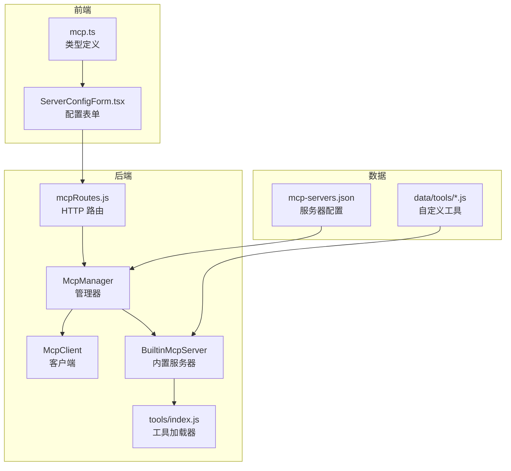
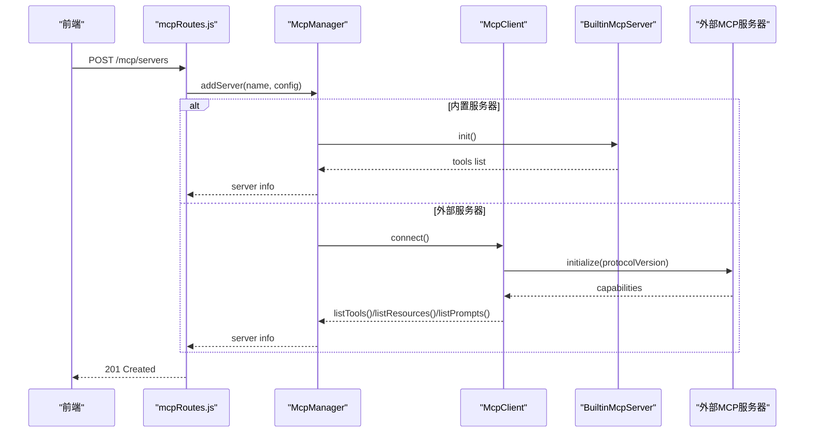
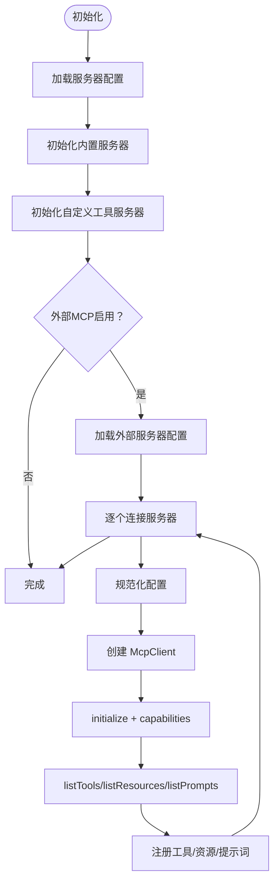
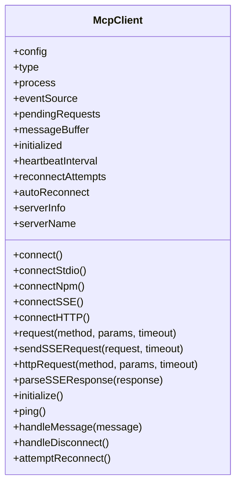
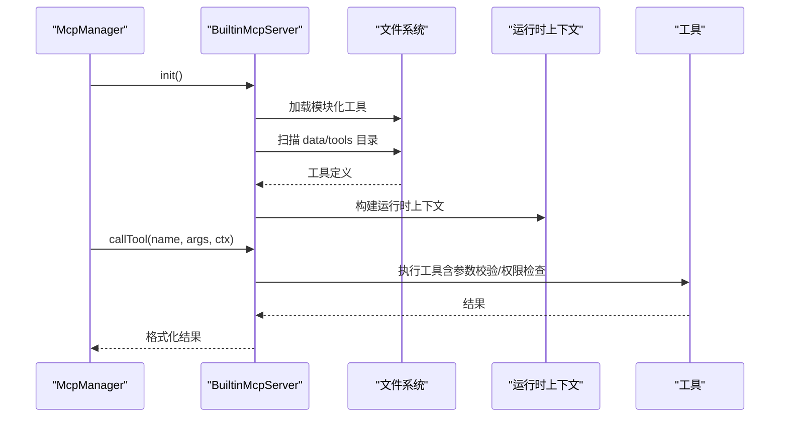
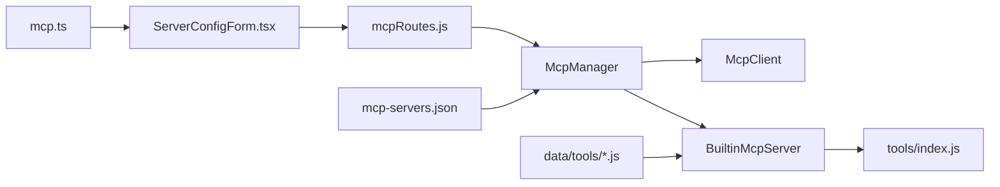

# MCP 协议实现

<cite>
**本文引用的文件**
- [McpManager.js](file://src/mcp/McpManager.js)
- [McpClient.js](file://src/mcp/McpClient.js)
- [BuiltinMcpServer.js](file://src/mcp/BuiltinMcpServer.js)
- [tools/index.js](file://src/mcp/tools/index.js)
- [mcpRoutes.js](file://src/services/routes/mcpRoutes.js)
- [mcp.ts](file://frontend/types/mcp.ts)
- [ServerConfigForm.tsx](file://frontend/components/mcp/ServerConfigForm.tsx)
- [mcp-servers.json](file://data/mcp-servers.json)
- [example_tool.js](file://data/tools/example_tool.js)
- [basic.js](file://src/mcp/tools/basic.js)
</cite>

## 目录
1. [简介](#简介)
2. [项目结构](#项目结构)
3. [核心组件](#核心组件)
4. [架构总览](#架构总览)
5. [详细组件分析](#详细组件分析)
6. [依赖关系分析](#依赖关系分析)
7. [性能考虑](#性能考虑)
8. [故障排除指南](#故障排除指南)
9. [结论](#结论)
10. [附录](#附录)

## 简介
本技术文档围绕 MCP（Model Context Protocol）协议在本项目中的实现进行系统化说明，涵盖协议核心概念、通信机制、数据格式、管理器职责、客户端实现、内置服务器架构与工具发现机制。同时提供协议配置示例、连接测试方法与故障排除指南，并说明协议版本兼容性与扩展点。

## 项目结构
本项目采用“后端服务 + 前端管理界面”的双端架构：
- 后端核心位于 src/mcp，包含管理器、客户端、内置服务器与工具集合
- 前端位于 frontend，提供 MCP 服务器配置、工具管理与监控界面
- 数据存储位于 data，包含 MCP 服务器配置文件与自定义工具脚本

图表来源
- [McpManager.js](file://src/mcp/McpManager.js#L27-L1268)
- [McpClient.js](file://src/mcp/McpClient.js#L37-L1002)
- [BuiltinMcpServer.js](file://src/mcp/BuiltinMcpServer.js#L218-L1462)
- [tools/index.js](file://src/mcp/tools/index.js#L1-L181)
- [mcpRoutes.js](file://src/services/routes/mcpRoutes.js#L1-L249)
- [mcp.ts](file://frontend/types/mcp.ts#L1-L530)
- [ServerConfigForm.tsx](file://frontend/components/mcp/ServerConfigForm.tsx#L1-L348)
- [mcp-servers.json](file://data/mcp-servers.json#L1-L8)
- [example_tool.js](file://data/tools/example_tool.js#L1-L43)

章节来源
- [McpManager.js](file://src/mcp/McpManager.js#L1-L1268)
- [McpClient.js](file://src/mcp/McpClient.js#L1-L1002)
- [BuiltinMcpServer.js](file://src/mcp/BuiltinMcpServer.js#L1-L1462)
- [tools/index.js](file://src/mcp/tools/index.js#L1-L181)
- [mcpRoutes.js](file://src/services/routes/mcpRoutes.js#L1-L249)
- [mcp.ts](file://frontend/types/mcp.ts#L1-L530)
- [ServerConfigForm.tsx](file://frontend/components/mcp/ServerConfigForm.tsx#L1-L348)
- [mcp-servers.json](file://data/mcp-servers.json#L1-L8)
- [example_tool.js](file://data/tools/example_tool.js#L1-L43)

## 核心组件
- McpManager：统一管理内置工具、自定义 JS 工具与外部 MCP 服务器，负责工具注册、资源发现、提示词管理、缓存与日志、并行/批量工具调用等
- McpClient：实现多种传输类型的 MCP 客户端连接（stdio、npm/npx、SSE、HTTP），支持心跳、自动重连、请求/响应编解码与通知处理
- BuiltinMcpServer：内置 MCP 服务器，负责模块化工具加载、JS 工具加载、自定义工具执行、权限校验、危险工具拦截、运行时上下文构建与结果格式化
- tools/index.js：按类别组织工具，支持热重载与过滤控制
- mcpRoutes.js：提供 MCP 服务器管理的 HTTP API（增删改查、导入、资源读取、提示词获取）
- 前端类型与表单：mcp.ts 定义协议类型，ServerConfigForm.tsx 提供可视化配置与校验

章节来源
- [McpManager.js](file://src/mcp/McpManager.js#L27-L1268)
- [McpClient.js](file://src/mcp/McpClient.js#L37-L1002)
- [BuiltinMcpServer.js](file://src/mcp/BuiltinMcpServer.js#L218-L1462)
- [tools/index.js](file://src/mcp/tools/index.js#L1-L181)
- [mcpRoutes.js](file://src/services/routes/mcpRoutes.js#L1-L249)
- [mcp.ts](file://frontend/types/mcp.ts#L1-L530)
- [ServerConfigForm.tsx](file://frontend/components/mcp/ServerConfigForm.tsx#L1-L348)

## 架构总览
MCP 协议实现采用“集中管理 + 多源接入”的架构：
- 管理层：McpManager 统一维护工具、资源、提示词与服务器状态，提供工具调用入口与缓存策略
- 传输层：McpClient 支持多种传输类型，负责与外部 MCP 服务器建立连接、发送 JSON-RPC 请求、接收通知与响应
- 服务层：BuiltinMcpServer 提供内置工具与自定义 JS 工具的执行环境，内置权限与安全控制
- 路由层：mcpRoutes.js 提供 REST API，前端通过表单提交配置并通过 API 管理服务器
- 类型层：mcp.ts 定义前后端一致的数据结构，保证配置与响应的类型安全

图表来源
- [mcpRoutes.js](file://src/services/routes/mcpRoutes.js#L32-L69)
- [McpManager.js](file://src/mcp/McpManager.js#L311-L405)
- [McpClient.js](file://src/mcp/McpClient.js#L760-L800)
- [BuiltinMcpServer.js](file://src/mcp/BuiltinMcpServer.js#L234-L253)

## 详细组件分析

### McpManager：核心管理器
职责概览
- 服务器连接管理：加载/保存服务器配置，规范化配置格式，连接/断开/重连外部服务器
- 工具注册与发现：聚合内置工具、JS 工具与外部工具，支持过滤与白名单/黑名单控制
- 资源与提示词管理：统一注册与查询资源与提示词，支持跨服务器访问
- 工具调用：提供单次与批量调用接口，支持缓存、日志、统计与错误处理
- 热重载：支持模块化工具与 JS 工具的热重载，文件监听器自动触发重载

关键流程
- 初始化：先初始化内置服务器与自定义工具服务器，再按配置加载外部服务器
- 连接：标准化配置，创建 McpClient 并执行 initialize，随后拉取工具/资源/提示词
- 调用：根据工具来源选择内置执行或外部调用；内置工具执行前进行危险工具拦截与权限校验

图表来源
- [McpManager.js](file://src/mcp/McpManager.js#L106-L139)
- [McpManager.js](file://src/mcp/McpManager.js#L262-L288)
- [McpManager.js](file://src/mcp/McpManager.js#L296-L405)

章节来源
- [McpManager.js](file://src/mcp/McpManager.js#L27-L1268)

### McpClient：MCP 客户端实现
职责概览
- 多传输类型支持：stdio、npm/npx、SSE、HTTP
- 连接生命周期：spawn 子进程、npm 包启动、SSE 连接、HTTP 请求
- JSON-RPC 交互：请求/响应编解码、pendingRequests 管理、超时与错误处理
- 心跳与自动重连：定期 ping、断线重连、指数退避
- SSE 特殊处理：endpoint 事件、POST + 202 Accepted + SSE 流响应

图表来源
- [McpClient.js](file://src/mcp/McpClient.js#L37-L1002)

章节来源
- [McpClient.js](file://src/mcp/McpClient.js#L37-L1002)

### 内置 MCP 服务器：架构与工具发现
职责概览
- 工具加载：按类别动态加载模块化工具，支持热重载；扫描 data/tools 目录加载 JS 工具
- 工具执行：构建运行时上下文（Bot、事件、权限、服务等），执行参数校验与权限检查，格式化结果
- 安全控制：危险工具拦截、权限校验（群主/管理员）、目标用户权限检查
- 文件监听：自动监听工具目录变化并触发完全重载

图表来源
- [BuiltinMcpServer.js](file://src/mcp/BuiltinMcpServer.js#L234-L253)
- [BuiltinMcpServer.js](file://src/mcp/BuiltinMcpServer.js#L457-L503)
- [BuiltinMcpServer.js](file://src/mcp/BuiltinMcpServer.js#L928-L1221)

章节来源
- [BuiltinMcpServer.js](file://src/mcp/BuiltinMcpServer.js#L218-L1462)
- [tools/index.js](file://src/mcp/tools/index.js#L68-L113)

### 工具加载与分类
- 模块化工具：按类别组织，支持启用/禁用类别与工具，热重载
- 自定义 JS 工具：data/tools 目录下的 .js 文件，要求默认导出包含 name 与 run 函数
- YAML 自定义工具：通过配置注入，支持 handler 代码执行

章节来源
- [tools/index.js](file://src/mcp/tools/index.js#L1-L181)
- [example_tool.js](file://data/tools/example_tool.js#L1-L43)
- [BuiltinMcpServer.js](file://src/mcp/BuiltinMcpServer.js#L609-L676)

### 前端类型与配置表单
- 类型定义：mcp.ts 定义传输类型、服务器状态、工具、资源、提示词、API 响应等类型
- 配置表单：ServerConfigForm.tsx 提供可视化配置，支持类型选择、字段校验与 JSON 格式校验

章节来源
- [mcp.ts](file://frontend/types/mcp.ts#L1-L530)
- [ServerConfigForm.tsx](file://frontend/components/mcp/ServerConfigForm.tsx#L1-L348)

## 依赖关系分析
- McpManager 依赖 McpClient 与 BuiltinMcpServer，负责统一调度与状态管理
- BuiltinMcpServer 依赖 tools/index.js 进行模块化工具加载，依赖 data/tools 目录加载 JS 工具
- mcpRoutes.js 依赖 McpManager 提供的 API 能力
- 前端通过 mcp.ts 与 ServerConfigForm.tsx 与后端交互

图表来源
- [McpManager.js](file://src/mcp/McpManager.js#L7-L8)
- [BuiltinMcpServer.js](file://src/mcp/BuiltinMcpServer.js#L10-L18)
- [mcpRoutes.js](file://src/services/routes/mcpRoutes.js#L6-L6)
- [mcp.ts](file://frontend/types/mcp.ts#L1-L530)
- [ServerConfigForm.tsx](file://frontend/components/mcp/ServerConfigForm.tsx#L1-L348)
- [mcp-servers.json](file://data/mcp-servers.json#L1-L8)
- [example_tool.js](file://data/tools/example_tool.js#L1-L43)

章节来源
- [McpManager.js](file://src/mcp/McpManager.js#L1-L1268)
- [McpClient.js](file://src/mcp/McpClient.js#L1-L1002)
- [BuiltinMcpServer.js](file://src/mcp/BuiltinMcpServer.js#L1-L1462)
- [mcpRoutes.js](file://src/services/routes/mcpRoutes.js#L1-L249)

## 性能考虑
- 工具调用缓存：支持按工具名+参数键缓存结果，避免重复调用
- 并行与批处理：支持并行调用多个工具，以及带依赖的批处理执行
- 心跳与断线重连：定期心跳检测，断线自动重连，指数退避降低压力
- 日志与统计：工具调用日志与统计上报，便于性能分析与问题定位

章节来源
- [McpManager.js](file://src/mcp/McpManager.js#L769-L867)
- [McpManager.js](file://src/mcp/McpManager.js#L875-L940)
- [McpClient.js](file://src/mcp/McpClient.js#L473-L491)

## 故障排除指南
常见问题与解决步骤
- 连接失败
  - 检查服务器配置类型与必要字段（stdio 的 command、npm/npx 的 package、SSE/HTTP 的 url）
  - 查看日志中的连接错误与超时信息
  - 对于 npm 包，确认网络可达与包名格式正确
- 协议版本不兼容
  - 确认服务器支持协议版本 2024-11-05
  - 若服务器不支持，需升级或更换服务器
- 工具执行失败
  - 检查工具参数 Schema 与必填项
  - 对于危险工具，确认已开启允许危险操作
  - 检查权限（群主/管理员）与目标用户权限
- 资源/提示词不可用
  - 确认服务器支持对应能力（resources/prompts）
  - 检查服务器连接状态与工具列表更新

章节来源
- [mcpRoutes.js](file://src/services/routes/mcpRoutes.js#L44-L59)
- [McpClient.js](file://src/mcp/McpClient.js#L762-L763)
- [BuiltinMcpServer.js](file://src/mcp/BuiltinMcpServer.js#L932-L978)

## 结论
本实现以 McpManager 为核心，结合 McpClient 与 BuiltinMcpServer，提供了对 MCP 协议的完整支持，覆盖多传输类型连接、工具与资源管理、安全控制与权限校验、热重载与监控。前端通过类型定义与配置表单提升了易用性与一致性。建议在生产环境中启用缓存、心跳与日志统计，并严格控制危险工具与权限范围。

## 附录

### 协议版本与兼容性
- 协议版本：2024-11-05
- 兼容性说明：客户端在 initialize 时声明协议版本，服务器需支持该版本；若不兼容，初始化失败

章节来源
- [McpClient.js](file://src/mcp/McpClient.js#L762-L763)

### 配置示例
- 外部服务器配置示例（JSON）
  - 参考文件：data/mcp-servers.json
  - 示例内容：包含一个 npm 类型的服务器配置（包名为 @upstash/context7-mcp）

章节来源
- [mcp-servers.json](file://data/mcp-servers.json#L1-L8)

### 连接测试方法
- 通过前端配置表单添加服务器，选择传输类型并填写必要字段
- 使用 API 路由测试连接与工具列表
- 观察日志与 SSE 事件流（若使用 SSE）

章节来源
- [ServerConfigForm.tsx](file://frontend/components/mcp/ServerConfigForm.tsx#L1-L348)
- [mcpRoutes.js](file://src/services/routes/mcpRoutes.js#L1-L249)

### 扩展点
- 新增传输类型：在 McpClient 中扩展 connectXxx 方法
- 新增工具类别：在 tools/index.js 中新增类别与导出
- 新增内置工具：在对应类别文件中添加工具定义
- 自定义 JS 工具：在 data/tools 目录下新增 .js 文件并导出工具定义

章节来源
- [McpClient.js](file://src/mcp/McpClient.js#L86-L113)
- [tools/index.js](file://src/mcp/tools/index.js#L7-L27)
- [example_tool.js](file://data/tools/example_tool.js#L1-L43)