# Bot信息与扩展工具

<cite>
**本文档引用的文件**
- [README.md](file://README.md)
- [index.js](file://index.js)
- [config.js](file://config/config.js)
- [tools/index.js](file://src/mcp/tools/index.js)
- [tools/bot.js](file://src/mcp/tools/bot.js)
- [tools/extra.js](file://src/mcp/tools/extra.js)
- [tools/basic.js](file://src/mcp/tools/basic.js)
- [tools/user.js](file://src/mcp/tools/user.js)
- [tools/group.js](file://src/mcp/tools/group.js)
- [tools/message.js](file://src/mcp/tools/message.js)
- [tools/helpers.js](file://src/mcp/tools/helpers.js)
- [tools/schedule.js](file://src/mcp/tools/schedule.js)
- [data/tools/README.md](file://data/tools/README.md)
- [data/tools/example_tool.js](file://data/tools/example_tool.js)
- [docs/TOOLS.md](file://docs/TOOLS.md)
</cite>

## 目录
1. [简介](#简介)
2. [项目结构](#项目结构)
3. [核心组件](#核心组件)
4. [架构概览](#架构概览)
5. [详细组件分析](#详细组件分析)
6. [依赖关系分析](#依赖关系分析)
7. [性能考虑](#性能考虑)
8. [故障排除指南](#故障排除指南)
9. [结论](#结论)

## 简介

ChatAI Plugin 是一个功能强大的 Yunzai-Bot AI 聊天插件，集成了多种 LLM 模型和丰富的工具调用能力。该项目专注于提供全面的 Bot 信息查询和扩展工具功能，包括机器人状态查询、系统信息获取、天气查询、一言、骰子游戏、倒计时提醒、插画搜索等实用功能。

该插件采用 MCP (Model Context Protocol) 标准，支持 50+ 实用工具，具备统一管理聊天、预设、工具与长/短期记忆的能力，为 Yunzai 带来"全栈 AI"体验。

## 项目结构

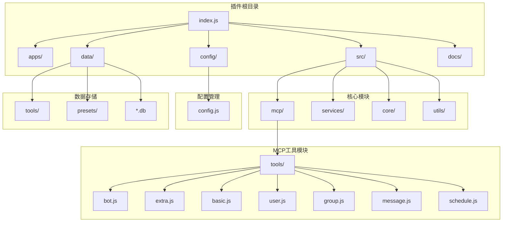

**图表来源**
- [index.js](file://index.js#L1-L258)
- [src/mcp/tools/index.js](file://src/mcp/tools/index.js#L1-L181)

**章节来源**
- [README.md](file://README.md#L356-L396)
- [index.js](file://index.js#L1-L258)

## 核心组件

### 工具管理系统

插件采用模块化的工具管理系统，按功能类别组织工具：

| 工具类别 | 工具数量 | 主要功能 |
|---------|---------|----------|
| Bot信息 | 3个 | 机器人登录信息、状态、好友列表查询 |
| 扩展工具 | 7个 | 天气查询、一言、骰子、倒计时、提醒、插画等 |
| 基础工具 | 9个 | 时间获取、工具列表、环境信息等 |
| 用户信息 | 3个 | 获取用户信息、好友列表、点赞等 |
| 群组信息 | 4个 | 获取群信息、成员列表等 |
| 消息操作 | 7个 | 发送消息、@用户、聊天记录等 |
| 群管理 | 6个 | 禁言、踢人、设置群名片等 |

### 配置管理系统

插件提供完整的配置管理功能，支持 YAML 配置文件的动态加载和热重载：

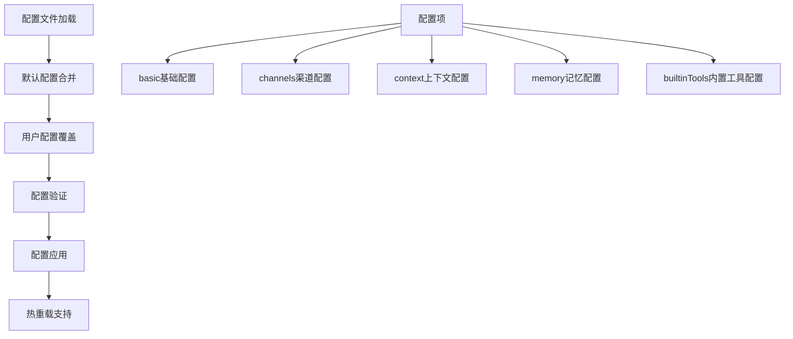

**图表来源**
- [config/config.js](file://config/config.js#L18-L38)
- [config/config.js](file://config/config.js#L62-L586)

**章节来源**
- [config/config.js](file://config/config.js#L1-L631)
- [src/mcp/tools/index.js](file://src/mcp/tools/index.js#L29-L58)

## 架构概览

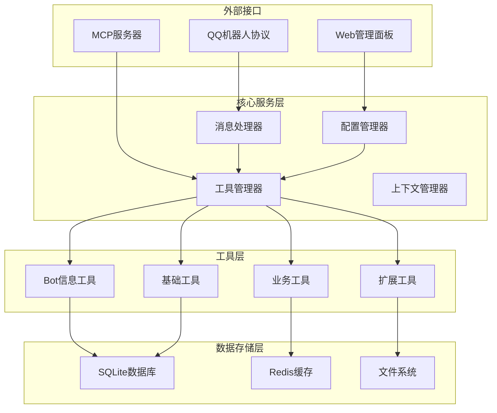

**图表来源**
- [index.js](file://index.js#L17-L112)
- [src/mcp/tools/index.js](file://src/mcp/tools/index.js#L68-L113)

## 详细组件分析

### Bot信息工具

Bot信息工具提供机器人自身状态查询和系统信息获取功能：

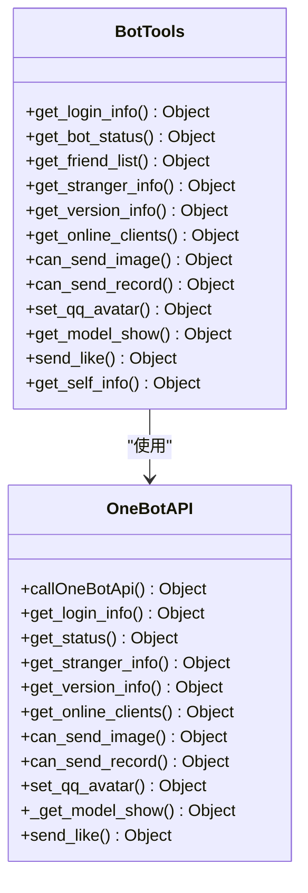

**图表来源**
- [src/mcp/tools/bot.js](file://src/mcp/tools/bot.js#L25-L481)

#### 核心功能特性

1. **多协议支持**: 支持 NapCat 和 icqq 两种协议类型的 Bot 信息 API
2. **状态查询**: 获取机器人在线状态、好友数量、群组数量等
3. **版本信息**: 查询机器人版本、协议版本等详细信息
4. **能力检测**: 检查机器人是否可以发送图片、语音等
5. **安全操作**: 提供危险操作的保护机制

**章节来源**
- [src/mcp/tools/bot.js](file://src/mcp/tools/bot.js#L1-L481)

### 扩展工具

扩展工具提供丰富的实用功能，包括天气查询、一言、骰子游戏等：

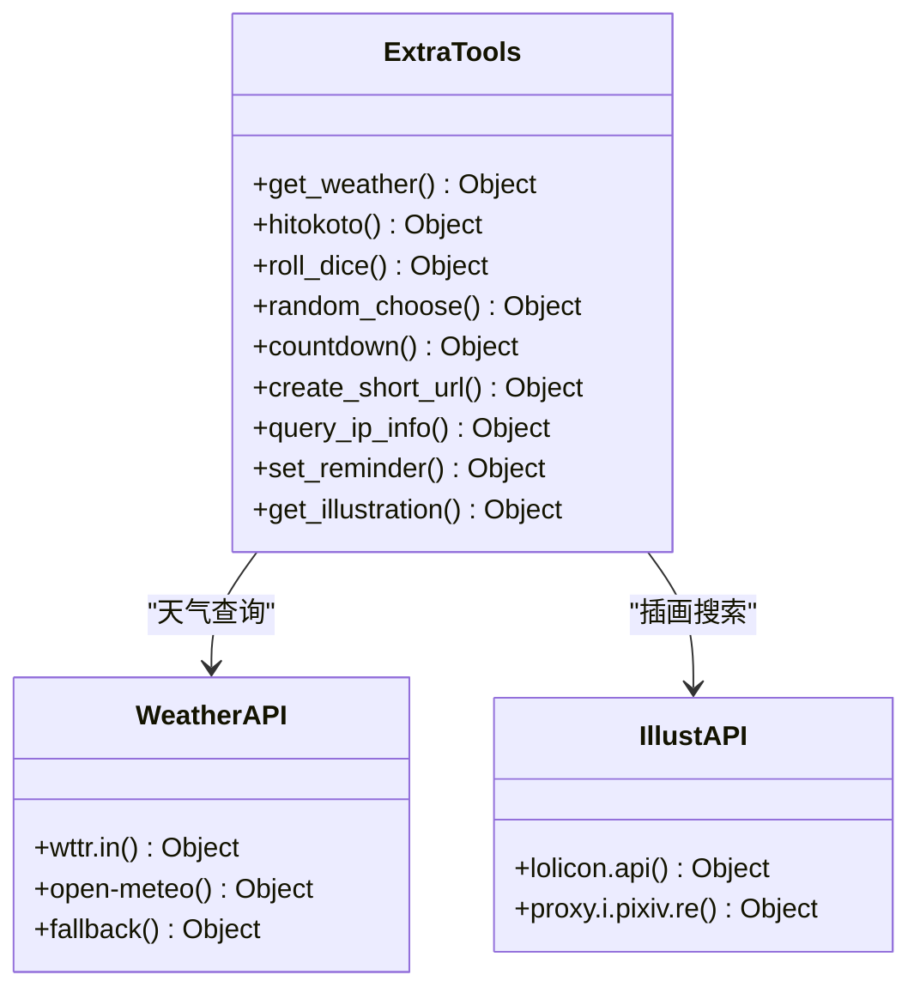

**图表来源**
- [src/mcp/tools/extra.js](file://src/mcp/tools/extra.js#L9-L628)

#### 天气查询工具

天气查询工具支持多 API 源的自动切换：

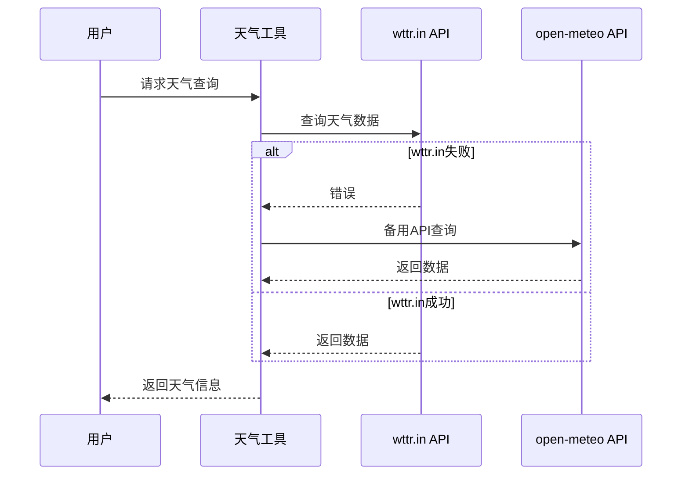

**图表来源**
- [src/mcp/tools/extra.js](file://src/mcp/tools/extra.js#L32-L143)

#### 插画搜索工具

插画搜索工具提供动漫插画的获取和展示功能：

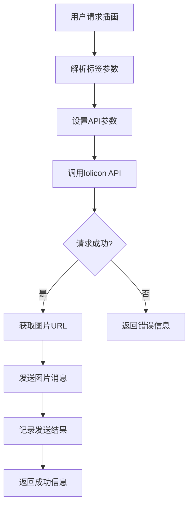

**图表来源**
- [src/mcp/tools/extra.js](file://src/mcp/tools/extra.js#L553-L626)

**章节来源**
- [src/mcp/tools/extra.js](file://src/mcp/tools/extra.js#L1-L628)

### 工具加载器

工具加载器负责动态加载和管理各类工具：

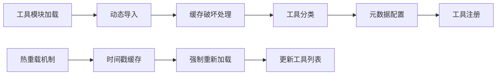

**图表来源**
- [src/mcp/tools/index.js](file://src/mcp/tools/index.js#L68-L113)

**章节来源**
- [src/mcp/tools/index.js](file://src/mcp/tools/index.js#L1-L181)

### 消息处理系统

消息处理系统提供完整的消息发送和处理功能：

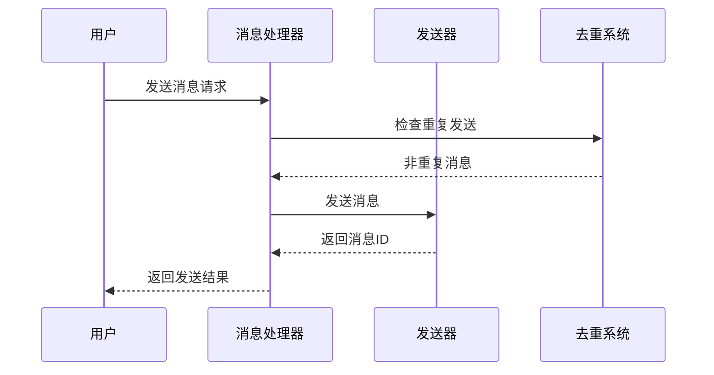

**图表来源**
- [src/mcp/tools/message.js](file://src/mcp/tools/message.js#L41-L77)

**章节来源**
- [src/mcp/tools/message.js](file://src/mcp/tools/message.js#L1-L800)

## 依赖关系分析

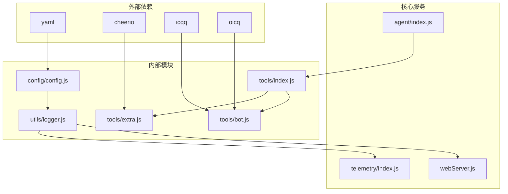

**图表来源**
- [index.js](file://index.js#L1-L10)
- [src/mcp/tools/helpers.js](file://src/mcp/tools/helpers.js#L1-L8)

**章节来源**
- [index.js](file://index.js#L1-L258)

## 性能考虑

### 工具执行优化

1. **并发执行**: 工具调用支持并行执行，提高响应速度
2. **缓存机制**: 使用时间戳避免模块缓存问题
3. **内存管理**: 及时清理过期的提醒和临时数据
4. **API 限流**: 对外部 API 调用进行合理的超时控制

### 内存使用优化

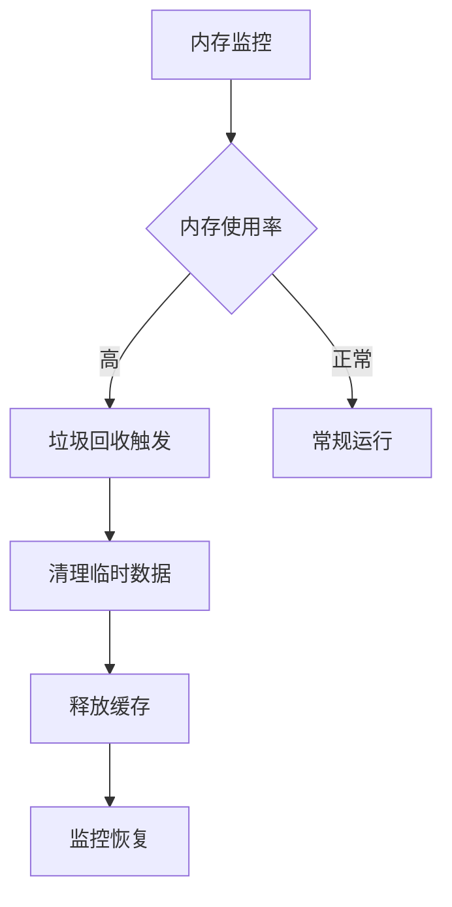

### 网络请求优化

1. **超时控制**: 所有外部 API 请求设置合理的超时时间
2. **重试机制**: 失败的请求自动重试，支持多个 API 源
3. **连接池**: 复用网络连接，减少连接建立开销

## 故障排除指南

### 常见问题及解决方案

#### 工具调用失败

**问题**: 工具调用返回错误
**解决方案**:
1. 检查工具是否在配置中启用
2. 验证工具参数格式是否正确
3. 查看调试日志获取详细错误信息

#### API 连接问题

**问题**: 天气查询、插画搜索等 API 调用失败
**解决方案**:
1. 检查网络连接是否正常
2. 验证 API 密钥配置
3. 尝试使用备用 API 源

#### 机器人状态异常

**问题**: 无法获取机器人状态信息
**解决方案**:
1. 确认机器人已正确登录
2. 检查协议适配器是否支持相关 API
3. 验证权限设置

**章节来源**
- [README.md](file://README.md#L665-L746)

## 结论

ChatAI Plugin 提供了一个完整、灵活且功能丰富的 Bot 扩展工具系统。通过模块化的架构设计和标准化的 MCP 协议，该插件能够轻松集成各种实用功能，满足不同场景下的需求。

主要优势包括：
- **全面的功能覆盖**: 涵盖 Bot 信息查询、天气、娱乐、实用工具等多个领域
- **灵活的配置管理**: 支持动态配置和热重载
- **良好的扩展性**: 易于添加自定义工具和功能
- **稳定的性能表现**: 优化的内存管理和网络请求处理

该插件为 Yunzai-Bot 用户提供了一个强大而易用的 AI 助手平台，能够显著提升机器人的智能化水平和用户体验。