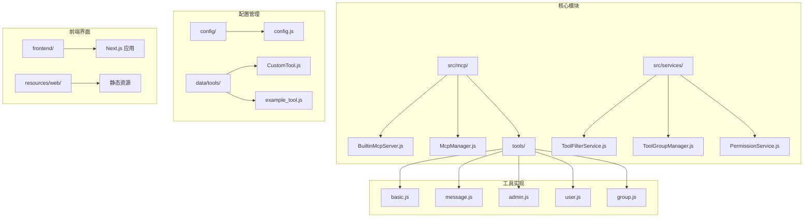
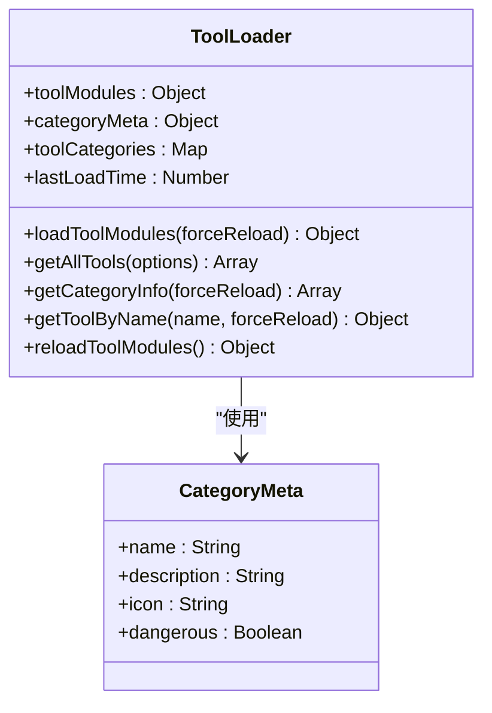
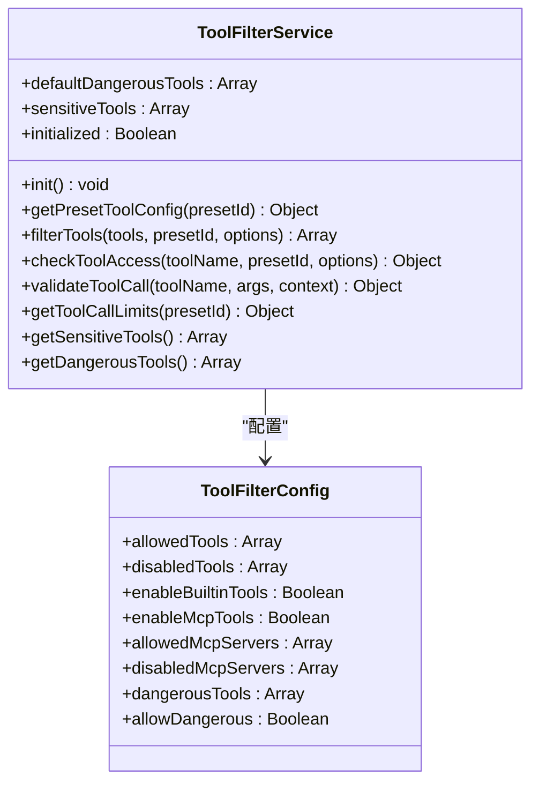
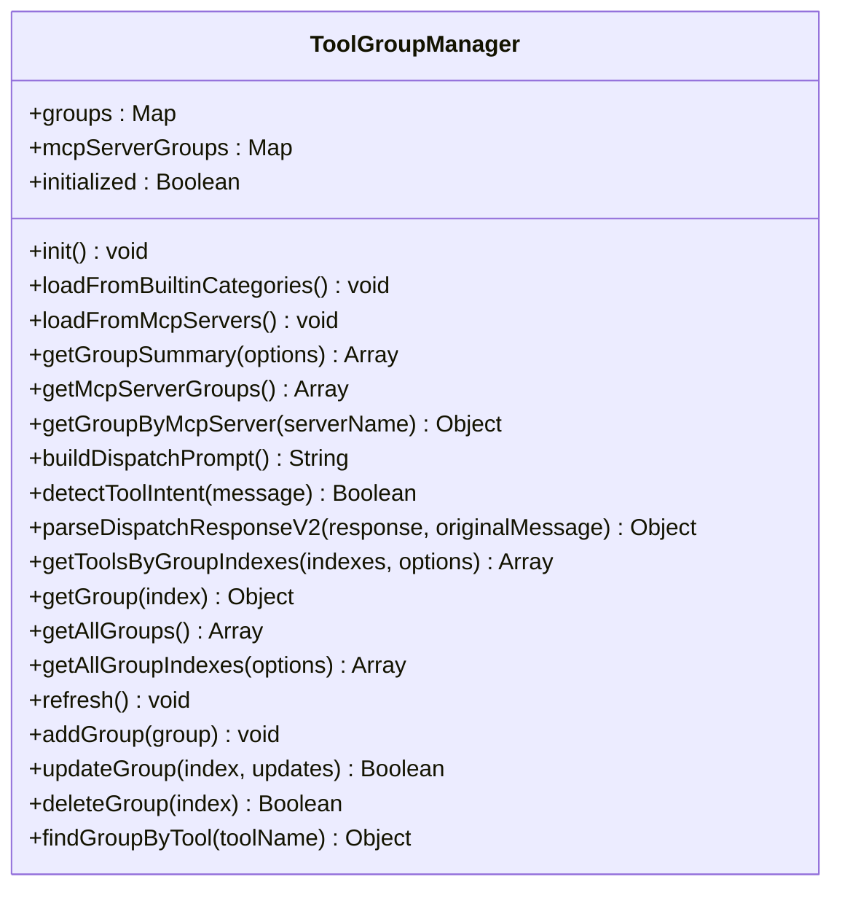
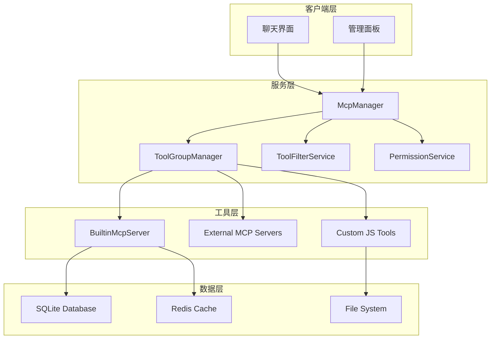
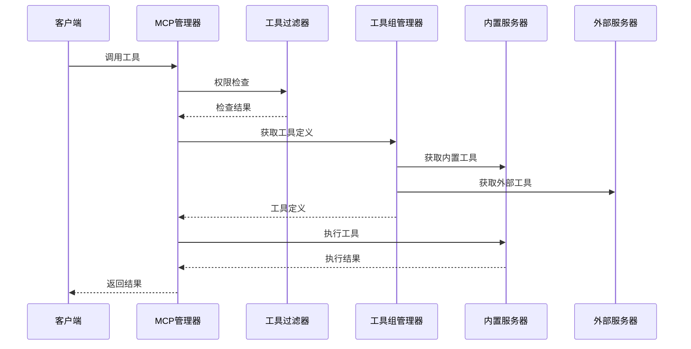
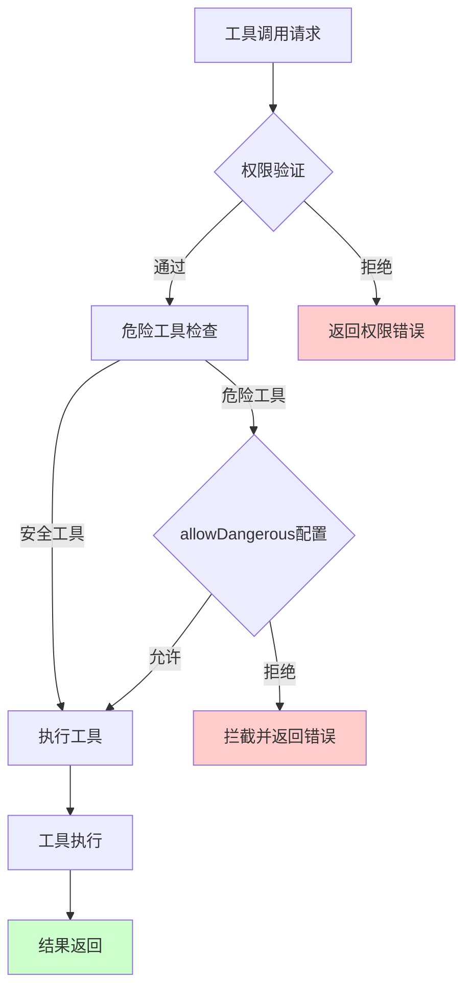
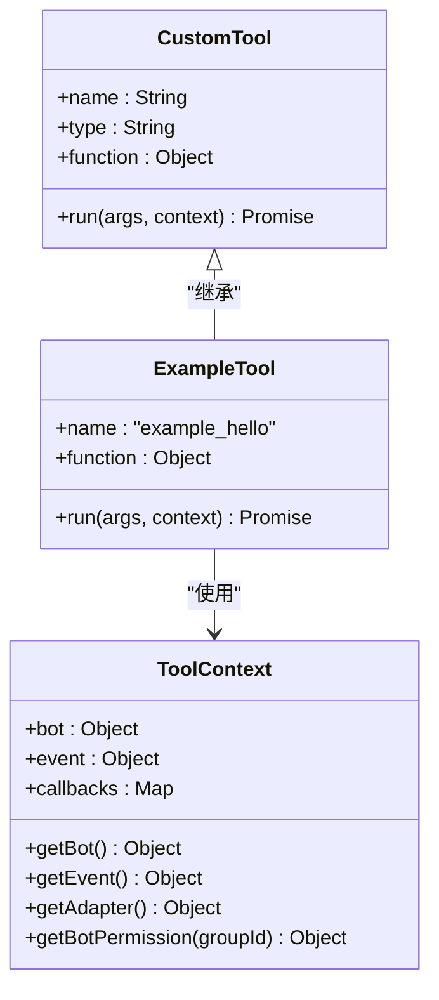
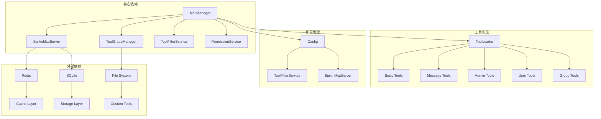
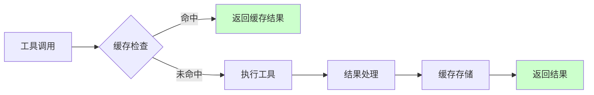

# 内置工具管理

<cite>
**本文档引用的文件**
- [README.md](file://README.md)
- [docs/TOOLS.md](file://docs/TOOLS.md)
- [src/mcp/tools/index.js](file://src/mcp/tools/index.js)
- [src/services/tools/ToolFilterService.js](file://src/services/tools/ToolFilterService.js)
- [src/services/tools/ToolGroupManager.js](file://src/services/tools/ToolGroupManager.js)
- [src/mcp/BuiltinMcpServer.js](file://src/mcp/BuiltinMcpServer.js)
- [src/mcp/McpManager.js](file://src/mcp/McpManager.js)
- [src/services/permission/PermissionService.js](file://src/services/permission/PermissionService.js)
- [data/tools/CustomTool.js](file://data/tools/CustomTool.js)
- [data/tools/example_tool.js](file://data/tools/example_tool.js)
- [src/mcp/tools/basic.js](file://src/mcp/tools/basic.js)
- [src/mcp/tools/message.js](file://src/mcp/tools/message.js)
- [src/mcp/tools/admin.js](file://src/mcp/tools/admin.js)
- [src/mcp/tools/user.js](file://src/mcp/tools/user.js)
- [src/mcp/tools/group.js](file://src/mcp/tools/group.js)
</cite>

## 目录
1. [简介](#简介)
2. [项目结构](#项目结构)
3. [核心组件](#核心组件)
4. [架构概览](#架构概览)
5. [详细组件分析](#详细组件分析)
6. [依赖关系分析](#依赖关系分析)
7. [性能考虑](#性能考虑)
8. [故障排除指南](#故障排除指南)
9. [结论](#结论)
10. [附录](#附录)

## 简介

ChatAI Plugin 是一个功能强大的 Yunzai-Bot AI 聊天插件，集成了多种 LLM 模型和丰富的工具调用能力。该项目的核心是内置工具管理系统，提供了 50+ 个内置工具，涵盖基础工具、上下文工具、群组工具、用户工具、消息工具等多个类别。

该系统采用 MCP (Model Context Protocol) 标准，支持内置工具、自定义 JS 工具和外部 MCP 服务器工具的统一管理。系统具备完善的权限控制、安全保护机制、缓存优化和热重载功能。

## 项目结构

项目采用模块化设计，主要结构如下：

**图表来源**
- [src/mcp/tools/index.js](file://src/mcp/tools/index.js#L1-L181)
- [src/mcp/BuiltinMcpServer.js](file://src/mcp/BuiltinMcpServer.js#L1-L800)
- [src/mcp/McpManager.js](file://src/mcp/McpManager.js#L1-L800)

**章节来源**
- [README.md](file://README.md#L356-L396)

## 核心组件

### 工具加载器 (Tool Loader)

工具加载器负责按类别组织和加载工具，支持热重载机制：

**图表来源**
- [src/mcp/tools/index.js](file://src/mcp/tools/index.js#L1-L181)

### 工具过滤服务 (Tool Filter Service)

提供多层次的工具过滤和权限控制：

**图表来源**
- [src/services/tools/ToolFilterService.js](file://src/services/tools/ToolFilterService.js#L1-L314)

### 工具组管理器 (Tool Group Manager)

管理工具的分组和调度，支持多种工具源：

**图表来源**
- [src/services/tools/ToolGroupManager.js](file://src/services/tools/ToolGroupManager.js#L1-L579)

**章节来源**
- [src/mcp/tools/index.js](file://src/mcp/tools/index.js#L1-L181)
- [src/services/tools/ToolFilterService.js](file://src/services/tools/ToolFilterService.js#L1-L314)
- [src/services/tools/ToolGroupManager.js](file://src/services/tools/ToolGroupManager.js#L1-L579)

## 架构概览

系统采用分层架构设计，实现了工具的统一管理和安全控制：

**图表来源**
- [src/mcp/McpManager.js](file://src/mcp/McpManager.js#L1-L800)
- [src/mcp/BuiltinMcpServer.js](file://src/mcp/BuiltinMcpServer.js#L1-L800)

## 详细组件分析

### 基础工具 (Basic Tools)

基础工具提供系统基本信息和基本功能：

| 工具类别 | 工具数量 | 功能描述 |
|---------|---------|----------|
| 基础工具 | 9 | 时间获取、工具列表、环境信息等 |
| 用户信息 | 3 | 获取用户信息、好友列表、点赞等 |
| 群组信息 | 4 | 获取群信息、成员列表等 |
| 消息操作 | 7 | 发送消息、@用户、聊天记录等 |
| 群管理 | 6 | 禁言、踢人、设置群名片等 |
| 文件操作 | 5 | 群文件上传、下载、管理等 |
| 媒体处理 | 8 | 图片解析、OCR、二维码生成等 |
| 网页访问 | 2 | 访问网页、获取内容等 |
| 搜索工具 | 4 | 网页搜索、维基百科、翻译等 |
| 实用工具 | 6 | 计算、编码转换、哈希等 |
| 记忆管理 | 4 | 用户记忆的增删改查 |
| 上下文管理 | 3 | 对话上下文、群聊上下文等 |
| Bot信息 | 3 | 获取机器人自身信息、状态等 |
| 语音工具 | 3 | TTS语音合成、AI语音对话等 |

**章节来源**
- [docs/TOOLS.md](file://docs/TOOLS.md#L625-L729)

### 工具执行流程

**图表来源**
- [src/mcp/McpManager.js](file://src/mcp/McpManager.js#L717-L800)
- [src/services/tools/ToolFilterService.js](file://src/services/tools/ToolFilterService.js#L88-L173)

### 工具权限控制系统

系统实现了多层次的安全保护机制：

**图表来源**
- [src/services/tools/ToolFilterService.js](file://src/services/tools/ToolFilterService.js#L182-L214)
- [src/mcp/McpManager.js](file://src/mcp/McpManager.js#L752-L767)

**章节来源**
- [src/services/tools/ToolFilterService.js](file://src/services/tools/ToolFilterService.js#L1-L314)
- [src/mcp/McpManager.js](file://src/mcp/McpManager.js#L717-L800)

### 自定义工具开发

系统支持通过 JS 文件扩展工具，提供完整的开发框架：

**图表来源**
- [data/tools/CustomTool.js](file://data/tools/CustomTool.js#L1-L36)
- [data/tools/example_tool.js](file://data/tools/example_tool.js#L1-L43)

**章节来源**
- [data/tools/CustomTool.js](file://data/tools/CustomTool.js#L1-L36)
- [data/tools/example_tool.js](file://data/tools/example_tool.js#L1-L43)
- [docs/TOOLS.md](file://docs/TOOLS.md#L36-L133)

## 依赖关系分析

系统各组件之间的依赖关系如下：

**图表来源**
- [src/mcp/McpManager.js](file://src/mcp/McpManager.js#L1-L800)
- [src/mcp/tools/index.js](file://src/mcp/tools/index.js#L1-L181)

**章节来源**
- [src/mcp/McpManager.js](file://src/mcp/McpManager.js#L1-L800)
- [src/mcp/tools/index.js](file://src/mcp/tools/index.js#L1-L181)

## 性能考虑

### 缓存机制

系统实现了多层缓存策略：

1. **工具加载缓存**：工具模块使用时间戳避免缓存污染
2. **工具结果缓存**：MCP 管理器支持工具调用结果缓存
3. **文件监听缓存**：适配器信息缓存避免重复检测

### 性能优化策略

**图表来源**
- [src/mcp/McpManager.js](file://src/mcp/McpManager.js#L769-L776)

### 热重载机制

系统支持工具的热重载，无需重启即可更新：

- **文件监听**：自动检测工具文件变化
- **防抖机制**：避免频繁重载
- **完全重载**：支持重新初始化整个系统

**章节来源**
- [src/mcp/BuiltinMcpServer.js](file://src/mcp/BuiltinMcpServer.js#L508-L590)
- [src/mcp/McpManager.js](file://src/mcp/McpManager.js#L146-L192)

## 故障排除指南

### 常见问题及解决方案

| 问题类型 | 症状 | 解决方案 |
|---------|------|----------|
| 工具调用失败 | 工具返回错误信息 | 检查工具配置和权限设置 |
| 权限不足 | 工具被拦截 | 配置 allowDangerous 或提升用户权限 |
| 工具加载失败 | 工具不可用 | 检查工具文件格式和语法 |
| 性能问题 | 工具执行缓慢 | 启用缓存或优化工具实现 |
| 热重载失效 | 修改工具后无效果 | 检查文件监听器状态 |

### 调试模式

系统提供详细的调试模式，包括：

- **工具调用日志**：记录所有工具调用的详细信息
- **性能监控**：显示工具执行时间和内存使用
- **错误追踪**：提供完整的错误堆栈信息

**章节来源**
- [docs/TOOLS.md](file://docs/TOOLS.md#L771-L800)
- [src/services/tools/ToolFilterService.js](file://src/services/tools/ToolFilterService.js#L216-L275)

## 结论

内置工具管理系统是一个功能完善、安全性高、性能优秀的工具管理框架。系统的主要优势包括：

1. **模块化设计**：清晰的组件分离和职责划分
2. **多层次安全**：从工具级别到系统级别的多重安全保护
3. **灵活扩展**：支持内置工具、自定义工具和外部 MCP 服务器
4. **高性能**：多层缓存和优化的执行流程
5. **易用性**：完善的开发文档和管理界面

该系统为 Yunzai-Bot 平台提供了强大的工具扩展能力，是构建智能化聊天机器人的基础设施。

## 附录

### 工具开发最佳实践

1. **参数验证**：始终验证输入参数的有效性
2. **错误处理**：提供清晰的错误信息和回退机制
3. **性能优化**：合理使用缓存和异步操作
4. **安全考虑**：避免执行危险操作，进行必要的权限检查
5. **文档编写**：提供详细的工具描述和使用示例

### 配置参考

系统支持丰富的配置选项，包括：

- **工具启用/禁用**：控制工具的可用性
- **权限控制**：设置工具的访问权限
- **危险工具保护**：配置危险工具的保护策略
- **缓存设置**：优化工具执行性能
- **日志配置**：控制日志输出级别和格式

**章节来源**
- [README.md](file://README.md#L283-L296)
- [docs/TOOLS.md](file://docs/TOOLS.md#L731-L769)