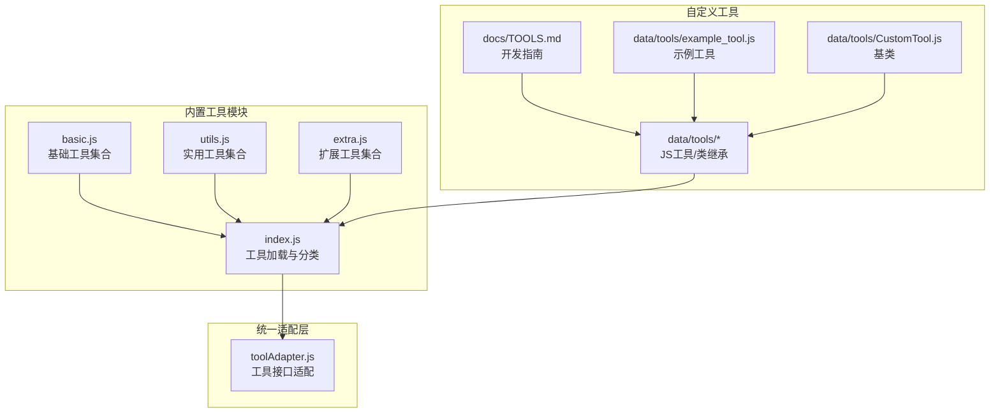
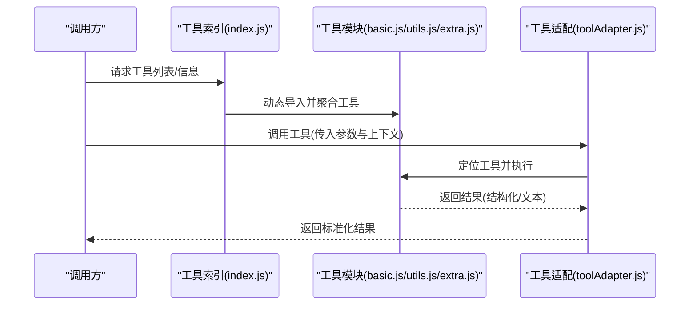
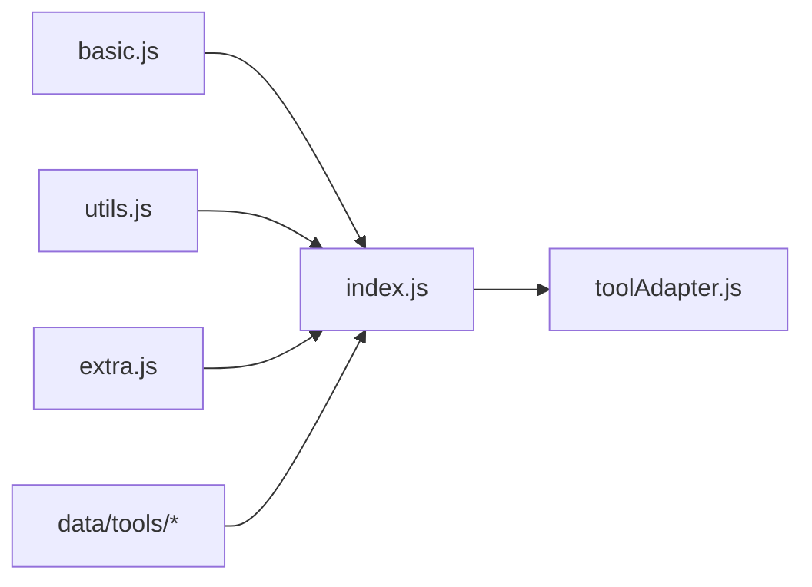

# 基础工具

## 目录
1. [简介](#简介)
2. [项目结构](#项目结构)
3. [核心组件](#核心组件)
4. [架构总览](#架构总览)
5. [详细组件分析](#详细组件分析)
6. [依赖关系分析](#依赖关系分析)
7. [性能考量](#性能考量)
8. [故障排查指南](#故障排查指南)
9. [结论](#结论)
10. [附录](#附录)

## 简介
本章节面向“基础工具类别”，聚焦于时间获取、随机数生成、系统信息查询、环境检测、工具清单与信息查询、农历与节日、数字格式化等常用基础能力。文档将逐项说明每个工具的参数定义、返回值格式、典型使用示例、实现原理与性能特征，并给出在不同场景下的使用建议、最佳实践以及错误处理策略。

## 项目结构
基础工具主要由两类实现构成：
- 内置工具模块：位于 src/mcp/tools 下，按功能分类组织，如 basic.js、utils.js、extra.js 等。
- 自定义工具开发：位于 data/tools 下，支持 JS 工具文件与类继承两种方式，遵循 MCP 标准。

**图表来源**
- [basic.js](file://src/mcp/tools/basic.js#L1-L399)
- [utils.js](file://src/mcp/tools/utils.js#L1-L881)
- [index.js](file://src/mcp/tools/index.js#L1-L181)
- [README.md](file://data/tools/README.md#L1-L90)
- [TOOLS.md](file://docs/TOOLS.md#L1-L800)
- [example_tool.js](file://data/tools/example_tool.js#L1-L43)
- [CustomTool.js](file://data/tools/CustomTool.js#L1-L36)
- [toolAdapter.js](file://src/core/utils/toolAdapter.js#L1-L25)

**章节来源**
- [index.js](file://src/mcp/tools/index.js#L1-L181)
- [README.md](file://data/tools/README.md#L1-L90)
- [TOOLS.md](file://docs/TOOLS.md#L1-L800)

## 核心组件
- 基础工具（basic.js）
  - get_current_time：获取当前时间，支持多种格式与时区。
  - sleep：延时等待，用于需要延迟的场景。
  - echo：原样返回输入内容，便于测试与调试。
  - get_environment：获取运行环境信息（Node 版本、平台、内存、进程运行时长、机器人好友/群数量、上下文信息）。
  - list_available_tools：列出所有可用工具，支持按类别与关键词筛选。
  - get_tool_info：获取指定工具的详细信息（名称、描述、参数定义、必填项）。
  - get_lunar_date：获取农历日期（简化算法，仅供参考）。
  - get_festival：获取近期节日/节气信息。
  - format_number：数字格式化（千分位、中文大写、货币）。
- 实用工具（utils.js）
  - calculate：安全表达式计算（支持基本运算与部分数学函数）。
  - random_number：生成指定范围内的随机数，支持唯一性与数量控制。
  - random_choice：从列表中随机选择，支持唯一性与数量控制。
  - uuid：生成 UUID（v4）。
  - hash/base64/url/json/timestamp/regex/text_stats 等：编码/解码、哈希、URL 处理、JSON 格式化、时间戳转换、正则匹配/替换、文本统计与转换、提取 URL/邮箱/电话、文本拼接/截断、HTML 转义/反转义、密码生成、骰子模拟、抽签等。
- 工具加载与分类（index.js）
  - 按类别聚合工具，支持动态导入与热重载，提供工具查询、类别信息查询、强制重载等能力。
- 自定义工具开发（data/tools）
  - 支持简单对象与类继承两种方式；提供上下文访问、消息发送、返回格式规范等。

**章节来源**
- [basic.js](file://src/mcp/tools/basic.js#L1-L399)
- [utils.js](file://src/mcp/tools/utils.js#L1-L881)
- [index.js](file://src/mcp/tools/index.js#L1-L181)
- [README.md](file://data/tools/README.md#L1-L90)
- [example_tool.js](file://data/tools/example_tool.js#L1-L43)
- [CustomTool.js](file://data/tools/CustomTool.js#L1-L36)

## 架构总览
基础工具的调用链路如下：
- 工具注册与分类：index.js 动态加载各模块导出的工具集合，按类别组织。
- 工具执行：统一通过适配层（toolAdapter.js）暴露的接口进行调用，内部委托至 SkillsAgent。
- 自定义工具：data/tools 下的工具文件通过相同接口参与统一调度。

**图表来源**
- [index.js](file://src/mcp/tools/index.js#L68-L113)
- [basic.js](file://src/mcp/tools/basic.js#L6-L399)
- [utils.js](file://src/mcp/tools/utils.js#L1-L881)
- [toolAdapter.js](file://src/core/utils/toolAdapter.js#L1-L25)

## 详细组件分析

### 基础工具：时间与系统信息
- get_current_time
  - 参数
    - format：枚举，可选 full/date/time/timestamp，默认 full。
    - timezone：字符串，时区，默认 Asia/Shanghai。
  - 返回
    - text：人类可读的当前时间描述。
    - datetime：ISO 时间字符串。
    - timestamp：毫秒级时间戳。
    - formatted：按 format 组合的格式化字符串。
    - timezone：实际使用的时区。
    - weekday：星期几。
  - 使用示例
    - 获取完整时间：传入 format=full。
    - 获取时间戳：传入 format=timestamp。
    - 指定时区：传入 timezone=America/New_York。
  - 实现要点
    - 使用本地化 API 输出日期与时间，结合时区选项。
    - 默认返回多种格式便于不同场景复用。
  - 性能特征
    - O(1)，无外部依赖，极低开销。
  - 场景建议
    - 日志记录、定时任务、跨时区显示等。
  - 错误处理
    - format 与 timezone 为可选参数，非法值会被忽略并采用默认。
- sleep
  - 参数
    - seconds：数字，秒数，范围 0.1~60。
  - 返回
    - success：布尔。
    - waited：实际等待秒数。
  - 使用示例
    - 等待 3 秒：seconds=3。
  - 实现要点
    - 限制最大等待时间，防止阻塞。
  - 性能特征
    - 异步延时，非 CPU 密集。
  - 场景建议
    - 需要延迟的流程控制、重试间隔等。
  - 错误处理
    - 超出范围自动裁剪。
- echo
  - 参数
    - message：字符串。
  - 返回
    - success：布尔。
    - message：原样返回。
  - 使用示例
    - echo({ message: "Hello" }) -> { success: true, message: "Hello" }。
  - 实现要点
    - 用于测试与调试。
- get_environment
  - 参数
    - 无。
  - 返回
    - success：布尔。
    - node_version/platform/arch：运行时信息。
    - uptime：进程运行时长（秒）。
    - memory：heapUsed/heapTotal（MB）。
    - bot：机器人 ID、好友数、群数。
    - context：是否群聊、群号、用户 ID。
  - 使用示例
    - 诊断环境问题、监控资源占用。
  - 实现要点
    - 通过上下文获取事件与机器人实例，汇总系统与运行时信息。
  - 性能特征
    - O(1)，读取进程与上下文信息。
  - 场景建议
    - 运维监控、问题定位。
- list_available_tools
  - 参数
    - category：字符串，可选，按类别筛选。
    - keyword：字符串，可选，按名称或描述关键字筛选。
  - 返回
    - success：布尔。
    - total_categories：类别总数。
    - total_tools：工具总数。
    - categories：包含类别名、描述与工具列表（仅名称与描述）。
  - 使用示例
    - 列出全部工具：无参数。
    - 搜索“时间”：keyword="时间"。
  - 实现要点
    - 动态导入工具索引，遍历类别与工具，支持模糊匹配。
  - 性能特征
    - O(N) 遍历工具，N 为工具总数。
  - 场景建议
    - 工具导航、帮助系统。
- get_tool_info
  - 参数
    - tool_name：字符串，必填。
  - 返回
    - success：布尔。
    - name/description：工具名称与描述。
    - parameters：参数定义（properties）。
    - required：必填参数列表。
  - 使用示例
    - 查询 get_current_time 的参数：tool_name="get_current_time"。
  - 实现要点
    - 通过工具名称在索引中查找并返回元数据。
  - 性能特征
    - O(N) 查找，N 为工具总数。
- get_lunar_date
  - 参数
    - date：字符串，YYYY-MM-DD，可选，默认今日。
  - 返回
    - success：布尔。
    - solar_date/year/ganzhi_year/zodiac：公历日期、年份、干支年、生肖。
    - note：提示信息（简化算法说明）。
  - 使用示例
    - 获取 2025-01-01 的农历信息。
  - 实现要点
    - 简化农历计算，仅供参考，精确需求建议使用专业库。
  - 性能特征
    - O(1)。
- get_festival
  - 参数
    - 无。
  - 返回
    - success：布尔。
    - today：当日日期。
    - upcoming_festivals：未来若干节日列表（名称、日期、距今天数）。
  - 使用示例
    - 获取近期节日安排。
  - 实现要点
    - 预置节日清单，计算与当前时间的差值并排序取前若干。
  - 性能特征
    - O(1)（固定节日数量）。
- format_number
  - 参数
    - number：数字，必填。
    - format：枚举，thousand/chinese/currency，默认 thousand。
    - currency：货币符号，默认 ￥。
  - 返回
    - success：布尔。
    - original/formatted/format：原始值、格式化结果与格式类型。
  - 使用示例
    - 千分位：format="thousand"。
    - 中文大写：format="chinese"。
    - 货币：format="currency"。
  - 实现要点
    - 不同格式采用不同策略，中文大写按“万/亿/万亿”分级。
  - 性能特征
    - O(1)。

**章节来源**
- [basic.js](file://src/mcp/tools/basic.js#L6-L399)

### 实用工具：随机数与系统信息查询
- random_number
  - 参数
    - min：最小值，默认 1。
    - max：最大值，默认 100。
    - count：数量，默认 1，上限 100。
    - unique：是否唯一，默认 true。
  - 返回
    - success：布尔。
    - min/max/count/numbers/text：范围、数量、结果数组与文本描述。
  - 使用示例
    - 生成 5 个 1~100 的不重复随机数。
  - 实现要点
    - unique=true 时使用集合去重，unique=false 时允许重复。
  - 性能特征
    - O(k) 生成 k 个数，k 为 count。
- random_choice
  - 参数
    - items：字符串数组，必填。
    - count：数量，默认 1，上限为数组长度。
    - unique：是否唯一，默认 true。
  - 返回
    - success：布尔。
    - count/selected/text：数量、结果与文本描述。
  - 使用示例
    - 从 ["A","B","C"] 随机选 2 个不重复。
  - 实现要点
    - unique=true 时每次抽取后移除，unique=false 时从原数组随机选取。
  - 性能特征
    - O(k)。
- uuid
  - 参数
    - version：版本，v4（默认）。
    - count：数量，默认 1，上限 10。
  - 返回
    - success：布尔。
    - count/uuids/text：数量、结果数组与文本。
  - 使用示例
    - 生成 3 个 UUID。
  - 实现要点
    - 使用 Node 内置 crypto.randomUUID。
  - 性能特征
    - O(n)。
- hash
  - 参数
    - text：字符串，必填。
    - algorithm：算法，md5/sha1/sha256/sha512，默认 sha256。
  - 返回
    - success：布尔。
    - algorithm/hash/text：算法与哈希值及文本描述。
  - 使用示例
    - 计算 sha256。
  - 实现要点
    - 使用 Node crypto。
  - 性能特征
    - O(1)。
- base64_encode/base64_decode
  - 参数
    - text/base64：必填。
  - 返回
    - success：布尔。
    - original/encoded/decoded：原文与编码/解码结果。
  - 使用示例
    - 编码 "hello"。
- url_encode/url_decode
  - 参数
    - text：字符串，必填。
    - decode：是否解码，默认 false（编码）。
  - 返回
    - success：布尔。
    - original/result/action：原文、结果与动作标识。
  - 使用示例
    - 编码 URL 片段。
- json_format
  - 参数
    - json：字符串，必填。
    - minify：是否压缩，默认 false（美化）。
  - 返回
    - success：布尔。
    - result/action：结果与动作标识。
  - 使用示例
    - 美化 JSON。
- timestamp
  - 参数
    - timestamp：秒或毫秒时间戳（可选其一）。
    - datetime：日期时间字符串（可选其一）。
    - format：输出格式（可选）。
  - 返回
    - success：布尔。
    - timestamp_s/timestamp_ms/iso/local/utc：多格式时间戳与本地/UTC 时间。
  - 使用示例
    - 将时间戳转换为本地时间。
- countdown
  - 参数
    - target：目标时间，如 "2025-01-01" 或 "2025-12-31 23:59:59"，必填。
    - title：标题（可选）。
  - 返回
    - success：布尔。
    - title/target/passed/days/hours/minutes/seconds/total_seconds/text：标题、目标、是否已过、各时间单位与总秒数与文本描述。
  - 使用示例
    - 计算距离 2025-01-01 的倒计时。
- regex_match/regex_replace
  - 参数
    - text/pattern：字符串，必填。
    - flags：正则标志，默认 regex_match 为 gi，regex_replace 为 g。
    - replacement：替换内容（regex_replace 必填）。
  - 返回
    - regex_match：success、pattern、count、matches。
    - regex_replace：success、original、result、replaced。
  - 使用示例
    - 提取邮箱、替换敏感词。
- text_stats
  - 参数
    - text：字符串，必填。
  - 返回
    - success：布尔。
    - char_count/char_count_no_space/word_count/line_count/chinese_chars/english_words/numbers：字符、单词、行数、中英字符与数字统计。
  - 使用示例
    - 统计文章字数与词汇。
- text_transform
  - 参数
    - text：字符串，必填。
    - transform：枚举，upper/lower/capitalize/reverse/trim。
  - 返回
    - success：布尔。
    - original/result/transform：原文、结果与变换类型。
  - 使用示例
    - 转换为大写或首字母大写。
- extract_urls/extract_emails/extract_phones
  - 参数
    - text：字符串，必填。
  - 返回
    - success：布尔。
    - count/urls|emails|phones：数量与列表。
  - 使用示例
    - 从文本中提取链接、邮箱、手机号。
- split_text/join_text
  - 参数
    - text/items：字符串或数组，必填。
    - delimiter：分隔符，默认换行。
    - trim/filter_empty：布尔，是否去空白/过滤空项。
  - 返回
    - success：布尔。
    - count/parts/result：数量与结果。
  - 使用示例
    - 分割多行文本或合并数组。
- truncate_text
  - 参数
    - text：字符串，必填。
    - length：最大长度，必填。
    - suffix：后缀，默认 "..."。
  - 返回
    - success：布尔。
    - result/truncated：结果与是否截断。
  - 使用示例
    - 截断过长文本。
- escape_html
  - 参数
    - text：字符串，必填。
    - unescape：是否反转义，默认 false（转义）。
  - 返回
    - success：布尔。
    - original/result/action：原文、结果与动作。
  - 使用示例
    - HTML 转义/反转义。
- generate_password
  - 参数
    - length：长度，默认 16。
    - include_upper/include_lower/include_numbers/include_symbols：是否包含对应字符集。
  - 返回
    - success：布尔。
    - password/length：密码与长度。
  - 使用示例
    - 生成高强度密码。
- dice_roll
  - 参数
    - dice：骰子表达式，如 "2d6+3" 或 "d20"，必填。
    - count：掷几次，默认 1，上限 10。
  - 返回
    - success：布尔。
    - dice/count/results/summary：表达式、次数、每次投掷明细与汇总。
  - 使用示例
    - 投掷 3 个 6 面骰子加 5。
- draw_lots
  - 参数
    - options：选项数组，可选；不填则使用默认签文。
    - count：抽取数量，默认 1。
  - 返回
    - success：布尔。
    - count/results：数量与结果。
  - 使用示例
    - 抽奖/抽签。

**章节来源**
- [utils.js](file://src/mcp/tools/utils.js#L1-L881)

### 自定义工具开发与最佳实践
- 开发方式
  - 简单对象格式：导出默认对象，包含 name、function（name/description/parameters）、run(args, context)。
  - 类继承格式：继承 CustomTool，实现 name、function、run。
- 上下文访问
  - context.getEvent()/getBot()/getAdapter()/isIcqq()/isNapCat()/isNT()。
- 返回格式
  - 建议返回 { success, ... }；插件会自动转换为 MCP 标准内容。
- 示例与基类
  - example_tool.js 展示了基本结构与上下文使用。
  - CustomTool.js 提供默认字段与 run 抽象方法。
- 热重载
  - 插件启动时自动加载 data/tools 下的 .js 文件；支持管理面板与 API 手动重载。

**章节来源**
- [README.md](file://data/tools/README.md#L1-L90)
- [example_tool.js](file://data/tools/example_tool.js#L1-L43)
- [CustomTool.js](file://data/tools/CustomTool.js#L1-L36)
- [TOOLS.md](file://docs/TOOLS.md#L1-L800)

## 依赖关系分析
- 工具模块依赖
  - basic.js、utils.js、extra.js 均导出工具数组，供 index.js 聚合。
  - index.js 使用动态导入 + 时间戳避免缓存，支持热重载。
  - toolAdapter.js 重导出统一工具接口，兼容旧版调用。
- 外部依赖
  - utils.js 使用 Node 内置 crypto、fetch（超时控制）。
  - extra.js 使用第三方 API（天气、IP 查询、短链、插画等），具备降级与错误处理。
- 耦合与内聚
  - 工具按类别高内聚、低耦合；通过 index.js 统一入口。
  - 自定义工具与内置工具共享同一接口，便于扩展。

**图表来源**
- [index.js](file://src/mcp/tools/index.js#L7-L27)
- [basic.js](file://src/mcp/tools/basic.js#L6-L399)
- [utils.js](file://src/mcp/tools/utils.js#L1-L881)
- [extra.js](file://src/mcp/tools/extra.js#L1-L628)
- [toolAdapter.js](file://src/core/utils/toolAdapter.js#L1-L25)

**章节来源**
- [index.js](file://src/mcp/tools/index.js#L1-L181)
- [toolAdapter.js](file://src/core/utils/toolAdapter.js#L1-L25)

## 性能考量
- 时间与系统信息
  - get_current_time：O(1)，本地化输出，无网络依赖。
  - get_environment：O(1)，读取进程与上下文信息。
  - list_available_tools/get_tool_info：O(N)，N 为工具总数；建议缓存或按需查询。
  - get_lunar_date/get_festival/format_number：O(1)。
- 随机数与文本处理
  - random_number/random_choice：O(k)，k 为生成数量。
  - text_*、regex_*、extract_*：线性扫描，复杂度与文本长度相关。
  - json_format/escape_html：O(n)，n 为文本长度。
- 网络与外部 API
  - extra.js 中的天气、IP、短链、插画等工具存在网络请求，建议设置合理超时与降级策略。
- 并发与阻塞
  - sleep 为异步延时，不会阻塞事件循环。
  - 大量工具并发调用时，注意系统资源与外部 API 限流。

## 故障排查指南
- 参数校验
  - 数值范围：如 random_number 的 min/max、count 上限；sleep 的 seconds 范围；dice 的面数与数量限制。
  - 必填项：如 list_available_tools 的 category/keyword 为可选；get_tool_info 的 tool_name 必填。
- 错误返回
  - 所有工具均返回 { success, ... } 或 { error }，便于统一处理。
  - 网络类工具（extra.js）应检查响应状态与 JSON 解析结果。
- 超时与降级
  - 使用 AbortSignal 控制 fetch 超时；多 API 时顺序尝试并记录最后错误。
- 日志与调试
  - 开启调试模式可输出工具调用参数、耗时与结果；自定义工具可使用 logger 记录结构化日志。
- 热重载
  - 修改 data/tools 后可通过管理面板或 API 重载，避免重启。

**章节来源**
- [basic.js](file://src/mcp/tools/basic.js#L82-L85)
- [utils.js](file://src/mcp/tools/utils.js#L44-L61)
- [extra.js](file://src/mcp/tools/extra.js#L117-L143)
- [TOOLS.md](file://docs/TOOLS.md#L771-L800)

## 结论
基础工具类别覆盖了时间获取、随机数生成、系统信息查询、环境检测、工具清单与信息查询、农历与节日、数字格式化等高频场景。通过模块化设计与统一适配层，既保证了内置工具的稳定性与可维护性，又为自定义工具提供了清晰的开发路径与最佳实践。在生产环境中，建议结合参数校验、超时控制、降级策略与日志记录，确保工具调用的可靠性与可观测性。

## 附录
- 使用建议
  - 时间与时区：优先使用 get_current_time 并明确 timezone。
  - 随机数：根据场景选择 unique 与数量，避免超出范围。
  - 文本处理：先 split 再 join，注意 trim 与过滤空项。
  - 网络工具：设置超时与备用 API，捕获并记录错误。
- 最佳实践
  - 自定义工具：严格定义 JSON Schema 参数，提供清晰 description；在 run 中进行参数校验与错误返回；必要时发送消息反馈。
  - 热重载：开发阶段频繁修改时使用管理面板或 API 重载，减少重启成本。
