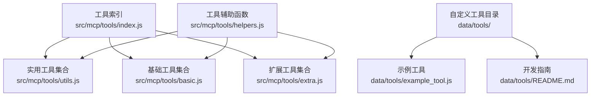
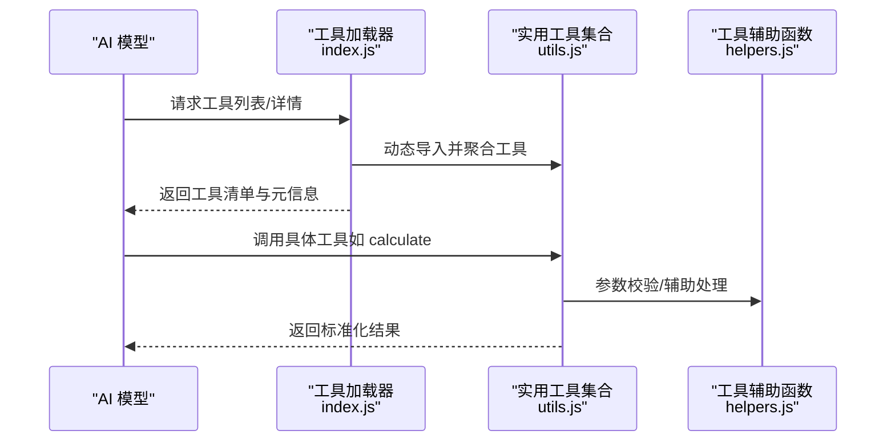
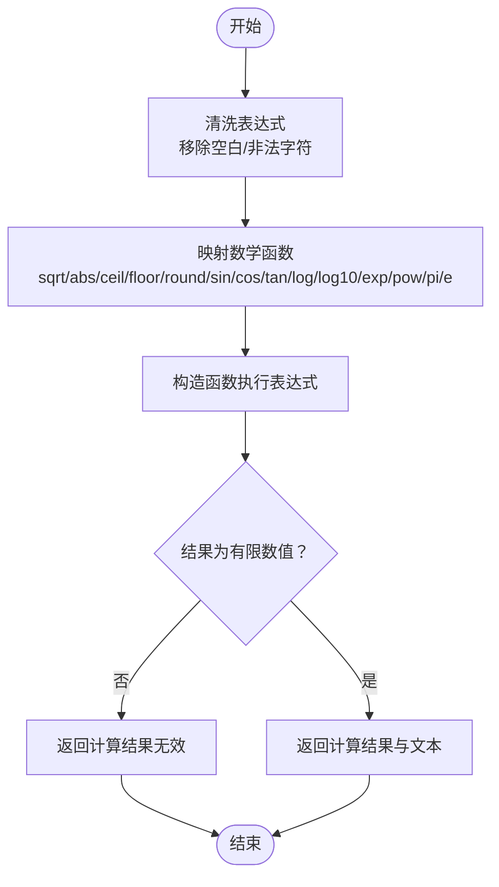
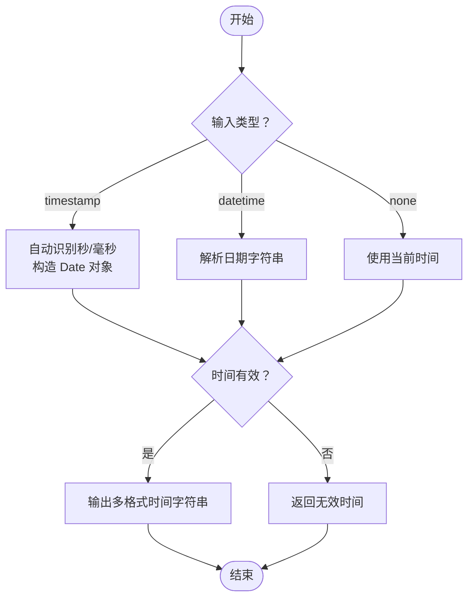
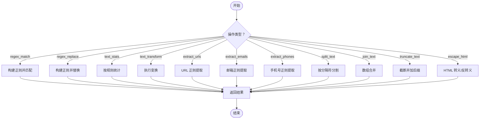
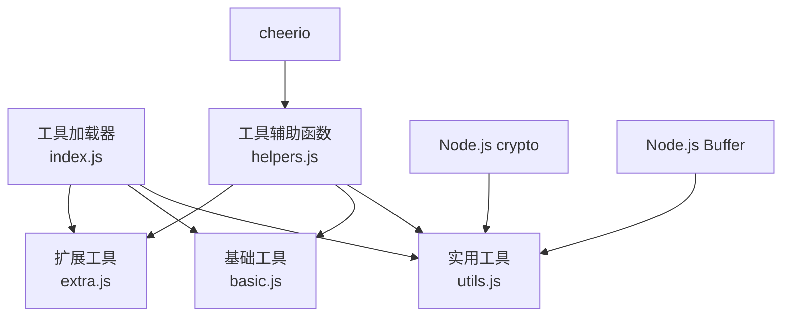

# 实用工具

## 目录
1. [简介](#简介)
2. [项目结构](#项目结构)
3. [核心组件](#核心组件)
4. [架构总览](#架构总览)
5. [详细组件分析](#详细组件分析)
6. [依赖关系分析](#依赖关系分析)
7. [性能考量](#性能考量)
8. [故障排查指南](#故障排查指南)
9. [结论](#结论)
10. [附录](#附录)

## 简介
本文件聚焦“实用工具”类别，涵盖计算工具、编码转换、时间处理、字符串操作等常用功能。文档将深入解析各工具的算法实现、精度控制与边界处理，并提供组合使用案例与自动化脚本思路，帮助读者在不同场景下高效应用这些工具。

## 项目结构
实用工具位于插件的 MCP 工具体系中，按类别组织并通过统一加载器集中管理。工具清单与分类信息由工具索引模块维护，具体实现分布在对应类别文件中。

图表来源
- [src/mcp/tools/index.js](file://src/mcp/tools/index.js#L1-L181)
- [src/mcp/tools/utils.js](file://src/mcp/tools/utils.js#L1-L881)
- [src/mcp/tools/basic.js](file://src/mcp/tools/basic.js#L1-L399)
- [src/mcp/tools/extra.js](file://src/mcp/tools/extra.js#L1-L628)
- [src/mcp/tools/helpers.js](file://src/mcp/tools/helpers.js#L1-L800)
- [data/tools/README.md](file://data/tools/README.md#L1-L90)
- [data/tools/example_tool.js](file://data/tools/example_tool.js#L1-L43)

章节来源
- [README.md](file://README.md#L356-L396)
- [docs/TOOLS.md](file://docs/TOOLS.md#L625-L729)
- [src/mcp/tools/index.js](file://src/mcp/tools/index.js#L1-L181)

## 核心组件
- 实用工具集合：提供计算、编码转换、哈希、时间戳转换、正则匹配/替换、文本统计与变换、URL/JSON 处理、HTML 转义、随机数与密码生成、骰子模拟等。
- 基础工具集合：提供当前时间、睡眠、回声、环境信息、工具列表、工具详情、农历、节日、数字格式化等。
- 扩展工具集合：提供天气、一言、随机选择、倒计时、短链、IP 查询、提醒等。
- 工具辅助函数：参数校验、成员筛选、批量发送、群公告封装等。

章节来源
- [src/mcp/tools/utils.js](file://src/mcp/tools/utils.js#L1-L881)
- [src/mcp/tools/basic.js](file://src/mcp/tools/basic.js#L1-L399)
- [src/mcp/tools/extra.js](file://src/mcp/tools/extra.js#L1-L628)
- [src/mcp/tools/helpers.js](file://src/mcp/tools/helpers.js#L694-L800)

## 架构总览
实用工具采用“类别模块 + 统一加载器”的架构，工具通过 inputSchema 定义参数，handler 执行业务逻辑，返回统一的成功/失败结构。工具可被 AI 模型自动调用，支持热加载与上下文注入。

图表来源
- [src/mcp/tools/index.js](file://src/mcp/tools/index.js#L68-L113)
- [src/mcp/tools/utils.js](file://src/mcp/tools/utils.js#L1-L881)
- [src/mcp/tools/helpers.js](file://src/mcp/tools/helpers.js#L694-L800)

## 详细组件分析

### 计算工具（calculate）
- 功能：执行数学表达式计算，支持基本运算与若干数学函数；对表达式进行安全清洗与函数映射。
- 算法与精度：
  - 表达式清洗：移除空白字符并过滤非法字符，仅保留数字、运算符与允许的函数名。
  - 函数映射：将函数名替换为对应 Math 对象的数值或函数引用。
  - 计算：通过构造函数执行表达式，严格限定可用函数集，避免高危操作。
- 边界处理：
  - 非法表达式：捕获异常并返回错误。
  - 结果校验：确保结果为有限数值，否则视为无效。
- 适用场景：简单计算器、公式求值、科学计算片段。

图表来源
- [src/mcp/tools/utils.js](file://src/mcp/tools/utils.js#L19-L68)

章节来源
- [src/mcp/tools/utils.js](file://src/mcp/tools/utils.js#L10-L68)

### 编码转换（base64_encode/base64_decode/url_encode）
- 功能：Base64 编解码、URL 编解码。
- 算法与精度：
  - Base64：基于 Buffer 的标准编解码。
  - URL：基于标准 URI 编解码 API。
- 边界处理：
  - 编码/解码异常：捕获错误并返回失败信息。
- 适用场景：数据传输、参数传递、资源链接处理。

章节来源
- [src/mcp/tools/utils.js](file://src/mcp/tools/utils.js#L226-L298)

### 哈希工具（hash）
- 功能：支持 md5、sha1、sha256、sha512 等算法的文本哈希计算。
- 算法与精度：使用 Node.js crypto 模块，保证跨平台一致性。
- 边界处理：算法名称校验与异常捕获。
- 适用场景：数据完整性校验、唯一标识生成。

章节来源
- [src/mcp/tools/utils.js](file://src/mcp/tools/utils.js#L194-L223)

### 时间处理（timestamp/countdown）
- timestamp：
  - 输入：秒或毫秒时间戳、日期时间字符串。
  - 输出：秒/毫秒时间戳、ISO、本地与 UTC 字符串。
  - 精度：毫秒级时间戳，本地时间按 Asia/Shanghai 格式化。
- countdown：
  - 输入：目标时间字符串。
  - 输出：天/时/分/秒、总秒数、是否已过期。
  - 精度：整数秒差值，支持负值（已过期）。
- 边界处理：无效时间、格式错误、NaN 检测。

图表来源
- [src/mcp/tools/utils.js](file://src/mcp/tools/utils.js#L329-L368)

章节来源
- [src/mcp/tools/utils.js](file://src/mcp/tools/utils.js#L329-L421)

### 字符串操作（正则、统计、变换、提取、拼接、截断、HTML 转义）
- 正则匹配/替换：支持正则标志，返回匹配结果或替换后文本。
- 文本统计：统计字符数（含/不含空格）、单词数、行数、中英字符与数字数量。
- 文本变换：大小写、首字母大写、反转、去空白。
- 提取：URL、邮箱、手机号（中国手机号正则）。
- 拼接/分割：按分隔符分割与合并，支持去空白与过滤空项。
- HTML 转义/反转义：标准实体替换。
- 截断：支持自定义后缀。
- 算法与精度：基于标准正则与字符串 API；中文统计使用 Unicode 范围匹配。
- 边界处理：空输入、无效正则、异常捕获。

图表来源
- [src/mcp/tools/utils.js](file://src/mcp/tools/utils.js#L425-L747)

章节来源
- [src/mcp/tools/utils.js](file://src/mcp/tools/utils.js#L425-L747)

### 随机与密码（random_number/random_choice/uuid/generate_password）
- random_number：支持范围、数量、唯一性约束，上限保护。
- random_choice：从列表中随机选择，支持唯一性。
- uuid：基于 crypto.randomUUID 生成 v4 UUID。
- generate_password：按开关生成包含大小写、数字、符号的密码。
- 算法与精度：Math.random 为基础，唯一性通过 Set/数组切片实现。
- 边界处理：范围越界、数量超限、无可用字符集。

章节来源
- [src/mcp/tools/utils.js](file://src/mcp/tools/utils.js#L72-L191)

### JSON 处理（json_format）
- 功能：美化或压缩 JSON 字符串。
- 算法与精度：JSON.parse/stringify 标准流程。
- 边界处理：解析失败返回错误。

章节来源
- [src/mcp/tools/utils.js](file://src/mcp/tools/utils.js#L302-L325)

### 基础工具补充（get_current_time/format_number/list_available_tools/get_environment 等）
- get_current_time：支持多种格式与时区。
- format_number：千分位、中文数字、货币格式。
- list_available_tools/get_tool_info：动态查询工具清单与详情。
- get_environment：运行时环境信息（Node 版本、内存、平台、群/好友数量等）。
- 算法与精度：基于本地化 API 与系统信息。
- 边界处理：参数校验、API 异常捕获。

章节来源
- [src/mcp/tools/basic.js](file://src/mcp/tools/basic.js#L1-L399)

### 扩展工具补充（天气、一言、倒计时、短链、IP 查询、提醒等）
- 天气：多 API 备降，返回当前与预报信息。
- 一言：随机名言，支持类型筛选。
- 倒计时：相对/绝对时间计算。
- 短链：is.gd 短链服务。
- IP 查询：ip-api.com。
- 提醒：定时提醒，支持相对/绝对时间，最大延时限制。
- 算法与精度：HTTP 请求与 JSON 解析；定时器管理。
- 边界处理：URL 校验、HTTP 错误、参数合法性。

章节来源
- [src/mcp/tools/extra.js](file://src/mcp/tools/extra.js#L1-L628)

## 依赖关系分析
- 工具加载器负责动态导入与聚合工具，支持热重载与类别过滤。
- 工具实现依赖 Node.js 内置模块（如 crypto、Buffer）与第三方库（如 cheerio）。
- 工具辅助函数提供参数校验、成员筛选、批量发送等通用能力，被各类工具复用。

图表来源
- [src/mcp/tools/index.js](file://src/mcp/tools/index.js#L68-L113)
- [src/mcp/tools/utils.js](file://src/mcp/tools/utils.js#L1-L881)
- [src/mcp/tools/basic.js](file://src/mcp/tools/basic.js#L1-L399)
- [src/mcp/tools/extra.js](file://src/mcp/tools/extra.js#L1-L628)
- [src/mcp/tools/helpers.js](file://src/mcp/tools/helpers.js#L1-L800)

章节来源
- [src/mcp/tools/index.js](file://src/mcp/tools/index.js#L1-L181)
- [src/mcp/tools/helpers.js](file://src/mcp/tools/helpers.js#L694-L800)

## 性能考量
- 表达式计算：仅允许有限函数与字符，避免复杂表达式导致的性能问题；建议控制表达式长度与嵌套层级。
- 正则操作：复杂模式可能导致回溯，建议优化正则并限制输入长度。
- 网络请求：天气、短链、IP 查询等工具应设置合理超时与重试策略，避免阻塞。
- 随机生成：大量随机数生成建议限制并发与数量，避免高负载。
- JSON 处理：大体积 JSON 建议压缩后再传输，减少解析成本。
- HTML 转义：长文本转义建议分批处理，避免一次性内存峰值。

## 故障排查指南
- 参数校验失败：检查 inputSchema 定义与必填字段，使用工具辅助函数进行参数校验。
- 工具调用异常：查看工具内部 try/catch 捕获的错误信息，定位具体环节。
- 网络请求失败：检查 API 可用性、代理设置与超时配置。
- 时间/日期异常：确认时区设置与输入格式，避免无效时间字符串。
- 随机数/密码异常：检查范围与唯一性约束，避免超出可用空间。

章节来源
- [src/mcp/tools/helpers.js](file://src/mcp/tools/helpers.js#L694-L800)
- [src/mcp/tools/utils.js](file://src/mcp/tools/utils.js#L19-L68)
- [src/mcp/tools/extra.js](file://src/mcp/tools/extra.js#L117-L143)

## 结论
实用工具类别覆盖了计算、编码、时间、字符串等高频场景，具备清晰的参数定义、稳健的边界处理与良好的可扩展性。通过统一的加载器与辅助函数，开发者可快速新增或定制工具，满足多样化的自动化需求。

## 附录

### 组合使用案例与自动化脚本思路
- 计算 + 编码 + 时间戳：先计算表达式得到数值，再进行 Base64 编码，最后输出当前时间戳，形成“计算-编码-记录”流水线。
- 正则提取 + 统计 + 截断：从文本中提取 URL/邮箱/电话，统计词频与字符数，按长度截断并 HTML 转义，输出报告。
- 随机选择 + 密码生成：为活动生成随机参与名单并发送随机密码，结合提醒工具定时通知。
- JSON 格式化 + URL 编码：美化 JSON 并进行 URL 编码，便于分享或调试。

### 自定义工具开发要点
- 参考自定义工具开发指南，使用 data/tools 目录下的示例文件作为起点。
- 通过工具辅助函数进行参数校验与上下文访问，确保健壮性与兼容性。
- 使用热加载机制在开发过程中快速迭代。

章节来源
- [docs/TOOLS.md](file://docs/TOOLS.md#L1-L20)
- [data/tools/README.md](file://data/tools/README.md#L1-L90)
- [data/tools/example_tool.js](file://data/tools/example_tool.js#L1-L43)
