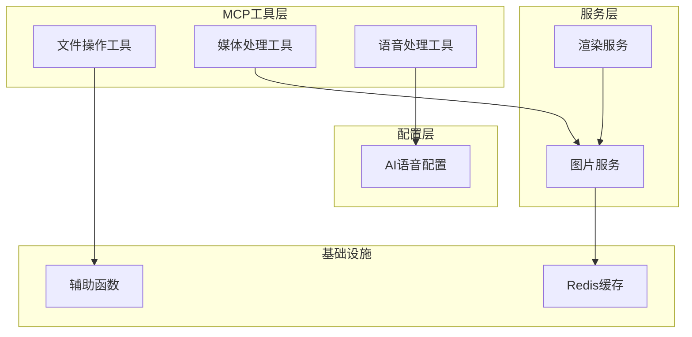
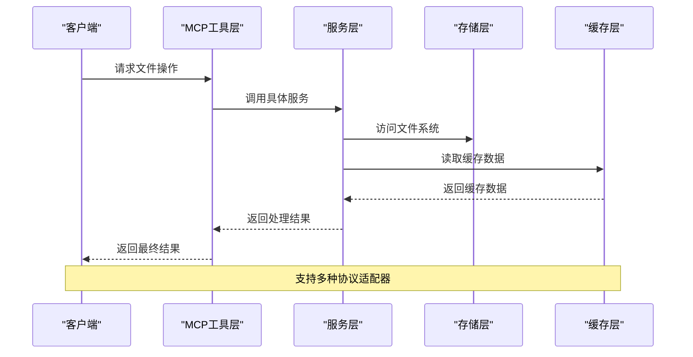
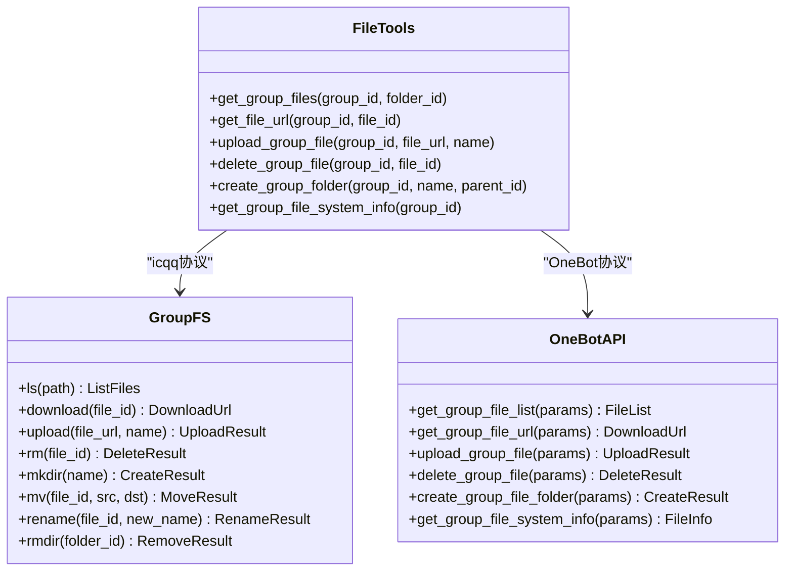
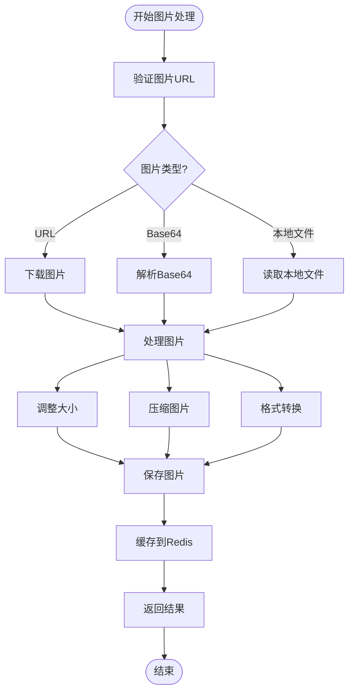
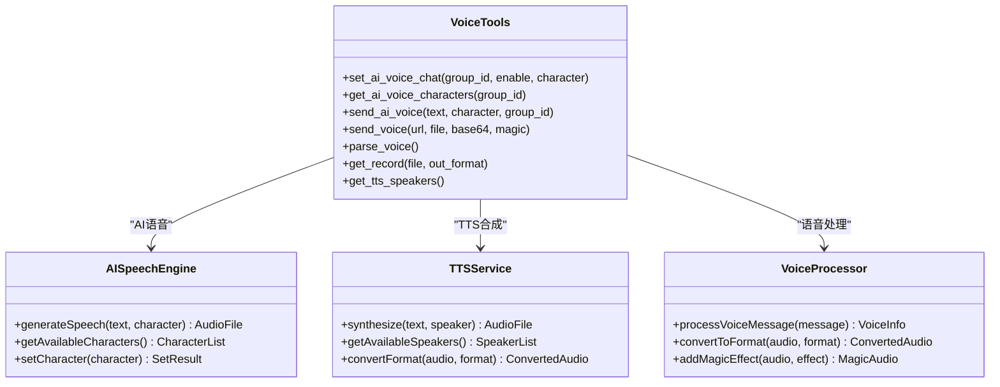
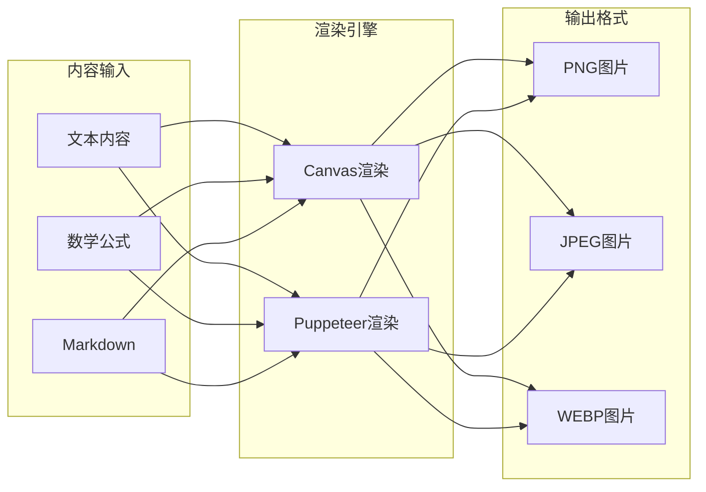
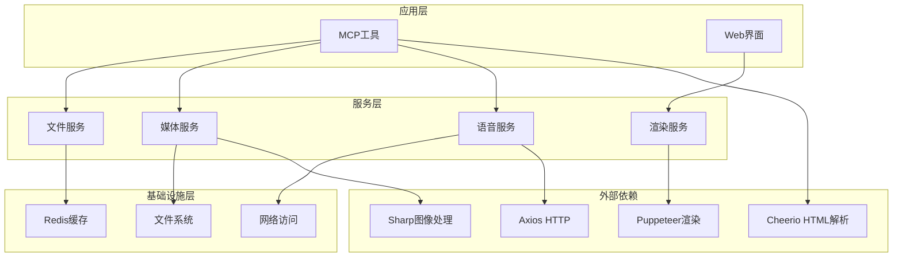

# 文件与媒体工具

## 目录
1. [简介](#简介)
2. [项目结构](#项目结构)
3. [核心组件](#核心组件)
4. [架构概览](#架构概览)
5. [详细组件分析](#详细组件分析)
6. [依赖关系分析](#依赖关系分析)
7. [性能考虑](#性能考虑)
8. [故障排除指南](#故障排除指南)
9. [结论](#结论)

## 简介

文件与媒体工具是Yunzai AI聊天插件的重要组成部分，提供完整的文件管理和媒体处理能力。该工具集涵盖了文件上传下载、群文件管理、图片解析、语音处理、二维码生成等多个功能领域，为用户提供了一站式的文件和媒体处理解决方案。

本工具集基于MCP（Model Context Protocol）协议设计，支持多种协议适配器，包括icqq、NapCat、go-cqhttp等，能够兼容不同的QQ机器人平台。通过统一的接口设计，用户可以轻松地进行文件操作和媒体处理任务。

## 项目结构

文件与媒体工具模块采用分层架构设计，主要包含以下核心组件：

**图表来源**
- [file.js](file://src/mcp/tools/file.js#L1-L884)
- [media.js](file://src/mcp/tools/media.js#L1-L892)
- [voice.js](file://src/mcp/tools/voice.js#L1-L1650)
- [ImageService.js](file://src/services/media/ImageService.js#L1-L849)
- [RenderService.js](file://src/services/media/RenderService.js#L1-L2439)

**章节来源**
- [README.md](file://README.md#L356-L396)

## 核心组件

### 文件操作工具集

文件操作工具集提供了完整的群文件管理功能，支持多种文件操作场景：

- **群文件列表获取**：支持获取群文件目录结构，包括根目录和子目录
- **文件下载链接获取**：提供安全的文件下载链接生成机制
- **文件上传功能**：支持从URL、本地路径或file协议路径上传文件
- **文件删除操作**：提供文件删除和文件夹删除功能
- **文件系统信息**：获取群文件系统的使用情况和容量信息

### 媒体处理工具集

媒体处理工具集专注于图片和多媒体内容的处理：

- **图片解析**：从消息中提取图片URL或base64数据
- **二维码生成**：使用公共API生成二维码图片
- **图片信息获取**：获取图片的基本信息（尺寸、格式等）
- **图片发送**：支持URL和base64格式的图片发送
- **视频处理**：支持短视频消息的发送和解析

### 语音处理工具集

语音处理工具集提供了丰富的语音相关功能：

- **AI语音合成**：使用QQ的AI声聊功能进行语音合成
- **语音消息发送**：支持直接发送语音文件
- **语音信息解析**：获取消息中的语音信息
- **语音文件转换**：支持多种音频格式的转换

**章节来源**
- [file.js](file://src/mcp/tools/file.js#L7-L884)
- [media.js](file://src/mcp/tools/media.js#L8-L892)
- [voice.js](file://src/mcp/tools/voice.js#L74-L1650)

## 架构概览

文件与媒体工具采用分层架构设计，确保了良好的可维护性和扩展性：

**图表来源**
- [helpers.js](file://src/mcp/tools/helpers.js#L176-L184)
- [RedisClient.js](file://src/core/cache/RedisClient.js#L10-L41)

### 协议适配机制

系统支持多种协议适配器，通过统一的接口实现不同平台的兼容：

- **icqq适配器**：主要用于QQ NT协议
- **NapCat适配器**：支持最新的NapCat协议
- **go-cqhttp适配器**：兼容传统的go-cqhttp协议
- **OneBot适配器**：遵循OneBot标准的通用适配器

**章节来源**
- [voice.js](file://src/mcp/tools/voice.js#L15-L38)
- [helpers.js](file://src/mcp/tools/helpers.js#L176-L184)

## 详细组件分析

### 文件管理系统

文件管理系统提供了完整的群文件操作能力：

**图表来源**
- [file.js](file://src/mcp/tools/file.js#L8-L884)

#### 文件格式支持

系统支持多种文件格式，包括但不限于：
- **图片格式**：JPG、PNG、GIF、WEBP
- **文档格式**：PDF、DOC、XLS、PPT
- **压缩格式**：ZIP、RAR、7Z
- **音频格式**：MP3、AMR、WAV、FLAC
- **视频格式**：MP4、AVI、MOV、WMV

#### 大小限制机制

系统实施了严格的大文件限制机制：
- **单文件大小限制**：10MB
- **图片格式验证**：仅支持JPG、PNG、GIF、WEBP格式
- **URL有效性验证**：防止恶意文件下载
- **缓存机制**：使用内存和Redis双重缓存

**章节来源**
- [file.js](file://src/mcp/tools/file.js#L20-L849)

### 图片处理服务

图片处理服务提供了强大的图片处理能力：

**图表来源**
- [ImageService.js](file://src/services/media/ImageService.js#L41-L672)

#### 图片处理功能

- **图片上传**：支持Buffer、URL、Base64格式的图片上传
- **图片压缩**：支持JPEG、PNG、WEBP格式的压缩
- **图片格式转换**：支持不同格式之间的相互转换
- **图片尺寸调整**：支持自定义尺寸的图片调整
- **网格图片切割**：支持复杂的网格图片切割功能

#### 安全检查机制

系统实施了多层次的安全检查：
- **URL有效性验证**：防止恶意URL访问
- **文件类型检查**：确保上传文件的合法性
- **大小限制检查**：防止大文件占用资源
- **缓存失效机制**：定期清理过期缓存

**章节来源**
- [ImageService.js](file://src/services/media/ImageService.js#L17-L849)

### 语音处理系统

语音处理系统提供了丰富的语音相关功能：

**图表来源**
- [voice.js](file://src/mcp/tools/voice.js#L74-L1650)

#### AI语音功能

- **AI声聊开关**：支持群AI声聊功能的开启和关闭
- **角色选择**：提供多种AI语音角色供用户选择
- **语音合成**：使用QQ的AI声聊功能进行语音合成
- **语音播放**：支持多种音频格式的播放

#### TTS语音合成

系统集成了VITS语音合成技术：
- **角色库**：包含原神、崩坏3、星穹铁道等游戏角色
- **多语言支持**：支持中文、日语、英语等多种语言
- **音质优化**：提供高质量的语音合成效果
- **实时合成**：支持实时语音合成和播放

**章节来源**
- [voice.js](file://src/mcp/tools/voice.js#L74-L1650)
- [aivoice.json](file://config/aivoice.json#L1-L131)

### 渲染服务系统

渲染服务系统提供了强大的内容渲染能力：

**图表来源**
- [RenderService.js](file://src/services/media/RenderService.js#L39-L849)

#### 数学公式渲染

系统具备强大的数学公式渲染能力：
- **LaTeX支持**：完整支持LaTeX数学公式语法
- **公式检测**：智能检测文本中的数学公式
- **公式转换**：将纯文本数学表达式转换为LaTeX格式
- **公式渲染**：高质量渲染数学公式为图片

#### 文本渲染功能

- **Markdown渲染**：支持完整的Markdown语法渲染
- **主题切换**：支持明暗主题切换
- **字体支持**：支持中英文字体混合渲染
- **样式定制**：支持自定义渲染样式

**章节来源**
- [RenderService.js](file://src/services/media/RenderService.js#L39-L2439)

## 依赖关系分析

文件与媒体工具的依赖关系体现了清晰的分层架构：

**图表来源**
- [ImageService.js](file://src/services/media/ImageService.js#L1-L10)
- [RenderService.js](file://src/services/media/RenderService.js#L1-L8)

### 核心依赖库

系统依赖的关键库包括：

- **Sharp**：高性能的图像处理库，支持多种格式转换
- **Puppeteer**：Chrome浏览器自动化工具，用于复杂内容渲染
- **Axios**：HTTP客户端库，用于网络请求
- **Cheerio**：服务器端jQuery实现，用于HTML解析
- **IORedis**：Redis客户端库，用于缓存管理

**章节来源**
- [ImageService.js](file://src/services/media/ImageService.js#L1-L10)
- [RenderService.js](file://src/services/media/RenderService.js#L1-L8)

## 性能考虑

文件与媒体工具在设计时充分考虑了性能优化：

### 缓存策略

系统采用了多层缓存策略来提升性能：

- **URL验证缓存**：使用内存Map缓存URL验证结果，5分钟TTL
- **Redis缓存**：使用Redis缓存图片元数据，24小时TTL
- **图片缩略图缓存**：自动生成并缓存缩略图，减少重复处理
- **浏览器缓存**：Puppeteer渲染结果的缓存机制

### 并发处理

系统支持高效的并发处理：
- **批量文件处理**：支持多文件并发处理
- **异步操作**：所有网络和文件操作都是异步的
- **超时控制**：合理的超时设置防止长时间阻塞
- **错误恢复**：自动重试机制提升可靠性

### 资源管理

- **内存管理**：及时释放不再使用的Buffer和对象
- **文件句柄管理**：合理管理文件句柄，防止资源泄露
- **网络连接池**：复用HTTP连接，减少连接开销
- **垃圾回收**：定期清理缓存和临时文件

## 故障排除指南

### 常见问题及解决方案

#### 文件上传失败

**问题现象**：文件上传过程中出现错误

**可能原因**：
- 文件大小超过限制
- URL不可访问
- 权限不足
- 网络连接问题

**解决方法**：
1. 检查文件大小是否超过10MB限制
2. 验证URL的有效性和可访问性
3. 确认具有相应的文件操作权限
4. 检查网络连接状态

#### 图片处理异常

**问题现象**：图片处理过程中抛出异常

**可能原因**：
- 图片格式不受支持
- 图片损坏或格式错误
- 内存不足
- 磁盘空间不足

**解决方法**：
1. 确认图片格式为JPG、PNG、GIF、WEBP之一
2. 验证图片文件的完整性
3. 检查系统内存使用情况
4. 确保有足够的磁盘空间

#### 语音合成失败

**问题现象**：AI语音合成或TTS语音生成失败

**可能原因**：
- 协议适配器不支持
- 角色ID不存在
- 网络连接问题
- 音频格式不支持

**解决方法**：
1. 确认使用支持AI语音的协议适配器
2. 检查角色ID是否在配置文件中存在
3. 验证网络连接的稳定性
4. 确认目标音频格式的支持情况

### 调试技巧

- **启用调试模式**：在配置中启用调试模式查看更多详细信息
- **检查日志**：查看系统日志了解具体的错误信息
- **验证依赖**：确保所有必要的依赖库都已正确安装
- **测试网络**：验证网络连接和外部API的可用性

**章节来源**
- [README.md](file://README.md#L553-L793)

## 结论

文件与媒体工具为Yunzai AI聊天插件提供了完整的文件管理和媒体处理能力。通过精心设计的架构和丰富的功能特性，该工具集能够满足各种文件操作和媒体处理需求。

### 主要优势

- **多协议支持**：兼容多种QQ机器人协议，具有良好的兼容性
- **功能丰富**：涵盖文件操作、图片处理、语音合成等多个方面
- **性能优化**：采用多层缓存和异步处理机制，确保高效运行
- **安全性强**：实施多重安全检查，防止恶意文件和攻击
- **易于扩展**：模块化设计便于功能扩展和维护

### 未来发展方向

- **更多格式支持**：扩展对更多文件格式的支持
- **云端存储**：集成云存储服务，提供更好的文件管理
- **智能处理**：引入AI技术，提供更智能的文件处理能力
- **性能优化**：持续优化性能，支持更大规模的并发处理

通过不断的技术创新和完善，文件与媒体工具将继续为用户提供更加优质的服务体验。
