# 消息操作工具


## 目录
1. [简介](#简介)
2. [项目结构](#项目结构)
3. [核心组件](#核心组件)
4. [架构概览](#架构概览)
5. [详细组件分析](#详细组件分析)
6. [依赖关系分析](#依赖关系分析)
7. [性能考虑](#性能考虑)
8. [故障排除指南](#故障排除指南)
9. [结论](#结论)

## 简介

消息操作工具是 ChatAI 插件中的核心功能模块，专门负责处理各种消息相关的操作。该工具集提供了完整的消息发送、@用户、聊天记录获取、消息转发等功能，支持多种消息格式和协议适配。

主要功能包括：
- **消息发送**：支持私聊、群聊、@用户等多种发送方式
- **消息解析**：统一处理不同协议的消息格式
- **消息去重**：防止重复消息和回显消息的处理
- **聊天记录管理**：获取历史消息和转发消息
- **批量操作**：支持批量@用户和批量消息发送
- **权限控制**：基于群组和用户的权限管理

## 项目结构

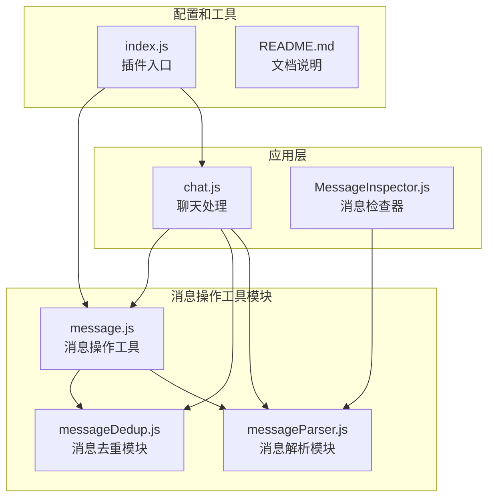

**图表来源**
- [message.js](file://src/mcp/tools/message.js#L1-L50)
- [messageDedup.js](file://src/utils/messageDedup.js#L1-L50)
- [messageParser.js](file://src/utils/messageParser.js#L1-L50)
- [chat.js](file://apps/chat.js#L1-L50)
- [MessageInspector.js](file://apps/MessageInspector.js#L1-L50)

**章节来源**
- [message.js](file://src/mcp/tools/message.js#L1-L100)
- [messageDedup.js](file://src/utils/messageDedup.js#L1-L100)
- [messageParser.js](file://src/utils/messageParser.js#L1-L100)

## 核心组件

### 消息操作工具集

消息操作工具集包含了7个主要的工具函数，每个都针对特定的消息操作场景：

1. **send_to_master** - 发送私聊消息给主人
2. **send_private_message** - 发送私聊消息给指定用户
3. **send_group_message** - 发送群消息
4. **reply_current_message** - 回复当前会话消息
5. **at_user** - @指定用户
6. **get_chat_history** - 获取聊天历史记录

### 消息去重机制

系统实现了多层次的消息去重保护机制：

- **发送去重**：防止短时间内重复发送相同内容
- **接收去重**：防止重复处理相同的消息事件
- **自身消息防护**：识别和过滤机器人自身的消息
- **消息回显检测**：检测并过滤消息回显

### 消息解析引擎

支持多种协议和消息格式的统一解析：

- **协议兼容**：支持 icqq、NapCat、OneBot 等多种协议
- **消息类型**：文本、图片、@、引用、转发等
- **格式转换**：统一不同协议的消息格式

**章节来源**
- [message.js](file://src/mcp/tools/message.js#L89-L842)
- [messageDedup.js](file://src/utils/messageDedup.js#L1-L200)
- [messageParser.js](file://src/utils/messageParser.js#L1-L100)

## 架构概览

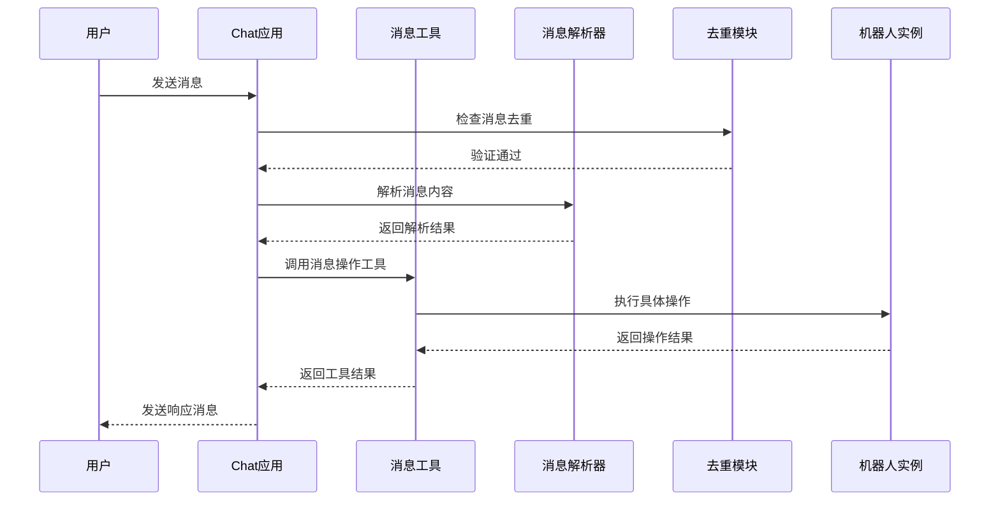

**图表来源**
- [chat.js](file://apps/chat.js#L109-L203)
- [message.js](file://src/mcp/tools/message.js#L273-L425)
- [messageDedup.js](file://src/utils/messageDedup.js#L157-L212)

### 工具执行流程

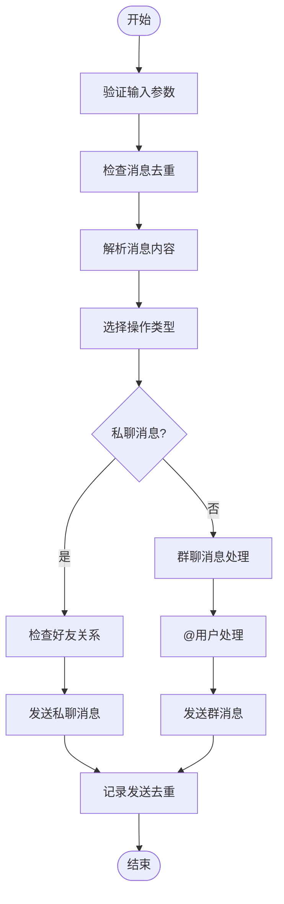

**图表来源**
- [message.js](file://src/mcp/tools/message.js#L273-L471)
- [messageDedup.js](file://src/utils/messageDedup.js#L114-L122)

**章节来源**
- [chat.js](file://apps/chat.js#L464-L641)
- [message.js](file://src/mcp/tools/message.js#L1-L200)

## 详细组件分析

### 消息发送组件

#### 私聊消息发送

私聊消息发送功能支持多种场景：

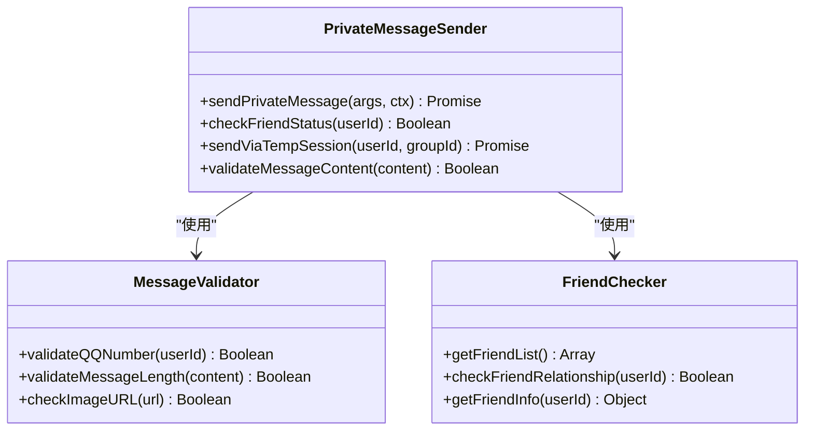

**图表来源**
- [message.js](file://src/mcp/tools/message.js#L260-L425)

#### 群聊消息发送

群聊消息发送支持@用户和图片发送：

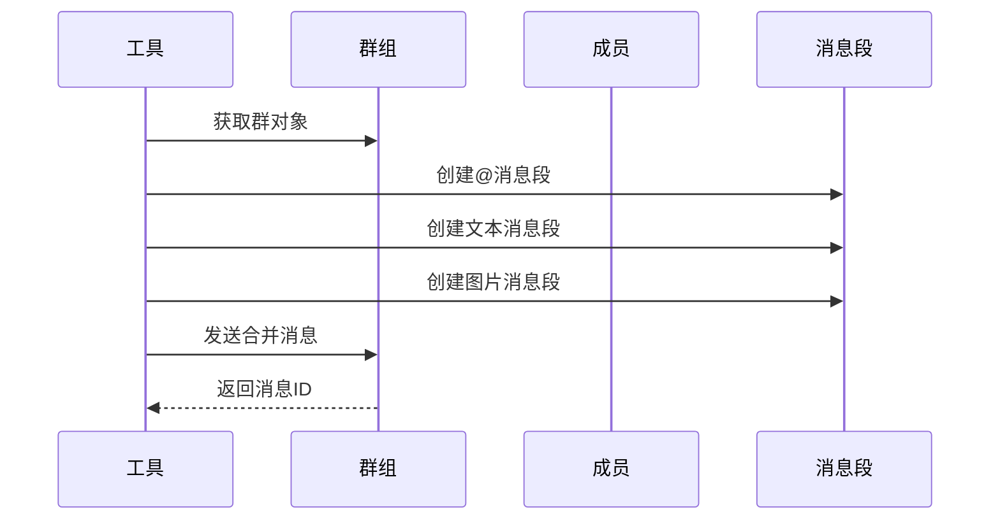

**图表来源**
- [message.js](file://src/mcp/tools/message.js#L428-L471)

**章节来源**
- [message.js](file://src/mcp/tools/message.js#L260-L471)

### @用户功能

@用户功能提供了灵活的用户定位和批量@能力：

#### 用户定位机制

```mermaid
flowchart TD
Start([开始@操作]) --> CheckParams["检查参数"]
CheckParams --> HasQQ{"提供QQ号?"}
HasQQ --> |是| ValidateQQ["验证QQ号格式"]
HasQQ --> |否| HasName{"提供昵称?"}
HasName --> |是| SearchByName["按昵称搜索"]
HasName --> |否| Error["参数错误"]
ValidateQQ --> SearchMember["搜索群成员"]
SearchByName --> SearchMember
SearchMember --> Found{"找到用户?"}
Found --> |是| CreateAt["创建@消息段"]
Found --> |否| Error
CreateAt --> SendMsg["发送@消息"]
SendMsg --> End([结束])
Error --> End
```

**图表来源**
- [message.js](file://src/mcp/tools/message.js#L520-L599)

#### 批量@功能

批量@功能支持多次发送和间隔控制：

**章节来源**
- [message.js](file://src/mcp/tools/message.js#L520-L783)

### 聊天记录管理

#### 历史消息获取

聊天记录获取功能支持群聊和私聊两种模式：

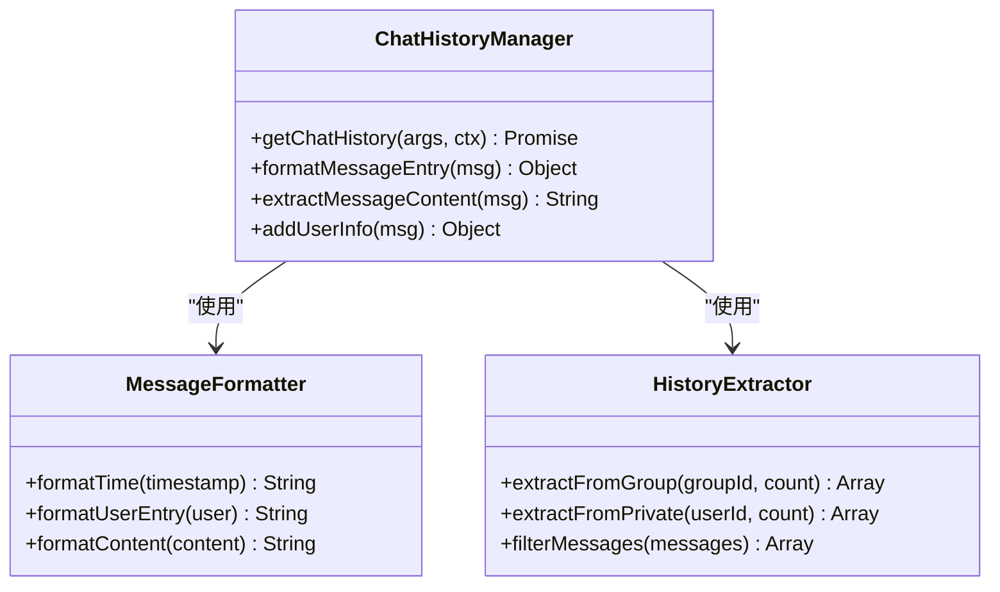

**图表来源**
- [message.js](file://src/mcp/tools/message.js#L786-L841)

#### 转发消息解析

转发消息解析支持深层嵌套和多种格式：

**章节来源**
- [message.js](file://src/mcp/tools/message.js#L786-L996)

### 消息去重机制

#### 多层次去重保护

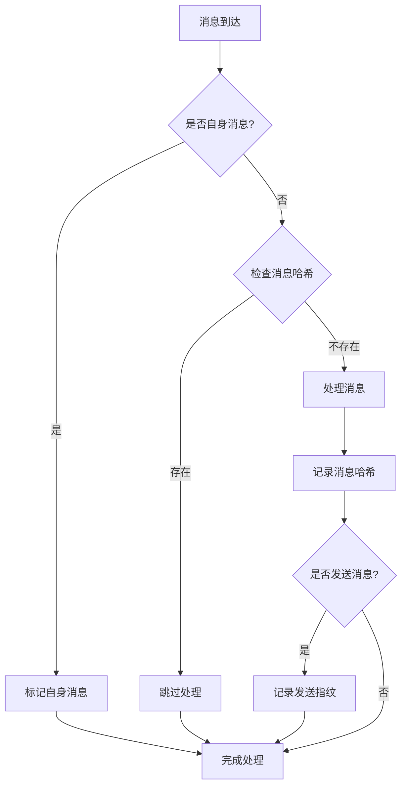

**图表来源**
- [messageDedup.js](file://src/utils/messageDedup.js#L157-L212)

#### 去重算法实现

**章节来源**
- [messageDedup.js](file://src/utils/messageDedup.js#L1-L200)

### 消息解析引擎

#### 协议适配层

消息解析引擎支持多种协议的统一处理：

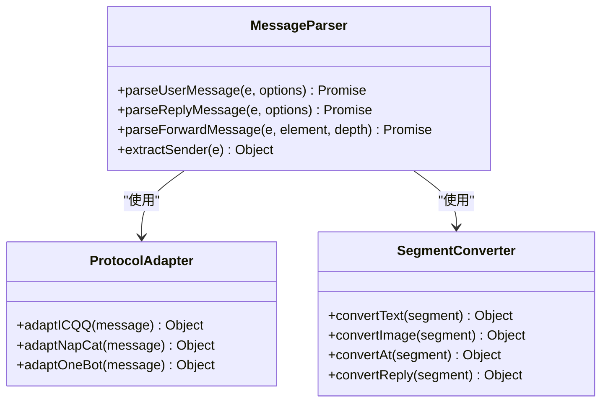

**图表来源**
- [messageParser.js](file://src/utils/messageParser.js#L137-L812)

#### 消息类型处理

**章节来源**
- [messageParser.js](file://src/utils/messageParser.js#L1-L200)

## 依赖关系分析

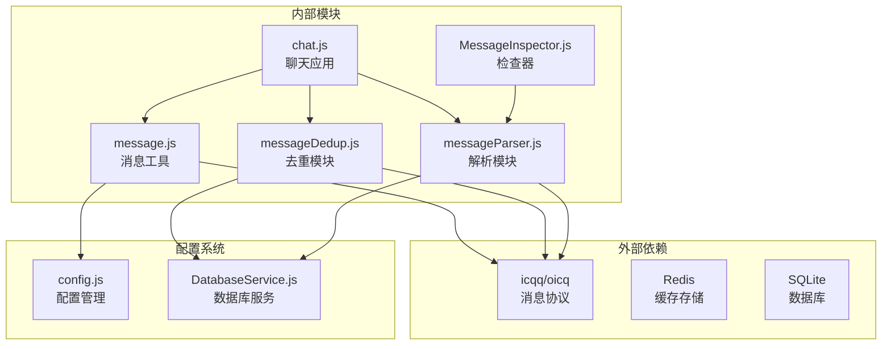

**图表来源**
- [index.js](file://index.js#L1-L50)
- [message.js](file://src/mcp/tools/message.js#L1-L32)
- [messageDedup.js](file://src/utils/messageDedup.js#L1-L20)
- [messageParser.js](file://src/utils/messageParser.js#L1-L30)

### 模块耦合度

消息操作工具模块具有良好的内聚性和适度的耦合度：

- **高内聚**：所有消息相关功能集中在单一工具文件中
- **低耦合**：与其他模块通过接口和事件进行交互
- **可扩展**：支持新的消息类型和协议的扩展

**章节来源**
- [index.js](file://index.js#L114-L136)
- [message.js](file://src/mcp/tools/message.js#L1-L50)

## 性能考虑

### 内存管理

系统采用了多种内存优化策略：

1. **消息去重缓存**：限制缓存大小，自动清理过期数据
2. **弱引用映射**：使用 WeakMap 避免内存泄漏
3. **定时清理**：定期清理过期的消息指纹和处理状态

### 并发处理

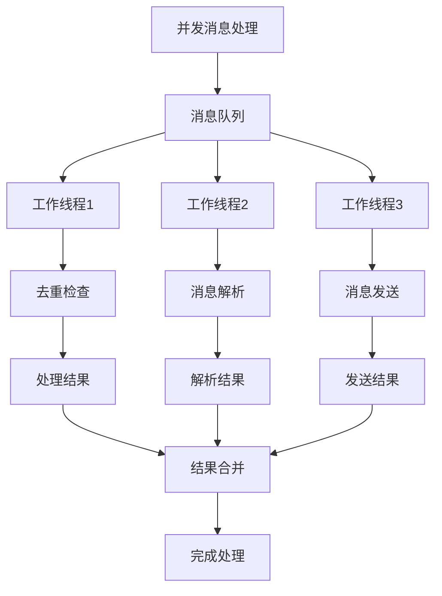

### 性能优化建议

1. **批量操作**：对于大量消息操作，建议使用批量处理模式
2. **缓存策略**：合理设置去重缓存的过期时间
3. **资源管理**：及时释放不再使用的消息解析结果

## 故障排除指南

### 常见问题及解决方案

#### 消息重复问题

**问题现象**：消息被重复处理或显示

**可能原因**：
1. 消息回显机制未正确识别
2. 去重缓存配置不当
3. 多个协议适配器同时处理同一消息

**解决方案**：
1. 检查 `messageDedup.js` 中的去重配置
2. 验证消息回显检测逻辑
3. 确保消息只被一个适配器处理

#### @用户失败

**问题现象**：@用户功能无法正常工作

**可能原因**：
1. 用户QQ号格式不正确
2. 群成员信息获取失败
3. 权限不足

**解决方案**：
1. 验证QQ号格式（5-12位数字）
2. 检查群成员列表获取
3. 确认机器人在群组中的权限

#### 私聊消息发送失败

**问题现象**：私聊消息无法发送

**可能原因**：
1. 非好友关系
2. 临时会话不可用
3. 群号获取失败

**解决方案**：
1. 确保与目标用户为好友关系
2. 检查群临时会话功能
3. 验证群号参数的正确性

**章节来源**
- [README.md](file://README.md#L705-L722)
- [messageDedup.js](file://src/utils/messageDedup.js#L238-L319)

### 调试工具

#### 消息检查器

消息检查器提供了强大的调试功能：

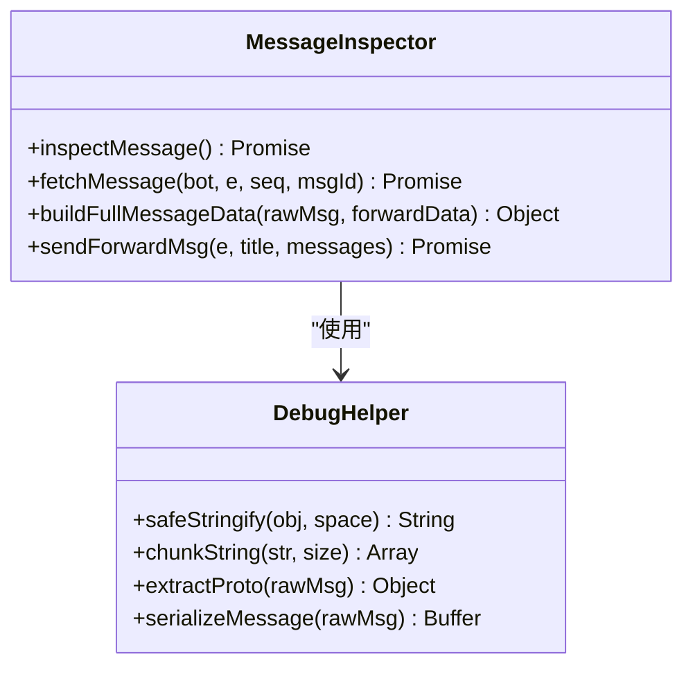

**图表来源**
- [MessageInspector.js](file://apps/MessageInspector.js#L138-L277)

**章节来源**
- [MessageInspector.js](file://apps/MessageInspector.js#L1-L200)

## 结论

消息操作工具模块为 ChatAI 插件提供了完整的消息处理能力。通过精心设计的架构和多重保护机制，该模块能够：

1. **全面支持**：涵盖所有常见的消息操作需求
2. **高度可靠**：通过多层次的去重和防护机制确保稳定性
3. **易于扩展**：模块化设计便于添加新的消息类型和协议支持
4. **性能优异**：合理的内存管理和并发处理策略保证高效运行

该工具集不仅满足了基本的消息发送和接收需求，还提供了丰富的高级功能，如消息解析、转发处理、批量操作等，为构建复杂的聊天应用场景奠定了坚实的基础。

在未来的发展中，建议重点关注：
- 更多协议的支持和优化
- 性能监控和调优
- 用户体验的持续改进
- 安全性和权限管理的加强
