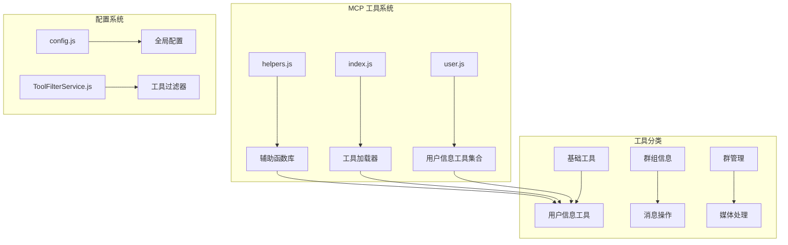
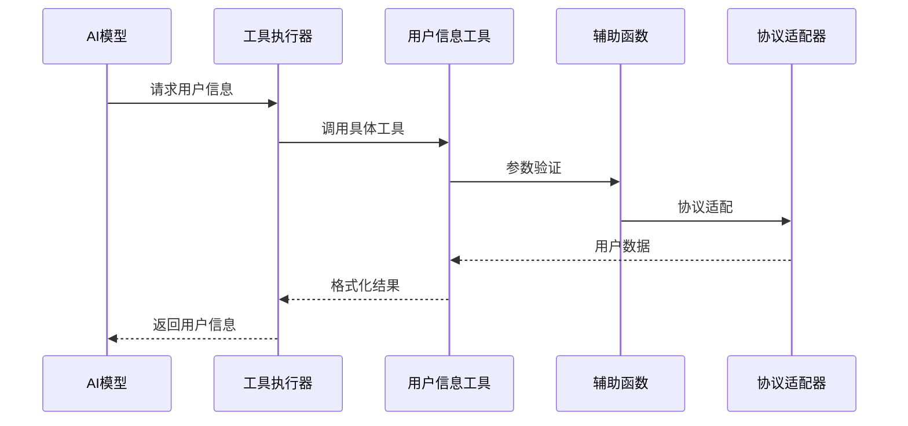
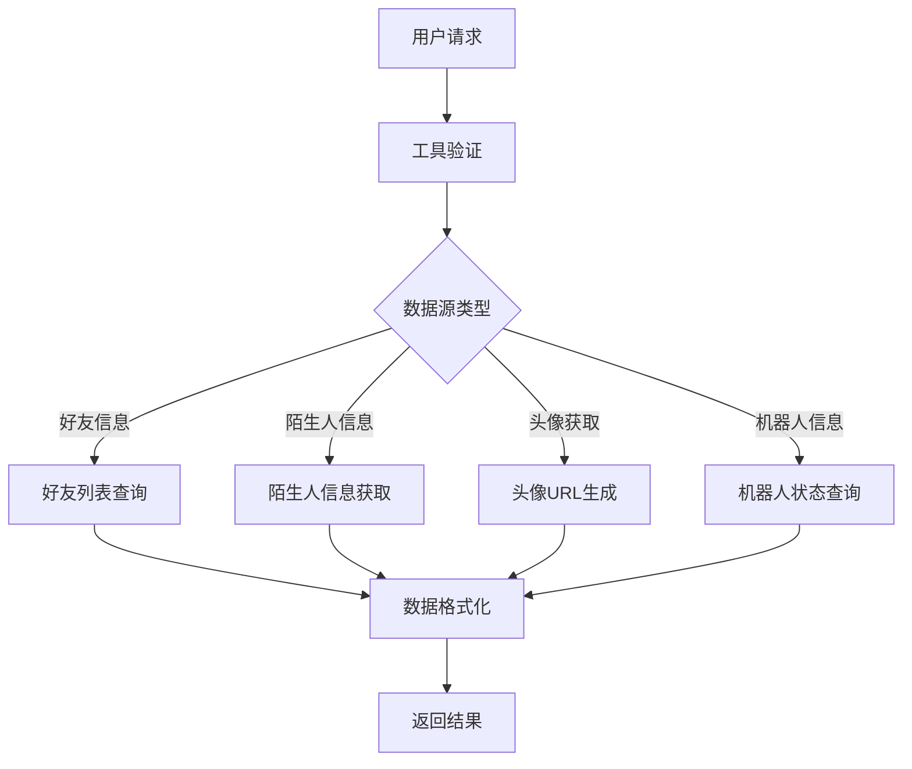
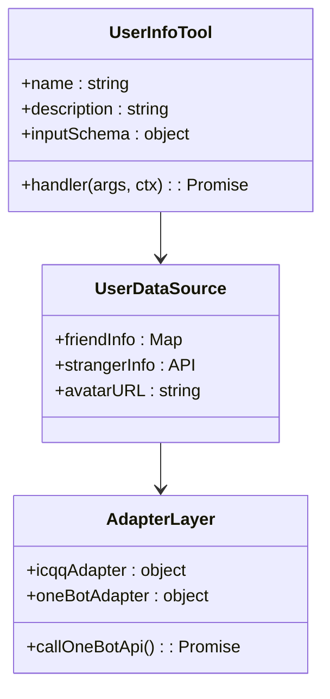
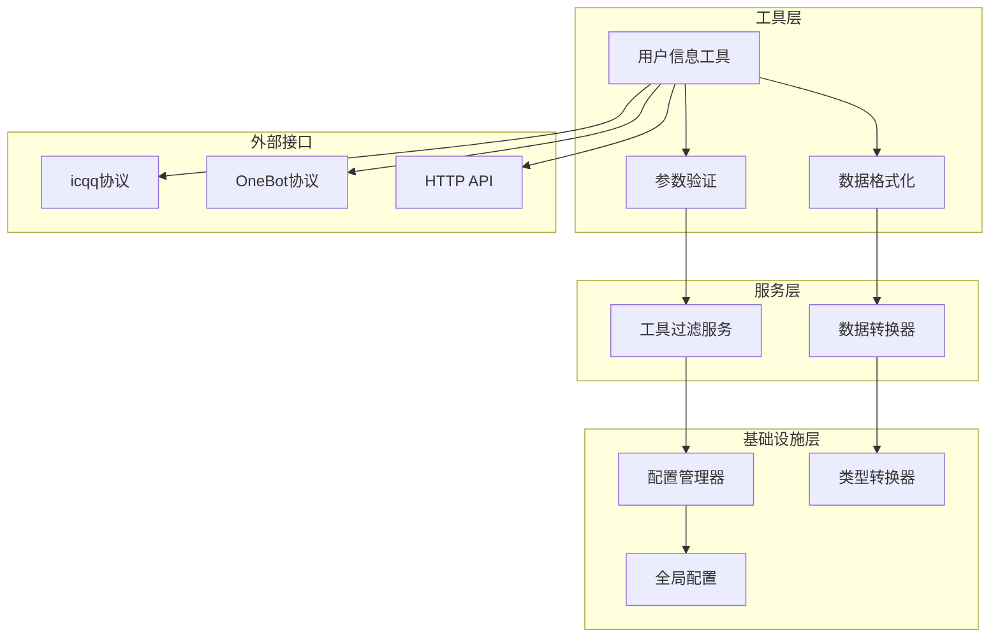

# 用户信息工具

<cite>
**本文档引用的文件**
- [README.md](file://README.md)
- [user.js](file://src/mcp/tools/user.js)
- [index.js](file://src/mcp/tools/index.js)
- [helpers.js](file://src/mcp/tools/helpers.js)
- [config.js](file://config/config.js)
- [TOOL_FILTER_SERVICE.JS](file://src/services/tools/ToolFilterService.js)
- [TOOLS.MD](file://docs/TOOLS.md)
</cite>

## 目录
1. [简介](#简介)
2. [项目结构](#项目结构)
3. [核心组件](#核心组件)
4. [架构概览](#架构概览)
5. [详细组件分析](#详细组件分析)
6. [依赖关系分析](#依赖关系分析)
7. [性能考虑](#性能考虑)
8. [故障排除指南](#故障排除指南)
9. [结论](#结论)

## 简介

用户信息工具是 ChatAI Plugin 插件中的重要组成部分，专门用于获取和管理 QQ 机器人的用户相关信息。该工具集提供了全面的用户信息查询、好友管理、头像获取等功能，支持多种数据源和适配器，确保在不同协议环境下的一致性表现。

本工具集包含 8 个核心工具，涵盖用户基本信息获取、好友列表管理、用户状态查询等多个方面，为开发者提供了灵活而强大的用户数据访问能力。

## 项目结构

用户信息工具位于插件的 MCP 工具系统中，采用模块化设计：

**图表来源**
- [user.js](file://src/mcp/tools/user.js#L1-L369)
- [index.js](file://src/mcp/tools/index.js#L1-L181)

**章节来源**
- [user.js](file://src/mcp/tools/user.js#L1-L369)
- [index.js](file://src/mcp/tools/index.js#L1-L181)

## 核心组件

用户信息工具集包含以下 8 个核心工具：

### 1. 基本信息获取工具
- **get_user_info**: 获取用户基本信息（昵称、头像、性别等）
- **get_user_profile**: 获取用户详细资料（签名、等级等）
- **get_bot_info**: 获取机器人自身信息

### 2. 好友管理工具
- **get_friend_list**: 获取机器人的好友列表
- **check_is_friend**: 检查用户是否为好友
- **search_friend**: 在好友列表中搜索用户

### 3. 交互工具
- **send_like**: 给用户点赞（需要是好友）
- **get_avatar**: 获取用户或群头像URL

### 4. 会话工具
- **get_sender_info**: 获取当前消息发送者的详细信息

每个工具都遵循统一的接口规范，提供一致的参数定义和返回格式。

**章节来源**
- [user.js](file://src/mcp/tools/user.js#L8-L369)

## 架构概览

用户信息工具采用分层架构设计，确保功能的模块化和可扩展性：

**图表来源**
- [user.js](file://src/mcp/tools/user.js#L19-L72)
- [helpers.js](file://src/mcp/tools/helpers.js#L169-L184)

### 数据流架构

**图表来源**
- [user.js](file://src/mcp/tools/user.js#L24-L71)
- [helpers.js](file://src/mcp/tools/helpers.js#L148-L162)

## 详细组件分析

### get_user_info 工具

该工具负责获取 QQ 用户的基本信息，支持好友和陌生人两种数据源：

**图表来源**
- [user.js](file://src/mcp/tools/user.js#L10-L72)
- [helpers.js](file://src/mcp/tools/helpers.js#L127-L174)

#### 参数配置
- **user_id** (必需): 用户QQ号，字符串格式
- 支持的数据类型：整数字符串或纯数字字符串

#### 返回数据格式
成功的返回包含以下字段：
- `success`: true/false，操作是否成功
- `adapter`: 协议适配器类型
- `user_id`: 用户QQ号
- `nickname`: 用户昵称
- `remark`: 备注信息（好友）
- `sex`: 性别信息
- `is_friend`: 是否为好友
- `avatar_url`: 头像URL

#### 权限要求
- 无需特殊权限，可查询任意用户信息
- 点赞功能需要用户为好友关系

**章节来源**
- [user.js](file://src/mcp/tools/user.js#L10-L72)

### get_friend_list 工具

用于获取机器人的好友列表，支持分页和数量限制：

#### 参数配置
- **limit**: 返回的最大数量，默认50，最大100

#### 返回数据格式
- `success`: 操作结果
- `total`: 好友总数
- `returned`: 实际返回数量
- `friends`: 好友数组，包含 `user_id`、`nickname`、`remark`

**章节来源**
- [user.js](file://src/mcp/tools/user.js#L76-L102)

### send_like 工具

实现给好友点赞的功能，支持批量点赞：

#### 参数配置
- **user_id** (必需): 用户QQ号
- **times**: 点赞次数，默认10，范围1-20

#### 实现机制
- 使用 icqqFriend.thumbUp 进行点赞操作
- 支持 OneBot 协议的 send_like API
- 自动处理协议差异

**章节来源**
- [user.js](file://src/mcp/tools/user.js#L106-L133)
- [helpers.js](file://src/mcp/tools/helpers.js#L157-L161)

### get_avatar 工具

获取用户或群组头像的URL地址：

#### 参数配置
- **type** (必需): 类型，'user' 或 'group'
- **id** (必需): QQ号或群号
- **size**: 头像尺寸，默认640，可选40、100、140、640

#### 返回数据格式
- `success`: 操作结果
- `type`: 类型标识
- `id`: ID号码
- `size`: 尺寸大小
- `url`: 头像URL

**章节来源**
- [user.js](file://src/mcp/tools/user.js#L137-L162)

### get_sender_info 工具

获取当前消息发送者的详细信息：

#### 返回数据格式
- `success`: 操作结果
- `user_id`: 用户ID
- `nickname`: 昵称
- `card`: 群名片
- `role`: 群组角色
- `title`: 群头衔
- `sex`: 性别
- `age`: 年龄
- `level`: 等级
- `avatar_url`: 头像URL
- `is_group`: 是否在群组中
- `is_friend`: 是否为好友

**章节来源**
- [user.js](file://src/mcp/tools/user.js#L166-L208)

### search_friend 工具

在好友列表中搜索用户，支持昵称和备注搜索：

#### 参数配置
- **keyword** (必需): 搜索关键词
- **limit**: 返回数量限制，默认10

#### 搜索机制
- 支持昵称和备注的模糊匹配
- 不区分大小写
- 返回匹配类型（昵称或备注）

**章节来源**
- [user.js](file://src/mcp/tools/user.js#L212-L255)

### check_is_friend 工具

检查指定用户是否为机器人的好友：

#### 返回数据格式
- `success`: 操作结果
- `user_id`: 用户ID
- `is_friend`: 是否为好友
- `nickname`: 好友昵称
- `remark`: 好友备注
- `avatar_url`: 头像URL

**章节来源**
- [user.js](file://src/mcp/tools/user.js#L259-L288)

### get_bot_info 工具

获取机器人自身的信息状态：

#### 返回数据格式
- `success`: 操作结果
- `user_id`: 机器人ID
- `nickname`: 昵称
- `sex`: 性别
- `age`: 年龄
- `friend_count`: 好友数量
- `group_count`: 群组数量
- `avatar_url`: 头像URL
- `status`: 在线状态
- `platform`: 平台信息

**章节来源**
- [user.js](file://src/mcp/tools/user.js#L292-L317)

### get_user_profile 工具

获取用户的详细资料信息：

#### 返回数据格式
- `success`: 操作结果
- `user_id`: 用户ID
- `nickname`: 昵称
- `sex`: 性别
- `age`: 年龄
- `level`: 等级
- `sign/signature`: 个性签名
- `qid`: Q号ID
- `is_friend`: 是否为好友
- `remark`: 好友备注
- `avatar_url`: 头像URL

**章节来源**
- [user.js](file://src/mcp/tools/user.js#L321-L366)

## 依赖关系分析

用户信息工具的依赖关系体现了清晰的分层架构：

**图表来源**
- [index.js](file://src/mcp/tools/index.js#L68-L113)
- [config.js](file://config/config.js#L62-L586)

### 核心依赖组件

1. **工具加载器**: 动态加载和管理工具模块
2. **参数验证器**: 统一的参数验证和类型检查
3. **协议适配器**: 支持多种协议的统一接口
4. **配置管理器**: 全局配置和工具过滤规则

**章节来源**
- [index.js](file://src/mcp/tools/index.js#L1-L181)
- [config.js](file://config/config.js#L1-L631)

## 性能考虑

用户信息工具在设计时充分考虑了性能优化：

### 缓存策略
- 工具模块采用动态加载，避免不必要的内存占用
- 支持热重载机制，便于开发和调试
- 限制好友列表的返回数量，防止大数据量传输

### 并发处理
- 工具调用支持并发执行
- 消息发送去重机制，避免重复操作
- 异步处理机制，提升响应速度

### 资源管理
- 头像URL使用腾讯云存储，CDN加速
- 限制点赞次数，防止滥用
- 错误处理机制，确保系统稳定性

## 故障排除指南

### 常见问题及解决方案

#### 1. 用户信息获取失败
**症状**: 返回错误信息"无法获取用户信息，QQ号可能不存在"

**可能原因**:
- 用户ID格式错误
- 用户不存在或已注销
- 协议适配器不支持

**解决方法**:
- 验证用户ID格式（纯数字或字符串数字）
- 检查用户是否存在
- 确认协议适配器支持相应API

#### 2. 好友列表为空
**症状**: get_friend_list 返回空列表

**可能原因**:
- 机器人没有好友
- 协议限制无法获取好友列表
- 权限不足

**解决方法**:
- 检查机器人是否添加了好友
- 确认协议支持好友列表查询
- 验证机器人权限

#### 3. 点赞功能失败
**症状**: send_like 返回"点赞失败"

**可能原因**:
- 用户不是好友关系
- 协议不支持点赞功能
- 点赞次数超出限制

**解决方法**:
- 确认用户为好友关系
- 检查协议支持情况
- 调整点赞次数（1-20次）

#### 4. 头像URL无法访问
**症状**: 头像URL返回404或无法显示

**可能原因**:
- 用户头像已被删除
- 头像URL格式错误
- 网络连接问题

**解决方法**:
- 检查头像URL格式
- 验证用户头像存在性
- 确认网络连接正常

### 调试建议

1. **启用调试模式**: 在配置中设置 `basic.debug: true`
2. **检查日志输出**: 查看控制台详细的工具调用日志
3. **验证参数格式**: 确保所有必需参数都正确提供
4. **测试协议兼容性**: 确认当前协议支持所需功能

**章节来源**
- [config.js](file://config/config.js#L64-L75)
- [user.js](file://src/mcp/tools/user.js#L116-L133)

## 结论

用户信息工具集为 ChatAI Plugin 提供了完整而强大的用户数据管理能力。通过模块化设计和协议适配，该工具集能够在不同的 QQ 协议环境下提供一致的功能体验。

### 主要优势

1. **功能完整性**: 涵盖用户信息查询、好友管理、交互功能等全方位需求
2. **协议兼容性**: 支持 icqq、OneBot 等多种协议适配器
3. **易用性**: 统一的接口设计和参数规范，便于集成和使用
4. **安全性**: 内置工具过滤和权限控制机制
5. **可扩展性**: 模块化架构支持自定义工具扩展

### 最佳实践

1. **参数验证**: 始终验证用户输入的参数格式和有效性
2. **错误处理**: 实现完善的错误处理和用户友好的错误信息
3. **性能优化**: 合理使用 limit 参数，避免大数据量传输
4. **安全考虑**: 遵循工具过滤规则，避免敏感操作
5. **日志记录**: 启用调试模式进行问题诊断和性能分析

该工具集为开发者提供了坚实的基础，可以在此基础上构建更复杂的应用功能，满足各种用户信息管理需求。