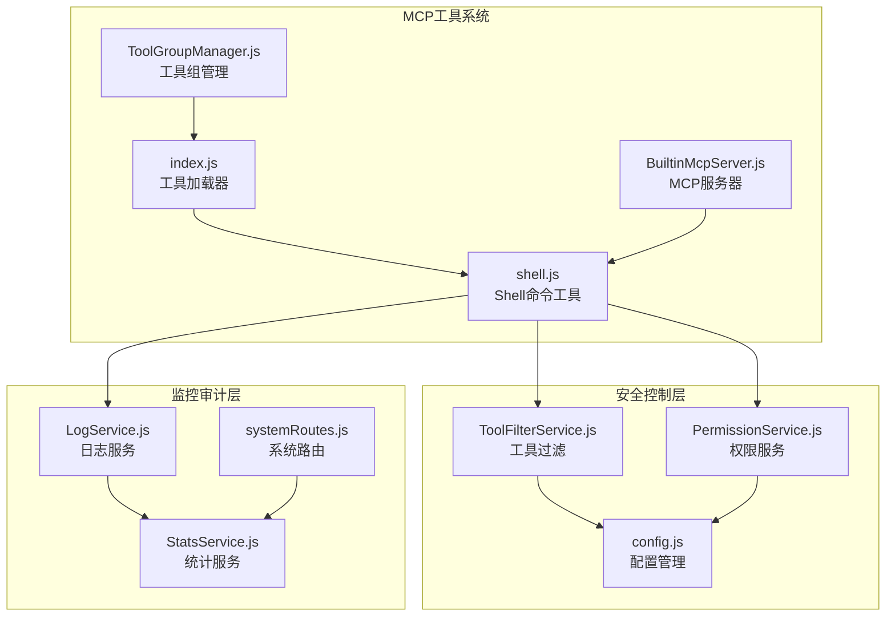
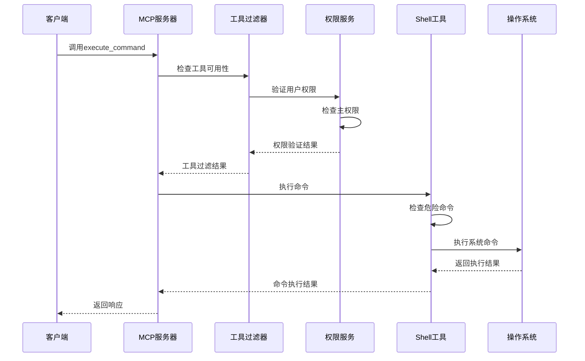
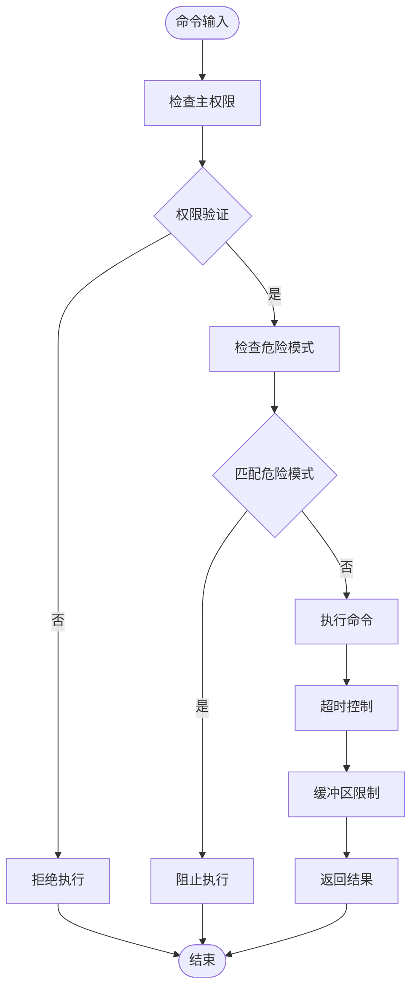
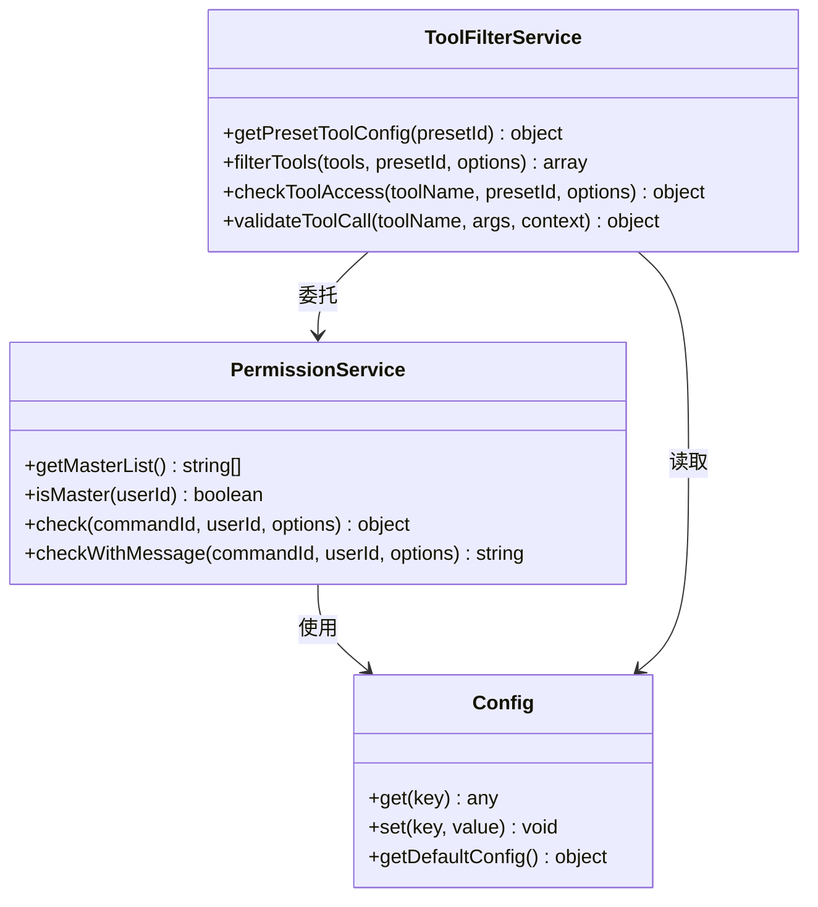
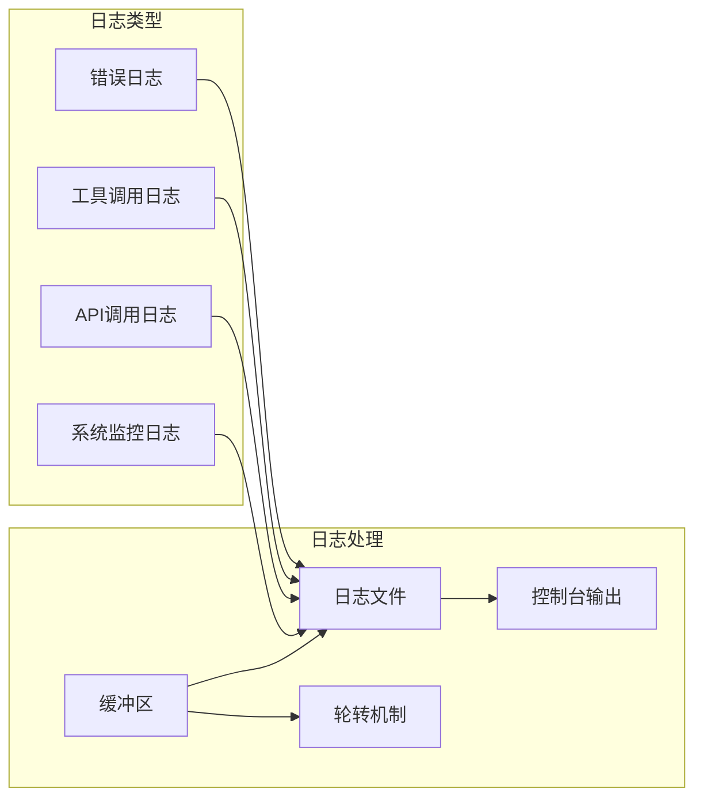
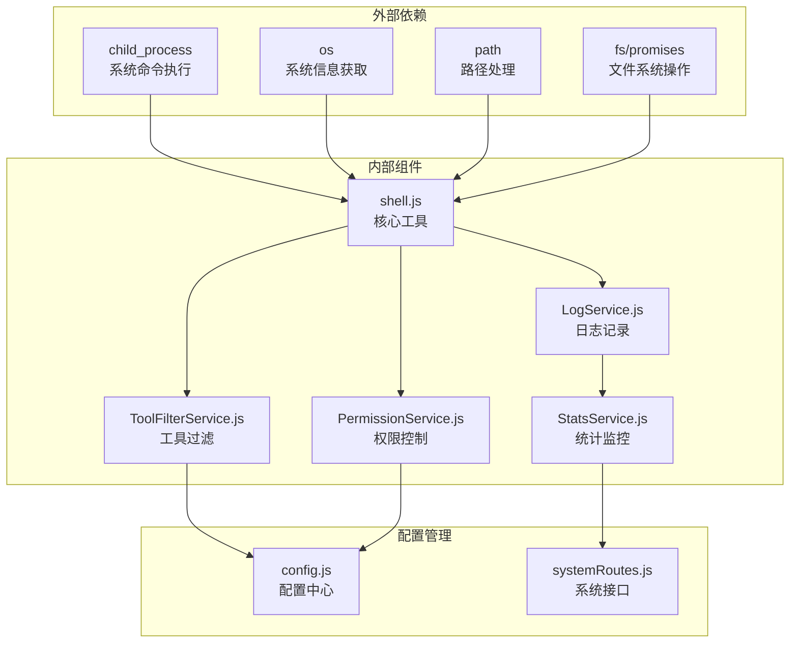

# 系统命令工具

## 目录
1. [简介](#简介)
2. [项目结构](#项目结构)
3. [核心组件](#核心组件)
4. [架构概览](#架构概览)
5. [详细组件分析](#详细组件分析)
6. [依赖关系分析](#依赖关系分析)
7. [性能考虑](#性能考虑)
8. [故障排除指南](#故障排除指南)
9. [结论](#结论)

## 简介

系统命令工具是本项目中的一个关键组件，负责提供Shell命令执行、系统信息获取、环境变量查询等危险操作功能。该工具集采用了多层次的安全防护机制，包括权限控制、命令过滤、沙箱限制等，确保在提供强大功能的同时保障系统的安全性。

该工具主要面向系统管理员和开发者，提供以下核心功能：
- Shell命令执行（危险操作）
- 系统信息获取（操作系统、CPU、内存、磁盘等）
- 进程信息查询
- 环境变量读取
- 目录列表浏览

## 项目结构

系统命令工具位于项目的MCP（Model Context Protocol）工具体系中，采用模块化设计：

**图表来源**
- [shell.js](file://src/mcp/tools/shell.js#L1-L348)
- [index.js](file://src/mcp/tools/index.js#L1-L181)
- [ToolFilterService.js](file://src/services/tools/ToolFilterService.js#L1-L314)

**章节来源**
- [shell.js](file://src/mcp/tools/shell.js#L1-L348)
- [index.js](file://src/mcp/tools/index.js#L1-L181)

## 核心组件

系统命令工具由多个核心组件构成，每个组件都有明确的职责分工：

### Shell命令执行工具
- **危险性标识**：标记为危险工具，需要特殊权限
- **多命令支持**：支持execute_command、get_system_info、get_process_info、read_env、list_directory等
- **平台兼容**：自动适配Windows和Unix系统

### 权限控制系统
- **主权限检查**：requireMaster标志确保只有系统主人可以执行
- **配置驱动**：通过config.js进行灵活的权限配置
- **多层验证**：结合ToolFilterService和PermissionService双重验证

### 安全防护机制
- **命令黑名单**：内置危险命令模式匹配
- **资源限制**：超时控制、缓冲区限制
- **环境隔离**：受控的工作目录和环境变量

**章节来源**
- [shell.js](file://src/mcp/tools/shell.js#L15-L323)
- [ToolFilterService.js](file://src/services/tools/ToolFilterService.js#L28-L48)
- [PermissionService.js](file://src/services/permission/PermissionService.js#L22-L484)

## 架构概览

系统命令工具采用分层架构设计，确保功能的模块化和安全性：

**图表来源**
- [BuiltinMcpServer.js](file://src/mcp/BuiltinMcpServer.js#L928-L1069)
- [ToolFilterService.js](file://src/services/tools/ToolFilterService.js#L182-L214)
- [PermissionService.js](file://src/services/permission/PermissionService.js#L337-L421)

## 详细组件分析

### Shell命令执行组件

Shell命令执行组件是系统中最核心也是最危险的组件，它提供了直接的系统命令执行能力：

#### 危险命令检测机制

**图表来源**
- [shell.js](file://src/mcp/tools/shell.js#L43-L108)

#### 支持的命令类型

系统命令工具支持以下五种主要命令类型：

| 命令名称 | 功能描述 | 安全等级 | 配置要求 |
|---------|----------|----------|----------|
| execute_command | 执行Shell命令 | 危险 | requireMaster: true |
| get_system_info | 获取系统信息 | 低风险 | 无 |
| get_process_info | 获取进程信息 | 低风险 | 无 |
| read_env | 读取环境变量 | 中等风险 | 敏感变量过滤 |
| list_directory | 列出目录内容 | 低风险 | 无 |

**章节来源**
- [shell.js](file://src/mcp/tools/shell.js#L15-L323)

### 权限控制组件

权限控制组件确保只有授权用户才能执行危险操作：

#### 权限验证流程

**图表来源**
- [PermissionService.js](file://src/services/permission/PermissionService.js#L22-L484)
- [ToolFilterService.js](file://src/services/tools/ToolFilterService.js#L28-L314)

#### 权限层次结构

系统采用多层权限控制机制：

1. **主权限层**：系统主人拥有最高权限
2. **管理员层**：群管理员具有特定管理权限
3. **用户层**：普通用户只能执行非危险操作
4. **配置层**：通过配置文件进行细粒度控制

**章节来源**
- [PermissionService.js](file://src/services/permission/PermissionService.js#L316-L421)
- [ToolFilterService.js](file://src/services/tools/ToolFilterService.js#L182-L214)

### 安全防护组件

安全防护组件提供多层次的安全保护机制：

#### 危险命令黑名单

系统内置了全面的危险命令检测模式：

| 命令类型 | 检测模式 | 说明 |
|---------|----------|------|
| 系统删除 | `/rm\s+-rf\s+\/(?!\w)/i` | 防止根目录删除 |
| 文件系统格式化 | `/mkfs/i` | 防止文件系统格式化 |
| 磁盘写入 | `/>\s*\/dev\/sd/i` | 防止直接磁盘写入 |
| 权限修改 | `/chmod\s+777\s+\//i` | 防止权限滥用 |
| 系统服务控制 | `/systemctl\s+(stop|disable|mask)/i` | 防止服务管理 |
| 进程控制 | `/kill\s+-9\s+(-1|1)/i` | 防止进程杀死 |
| 用户切换 | `/su\s+-/i` | 防止用户身份切换 |

#### 资源限制机制

系统实施了多重资源限制来防止滥用：

- **超时控制**：默认30秒超时，防止长时间阻塞
- **缓冲区限制**：最大10MB输出缓冲区
- **并发控制**：工具调用的并发执行限制
- **内存监控**：实时监控内存使用情况

**章节来源**
- [shell.js](file://src/mcp/tools/shell.js#L57-L86)
- [common.js](file://src/utils/common.js#L339-L342)

### 监控审计组件

监控审计组件提供完整的操作记录和统计功能：

#### 日志记录机制

**图表来源**
- [LogService.js](file://src/services/stats/LogService.js#L12-L553)

#### 统计监控功能

系统提供全面的统计监控功能：

- **实时RPM统计**：每分钟请求数统计
- **成功率监控**：API调用成功率计算
- **资源使用监控**：内存、CPU使用情况
- **工具调用统计**：各工具使用频率分析

**章节来源**
- [LogService.js](file://src/services/stats/LogService.js#L378-L470)
- [StatsService.js](file://src/services/stats/StatsService.js#L58-L72)

## 依赖关系分析

系统命令工具的依赖关系体现了清晰的分层架构：

**图表来源**
- [shell.js](file://src/mcp/tools/shell.js#L8-L13)
- [config.js](file://config/config.js#L1-L631)

**章节来源**
- [shell.js](file://src/mcp/tools/shell.js#L8-L13)
- [config.js](file://config/config.js#L1-L631)

## 性能考虑

系统命令工具在设计时充分考虑了性能优化：

### 内存管理
- **缓冲区优化**：合理设置输出缓冲区大小（10MB）
- **垃圾回收**：及时清理临时对象和监听器
- **内存监控**：实时监控内存使用情况

### 并发控制
- **执行限制**：默认30秒超时防止长时间阻塞
- **并发队列**：限制同时执行的命令数量
- **资源池**：复用系统资源减少开销

### 缓存策略
- **工具加载缓存**：避免重复加载工具模块
- **配置缓存**：缓存配置信息减少IO操作
- **权限缓存**：缓存权限检查结果

## 故障排除指南

### 常见问题及解决方案

#### 权限相关问题
**问题**：执行命令时提示权限不足
**原因**：用户不是系统主人或权限配置错误
**解决**：
1. 确认用户是否在主权限列表中
2. 检查config.js中的admin.masterQQ配置
3. 验证工具的requireMaster设置

#### 命令执行失败
**问题**：命令执行超时或返回错误
**原因**：命令过于复杂或系统资源不足
**解决**：
1. 检查命令的复杂度和执行时间
2. 调整timeout参数设置
3. 监控系统资源使用情况

#### 安全拦截问题
**问题**：命令被安全系统拦截
**原因**：命令匹配危险模式检测规则
**解决**：
1. 检查命令是否包含危险模式
2. 修改命令避免触发检测规则
3. 联系系统管理员调整安全策略

**章节来源**
- [PermissionService.js](file://src/services/permission/PermissionService.js#L316-L421)
- [ToolFilterService.js](file://src/services/tools/ToolFilterService.js#L244-L262)

## 结论

系统命令工具通过精心设计的多层安全防护机制，在提供强大系统管理能力的同时，确保了系统的安全性和稳定性。其核心特点包括：

### 安全特性
- **权限分离**：严格的主权限控制和分级权限管理
- **命令过滤**：全面的危险命令检测和拦截机制
- **资源限制**：多重资源限制防止系统滥用
- **审计追踪**：完整的操作日志和统计监控

### 功能特性
- **平台兼容**：支持Windows和Unix系统的命令执行
- **灵活配置**：通过配置文件实现灵活的权限控制
- **实时监控**：提供系统状态和性能监控
- **错误处理**：完善的错误捕获和处理机制

### 最佳实践建议
1. **最小权限原则**：只授予必要的系统权限
2. **定期审计**：定期检查系统日志和使用统计
3. **安全培训**：对系统管理员进行安全使用培训
4. **监控告警**：建立系统监控和异常告警机制

通过遵循这些安全最佳实践，系统命令工具可以安全有效地服务于系统管理和维护需求，为用户提供强大的系统管理能力。
