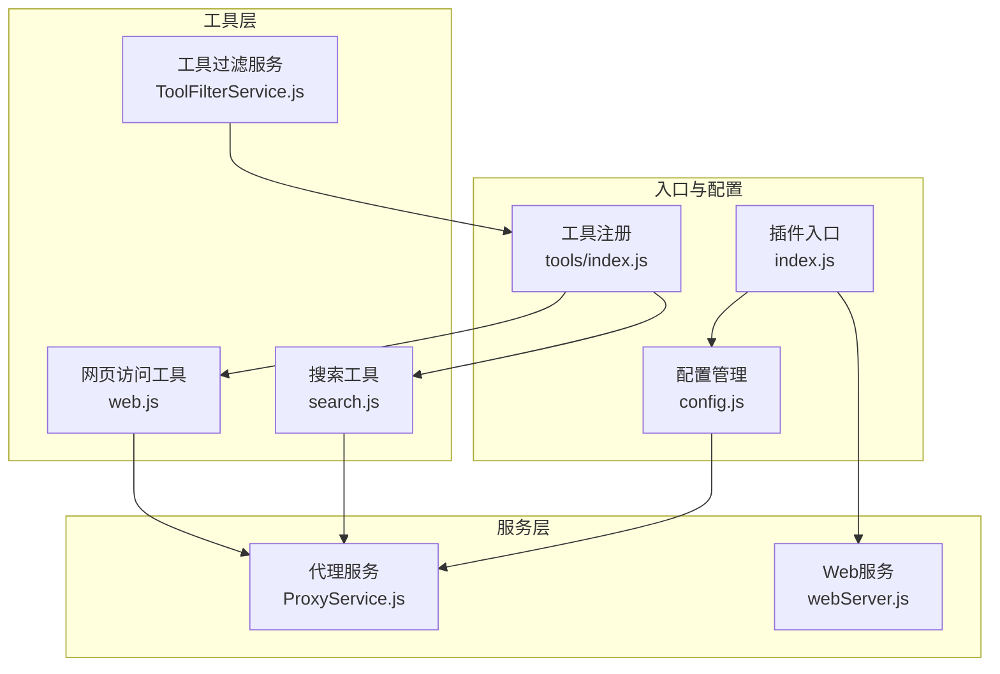
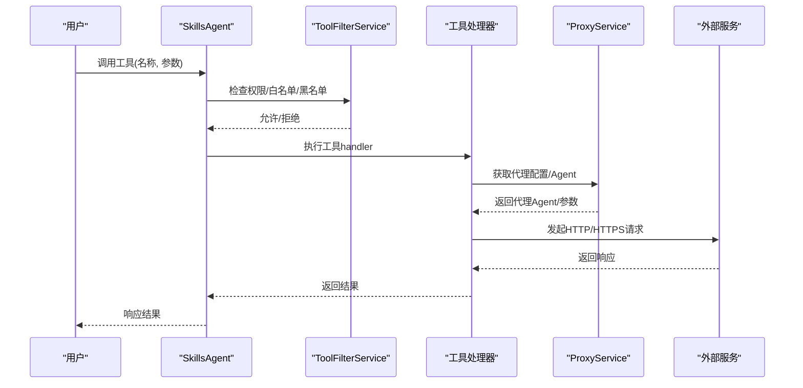
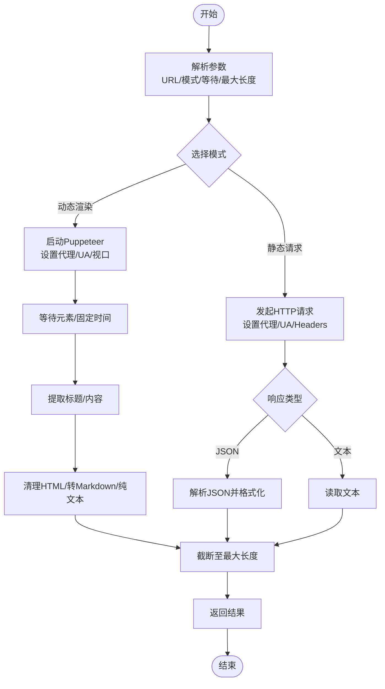
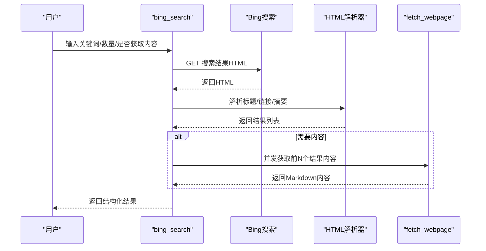
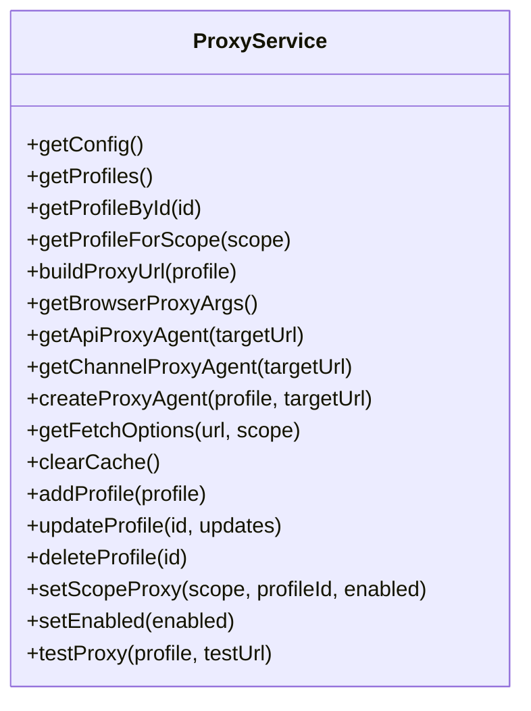
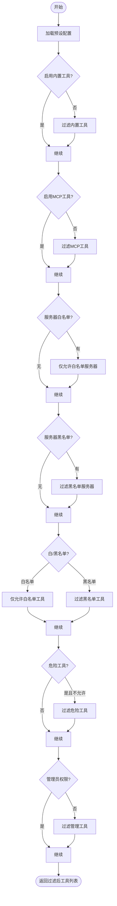
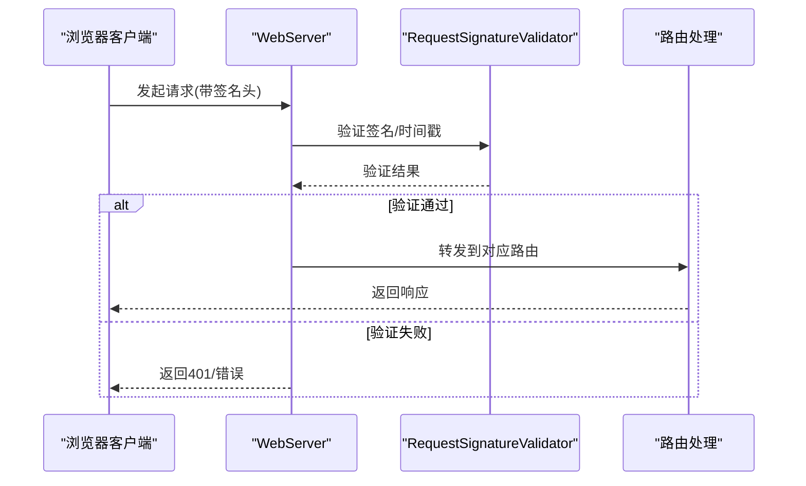
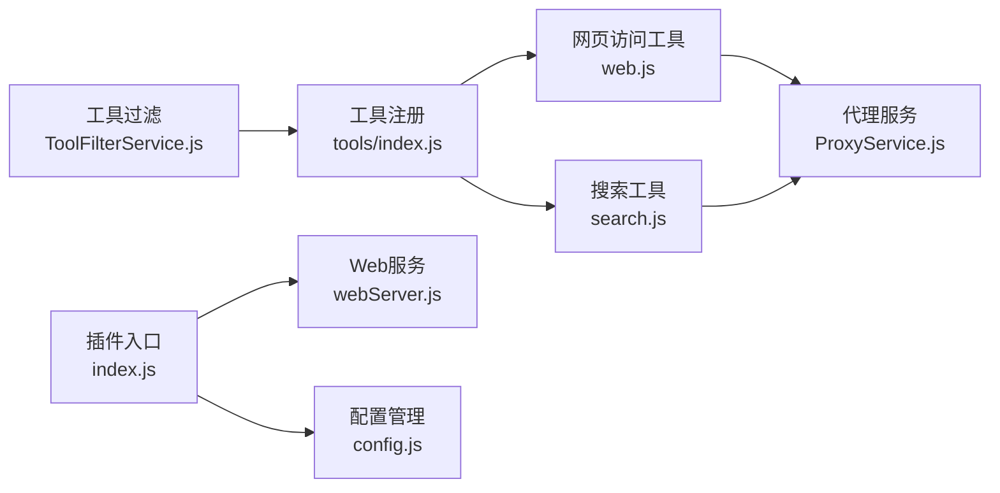

# 网页访问与搜索工具

## 目录
1. [简介](#简介)
2. [项目结构](#项目结构)
3. [核心组件](#核心组件)
4. [架构总览](#架构总览)
5. [详细组件分析](#详细组件分析)
6. [依赖关系分析](#依赖关系分析)
7. [性能考虑](#性能考虑)
8. [故障排除指南](#故障排除指南)
9. [结论](#结论)
10. [附录](#附录)

## 简介
本文件面向“网页访问与搜索工具”类别，系统性介绍该插件在网页内容抓取、API调用、搜索引擎、百科查询、翻译服务等方面的实现与使用方法。文档涵盖：
- 网络请求配置（代理、超时、User-Agent）
- 错误重试与降级策略
- 搜索优化与内容过滤
- 网络安全与反爬虫应对

## 项目结构
该插件采用模块化设计，工具按类别组织并通过统一的代理系统进行加载与执行。网页访问与搜索工具主要分布在以下位置：
- 网页访问工具：src/mcp/tools/web.js
- 搜索工具：src/mcp/tools/search.js
- 代理服务：src/services/proxy/ProxyService.js
- 工具过滤：src/services/tools/ToolFilterService.js
- 工具注册与分类：src/mcp/tools/index.js
- Web服务与认证：src/services/webServer.js
- 插件入口与代理：index.js、config/config.js

图表来源
- [web.js](file://src/mcp/tools/web.js#L1-L240)
- [search.js](file://src/mcp/tools/search.js#L1-L974)
- [ProxyService.js](file://src/services/proxy/ProxyService.js#L1-L316)
- [ToolFilterService.js](file://src/services/tools/ToolFilterService.js#L1-L314)
- [webServer.js](file://src/services/webServer.js#L1-L200)
- [index.js](file://src/mcp/tools/index.js#L1-L181)
- [index.js](file://index.js#L1-L258)
- [config.js](file://config/config.js#L1-L200)

章节来源
- [README.md](file://README.md#L356-L396)
- [index.js](file://index.js#L1-L258)
- [config.js](file://config/config.js#L1-L200)

## 核心组件
- 网页访问工具（website/fetch_url）
  - 支持动态渲染（Puppeteer）与静态HTTP请求两种模式
  - 输出模式：HTML、Markdown、纯文本
  - 支持代理、超时控制、内容截断
- 搜索工具（bing_search/web_search/fetch_webpage/search_wiki/translate）
  - 多引擎搜索（Bing、DuckDuckGo）
  - 维基百科、百度百科、翻译、天气、IP查询、热搜等
- 代理服务（ProxyService）
  - 支持HTTP/HTTPS/SOCKS代理，按环境（browser/api/channel）分域配置
  - 代理Agent缓存与测试
- 工具过滤（ToolFilterService）
  - 白名单/黑名单、危险工具控制、管理员权限校验
  - 工具调用限制（并发、连续调用、总调用次数）

章节来源
- [web.js](file://src/mcp/tools/web.js#L88-L240)
- [search.js](file://src/mcp/tools/search.js#L172-L800)
- [ProxyService.js](file://src/services/proxy/ProxyService.js#L13-L316)
- [ToolFilterService.js](file://src/services/tools/ToolFilterService.js#L28-L314)

## 架构总览
网页访问与搜索工具通过统一的工具注册中心加载，执行时根据预设与权限进行过滤，网络请求由代理服务统一管理，Web服务提供可视化配置与管理入口。

图表来源
- [index.js](file://src/services/agent/index.js#L1-L66)
- [ToolFilterService.js](file://src/services/tools/ToolFilterService.js#L89-L173)
- [web.js](file://src/mcp/tools/web.js#L107-L177)
- [search.js](file://src/mcp/tools/search.js#L185-L291)
- [ProxyService.js](file://src/services/proxy/ProxyService.js#L93-L174)

## 详细组件分析

### 网页访问工具（website/fetch_url）
- website
  - 使用Puppeteer进行动态渲染，支持等待元素、设置User-Agent、视口大小
  - 支持代理注入（浏览器参数）
  - 输出模式：HTML、Markdown、纯文本；支持最大长度截断
- fetch_url
  - 使用node-fetch进行静态HTTP请求
  - 支持GET/POST、自定义Headers、JSON自动解析
  - 支持代理Agent注入（API/Channel作用域）

图表来源
- [web.js](file://src/mcp/tools/web.js#L107-L177)
- [web.js](file://src/mcp/tools/web.js#L194-L237)

章节来源
- [web.js](file://src/mcp/tools/web.js#L88-L240)

### 搜索工具（bing_search/web_search/fetch_webpage/search_wiki/translate）
- bing_search
  - 通过解析Bing搜索HTML提取标题、链接、摘要
  - 可选获取网页内容并转为Markdown
- web_search
  - 统一封装：优先Bing，支持DuckDuckGo
  - 返回结构化结果（标题、链接、摘要、来源）
- fetch_webpage
  - 将任意URL内容转为Markdown，支持最大长度限制
- search_wiki
  - 调用Wikipedia REST API，返回摘要、缩略图、描述
- translate
  - 使用MyMemory翻译API，支持自动语言检测与目标语言

图表来源
- [search.js](file://src/mcp/tools/search.js#L185-L291)
- [search.js](file://src/mcp/tools/search.js#L295-L308)

章节来源
- [search.js](file://src/mcp/tools/search.js#L172-L800)

### 代理服务（ProxyService）
- 作用域配置
  - browser：浏览器/Puppeteer
  - api：通用API请求（fetch/axios）
  - channel：渠道API请求（LLM）
- 支持代理类型
  - HTTP/HTTPS、SOCKS4/5
- 功能
  - 获取代理URL、构建Agent、缓存Agent、测试连通性
  - 按作用域启用/禁用、设置profileId

图表来源
- [ProxyService.js](file://src/services/proxy/ProxyService.js#L13-L316)

章节来源
- [ProxyService.js](file://src/services/proxy/ProxyService.js#L1-L316)

### 工具过滤（ToolFilterService）
- 过滤维度
  - 内置/自定义/MCP工具启用控制
  - MCP服务器白名单/黑名单
  - 工具白名单/黑名单
  - 危险工具控制（默认危险工具列表）
  - 管理员权限限制
- 参数校验与限制
  - 针对特定工具的参数校验（如禁言时间范围、消息内容非空）
  - 工具调用限制（连续调用、总调用次数、并行执行）

图表来源
- [ToolFilterService.js](file://src/services/tools/ToolFilterService.js#L89-L173)

章节来源
- [ToolFilterService.js](file://src/services/tools/ToolFilterService.js#L28-L314)

### Web服务与认证
- Web服务负责管理面板的启动与路由
- 请求签名验证（时间戳、Nonce、Body Hash、签名）
- JWT密钥管理与持久化

图表来源
- [webServer.js](file://src/services/webServer.js#L156-L199)

章节来源
- [webServer.js](file://src/services/webServer.js#L1-L200)

## 依赖关系分析
- 工具注册与分类
  - 通过工具注册中心按类别加载工具，支持热重载
- 代理服务耦合点
  - 网页访问工具与搜索工具均依赖代理服务进行网络请求
- 过滤服务耦合点
  - 工具过滤贯穿工具执行前的权限与白/黑名单校验
- Web服务耦合点
  - 插件入口启动Web服务，提供管理面板与配置

图表来源
- [index.js](file://src/mcp/tools/index.js#L1-L181)
- [web.js](file://src/mcp/tools/web.js#L1-L240)
- [search.js](file://src/mcp/tools/search.js#L1-L974)
- [ProxyService.js](file://src/services/proxy/ProxyService.js#L1-L316)
- [ToolFilterService.js](file://src/services/tools/ToolFilterService.js#L1-L314)
- [index.js](file://index.js#L1-L258)
- [webServer.js](file://src/services/webServer.js#L1-L200)
- [config.js](file://config/config.js#L1-L200)

章节来源
- [index.js](file://src/mcp/tools/index.js#L1-L181)
- [index.js](file://index.js#L1-L258)

## 性能考虑
- Puppeteer动态渲染
  - 启动成本较高，建议合理设置等待时间与最大长度，避免长时间渲染
  - 可通过代理与User-Agent提升稳定性
- 并发与限流
  - 搜索工具在获取网页内容时采用并发限制（前N个结果），避免过度请求
- 代理缓存
  - 代理Agent缓存减少重复创建开销
- 工具过滤
  - 通过白/黑名单与管理员权限提前过滤，减少无效调用

## 故障排除指南
- 网络请求失败
  - 检查代理配置与连通性，使用代理测试功能验证
  - 确认User-Agent与请求头设置是否符合目标站点要求
- 超时与重试
  - 网页访问工具内部使用固定等待时间与最大长度截断
  - 搜索工具对HTTP请求设置了超时控制
- 工具被拒绝
  - 检查工具过滤配置（白/黑名单、危险工具、管理员权限）
  - 确认预设配置中的工具启用状态
- Web服务访问异常
  - 检查端口占用与防火墙
  - 确认签名头与时间戳有效性

章节来源
- [ProxyService.js](file://src/services/proxy/ProxyService.js#L280-L310)
- [web.js](file://src/mcp/tools/web.js#L134-L140)
- [search.js](file://src/mcp/tools/search.js#L107-L121)
- [ToolFilterService.js](file://src/services/tools/ToolFilterService.js#L182-L214)
- [webServer.js](file://src/services/webServer.js#L156-L199)

## 结论
本插件通过模块化的工具体系与统一的代理、过滤、Web服务，实现了稳定高效的网页访问与搜索能力。建议在生产环境中：
- 合理配置代理与超时参数
- 使用工具过滤保障安全与合规
- 结合预设与权限控制精细化管理工具调用
- 通过Web服务进行可视化配置与监控

## 附录
- 使用建议
  - 网页访问：优先使用静态请求（fetch_url）以降低资源消耗；需要动态渲染时再使用website
  - 搜索：优先Bing，必要时结合DuckDuckGo；注意内容截断与并发限制
  - 翻译：MyMemory免费但有配额限制，建议在业务中做缓存与降级
- 安全与合规
  - 严格控制危险工具与管理员权限
  - 遵守目标站点robots协议与服务条款
  - 合理设置User-Agent与请求频率，避免触发反爬策略
