# 群管理工具

## 目录
1. [简介](#简介)
2. [项目结构](#项目结构)
3. [核心组件](#核心组件)
4. [架构概览](#架构概览)
5. [详细组件分析](#详细组件分析)
6. [依赖关系分析](#依赖关系分析)
7. [性能考虑](#性能考虑)
8. [故障排除指南](#故障排除指南)
9. [结论](#结论)

## 简介

群管理工具是基于 Yunzai-Bot 平台开发的一套完整的群组管理解决方案，提供了丰富的群管理功能，包括群组禁言、成员踢出、群名片设置、权限管理等核心管理功能。该工具集成了 MCP（Model Context Protocol）协议，支持多种 AI 模型和工具调用能力，为群组管理提供了智能化的解决方案。

本工具主要面向 QQ 机器人平台，通过统一的 API 接口和权限控制系统，实现了对群组的精细化管理。系统支持多种协议适配器，包括 icqq、NapCat、go-cqhttp 等，确保了良好的兼容性和稳定性。

## 项目结构

该项目采用模块化的架构设计，主要分为以下几个核心模块：

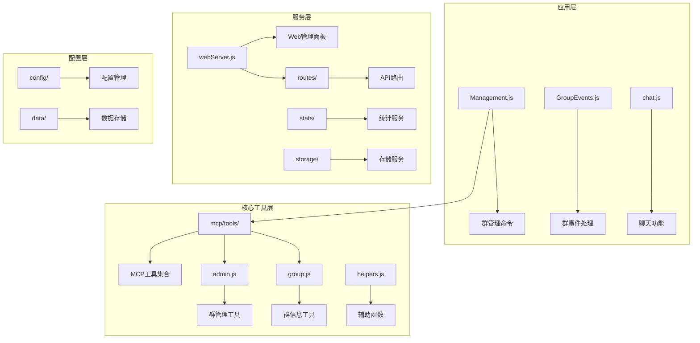

**图表来源**
- [index.js](file://index.js#L114-L136)
- [README.md](file://README.md#L356-L396)

**章节来源**
- [README.md](file://README.md#L1-L800)
- [index.js](file://index.js#L1-L258)

## 核心组件

### 群管理工具集合

群管理工具集合提供了完整的群组管理功能，包括禁言、踢人、设置群名片等核心操作：

| 工具名称 | 功能描述 | 权限要求 | 支持模式 |
|---------|----------|----------|----------|
| mute_member | 禁言群成员 | 管理员权限 | 单个/批量禁言 |
| kick_member | 踢出群成员 | 管理员权限 | 单个/批量踢人 |
| set_group_card | 设置群成员名片 | 管理员权限 | 单个/批量设置 |
| set_group_whole_ban | 设置全群禁言 | 管理员权限 | 开启/关闭禁言 |
| set_group_admin | 设置群管理员 | 群主权限 | 单个/批量设置 |
| set_group_name | 修改群名称 | 管理员权限 | 单个设置 |
| set_group_special_title | 设置专属头衔 | 群主权限 | 单个/批量设置 |
| send_group_notice | 发送群公告 | 管理员权限 | 单个发送 |
| delete_group_notice | 删除群公告 | 管理员权限 | 单个删除 |

### Web 管理面板

Web 管理面板提供了可视化的群组管理界面，支持群组配置、功能开关、黑白名单管理等功能：

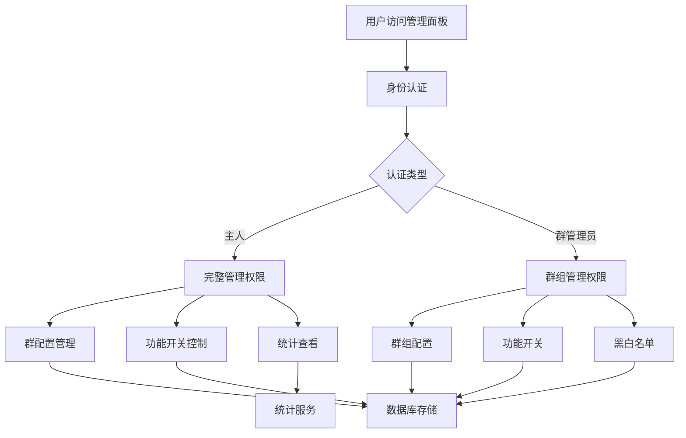

**图表来源**
- [groupAdminRoutes.js](file://src/services/routes/groupAdminRoutes.js#L196-L234)

**章节来源**
- [groupAdminRoutes.js](file://src/services/routes/groupAdminRoutes.js#L1-L800)

## 架构概览

系统采用分层架构设计，确保了良好的可维护性和扩展性：

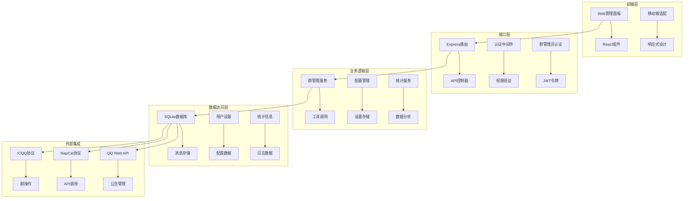

**图表来源**
- [index.js](file://index.js#L1-L258)
- [groupAdminRoutes.js](file://src/services/routes/groupAdminRoutes.js#L1-L800)

## 详细组件分析

### 群管理工具实现

#### 禁言功能实现

禁言功能支持单个用户禁言和批量禁言操作，具有完善的时间控制和错误处理机制：

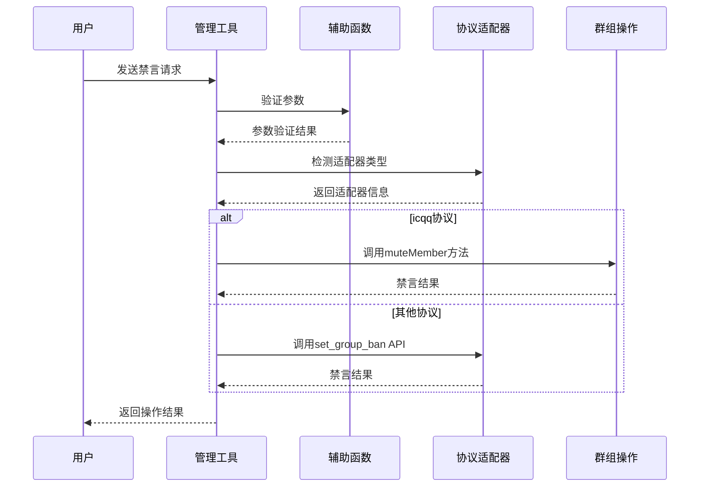

**图表来源**
- [admin.js](file://src/mcp/tools/admin.js#L34-L118)
- [helpers.js](file://src/mcp/tools/helpers.js#L54-L58)

#### 踢人功能实现

踢人功能支持单个用户踢出和批量踢人操作，包含拒绝加群选项：

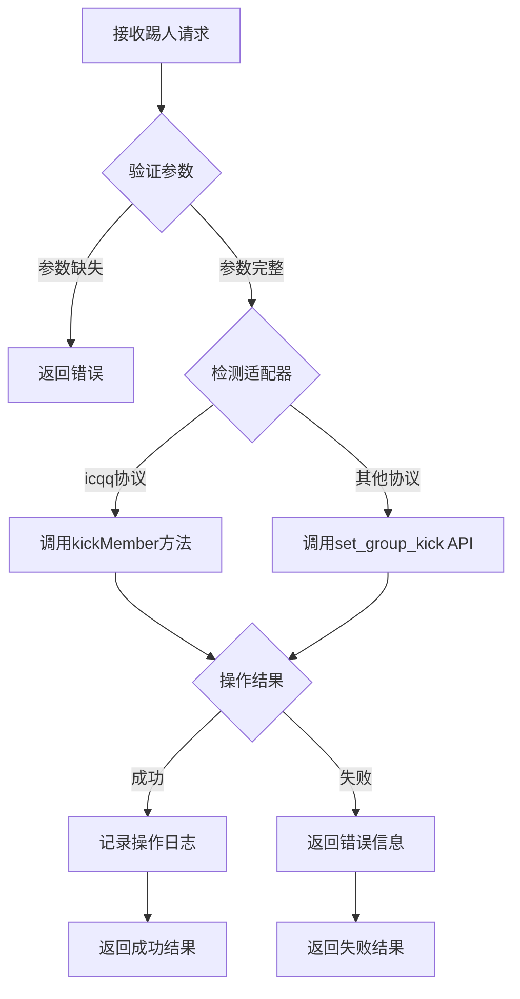

**图表来源**
- [admin.js](file://src/mcp/tools/admin.js#L137-L208)
- [helpers.js](file://src/mcp/tools/helpers.js#L60-L73)

#### 群名片设置功能

群名片设置功能支持单个用户名片设置和批量名片设置：

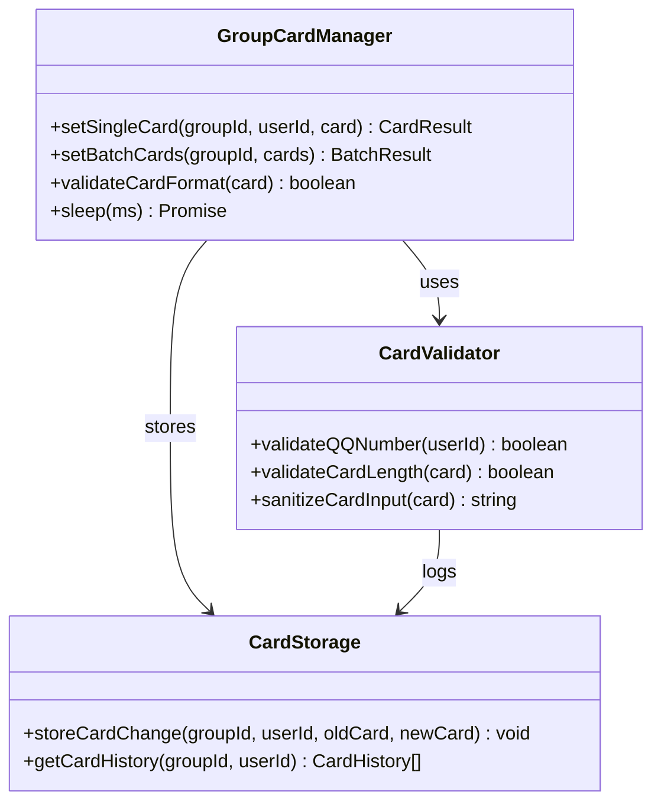

**图表来源**
- [admin.js](file://src/mcp/tools/admin.js#L210-L303)
- [helpers.js](file://src/mcp/tools/helpers.js#L86-L90)

**章节来源**
- [admin.js](file://src/mcp/tools/admin.js#L1-L800)
- [helpers.js](file://src/mcp/tools/helpers.js#L1-L800)

### 权限管理系统

系统实现了多层次的权限控制机制，确保只有授权用户才能执行管理操作：

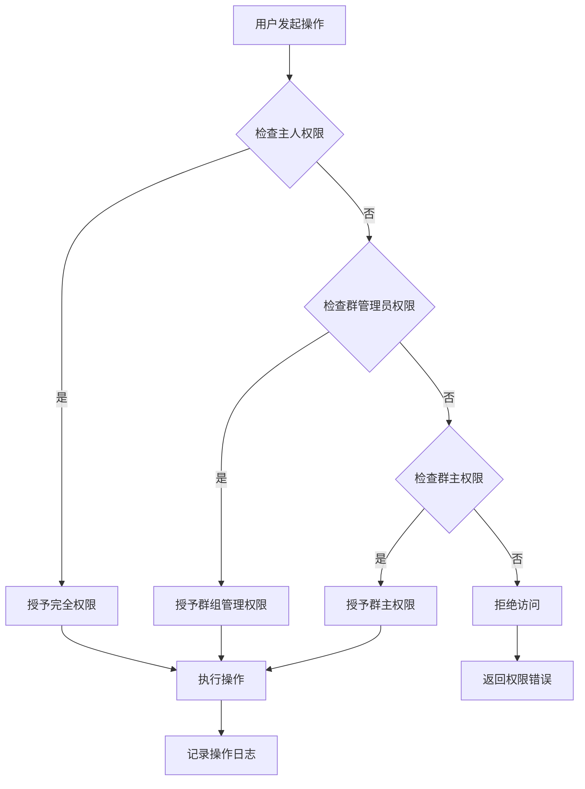

**图表来源**
- [Management.js](file://apps/Management.js#L184-L212)

**章节来源**
- [Management.js](file://apps/Management.js#L1-L800)

### 日志记录和审计功能

系统提供了完整的日志记录和审计功能，确保所有管理操作都有据可查：

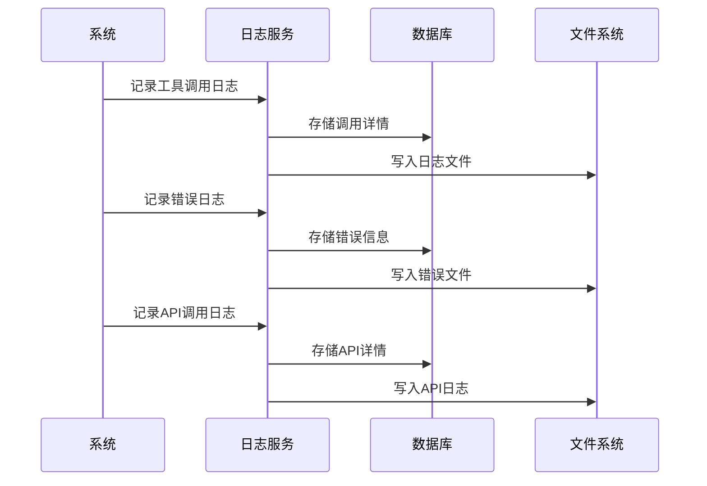

**图表来源**
- [LogService.js](file://src/services/stats/LogService.js#L379-L453)

**章节来源**
- [LogService.js](file://src/services/stats/LogService.js#L1-L553)

## 依赖关系分析

### 核心依赖关系

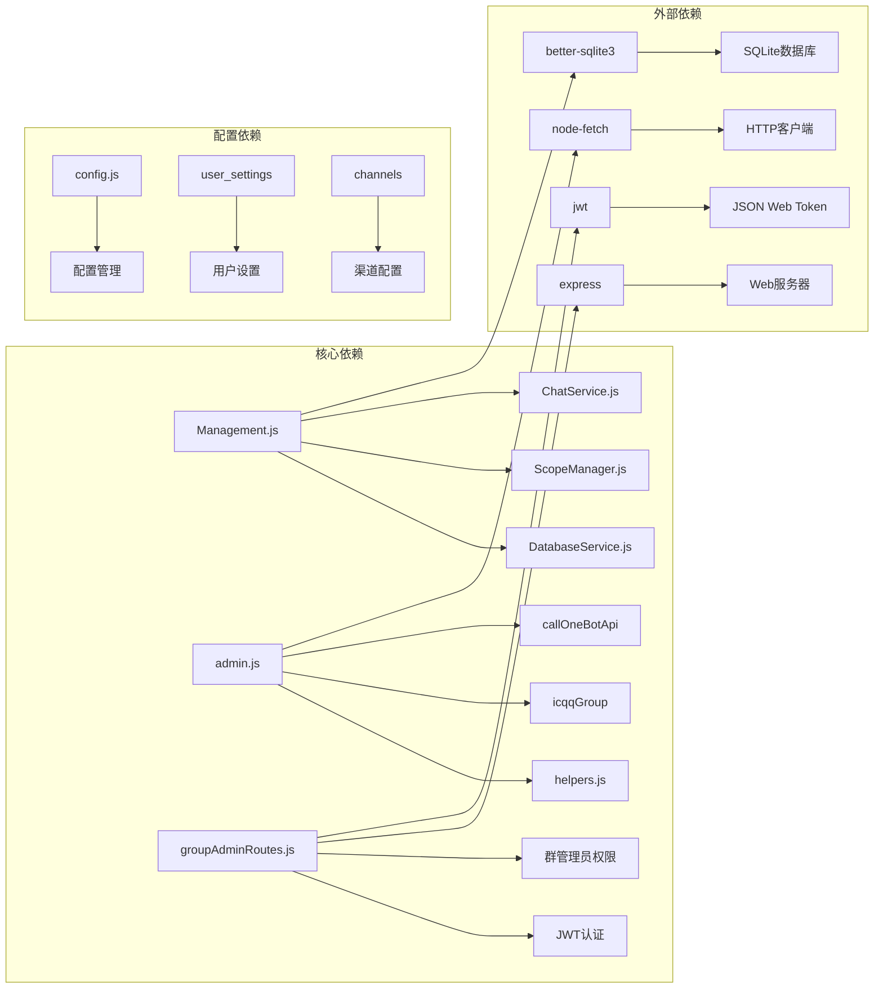

**图表来源**
- [index.js](file://index.js#L1-L258)
- [groupAdminRoutes.js](file://src/services/routes/groupAdminRoutes.js#L1-L800)

### 工具依赖关系

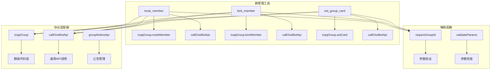

**图表来源**
- [admin.js](file://src/mcp/tools/admin.js#L8-L12)
- [helpers.js](file://src/mcp/tools/helpers.js#L13-L122)

**章节来源**
- [index.js](file://index.js#L1-L258)
- [admin.js](file://src/mcp/tools/admin.js#L1-L800)
- [helpers.js](file://src/mcp/tools/helpers.js#L1-L800)

## 性能考虑

### 数据库优化

系统采用了 SQLite 作为主要存储引擎，并通过 WAL（Write-Ahead Logging）模式提高并发性能：

- **索引优化**: 为常用查询字段建立索引，如 conversation_id、timestamp 等
- **连接池管理**: 使用连接池减少数据库连接开销
- **查询优化**: 避免 N+1 查询问题，使用批量操作
- **内存管理**: 合理使用内存缓存，减少磁盘 I/O

### 缓存策略

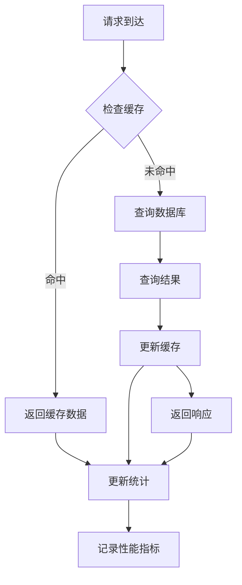

### 并发控制

系统实现了多层并发控制机制：

- **请求队列**: 控制同时处理的请求数量
- **锁机制**: 使用文件锁和数据库锁防止竞态条件
- **超时控制**: 设置合理的操作超时时间
- **重试机制**: 对临时性错误进行自动重试

## 故障排除指南

### 常见问题及解决方案

#### 权限相关问题

| 问题类型 | 症状 | 解决方案 |
|---------|------|----------|
| 权限不足 | 操作被拒绝 | 检查用户角色，确认管理员权限 |
| 机器人权限不足 | 群操作失败 | 确保机器人具有相应权限 |
| 配置错误 | 功能不可用 | 检查配置文件，重新配置权限 |

#### 协议适配问题

| 问题类型 | 症状 | 解决方案 |
|---------|------|----------|
| 协议不支持 | API调用失败 | 检查协议适配器配置 |
| 适配器版本不兼容 | 操作异常 | 更新适配器到最新版本 |
| 网络连接问题 | 请求超时 | 检查网络连接和代理设置 |

#### 数据库问题

| 问题类型 | 症状 | 解决方案 |
|---------|------|----------|
| 数据库锁定 | 操作阻塞 | 检查长时间运行的事务 |
| 磁盘空间不足 | 写入失败 | 清理日志文件和临时数据 |
| 数据库损坏 | 查询异常 | 备份数据并重建数据库 |

**章节来源**
- [README.md](file://README.md#L553-L793)

### 调试和监控

系统提供了完善的调试和监控功能：

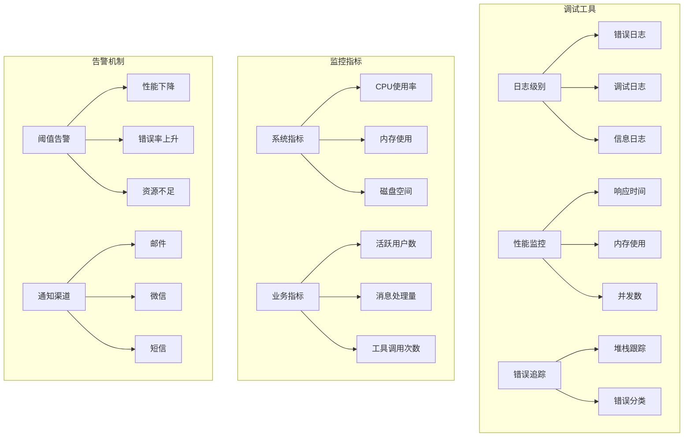

**图表来源**
- [LogService.js](file://src/services/stats/LogService.js#L127-L158)
- [DatabaseService.js](file://src/services/storage/DatabaseService.js#L26-L45)

## 结论

群管理工具提供了一套完整、可靠的群组管理解决方案，具有以下特点：

### 核心优势

1. **功能完整性**: 涵盖了群组管理的所有核心功能
2. **权限控制**: 多层次的权限管理体系确保安全性
3. **协议兼容**: 支持多种协议适配器，具有良好的兼容性
4. **可视化管理**: 提供直观的 Web 管理面板
5. **审计追踪**: 完善的日志记录和审计功能

### 最佳实践建议

1. **权限管理**
   - 严格控制管理员权限分配
   - 定期审查权限设置
   - 实施最小权限原则

2. **安全措施**
   - 启用 HTTPS 和强密码
   - 定期更新系统和依赖
   - 实施访问控制和审计

3. **性能优化**
   - 合理配置数据库参数
   - 实施缓存策略
   - 监控系统性能指标

4. **运维管理**
   - 建立备份和恢复机制
   - 实施监控和告警
   - 定期维护和更新

### 风险控制

系统通过多种机制实现风险控制：

- **权限验证**: 多层权限检查确保操作合法性
- **操作审计**: 完整的操作日志记录
- **异常处理**: 完善的错误处理和恢复机制
- **数据保护**: 数据库加密和备份机制

通过遵循这些最佳实践和风险控制措施，可以确保群管理工具的安全、稳定和高效运行。
