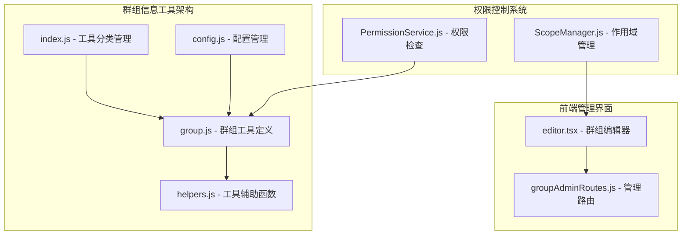
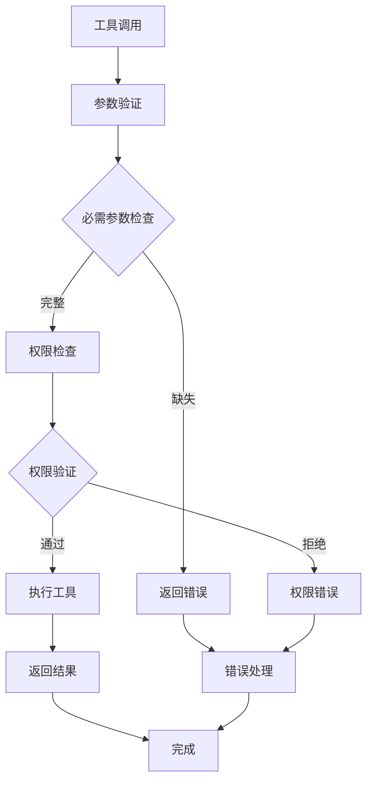
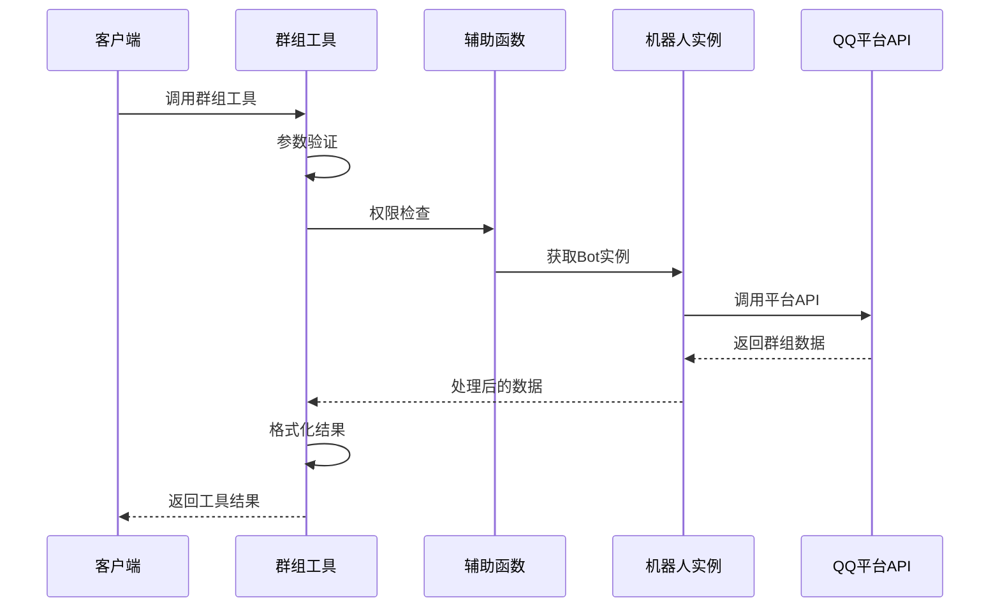
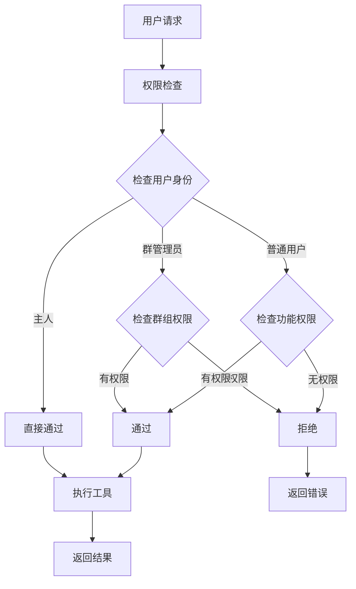
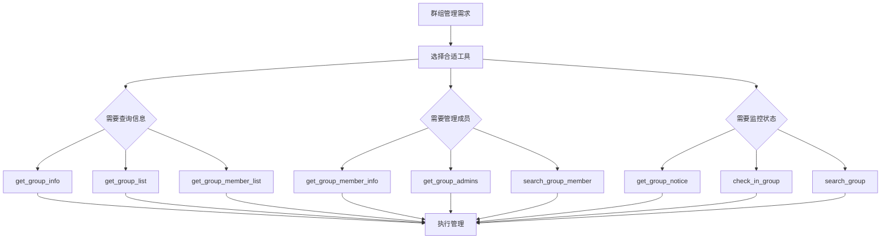
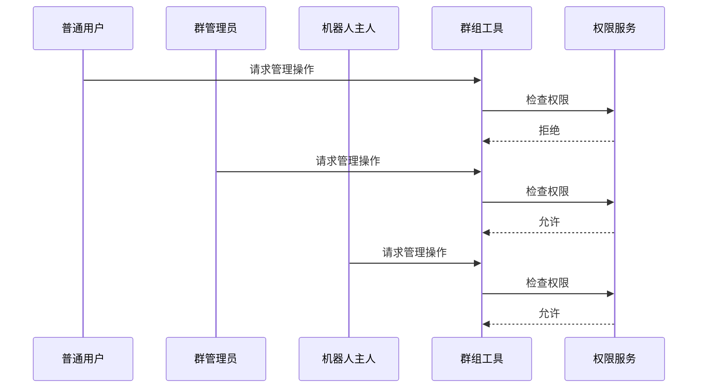
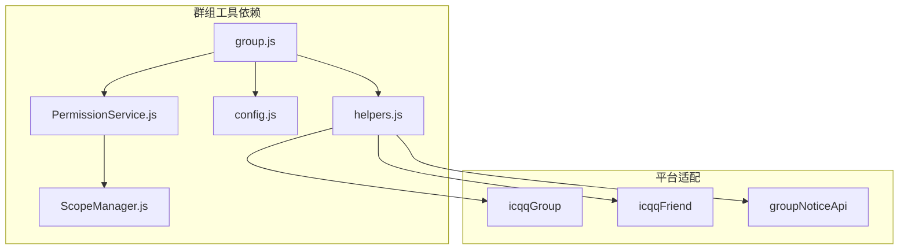
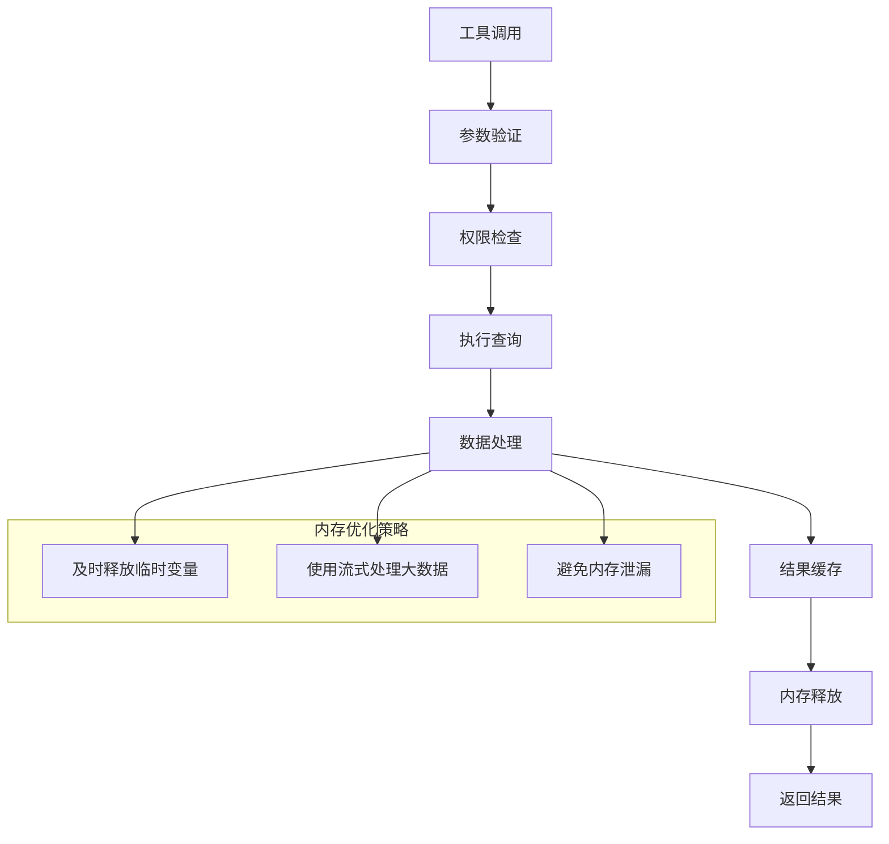

# 群组信息工具


## 目录
1. [简介](#简介)
2. [项目结构](#项目结构)
3. [核心组件](#核心组件)
4. [架构概览](#架构概览)
5. [详细组件分析](#详细组件分析)
6. [依赖关系分析](#依赖关系分析)
7. [性能考虑](#性能考虑)
8. [故障排除指南](#故障排除指南)
9. [结论](#结论)

## 简介

群组信息工具是 ChatGPT 插件中的核心功能模块，专门用于管理和查询 QQ 群组相关信息。该工具类别提供了完整的群组信息查询、成员列表获取、群组状态管理等功能，支持多种群组操作和权限控制。

该工具类别包含 8 个主要工具，涵盖群组基本信息查询、成员管理、群组状态监控等多个方面，为用户提供全面的群组管理能力。

## 项目结构

插件采用模块化的架构设计，群组信息工具位于 `src/mcp/tools/group.js` 文件中，通过 MCP（Model Context Protocol）协议提供标准化的工具接口。



**图表来源**
- [group.js](file://src/mcp/tools/group.js#L1-L602)
- [index.js](file://src/mcp/tools/index.js#L1-L181)
- [helpers.js](file://src/mcp/tools/helpers.js#L1-L800)

**章节来源**
- [README.md](file://README.md#L356-L396)
- [group.js](file://src/mcp/tools/group.js#L1-L602)

## 核心组件

### 群组信息工具类别

群组信息工具类别包含以下 8 个核心工具：

| 工具名称 | 功能描述 | 权限级别 |
|---------|----------|----------|
| get_group_info | 获取群组基本信息 | 所有人 |
| get_group_list | 获取机器人加入的群列表 | 所有人 |
| get_group_member_list | 获取群成员列表 | 群管理 |
| get_group_member_info | 获取群成员详细信息 | 群管理 |
| get_current_group | 获取当前会话所在群信息 | 所有人 |
| get_group_admins | 获取群管理员列表 | 群管理 |
| search_group_member | 在群成员中搜索用户 | 群管理 |
| get_group_notice | 获取群公告列表 | 群管理 |

### 工具参数配置

每个工具都定义了详细的输入参数规范和验证机制：



**图表来源**
- [helpers.js](file://src/mcp/tools/helpers.js#L702-L787)

**章节来源**
- [group.js](file://src/mcp/tools/group.js#L8-L602)
- [helpers.js](file://src/mcp/tools/helpers.js#L702-L787)

## 架构概览

### 工具执行流程



**图表来源**
- [group.js](file://src/mcp/tools/group.js#L19-L60)
- [helpers.js](file://src/mcp/tools/helpers.js#L190-L255)

### 权限控制机制



**图表来源**
- [PermissionService.js](file://src/services/permission/PermissionService.js#L337-L421)

**章节来源**
- [PermissionService.js](file://src/services/permission/PermissionService.js#L1-L484)

## 详细组件分析

### 群组信息查询工具

#### get_group_info 工具

该工具用于获取群组的基本信息，包括群名、成员数量、群主信息等关键数据。

**参数配置：**
- `group_id` (string, 必需): 群号

**返回值格式：**
```json
{
  "success": true,
  "group_id": "群号",
  "group_name": "群名称",
  "member_count": 成员数量,
  "max_member_count": 最大成员数,
  "owner_id": 群主ID,
  "admin_flag": 管理员标志,
  "avatar_url": 头像URL,
  "bot_in_group": 是否在群内
}
```

#### get_group_list 工具

获取机器人加入的所有群组列表。

**参数配置：**
- `limit` (number): 返回的最大数量，默认50

**返回值格式：**
```json
{
  "success": true,
  "total": 群组总数,
  "returned": 返回数量,
  "groups": [
    {
      "group_id": "群号",
      "group_name": "群名称",
      "member_count": 成员数量
    }
  ]
}
```

**章节来源**
- [group.js](file://src/mcp/tools/group.js#L9-L91)

### 成员管理工具

#### get_group_member_list 工具

获取指定群组的成员列表，支持分页和限制数量。

**参数配置：**
- `group_id` (string, 必需): 群号
- `limit` (number): 返回的最大数量，默认100

**返回值格式：**
```json
{
  "success": true,
  "group_id": "群号",
  "group_name": "群名称",
  "total": 成员总数,
  "returned": 返回数量,
  "members": [
    {
      "user_id": "用户ID",
      "nickname": "昵称",
      "card": "群名片",
      "role": "角色",
      "title": "头衔"
    }
  ]
}
```

#### get_group_member_info 工具

获取指定群成员的详细信息。

**参数配置：**
- `group_id` (string, 必需): 群号
- `user_id` (string, 必需): 用户QQ号

**返回值格式：**
```json
{
  "success": true,
  "group_id": "群号",
  "user_id": "用户ID",
  "nickname": "昵称",
  "card": "群名片",
  "role": "角色",
  "title": "头衔",
  "level": 等级,
  "join_time": 加入时间,
  "avatar_url": 头像URL
}
```

**章节来源**
- [group.js](file://src/mcp/tools/group.js#L93-L221)

### 群组状态管理工具

#### get_group_admins 工具

获取群管理员列表，包括群主和管理员。

**参数配置：**
- `group_id` (string): 群号，不填则使用当前群

**返回值格式：**
```json
{
  "success": true,
  "group_id": "群号",
  "group_name": "群名称",
  "owner": 群主信息,
  "admin_count": 管理员数量,
  "admins": [
    {
      "user_id": "用户ID",
      "nickname": "昵称",
      "card": "群名片",
      "role": "角色",
      "title": "头衔"
    }
  ]
}
```

#### get_group_notice 工具

获取群公告列表或指定公告详情。

**参数配置：**
- `group_id` (string): 群号，不填则使用当前群
- `index` (number): 获取指定序号的公告详情（1-N），不填则获取列表
- `limit` (number): 返回数量限制，默认10

**返回值格式：**
```json
{
  "success": true,
  "group_id": "群号",
  "count": 公告数量,
  "notices": [
    {
      "index": 序号,
      "id": 公告ID,
      "content": 公告内容,
      "sender_id": 发送者ID,
      "time": 发布时间,
      "confirm_required": 是否需要确认,
      "read_count": 阅读数量,
      "is_pinned": 是否置顶
    }
  ]
}
```

**章节来源**
- [group.js](file://src/mcp/tools/group.js#L223-L494)

### 实际应用场景

#### 群组管理自动化



**图表来源**
- [group.js](file://src/mcp/tools/group.js#L8-L602)

#### 权限控制示例



**图表来源**
- [PermissionService.js](file://src/services/permission/PermissionService.js#L337-L421)

**章节来源**
- [PermissionService.js](file://src/services/permission/PermissionService.js#L337-L421)

## 依赖关系分析

### 工具依赖关系



**图表来源**
- [group.js](file://src/mcp/tools/group.js#L6-L7)
- [helpers.js](file://src/mcp/tools/helpers.js#L13-L122)

### 配置依赖

群组工具依赖于全局配置系统，包括：

- **触发配置**: 控制工具的触发方式和权限
- **工具配置**: 管理工具的启用状态和执行模式
- **权限配置**: 定义不同用户角色的访问权限
- **群组配置**: 群组级别的个性化设置

**章节来源**
- [config.js](file://config/config.js#L62-L586)
- [index.js](file://src/mcp/tools/index.js#L29-L58)

## 性能考虑

### 工具执行优化

1. **缓存机制**: 利用平台提供的缓存接口，减少重复查询
2. **批量操作**: 支持批量获取成员列表，提高效率
3. **分页处理**: 对大量数据进行分页处理，避免内存溢出
4. **并发控制**: 限制同时执行的工具数量，防止系统过载

### 内存管理



## 故障排除指南

### 常见问题及解决方案

#### 权限相关问题

**问题**: "机器人不在此群内"
**原因**: 机器人未加入目标群组
**解决**: 确保机器人已在目标群组中，或检查群组ID是否正确

**问题**: "需要管理员权限"
**原因**: 当前用户不是群管理员
**解决**: 联系群主或管理员获取相应权限

#### 数据获取问题

**问题**: "获取成员列表失败"
**原因**: 平台API限制或网络问题
**解决**: 检查网络连接，适当增加超时时间，或分批获取数据

#### 参数验证错误

当工具调用失败时，系统会返回详细的错误信息：

```json
{
  "success": false,
  "error": "缺少必需参数: group_id (群号)",
  "missing_params": ["group_id"],
  "invalid_params": []
}
```

**章节来源**
- [helpers.js](file://src/mcp/tools/helpers.js#L780-L787)

## 结论

群组信息工具类别为 QQ 群组管理提供了完整、灵活的解决方案。通过标准化的 MCP 协议接口，用户可以轻松实现群组信息查询、成员管理、状态监控等各种功能。

该工具类别的主要优势包括：

1. **完整的功能覆盖**: 涵盖群组管理的各个方面
2. **灵活的权限控制**: 支持多层次的权限管理
3. **标准化的接口**: 基于 MCP 协议，易于集成和扩展
4. **完善的错误处理**: 提供详细的错误信息和恢复机制
5. **良好的性能表现**: 优化的数据处理和缓存机制

通过合理配置和使用这些工具，用户可以实现高效的群组自动化管理，提升群组运营效率和用户体验。
