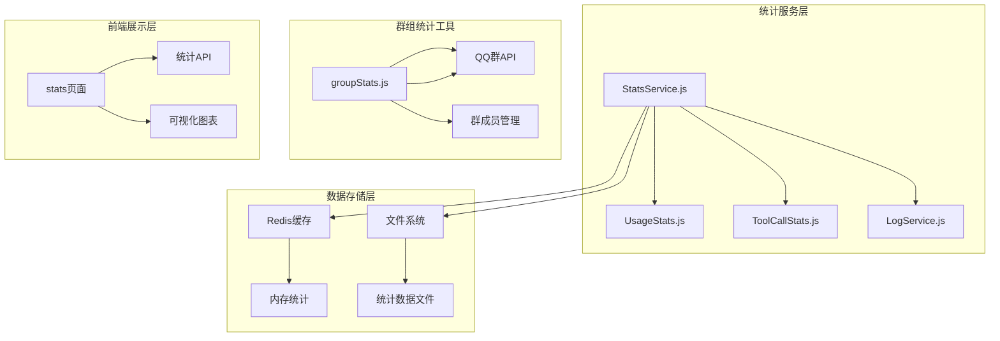
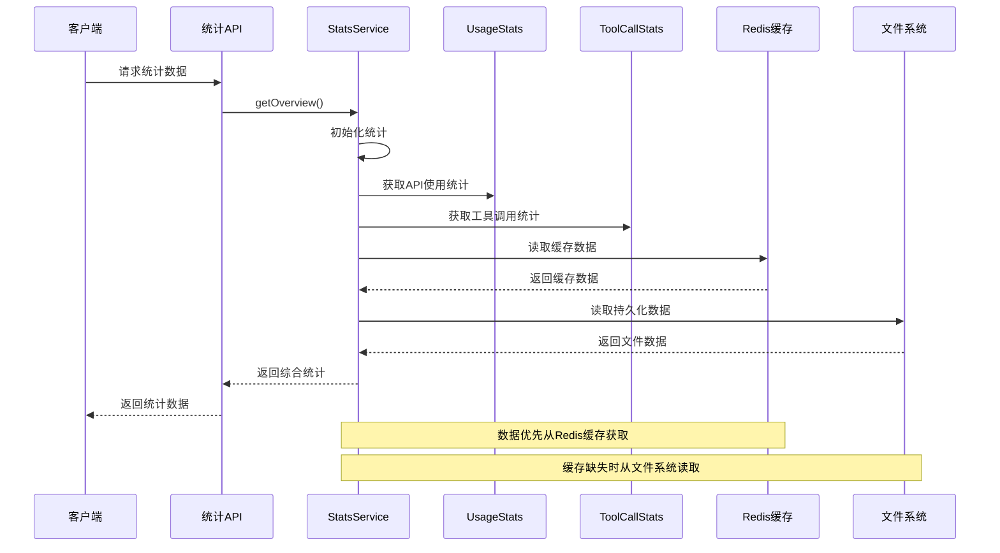
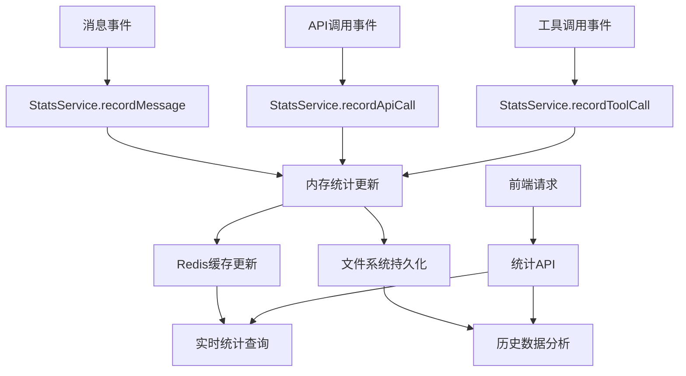
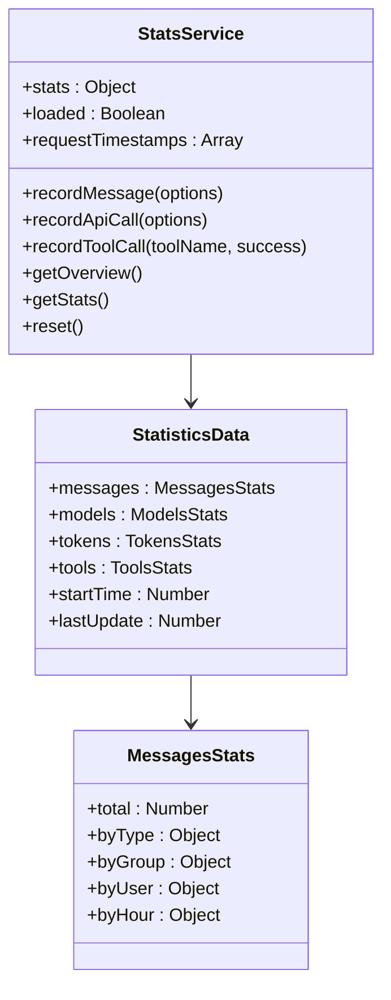
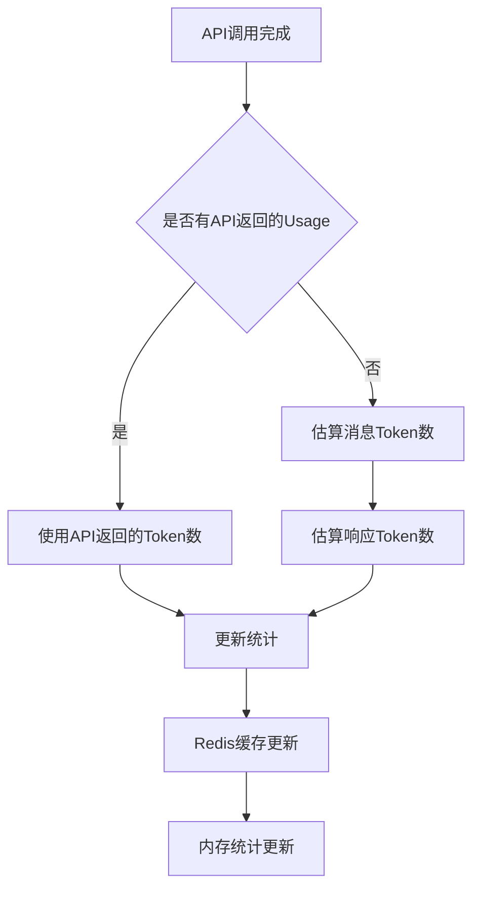
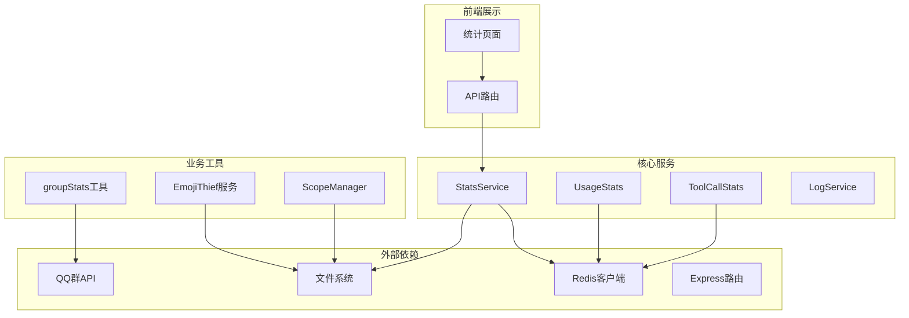
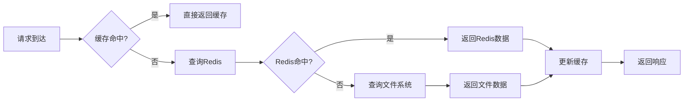
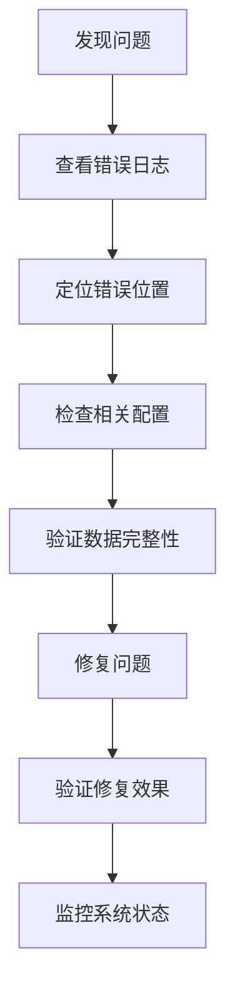

# 群统计工具

<cite>
**本文档引用的文件**
- [README.md](file://README.md)
- [StatsService.js](file://src/services/stats/StatsService.js)
- [UsageStats.js](file://src/services/stats/UsageStats.js)
- [ToolCallStats.js](file://src/services/stats/ToolCallStats.js)
- [LogService.js](file://src/services/stats/LogService.js)
- [groupStats.js](file://src/mcp/tools/groupStats.js)
- [statsRoutes.js](file://src/services/routes/statsRoutes.js)
- [stats页面](file://frontend/app/(dashboard)/stats/page.tsx)
- [EmojiThief.js](file://apps/EmojiThief.js)
- [ScopeManager.js](file://src/services/scope/ScopeManager.js)
- [Management.js](file://apps/Management.js)
</cite>

## 目录
1. [简介](#简介)
2. [项目结构](#项目结构)
3. [核心组件](#核心组件)
4. [架构概览](#架构概览)
5. [详细组件分析](#详细组件分析)
6. [依赖关系分析](#依赖关系分析)
7. [性能考虑](#性能考虑)
8. [故障排除指南](#故障排除指南)
9. [结论](#结论)

## 简介

群统计工具是Yunzai AI聊天插件中的一个重要功能模块，专门用于收集、分析和展示群组的各类统计数据。该工具提供了全面的群组活跃度统计、成员排行、发言统计、特殊字符统计等功能，帮助管理员更好地了解群组的活跃状况和成员行为模式。

该系统采用分布式架构设计，结合内存缓存、Redis持久化存储和文件系统存储，实现了高效的数据统计和分析功能。系统支持实时统计、历史数据分析和可视化展示，为群组管理提供了强有力的数据支撑。

## 项目结构

群统计工具位于插件的核心服务层，主要包含以下关键目录和文件：

**图表来源**
- [StatsService.js](file://src/services/stats/StatsService.js#L1-L682)
- [groupStats.js](file://src/mcp/tools/groupStats.js#L1-L825)

**章节来源**
- [README.md](file://README.md#L356-L396)

## 核心组件

### 统计服务核心组件

群统计工具由四个核心统计服务组成，每个服务负责不同的统计维度：

#### StatsService - 统一统计协调器
负责协调各种统计数据的收集、存储和管理，提供统一的API接口供其他组件使用。

#### UsageStats - API使用统计
专门记录API调用的详细信息，包括模型调用、Token消耗、请求耗时等关键指标。

#### ToolCallStats - 工具调用统计
跟踪所有工具调用的使用情况，包括成功/失败率、执行时间、错误信息等。

#### LogService - 日志统计服务
管理系统的日志记录，支持多种日志类型的分类存储和查询。

**章节来源**
- [StatsService.js](file://src/services/stats/StatsService.js#L19-L37)
- [UsageStats.js](file://src/services/stats/UsageStats.js#L44-L50)
- [ToolCallStats.js](file://src/services/stats/ToolCallStats.js#L32-L47)
- [LogService.js](file://src/services/stats/LogService.js#L12-L22)

## 架构概览

群统计工具采用分层架构设计，实现了数据采集、处理、存储和展示的完整流程：

**图表来源**
- [statsRoutes.js](file://src/services/routes/statsRoutes.js#L18-L26)
- [StatsService.js](file://src/services/stats/StatsService.js#L423-L489)

### 数据流架构

**图表来源**
- [StatsService.js](file://src/services/stats/StatsService.js#L110-L136)
- [StatsService.js](file://src/services/stats/StatsService.js#L230-L360)

## 详细组件分析

### StatsService - 统一统计协调器

StatsService是整个统计系统的核心协调器，负责管理所有统计数据的生命周期：

#### 核心功能特性

1. **多维度统计管理**
   - 消息统计：按类型、群组、用户、小时分布统计
   - 模型统计：调用次数、成功/失败率、Token消耗
   - 工具统计：调用次数、成功率、错误分析
   - Token统计：输入输出Token分布

2. **实时RPM跟踪**
   - 支持1分钟和5分钟窗口的请求速率监控
   - 实时成功率计算
   - 请求时间戳滑动窗口管理

3. **数据持久化策略**
   - 内存中实时更新
   - Redis缓存加速
   - 文件系统持久化备份

#### 统计数据结构

**图表来源**
- [StatsService.js](file://src/services/stats/StatsService.js#L22-L29)
- [StatsService.js](file://src/services/stats/StatsService.js#L110-L136)

**章节来源**
- [StatsService.js](file://src/services/stats/StatsService.js#L19-L88)
- [StatsService.js](file://src/services/stats/StatsService.js#L110-L198)

### UsageStats - API使用统计

UsageStats专门负责记录和分析API调用的详细信息：

#### 核心统计指标

1. **调用统计**
   - 总调用次数
   - 成功/失败调用次数
   - 成功率计算

2. **性能指标**
   - 平均响应时间
   - 总响应时间
   - Token消耗统计

3. **详细记录**
   - 请求参数截断存储
   - 响应数据截断存储
   - 错误信息记录

#### Token估算机制

**图表来源**
- [UsageStats.js](file://src/services/stats/UsageStats.js#L263-L296)
- [UsageStats.js](file://src/services/stats/UsageStats.js#L172-L192)

**章节来源**
- [UsageStats.js](file://src/services/stats/UsageStats.js#L44-L56)
- [UsageStats.js](file://src/services/stats/UsageStats.js#L199-L263)

### ToolCallStats - 工具调用统计

ToolCallStats专注于记录工具调用的详细信息：

#### 统计维度

1. **调用频率统计**
   - 总调用次数
   - 成功/失败次数
   - 平均执行时间

2. **工具使用分析**
   - 按工具名称分组统计
   - 按小时分布统计
   - 最近错误记录

3. **安全数据处理**
   - 敏感信息过滤
   - 数据大小限制
   - 错误堆栈截断

**章节来源**
- [ToolCallStats.js](file://src/services/stats/ToolCallStats.js#L32-L79)
- [ToolCallStats.js](file://src/services/stats/ToolCallStats.js#L86-L143)

### 群统计工具 - groupStats.js

groupStats.js提供了丰富的QQ群统计功能：

#### 核心统计功能

1. **群活跃度统计**
   - 群星级信息获取
   - 群活跃数据统计
   - 成员活跃度分析

2. **成员排行统计**
   - 发言排行榜
   - 群荣誉统计
   - 不活跃成员识别

3. **特殊功能统计**
   - 幸运字符统计
   - 群打卡统计
   - 成员入群统计

#### 统计指标说明

| 统计类型 | 指标含义 | 更新频率 |
|---------|---------|---------|
| 群星级 | QQ官方群活跃度评级 | 实时查询 |
| 发言排行 | 成员发言次数统计 | 实时查询 |
| 群打卡 | 成员每日签到统计 | 每日更新 |
| 幸运字符 | 字符拥有和使用统计 | 实时查询 |

**章节来源**
- [groupStats.js](file://src/mcp/tools/groupStats.js#L16-L825)

### EmojiThief - 表情包统计

EmojiThief提供了表情包收集和统计功能：

#### 统计功能

1. **表情包收集统计**
   - 收集数量统计
   - 存储空间使用
   - 收集效率分析

2. **触发机制统计**
   - 触发概率统计
   - 不同触发模式效果
   - 收集成功率分析

3. **存储管理统计**
   - 群组独立存储统计
   - 共享存储统计
   - 存储清理统计

**章节来源**
- [EmojiThief.js](file://apps/EmojiThief.js#L25-L458)

## 依赖关系分析

群统计工具的依赖关系体现了清晰的分层架构：

**图表来源**
- [StatsService.js](file://src/services/stats/StatsService.js#L5-L12)
- [statsRoutes.js](file://src/services/routes/statsRoutes.js#L1-L6)

### 组件耦合度分析

| 组件 | 内聚性 | 耦合度 | 说明 |
|------|--------|--------|------|
| StatsService | 高 | 低 | 作为协调器，职责单一 |
| UsageStats | 高 | 中 | 专注API统计，边界清晰 |
| ToolCallStats | 高 | 中 | 专注工具调用统计 |
| groupStats | 中 | 高 | 依赖QQ群API，耦合度较高 |
| EmojiThief | 中 | 中 | 独立功能模块 |

**章节来源**
- [StatsService.js](file://src/services/stats/StatsService.js#L1-L14)
- [groupStats.js](file://src/mcp/tools/groupStats.js#L1-L15)

## 性能考虑

### 缓存策略

群统计工具采用了多层次的缓存策略来优化性能：

1. **内存缓存**
   - 最近使用的统计数据
   - 实时统计更新
   - 快速响应查询

2. **Redis缓存**
   - 持久化统计数据
   - 分布式共享
   - 快速读取

3. **文件系统缓存**
   - 数据持久化备份
   - 系统重启恢复
   - 大数据量存储

### 性能优化措施

**图表来源**
- [StatsService.js](file://src/services/stats/StatsService.js#L77-L88)

### 数据存储优化

1. **数据压缩**
   - Redis存储使用压缩
   - 文件存储使用JSON格式
   - 大数据量分页查询

2. **索引优化**
   - 按时间戳索引
   - 按群组ID索引
   - 按用户ID索引

3. **清理策略**
   - 自动清理过期数据
   - 最大记录数限制
   - 存储空间监控

## 故障排除指南

### 常见问题诊断

#### 统计数据异常

**问题症状**：统计数据不准确或丢失
**可能原因**：
1. Redis连接失败
2. 文件系统权限问题
3. 内存溢出
4. 缓存同步问题

**解决步骤**：
1. 检查Redis服务状态
2. 验证文件系统写入权限
3. 监控内存使用情况
4. 重置统计缓存

#### API调用统计错误

**问题症状**：API调用统计不显示或显示错误
**可能原因**：
1. API调用未正确记录
2. Token估算错误
3. Redis存储失败

**解决步骤**：
1. 检查API调用记录逻辑
2. 验证Token估算算法
3. 重试Redis存储操作

#### 前端数据显示问题

**问题症状**：统计页面显示异常
**可能原因**：
1. API接口调用失败
2. 数据格式不匹配
3. 前端缓存问题

**解决步骤**：
1. 检查API响应状态
2. 验证数据格式兼容性
3. 清除浏览器缓存

**章节来源**
- [LogService.js](file://src/services/stats/LogService.js#L264-L284)
- [StatsService.js](file://src/services/stats/StatsService.js#L504-L528)

### 日志分析

系统提供了详细的日志记录功能，便于问题诊断：

#### 日志类型

1. **错误日志**：API调用错误、系统异常
2. **警告日志**：配置问题、性能警告
3. **调试日志**：详细执行过程
4. **信息日志**：系统状态信息

#### 日志分析方法

**图表来源**
- [LogService.js](file://src/services/stats/LogService.js#L127-L158)

## 结论

群统计工具是一个功能完善、架构清晰的统计分析系统。它通过多层缓存、分布式存储和实时统计相结合的方式，为群组管理提供了全面的数据支持。

### 主要优势

1. **全面的统计维度**：涵盖消息、模型、工具、群组等多个维度
2. **高效的性能表现**：多层缓存策略确保快速响应
3. **灵活的扩展性**：模块化设计便于功能扩展
4. **友好的用户体验**：直观的前端展示和交互

### 应用价值

1. **群组管理决策**：为群组运营提供数据支撑
2. **用户行为分析**：了解成员活跃度和参与度
3. **资源优化配置**：基于统计数据优化资源配置
4. **问题诊断定位**：快速发现和解决问题

### 发展建议

1. **增强实时性**：进一步优化实时统计的准确性
2. **扩展统计维度**：增加更多维度的统计分析
3. **提升可视化**：丰富图表展示形式
4. **优化性能**：持续改进大数据量下的性能表现

该统计工具为Yunzai AI聊天插件提供了强大的数据分析能力，是群组管理和运营的重要工具。