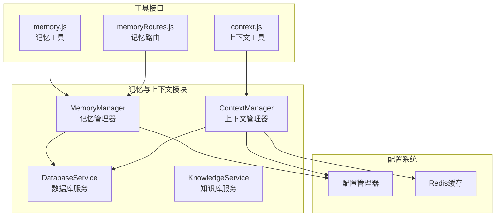
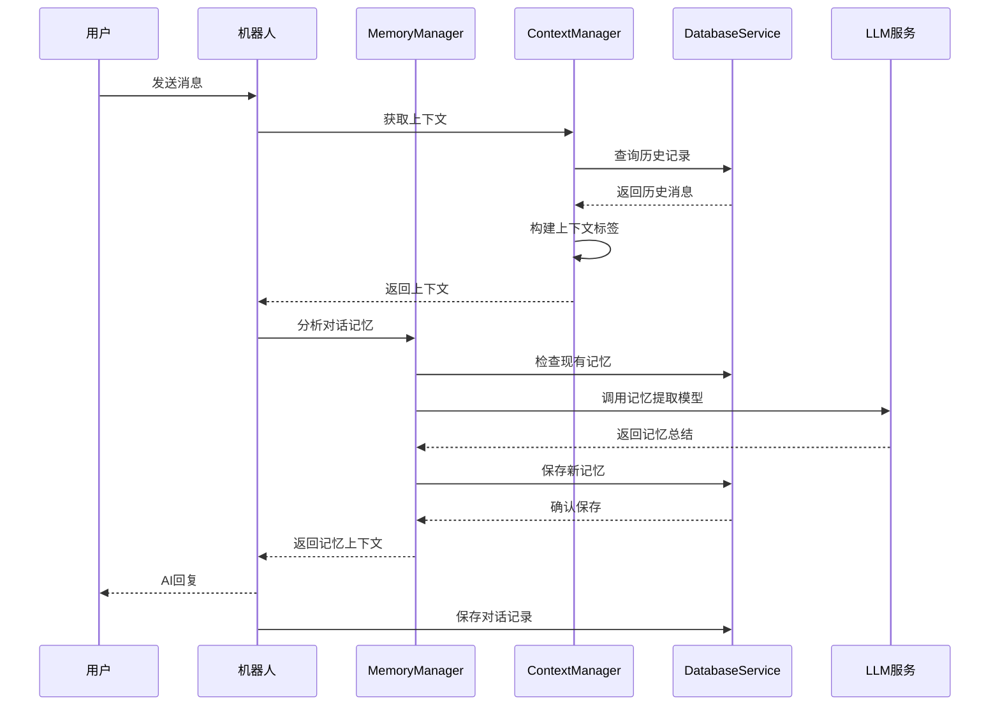
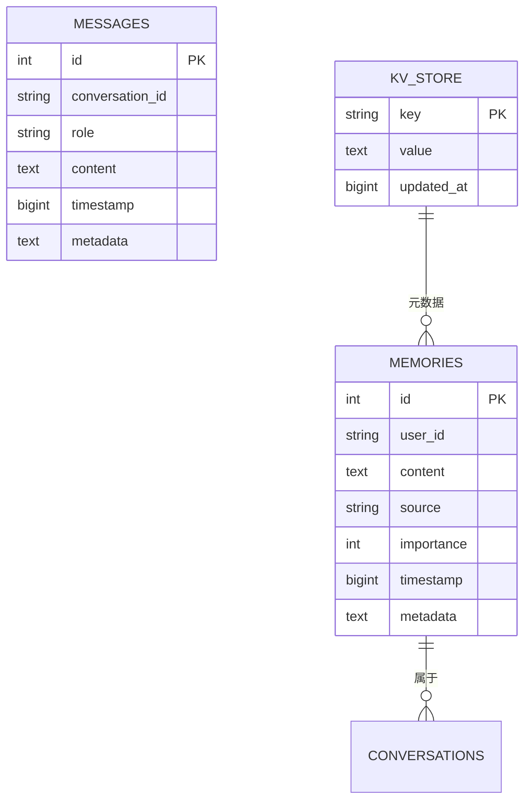
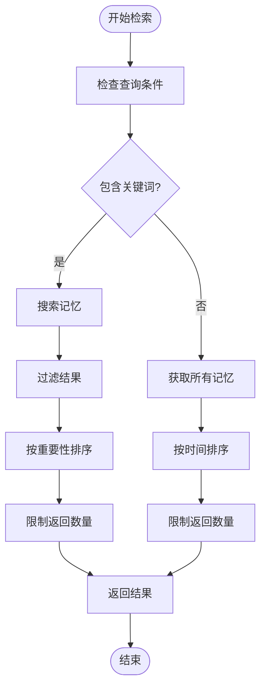
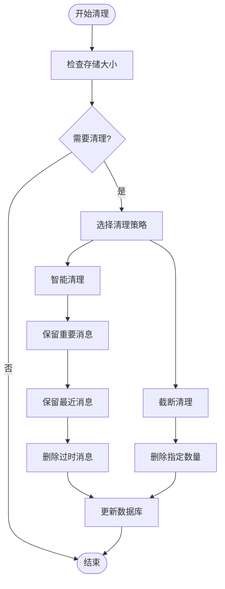
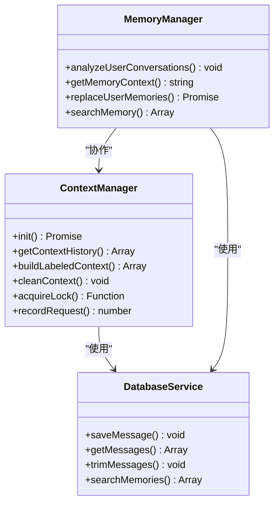
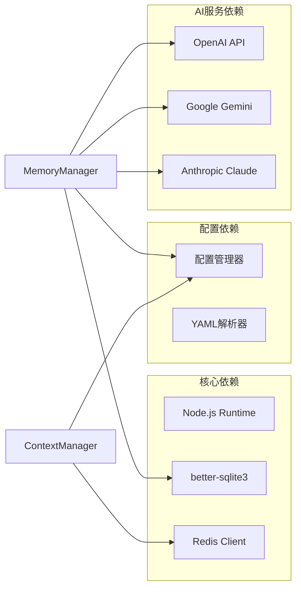
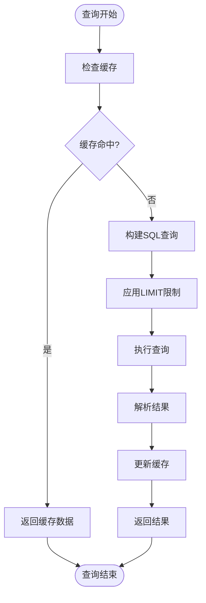

# 记忆与上下文工具

## 目录
1. [简介](#简介)
2. [项目结构](#项目结构)
3. [核心组件](#核心组件)
4. [架构概览](#架构概览)
5. [详细组件分析](#详细组件分析)
6. [依赖关系分析](#依赖关系分析)
7. [性能考虑](#性能考虑)
8. [故障排除指南](#故障排除指南)
9. [结论](#结论)

## 简介

记忆与上下文工具是 ChatAI 插件的核心功能模块，负责管理用户记忆、维护对话上下文和提供历史记录查询。该系统集成了多种 AI 模型支持，包括 OpenAI、Google Gemini、Anthropic Claude 等，为 Yunzai-Bot 带来"全栈 AI"体验。

系统的主要功能包括：
- **用户记忆管理**：自动提取和存储用户个人信息、偏好和重要事件
- **对话上下文维护**：智能管理多轮对话的历史记录和上下文状态
- **群聊上下文分析**：基于群聊对话自动提取话题、关系和用户信息
- **知识库集成**：与预设系统结合提供结构化知识支持
- **持久化存储**：使用 SQLite 数据库存储所有记忆和对话历史

## 项目结构

**图表来源**
- [MemoryManager.js](file://src/services/storage/MemoryManager.js#L1-L50)
- [ContextManager.js](file://src/services/llm/ContextManager.js#L1-L50)
- [DatabaseService.js](file://src/services/storage/DatabaseService.js#L1-L50)

**章节来源**
- [README.md](file://README.md#L356-L396)

## 核心组件

### MemoryManager - 记忆管理器

MemoryManager 是记忆系统的中央控制器，负责：

- **自动记忆提取**：基于对话内容自动识别和提取重要信息
- **周期性分析**：定时扫描用户对话历史进行总结和更新
- **群聊上下文分析**：收集群聊消息并提取有价值的群体信息
- **记忆存储管理**：提供完整的 CRUD 操作接口

### ContextManager - 上下文管理器

ContextManager 负责对话上下文的智能管理：

- **会话隔离策略**：支持群聊用户隔离和私聊隔离模式
- **智能清理机制**：根据重要性保留关键对话内容
- **并发控制**：使用异步锁防止并发冲突
- **自动总结**：长时间不活跃的对话自动总结重置

### DatabaseService - 数据库服务

提供统一的数据访问接口：

- **SQLite 持久化**：使用 better-sqlite3 提供高性能数据存储
- **消息去重**：防止重复消息的存储和处理
- **索引优化**：为常用查询建立高效索引
- **事务支持**：确保数据一致性和完整性

**章节来源**
- [MemoryManager.js](file://src/services/storage/MemoryManager.js#L1-L100)
- [ContextManager.js](file://src/services/llm/ContextManager.js#L1-L100)
- [DatabaseService.js](file://src/services/storage/DatabaseService.js#L1-L100)

## 架构概览

**图表来源**
- [MemoryManager.js](file://src/services/storage/MemoryManager.js#L535-L653)
- [ContextManager.js](file://src/services/llm/ContextManager.js#L419-L463)

## 详细组件分析

### 记忆存储格式

系统采用统一的存储格式来管理不同类型的记忆：

**图表来源**
- [DatabaseService.js](file://src/services/storage/DatabaseService.js#L47-L78)

记忆存储的关键特性：
- **结构化存储**：统一的 JSON 格式存储消息内容
- **元数据支持**：支持自定义元数据存储
- **时间戳追踪**：精确的时间戳记录便于排序和查询
- **重要性评分**：支持记忆重要性排序和筛选

### 检索算法

系统实现了多种检索算法来优化记忆查询：

**图表来源**
- [DatabaseService.js](file://src/services/storage/DatabaseService.js#L124-L164)

检索算法的特点：
- **模糊匹配**：支持关键词模糊搜索
- **智能排序**：按重要性和时间双重排序
- **结果限制**：防止查询结果过大影响性能
- **转义处理**：防止 SQL 注入攻击

### 清理策略

系统提供了多种清理策略来管理存储空间：

**图表来源**
- [ContextManager.js](file://src/services/llm/ContextManager.js#L664-L721)

清理策略的实现：
- **智能清理**：保留重要和最近的消息
- **截断清理**：简单地删除超出限制的消息
- **定时清理**：自动清理过期的对话历史
- **批量清理**：支持一次性清理所有过期数据

### 上下文管理最佳实践

**图表来源**
- [ContextManager.js](file://src/services/llm/ContextManager.js#L1-L100)
- [MemoryManager.js](file://src/services/storage/MemoryManager.js#L1-L100)

## 依赖关系分析

**图表来源**
- [MemoryManager.js](file://src/services/storage/MemoryManager.js#L1-L20)
- [ContextManager.js](file://src/services/llm/ContextManager.js#L1-L20)

**章节来源**
- [README.md](file://README.md#L208-L296)

## 性能考虑

### 存储优化

系统采用了多项存储优化技术：

1. **WAL 模式**：启用 Write-Ahead Logging 提高并发性能
2. **索引优化**：为常用查询字段建立索引
3. **消息去重**：防止重复消息的存储和处理
4. **内存缓存**：使用 Map 结构缓存热点数据

### 查询优化

**图表来源**
- [DatabaseService.js](file://src/services/storage/DatabaseService.js#L352-L378)

### 并发控制

系统实现了完善的并发控制机制：

- **异步锁**：防止多个请求同时修改同一用户数据
- **请求计数器**：监控并发请求数量
- **队列管理**：确保消息处理的顺序性
- **超时控制**：防止死锁和资源泄露

## 故障排除指南

### 常见问题诊断

| 问题类型 | 症状 | 可能原因 | 解决方案 |
|---------|------|---------|---------|
| 记忆提取失败 | `自动提取记忆失败` | LLM API 调用异常 | 检查 API 密钥和网络连接 |
| 数据库初始化失败 | `数据库初始化失败` | better-sqlite3 编译问题 | 重新构建原生模块 |
| 上下文清理异常 | `智能清理失败` | 配置参数错误 | 检查 context.cleaningStrategy 配置 |
| 内存溢出 | `内存占用过高` | 缺少定期清理 | 配置自动清理策略 |

### 调试建议

1. **启用调试模式**：在配置中设置 `debug: true`
2. **检查日志级别**：使用 `logger.debug()` 输出详细信息
3. **监控资源使用**：定期检查内存和磁盘使用情况
4. **验证配置**：确保所有配置项都正确设置

**章节来源**
- [README.md](file://README.md#L553-L747)

## 结论

记忆与上下文工具模块为 ChatAI 插件提供了强大的 AI 助手能力。通过智能的记忆提取、高效的上下文管理和可靠的持久化存储，系统能够为用户提供自然流畅的对话体验。

主要优势：
- **智能化记忆管理**：自动识别和提取重要信息
- **灵活的上下文控制**：支持多种隔离和清理策略
- **高性能存储**：基于 SQLite 的高效数据访问
- **可扩展架构**：模块化设计便于功能扩展

未来改进方向：
- 增强记忆检索的语义搜索能力
- 优化大规模数据的处理性能
- 扩展更多 AI 模型的支持
- 提供更丰富的记忆可视化界面
