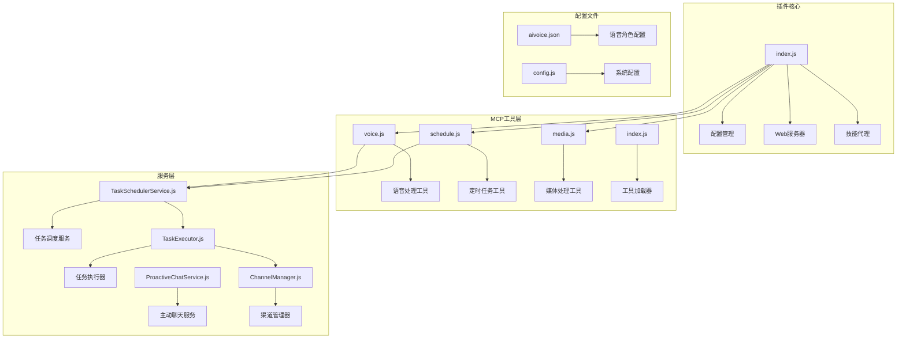
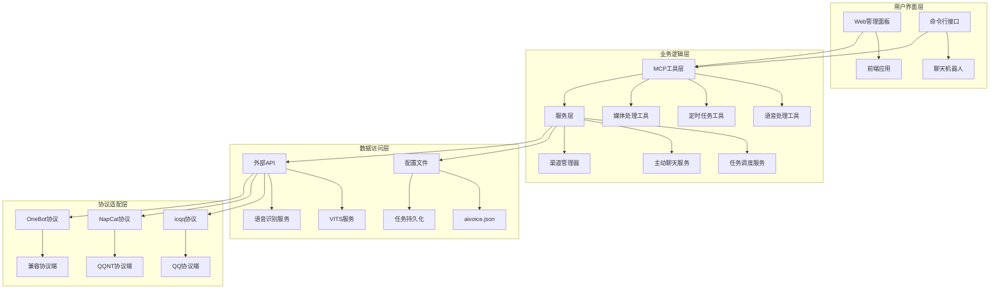
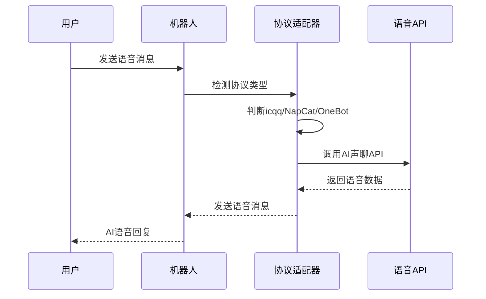
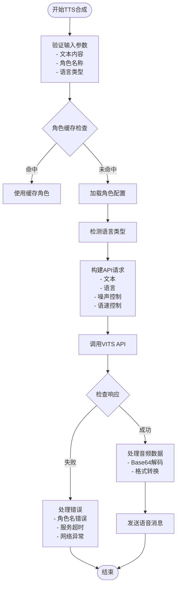
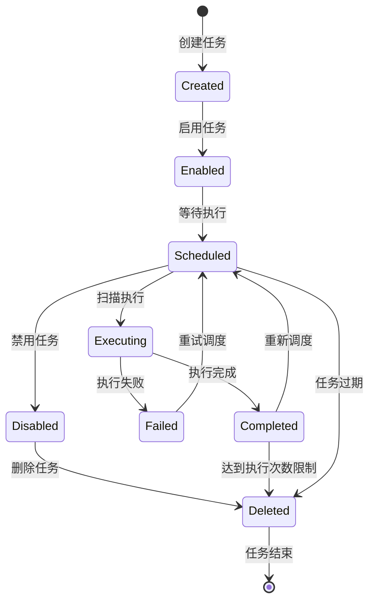
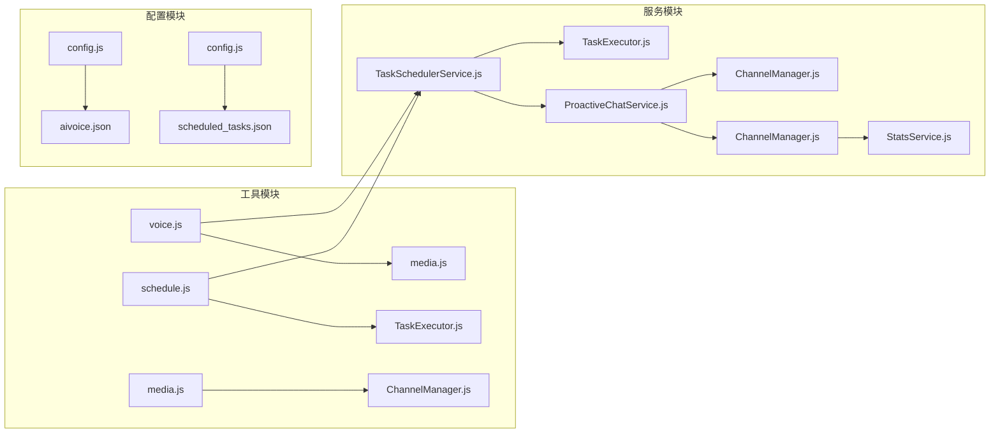

# 语音与定时工具

<cite>
**本文档引用的文件**
- [README.md](file://README.md)
- [package.json](file://package.json)
- [index.js](file://index.js)
- [voice.js](file://src/mcp/tools/voice.js)
- [schedule.js](file://src/mcp/tools/schedule.js)
- [TaskSchedulerService.js](file://src/services/scheduler/TaskSchedulerService.js)
- [TaskExecutor.js](file://src/services/scheduler/TaskExecutor.js)
- [ProactiveChatService.js](file://src/services/scheduler/ProactiveChatService.js)
- [media.js](file://src/mcp/tools/media.js)
- [ChannelManager.js](file://src/services/llm/ChannelManager.js)
- [tools/index.js](file://src/mcp/tools/index.js)
- [aivoice.json](file://config/aivoice.json)
</cite>

## 目录
1. [简介](#简介)
2. [项目结构](#项目结构)
3. [核心组件](#核心组件)
4. [架构概览](#架构概览)
5. [详细组件分析](#详细组件分析)
6. [依赖关系分析](#依赖关系分析)
7. [性能考虑](#性能考虑)
8. [故障排除指南](#故障排除指南)
9. [结论](#结论)

## 简介

本项目是一个功能强大的语音与定时工具插件，专为Yunzai-Bot设计，集成了AI语音对话、TTS语音合成、语音识别、定时任务创建等多种功能。该插件支持多种语音处理技术，包括AI声聊、VITS语音合成、语音转文字等，并提供了灵活的定时任务管理系统。

主要功能特性：
- **AI语音对话**：支持QQ AI声聊功能，可实现群内语音对话
- **TTS语音合成**：基于VITS技术的高质量语音合成，支持多种角色和语言
- **语音识别**：语音转文字功能，支持多种音频格式
- **定时任务管理**：灵活的定时任务创建、执行和管理
- **多协议支持**：兼容icqq、NapCat、OneBot等多种协议端
- **成本控制**：多API Key管理、配额控制和故障转移机制

## 项目结构

该项目采用模块化架构设计，主要分为以下几个核心模块：



**图表来源**
- [index.js](file://index.js#L1-L258)
- [voice.js](file://src/mcp/tools/voice.js#L1-L1650)
- [schedule.js](file://src/mcp/tools/schedule.js#L1-L821)

**章节来源**
- [README.md](file://README.md#L356-L396)
- [package.json](file://package.json#L1-L53)

## 核心组件

### 语音处理组件

语音处理功能由专门的MCP工具实现，支持多种语音处理场景：

#### AI语音对话
- **set_ai_voice_chat**：设置群AI声聊开关
- **get_ai_voice_characters**：查询可用的AI声聊角色
- **send_ai_voice**：发送AI语音消息

#### TTS语音合成
- **send_tts**：发送TTS语音消息
- **get_tts_speakers**：查询可用的TTS角色列表

#### 语音识别与处理
- **voice_to_text**：语音转文字
- **get_record**：获取语音文件详情
- **send_voice**：发送语音消息

**章节来源**
- [voice.js](file://src/mcp/tools/voice.js#L74-L1650)
- [aivoice.json](file://config/aivoice.json#L1-L131)

### 定时任务组件

定时任务系统提供了完整的任务生命周期管理：

#### 任务管理工具
- **create_scheduled_task**：创建定时任务
- **list_scheduled_tasks**：列出定时任务
- **delete_scheduled_task**：删除定时任务
- **modify_scheduled_task**：修改定时任务配置

#### 任务执行器
- **executeTask**：执行定时任务
- **scanAndExecute**：扫描并执行到期任务

**章节来源**
- [schedule.js](file://src/mcp/tools/schedule.js#L98-L821)
- [TaskSchedulerService.js](file://src/services/scheduler/TaskSchedulerService.js#L18-L635)

## 架构概览

系统采用分层架构设计，确保功能模块的高内聚和低耦合：



**图表来源**
- [index.js](file://index.js#L1-L258)
- [tools/index.js](file://src/mcp/tools/index.js#L1-L181)

## 详细组件分析

### 语音处理技术实现

#### AI声聊功能
AI声聊功能通过检测不同的协议适配器来实现：



**图表来源**
- [voice.js](file://src/mcp/tools/voice.js#L15-L57)

#### TTS语音合成流程
TTS语音合成采用VITS技术，支持多种控制参数：



**图表来源**
- [voice.js](file://src/mcp/tools/voice.js#L802-L1044)

**章节来源**
- [voice.js](file://src/mcp/tools/voice.js#L1-L1650)

### 定时任务系统

#### 任务生命周期管理
定时任务系统提供了完整的工作流程：



#### 任务执行策略
系统支持多种任务执行策略：

| 策略类型 | 描述 | 适用场景 |
|---------|------|----------|
| 周期执行 | 按固定间隔执行任务 | 定时提醒、数据同步 |
| 随机用户 | 随机选择群成员执行 | 抽奖活动、互动游戏 |
| 工具调用 | 调用其他MCP工具 | 复杂业务流程 |
| 链式操作 | 多步骤连续执行 | 复杂工作流 |

**图表来源**
- [TaskSchedulerService.js](file://src/services/scheduler/TaskSchedulerService.js#L18-L635)
- [TaskExecutor.js](file://src/services/scheduler/TaskExecutor.js#L1-L475)

**章节来源**
- [schedule.js](file://src/mcp/tools/schedule.js#L1-L821)
- [TaskSchedulerService.js](file://src/services/scheduler/TaskSchedulerService.js#L1-L635)

### 音频格式支持与质量控制

#### 支持的音频格式
系统支持多种音频格式，具有良好的兼容性：

| 格式类型 | 输入支持 | 输出支持 | 特点 |
|---------|----------|----------|------|
| AMR | ✓ | ✓ | 低比特率，适合语音 |
| MP3 | ✓ | ✓ | 广泛兼容，质量适中 |
| WAV | ✓ | ✓ | 无损格式，文件较大 |
| OGG | ✓ | ✓ | 开源格式，压缩比高 |
| FLAC | ✓ | ✓ | 无损压缩，质量最佳 |
| M4A | ✓ | ✓ | 高质量，苹果设备优化 |
| WMA | ✓ | ✓ | 微软格式，压缩效率高 |

#### 音质控制参数
TTS合成支持以下质量控制参数：

| 参数 | 默认值 | 范围 | 影响效果 |
|------|--------|------|----------|
| noise_scale | 0.6 | 0-1 | 音色变化程度，数值越大变化越明显 |
| noise_scale_w | 0.668 | 0-1 | 清晰度控制，数值越小越清晰 |
| length_scale | 1.2 | >0 | 语速控制，数值越大语速越慢 |
| 情感控制 | 0.6 | 0-1 | 情感表达强度 |

**章节来源**
- [voice.js](file://src/mcp/tools/voice.js#L1586-L1602)

## 依赖关系分析

### 外部依赖

项目依赖多种第三方库来实现核心功能：

```mermaid
graph TB
subgraph "核心依赖"
A[axios] --> B[HTTP客户端]
C[node-fetch] --> D[网络请求]
E[better-sqlite3] --> F[数据库操作]
G[ws] --> H[WebSocket通信]
end
subgraph "协议支持"
I[icqq] --> J[QQ协议]
K[oicq] --> L[兼容协议]
M[express] --> N[Web服务]
end
subgraph "多媒体处理"
O[@napi-rs/canvas] --> P[图像处理]
Q[sharp] --> R[图片转换]
S[tesseract.js] --> T[OCR识别]
end
subgraph "工具库"
U[yaml] --> V[配置解析]
W[uuid] --> X[ID生成]
Y[jsonwebtoken] --> Z[认证令牌]
end
```

**图表来源**
- [package.json](file://package.json#L16-L45)

### 内部模块依赖



**图表来源**
- [tools/index.js](file://src/mcp/tools/index.js#L1-L181)
- [index.js](file://index.js#L1-L258)

**章节来源**
- [package.json](file://package.json#L1-L53)
- [tools/index.js](file://src/mcp/tools/index.js#L1-L181)

## 性能考虑

### 语音处理性能优化

1. **缓存机制**：角色配置和音频数据采用缓存策略，减少重复请求
2. **异步处理**：语音合成采用异步非阻塞方式，避免阻塞主线程
3. **超时控制**：为外部API调用设置合理的超时时间，防止长时间等待
4. **错误重试**：支持自动重试机制，提高成功率

### 定时任务性能优化

1. **内存管理**：任务状态存储在内存中，定期清理过期任务
2. **并发控制**：限制同时执行的任务数量，避免资源竞争
3. **持久化存储**：任务配置持久化到文件系统，支持重启恢复
4. **扫描策略**：采用定时扫描机制，平衡性能和实时性

### 成本控制策略

1. **多API Key管理**：支持多个API Key轮询使用，实现负载均衡
2. **配额控制**：可设置每日、每小时、每分钟调用配额
3. **故障转移**：当某个渠道出现问题时自动切换到备用渠道
4. **成本监控**：记录API调用统计，便于成本分析和优化

**章节来源**
- [ChannelManager.js](file://src/services/llm/ChannelManager.js#L119-L135)
- [TaskSchedulerService.js](file://src/services/scheduler/TaskSchedulerService.js#L75-L94)

## 故障排除指南

### 常见问题及解决方案

#### 语音功能问题
1. **AI声聊无法使用**
   - 检查协议适配器是否支持AI声聊功能
   - 确认NapCat协议端已正确配置
   - 验证群号和角色ID是否正确

2. **TTS语音合成失败**
   - 检查角色名称是否准确匹配
   - 确认VITS服务地址是否可达
   - 验证网络连接和超时设置

#### 定时任务问题
1. **任务无法执行**
   - 检查任务配置是否正确
   - 确认任务状态是否为启用
   - 验证执行权限和条件

2. **任务执行异常**
   - 查看任务执行日志
   - 检查相关工具是否可用
   - 验证参数传递是否正确

#### 性能问题
1. **响应速度慢**
   - 检查网络连接质量
   - 优化任务执行策略
   - 调整超时和重试参数

2. **内存占用过高**
   - 清理过期任务数据
   - 优化缓存策略
   - 监控内存使用情况

**章节来源**
- [voice.js](file://src/mcp/tools/voice.js#L1020-L1044)
- [schedule.js](file://src/mcp/tools/schedule.js#L780-L800)

## 结论

本语音与定时工具插件提供了完整的语音处理和定时任务管理解决方案。通过模块化的设计和丰富的功能特性，该插件能够满足各种应用场景的需求。

### 主要优势

1. **功能完整性**：涵盖语音对话、TTS合成、语音识别、定时任务等核心功能
2. **协议兼容性**：支持多种协议适配器，适应不同的部署环境
3. **性能优化**：采用缓存、异步处理等技术提升系统性能
4. **成本控制**：提供多API Key管理和配额控制功能
5. **易于扩展**：模块化设计便于功能扩展和定制

### 应用场景

- **群聊机器人**：提供语音交互体验，增强用户粘性
- **内容创作助手**：自动化生成语音内容，提高工作效率
- **客户服务系统**：智能语音客服，改善用户体验
- **教育辅助工具**：语音朗读、发音练习等功能
- **娱乐应用**：语音游戏、互动娱乐等场景

该插件为Yunzai-Bot生态系统提供了强大的语音处理能力，是构建智能化聊天机器人的理想选择。