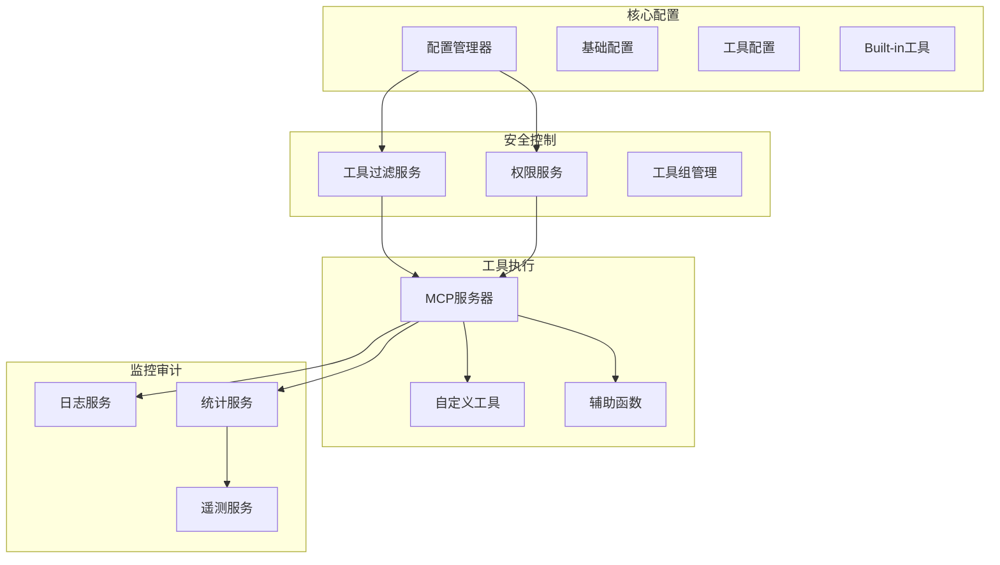
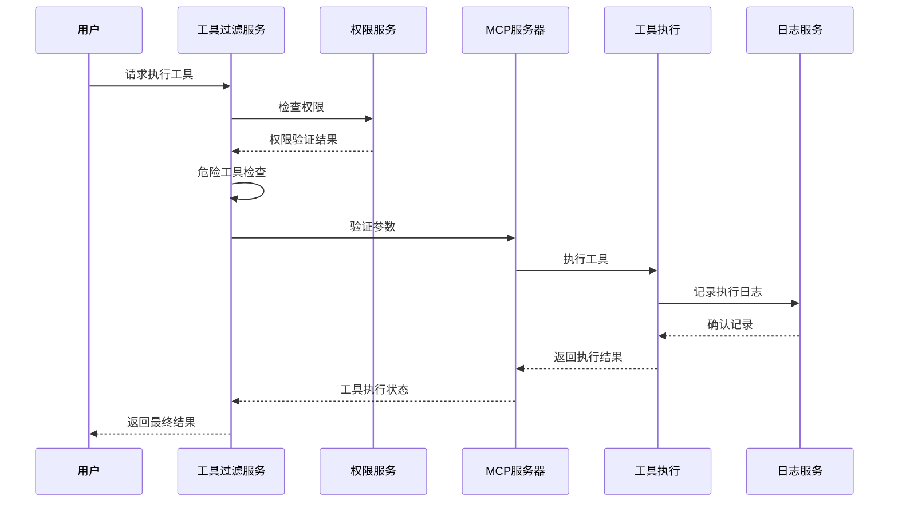
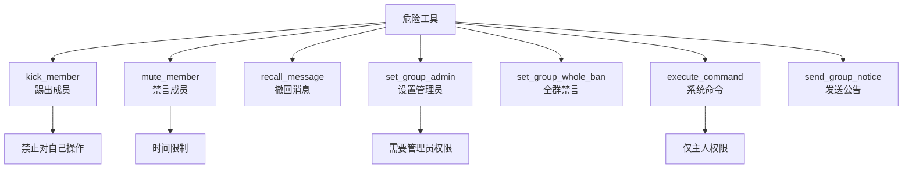
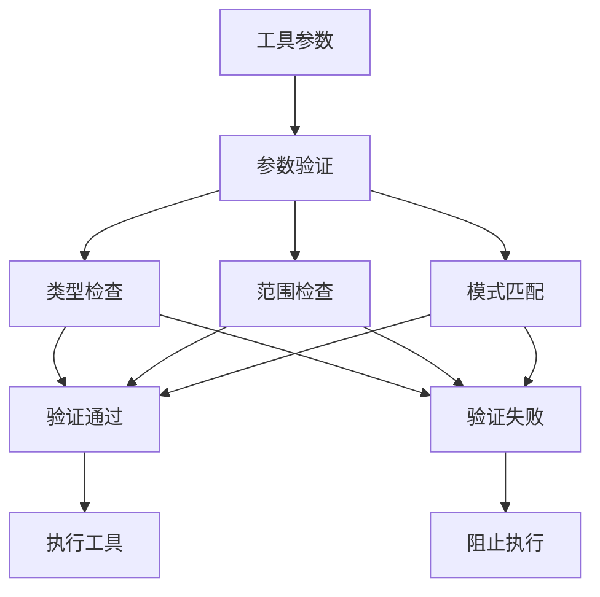
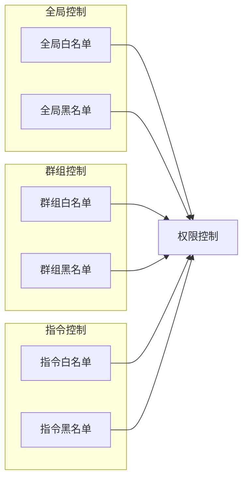
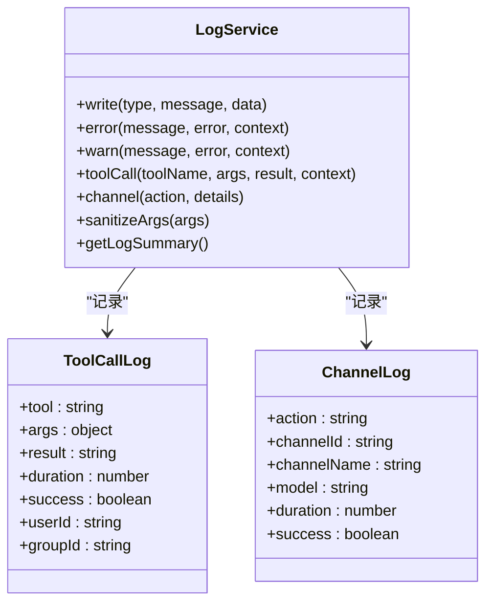
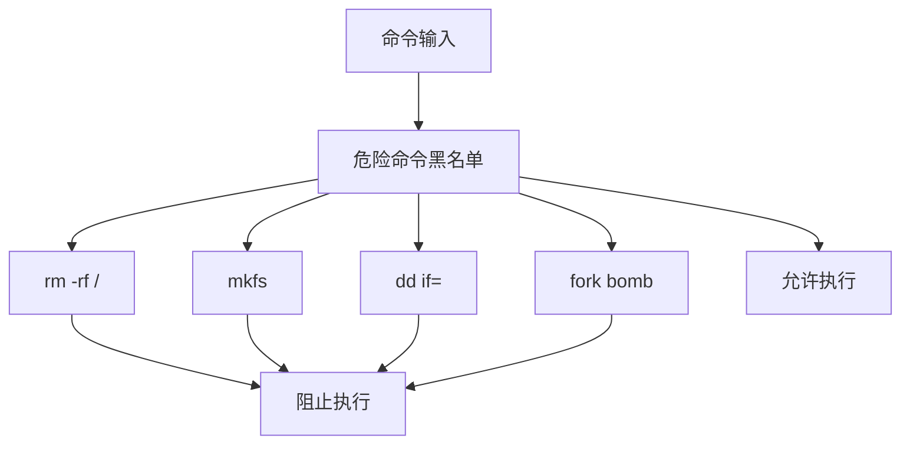
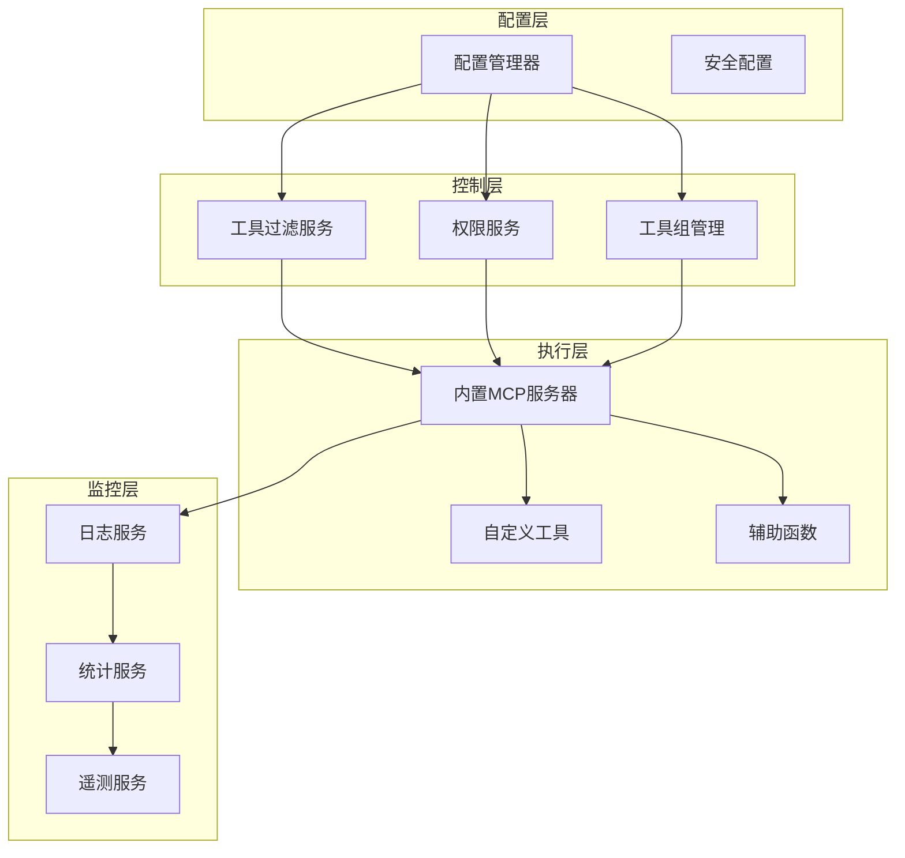

# 工具安全控制

<cite>
**本文档引用的文件**
- [README.md](file://README.md)
- [config.js](file://config/config.js)
- [ToolFilterService.js](file://src/services/tools/ToolFilterService.js)
- [ToolGroupManager.js](file://src/services/tools/ToolGroupManager.js)
- [PermissionService.js](file://src/services/permission/PermissionService.js)
- [CustomTool.js](file://data/tools/CustomTool.js)
- [example_tool.js](file://data/tools/example_tool.js)
- [TOOLS.md](file://docs/TOOLS.md)
- [index.js](file://src/mcp/tools/index.js)
- [BuiltinMcpServer.js](file://src/mcp/BuiltinMcpServer.js)
- [LogService.js](file://src/services/stats/LodService.js)
- [TelemetryService.js](file://src/services/telemetry/TelemetryService.js)
- [StatsService.js](file://src/services/stats/StatsService.js)
- [shell.js](file://src/mcp/tools/shell.js)
- [admin.js](file://src/mcp/tools/admin.js)
- [helpers.js](file://src/mcp/tools/helpers.js)
</cite>

## 目录
1. [简介](#简介)
2. [项目结构](#项目结构)
3. [核心组件](#核心组件)
4. [架构概览](#架构概览)
5. [详细组件分析](#详细组件分析)
6. [依赖关系分析](#依赖关系分析)
7. [性能考虑](#性能考虑)
8. [故障排除指南](#故障排除指南)
9. [结论](#结论)
10. [附录](#附录)

## 简介

本项目是一个基于 Yunzai-Bot 的 AI 聊天插件，集成了多种 LLM 模型和丰富的工具调用能力。本文档专注于工具安全控制系统的详细分析，涵盖危险工具识别机制、拦截策略、权限控制体系、审计日志和监控机制。

## 项目结构

项目采用模块化架构设计，主要包含以下核心模块：



**图表来源**
- [config.js](file://config/config.js#L62-L631)
- [ToolFilterService.js](file://src/services/tools/ToolFilterService.js#L28-L314)
- [PermissionService.js](file://src/services/permission/PermissionService.js#L22-L484)

**章节来源**
- [README.md](file://README.md#L356-L396)
- [config.js](file://config/config.js#L62-L631)

## 核心组件

### 工具过滤服务

工具过滤服务是整个安全控制系统的核心组件，负责：

- **危险工具识别**：内置默认危险工具列表，包括群管理操作、系统命令等
- **白名单/黑名单模式**：支持精确的工具访问控制
- **权限验证**：基于用户角色的访问控制
- **参数验证**：对工具调用参数进行安全检查

### 权限服务

权限服务提供多层次的权限控制：

- **用户权限分级**：支持所有用户、管理员、群主、主人等不同级别
- **黑白名单机制**：支持全局和群组级别的黑白名单
- **指令权限控制**：针对不同命令设置不同的权限要求
- **动态权限检查**：实时验证用户权限状态

### 工具组管理

工具组管理器负责工具的分类和调度：

- **工具分类**：按功能将工具分为基础、用户信息、群组信息等类别
- **危险工具标记**：对具有潜在风险的工具进行标记
- **动态工具加载**：支持热重载和动态工具管理
- **工具组调度**：智能选择合适的工具组执行任务

**章节来源**
- [ToolFilterService.js](file://src/services/tools/ToolFilterService.js#L28-L314)
- [PermissionService.js](file://src/services/permission/PermissionService.js#L22-L484)
- [ToolGroupManager.js](file://src/services/tools/ToolGroupManager.js#L22-L579)

## 架构概览

系统采用分层架构设计，确保安全控制的有效性和可扩展性：



**图表来源**
- [ToolFilterService.js](file://src/services/tools/ToolFilterService.js#L182-L214)
- [PermissionService.js](file://src/services/permission/PermissionService.js#L337-L421)
- [BuiltinMcpServer.js](file://src/mcp/BuiltinMcpServer.js#L623-L676)

## 详细组件分析

### 危险工具识别机制

系统实现了多层次的危险工具识别机制：

#### 内置危险工具列表

系统预定义了以下危险工具类别：



**图表来源**
- [ToolFilterService.js](file://src/services/tools/ToolFilterService.js#L32-L39)
- [shell.js](file://src/mcp/tools/shell.js#L58-L76)
- [admin.js](file://src/mcp/tools/admin.js#L8-L14)

#### 敏感工具检测

系统还识别可能泄露信息的敏感工具：

- 获取好友列表
- 获取群成员列表  
- 获取聊天记录
- 获取文件URL

**章节来源**
- [ToolFilterService.js](file://src/services/tools/ToolFilterService.js#L40-L47)

### 拦截策略

#### 参数验证拦截

系统对工具调用参数进行全面验证：



**图表来源**
- [ToolFilterService.js](file://src/services/tools/ToolFilterService.js#L223-L275)
- [helpers.js](file://src/mcp/tools/helpers.js#L702-L773)

#### 执行拦截机制

系统在多个层面实施执行拦截：

1. **权限拦截**：检查用户角色和权限级别
2. **参数拦截**：验证输入参数的安全性
3. **工具拦截**：基于工具类型和配置的访问控制
4. **时间拦截**：限制操作频率和持续时间

**章节来源**
- [ToolFilterService.js](file://src/services/tools/ToolFilterService.js#L223-L275)
- [shell.js](file://src/mcp/tools/shell.js#L58-L76)

### 权限控制体系

#### 用户权限分级

系统支持以下权限级别：

| 权限级别 | 描述 | 可执行操作 |
|---------|------|-----------|
| all | 所有用户 | 基础对话、查看信息 |
| whitelist | 白名单用户 | 特定受限命令 |
| admin | 管理员 | 群组管理、工具调用 |
| master | 主人 | 所有操作、系统配置 |

#### 黑白名单机制

系统提供灵活的黑白名单控制：



**图表来源**
- [PermissionService.js](file://src/services/permission/PermissionService.js#L354-L382)

**章节来源**
- [PermissionService.js](file://src/services/permission/PermissionService.js#L316-L421)

### 工具调用审计日志

#### 日志记录策略

系统提供多维度的日志记录：



**图表来源**
- [LogService.js](file://src/services/stats/LogService.js#L12-L553)

#### 敏感信息保护

系统在日志记录中实施敏感信息保护：

- **参数脱敏**：自动识别并脱敏密码、令牌等敏感字段
- **URL截断**：对长URL进行截断处理
- **头部清理**：移除Authorization等敏感HTTP头
- **错误信息标准化**：统一错误格式，避免信息泄露

**章节来源**
- [LogService.js](file://src/services/stats/LogService.js#L378-L470)

### 安全配置指南

#### 主要配置项

系统提供以下关键安全配置：

| 配置项 | 类型 | 默认值 | 描述 |
|-------|------|--------|------|
| builtinTools.enabled | boolean | true | 是否启用内置工具 |
| builtinTools.allowedTools | array | [] | 允许的工具白名单 |
| builtinTools.disabledTools | array | [] | 禁用的工具黑名单 |
| builtinTools.dangerousTools | array | [kick_member, recall_message, set_group_whole_ban] | 危险工具列表 |
| builtinTools.allowDangerous | boolean | false | 是否允许危险操作 |
| tools.showCallLogs | boolean | true | 显示工具调用日志 |
| tools.parallelExecution | boolean | true | 启用并行工具执行 |

#### 配置示例

```yaml
# 基础安全配置
builtinTools:
  enabled: true
  allowedTools: []
  disabledTools: []
  dangerousTools: 
    - kick_member
    - recall_message
    - set_group_whole_ban
  allowDangerous: false

# 工具执行配置
tools:
  showCallLogs: true
  parallelExecution: true
  sendIntermediateReply: true
```

**章节来源**
- [config.js](file://config/config.js#L256-L266)
- [config.js](file://config/config.js#L207-L216)

### 沙箱隔离和资源限制

#### 工具执行隔离

系统通过以下机制实现工具执行隔离：

1. **进程隔离**：危险工具在独立进程中执行
2. **权限限制**：限制工具的系统权限访问
3. **资源限制**：设置内存、CPU使用上限
4. **时间限制**：防止无限期执行

#### Shell命令安全

对于系统命令执行工具，系统实施严格的安全措施：



**图表来源**
- [shell.js](file://src/mcp/tools/shell.js#L58-L76)

**章节来源**
- [shell.js](file://src/mcp/tools/shell.js#L58-L108)

## 依赖关系分析

系统各组件之间的依赖关系如下：



**图表来源**
- [config.js](file://config/config.js#L62-L631)
- [ToolFilterService.js](file://src/services/tools/ToolFilterService.js#L28-L54)
- [PermissionService.js](file://src/services/permission/PermissionService.js#L22-L48)
- [BuiltinMcpServer.js](file://src/mcp/BuiltinMcpServer.js#L218-L253)

**章节来源**
- [config.js](file://config/config.js#L62-L631)
- [ToolFilterService.js](file://src/services/tools/ToolFilterService.js#L28-L54)

## 性能考虑

### 并行执行优化

系统支持工具的并行执行以提升性能：

- **并发控制**：限制同时执行的工具数量
- **资源分配**：合理分配系统资源
- **执行监控**：实时监控执行状态和性能指标

### 缓存机制

系统实施多级缓存策略：

- **工具定义缓存**：缓存工具元数据
- **权限缓存**：缓存用户权限信息
- **配置缓存**：缓存配置信息

## 故障排除指南

### 常见安全问题

#### 工具调用失败

**问题症状**：工具调用返回错误或被拒绝

**解决步骤**：
1. 检查工具是否在允许列表中
2. 验证用户权限级别
3. 确认危险工具配置
4. 查看日志服务中的错误记录

#### 权限不足

**问题症状**：用户收到权限不足的错误信息

**解决步骤**：
1. 检查用户角色配置
2. 验证黑白名单设置
3. 确认指令权限配置
4. 检查群组权限设置

#### 安全配置问题

**问题症状**：系统行为不符合预期的安全策略

**解决步骤**：
1. 检查安全配置文件
2. 验证配置项的正确性
3. 重新加载配置
4. 查看配置日志

**章节来源**
- [LogService.js](file://src/services/stats/LogService.js#L286-L341)
- [PermissionService.js](file://src/services/permission/PermissionService.js#L427-L449)

## 结论

本工具安全控制系统通过多层次的安全机制，为工具调用提供了全面的安全保障。系统的主要优势包括：

1. **多层次防护**：从权限控制到参数验证的全方位保护
2. **灵活配置**：支持细粒度的安全策略配置
3. **完整审计**：提供详细的日志记录和监控能力
4. **实时响应**：能够及时发现和阻止潜在的安全威胁

建议在生产环境中：
- 定期审查和更新危险工具列表
- 监控工具调用统计和异常行为
- 定期备份安全配置和日志数据
- 建立完善的安全事件响应流程

## 附录

### 安全配置最佳实践

#### 生产环境配置建议

```yaml
# 生产环境安全配置
builtinTools:
  enabled: true
  allowedTools: []
  disabledTools: []
  dangerousTools: 
    - kick_member
    - recall_message
    - set_group_whole_ban
  allowDangerous: false

tools:
  showCallLogs: true
  parallelExecution: true
  sendIntermediateReply: true

permissions:
  globalWhitelist: []
  globalBlacklist: []
  commands:
    - id: adminPanel
      level: master
    - id: groupSettings  
      level: admin
```

#### 安全审计检查清单

- [ ] 危险工具列表完整性检查
- [ ] 权限配置合理性评估
- [ ] 日志记录完整性验证
- [ ] 安全事件响应流程测试
- [ ] 配置备份和恢复测试
- [ ] 性能监控指标检查