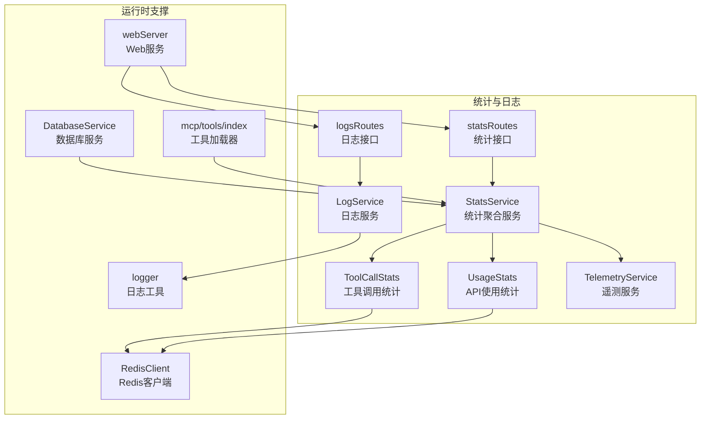
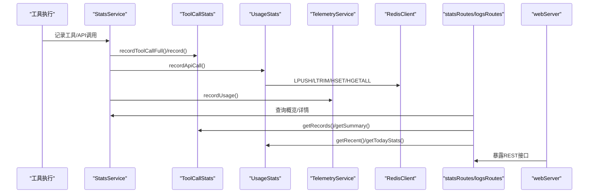
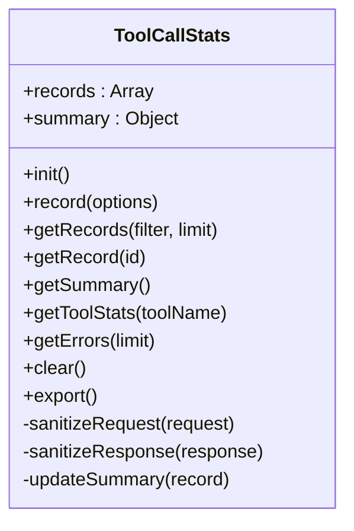
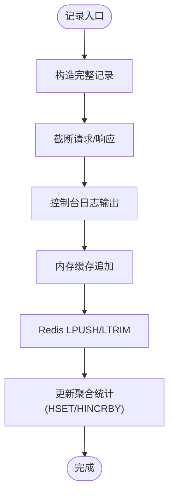
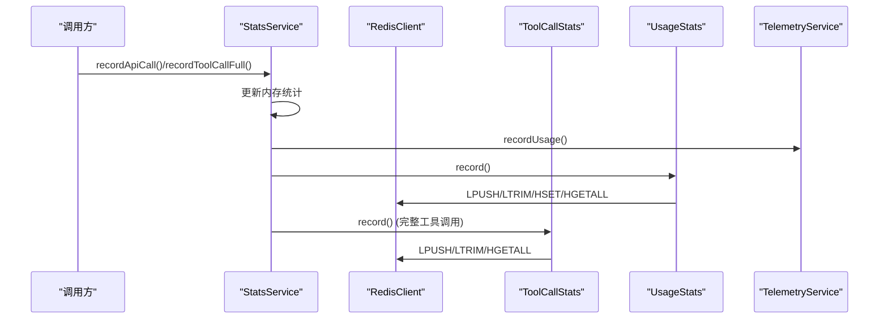
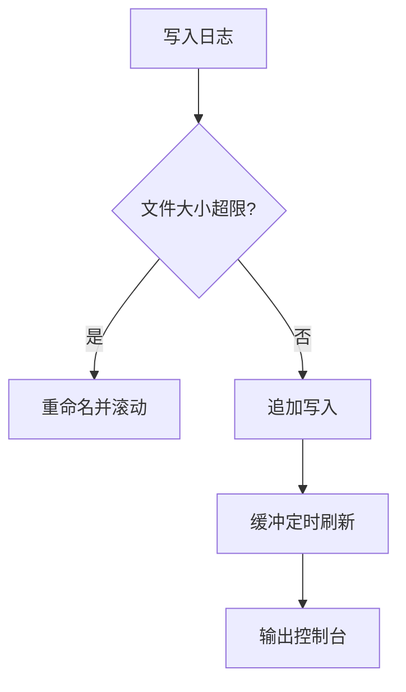
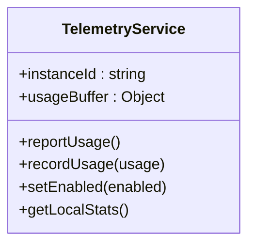
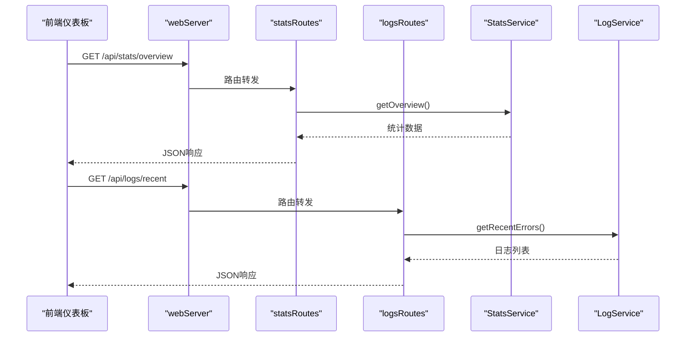
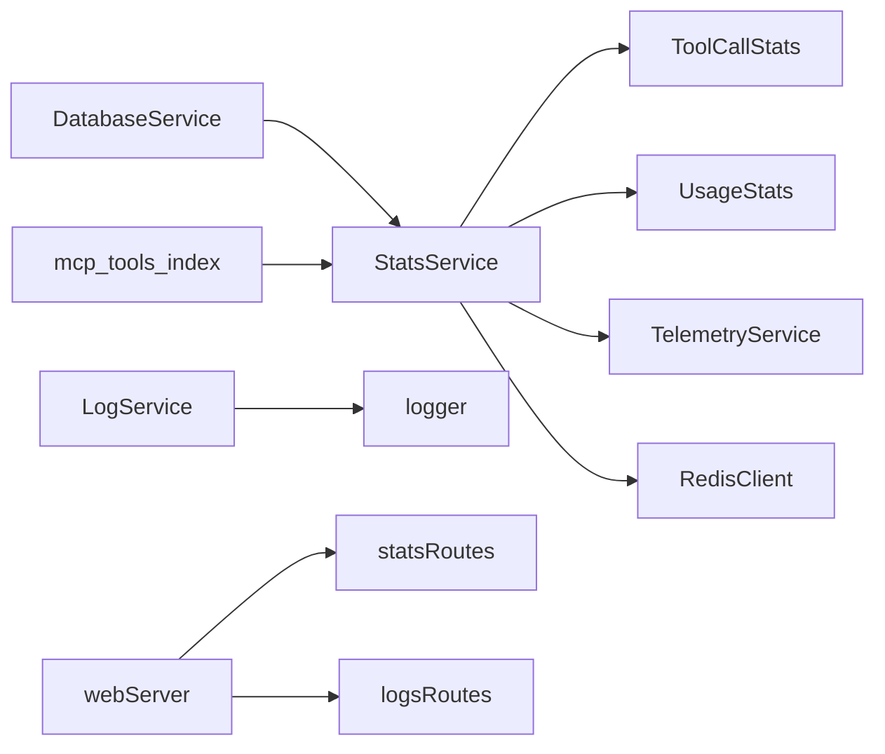

# 工具监控与调试

## 目录
1. [简介](#简介)
2. [项目结构](#项目结构)
3. [核心组件](#核心组件)
4. [架构总览](#架构总览)
5. [详细组件分析](#详细组件分析)
6. [依赖关系分析](#依赖关系分析)
7. [性能考量](#性能考量)
8. [故障排除指南](#故障排除指南)
9. [结论](#结论)
10. [附录](#附录)

## 简介
本文件面向工具监控与调试系统，围绕工具调用统计、执行日志、性能监控与告警、调试方法、缓存机制与优化、故障排除以及监控仪表板使用与自定义报表展开。目标是帮助使用者与维护者理解并高效利用插件内置的统计与日志能力，进行问题定位、性能优化与运维保障。

## 项目结构
- 统计与日志
  - 工具调用统计：ToolCallStats
  - API使用统计：UsageStats
  - 统计聚合服务：StatsService
  - 日志服务：LogService
  - 遥测服务：TelemetryService
  - 统计接口：statsRoutes
  - 日志接口：logsRoutes
- 运行时支撑
  - Redis客户端：RedisClient
  - 日志工具：logger
  - Web服务：webServer
  - 数据库服务：DatabaseService
  - 工具加载器：mcp/tools/index

图表来源
- [ToolCallStats.js](file://src/services/stats/ToolCallStats.js#L32-L379)
- [UsageStats.js](file://src/services/stats/UsageStats.js#L44-L592)
- [StatsService.js](file://src/services/stats/StatsService.js#L19-L682)
- [LogService.js](file://src/services/stats/LogService.js#L12-L553)
- [TelemetryService.js](file://src/services/telemetry/TelemetryService.js#L18-L382)
- [statsRoutes.js](file://src/services/routes/statsRoutes.js#L1-L98)
- [logsRoutes.js](file://src/services/routes/logsRoutes.js#L1-L56)
- [RedisClient.js](file://src/core/cache/RedisClient.js#L4-L130)
- [logger.js](file://src/core/utils/logger.js#L114-L331)
- [webServer.js](file://src/services/webServer.js#L1-L807)
- [DatabaseService.js](file://src/services/storage/DatabaseService.js#L19-L809)
- [index.js](file://src/mcp/tools/index.js#L1-L181)

章节来源
- [README.md](file://README.md#L356-L396)

## 核心组件
- 工具调用统计（ToolCallStats）
  - 记录工具调用的完整请求/响应、成功与否、耗时、来源、用户/群组等，并提供过滤查询、汇总统计、错误列表、导出与清空能力。
- API使用统计（UsageStats）
  - 记录每次API调用的详细信息（渠道、模型、Token用量、耗时、重试、切换链等），支持内存与Redis双层缓存，提供今日统计、渠道/模型排行、用户统计与清空。
- 统计聚合服务（StatsService）
  - 统一入口，协调内存统计、Redis详细记录、遥测上报；提供概览、工具调用详情、今日统计、导出等。
- 日志服务（LogService）
  - 多类型日志（error/warn/api/tool/channel/dispatch/conversation等）写文件与缓冲刷新，支持日志文件管理、最近错误读取、敏感信息脱敏。
- 遥测服务（TelemetryService）
  - 采集使用量（调用次数、Token、成功率、平均耗时）并定时上报至远端服务器，支持启用/禁用、实例ID持久化、周期上报。
- Web接口
  - 统计接口：/api/stats/*
  - 日志接口：/api/logs/*
- 运行时支撑
  - RedisClient：提供Redis连接与常用操作封装
  - logger：统一日志格式与输出
  - webServer：提供认证、静态资源、路由挂载
  - DatabaseService：SQLite数据库封装（会话、记忆、KV等）

章节来源
- [ToolCallStats.js](file://src/services/stats/ToolCallStats.js#L32-L379)
- [UsageStats.js](file://src/services/stats/UsageStats.js#L44-L592)
- [StatsService.js](file://src/services/stats/StatsService.js#L19-L682)
- [LogService.js](file://src/services/stats/LogService.js#L12-L553)
- [TelemetryService.js](file://src/services/telemetry/TelemetryService.js#L18-L382)
- [statsRoutes.js](file://src/services/routes/statsRoutes.js#L1-L98)
- [logsRoutes.js](file://src/services/routes/logsRoutes.js#L1-L56)
- [RedisClient.js](file://src/core/cache/RedisClient.js#L4-L130)
- [logger.js](file://src/core/utils/logger.js#L114-L331)
- [webServer.js](file://src/services/webServer.js#L1-L807)
- [DatabaseService.js](file://src/services/storage/DatabaseService.js#L19-L809)

## 架构总览
工具监控与调试系统由“统计采集—聚合—持久化/缓存—接口—前端仪表板”构成闭环。统计采集来自工具调用与API调用；聚合服务负责内存与Redis的双层统计；接口提供REST查询；前端通过Web服务提供可视化面板。

图表来源
- [StatsService.js](file://src/services/stats/StatsService.js#L230-L360)
- [ToolCallStats.js](file://src/services/stats/ToolCallStats.js#L86-L143)
- [UsageStats.js](file://src/services/stats/UsageStats.js#L199-L263)
- [TelemetryService.js](file://src/services/telemetry/TelemetryService.js#L155-L192)
- [RedisClient.js](file://src/core/cache/RedisClient.js#L43-L120)
- [statsRoutes.js](file://src/services/routes/statsRoutes.js#L18-L95)
- [logsRoutes.js](file://src/services/routes/logsRoutes.js#L9-L53)
- [webServer.js](file://src/services/webServer.js#L339-L537)

## 详细组件分析

### 工具调用统计（ToolCallStats）
- 记录字段
  - 唯一ID、时间戳、工具名、请求/响应（含敏感信息脱敏与大小限制）、成功与否、错误信息/堆栈、耗时、用户/群组、来源等。
- 能力
  - 过滤查询（工具名、成功与否、用户/群组、时间范围、关键词）
  - 汇总统计（总数、成功/失败、成功率、按工具排行、按小时分布、最近错误）
  - 错误列表、导出、清空
- 数据持久化
  - 内存缓存 + Redis列表与哈希，固定上限，保证高吞吐与可查询性
- 敏感信息处理
  - 请求/响应字段按规则脱敏与截断，避免泄露

图表来源
- [ToolCallStats.js](file://src/services/stats/ToolCallStats.js#L32-L379)

章节来源
- [ToolCallStats.js](file://src/services/stats/ToolCallStats.js#L15-L379)

### API使用统计（UsageStats）
- 记录字段
  - 渠道ID/名称、模型、Key索引/名称、策略、输入/输出Token、总Token、耗时、成功与否、重试次数、是否切换渠道、切换链、来源、用户/群组、流式、估算标记、请求/响应（截断）等。
- 能力
  - 内存最近记录 + Redis列表与聚合哈希
  - 今日统计、渠道/模型排行、用户统计、最近记录、清空
  - Token估算（gpt-tokenizer回退）
- 敏感信息处理
  - 请求/响应截断，避免过大日志

图表来源
- [UsageStats.js](file://src/services/stats/UsageStats.js#L199-L263)

章节来源
- [UsageStats.js](file://src/services/stats/UsageStats.js#L44-L592)

### 统计聚合服务（StatsService）
- 统一入口
  - 记录消息、模型调用、工具调用（简化/完整）、API调用（统一入口）
  - 同步更新内存统计，异步记录Redis详细统计与遥测
- 能力
  - 概览统计（消息、模型、Token、工具、运行时长）
  - 工具调用详情查询与汇总
  - 今日API使用统计、最近使用记录、模型/渠道排行、用户统计
  - 导出与重置

图表来源
- [StatsService.js](file://src/services/stats/StatsService.js#L230-L418)
- [UsageStats.js](file://src/services/stats/UsageStats.js#L199-L263)
- [ToolCallStats.js](file://src/services/stats/ToolCallStats.js#L86-L143)
- [TelemetryService.js](file://src/services/telemetry/TelemetryService.js#L155-L192)
- [RedisClient.js](file://src/core/cache/RedisClient.js#L43-L120)

章节来源
- [StatsService.js](file://src/services/stats/StatsService.js#L19-L682)

### 日志服务（LogService）
- 日志类型
  - error、warn、api、tool、channel、dispatch、conversation、debug、info等
- 能力
  - 文件写入（按日期滚动、大小限制）、缓冲刷新、最近错误读取、日志文件列表、敏感信息脱敏、日志统计摘要
- 使用建议
  - 错误日志集中于error文件，便于排查
  - 调试阶段可开启debug/info输出

图表来源
- [LogService.js](file://src/services/stats/LogService.js#L80-L119)

章节来源
- [LogService.js](file://src/services/stats/LogService.js#L12-L553)

### 遥测服务（TelemetryService）
- 能力
  - 实例ID持久化、版本上报、使用量缓冲、定时上报、启用/禁用、周期上报控制
- 数据
  - 模型使用量、总调用数、总Token、成功率、平均耗时等

图表来源
- [TelemetryService.js](file://src/services/telemetry/TelemetryService.js#L18-L382)

章节来源
- [TelemetryService.js](file://src/services/telemetry/TelemetryService.js#L18-L382)

### Web接口与仪表板
- 统计接口
  - /api/stats/overview、/api/stats/api-calls、/api/stats/channels、/api/stats/models、/api/stats/usage、/api/stats/usage/channel/:id、/api/stats/clear
- 日志接口
  - /api/logs/、/api/logs/recent、/api/logs/placeholders、/api/logs/placeholders/preview
- 认证与安全
  - JWT认证、签名头校验、指纹绑定、请求ID去重、Cookie安全策略

图表来源
- [statsRoutes.js](file://src/services/routes/statsRoutes.js#L18-L95)
- [logsRoutes.js](file://src/services/routes/logsRoutes.js#L9-L53)
- [webServer.js](file://src/services/webServer.js#L339-L537)

章节来源
- [statsRoutes.js](file://src/services/routes/statsRoutes.js#L1-L98)
- [logsRoutes.js](file://src/services/routes/logsRoutes.js#L1-L56)
- [webServer.js](file://src/services/webServer.js#L1-L807)

## 依赖关系分析
- 组件耦合
  - StatsService是中枢，依赖ToolCallStats、UsageStats、TelemetryService与RedisClient
  - LogService独立但与logger配合，提供文件落盘与缓冲
  - webServer挂载statsRoutes与logsRoutes，提供认证与静态资源
- 外部依赖
  - Redis用于高吞吐统计与聚合
  - gpt-tokenizer用于Token估算
  - better-sqlite3用于会话与记忆存储（DatabaseService）

图表来源
- [StatsService.js](file://src/services/stats/StatsService.js#L5-L14)
- [ToolCallStats.js](file://src/services/stats/ToolCallStats.js#L6-L9)
- [UsageStats.js](file://src/services/stats/UsageStats.js#L8-L9)
- [TelemetryService.js](file://src/services/telemetry/TelemetryService.js#L5-L10)
- [RedisClient.js](file://src/core/cache/RedisClient.js#L1-L3)
- [LogService.js](file://src/services/stats/LogService.js#L1-L6)
- [logger.js](file://src/core/utils/logger.js#L1-L6)
- [webServer.js](file://src/services/webServer.js#L1-L13)
- [DatabaseService.js](file://src/services/storage/DatabaseService.js#L1-L7)
- [index.js](file://src/mcp/tools/index.js#L1-L5)

章节来源
- [StatsService.js](file://src/services/stats/StatsService.js#L19-L682)
- [ToolCallStats.js](file://src/services/stats/ToolCallStats.js#L32-L379)
- [UsageStats.js](file://src/services/stats/UsageStats.js#L44-L592)
- [TelemetryService.js](file://src/services/telemetry/TelemetryService.js#L18-L382)
- [RedisClient.js](file://src/core/cache/RedisClient.js#L4-L130)
- [LogService.js](file://src/services/stats/LogService.js#L12-L553)
- [logger.js](file://src/core/utils/logger.js#L114-L331)
- [webServer.js](file://src/services/webServer.js#L1-L807)
- [DatabaseService.js](file://src/services/storage/DatabaseService.js#L19-L809)
- [index.js](file://src/mcp/tools/index.js#L1-L181)

## 性能考量
- 统计容量与内存
  - ToolCallStats固定上限（例如1000条），避免无限增长
  - UsageStats内存最近记录上限（例如100条），Redis列表上限（例如10000条）
- Token估算
  - 优先使用gpt-tokenizer，失败时采用启发式估算，兼顾准确性与性能
- Redis使用
  - LPUSH/LTRIM保持列表长度，HSET/HINCRBY更新聚合，合理设置过期时间
- 日志写入
  - 缓冲定时刷新（默认5秒），文件大小限制（默认10MB），按日期滚动
- 并发与去重
  - DatabaseService的消息去重与索引优化，提升查询效率

章节来源
- [ToolCallStats.js](file://src/services/stats/ToolCallStats.js#L11-L13)
- [UsageStats.js](file://src/services/stats/UsageStats.js#L11-L50)
- [LogService.js](file://src/services/stats/LogService.js#L14-L21)
- [DatabaseService.js](file://src/services/storage/DatabaseService.js#L47-L78)

## 故障排除指南
- 工具调用失败
  - 使用工具调用统计接口查询失败记录与最近错误，结合日志服务的工具调用日志定位问题
  - 检查危险工具权限与机器人权限
- API错误
  - 使用LogService的API错误日志与UsageStats的失败记录，核对渠道配置、Key权限与速率限制
- 日志无法读取
  - 确认日志目录存在且有写权限，检查文件大小滚动与过期清理
- Redis不可用
  - 检查Redis配置与连通性，确认StatsService/ToolCallStats/UsageStats的Redis调用是否降级到内存
- 仪表板无法访问
  - 检查端口占用与防火墙，确认webServer的启动日志与登录链接有效性

章节来源
- [README.md](file://README.md#L665-L746)
- [LogService.js](file://src/services/stats/LogService.js#L264-L284)
- [StatsService.js](file://src/services/stats/StatsService.js#L314-L325)
- [webServer.js](file://src/services/webServer.js#L637-L716)

## 结论
该监控与调试系统通过“内存统计 + Redis持久化 + 文件日志 + 遥测上报”的组合，实现了对工具调用与API使用的全链路可观测性。配合Web接口与仪表板，能够快速定位问题、评估性能并制定优化策略。建议在生产环境中启用Redis与遥测，在调试阶段适当增加日志级别，并定期清理过期日志与统计。

## 附录

### 指标体系与告警建议
- 工具调用指标
  - 调用次数、成功率、平均耗时、错误率、按工具排行、按小时分布
- API使用指标
  - 调用次数、成功/失败、成功率、输入/输出Token总量、平均耗时、渠道/模型排行
- 告警建议
  - 成功率低于阈值（如95%）、平均耗时持续上升、错误数突增、Redis连接异常
- 可视化建议
  - 仪表板展示：调用趋势、失败趋势、Top工具/模型、渠道健康度、Token消耗趋势

章节来源
- [ToolCallStats.js](file://src/services/stats/ToolCallStats.js#L285-L310)
- [UsageStats.js](file://src/services/stats/UsageStats.js#L342-L375)
- [StatsService.js](file://src/services/stats/StatsService.js#L431-L489)

### 调试方法
- 参数验证
  - 工具调用日志记录参数脱敏后的摘要，便于核对输入
- 执行跟踪
  - 使用工具调用统计与API使用统计的过滤查询，按时间、工具、用户/群组筛选
- 错误诊断
  - 通过最近错误日志与失败记录定位具体错误与堆栈
- 日志格式
  - error/warn/api/tool/channel/dispatch/conversation等类型日志，便于分类排查

章节来源
- [LogService.js](file://src/services/stats/LogService.js#L378-L453)
- [ToolCallStats.js](file://src/services/stats/ToolCallStats.js#L235-L274)
- [UsageStats.js](file://src/services/stats/UsageStats.js#L302-L341)

### 缓存机制监控与优化
- 监控
  - Redis键空间与过期策略、列表长度、哈希聚合字段
  - 内存统计与磁盘日志容量
- 优化
  - 合理设置上限与过期时间，定期清理过期键
  - 使用估算Token减少计算开销，必要时启用gpt-tokenizer

章节来源
- [RedisClient.js](file://src/core/cache/RedisClient.js#L10-L130)
- [UsageStats.js](file://src/services/stats/UsageStats.js#L268-L295)
- [LogService.js](file://src/services/stats/LogService.js#L264-L284)

### 仪表板使用与自定义报表
- 仪表板功能
  - 系统概览、渠道状态、模型使用排行、工具调用统计、调用记录详情、日志查看
- 自定义报表
  - 通过统计接口（/api/stats/*）与日志接口（/api/logs/*）拉取数据，结合业务需求生成报表
- 访问方式
  - 通过管理面板命令获取临时/永久登录链接，或根据webServer输出的地址访问

章节来源
- [README.md](file://README.md#L398-L511)
- [statsRoutes.js](file://src/services/routes/statsRoutes.js#L18-L95)
- [logsRoutes.js](file://src/services/routes/logsRoutes.js#L9-L53)
- [webServer.js](file://src/services/webServer.js#L539-L580)
