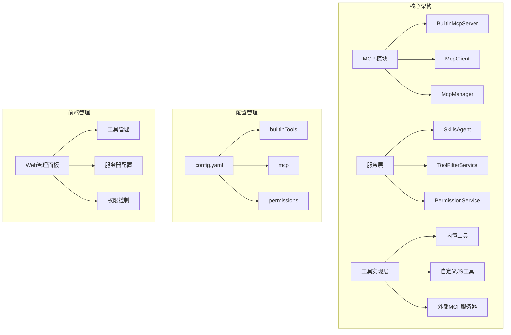
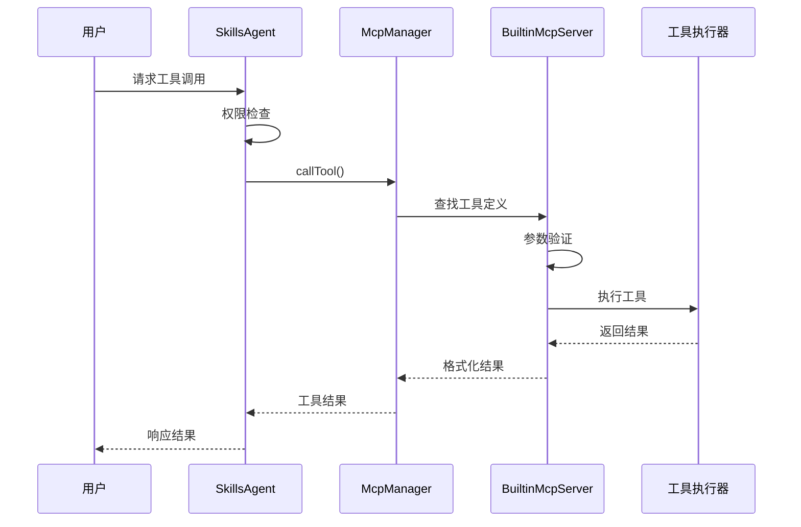
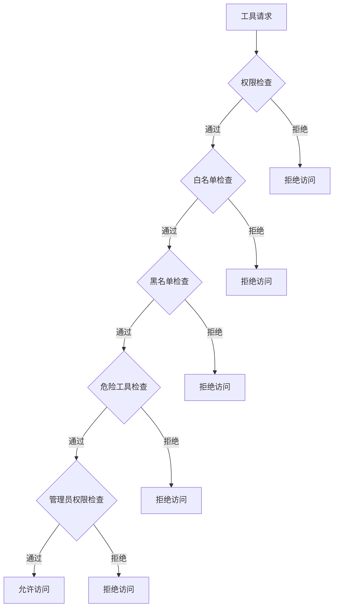
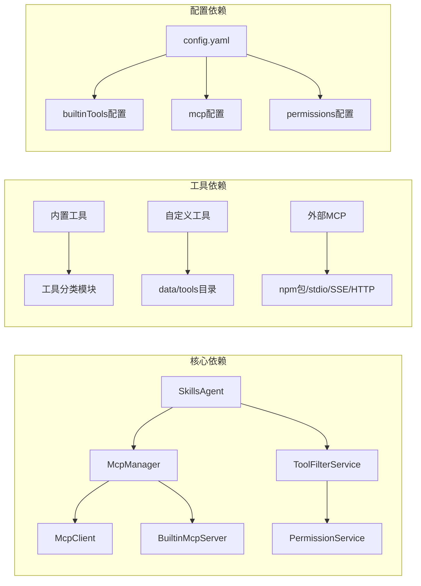

# 工具调用系统


## 目录
1. [简介](#简介)
2. [项目结构](#项目结构)
3. [核心组件](#核心组件)
4. [架构概览](#架构概览)
5. [详细组件分析](#详细组件分析)
6. [依赖关系分析](#依赖关系分析)
7. [性能考虑](#性能考虑)
8. [故障排除指南](#故障排除指南)
9. [结论](#结论)

## 简介

工具调用系统是基于 MCP（Model Context Protocol）协议构建的智能化工具管理平台，专为 Yunzai-Bot 聊天插件设计。该系统实现了完整的工具发现、权限验证、执行流程管理，支持 50+ 个内置工具和自定义工具扩展。

### 主要特性

- **MCP 协议兼容**：完全符合 Model Context Protocol 标准
- **多源工具管理**：支持内置工具、自定义 JS 工具、外部 MCP 服务器
- **智能权限控制**：多层次权限验证和安全保护机制
- **热重载机制**：支持工具的动态加载和更新
- **可视化管理**：提供 Web 管理面板进行配置和监控

## 项目结构



**图表来源**
- [ARCHITECTURE.md](file://docs/ARCHITECTURE.md#L47-L87)
- [README.md](file://README.md#L359-L396)

**章节来源**
- [README.md](file://README.md#L356-L396)
- [ARCHITECTURE.md](file://docs/ARCHITECTURE.md#L1-L87)

## 核心组件

### MCP 管理器 (McpManager)

McpManager 是整个工具调用系统的核心协调器，负责统一管理所有工具来源：

- **工具注册表管理**：维护工具名称到定义的映射关系
- **服务器管理**：协调内置、自定义和外部 MCP 服务器
- **缓存管理**：提供工具结果缓存机制
- **日志记录**：完整的工具调用日志追踪

### 内置 MCP 服务器 (BuiltinMcpServer)

提供本地工具执行环境：

- **工具加载**：动态加载内置工具模块
- **上下文管理**：为工具提供运行时上下文
- **热重载支持**：文件变化自动重载工具
- **适配器检测**：支持多种机器人协议适配器

### MCP 客户端 (McpClient)

实现多种传输协议的客户端：

- **stdio 传输**：本地进程通信
- **npm 包传输**：npm 包形式的 MCP 服务器
- **SSE 传输**：Server-Sent Events 实时连接
- **HTTP 传输**：标准 HTTP 请求响应

**章节来源**
- [McpManager.js](file://src/mcp/McpManager.js#L27-L49)
- [BuiltinMcpServer.js](file://src/mcp/BuiltinMcpServer.js#L218-L229)
- [McpClient.js](file://src/mcp/McpClient.js#L37-L79)

## 架构概览



**图表来源**
- [SkillsAgent.js](file://src/services/agent/SkillsAgent.js#L326-L379)
- [McpManager.js](file://src/mcp/McpManager.js#L724-L800)

系统采用分层架构设计，从上到下分别为：

1. **业务层**：SkillsAgent 提供统一的工具调用接口
2. **MCP 协议层**：McpManager 处理工具注册、发现、调用
3. **工具实现层**：BuiltinMcpServer 管理内置工具和自定义工具

**章节来源**
- [ARCHITECTURE.md](file://docs/ARCHITECTURE.md#L47-L87)
- [SkillsAgent.js](file://src/services/agent/SkillsAgent.js#L21-L42)

## 详细组件分析

### 工具过滤服务 (ToolFilterService)

工具过滤服务提供多层次的工具访问控制：



**图表来源**
- [ToolFilterService.js](file://src/services/tools/ToolFilterService.js#L89-L173)

#### 权限控制机制

系统实现了以下权限控制层级：

1. **预设级别控制**：基于用户预设的工具访问配置
2. **全局配置控制**：系统级工具启用/禁用设置
3. **危险工具保护**：对高风险操作的额外保护
4. **管理员权限验证**：群管理相关工具的权限检查

**章节来源**
- [ToolFilterService.js](file://src/services/tools/ToolFilterService.js#L28-L48)
- [PermissionService.js](file://src/services/permission/PermissionService.js#L337-L421)

### 内置工具管理系统

系统包含 50+ 个内置工具，按功能分类组织：

#### 基础工具 (basic)
- 时间获取：`get_current_time`
- 延迟等待：`sleep`
- 环境信息：`get_environment`
- 工具列表：`list_available_tools`

#### 群管理工具 (admin)
- 成员管理：`mute_member`, `kick_member`
- 群设置：`set_group_card`, `set_group_whole_ban`
- 公告管理：`send_group_notice`, `delete_group_notice`

#### 消息操作工具 (message)
- 消息发送：`send_private_message`, `send_group_message`
- 消息处理：`reply_current_message`, `make_forward_message`

**章节来源**
- [tools/index.js](file://src/mcp/tools/index.js#L30-L58)
- [basic.js](file://src/mcp/tools/basic.js#L6-L399)
- [admin.js](file://src/mcp/tools/admin.js#L14-L800)

### 自定义工具开发

系统支持通过 JS 文件扩展工具，提供完整的开发指南：

#### 工具结构规范

```javascript
export default {
    name: 'tool_name',
    function: {
        name: 'tool_name',
        description: '工具功能描述',
        parameters: {
            type: 'object',
            properties: {
                // 参数定义...
            },
            required: []
        }
    },
    async run(args, context) {
        // 工具执行逻辑
        return { /* 返回结果 */ }
    }
}
```

#### 上下文访问能力

自定义工具可以通过上下文访问丰富的运行时信息：

- **事件信息**：消息事件、用户信息、群组信息
- **Bot 实例**：机器人实例和适配器信息
- **平台适配器**：支持多种协议适配器检测

**章节来源**
- [TOOLS.md](file://docs/TOOLS.md#L85-L134)
- [BuiltinMcpServer.js](file://src/mcp/BuiltinMcpServer.js#L74-L186)

## 依赖关系分析



**图表来源**
- [McpManager.js](file://src/mcp/McpManager.js#L1-L12)
- [SkillsAgent.js](file://src/services/agent/SkillsAgent.js#L1-L6)

系统采用松耦合设计，各组件间通过清晰的接口进行通信，支持灵活的扩展和配置。

**章节来源**
- [ARCHITECTURE.md](file://docs/ARCHITECTURE.md#L360-L403)

## 性能考虑

### 缓存策略

系统实现了多层次的缓存机制：

- **工具结果缓存**：避免重复执行相同工具调用
- **工具类别缓存**：减少工具分类加载开销
- **服务器连接缓存**：维持 MCP 服务器连接状态

### 并发处理

- **工具执行并发**：支持多个工具的并行执行
- **服务器连接池**：优化外部 MCP 服务器的连接管理
- **内存优化**：合理的内存使用和垃圾回收策略

### 监控指标

系统提供完整的性能监控：

- **工具执行时间统计**
- **服务器连接状态监控**
- **内存使用情况跟踪**
- **错误率和成功率统计**

## 故障排除指南

### 常见问题诊断

#### 工具调用失败

1. **检查工具权限**：确认工具在配置中已启用
2. **验证参数格式**：确保传入参数符合 JSON Schema 定义
3. **检查危险工具保护**：确认 `allowDangerous` 配置正确

#### MCP 服务器连接问题

1. **网络连接检查**：验证外部 MCP 服务器可达性
2. **认证配置**：确认服务器认证信息正确
3. **超时设置**：调整连接超时和重试策略

#### 权限验证失败

1. **用户权限检查**：确认用户具有执行工具的权限
2. **管理员权限验证**：群管理工具需要相应权限
3. **预设配置验证**：检查预设级别的工具访问配置

**章节来源**
- [README.md](file://README.md#L715-L722)
- [McpClient.js](file://src/mcp/McpClient.js#L420-L449)

### 调试方法

#### 启用调试模式

在 `config.yaml` 中设置：
```yaml
basic:
  debug: true
```

#### 日志分析

系统提供详细的日志记录：

- **工具调用日志**：记录每次工具执行的详细信息
- **服务器连接日志**：监控 MCP 服务器连接状态
- **权限检查日志**：跟踪权限验证过程

#### 性能监控

- **执行时间监控**：分析工具执行效率
- **内存使用监控**：跟踪内存泄漏和使用情况
- **错误统计**：收集和分析错误类型

## 结论

工具调用系统通过实现完整的 MCP 协议标准，为 Yunzai-Bot 提供了强大而灵活的工具管理能力。系统的设计充分考虑了安全性、可扩展性和易用性，支持从简单的内置工具到复杂的自定义工具的全范围应用。

### 系统优势

1. **标准化协议**：完全符合 MCP 协议标准，便于生态系统集成
2. **多层次安全**：从权限控制到危险工具保护的全方位安全保障
3. **灵活扩展**：支持多种工具来源和自定义扩展
4. **高性能设计**：优化的缓存和并发处理机制
5. **完善监控**：全面的日志记录和性能监控功能

### 未来发展方向

- **工具生态扩展**：持续增加更多实用工具
- **性能优化**：进一步提升系统性能和响应速度
- **安全增强**：加强安全防护和审计功能
- **用户体验改进**：优化 Web 管理面板和配置界面

该系统为构建智能化聊天机器人提供了坚实的技术基础，能够满足各种复杂的应用场景需求。
