# 自定义工具开发

<cite>
**本文档引用的文件**
- [CustomTool.js](file://data/tools/CustomTool.js)
- [example_tool.js](file://data/tools/example_tool.js)
- [TOOLS.md](file://docs/TOOLS.md)
- [ToolFilterService.js](file://src/services/tools/ToolFilterService.js)
- [ToolGroupManager.js](file://src/services/tools/ToolGroupManager.js)
- [index.js](file://src/mcp/tools/index.js)
- [BuiltinMcpServer.js](file://src/mcp/BuiltinMcpServer.js)
- [toolsRoutes.js](file://src/services/routes/toolsRoutes.js)
- [config.js](file://config/config.js)
- [McpManager.js](file://src/mcp/McpManager.js)
- [helpers.js](file://src/mcp/tools/helpers.js)
- [StatsService.js](file://src/services/stats/StatsService.js)
- [logger.js](file://src/core/utils/logger.js)
- [basic.js](file://src/mcp/tools/basic.js)
- [package.json](file://package.json)
</cite>

## 目录
1. [简介](#简介)
2. [项目结构](#项目结构)
3. [核心组件](#核心组件)
4. [架构概览](#架构概览)
5. [详细组件分析](#详细组件分析)
6. [依赖分析](#依赖分析)
7. [性能考虑](#性能考虑)
8. [故障排除指南](#故障排除指南)
9. [结论](#结论)
10. [附录](#附录)

## 简介

本指南面向开发者，详细介绍如何在 ChatAI Plugin 中开发和部署自定义工具。该系统基于 MCP (Model Context Protocol) 标准，支持多种工具开发方式和强大的配置管理机制。

## 项目结构

项目采用模块化架构，主要包含以下核心目录：

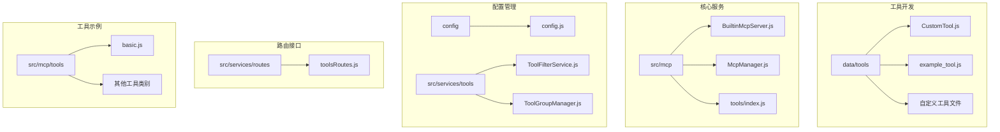

**图表来源**
- [CustomTool.js](file://data/tools/CustomTool.js#L1-L36)
- [BuiltinMcpServer.js](file://src/mcp/BuiltinMcpServer.js#L1-L100)
- [config.js](file://config/config.js#L1-L100)

**章节来源**
- [CustomTool.js](file://data/tools/CustomTool.js#L1-L36)
- [TOOLS.md](file://docs/TOOLS.md#L1-L100)
- [config.js](file://config/config.js#L1-L200)

## 核心组件

### 工具基类系统

系统提供了两种工具开发方式：

1. **简单对象格式**（推荐）
2. **类继承格式**

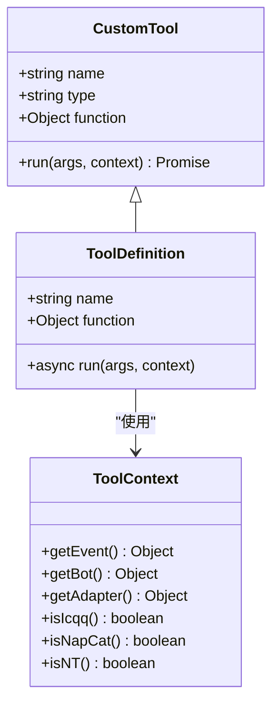

**图表来源**
- [CustomTool.js](file://data/tools/CustomTool.js#L5-L33)
- [example_tool.js](file://data/tools/example_tool.js#L1-L43)

### 工具过滤系统

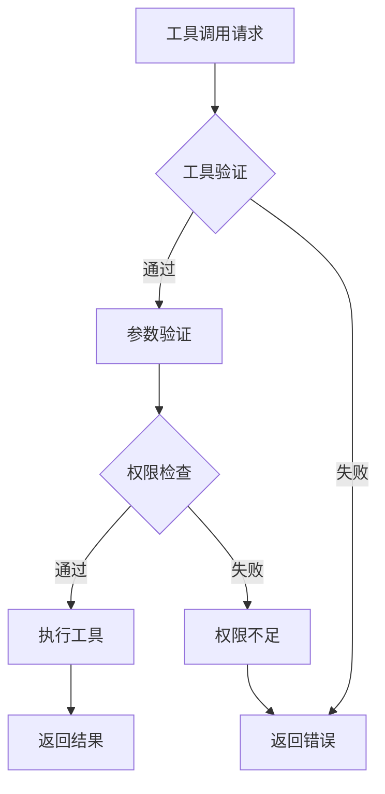

**图表来源**
- [ToolFilterService.js](file://src/services/tools/ToolFilterService.js#L89-L173)
- [helpers.js](file://src/mcp/tools/helpers.js#L702-L773)

**章节来源**
- [ToolFilterService.js](file://src/services/tools/ToolFilterService.js#L1-L100)
- [helpers.js](file://src/mcp/tools/helpers.js#L702-L773)

## 架构概览

系统采用分层架构设计，支持多种工具来源和执行方式：

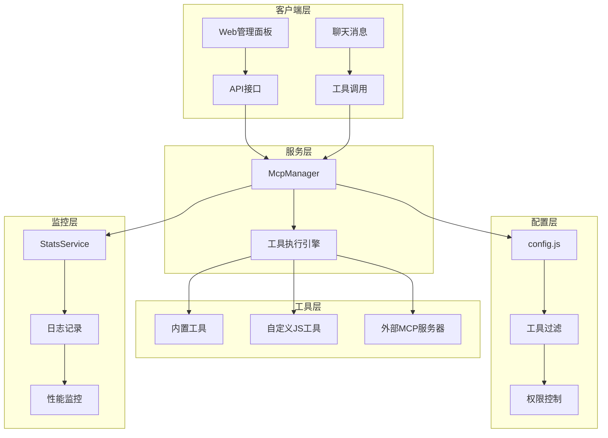

**图表来源**
- [McpManager.js](file://src/mcp/McpManager.js#L27-L122)
- [BuiltinMcpServer.js](file://src/mcp/BuiltinMcpServer.js#L218-L253)
- [config.js](file://config/config.js#L207-L266)

## 详细组件分析

### 工具开发规范

#### 接口定义标准

每个工具必须遵循以下标准接口：

| 属性 | 类型 | 必需 | 描述 |
|------|------|------|------|
| `name` | string | 是 | 工具唯一标识符 |
| `function.name` | string | 是 | 工具函数名称 |
| `function.description` | string | 是 | 工具功能描述 |
| `function.parameters` | object | 是 | JSON Schema 参数定义 |
| `run(args, context)` | function | 是 | 工具执行函数 |

#### 参数格式规范

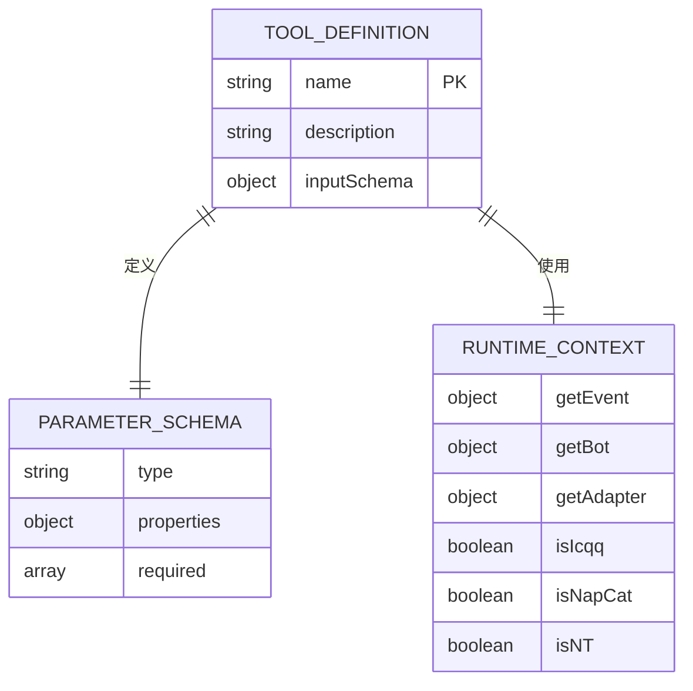

**图表来源**
- [CustomTool.js](file://data/tools/CustomTool.js#L14-L22)
- [example_tool.js](file://data/tools/example_tool.js#L4-L21)

#### 上下文访问机制

工具执行时可访问丰富的运行时上下文：

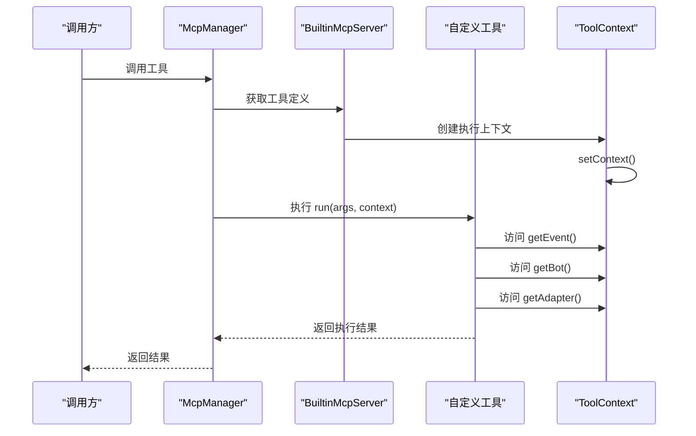

**图表来源**
- [BuiltinMcpServer.js](file://src/mcp/BuiltinMcpServer.js#L74-L186)
- [McpManager.js](file://src/mcp/McpManager.js#L724-L800)

**章节来源**
- [TOOLS.md](file://docs/TOOLS.md#L221-L310)
- [BuiltinMcpServer.js](file://src/mcp/BuiltinMcpServer.js#L74-L186)

### 工具注册机制

#### 自动加载流程

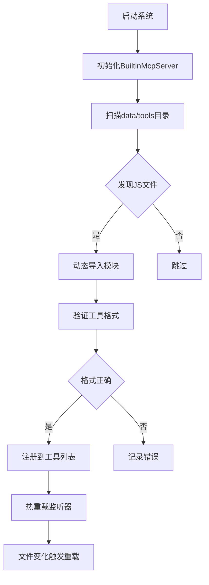

**图表来源**
- [BuiltinMcpServer.js](file://src/mcp/BuiltinMcpServer.js#L457-L503)
- [BuiltinMcpServer.js](file://src/mcp/BuiltinMcpServer.js#L509-L567)

#### 热重载机制

系统支持三种重载方式：

1. **自动重载**：插件启动时自动加载
2. **手动重载**：管理面板操作
3. **代码重载**：编程方式调用

**章节来源**
- [TOOLS.md](file://docs/TOOLS.md#L731-L769)
- [BuiltinMcpServer.js](file://src/mcp/BuiltinMcpServer.js#L509-L567)

### 配置管理

#### 工具过滤配置

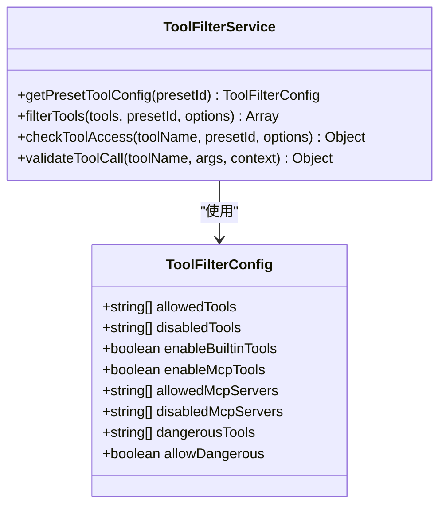

**图表来源**
- [ToolFilterService.js](file://src/services/tools/ToolFilterService.js#L16-L26)
- [ToolFilterService.js](file://src/services/tools/ToolFilterService.js#L59-L80)

#### 预设管理

系统支持工具预设配置，包括：

- **工具启用状态**：允许/禁用特定工具
- **危险工具控制**：敏感操作的保护机制
- **权限控制**：管理员权限验证
- **调用限制**：并发执行和频率限制

**章节来源**
- [config.js](file://config/config.js#L207-L266)
- [ToolFilterService.js](file://src/services/tools/ToolFilterService.js#L28-L48)

### 生命周期管理

#### 工具执行生命周期

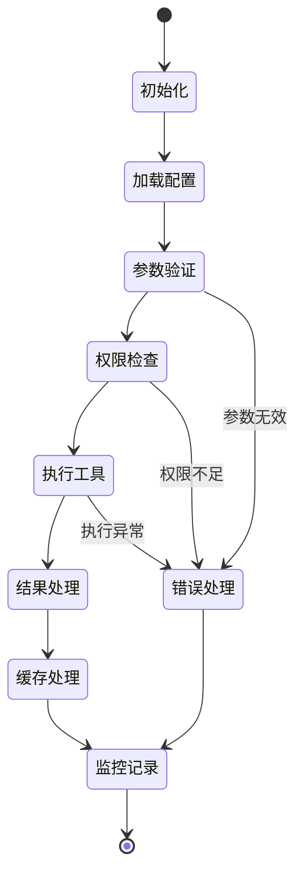

**图表来源**
- [McpManager.js](file://src/mcp/McpManager.js#L724-L800)
- [helpers.js](file://src/mcp/tools/helpers.js#L702-L773)

**章节来源**
- [McpManager.js](file://src/mcp/McpManager.js#L717-L800)
- [StatsService.js](file://src/services/stats/StatsService.js#L385-L418)

## 依赖分析

### 核心依赖关系

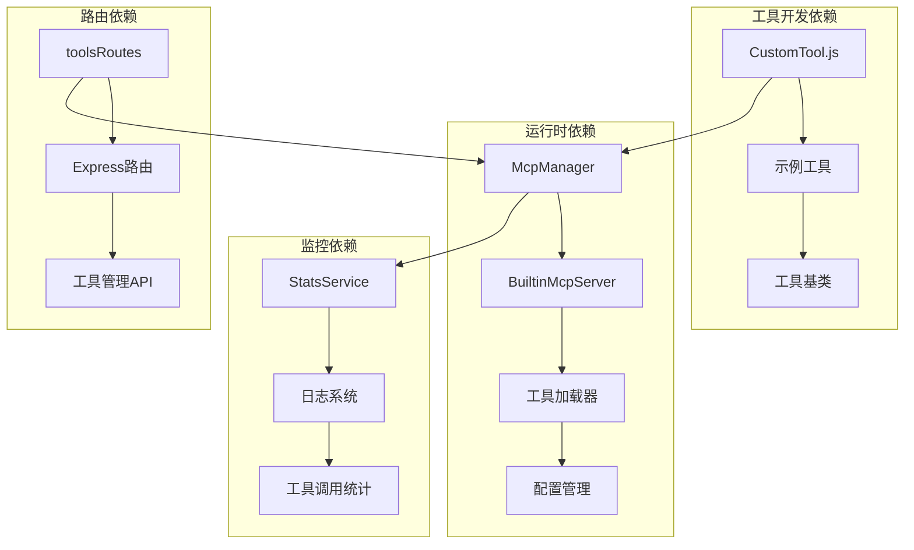

**图表来源**
- [package.json](file://package.json#L16-L46)
- [McpManager.js](file://src/mcp/McpManager.js#L1-L50)

### 第三方库依赖

系统使用的主要第三方库包括：

- **AI模型SDK**：OpenAI、Anthropic、Google Gemini
- **Web框架**：Express.js
- **数据库**：Better SQLite3
- **缓存**：IORedis
- **图像处理**：Sharp、Canvas
- **OCR识别**：Tesseract.js

**章节来源**
- [package.json](file://package.json#L16-L46)

## 性能考虑

### 工具执行优化

1. **缓存机制**：支持工具结果缓存，减少重复计算
2. **并发控制**：可配置的并行执行限制
3. **内存管理**：及时清理临时数据和监听器
4. **资源限制**：超时控制和错误恢复机制

### 监控指标

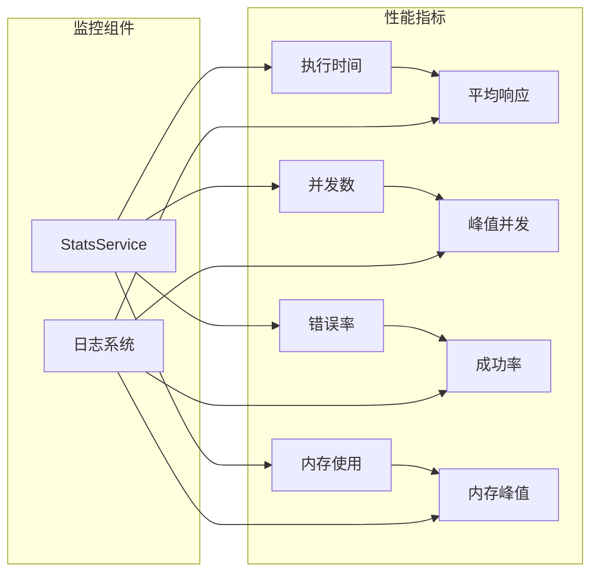

**图表来源**
- [StatsService.js](file://src/services/stats/StatsService.js#L58-L72)
- [logger.js](file://src/core/utils/logger.js#L114-L180)

**章节来源**
- [StatsService.js](file://src/services/stats/StatsService.js#L1-L100)
- [logger.js](file://src/core/utils/logger.js#L114-L180)

## 故障排除指南

### 常见问题诊断

#### 工具加载失败

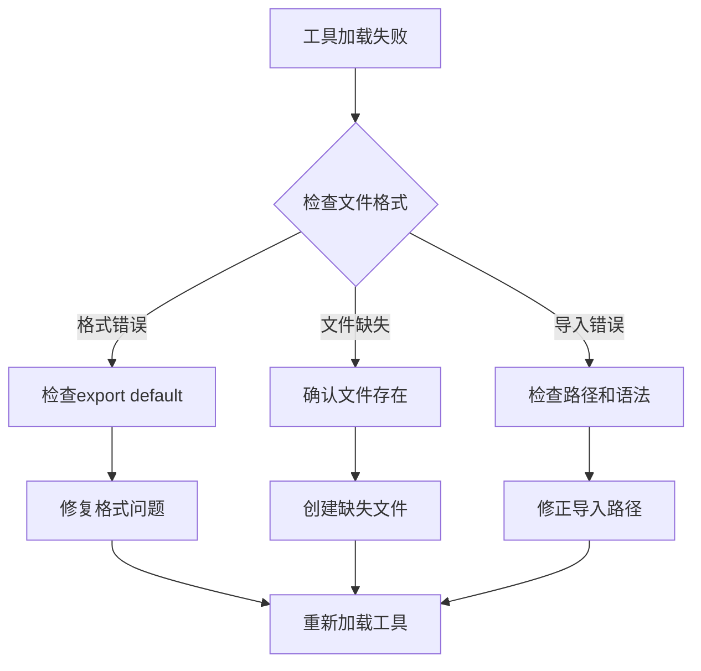

#### 权限验证失败

系统提供多层次的权限验证：

1. **工具级别权限**：危险工具的特殊权限要求
2. **用户级别权限**：管理员/群主权限验证
3. **参数级别验证**：工具调用参数的完整性检查

**章节来源**
- [ToolFilterService.js](file://src/services/tools/ToolFilterService.js#L182-L214)
- [helpers.js](file://src/mcp/tools/helpers.js#L702-L773)

### 调试方法

#### 日志记录

系统提供多级日志记录：

- **调试日志**：详细的操作过程记录
- **信息日志**：重要事件和状态变更
- **错误日志**：异常情况和错误信息
- **性能日志**：执行时间和资源使用

#### 工具测试

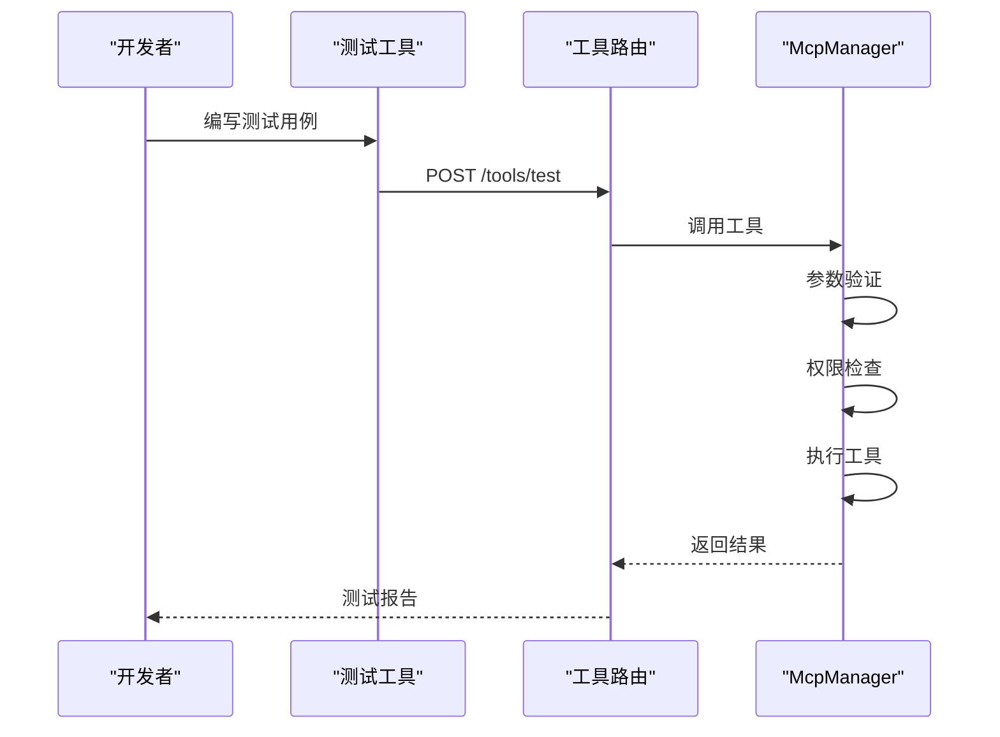

**图表来源**
- [toolsRoutes.js](file://src/services/routes/toolsRoutes.js#L431-L456)

**章节来源**
- [toolsRoutes.js](file://src/services/routes/toolsRoutes.js#L431-L456)
- [logger.js](file://src/core/utils/logger.js#L114-L180)

## 结论

本指南详细介绍了 ChatAI Plugin 的自定义工具开发体系，包括：

1. **开发规范**：标准化的工具接口和参数格式
2. **执行机制**：灵活的工具加载和执行流程
3. **安全控制**：多层次的权限验证和风险控制
4. **配置管理**：完善的工具过滤和预设机制
5. **监控调试**：全面的日志记录和性能监控

通过遵循这些规范和最佳实践，开发者可以构建高质量、安全可靠的自定义工具，为系统提供强大的扩展能力。

## 附录

### 开发最佳实践

1. **工具命名规范**：使用有意义的工具名称和描述
2. **参数设计**：遵循 JSON Schema 标准，提供清晰的参数说明
3. **错误处理**：完善的错误捕获和用户友好的错误信息
4. **性能优化**：合理使用缓存，避免阻塞操作
5. **安全考虑**：严格的权限验证和输入验证

### 版本管理

系统支持工具的版本控制和依赖管理：

- **工具版本**：每个工具文件包含版本信息
- **依赖声明**：通过 package.json 管理第三方依赖
- **兼容性**：向后兼容的工具接口设计

**章节来源**
- [package.json](file://package.json#L1-L53)
- [TOOLS.md](file://docs/TOOLS.md#L1-L50)