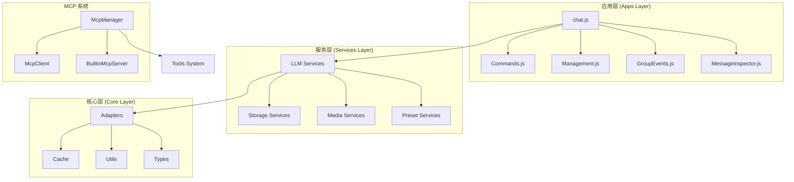
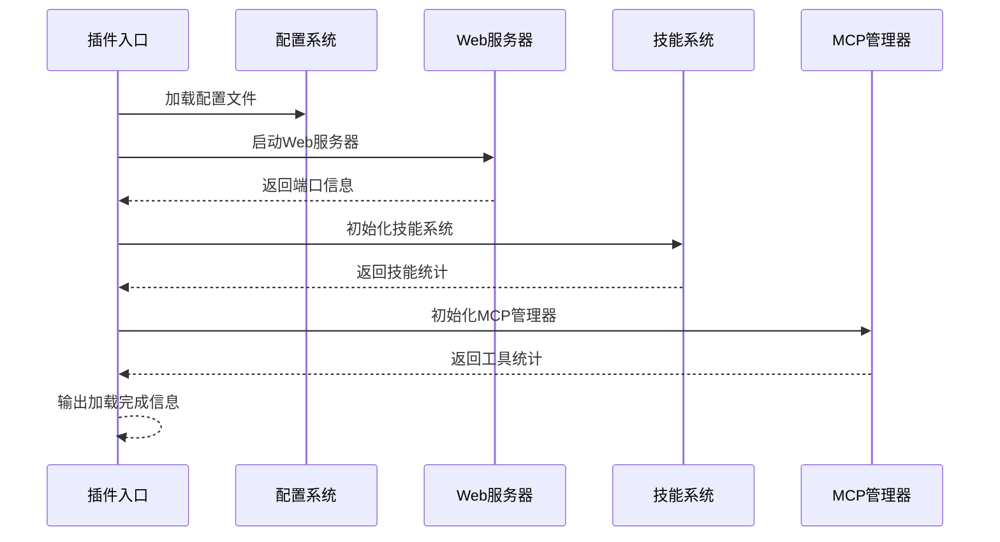
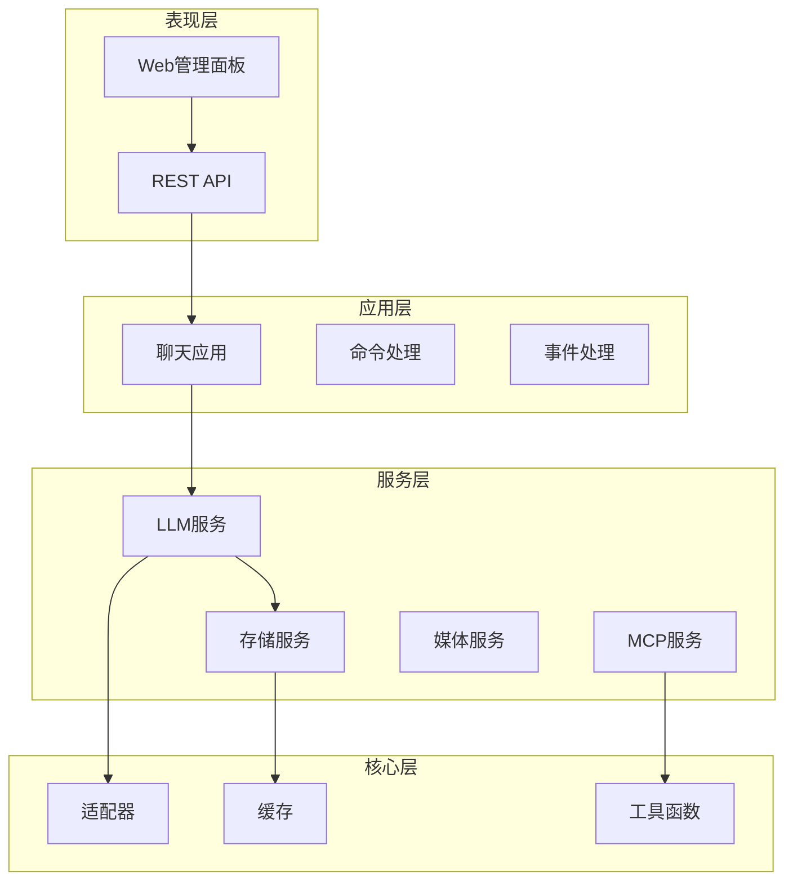
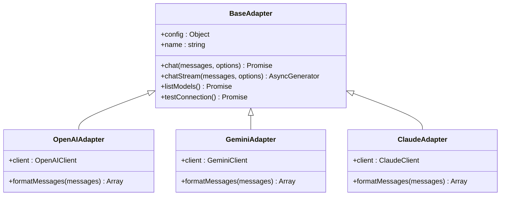
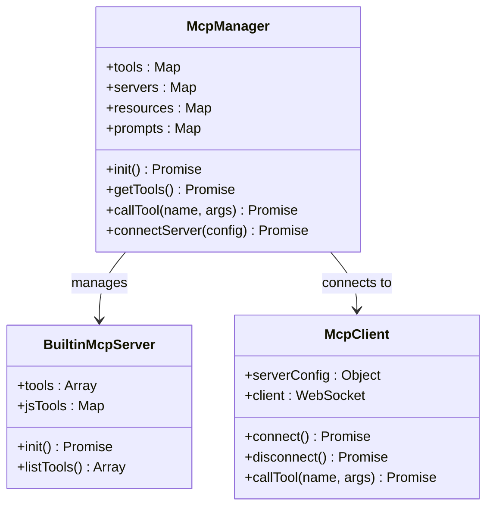
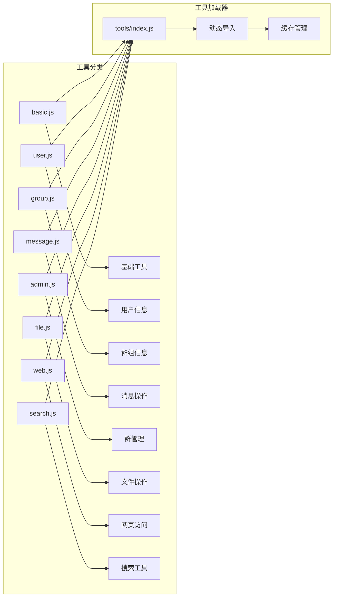
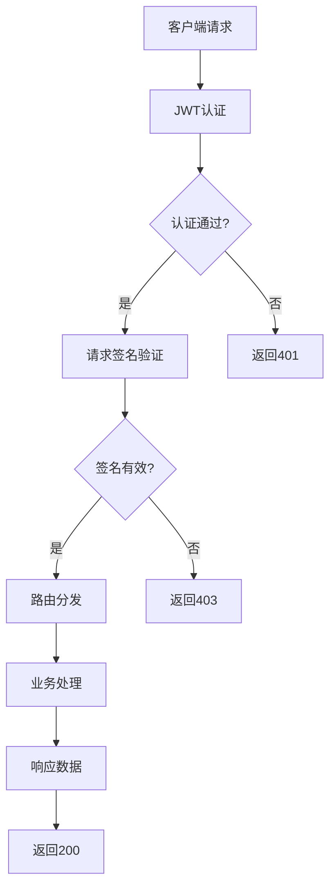

# 开发者指南


## 目录
1. [简介](#简介)
2. [项目结构](#项目结构)
3. [核心组件](#核心组件)
4. [架构概览](#架构概览)
5. [详细组件分析](#详细组件分析)
6. [依赖关系分析](#依赖关系分析)
7. [性能考虑](#性能考虑)
8. [故障排除指南](#故障排除指南)
9. [结论](#结论)
10. [附录](#附录)

## 简介

ChatAI Plugin 是一个基于 Yunzai-Bot 的强大 AI 聊天插件，集成了多种 LLM 模型和丰富的工具调用能力。该项目提供了统一的聊天、预设、工具与长期记忆管理系统，为 Yunzai 带来"全栈 AI"体验。

### 主要特性
- **多模型支持**：OpenAI (GPT-4o/O1)、Google Gemini、Anthropic Claude、DeepSeek、通义千问等
- **MCP 工具调用**：内置 50+ 实用工具，支持 MCP 协议标准，可自定义扩展
- **智能对话管理**：多轮上下文记忆、用户/群组会话隔离、可配置的清理策略
- **长期记忆系统**：自动提取关键信息、向量相似度搜索、用户画像分析
- **Web 管理面板**：可视化配置、实时监控、预设和渠道管理

## 项目结构

项目采用模块化架构设计，主要分为以下几个层次：



**图表来源**
- [index.js](file://index.js#L114-L136)
- [DEVELOPMENT.md](file://docs/DEVELOPMENT.md#L58-L159)

### 目录结构说明

项目采用清晰的分层架构：

- **apps/**：应用模块层，处理具体的业务功能
- **src/core/**：核心模块层，提供基础工具和适配器
- **src/mcp/**：MCP 协议处理层
- **src/services/**：服务层，提供各种业务服务
- **config/**：配置管理
- **data/**：运行时数据存储
- **frontend/**：Next.js 前端管理面板
- **docs/**：项目文档

**章节来源**
- [README.md](file://README.md#L356-L396)
- [DEVELOPMENT.md](file://docs/DEVELOPMENT.md#L58-L159)

## 核心组件

### 插件入口系统

插件入口文件负责初始化整个系统，包括配置加载、Web 服务器启动、技能系统初始化等。



**图表来源**
- [index.js](file://index.js#L35-L174)

### 配置管理系统

配置系统采用 YAML 格式，支持动态加载和热更新，包含完整的默认配置结构。

**章节来源**
- [config.js](file://config/config.js#L18-L627)

### 服务层架构

服务层提供核心业务功能，包括聊天服务、上下文管理、存储服务等。

**章节来源**
- [ChatService.js](file://src/services/llm/ChatService.js#L46-L110)
- [webServer.js](file://src/services/webServer.js#L147-L200)

## 架构概览

项目采用分层架构设计，确保各层职责明确，便于维护和扩展。



**图表来源**
- [DEVELOPMENT.md](file://docs/DEVELOPMENT.md#L19-L54)

## 详细组件分析

### LLM 适配器系统

适配器系统支持多种 LLM 提供商，通过统一接口抽象不同的 API 差异。



**图表来源**
- [DEVELOPMENT.md](file://docs/DEVELOPMENT.md#L169-L199)

### MCP 管理系统

MCP (Model Context Protocol) 系统提供强大的工具调用能力，支持内置工具、自定义 JS 工具和外部 MCP 服务器。



**图表来源**
- [McpManager.js](file://src/mcp/McpManager.js#L27-L192)

### 工具系统架构

工具系统采用模块化设计，按功能分类组织，支持动态加载和热重载。



**图表来源**
- [tools/index.js](file://src/mcp/tools/index.js#L7-L113)

**章节来源**
- [tools/index.js](file://src/mcp/tools/index.js#L1-L181)

### Web 服务器架构

Web 服务器提供 REST API 和管理面板功能，采用 Express.js 框架。



**图表来源**
- [webServer.js](file://src/services/webServer.js#L156-L199)

**章节来源**
- [webServer.js](file://src/services/webServer.js#L1-L200)

## 依赖关系分析

项目采用模块化依赖管理，主要依赖包括：

```mermaid
graph TB
subgraph "核心依赖"
A[express] --> B[Web服务器]
C[axios] --> D[HTTP客户端]
E[yaml] --> F[YAML解析]
G[jsonwebtoken] --> H[JWT认证]
end
subgraph "AI相关"
I[openai] --> J[OpenAI API]
K[@google/generative-ai] --> L[Gemini API]
M[@anthropic-ai/sdk] --> N[Claude API]
end
subgraph "数据库"
O[better-sqlite3] --> P[SQLite数据库]
Q[ioredis] --> R[Redis缓存]
end
subgraph "前端依赖"
S[next] --> T[React框架]
U[tailwindcss] --> V[样式框架]
W[zustand] --> X[状态管理]
end
```

**图表来源**
- [package.json](file://package.json#L16-L45)
- [frontend/package.json](file://frontend/package.json#L13-L53)

**章节来源**
- [package.json](file://package.json#L1-L53)

## 性能考虑

### 缓存策略

系统采用多层缓存策略：
- **Redis 缓存**：用于会话状态、配置数据等
- **内存缓存**：用于频繁访问的工具定义
- **数据库缓存**：SQLite 本地缓存

### 并发处理

- **Promise 并行执行**：插件初始化时并行启动各个组件
- **流式响应**：支持 LLM 流式响应，提升用户体验
- **工具并行执行**：支持多个工具并行调用

### 资源管理

- **连接池管理**：合理管理外部 API 连接
- **内存使用优化**：及时清理不再使用的数据
- **文件句柄管理**：正确关闭文件和网络连接

## 故障排除指南

### 常见安装问题

**问题：构建原生模块失败**
```bash
# 解决方案
cd /path/to/Yunzai
pnpm rebuild better-sqlite3
```

**问题：API 连接失败**
- 检查 API Key 是否正确
- 验证网络连接
- 确认 API 服务可用性

**问题：Web 面板无法访问**
- 检查端口占用情况
- 验证防火墙设置
- 确认服务已正确启动

### 调试技巧

1. **启用调试模式**：在配置中设置 `basic.debug: true`
2. **查看日志**：使用 `chatLogger` 输出详细信息
3. **使用 VSCode 调试**：配置 Node.js 调试环境
4. **网络抓包**：使用浏览器开发者工具分析 API 请求

**章节来源**
- [README.md](file://README.md#L553-L746)

## 结论

ChatAI Plugin 提供了一个功能完整、架构清晰的 AI 聊天解决方案。其模块化设计使得扩展和维护变得相对简单，同时提供了丰富的配置选项和工具调用能力。

### 优势特点
- **架构清晰**：分层设计便于理解和维护
- **扩展性强**：支持自定义工具和适配器
- **配置灵活**：丰富的配置选项满足不同需求
- **性能优化**：多层缓存和并发处理机制

### 发展方向
- **模型支持**：持续增加新的 LLM 模型支持
- **工具生态**：丰富内置工具和第三方集成
- **性能优化**：进一步提升响应速度和资源利用率
- **用户体验**：改进管理面板和交互体验

## 附录

### 开发环境设置

1. **环境要求**
   - Node.js >= 18
   - pnpm >= 8.0
   - Redis (可选)

2. **本地开发步骤**
   ```bash
   # 克隆仓库
   git clone https://github.com/XxxXTeam/chatai-plugin.git
   
   # 安装依赖
   pnpm install
   
   # 构建原生模块
   pnpm rebuild better-sqlite3
   
   # 启动开发服务器
   cd frontend && pnpm dev
   ```

### 贡献指南

1. **代码规范**
   - 使用 ES Modules
   - 遵循命名约定
   - 编写单元测试
   - 提供文档说明

2. **提交规范**
   - 遵循 Conventional Commits
   - 提供清晰的提交信息
   - 包含必要的测试

3. **Pull Request 流程**
   - Fork 仓库
   - 创建特性分支
   - 提交代码
   - 创建 PR 并等待审查

**章节来源**
- [CONTRIBUTING.md](file://CONTRIBUTING.md#L41-L243)
- [DEVELOPMENT.md](file://docs/DEVELOPMENT.md#L489-L785)
