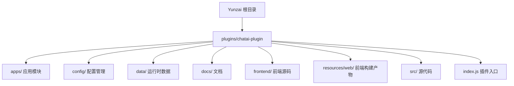
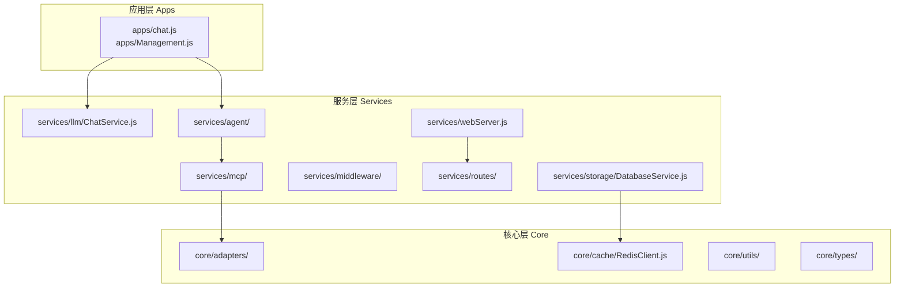
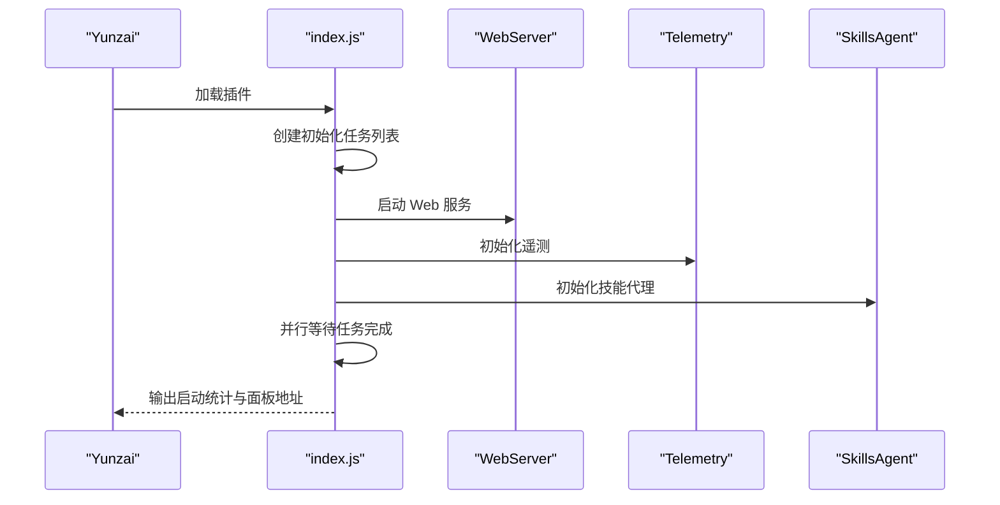
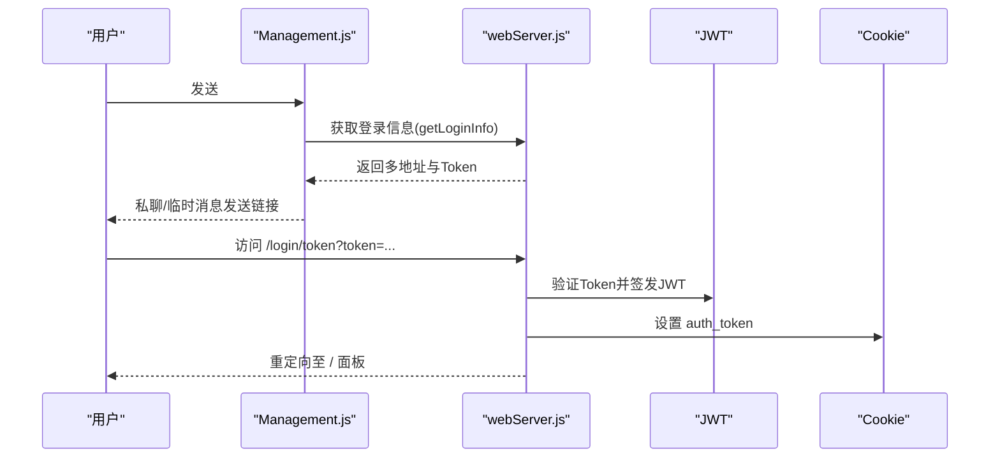
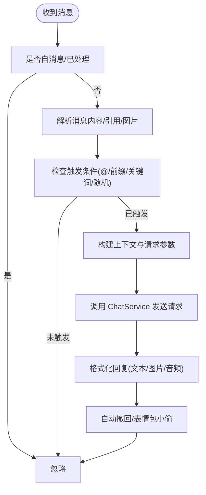
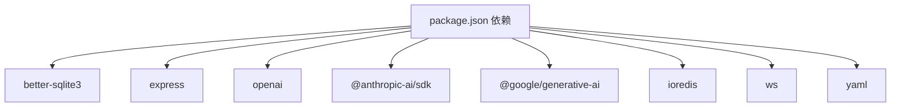

# 快速开始

<cite>
**本文引用的文件**
- [README.md](file://README.md)
- [package.json](file://package.json)
- [index.js](file://index.js)
- [config/config.js](file://config/config.js)
- [src/services/webServer.js](file://src/services/webServer.js)
- [apps/chat.js](file://apps/chat.js)
- [apps/Management.js](file://apps/Management.js)
- [docs/ARCHITECTURE.md](file://docs/ARCHITECTURE.md)
- [docs/DEVELOPMENT.md](file://docs/DEVELOPMENT.md)
- [docs/TOOLS.md](file://docs/TOOLS.md)
</cite>

## 目录
1. [简介](#简介)
2. [项目结构](#项目结构)
3. [核心组件](#核心组件)
4. [架构总览](#架构总览)
5. [详细组件分析](#详细组件分析)
6. [依赖分析](#依赖分析)
7. [性能考虑](#性能考虑)
8. [故障排除指南](#故障排除指南)
9. [结论](#结论)
10. [附录](#附录)

## 简介
本指南面向首次部署 ChatAI 插件的用户，帮助你在 Yunzai-Bot 环境中快速完成安装、构建、启动与初始配置。内容涵盖：
- 环境要求（Node.js 18+、pnpm 8+、Yunzai-Bot V3）
- 安装与依赖构建（含 better-sqlite3 原生模块）
- 首次启动与 Web 管理面板访问
- 基础配置流程（渠道、触发方式、预设）
- 常见安装问题排查（构建失败、编译工具缺失等）

## 项目结构
ChatAI 插件采用模块化分层设计，核心目录与职责如下：
- apps/：应用层模块（消息监听、命令处理、群事件等）
- config/：配置管理与 YAML 配置文件
- data/：运行时数据（SQLite 数据库、自定义工具、预设等）
- docs/：架构、开发与工具开发文档
- frontend/：Next.js 前端源码（开发用）
- resources/web/：前端构建产物（静态资源）
- src/：源代码（核心适配器、MCP 系统、服务层、工具函数）
- index.js：插件入口，负责初始化与加载

图表来源
- [index.js](file://index.js#L1-L258)
- [README.md](file://README.md#L356-L396)

章节来源
- [README.md](file://README.md#L356-L396)
- [index.js](file://index.js#L1-L258)

## 核心组件
- 插件入口与初始化：负责加载配置、启动 Web 服务、初始化技能代理与工具系统，并输出启动统计信息。
- 配置管理：提供 YAML 配置的读取、合并与持久化，支持默认配置与用户覆盖。
- Web 管理面板：基于 Express 提供登录、认证、路由与静态资源服务，支持 TRSS 环境共享端口。
- 应用模块：消息监听与处理（聊天、命令、群事件），触发条件与权限控制。
- MCP 与 Skills Agent：统一工具来源，支持内置工具、自定义 JS 工具与外部 MCP 服务器。

章节来源
- [index.js](file://index.js#L1-L258)
- [config/config.js](file://config/config.js#L1-L631)
- [src/services/webServer.js](file://src/services/webServer.js#L1-L807)
- [apps/chat.js](file://apps/chat.js#L1-L962)
- [apps/Management.js](file://apps/Management.js#L1-L1217)
- [docs/ARCHITECTURE.md](file://docs/ARCHITECTURE.md#L1-L553)

## 架构总览
插件整体架构分为三层：应用层（Apps）、服务层（Services）与核心层（Core）。MCP 系统位于服务层之上，提供统一工具调用接口；Skills Agent 在 MCP 之上进一步抽象业务逻辑。

图表来源
- [docs/DEVELOPMENT.md](file://docs/DEVELOPMENT.md#L19-L160)
- [docs/ARCHITECTURE.md](file://docs/ARCHITECTURE.md#L1-L87)

章节来源
- [docs/DEVELOPMENT.md](file://docs/DEVELOPMENT.md#L19-L160)
- [docs/ARCHITECTURE.md](file://docs/ARCHITECTURE.md#L1-L87)

## 详细组件分析

### 插件入口与初始化流程
- 初始化阶段并行执行多项任务：加载 Segment、启动 Web 服务、遥测服务、技能代理初始化、应用模块加载等。
- Web 服务启动后输出监听地址与端口，支持 TRSS 环境共享端口。
- 技能代理初始化完成后统计内置/自定义/MCP 工具数量，便于运维监控。

图表来源
- [index.js](file://index.js#L17-L174)
- [src/services/webServer.js](file://src/services/webServer.js#L582-L602)

章节来源
- [index.js](file://index.js#L17-L174)
- [src/services/webServer.js](file://src/services/webServer.js#L582-L602)

### Web 管理面板与登录流程
- 生成临时或永久登录 Token，支持多种客户端指纹绑定与时间戳校验。
- 支持 TRSS 环境共享端口，自动识别本地/公网地址并输出多条访问链接。
- 提供 API 路由用于认证、配置、工具、MCP 等管理操作。

图表来源
- [apps/Management.js](file://apps/Management.js#L275-L512)
- [src/services/webServer.js](file://src/services/webServer.js#L341-L449)

章节来源
- [apps/Management.js](file://apps/Management.js#L275-L512)
- [src/services/webServer.js](file://src/services/webServer.js#L341-L449)

### 消息触发与聊天处理流程
- 触发条件支持 @机器人、前缀触发、关键词触发、随机触发等，支持群组独立配置。
- 解析消息内容、引用消息、图片等，构建上下文并调用 ChatService 发送请求。
- 支持数学公式渲染、表情包小偷、自动撤回等增强功能。

图表来源
- [apps/chat.js](file://apps/chat.js#L109-L641)

章节来源
- [apps/chat.js](file://apps/chat.js#L109-L641)

### 配置管理与默认配置
- 配置文件位于 dataDir/../config/config.yaml，若不存在则生成默认配置并合并用户覆盖项。
- 支持基础配置（命令前缀、调试、提示）、触发配置（私聊/群聊、前缀/关键词/随机）、上下文与记忆、MCP、内置工具、伪人模式、绘图、语音等。

章节来源
- [config/config.js](file://config/config.js#L18-L38)
- [config/config.js](file://config/config.js#L62-L586)

## 依赖分析
- 运行时依赖：better-sqlite3（SQLite 原生模块）、express（Web 服务）、openai/anthropic/google 等 LLM SDK、ioredis（可选）、ws（WebSocket）、yaml（配置解析）等。
- 原生模块：better-sqlite3 需要在安装后进行构建，确保 Node.js ABI 兼容。

图表来源
- [package.json](file://package.json#L16-L45)

章节来源
- [package.json](file://package.json#L16-L45)

## 性能考虑
- 上下文长度与清理策略：合理设置 context.maxMessages 与 cleaningStrategy，避免内存膨胀。
- 工具执行：启用并行工具执行（parallelExecution）与工具结果缓存（如可用）提升吞吐。
- 端口占用与共享：TRSS 环境建议共享端口，减少资源占用。
- 调试模式：仅在定位问题时开启，避免影响生产性能。

## 故障排除指南

### 环境与依赖
- Node.js 版本升级后插件加载失败：需重建原生模块（better-sqlite3）。
  - 解决：在 Yunzai 根目录执行 pnpm rebuild 或 pnpm rebuild better-sqlite3。
- pnpm 安装失败（node-gyp 错误）：安装 node-gyp 全局依赖并确保 Python 3 与编译工具可用。
  - 解决：安装 node-gyp，检查 Python 与编译工具版本，清理缓存后重试。

章节来源
- [README.md](file://README.md#L604-L618)
- [README.md](file://README.md#L620-L649)

### better-sqlite3 构建失败
- 现象：启动时报 Could not locate the bindings file。
- 解决：
  - 在 Yunzai 根目录执行 pnpm rebuild better-sqlite3。
  - 进入模块目录手动运行构建脚本或使用 node-gyp 重建。
  - 确保已安装编译工具（Linux/macOS/Windows 对应工具链）。

章节来源
- [README.md](file://README.md#L555-L602)

### 启动时提示数据库初始化失败
- 检查是否已执行 pnpm rebuild better-sqlite3。
- 确认 data/ 目录具有写入权限，必要时删除数据库文件后重启。

章节来源
- [README.md](file://README.md#L651-L663)

### Web 管理面板无法访问
- 端口占用：默认端口 3000，若被占用会尝试下一个端口。
- 防火墙：确保端口已开放。
- TRSS 环境：确认共享端口与挂载路径配置正确。

章节来源
- [src/services/webServer.js](file://src/services/webServer.js#L637-L673)
- [src/services/webServer.js](file://src/services/webServer.js#L607-L632)

### 运行时问题排查
- AI 不回复：检查渠道配置、测试连接、触发方式（at/prefix/both）、控制台日志与是否被其他插件拦截。
- API 401/403：检查 API Key 有效性与权限，确认账户余额充足。
- API 429：配置多渠道实现负载均衡，或降低请求频率。
- 消息重复：检查消息回显与多适配器冲突，插件内置消息去重机制仍需排查上游配置。

章节来源
- [README.md](file://README.md#L665-L722)

## 结论
通过本指南，你可以在 Yunzai-Bot 环境中完成 ChatAI 插件的安装、构建与启动，并通过 Web 管理面板完成基础配置。遇到构建或运行问题时，可依据故障排除指南逐项排查。建议在生产环境中合理配置上下文与工具执行策略，确保性能与稳定性。

## 附录

### 快速开始清单
- 环境要求：Node.js 18+、pnpm 8+、Yunzai-Bot V3
- 克隆插件：在 Yunzai 根目录执行 git clone
- 安装与构建：pnpm install；执行 pnpm approve-builds（或 pnpm rebuild better-sqlite3）
- 启动服务：在 Yunzai 根目录执行 pnpm start 或 node app
- 首次配置：发送 #ai管理面板 获取临时登录链接，或 #ai管理面板 永久 获取永久链接
- 基础配置：添加渠道（API Key/Base URL/模型）、设置触发方式（@/前缀/两者）、配置默认预设

章节来源
- [README.md](file://README.md#L44-L118)

### 常用命令参考
- #ai管理面板：获取临时登录链接
- #ai管理面板 永久：获取永久登录链接
- #结束对话：结束当前对话并清除上下文
- #清除记忆：清除个人记忆数据
- #群管理面板：获取群设置面板
- #ai状态：查看插件运行状态
- #ai调试开启/关闭：切换调试模式
- #ai更新：更新插件到最新版本

章节来源
- [README.md](file://README.md#L141-L201)