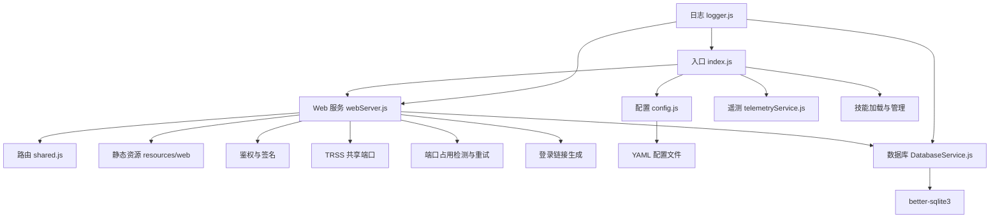
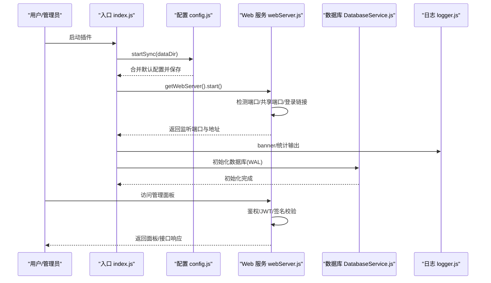
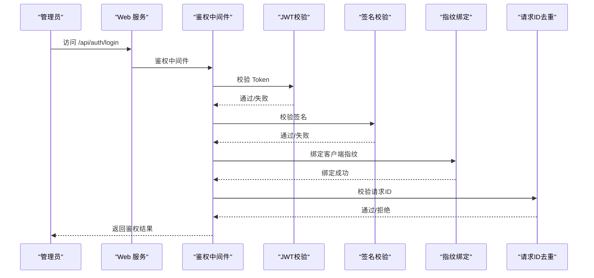
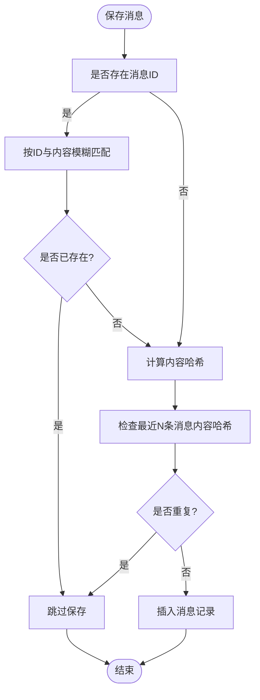
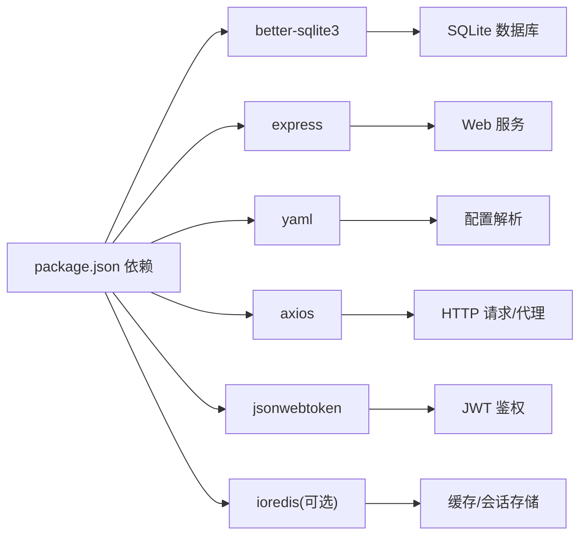
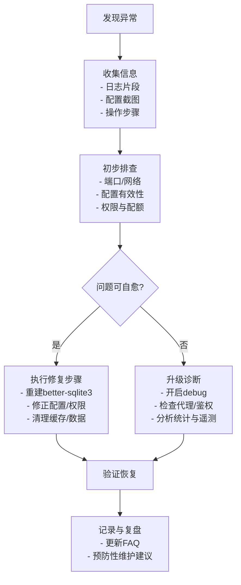

# 故障排除

## 目录
1. [简介](#简介)
2. [项目结构](#项目结构)
3. [核心组件](#核心组件)
4. [架构总览](#架构总览)
5. [详细组件分析](#详细组件分析)
6. [依赖分析](#依赖分析)
7. [性能考虑](#性能考虑)
8. [故障排除指南](#故障排除指南)
9. [结论](#结论)
10. [附录](#附录)

## 简介
本指南面向使用者与管理员，系统化梳理安装、配置与运行时常见问题的诊断与解决流程，覆盖 better-sqlite3 构建失败、API 配置错误、工具调用失败、Web 管理面板无法访问、内存占用过高等场景。文档提供可复用的排查清单、日志分析要点、配置验证步骤与预防性维护建议，并给出标准化的问题处理流程。

## 项目结构
插件采用“入口加载 + 配置中心 + Web 服务 + 存储 + 统计与遥测”的分层设计：
- 入口与初始化：index.js 负责加载 Segment、启动 Web 服务、初始化遥测、加载技能与应用模块。
- 配置中心：config/config.js 提供 YAML 配置读取、合并默认值与持久化。
- Web 服务：src/services/webServer.js 提供 Express 服务、鉴权、静态资源与路由注册。
- 存储：src/services/storage/DatabaseService.js 基于 better-sqlite3，提供消息、记忆、KV 等表。
- 统计与遥测：src/services/stats/StatsService.js 与 src/services/telemetry/TelemetryService.js 统一记录 API 使用、工具调用与实例统计。
- 日志：src/core/utils/logger.js 提供统一日志格式与横幅输出。

图表来源
- [index.js](file://index.js#L1-L258)
- [config/config.js](file://config/config.js#L1-L631)
- [src/services/webServer.js](file://src/services/webServer.js#L1-L807)
- [src/services/storage/DatabaseService.js](file://src/services/storage/DatabaseService.js#L1-L809)
- [src/services/routes/shared.js](file://src/services/routes/shared.js#L1-L150)
- [src/services/telemetry/TelemetryService.js](file://src/services/telemetry/TelemetryService.js#L1-L381)
- [src/core/utils/logger.js](file://src/core/utils/logger.js#L1-L331)

章节来源
- [index.js](file://index.js#L1-L258)
- [config/config.js](file://config/config.js#L1-L631)
- [src/services/webServer.js](file://src/services/webServer.js#L1-L807)
- [src/services/storage/DatabaseService.js](file://src/services/storage/DatabaseService.js#L1-L809)
- [src/services/routes/shared.js](file://src/services/routes/shared.js#L1-L150)
- [src/services/telemetry/TelemetryService.js](file://src/services/telemetry/TelemetryService.js#L1-L381)
- [src/core/utils/logger.js](file://src/core/utils/logger.js#L1-L331)

## 核心组件
- 入口与初始化
  - 加载 Segment（icqq/oicq），准备全局 segment。
  - 同步配置目录与文件，确保 data/config/config.yaml 存在并合并默认值。
  - 启动 Web 服务，打印本地/公网地址与登录链接。
  - 初始化遥测服务，上报版本与启动次数。
  - 并行加载技能与应用模块，输出加载统计与公告。
- 配置管理
  - YAML 解析与默认配置合并，提供 get/set/save。
  - 默认配置覆盖基础、LLM、工具、MCP、Redis、Web、代理、上下文、记忆、预设、触发等。
- Web 服务
  - Express 中间件：CORS、静态资源、JWT 鉴权、请求签名校验、指纹绑定、请求ID去重。
  - 路由注册：系统、配置、渠道、工具、代理、MCP、知识库、图像、日志、记忆、群管、技能等。
  - TRSS 共享端口：与 Yunzai 共享端口，自动挂载路径。
  - 端口占用处理：自动释放与递增尝试。
  - 登录链接：生成临时/永久 Token 并输出到控制台。
- 存储
  - better-sqlite3 WAL 模式，创建消息、记忆、KV 表并建立索引。
  - 提供消息去重、KV 存取、用户设置、会话清理等。
- 统计与遥测
  - 统一记录 API 调用、工具调用、实时 RPM、令牌用量与模型使用排行。
  - 遥测服务上报实例 ID、版本、启动次数与使用摘要。
- 日志
  - 统一日志格式、彩色输出、横幅与统计卡片，便于快速定位问题。

章节来源
- [index.js](file://index.js#L1-L258)
- [config/config.js](file://config/config.js#L1-L631)
- [src/services/webServer.js](file://src/services/webServer.js#L1-L807)
- [src/services/storage/DatabaseService.js](file://src/services/storage/DatabaseService.js#L1-L809)
- [src/services/stats/StatsService.js](file://src/services/stats/StatsService.js#L1-L682)
- [src/services/telemetry/TelemetryService.js](file://src/services/telemetry/TelemetryService.js#L1-L381)
- [src/core/utils/logger.js](file://src/core/utils/logger.js#L1-L331)

## 架构总览

图表来源
- [index.js](file://index.js#L1-L258)
- [config/config.js](file://config/config.js#L1-L631)
- [src/services/webServer.js](file://src/services/webServer.js#L1-L807)
- [src/services/storage/DatabaseService.js](file://src/services/storage/DatabaseService.js#L1-L809)
- [src/core/utils/logger.js](file://src/core/utils/logger.js#L1-L331)

## 详细组件分析

### Web 服务与登录流程
- 鉴权链路
  - JWT 验证（HS256，issuer/audience 校验）。
  - 请求签名验证（X-Signature、X-Timestamp、X-Nonce、X-Body-Hash）。
  - 永久/临时 Token 管理与指纹绑定。
  - 请求ID去重，防止重放。
- 登录与链接
  - 生成临时 Token（5分钟）并输出到控制台。
  - 支持生成/撤销永久 Token。
  - 自动推断本地/公网地址，生成登录链接。
- 端口与共享端口
  - 独立端口：端口占用时自动释放并尝试下一个端口。
  - TRSS 共享端口：与 Yunzai 共享端口，自动挂载路径，静默路径与免鉴权路径配置。

图表来源
- [src/services/webServer.js](file://src/services/webServer.js#L156-L278)
- [src/services/webServer.js](file://src/services/webServer.js#L313-L449)

章节来源
- [src/services/webServer.js](file://src/services/webServer.js#L1-L807)

### 数据库与消息去重
- 初始化
  - 使用插件 data 目录，WAL 模式提升并发。
  - 创建消息、记忆、KV 表并建立索引。
- 消息去重
  - 基于消息 ID 与内容哈希进行去重，避免重复保存与重复触发。
- 记忆与 KV
  - 支持按用户检索、搜索、删除与统计；KV 存取支持 JSON 序列化。

图表来源
- [src/services/storage/DatabaseService.js](file://src/services/storage/DatabaseService.js#L263-L344)

章节来源
- [src/services/storage/DatabaseService.js](file://src/services/storage/DatabaseService.js#L1-L809)

### 配置与默认值
- 默认配置覆盖范围广，包括基础、LLM、工具、MCP、Redis、Web、代理、上下文、记忆、预设、触发等。
- 启动时若配置文件缺失，自动生成默认配置并保存；若存在则与默认配置深合并。

章节来源
- [config/config.js](file://config/config.js#L62-L586)

### 统计与遥测
- 统计服务
  - 记录消息、模型调用、令牌用量、工具调用与实时 RPM。
  - 支持导出与清空统计，提供概览与详细记录查询。
- 遥测服务
  - 上报版本、分支、提交、实例ID与使用摘要。
  - 支持启用/禁用与周期性上报。

章节来源
- [src/services/stats/StatsService.js](file://src/services/stats/StatsService.js#L1-L682)
- [src/services/telemetry/TelemetryService.js](file://src/services/telemetry/TelemetryService.js#L1-L381)

## 依赖分析
- 包依赖
  - better-sqlite3：SQLite 原生模块，用于本地存储。
  - express、cookie-parser、jsonwebtoken：Web 服务与鉴权。
  - axios、http(s)-proxy-agent、socks-proxy-agent：HTTP/代理支持。
  - yaml：配置解析。
- 运行时依赖
  - Node.js >= 18，pnpm >= 8，Redis 可选。
  - better-sqlite3 需要编译工具链，Node.js 升级后需重建。

图表来源
- [package.json](file://package.json#L1-L53)

章节来源
- [package.json](file://package.json#L1-L53)

## 性能考虑
- 上下文与记忆
  - 降低 context.maxMessages 与 context.maxTokens，减少内存占用。
  - 禁用不必要的功能（如记忆、MCP 服务器）。
  - 定期清理对话与过期会话。
- 数据库
  - 使用 WAL 模式提升并发；合理使用索引；定期清理过期数据。
- 日志与统计
  - 调试模式仅在必要时开启；避免高频日志输出。
  - 统计与遥测异步上报，避免阻塞主流程。

## 故障排除指南

### 一、安装与构建问题

- 症状：启动报错 “Could not locate the bindings file”（better-sqlite3）
  - 根因：better-sqlite3 原生模块未编译或 ABI 版本不匹配。
  - 解决步骤：
    1) 在 Yunzai 根目录执行重建：重建 better-sqlite3。
    2) 进入模块目录手动构建：执行构建脚本或使用 node-gyp 重建。
    3) 确保已安装编译工具（Linux/macOS/Windows 对应工具链）。
  - 验证：看到构建成功的提示信息。
  
  章节来源
  - [README.md](file://README.md#L555-L602)
  - [package.json](file://package.json#L21-L21)

- 症状：Node.js 版本升级后插件加载失败
  - 根因：原生模块需针对新 ABI 重新编译。
  - 解决步骤：在 Yunzai 根目录执行重建，或仅重建 better-sqlite3。
  
  章节来源
  - [README.md](file://README.md#L604-L618)

- 症状：pnpm install 报错 node-gyp 失败
  - 根因：Python 版本不符、编译工具缺失或缓存损坏。
  - 解决步骤：
    1) 检查 Python 3.x 是否安装并加入 PATH。
    2) 安装 node-gyp。
    3) 清理 node_modules 与 pnpm store，重新安装。
  
  章节来源
  - [README.md](file://README.md#L621-L649)

- 症状：启动时报 “数据库初始化失败”
  - 根因：better-sqlite3 未正确构建或 data 目录无写权限。
  - 解决步骤：
    1) 确保已执行 better-sqlite3 重建。
    2) 检查 data 目录权限。
    3) 删除数据库文件后重启。
  
  章节来源
  - [README.md](file://README.md#L652-L663)

### 二、运行时问题

- 症状：AI 不回复消息
  - 排查步骤：
    1) 在管理面板确认已添加有效渠道并测试连接。
    2) 检查触发方式（at/prefix/both）与前缀配置。
    3) 查看控制台日志，确认是否有报错。
    4) 检查是否被其他插件拦截，调整插件优先级。
  
  章节来源
  - [README.md](file://README.md#L668-L680)

- 症状：API 返回 401/403
  - 根因：API Key 无效、权限不足或被禁用。
  - 解决步骤：
    1) 在渠道管理重新配置 API Key。
    2) 确认 API Key 有对应模型访问权限。
    3) 检查账户余额与配额。
  
  章节来源
  - [README.md](file://README.md#L683-L692)

- 症状：API 返回 429（请求过多）
  - 根因：超出速率限制。
  - 解决步骤：
    1) 配置多个渠道实现负载均衡。
    2) 在渠道高级设置中配置备选模型。
    3) 降低请求频率或升级套餐。
  
  章节来源
  - [README.md](file://README.md#L695-L703)

- 症状：消息重复
  - 根因：消息回显或多适配器冲突。
  - 解决步骤：
    1) 检查 QQ 协议端配置。
    2) 若使用多适配器，确保消息只被处理一次。
    3) 插件内置消息去重机制，仍异常请提供控制台日志。
  
  章节来源
  - [README.md](file://README.md#L706-L713)

- 症状：工具调用失败或不生效
  - 根因：工具未启用、危险工具权限未开启、机器人权限不足。
  - 解决步骤：
    1) 在管理面板工具配置确认工具已启用。
    2) 开启危险工具权限（allowDangerous）。
    3) 确保机器人具备相应权限。
    4) 开启 debug 模式查看详细日志。
  
  章节来源
  - [README.md](file://README.md#L715-L722)

- 症状：Web 管理面板无法访问
  - 根因：端口被占用、防火墙未放行、TRSS 共享端口路径未正确挂载。
  - 解决步骤：
    1) 检查端口占用情况，确认默认端口 3000 及后续端口尝试。
    2) 开放防火墙端口。
    3) 若在 TRSS 环境，确认共享端口与挂载路径配置。
    4) 查看启动日志中的实际监听地址与端口。
  
  章节来源
  - [README.md](file://README.md#L725-L737)
  - [src/services/webServer.js](file://src/services/webServer.js#L637-L673)

- 症状：内存占用过高
  - 根因：上下文过长、功能未禁用、监听器泄漏。
  - 解决步骤：
    1) 降低 context.maxMessages 与 context.maxTokens。
    2) 禁用不需要的功能（记忆、MCP 服务器）。
    3) 定期清理对话。
    4) 检查 EventEmitter 警告，排查监听器泄漏。
  
  章节来源
  - [README.md](file://README.md#L739-L746)

### 三、配置验证与日志分析

- 配置验证
  - 使用管理面板“系统设置”查看与修改基础、触发、上下文、记忆、代理等配置。
  - 通过“渠道管理”测试连接，确认 API Key、Base URL、模型列表可用。
  - 通过“工具配置”确认工具启用状态与危险工具权限。
- 日志分析
  - 使用统一日志格式，关注启动横幅与模块加载统计。
  - 关注 Web 服务鉴权与签名相关日志，定位登录失败原因。
  - 关注数据库初始化与消息去重日志，定位存储问题。
  - 关注统计与遥测日志，定位 API 使用异常。

章节来源
- [src/core/utils/logger.js](file://src/core/utils/logger.js#L1-L331)
- [src/services/webServer.js](file://src/services/webServer.js#L1-L807)
- [src/services/storage/DatabaseService.js](file://src/services/storage/DatabaseService.js#L1-L809)
- [src/services/stats/StatsService.js](file://src/services/stats/StatsService.js#L1-L682)
- [src/services/telemetry/TelemetryService.js](file://src/services/telemetry/TelemetryService.js#L1-L381)

### 四、标准化问题处理流程

### 五、预防性维护与监控指标

- 预防性维护
  - 定期备份 data 目录（config.yaml、数据库文件、预设与 MCP 配置）。
  - 更新插件后执行 better-sqlite3 重建（如涉及原生模块）。
  - 保持 Node.js 与 pnpm 版本稳定，避免频繁升级。
- 监控指标
  - 实时 RPM（1/5 分钟）、成功率、令牌用量、模型与渠道使用排行。
  - 工具调用错误率与耗时分布。
  - 数据库大小与索引命中率（通过 WAL 与查询计划优化）。

章节来源
- [README.md](file://README.md#L748-L793)
- [src/services/stats/StatsService.js](file://src/services/stats/StatsService.js#L1-L682)
- [src/services/storage/DatabaseService.js](file://src/services/storage/DatabaseService.js#L1-L809)

## 结论
本指南提供了从安装构建到运行时问题的系统化排查方法。通过结合配置验证、日志分析、网络连通性检查与数据库健康度评估，大多数问题可快速定位并解决。建议在生产环境中启用统计与遥测，建立定期备份与版本升级流程，持续优化上下文与功能配置以控制资源占用。

## 附录

### A. 常用命令与路径
- 安装与构建
  - pnpm install
  - pnpm rebuild better-sqlite3
- 启动
  - 在 Yunzai 根目录执行启动命令
- 更新
  - 使用面板命令或手动拉取后执行安装与重建

章节来源
- [README.md](file://README.md#L55-L132)

### B. 版本与环境信息
- 版本信息来源于 Git 与 package.json，可用于问题定位与回溯。

章节来源
- [src/utils/version.js](file://src/utils/version.js#L1-L138)

### C. 开发与测试参考
- 开发环境要求与调试配置可参考开发者文档。

章节来源
- [docs/DEVELOPMENT.md](file://docs/DEVELOPMENT.md#L489-L561)
